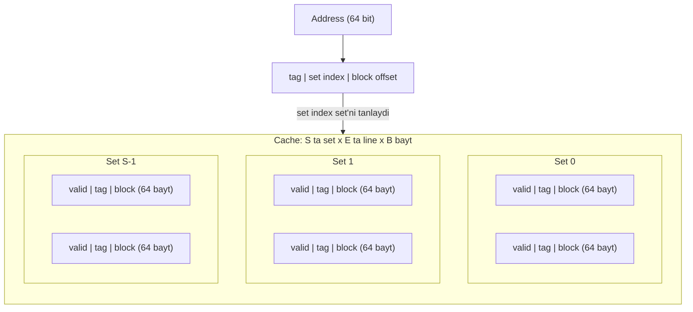
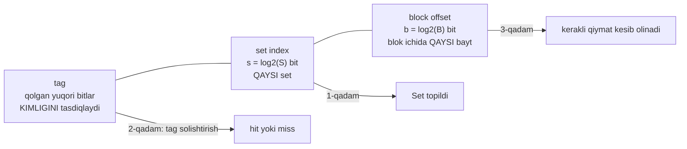
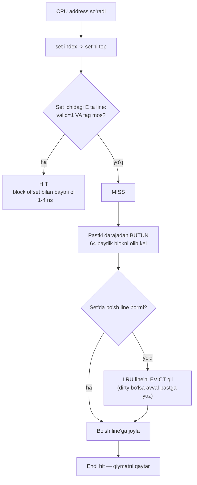
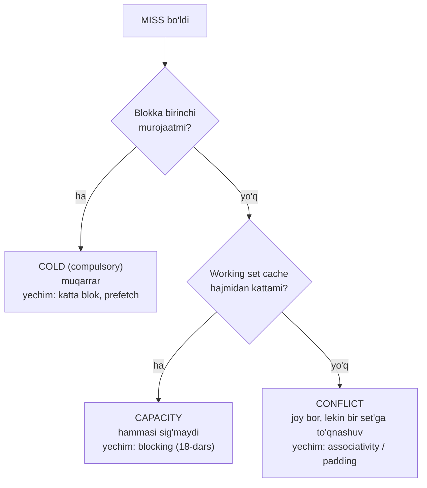

# 17. Cache Memories — set, line, associativity, miss turlari

> Manba: CS:APP 2-nashr, 6.4 · Muhit: performance o'lchovlari native arm64 Apple Silicon (QEMU cache'ni ko'rsatmaydi) · [← Oldingi](16-storage-locality.md) · [Kurs xaritasi](00-README.md) · [Keyingi →](18-cache-friendly-code.md)

## Nima uchun kerak

16-darsda cache "bor" ekanini va locality foydali ekanini o'lchov bilan ko'rdik. Endi cache ICHIGA kiramiz — chunki uning tuzilishini bilmasdan turib nima uchun kod sekin ekanini tushuntirib bo'lmaydi. Cache ma'lumotni bayt-bayt emas, **64 baytlik cache line** bo'laklari bilan tashiydi: shuni bilsangiz struct maydonlari tartibi (10-dars), slice iteratsiyasi va hash table dizayni butunlay boshqacha ko'rinadi.

Undan ham qattiqroq misol: ikkita goroutine mantiqan **butunlay mustaqil** ikki counter'ni oshirsa ham, agar ular bitta cache line ichida yotgan bo'lsa, dastur 10 barobar sekinlashadi — bu **false sharing** va uni faqat cache tuzilishini bilgan odam ko'radi (33-34-darsda concurrency kontekstida qaytamiz). Shu bilan birga, "hajmi cache'ga sig'yapti-ku, nega sekin?" degan savolning javobi ham shu yerda: **conflict miss** va power-of-2 o'lchamlar tuzog'i.

Bu dars cache'ning "qanday izlashi" mexanikasini beradi: address qanday bo'laklarga bo'linadi, cache o'sha bo'laklar bilan nima qiladi, hit va miss qayerdan tug'iladi. 18-darsda shu bilim ustiga cache-friendly kod (matritsa, blocking) quriladi.

## Nazariya

### 1. Cache organizatsiyasi — S sets x E lines x B bytes

Cache — bu "bir katta xotira bloki" emas. U qat'iy uch o'lchovli tuzilma:

- **S** — cache'da nechta **set** (to'plam) bor. Har bir address FAQAT bitta set'ga tegishli.
- **E** — har set ichida nechta **line** (yo'lak) bor. Bu **associativity** (E-way).
- **B** — har line qancha bayt ma'lumot saqlaydi. Bu **block** (yoki cache line) o'lchami — deyarli hamma zamonaviy CPU'da **64 bayt**.

Cache'ning foydali hajmi shunchaki ko'paytma:

> **Cache hajmi = S x E x B**

Har bir line uchta narsadan iborat:

| Qism | Nima | Vazifasi |
| --- | --- | --- |
| **valid bit** | 1 bit | bu line'da umuman haqiqiy ma'lumot bormi (yoki bo'shmi) |
| **tag** | bir necha bit | bu line address makonidagi QAYSI blokni ushlab turibdi |
| **block** | B bayt | ma'lumotning o'zi (64 bayt) |

Tag kerak, chunki bitta set'ga address makonidan juda ko'p blok "moslashadi". Set faqat "qayerga qarash" ni aytadi, tag esa "topilgani AYNAN o'shami" degan savolga javob beradi.



Bu diagrammada E = 2 (har set'da 2 ta line), ya'ni **2-way set-associative** cache.

### 2. Address parselash — tag | set index | block offset

Cache uchun address bitta katta son emas: u **uchta bit maydoni** (02-darsdagi bit maydonlari aynan shu ish uchun kerak edi).

Pastdan yuqoriga:

- **block offset** — eng past `b = log2(B)` bit. "Topilgan 64 baytlik blok ichida menga kerakli bayt qaysi o'rinda?" B = 64 bo'lsa b = 6 bit.
- **set index** — keyingi `s = log2(S)` bit. "Bu address qaysi set'ga tegishli?" S = 64 bo'lsa s = 6 bit.
- **tag** — qolgan barcha yuqori bitlar. "Set ichidagi line AYNAN shu blokmi?"



**Muhim kuzatuv:** set index address'ning O'RTA bitlaridan olinadi, yuqori bitlaridan emas. Nega? Agar set index yuqori bitlardan olinsaydi, ketma-ket joylashgan bloklar (masalan bitta massivning qo'shni qismlari) hammasi BITTA set'ga tushar va darhol bir-birini siqib chiqarar edi. O'rta bitlar esa qo'shni bloklarni **turli set'lar bo'ylab yoyadi** — spatial locality apparat darajasida shu tufayli ishlaydi.

### 3. Cache qanday izlaydi — uch qadam

Bu darsning yuragi. CPU bitta address so'raganda cache aynan shuni bajaradi:

1. **Set tanlash** — set index bitlarini olib, S ta set'dan bittasini tanlaydi. Bu shunchaki indekslash, juda tez.
2. **Tag solishtirish** — o'sha set ichidagi E ta line'ning tag'ini **parallel** (bir vaqtda, apparat komparatorlar bilan) solishtiradi. Agar biror line'da `valid = 1` VA `tag` mos kelsa — bu **hit**.
3. **Block offset bilan kesish** — hit bo'lsa, topilgan 64 baytlik blok ichidan block offset ko'rsatgan bayt(lar) olinadi va CPU'ga qaytariladi.

Agar mos line topilmasa — **miss**. Unda cache pastki darajaga (L2 -> L3 -> RAM) murojaat qiladi, **butun 64 baytlik blokni** olib keladi va set'ga joylashtiradi. Set to'la bo'lsa, birini **evict** qilish (siqib chiqarish) kerak — odatda **LRU** (least recently used, eng uzoq vaqt ishlatilmagani) siyosati bilan.



> Cache bitta bayt so'ralganda ham HAR DOIM butun 64 baytlik cache line'ni olib keladi. Ana shu — spatial locality'ning apparatdagi aniq granularligi.

### 3.5. Qadamma-qadam trace — cache "izlash"ni qo'lda bajaramiz

Mexanikani chinakam o'zlashtirishning yagona yo'li — bir marta qo'lda bajarish. Kichkina cache olamiz:

**S = 4 set, E = 1 line/set (direct-mapped), B = 16 bayt.** Hajm = 4 x 1 x 16 = **64 bayt**.

Bitlar: b = log2(16) = **4 bit** (block offset), s = log2(4) = **2 bit** (set index), qolgani tag.

Address'ni parselash qoidasi shunday bo'ladi (past 8 bitni ko'rsatamiz):

```
[ ... tag ... | set index (2 bit) | block offset (4 bit) ]
```

Qo'lda hisoblash formulalari (10 lik sanoqda oson):

- blok raqami = address / 16
- set index = (blok raqami) mod 4
- tag = (blok raqami) / 4

Endi `0, 4, 20, 36, 8, 20` address ketma-ketligini o'qiymiz (cache boshida bo'sh — hamma valid = 0):

| # | Address | Blok raqami | Set index | Tag | Set'da nima bor edi | Natija | Sabab |
| --- | --- | --- | --- | --- | --- | --- | --- |
| 1 | 0 | 0 | 0 | 0 | bo'sh (valid=0) | **MISS** | COLD — birinchi murojaat |
| 2 | 4 | 0 | 0 | 0 | tag 0 (bor) | **HIT** | 4 ham 0-blok ichida (offset 4) |
| 3 | 20 | 1 | 1 | 0 | bo'sh | **MISS** | COLD |
| 4 | 36 | 2 | 2 | 0 | bo'sh | **MISS** | COLD |
| 5 | 8 | 0 | 0 | 0 | tag 0 (bor) | **HIT** | 8 ham 0-blok ichida (offset 8) |
| 6 | 20 | 1 | 1 | 0 | tag 0 (bor) | **HIT** | 3-qadamda yuklangan edi |

Ikki muhim kuzatuv:

1. **2 va 5-qadamlar hit** — chunki 0, 4, 8 address'lari BITTA 16 baytlik blok ichida. Bitta miss keyingi murojaatlarni bepul qildi. Bu — spatial locality apparatda qanday ishlashi.
2. **Miss'lar hammasi COLD** — hech narsa evict bo'lmadi, chunki bloklar turli set'ga tushdi (0, 1, 2).

Endi ketma-ketlikni ozgina o'zgartiramiz: `0, 64, 0, 64` (bu direct-mapped cache'ning eng og'riqli holati):

| # | Address | Blok raqami | Set index | Tag | Natija | Sabab |
| --- | --- | --- | --- | --- | --- | --- |
| 1 | 0 | 0 | 0 | 0 | **MISS** | COLD |
| 2 | 64 | 4 | 0 | 1 | **MISS** | COLD; set 0 band -> **0-blokni EVICT qiladi** |
| 3 | 0 | 0 | 0 | 0 | **MISS** | **CONFLICT** — hozirgina evict qilingan edi |
| 4 | 64 | 4 | 0 | 1 | **MISS** | **CONFLICT** — yana evict |

Hamma murojaat miss. Diqqat qiling: cache'da 4 ta set bor, ulardan **3 tasi butunlay bo'sh turibdi** — lekin 0 va 64 ikkalasi ham set 0 ga moslashadi (chunki 0 mod 4 = 0 va 4 mod 4 = 0). Bu **thrashing** va bu toza **conflict miss**: joy bor, lekin noto'g'ri joyda.

> Agar bu cache 2-way (E = 2) bo'lganida, 0 va 64 bitta set ichida yonma-yon yashay olardi va 3-4 qadamlar HIT bo'lardi. Associativity aynan shuning uchun bor.

### 4. Associativity — E ning uch holati

E (har set'dagi line soni) cache xarakterini butunlay o'zgartiradi.

**Direct-mapped (E = 1).** Har set'da bitta line, ya'ni har address cache'da BITTA joyga tushadi. Solishtirish bitta — juda tez va arzon apparat. Kamchiligi: bir set'ga moslashuvchi ikki blokni navbatma-navbat ishlatsangiz, ular bir-birini cheksiz siqib chiqaradi (**thrashing**), garchi cache'ning qolgan qismi BO'SH tursa ham.

**Set-associative (E = 2, 4, 8, 16).** Har set'da bir necha line. Blok o'sha set ichidagi ISTALGAN line'ga tusha oladi. Bir set'ga moslashuvchi 2-3 blok endi tinch birga yashaydi. Bu — amaliy standart (zamonaviy L1 odatda 8-way).

**Fully-associative (S = 1, E = hamma line).** Blok cache'ning istalgan joyiga tusha oladi, conflict miss umuman yo'q. Lekin HAMMA tag'ni parallel solishtirish kerak — apparat qimmat va sekin. Shuning uchun faqat kichik cache'larda ishlatiladi: TLB (24-darsda ko'ramiz — u ham cache) tipik misol.

| Tur | E | Solishtirish | Conflict miss | Apparat | Qayerda |
| --- | --- | --- | --- | --- | --- |
| direct-mapped | 1 | 1 ta | ko'p | arzon, tez | eski / oddiy cache |
| set-associative | 2-16 | E ta parallel | kam | o'rtacha | L1/L2/L3 (standart) |
| fully-associative | hammasi | hammasi parallel | yo'q | qimmat | TLB, kichik buferlar |

Spektrni bir jumlada eslab qoling: direct-mapped = 1-way set-associative; fully-associative = (hamma line)-way set-associative. Uchtasi bitta formulaning uch nuqtasi.

### 5. Miss turlari — 3 C (cold, conflict, capacity)

Har bir miss uch sababdan biri bilan tug'iladi. Ularni ajratish MUHIM, chunki har birining yechimi butunlay boshqacha.

**COLD miss (compulsory / majburiy).** Blokka BIRINCHI marta murojaat qilinyapti — u cache'da hech qachon bo'lmagan. Muqarrar: hech qanday dizayn buni yo'q qila olmaydi. Faqat KAMAYTIRISH mumkin: katta blok (64 bayt) bitta miss'da 16 ta `int` olib keladi, demak keyingi 15 tasi hit bo'ladi. Hardware prefetcher ham cold miss'ni oldindan yopishga urinadi.

**CONFLICT miss.** Cache'da BO'SH JOY BOR, lekin kerakli bloklar hammasi BITTA set'ga moslashadi va bir-birini siqib chiqaradi. Bu associativity yetishmasligining natijasi. Eng mashhur ko'rinishi: massiv o'lchami yoki stride **2 ning darajasi** bo'lganda, murojaatlar set index bo'ylab yoyilmay, oz sonli set'ga to'planadi. Yechim: associativity oshirish (apparat ishi) yoki **padding** bilan o'lchamni biroz o'zgartirish (dasturchi ishi — masalan 1024 o'rniga 1025).

**CAPACITY miss.** **Working set** (dastur faol ishlatayotgan ma'lumot hajmi) cache sig'imidan katta. Cache'ga hamma narsa shunchaki sig'maydi, shuning uchun evict muqarrar. Yechim: working set'ni kichraytirish — 18-darsdagi **blocking / tiling** aynan shu ish.



Farqni bir jumlada ushlang: **cold** = hali kelmagan; **capacity** = sig'maydi; **conflict** = sig'adi, lekin noto'g'ri joyga tushdi.

### 5.5. Miss rate nega shunchalik qimmat — kichik raqamning katta narxi

Miss turlarini bilganimiz bilan, "3% miss — bu ozgina-ku" degan tuyg'u qoladi. Raqam bilan tekshiramiz. O'rtacha murojaat narxi:

```
o'rtacha narx = hit narxi + (miss rate x miss jarimasi)
```

L1 hit ~1 ns, RAM'dan olib kelish (miss jarimasi) ~60 ns bo'lsin (Demo 2 dagi real raqam):

| Hit rate | Miss rate | O'rtacha narx | Ideal (100% hit) ga nisbatan |
| --- | --- | --- | --- |
| 99% | 1% | 1 + 0.01 x 60 = **1.6 ns** | 1.6x sekin |
| 97% | 3% | 1 + 0.03 x 60 = **2.8 ns** | 2.8x sekin |
| 90% | 10% | 1 + 0.10 x 60 = **7.0 ns** | 7x sekin |
| 50% | 50% | 1 + 0.50 x 60 = **31 ns** | 31x sekin |

99% dan 97% ga tushish — "atigi 2%" — dasturni deyarli **2 barobar** sekinlashtiradi. Sabab oddiy: miss shunchalik qimmatki (60x), o'rtacha narxni bir nechta miss ham boshqarib ketadi. Shuning uchun cache optimizatsiyasida kurash foizning kasr qismlari uchun boradi.

> Miss rate chiziqli o'zgaradi, lekin uning narxi miss jarimasiga KO'PAYTIRILADI. "Bir necha foiz" hech qachon "bir necha foiz sekinlashuv" degani emas.

### 6. Write policy — yozish qanday ishlaydi

O'qish oddiy: hit bo'lsa oldik. Yozish murakkabroq — chunki endi cache'dagi nusxa bilan pastdagi asl nusxa bir-biriga mos kelmay qolishi mumkin.

**Write hit** (yozmoqchi bo'lgan blok cache'da bor):

| Siyosat | Nima qiladi | Ortiqchasi | Kamchiligi |
| --- | --- | --- | --- |
| **write-through** | har yozishda DARHOL pastga ham yozadi | oddiy, cache doim pastki daraja bilan bir xil | har yozish bus trafigi |
| **write-back** | faqat cache'ga yozadi, line'ni **dirty bit** bilan belgilaydi; pastga faqat **evict** paytida yozadi | trafik kam, tez | murakkab, coherence kerak |

Amaliy CPU'lar deyarli har doim **write-back** ishlatadi — chunki bitta line'ga ketma-ket 10 marta yozilsa, pastga 10 emas, 1 marta boriladi.

**Write miss** (yozmoqchi bo'lgan blok cache'da yo'q):

- **write-allocate** — avval blokni cache'ga olib keladi, keyin cache'da yozadi. Write-back bilan juftlashadi (keyingi yozishlar ham shu line'ga tushish ehtimoli katta — temporal locality).
- **no-write-allocate** — cache'ni chetlab, to'g'ridan-to'g'ri pastga yozadi. Write-through bilan juftlashadi.

> Zamonaviy standart juftlik: **write-back + write-allocate**. Dirty line pastga faqat evict bo'lganda tushadi.

### 7. Cache line — spatial locality granularligi

Bu darsning eng amaliy xulosasi. Cache line = 64 bayt = **spatial locality qanchalik "keng" ishlashining aniq o'lchovi**.

- 64 bayt = 16 ta `int32` = 8 ta `int64`/`float64` = 8 ta pointer (64-bit tizimda).
- Bitta `int64` so'ralsa, uning atrofidagi 7 ta qo'shni `int64` HAM cache'ga keladi — bepul.
- Agar siz ularni keyin ishlatsangiz — 1 miss, 7 hit. Ishlatmasangiz — 8 baytdan foyda oldingiz, 56 bayt bandwidth bekorga ketdi.

Aynan shu hisob keyingi bo'limda o'lchov bilan isbotlanadi.

## Kod va isbot

Muhit: **native arm64 Apple Silicon** (QEMU emulyatsiyasi cache ta'sirini ko'rsatmaydi — bu o'lchovlar HAQIQIY apparatda olingan). Kompilyator: `gcc -O1`.

### Demo 1 — cache line o'lchamini O'LCHOV bilan aniqlash (stride cliff)

Nazariyada "cache line 64 bayt" dedik. Buni datasheet o'qimasdan, faqat vaqt o'lchab isbotlash mumkin. 32 MB massivni turli **stride** (qadam) bilan kezamiz va har bir TEGILGAN element narxini o'lchaymiz:

```c
for (int rep = 0; rep < 16; rep++)
    for (int i = 0; i < N; i += stride)
        sum += a[i];        /* stride bilan kezish */
```

Diqqat: stride oshgani sari tegiladigan element soni kamayadi — shuning uchun jami vaqt emas, **element boshiga ns** ustuniga qarash kerak.

```
Stride (int) | jami vaqt (bir xil N element makonini kezadi)
   1 int (  4 bayt) | 0.059 s  (0.44 ns/element)
   2 int (  8 bayt) | 0.029 s  (0.43 ns/element)
   4 int ( 16 bayt) | 0.014 s  (0.43 ns/element)
   8 int ( 32 bayt) | 0.009 s  (0.54 ns/element)
  16 int ( 64 bayt) | 0.009 s  (1.09 ns/element)
  32 int (128 bayt) | 0.011 s  (2.56 ns/element)
```

Bu jadval — butun darsning apparatdagi isboti. Uni bosqichma-bosqich o'qiymiz.

**Stride 1-4 (4-16 bayt): har element ~0.43 ns — ARZON.** Nega? Cache line 64 bayt = 16 ta `int`. Bitta line yuklanganda undagi elementlarning HAMMASI ishlatiladi: bitta miss narxi 16 ta (stride 4 da esa 4 ta) foydali murojaatga taqsimlanadi. Ustiga hardware prefetcher ketma-ket naqshni ko'rib, keyingi line'ni oldindan tortadi.

**Stride 16 (= 64 bayt = AYNAN bitta cache line): 1.09 ns — CLIFF!** Narx birdan ~2 barobar sakradi. Sabab aniq: endi har bir element BOSHQA cache line'da. Har murojaat yangi 64 baytni tortadi, undan faqat 4 bayt ishlatiladi — **qolgan 60 bayt bekorga**. Miss narxi endi hech kimga taqsimlanmaydi.

**Stride 32 (128 bayt): 2.56 ns.** Har murojaat yana yangi line, ustiga prefetcher uchun naqsh qiyinlashdi (bir necha line'ni sakrab o'tish kerak) — narx yana ikki barobar.

> Cliff AYNAN 64 baytda boshlanadi. Bu tasodif emas: cliff nuqtasi cache line o'lchamini o'lchov bilan ANIQLAYDI. arm64 (Apple Silicon) va x86-64 da cache line = 64 bayt.

Amaliy xulosa: **stride cache line'dan oshgan payt bandwidth'ingiz behuda keta boshlaydi.** Ma'lumot strukturasini shunday joylashtiring-ki, bitta line'dagi baytlarning imkon qadar ko'pi ishlatilsin.

### Demo 2 — capacity miss'ning tirik ko'rinishi (latency tier'lar)

16-darsdagi pointer chasing o'lchovini endi cache TUZILISHI ko'zi bilan qayta o'qiymiz (o'sha native arm64 mashina):

```
Working set | latency (ns/murojaat, pointer chasing)
        8 KB |   1.3 ns   (L1/L2 cache)
      128 KB |   1.3 ns   (L1/L2)
      512 KB |   4.7 ns   (L2)
     8192 KB |   9.2 ns   (L3)
    32768 KB |  60.0 ns   (RAM - capacity miss)
   131072 KB | 126.6 ns   (RAM)
```

Bu pog'onalarning har biri — **capacity miss'ning boshlanishi**:

- Working set 128 KB gacha: L1/L2 ga sig'adi, deyarli hamma murojaat hit — 1.3 ns.
- 512 KB: L1 sig'imidan oshdi, ma'lumot L2 dan olinadi — 4.7 ns.
- 32 MB: hamma cache darajasidan oshdi. Ma'lumot cache'dan **evict** qilinadi va keyingi aylanishda RAM'dan QAYTA olinadi — 60 ns. Bu aynan capacity miss: ma'lumot bir marta cache'da BOR EDI, lekin sig'im yetmagani uchun siqib chiqarildi.

Har bir "cliff" — navbatdagi cache darajasining SIG'IMIDAN oshgan nuqta. Boshqacha aytganda, bu grafik cache HAJMLARINI ham o'lchov bilan ko'rsatib beradi.

**Ikki demo, ikki tushuncha:** Demo 1 cache LINE (B) ni ko'rsatdi, Demo 2 cache HAJMI (S x E x B) ni. Birinchisi spatial locality haqida, ikkinchisi temporal locality va working set haqida.

## Go dasturchiga ko'prik

Go'da `cache` degan til konstruksiyasi yo'q — lekin cache tuzilishi Go kodining tezligiga to'g'ridan-to'g'ri ta'sir qiladi.

**1. Struct layout va cache line (10-dars).** 10-darsda struct padding'ni alignment nuqtai nazaridan ko'rgan edik. Endi ikkinchi sabab qo'shiladi: struct 64 baytdan kichik bo'lsa va cache line chegarasini kesib o'tmasa, uni o'qish BITTA cache miss. Agar u ikkita line'ga bo'linib tushsa — IKKITA miss. Katta slice'dagi struct'larni ketma-ket kezish cache uchun ideal naqsh: har miss keyingi bir necha struct'ni bepul olib keladi. Aksincha `[]*Item` (pointer slice) — har element heap'da boshqa joyda, har biri alohida miss va prefetcher yordam bera olmaydi.

**2. FALSE SHARING — eng qimmat cache tuzog'i.** Ikki goroutine ikki TURLI maydonni yozadi; mantiqan hech qanday umumiy ma'lumot yo'q, mutex ham kerak emas, race detector jim. Lekin agar o'sha ikki maydon BIR cache line ichida yotsa:

- Core A o'z maydonini yozish uchun butun line'ni **exclusive** holatga oladi (MESI protokoli).
- Bu core B dagi o'sha line nusxasini **invalidatsiya** qiladi.
- Core B o'z maydonini yozmoqchi bo'lsa, line'ni qaytadan tortib oladi va A dagisini invalidatsiya qiladi.
- Line core'lar orasida **ping-pong** qiladi. Har yozish L1 hit narxidan cache coherence trafigi narxiga ko'chadi.

Natija: mantiqan mustaqil ikki goroutine apparatda bir-birini bo'g'adi — odatda 5-20 barobar sekinlashuv. Bu **false sharing**: haqiqiy "sharing" yo'q, lekin apparat uni sharing deb biladi, chunki MESI **line granularligida** ishlaydi, o'zgaruvchi granularligida emas.

**Yechim — padding.** Har goroutine yozadigan qiymatni o'z cache line'iga surib qo'yish: struct'ga qo'shimcha `[64]byte` (yoki qolgan joyni to'ldiruvchi `_ [56]byte`) maydon qo'shib, elementlar orasini 64 baytdan katta qilish. Yoki — odatda eng yaxshi yechim — har goroutine lokal o'zgaruvchida ishlab, oxirida BIR marta umumiy joyga yozadi.

**3. Go runtime allaqachon shunday qilgan.** Bu akademik nozik nuqta emas, Go runtime dizaynining o'zagi:

- **Per-P run queue** — scheduler har P (processor) uchun alohida navbat ushlaydi, bitta umumiy navbat emas. Sabablardan biri aynan cache line contention.
- **`sync.Pool`** — per-P shard'larga bo'lingan, shuning uchun core'lar bir-birining line'ini invalidatsiya qilmaydi.
- Runtime kodida cache line padding uchun maxsus konstanta va `pad` maydonlari bevosita false sharing'dan himoya uchun turadi.

33-34-darsda concurrency mavzusida bu ko'prikka qaytamiz — o'shanda "atomic counter nega sekin" savolining javobi allaqachon tayyor bo'ladi.

## Real-world scenariylar

### Scenariy 1 — counter massivi va false sharing

Klassik naqsh: N ta goroutine, har biri `counters[i]` ni oshiradi, keyin yig'indi olinadi. Mantiqan mukammal parallel kod — lock yo'q, umumiy ma'lumot yo'q, har goroutine o'z indeksiga tegadi.

Amalda: `counters` — `[]int64`, ya'ni 8 baytlik elementlar. Bitta 64 baytlik cache line'ga **8 ta counter** sig'adi. Demak 8 ta goroutine bitta line'ni ping-pong qiladi. Parallel kod ketma-ket koddan SEKIN chiqadi — CPU vaqtining ko'p qismi cache coherence trafigiga ketadi.

Tuzatish: har counter'ni o'z line'iga surish (element o'lchamini 64 baytga yetkazuvchi padding), yoki umuman umumiy massivdan voz kechib, goroutine ichida lokal yig'ib, oxirida bir marta qo'shish. Ikkinchi yo'l odatda yaxshiroq: coherence trafigi umuman yo'qoladi.

### Scenariy 2 — hash table va DB index'ni cache line'ga moslash

Yuqori tezlikdagi hash table va B-tree index'lar cache line'ni asosiy dizayn birligi deb oladi:

- **Kalitlarni bitta line'ga zichlash.** Agar hash bucket'dagi kalitlar (yoki ularning qisqa hash prefikslari) 64 bayt ichiga sig'sa — bucket'ni tekshirish BITTA cache miss. Go map bucket'i (8 ta slot + tophash baytlari) aynan shu mulohaza bilan tuzilgan: tophash massivi zich yotadi, shuning uchun 8 ta slot'ni saralashga 8 emas, taxminan 1 ta miss ketadi.
- **B-tree node o'lchami.** DB index node'lari cache line va page o'lchamiga moslab tanlanadi: node qanchalik ko'p kalit ushlasa, daraxt shunchalik past, murojaat shunchalik kam.
- **Struct of arrays vs array of structs.** Faqat bitta maydon bo'yicha skanerlash kerak bo'lsa (analytics: faqat `price`), maydonlarni alohida massivlarga ajratish har cache line'ni 100% foydali ma'lumot bilan to'ldiradi. Bu columnar DB (masalan ClickHouse) mantiqi: array of structs'da har line'ning katta qismi kerak bo'lmagan maydonlar bilan to'ladi.

### Scenariy 3 — power-of-2 o'lchamlar va conflict miss

Eng nozik va eng ko'p uchraydigan tuzoq. Matritsani ustun bo'ylab kezayotgan kodni tasavvur qiling: `a[i][j]` da `i` oshadi. Ketma-ket murojaatlar orasidagi masofa (stride) = qator uzunligi x element o'lchami.

Agar matritsa o'lchami **2 ning darajasi** bo'lsa (masalan 1024 x 1024 `float64`, qator = 8192 bayt), stride ham 2 ning darajasi bo'ladi. Endi set index address'ning o'rta bitlaridan olinishini eslang: stride 2 ning katta darajasi bo'lganda o'sha o'rta bitlar **o'zgarmay qoladi** — demak barcha murojaatlar oz sonli set'ga tushadi. Cache'ning katta qismi bo'sh turadi, o'sha bir necha set esa doim thrashing qiladi. Bu toza **conflict miss**.

Tuzatish kulgili darajada oddiy: qatorni bittaga uzaytiring — 1024 o'rniga **1025** ustun ajrating (yoki har qatorga kichik padding qo'shing). Endi stride 2 ning darajasi emas, murojaatlar set'lar bo'ylab yoyiladi va conflict miss yo'qoladi. Bir necha baytlik "isrof" ba'zan 2-3 barobar tezlik beradi.

Xuddi shu sabab bilan yuqori unumdorlikdagi kutubxonalar buferlarni ataylab 2 ning darajasi EMAS o'lchamda ajratadi yoki boshlanish address'ini biroz siljitadi.

## Zamonaviy yondashuv

**Tipik zamonaviy cache geometriyasi** (taxminiy; CPU modeliga qarab o'zgaradi):

| Daraja | Hajm | Associativity | Latency | Kim ulashadi |
| --- | --- | --- | --- | --- |
| **L1d** | 32-48 KB (Apple Silicon'da 128 KB gacha) | 8-way | ~1-4 sikl | har core alohida |
| **L2** | 256 KB - 2 MB (arm64 da bir necha MB bo'lishi mumkin) | 8-16 way | ~10-20 sikl | core yoki core klasteri |
| **L3 / SLC** | 8-32 MB | 12-16 way | ~40-70 sikl | hamma core umumiy |
| **cache line** | **64 bayt** (ba'zi arm64 tizimlarda 128 bayt) | — | — | coherence birligi |

**Cache coherence (MESI).** Ko'p core'li tizimda har core'ning o'z L1'i bor — demak bir xil address bir necha cache'da yotishi mumkin. MESI protokoli har line'ni to'rt holatdan birida ushlaydi: **M**odified (men o'zgartirdim, faqat menda), **E**xclusive (faqat menda, toza), **S**hared (bir necha cache'da, toza), **I**nvalid (yaroqsiz). Yozish uchun line M yoki E holatga o'tishi kerak — bu boshqalardagi nusxani Invalid qiladi. **False sharing to'g'ridan-to'g'ri shu mexanizmdan tug'iladi**, chunki MESI o'zgaruvchini emas, LINE'ni kuzatadi.

**Inclusive vs exclusive.** Inclusive cache'da L2 dagi hamma narsa L3 da ham bor (evict boshqaruvi oson, lekin joy isrof bo'ladi). Exclusive'da har blok faqat bitta darajada yotadi (samarali sig'im ko'proq). Ko'p zamonaviy CPU'lar aralash siyosat ishlatadi.

**Hardware prefetcher.** CPU murojaat naqshini kuzatadi (ketma-ket stride, oldinga yoki orqaga) va keyingi line'ni oldindan tortadi. Shuning uchun Demo 1 da stride 1-4 shunchalik arzon: prefetcher cold miss'ni yashiradi. Prefetcher tasodifiy naqshni (pointer chasing, linked list) bashorat qila olmaydi — Demo 2 dagi 126 ns aynan shuning uchun.

**O'lchash.** Linux'da `perf stat -e cache-references,cache-misses,L1-dcache-load-misses ./prog` bilan miss'larni to'g'ridan-to'g'ri sanash mumkin; `cachegrind` esa cache'ni simulyatsiya qiladi. macOS'da Instruments (Counters shabloni) shu vazifani bajaradi. Cache geometriyani ko'rish: Linux'da `lscpu -C` yoki `/sys/devices/system/cpu/cpu0/cache/`, macOS'da `sysctl hw.cachelinesize hw.l1dcachesize`.

**NUMA.** Ko'p soketli serverlarda RAM ham core'ga "yaqin" va "uzoq" bo'ladi. Uzoq NUMA node'dan o'qish 1.5-2 barobar qimmatroq. Bu memory hierarchy'ning cache'dan keyingi davomi — katta serverlarda thread'ni va uning ma'lumotini bitta node'da ushlash muhim.

## Keng tarqalgan xatolar

**1. "Cache — bitta katta tez xotira bloki."** Yo'q: cache = **S ta set x E ta line x B bayt** tuzilma, va address'ning qaysi set'ga tushishi qat'iy belgilangan. Shu tuzilmani bilmasangiz conflict miss'ni hech qachon tushunmaysiz — "hajm sig'yapti-ku, nega sekin?" degan savolda qotib qolasiz.

**2. False sharing'ni e'tiborsiz qoldirish.** "Ikki goroutine turli o'zgaruvchini yozyapti, race yo'q, mutex kerak emas — demak muammo yo'q." Race yo'q, TO'G'RI. Lekin apparat coherence'ni **cache line granularligida** boshqaradi: mantiqan mustaqil ikki maydon bir line'da bo'lsa, core'lar line'ni ping-pong qiladi. Kod to'g'ri, natija to'g'ri — tezlik 10 barobar tushgan.

**3. "Ma'lumot cache hajmiga sig'sa, u cache'da qoladi."** Har doim emas. Bloklar set'lar bo'ylab tekis taqsimlanmasa, ba'zi set'lar to'lib, bir-birini siqib chiqaradi — cache'ning qolgan qismi BO'SH turgan holda. Bu **conflict miss** va u sig'adigan working set'da ham bemalol sodir bo'ladi.

**4. Power-of-2 o'lcham va stride tuzog'i.** Dasturchilar 1024, 4096, 65536 kabi "chiroyli" o'lchamlarni yaxshi ko'radi. Cache uchun bu ko'pincha eng yomon tanlov: 2 ning darajasidagi stride set index bitlarini o'zgartirmay qoldiradi va murojaatlarni oz sonli set'ga to'plab, thrashing yaratadi. Ba'zan **1025** — 1024 dan tezroq.

**5. Cache line'ni 4 yoki 8 bayt deb taxmin qilish.** "Men faqat 8 baytlik `int64` o'qidim, demak 8 bayt keldi." Yo'q — **64 bayt** keldi. Bu ham xushxabar (qo'shnilar bepul keldi), ham yomon xabar (stride katta bo'lsa bandwidth'ning 90% i behuda). Demo 1 dagi cliff shuni isbotlaydi.

**6. "LRU har doim aniq ishlaydi."** Amaliy cache'lar toza LRU emas, uning arzon taqribiy variantini (pseudo-LRU) ishlatadi, chunki 8-way set uchun aniq LRU tartibini ushlash apparatga qimmat. Nozik hollarda evict tanlovi siz kutgandan farq qilishi mumkin.

## Amaliy mashqlar

### Mashq 1 — cliff nega aynan 64 baytda?

Demo 1 da stride 8 (32 bayt) da narx 0.54 ns, stride 16 (64 bayt) da 1.09 ns. Nega sakrash aynan shu yerda va nega taxminan 2 barobar?

<details>
<summary>Yechim</summary>

Cache line 64 bayt. Stride 8 int = 32 bayt bo'lganda bitta 64 baytlik line'dan **2 ta** element ishlatiladi (offset 0 va 32) — miss narxi 2 ga bo'linadi. Stride 16 int = 64 bayt bo'lganda har element **alohida** line'da — miss narxi hech kimga bo'linmaydi, ya'ni element boshiga narx ~2 barobar oshadi (0.54 -> 1.09).

Aynan shu sakrash nuqtasi cache line o'lchamini beradi: cliff qayerda boshlansa, line o'lchami o'sha. Undan keyin (stride 32 = 128 bayt) narx yana oshadi (2.56 ns), chunki endi prefetcher ham ketma-ket line naqshini yo'qotadi.
</details>

### Mashq 2 — cache geometriyasi

L1d cache: **32 KB, 8-way set-associative, B = 64 bayt**. Nechta set bor? Address'ning nechta biti set index, nechta biti block offset bo'ladi?

<details>
<summary>Yechim</summary>

Hajm = S x E x B, demak:

S = 32768 / (8 x 64) = 32768 / 512 = **64 set**

Bitlar:
- block offset: b = log2(B) = log2(64) = **6 bit**
- set index: s = log2(S) = log2(64) = **6 bit**
- tag: 64-bitli address uchun 64 - 6 - 6 = **52 bit**

Ya'ni address'ning eng past 12 biti (6 + 6) cache ichida "qayerga qarash"ni belgilaydi, qolgan 52 bit "u aynan o'shami"ni tasdiqlaydi.
</details>

### Mashq 3 — address parselash

Yuqoridagi cache (S = 64, E = 8, B = 64) uchun `0x1F40` address'ini parselang: block offset, set index va tag qanday bo'ladi?

<details>
<summary>Yechim</summary>

0x1F40 ning past 16 biti: `0001 1111 0100 0000`.

- **block offset** = eng past 6 bit = `000000` = **0** (blok boshidagi bayt)
- **set index** = keyingi 6 bit = `111101` = **61** (61-set)
- **tag** = qolgan yuqori bitlar = `01` = **1**

Tekshirish o'nlik sonlar bilan: 0x1F40 = 8000. Blok raqami = 8000 / 64 = 125. Set index = 125 mod 64 = **61** (mos keldi). Tag = 125 / 64 = **1** (mos keldi).
</details>

### Mashq 4 — conflict yoki capacity?

Cache 32 KB. Dastur 8 KB working set bilan aylanma (loop) ishlaydi, lekin miss rate yuqori. Bu qaysi miss turi va nega?

<details>
<summary>Yechim</summary>

Working set (8 KB) cache hajmidan (32 KB) 4 barobar KICHIK — demak **capacity miss emas**. Birinchi aylanishdan keyin bloklar allaqachon cache'da bo'lishi kerak — demak **cold miss ham emas** (cold faqat birinchi aylanishda bo'ladi).

Qoladi: **conflict miss**. Ma'lumot bloklari set'lar bo'ylab tekis yoyilmagan — ehtimol stride yoki massiv o'lchami 2 ning darajasi va murojaatlar oz sonli set'ga to'planyapti. Yechim: padding bilan o'lchamni o'zgartirish (masalan 1024 -> 1025) yoki ma'lumot joylashuvini qayta ko'rib chiqish.
</details>

### Mashq 5 — false sharing nega sekin?

Ikki goroutine, ikki TURLI `int64` o'zgaruvchi, race detector jim, mutex yo'q. Nega bunday kod ketma-ket versiyadan sekin bo'lishi mumkin?

<details>
<summary>Yechim</summary>

Chunki cache coherence (MESI) **o'zgaruvchi emas, LINE granularligida** ishlaydi. Ikki `int64` (8 + 8 = 16 bayt) bemalol bitta 64 baytlik cache line ichida yotishi mumkin.

Core A o'z o'zgaruvchisiga yozish uchun butun line'ni Modified/Exclusive holatga oladi — bu core B dagi nusxani **Invalid** qiladi. B yozmoqchi bo'lganda line'ni qaytarib tortadi va A dagisini invalid qiladi. Line core'lar orasida **ping-pong** qiladi; har yozish L1 hit narxi o'rniga coherence trafigi narxiga tushadi.

Dasturda haqiqiy "sharing" yo'q — bu **false sharing**. Yechim: padding bilan o'zgaruvchilarni turli cache line'ga surish, yoki har goroutine lokal o'zgaruvchida yig'ib, oxirida bir marta umumiy joyga yozish.
</details>

### Mashq 6 — write-back nega yutadi?

Bitta cache line ichidagi qiymatga 100 marta ketma-ket yoziladi. Write-through va write-back siyosatlarida pastki darajaga nechta yozish boradi?

<details>
<summary>Yechim</summary>

- **write-through**: har yozishda darhol pastga ham yoziladi — **100 ta** yozish (write buffer yumshatishi mumkin, lekin siyosat bo'yicha 100).
- **write-back**: faqat cache'ga yoziladi, line **dirty** deb belgilanadi. Pastga faqat line **evict** bo'lganda tushadi — **1 ta** yozish.

Shuning uchun zamonaviy CPU'lar write-back + write-allocate ishlatadi. Narxi: cache va pastki daraja vaqtincha mos kelmaydi, demak dirty bit va coherence protokoli (MESI) kerak bo'ladi.
</details>

### Mashq 7 — struct dizayni

Sizda `[]Point` bor, `Point struct { X, Y float64 }` (16 bayt). Bitta cache line'ga nechta `Point` sig'adi? Agar `[]*Point` ishlatsangiz nima o'zgaradi?

<details>
<summary>Yechim</summary>

`[]Point`: har `Point` 16 bayt, cache line 64 bayt -> **4 ta Point** bitta line'da. Ketma-ket kezishda 1 miss = 4 ta struct — spatial locality mukammal, prefetcher ham to'liq ishlaydi.

`[]*Point`: slice endi 8 baytlik pointer'lar massivi. Bitta line'ga 8 ta pointer sig'adi, LEKIN har pointer heap'dagi boshqa joyga ko'rsatadi. Har `Point` ni o'qish uchun yana bitta murojaat kerak — va u boshqa cache line'da, ehtimol allocator ularni tarqoq joylashtirgan. Natija: pointer chasing (Demo 2 dagi 60-126 ns rejimi), prefetcher bashorat qila olmaydi.

Xulosa: qiymat slice'i (`[]Point`) cache uchun deyarli har doim pointer slice'idan (`[]*Point`) yaxshiroq.
</details>

## Cheat sheet

| Tushuncha | Nima | Eslab qolish |
| --- | --- | --- |
| **S** | set'lar soni | "qayerga qarash" — set index bilan tanlanadi |
| **E** | har set'dagi line soni = **associativity** | E=1 direct-mapped, E=8 tipik L1 |
| **B** | line (block) o'lchami, bayt | deyarli har doim **64** |
| **Cache hajmi** | **S x E x B** | 32 KB, 8-way, B=64 -> S = 32768/512 = **64 set** |
| **tag** | address'ning yuqori bitlari | "bu AYNAN o'sha blokmi?" |
| **set index** | address'ning O'RTA bitlari, s = log2(S) | "qaysi set?" — o'rta bitlar qo'shnilarni yoyadi |
| **block offset** | address'ning past bitlari, b = log2(B) | "blok ichida qaysi bayt?" |
| **valid bit** | line bo'sh emasmi | miss'ning eng oddiy sababi |
| **Izlash** | set index -> tag solishtir -> block offset | 3 qadam; E ta tag parallel solishtiriladi |
| **direct-mapped** | E = 1 | tez, arzon, conflict ko'p |
| **set-associative** | E = 2-16 | amaliy standart (L1/L2/L3) |
| **fully-associative** | S = 1, E = hammasi | conflict yo'q, qimmat — TLB (24-dars) |
| **COLD miss** | birinchi murojaat | muqarrar; katta blok + prefetch yumshatadi |
| **CONFLICT miss** | joy bor, lekin bir set'ga to'qnashuv | associativity yoki **padding** (1024 -> 1025) |
| **CAPACITY miss** | working set > cache hajmi | **blocking / tiling** (18-dars) |
| **write-through** | darhol pastga yozadi | oddiy, trafik ko'p |
| **write-back** | dirty bit; pastga evict paytida yozadi | **standart** (+ write-allocate) |
| **evict / LRU** | line'ni siqib chiqarish | dirty bo'lsa avval pastga yoziladi |
| **cache line 64 bayt** | spatial locality granularligi | = 16 int32 = 8 int64 = 8 pointer |
| **stride cliff** | stride >= 64 bayt -> narx sakraydi | cliff line o'lchamini **o'lchab** beradi |
| **false sharing** | bir line'dagi turli maydonlar, turli core | mantiqan mustaqil, apparatda to'qnashuv |
| **MESI** | Modified / Exclusive / Shared / Invalid | coherence LINE granularligida — false sharing shundan |

## Qo'shimcha manbalar

- [Cache placement policies — Wikipedia](https://en.wikipedia.org/wiki/Cache_placement_policies) — direct-mapped, set-associative va fully-associative mapping'ning aniq formulalari va misollari.
- [3 Types of Cache Misses: Compulsory, Capacity and Conflict — OpenGenus](https://iq.opengenus.org/compulsory-capacity-and-conflict-misses/) — 3 C modelining har biriga alohida misollar va yechimlar.
- [False Sharing, Cache Coherency (MESI) and Padding — studyplan.dev](https://www.studyplan.dev/concurrency-vectorization/cache-coherency-false-sharing) — MESI holatlari va padding bilan false sharing'ni tuzatish (misollar C++ da, lekin mexanizm Go'da ham aynan shunday).
- CS:APP 2-nashr, 6.4 — cache simulyatori mashqi (`csim`) shu bo'limning eng foydali amaliyoti.
