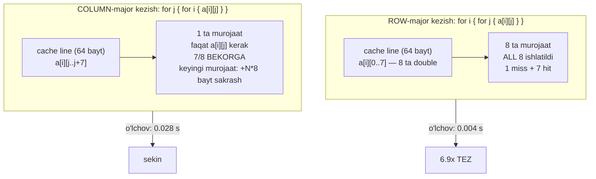
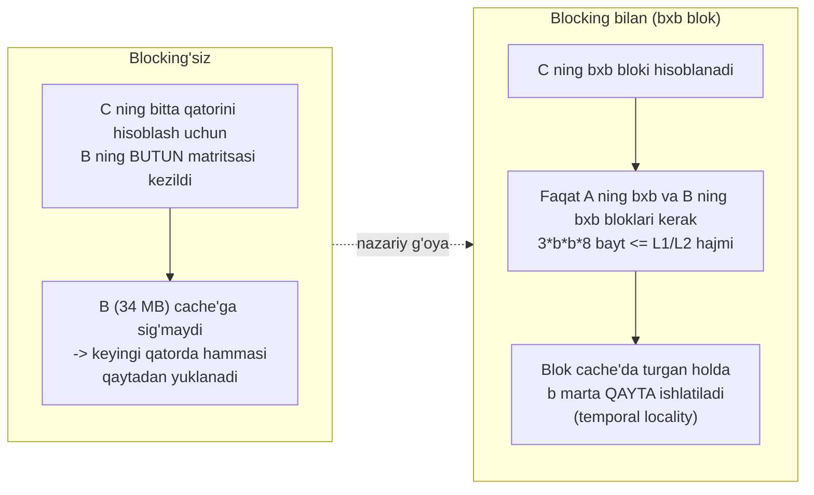
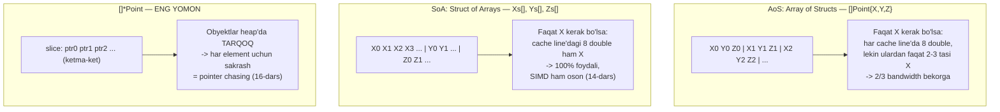
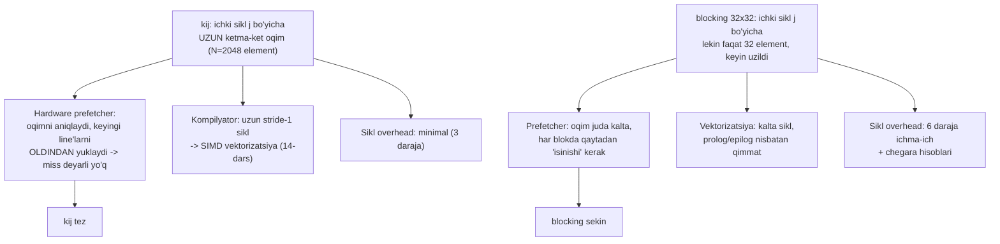

# 18. Cache-Friendly Kod — tartib, blocking va Go amaliyoti

> Manba: CS:APP 2-nashr, 6.5-6.6 · Muhit: barcha o'lchovlar native arm64 Apple Silicon (QEMU cache'ni ko'rsatmaydi), gcc 13.3.0, go 1.22.2 · [← Oldingi](17-cache-memories.md) · [Kurs xaritasi](00-README.md) · [Keyingi →](19-static-linking.md)

## Nima uchun kerak

Ikki funksiya bir xil algoritmni bajaradi, bir xil sondagi ko'paytirish va qo'shish amallarini qiladi, bir xil natijani qaytaradi — lekin biri ikkinchisidan **14.5 barobar** tez. Farq faqat uchta sikl qaysi tartibda yozilganida. Go tomonida esa `[]*Point` o'rniga `[]Point` ishlatish bir xil maydonni o'qishda **24 barobar** tezlik beradi.

Bu 6-bobning butun amaliy hosili. 16-darsda locality nima ekanini, 17-darsda cache qanday qurilganini ko'rdik — endi ularni **kodga aylantiramiz**. Hot loop optimizatsiyasida bitta eng katta ryag shu: algoritmni emas, **ma'lumotga murojaat tartibini** o'zgartirish.

Va yana bir muhim narsa: bu darsda kitob (2011) o'rgatgan asosiy usullardan biri — blocking — bizning 2026 apparatimizda **yutmasligini** halol ko'rsatamiz. Bu tasodif emas, bu darsning eng qimmatli sabog'i.

---

## Nazariya

### 1. Cache-friendly kod uchta printsip

CS:APP buni juda aniq ta'riflaydi. Cache-friendly kod yozish — bu sehr emas, uchta oddiy qoida:

**(a) Ichki sikllarga e'tibor bering.** Dastur vaqtining katta qismi eng ichki sikllarda o'tadi. Tashqi sikl bir marta ishlaydi, ichki sikl million marta. Demak, optimizatsiya diqqati faqat u yerda bo'lishi kerak (15-darsdagi profiling aynan shu joyni topib beradi).

**(b) Ketma-ket (stride-1) kezing.** Har bir cache miss butun cache line'ni (64 bayt) yuklaydi. Agar siz keyingi murojaatda o'sha line ichidagi qo'shni elementni so'rasangiz — bu **bepul hit**. Agar sakrab ketsangiz — line bekorga yuklangan.

**(c) Working set'ni kichik tuting.** Ichki sikl bir aylanishda tegadigan ma'lumot hajmi cache'ga sig'sa — u qayta ishlatiladi (temporal locality). Sig'masa — har aylanishda hammasi qaytadan yuklanadi.

> **Bitta jumlada:** har bir yuklangan cache line'dan **maksimal** foydalan, uni chiqarib yuborishdan oldin.

### 2. 2D massiv layout — row-major

C'da (va Go'da ham) 2D massiv **row-major** tartibda saqlanadi (10-darsda ko'rgan edik): butun 0-qator, keyin butun 1-qator, va hokazo.

```
a[3][4] xotirada:
indeks:  0    1    2    3    4    5    6    7    8    9   10   11
element a00  a01  a02  a03 | a10  a11  a12  a13 | a20  a21  a22  a23
        \___ 0-qator ____/  \___ 1-qator ____/  \___ 2-qator ____/
```

Demak `a[i][j]` va `a[i][j+1]` — **qo'shni** (8 bayt farq, double uchun). Ammo `a[i][j]` va `a[i+1][j]` orasida butun bitta qator bor: `N*8` bayt.

Bundan bevosita amaliy qoida chiqadi:

> **Row-major massivda ichki sikl `j` (ustun indeksi) bo'yicha bo'lishi shart.**

### 3. Cache line ishlatilishi — vizual



Bu 6.9x — **sof cache effekti**. Element soni bir xil, amallar soni bir xil, natija bir xil.

### 4. Loop reordering

Uchta ichma-ich sikl (`i`, `j`, `k`) matritsa ko'paytirishda 6 xil tartibda yozilishi mumkin. Hammasi **matematik jihatdan bir xil** natija beradi — chunki qo'shish kommutativ va har bir `C[i][j]` bir xil hadlar yig'indisi.

Ammo har tartib xotiraga **butunlay boshqacha** murojaat naqshini beradi:

| Tartib | Ichki sikl | A ga murojaat | B ga murojaat | C ga murojaat |
|---|---|---|---|---|
| `ijk` | `k` | qator bo'ylab (stride-1) | **ustun bo'ylab (stride-N)** | registr (o'zgarmas) |
| `kij` | `j` | registr (o'zgarmas) | qator bo'ylab (stride-1) | qator bo'ylab (stride-1) |
| `jki` | `i` | ustun (stride-N) | registr | ustun (stride-N) |

`kij` da ichki siklda **ikkala** massiv ham stride-1 — bu eng yaxshi variant. Buni ko'rasiz: 14.5x.

### 5. Blocking (tiling)

G'oya: butun matritsani bir yo'la kezish o'rniga, uni cache'ga sig'adigan kichik **bloklarga** bo'lamiz va blok ichidagi ma'lumotni to'liq qayta ishlatib bo'lgunimizcha uni cache'da ushlab turamiz.



Nazariy jihatdan bu chiroyli. **Amalda 2026 apparatida esa** — pastda halol o'lchov bor va u kitobga zid chiqadi.

### 6. Data layout — AoS va SoA

Massivning har elementi bir necha maydonli struct bo'lsa, ikki xil joylashtirish mumkin:



### 7. Va eng muhim printsip

> **O'LCHA, taxmin qilma** (15-dars). Zamonaviy apparatda (out-of-order execution, hardware prefetcher, SIMD, uch darajali cache) intuitsiya muntazam aldaydi. Quyidagi 3-demo buni og'riqli aniqlikda ko'rsatadi.

---

## Kod va isbot

Barcha o'lchovlar **native arm64** (Apple Silicon) da olingan. Bu muhim: emulyatsiya (QEMU) real cache ierarxiyasini modellashtirmaydi, u yerda bu farqlar **umuman ko'rinmaydi**.

### Demo 1 — Row-major vs column-major kezish (6.9x)

Bir xil massiv, bir xil elementlar, bir xil yig'indi. Farq faqat kezish tartibida.

```c
/* ROW-major: qator bo'ylab - qo'shni elementlar (cache-friendly) */
for (int i = 0; i < N; i++)
    for (int j = 0; j < N; j++)
        sum += a[i*N + j];

/* COLUMN-major: ustun bo'ylab - har murojaat N*8 bayt sakraydi */
for (int j = 0; j < N; j++)
    for (int i = 0; i < N; i++)
        sum += a[i*N + j];
```

```
$ gcc -O1 stride.c -o stride && ./stride
Matritsa 2048x2048 (34 MB), bir xil 4194304 element:
  Row-major (qator bo'ylab, cache-friendly): 0.004 s
  Column-major (ustun bo'ylab):              0.028 s
  Sekinlashuv: 6.9x
```

**Nima bo'lyapti:**

- **Row-major:** `a[i][j]` va `a[i][j+1]` qo'shni. Bitta cache line = 64 bayt = **8 ta double**. Bitta miss bo'ladi, keyingi **7 ta murojaat hit**. Ustiga-ustak, murojaat naqshi ketma-ket bo'lgani uchun hardware prefetcher keyingi line'ni oldindan yuklab qo'yadi — miss ham deyarli bepulga aylanadi.
- **Column-major:** `a[i][j]` dan `a[i+1][j]` ga o'tishda `N*8 = 16384` bayt sakraladi. Har murojaat — **yangi cache line**, undan **faqat 1 ta** element ishlatiladi, qolgan **7 tasi bekorga** yuklanadi. Prefetcher esa bunday katta stride'da samarasiz.

Ya'ni column-major variant xuddi o'sha ishni qilish uchun taxminan **8 barobar ko'p xotira bandwidth** sarflaydi. 6.9x sekinlashuv aynan shundan.

### Demo 2 — Loop reordering: sikl tartibi 14.5x beradi

Klassik matritsa ko'paytirish, N=1024.

```c
/* ijk: klassik - B ustun bo'ylab kezadi (yomon locality) */
for (i) for (j) {
    s = 0;
    for (k) s += A[i*N+k] * B[k*N+j];   /* B[k*N+j]: k oshadi -> stride-N */
    C[i*N+j] = s;
}

/* kij: ikkala matritsa ham QATOR bo'ylab (yaxshi locality) */
for (k) for (i) {
    r = A[i*N+k];                        /* registrda - sikl davomida o'zgarmaydi */
    for (j) C[i*N+j] += r * B[k*N+j];    /* C va B ikkalasi ham stride-1 */
}
```

```
$ gcc -O2 mm.c -o mm && ./mm
Matritsa ko'paytirish 1024x1024 (bir xil 2147483648 amal):
  ijk (klassik, B ustun bo'ylab): 3.359 s  (1.0x)
  kij (qator bo'ylab):            0.232 s  (14.5x tez)
  blocking 32x32 (tiling):        0.314 s  (10.7x tez)
  tekshiruv C[0]=2048 (kutilgan 2048)
```

**Bu darsning markaziy raqami.** 14.5x — bitta ham amal kamaymagan holda. `C[0]=2048` tekshiruvi ikkala variant ham **aynan bir xil natija** berganini isbotlaydi.

Nega:

| | `ijk` ichki sikli (`k` bo'yicha) | `kij` ichki sikli (`j` bo'yicha) |
|---|---|---|
| `A` | `A[i*N+k]` — stride-1, yaxshi | `A[i*N+k]` — **registrda**, murojaat yo'q |
| `B` | `B[k*N+j]` — **stride-N**, har safar yangi line | `B[k*N+j]` — stride-1, line to'liq ishlatiladi |
| `C` | registrda (`s`) | `C[i*N+j]` — stride-1 |
| Natija | ichki siklda 1 ta og'ir miss oqimi | ichki siklda **ikkita** ketma-ket oqim |

`kij` da ichki sikl ikkita uzun **stride-1 oqim** beradi. Bu prefetcher uchun ideal, kompilyator uchun esa vektorizatsiya qilish oson (14-dars: bitta `r` skalyar butun vektorga ko'paytiriladi — klassik SIMD naqsh). `ijk` da ichki sikl `B` ni ustun bo'ylab kezadi — prefetch ham, SIMD ham ishlamaydi.

---

## Halol bo'lim: blocking 2026 apparatida yutmaydi

Kitob (2011) blocking'ni memory hierarchy optimizatsiyasining cho'qqisi sifatida o'rgatadi. Biz uni sinadik. Natija kitobga **zid** chiqdi — va bu darsning eng qimmatli qismi.

### Blocking'ga adolatli imkon berdik

Faqat bitta blok o'lchamini sinash halol emas. Shuning uchun N=2048 da bir necha variant sinaldi. Ichki `j` sikli **to'liq qator** bo'yicha qoldirildi — ya'ni blocking'ga eng qulay shart (uzun ketma-ket oqim buzilmaydi, faqat `i` va `k` bloklanadi):

```
N=2048, kij (baza): 2.95 s
  blocking (i,k)  64x 64, j to'liq: 3.26 s (0.90x)  C[0]=4096
  blocking (i,k) 128x128, j to'liq: 3.18 s (0.93x)  C[0]=4096
  blocking (i,k) 256x256, j to'liq: 3.15 s (0.94x)  C[0]=4096
```

Va sof 32x32 blocking (uchala o'lcham ham bloklangan, kitobdagi klassik variant):

```
N=2048: kij 2.78 s -> blocking 32x32: 4.40 s  (0.63x - ANCHA sekin)
```

Barcha variantlar `C[0]=4096` — natijalar to'g'ri, taqqoslash adolatli.

### Xulosa: blocking bu apparatda `kij` dan HECH QACHON yutmadi (0.63x — 0.94x)

N=1024 da ham xuddi shunday manzara: blocking 10.7x, `kij` esa 14.5x — ya'ni blocking `ijk` dan yaxshi, lekin oddiy `kij` dan **sekinroq**.

### Nega?



Sabab uchta:

1. **Hardware prefetcher.** 2011 dagi apparatga nisbatan 2026 prefetcher'lari ancha kuchli. `kij` uzun stride-1 oqim beradi — prefetcher uni mukammal bashorat qiladi va cache miss'ni deyarli butunlay yashiradi. Blocking bu uzun oqimni **kalta bo'laklarga sindiradi** va prefetcher afzalligini yo'qotadi.
2. **SIMD vektorizatsiya** (14-dars). Uzun ichki sikl — kompilyator uchun ideal vektorizatsiya nishoni. Kalta bloklangan sikl esa prolog/epilog overhead'ini oqlay olmaydi.
3. **Sikl overhead.** Blocking 3 daraja sikldan 6 daraja qiladi: qo'shimcha indeks hisoblari, `min()` chegara tekshiruvlari — bularning hammasi ichki siklga yaqin joyda.

### Demak blocking o'lgan-mi? YO'Q

Ikki muhim ogohlantirish:

- **Professional BLAS kutubxonalari** (OpenBLAS, BLIS, Apple Accelerate) blocking'ni **hali ham** ishlatadi — lekin bizning "naive tiling" emas. Ular **ko'p darajali blocking** (L1/L2/L3 uchun alohida), **data packing** (blokni ketma-ket buferga ko'chirish — TLB va stride muammosini butunlay yo'q qiladi), **register tiling** va **qo'lda yozilgan SIMD mikro-kernel** ishlatadi. Bu bizning 20 qatorli demoga qaraganda butunlay boshqa daraja. Ular `kij` dan **10-20x** tez.
- **Bizning xulosa faqat shu apparat, shu kompilyator, shu N uchun.** Boshqa CPU, boshqa cache hajmi, boshqa muammo (masalan stencil, FFT, DB join) da blocking foyda berishi mumkin — va beradi ham.

> **Asosiy saboq:** kitobdagi optimizatsiya usulini **o'lchamasdan** ishonch bilan qo'llash — xato. Har bir usul ma'lum apparat modelini nazarda tutadi; apparat o'zgargan, model eskirgan bo'lishi mumkin. **O'lcha** (15-dars).

---

## Go dasturchiga ko'prik

### Demo 4 — `[]Struct` vs `[]*Struct` (24.2x)

Bu Go'da eng amaliy cache sabog'i. Go 1.22.2, native arm64.

```go
type Point struct{ X, Y, Z float64 }

vals := make([]Point, N)   // qiymatlar KETMA-KET xotirada
ptrs := make([]*Point, N)  // pointerlar ketma-ket, OBYEKTLAR heap'da tarqoq
// ... ikkalasini to'ldirish, ptrs ni aralashtirish (real holatda obyektlar tarqoq)

for i := range vals { s1 += vals[i].X }   // ketma-ket
for i := range ptrs { s2 += ptrs[i].X }   // pointer chasing
```

```
$ go run points.go
N = 5000000, bir xil maydonni o'qish:
  []Point  (qiymatlar ketma-ket): 1.557416ms
  []*Point (pointer chasing):     37.675ms
  Sekinlashuv: 24.2x
```

**Nima bo'lyapti (notional machine):**

- `[]Point`: backing array — **bitta uzluksiz blok**. Har `Point` 24 bayt, cache line 64 bayt — demak har line'da 2-3 ta Point. Prefetcher oqimni ushlaydi. Xotiradan bitta ketma-ket skan.
- `[]*Point`: slice'ning o'zi ketma-ket **pointerlar** (har biri 8 bayt), lekin ular ko'rsatgan **obyektlar heap'da tarqoq**. Har element uchun: (1) pointerni o'qish — bu ketma-ket, arzon; (2) o'sha pointer ko'rsatgan tasodifiy manzilga sakrash — **cache miss** (16-darsdagi pointer chasing, DRAM latency tier'i). Prefetcher tasodifiy sakrashlarni bashorat qila olmaydi.

24.2x. Algoritm bir xil, ma'lumot bir xil, faqat **layout** boshqa.

### Amaliy qoidalar (Go)

**1. Hot path'da qiymat slice ishlat, pointer slice emas.**

```go
type Order struct{ ID int64; Price, Qty float64; Status uint8 }

orders := make([]Order, 0, 10000)    // YAXSHI: ketma-ket
// orders := make([]*Order, 0, 10000) // YOMON: pointer chasing
```

Istisnolar: struct juda katta bo'lsa (nusxalash qimmat), yoki `nil` semantikasi kerak bo'lsa, yoki elementlarni boshqa joydan mutatsiya qilish kerak bo'lsa. Aks holda — qiymat slice.

**2. Struct maydonlarini tartibla (padding, 10-dars).**

```go
type Bad struct {  // 24 bayt: bool(1)+pad(7) + int64(8) + bool(1)+pad(7)
    A bool
    B int64
    C bool
}
type Good struct { // 16 bayt: int64(8) + bool + bool + pad(6)
    B int64
    A bool
    C bool
}
```

Katta maydondan kichigiga tartiblang. 24 -> 16 bayt = bitta cache line'ga 33% ko'proq element sig'adi = kamroq miss.

**3. Hot/cold ajratish.** Agar struct'da hot path'da kerak bo'lmaydigan katta maydonlar bo'lsa — ularni alohida struct'ga ajratib, pointer bilan bog'lang. Shunda hot maydonlar zichroq joylashadi.

```go
type User struct {
    ID     int64
    Score  float64
    detail *UserDetail // cold: ism, manzil, bio... hot path'da tegilmaydi
}
```

**4. AoS vs SoA.** Agar hot loop faqat **bitta maydonni** kezsa — SoA cache-friendly:

```go
// AoS: []Point — X ni kezganda Y va Z ham cache'ga yuklanadi (2/3 bandwidth bekorga)
// SoA: har maydon alohida slice — X ni kezganda cache line'ning 100% foydali
type Points struct {
    X, Y, Z []float64
}
// bonus: []float64 ustidagi sikl kompilyator uchun vektorizatsiya nishoni (14-dars)
```

**5. Kichik `n` uchun `map` o'rniga sorted slice + binary search.** `map` — hash jadval, bucket'lar bo'ylab pointer chasing. `n < 50-100` da ketma-ket slice ustidagi chiziqli yoki binary qidiruv ko'pincha **tezroq**, chunki butun slice bir-ikki cache line'ga sig'adi.

**6. GC ham pointerlarni skanerlaydi** (27-dars). `[]Point` da GC uchun **bitta ham pointer yo'q** — bu slice'ni skanerlash kerak emas. `[]*Point` da 5 million pointerni har GC siklida kuzatish kerak. Ya'ni `[]Struct` faqat cache uchun emas, **GC pauzasi** uchun ham foydali.

**7. `range` bo'yicha iteratsiya.** `for i := range s` shaklida kompilyator bounds check elimination (BCE) qila oladi (08-dars) — chegara tekshiruvlari ichki sikldan chiqib ketadi. Lekin diqqat: `for _, v := range bigStructSlice` har elementda **nusxa** oladi. Katta struct bo'lsa `for i := range s { s[i].X ... }` ishlating.

---

## Real-world scenariylar

### 1. Hot path'da `[]*Struct` -> `[]Struct`

Eng ko'p uchraydigan holat. Tipik Go servisda:

```go
// ODATIY (va sekin):
func (r *Repo) LoadAll() []*Order { ... }   // har Order alohida allocate qilingan
total := 0.0
for _, o := range orders { total += o.Price * o.Qty }  // pointer chasing
```

Repository qiymat slice qaytarsa (`[]Order`), aggregatsiya siklida **10-20x** yaxshilanish real. Bonus: allocation soni N dan 1 ga tushadi, GC yuki keskin kamayadi. Bu odatda **bir qatorli o'zgarish** — profiling ko'rsatgan hot path'da eng arzon g'alaba (15-dars).

### 2. O'yin dvigatellari — ECS va SoA

Entity Component System arxitekturasi to'g'ridan-to'g'ri data-oriented design'dan chiqqan. Obyekt-yo'naltirilgan `[]*GameObject` (har birida pozitsiya, sog'liq, tekstura, AI...) o'rniga — komponentlar **maydon bo'yicha** SoA massivlarga ajratiladi:

```
positions: [x0 y0 x1 y1 x2 y2 ...]   <- physics sistemasi FAQAT shuni kezadi
healths:   [h0 h1 h2 ...]            <- damage sistemasi FAQAT shuni kezadi
```

Physics sistemasi 100 000 entity pozitsiyasini kezganda cache'ga faqat pozitsiyalar keladi — tekstura pointer'lari, AI holati va boshqa "cold" maydonlar bandwidth'ni yemaydi. Bu 16.6 ms frame budjetiga sig'ishning asosiy shartlaridan biri.

### 3. Analitik DB — columnar storage

`SELECT AVG(price) FROM orders` so'rovi uchun:

- **Row storage** (klassik OLTP): har satr to'liq diskdan/cache'dan o'qiladi — `price` uchun `id`, `customer`, `address`, `status` ham yuklanadi. Cache line'ning katta qismi bekorga.
- **Columnar storage** (Parquet, ClickHouse, DuckDB, Arrow): `price` ustuni alohida uzluksiz blokda. Faqat kerakli ustun o'qiladi — cache line 100% foydali, ustiga-ustak bir xil turdagi qiymatlar yaxshi siqiladi va SIMD bilan qayta ishlanadi.

Bu — SoA g'oyasining disk va tarmoq darajasidagi to'liq nusxasi. Locality printsipi barcha darajalarda bir xil ishlaydi.

---

## Zamonaviy yondashuv

**Data-oriented design (DOD).** Mike Acton'ning mashhur tezisi: "**ma'lumot layout'i birinchi, kod ikkinchi**". Agar siz muammoni ma'lumotni qanday xotirada joylashtirish va uni qanday kezish sifatida ta'riflamagan bo'lsangiz — siz muammoni hali tushunmagansiz. OOP odatda ma'lumotni obyektlarga tarqatadi (pointer chasing), DOD esa uni kezish naqshiga moslab zichlaydi. Bizning 24.2x demo — shu falsafaning eng qisqa isboti.

**Blocking bugun.** Bizning o'lchov naive tiling zamonaviy prefetcher va auto-vektorizatsiya oldida yutmasligini ko'rsatdi. Ammo sohada blocking o'lmagan: tadqiqotlar hali ham ideal blok o'lchami bilan sezilarli yutuq bo'lishi mumkinligini ko'rsatadi, va **kompilyator/DL stack'lari** (TVM, Halide, polyhedral optimizatorlar) tiling'ni avtomatik qidirib topadi. Farq shundaki, bugun buni **qo'lda** emas, **avtomatik qidiruv + o'lchov** bilan qilinadi, va u ko'p darajali (L1/L2/L3) + packing bilan birga keladi.

**Columnar formatlar.** Apache Arrow (xotirada) va Parquet (diskda) — SoA layout'ining sanoat standarti. Go'da ham `apache/arrow` mavjud.

**Go'da chuqurroq.** `unsafe` bilan qo'lda arena/pool qurish, `sync.Pool` bilan allocation'larni qayta ishlatish, `//go:noinline` va `//go:nosplit` bilan sikl kodini nazorat qilish — bularning hammasi mavjud, lekin **oxirgi chora**. Birinchi navbatda `[]Struct` va maydon tartibi.

**O'lchov asboblari:**

```bash
# Linux: cache miss'larni bevosita ko'rish
perf stat -e cache-references,cache-misses,LLC-load-misses ./prog

# macOS (Apple Silicon): Instruments -> "CPU Counters" template
# Go: benchmark + xotira profili
go test -bench=. -benchmem -cpuprofile=cpu.out
```

---

## Keng tarqalgan xatolar

**1. Sikl tartibiga umuman e'tibor bermaslik.**
"Kompilyator -O2 bilan hammasini optimallashtiradi" — yo'q. gcc `ijk` ni `kij` ga **aylantirmadi**: 3.359 s va 0.232 s. Kompilyator loop interchange'ni faqat cheklangan holatlarda qila oladi (13-dars: kompilyator chegaralari — aliasing va bog'liqliklar to'sqinlik qiladi). Ichma-ich sikl yozganingizda **ichki sikl qaysi massivni qanday kezishini** o'zingiz tekshiring.

**2. Hot path'da `[]*Struct`.**
Odatiy Go idiomasi bo'lib tuyuladi ("pointer tez, nusxa qimmat"), lekin 24 baytlik struct uchun nusxa **bepul**, pointer chasing esa 24x qimmat. Nusxa qilish qimmatligi haqidagi intuitsiya faqat **katta** struct'lar uchun to'g'ri.

**3. "Blocking har doim yaxshi" — o'lchovsiz qo'llash.**
Bizning demo teskarisini ko'rsatdi: 0.63x — 0.94x. Kitobda o'qilgan har bir usul sizning apparatingizda ham ishlaydi degani emas. Optimizatsiyani **har doim o'lchang** — va agar yaxshilamasa, **qaytarib oling** (murakkab kod bepul emas).

**4. Working set'ni o'ylamaslik.**
"Cache'ni qayta ishlataman" deb yozilgan kod, agar ichki sikl 34 MB ma'lumotga tegsa — hech narsani qayta ishlatmaydi, chunki L2 dan katta hamma narsa yuklangunicha chiqarib yuboriladi (17-dars: cache hajmi va set'lar). Ichki sikl bir aylanishda **necha bayt** ga tegishini hisoblab ko'ring.

**5. Layout'dan oldin mikro-optimizatsiya.**
Sikl unrolling, `i++` -> `++i`, bit trik'lar — bularning hammasi cache miss oldida **shovqin**. Miss 100+ tsikl, sizning trik'ingiz 1 tsikl tejaydi. **Avval layout va murojaat tartibi, keyin qolgani.**

---

## Amaliy mashqlar

### 1. Nega `kij` `ijk` dan 14.5x tez?

Ichki sikllarni yozib chiqing va har massivga murojaat stride'ini ko'rsating.

<details>
<summary>Yechim</summary>

`ijk` ichki sikli (`k` bo'yicha): `s += A[i*N+k] * B[k*N+j]`.
- `A[i*N+k]`: `k` oshadi -> **stride-1** (yaxshi).
- `B[k*N+j]`: `k` oshadi -> manzil `N*8 = 8192` bayt sakraydi -> **stride-N** (yomon). Har murojaat yangi cache line, undan 1/8 ishlatiladi.

`kij` ichki sikli (`j` bo'yicha): `C[i*N+j] += r * B[k*N+j]`.
- `A[i*N+k]`: sikldan tashqarida, `r` **registrda** — murojaat yo'q.
- `B[k*N+j]`: `j` oshadi -> **stride-1**.
- `C[i*N+j]`: `j` oshadi -> **stride-1**.

Ya'ni `kij` da ichki sikl **ikkita uzun ketma-ket oqim** beradi: prefetcher ideal ishlaydi, kompilyator SIMD ga vektorizatsiya qiladi (skalyar `r` * vektor `B`). `ijk` da esa ichki sikl ustun bo'ylab sakraydi — na prefetch, na SIMD. Natija: 3.359 s -> 0.232 s.
</details>

### 2. Column-major kezishda cache line'ning necha qismi bekorga ketadi?

Cache line 64 bayt, element `double` = 8 bayt, matritsa 2048x2048.

<details>
<summary>Yechim</summary>

Bitta cache line = 64/8 = **8 ta double**. Column-major kezishda keyingi murojaat `+N*8 = 16384` bayt narida — ya'ni **butunlay boshqa** cache line. Demak yuklangan line'dan **faqat 1 ta** element ishlatiladi.

**8 tadan 7 tasi bekorga** = 87.5% bandwidth isrof.

Nazariy jihatdan bu 8x sekinlashuv demakdir; real o'lchov 6.9x (cache'ning bir qismi qayta ishlatilishi va boshqa effektlar tufayli biroz kamroq).

E'tibor bering: 2048x8 = 16 KB — bitta ustunni kezib chiqqach qaytib kelganda, avvalgi line'lar allaqachon chiqarib yuborilgan bo'ladi (working set 34 MB, cache'dan katta).
</details>

### 3. Nega `[]*Point` `[]Point` dan 24x sekin, garchi ikkalasida ham slice'ning o'zi ketma-ket bo'lsa?

<details>
<summary>Yechim</summary>

Chalg'ituvchi joy shu: `[]*Point` da **pointerlar** haqiqatan ham ketma-ket. Lekin siz `ptrs[i].X` deb yozganingizda **ikkita** murojaat bo'ladi:

1. `ptrs[i]` ni o'qish — ketma-ket, arzon, prefetch ishlaydi. (Xarajat ~0)
2. O'sha pointer ko'rsatgan **obyektga** murojaat — obyektlar heap'da tarqoq, manzil bashoratsiz -> **cache miss**, DRAM latency (16-dars). Prefetcher tasodifiy manzilni oldindan yuklay olmaydi.

`[]Point` da esa 2-qadam **yo'q**: element allaqachon slice'ning o'zida. Bitta 64-baytlik cache line'da 2-3 ta Point bor, prefetcher butun massivni oldindan yuklaydi.

24.2x = 5 million cache miss narxi.
</details>

### 4. Blocking qachon foyda beradi, qachon bermaydi?

<details>
<summary>Yechim</summary>

**Bermaydi (bizning demo):** agar bloklashsiz variant allaqachon **uzun stride-1 oqim** bersa. Blocking bu oqimni kalta bo'laklarga sindiradi -> prefetcher va vektorizatsiya samarasi tushadi, sikl overhead oshadi. O'lchov: 0.63x — 0.94x (ya'ni sekinroq).

**Berishi mumkin:**
- Bloklashsiz kod **stride-N** murojaat qilsa va uni tartibini o'zgartirib qutulib bo'lmasa.
- Working set cache'dan **ancha katta** va ma'lumot **ko'p marta qayta ishlatilsa** (temporal locality bor).
- Blocking **packing** bilan birga qo'llansa (blokni ketma-ket buferga ko'chirish — stride muammosi butunlay yo'qoladi). Professional BLAS aynan shunday qiladi.

**Qoida:** blocking'ni faqat o'lchagandan keyin qoldiring. Agar 5% bermasa — olib tashlang, murakkab kod bepul emas.
</details>

### 5. AoS yoki SoA — qaysi holatda qaysi biri?

Ikki ssenariy: (a) 1 million zarrachani har frame'da yangilash — har birida `X, Y, Z, VX, VY, VZ` kerak; (b) 1 million zarrachaning faqat `X` koordinatasi bo'yicha o'rtacha hisoblash.

<details>
<summary>Yechim</summary>

**(a) — AoS (`[]Particle`) yaxshiroq yoki teng.** Barcha 6 maydon baribir kerak. AoS da bitta zarracha maydonlari **bitta cache line'da** (6*8 = 48 bayt <= 64) — bitta miss bilan hammasi keladi. SoA da esa 6 ta alohida massivdan o'qish -> 6 ta parallel oqim, ko'proq TLB entry va cache way ishlatiladi.

**(b) — SoA (`Xs []float64`) aniq yutadi.** Faqat `X` kerak. AoS da har cache line'da 64/48 ~ 1.3 ta zarracha, ulardan faqat `X` (8 bayt) ishlatiladi -> **8/64 = 12.5%** foydali bandwidth. SoA da esa line'dagi 8 ta double ham `X` -> **100%** foydali. Bonus: `[]float64` ustidagi sodda sikl osongina SIMD ga vektorizatsiya qilinadi (14-dars).

**Umumiy qoida:** kezish naqshiga qarang. Hot loop **hamma maydonni** o'qiydimi -> AoS. **Bir-ikki maydonni** o'qiydimi -> SoA.
</details>

### 6. Quyidagi Go kodida hot path'da uchta cache muammosi bor. Toping.

```go
type Item struct {
    Name    string   // 16 bayt
    Enabled bool
    Price   float64
    Tags    []string
    Qty     int32
}

func Total(items []*Item) float64 {
    t := 0.0
    for _, it := range items {
        if it.Enabled { t += it.Price * float64(it.Qty) }
    }
    return t
}
```

<details>
<summary>Yechim</summary>

**1. `[]*Item` — pointer chasing.** Eng katta muammo. `[]Item` ga o'zgartiring -> demo 4 bo'yicha 10-24x potensial.

**2. Maydon tartibi — padding.** `bool` (1 bayt) `string` (16) va `float64` (8) orasida turibdi -> alignment uchun 7 bayt padding. Katta maydondan kichigiga tartiblang: `Name`, `Tags`, `Price`, `Qty`, `Enabled`. Struct kichrayadi -> cache line'ga ko'proq element sig'adi (10-dars).

**3. Hot/cold aralashgan.** Hot path faqat `Enabled`, `Price`, `Qty` ni o'qiydi (13 bayt), lekin `Name` va `Tags` (16 + 24 = 40 bayt) ham cache'ga yuklanadi — bandwidth'ning ~75% bekorga. Yechim: cold maydonlarni alohida struct'ga ajrating, yoki hot maydonlarni SoA qiling:

```go
type ItemsHot struct {
    Price   []float64
    Qty     []int32
    Enabled []bool
}
```

**Bonus:** `Tags []string` — GC uchun ham qimmat (har element pointer -> skanerlash, 27-dars).
</details>

### 7. Nima uchun bu o'lchovlar QEMU emulyatsiyasida ko'rinmaydi?

<details>
<summary>Yechim</summary>

QEMU (user-mode emulyatsiya) **funksional** simulyator: u ko'rsatmalarning natijasini to'g'ri hisoblaydi, lekin real cache ierarxiyasini, prefetcher'ni, out-of-order execution'ni **modellashtirmaydi**. Uning uchun L1 hit ham, DRAM miss ham — bir xil narxda.

Natijada `ijk` va `kij` QEMU'da deyarli **bir xil** vaqtda ishlaydi, `[]Point` va `[]*Point` ham. Ya'ni bu darsdagi barcha xulosalar **ko'rinmay qoladi**.

Shuning uchun barcha o'lchovlar **native arm64** (Apple Silicon) da olingan. Umumiy qoida: **memory hierarchy'ni faqat real apparatda o'lchang** (15-dars).
</details>

---

## Cheat sheet

| Tushuncha | Nima | Eslab qolish |
|---|---|---|
| **Ichki sikl e'tibori** | Vaqtning 99% ichki siklda o'tadi | Optimizatsiya faqat u yerda ma'noli |
| **stride-1 kezish** | Qo'shni manzillarga ketma-ket murojaat | Cache line'ning 8/8 ishlatiladi, prefetch ishlaydi |
| **row-major** | C/Go'da `a[i][j]` va `a[i][j+1]` qo'shni | **Ichki sikl `j` bo'yicha bo'lsin** |
| **column-major kezish** | Har murojaat `N*8` bayt sakraydi | Line'dan 8 tadan 7 tasi bekorga -> **6.9x sekin** |
| **loop reordering** | `ijk` -> `kij`: natija bir xil, locality boshqa | **14.5x** — bitta amal kamaymagan holda |
| **blocking / tiling** | Cache'ga sig'adigan bloklarga bo'lish | Nazariy chiroyli, **bizning apparatda 0.63-0.94x** — o'lchab qo'lla |
| **working set** | Ichki sikl bir aylanishda tegadigan hajm | Cache'dan katta bo'lsa — qayta ishlatish yo'q |
| **AoS** | `[]Point{X,Y,Z}` — maydonlar aralash | Hot loop **hamma** maydonni o'qisa yaxshi |
| **SoA** | `Xs[], Ys[], Zs[]` — maydon bo'yicha | Hot loop **bitta** maydonni o'qisa yaxshi, SIMD oson |
| **`[]Struct` > `[]*Struct`** | Qiymat slice — ketma-ket; pointer slice — tarqoq | **24.2x** (Go). Hot path'da qiymat slice |
| **pointer chasing** | Bashoratsiz manzilga sakrash | Prefetcher ojiz -> DRAM latency (16-dars) |
| **padding** | Maydon tartibi struct hajmini o'zgartiradi | Kattadan kichikka tartibla (10-dars) |
| **GC bonusi** | `[]Struct` da pointer yo'q | GC skanerlashi kerak emas (27-dars) |
| **O'lcha, taxmin qilma** | Intuitsiya zamonaviy apparatda aldaydi | Blocking demomiz — kitob 2011, apparat 2026 |

---

## Qo'shimcha manbalar

- [AoS and SoA — Wikipedia](https://en.wikipedia.org/wiki/AoS_and_SoA) — ikki layout'ning aniq ta'rifi, SIMD va cache line bilan bog'liqligi.
- [Improve Cache Efficiency by Blocking — Dive into Deep Learning Compiler](https://tvm.d2l.ai/chapter_cpu_schedules/block_matmul.html) — blocking'ning zamonaviy, avtomatik qidiruv bilan qo'llanishi (TVM).
- [CPU Cache-Friendly Data Structures in Go](https://skoredin.pro/blog/golang/cpu-cache-friendly-go) — Go'ga xos layout usullari: hot/cold ajratish, false sharing, padding.

---

Bu 6-bobning yakuni. Endi bilamiz: **algoritm bir xil bo'lsa ham, ma'lumot layout'i va murojaat tartibi 10-25x farq beradi** — va bu farq deyarli har doim mikro-optimizatsiyadan kattaroq. Keyingi bobda esa dastur qanday qilib ishga tushadigan faylga aylanishini ko'ramiz: [19. Static Linking](19-static-linking.md).
