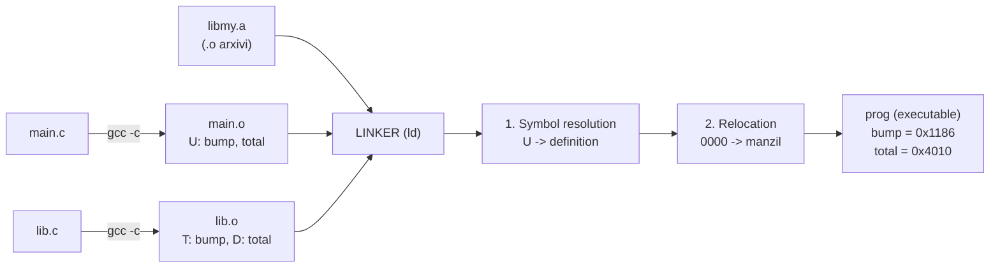
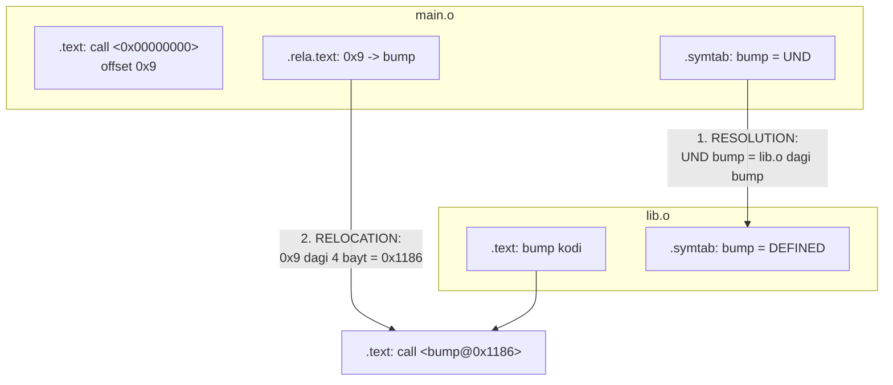
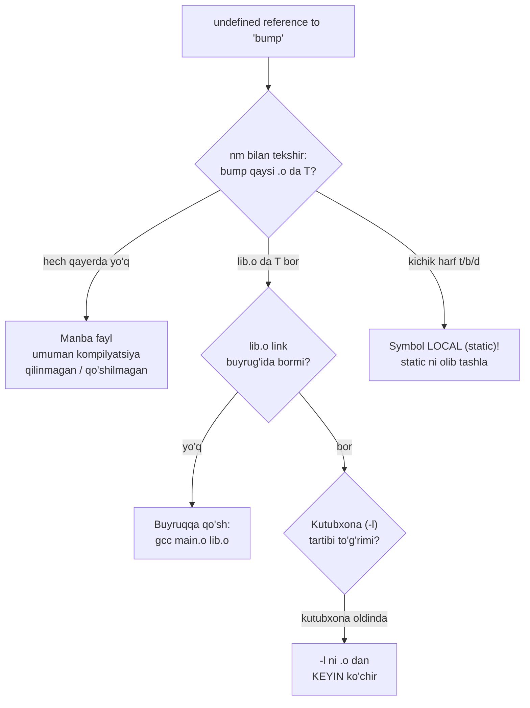
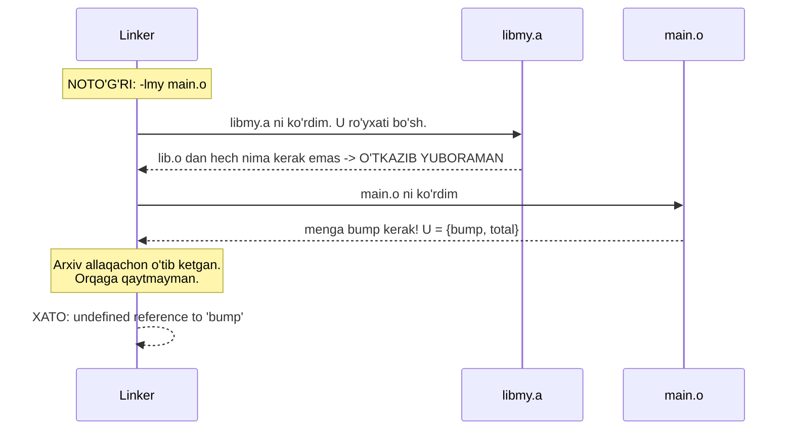

# 19. Static Linking va ELF — symbol resolution va relocation

> Manba: CS:APP 2-nashr, 7.1-7.9 · Muhit: Ubuntu 24.04 x86-64 (Docker), gcc 13.3.0 · [← Oldingi](18-cache-friendly-code.md) · [Kurs xaritasi](00-README.md) · [Keyingi →](20-dynamic-linking.md)

## Nima uchun kerak

`undefined reference to 'foo'` va `multiple definition of 'bar'` — bu ikkalasi C/C++ dunyosida eng ko'p vaqt yeydigan va eng kam tushuniladigan xatolar. Ular kompilyatsiya xatosi emas, **link** xatosi: kompilyator ishini bajarib bo'lgan, endi **linker** bo'laklarni bir-biriga ulay olmayapti. Bu farqni bilmasang, xatoni noto'g'ri joydan qidirasan.

Xuddi shu bilim Go dasturchisiga ham kerak. Go binary default holda **static** — shuning uchun `FROM scratch` Docker image ishlaydi. Lekin `CGO_ENABLED=1` bo'lganda binary dinamik libc'ga bog'lanadi va o'sha `scratch` image bir kun ichida "no such file or directory" bilan qulaydi. Buni tushunish uchun linker nima qilishini bilish shart.

Bu darsda binary ichiga qaraymiz: **ELF** formati, **section**lar, **symbol** jadvali, **relocation** yozuvlari. 01-darsda `hello.o` ichidan `e8 00 00 00 00` ko'rgandik — o'sha to'rtta nol nima ekanini va kim uni to'ldirishini bugun aniq bilib olamiz. Va nihoyat — kutubxona tartibi: `gcc -lmy main.o` xato, `gcc main.o -lmy` to'g'ri. Nega? Bu tuzoqqa har bir C dasturchi kamida bir marta tushgan.

---

## Nazariya

### 1. Linker nima qiladi — ikkita vazifa

Kompilyator har bir `.c` faylni **alohida** kompilyatsiya qiladi. `main.c` `bump()` ni chaqiradi, lekin `bump()` qayerdaligini bilmaydi. Kompilyator bu joyni **bo'sh** qoldiradi va yoniga eslatma yozib qo'yadi: "bu yerni keyinroq `bump` manzili bilan to'ldirish kerak".

Linker ana shu eslatmalarni bajaradi. Uning ikki vazifasi bor:

| Vazifa | Nima qiladi |
| --- | --- |
| **Symbol resolution** | Har bir ishlatilgan symbol'ni (funksiya/o'zgaruvchi nomi) uning **aniqlanishi** (definition) bilan juftlaydi. `main.o` dagi `bump` -> `lib.o` dagi `bump`. |
| **Relocation** | Symbol'larga haqiqiy manzil beradi va kod ichidagi bo'sh joylarni o'sha manzillar bilan to'ldiradi. |

> **Oltin qoida:** Linker yangi kod yozmaydi. U faqat mavjud bo'laklarni **joylashtiradi** (relocation) va **ulaydi** (resolution).

### 2. Object fayl turlari

| Tur | Kengaytma | Tavsifi |
| --- | --- | --- |
| **Relocatable** | `.o` | Kompilyator chiqishi. Manzillar hali yo'q (hammasi 0). Boshqa `.o` lar bilan birlashtirilishi mumkin. |
| **Executable** | (yo'q) | To'liq linklangan. Manzillar bor. Xotiraga yuklanib ishga tushirilishi mumkin. |
| **Shared** | `.so` | Yuklash yoki ishlash vaqtida dinamik linklanadi (20-darsda). |

Uchalasi ham Linux'da bitta formatda — **ELF** (Executable and Linkable Format).

### 3. ELF va sectionlar

ELF fayl **section**lardan iborat. Section — bir turdagi baytlar to'plami.

| Section | Nima saqlaydi |
| --- | --- |
| `.text` | Mashina kodi (06-darsdagi instruksiyalar) |
| `.data` | Initsializatsiya qilingan global o'zgaruvchilar (`int total = 100;`) |
| `.bss` | Nolga teng / initsializatsiyasiz global o'zgaruvchilar |
| `.rodata` | O'zgarmas ma'lumot: satr literallari, `switch` jadvallari |
| `.symtab` | **Symbol jadvali** — fayldagi barcha nom va ularning holati |
| `.rela.text` | `.text` uchun **relocation yozuvlari** — "qaysi offsetni nima bilan to'ldirish" |

**`.bss` nega faylda joy egallamaydi?** Chunki uning butun mazmuni — nollar. Nollarni diskda saqlash isrof. ELF faqat **hajmni** yozib qo'yadi ("menga 8 bayt kerak"), loader esa ishga tushirishda o'sha joyni nol bilan to'ldiradi. `.data` esa haqiqiy qiymatlarni saqlaydi, shuning uchun diskda joy egallaydi.

> `.data` = "qiymatim bor, saqla". `.bss` = "menga shuncha bo'sh joy ber, qiymatim nol".

### 4. Symbol turlari

Har bir symbol uch o'qda tasniflanadi:

| O'q | Variantlar |
| --- | --- |
| **Ko'rinish** | **GLOBAL** — boshqa modullar ko'radi (`int x;`, `void f(){}`) · **LOCAL** — faqat shu fayl (`static ...`) |
| **Holat** | **Defined** — tanasi/qiymati shu faylda · **Undefined (UND / `U`)** — ishlatilgan, lekin bu faylda yo'q |
| **Kuch** | **Strong** — funksiya tanasi va initsializatsiyalangan global (`int total = 100;`) · **Weak** — initsializatsiyasiz global (`int total;`) |

### 5. Symbol resolution qoidalari

Ikki modul bir xil GLOBAL nomni aniqlasa, linker nima qiladi?

| Vaziyat | Natija |
| --- | --- |
| Strong + Strong | **XATO** — `multiple definition` |
| Strong + Weak | Strong g'olib, weak **jimgina** tashlanadi |
| Weak + Weak | Bittasi **tasodifan** tanlanadi — eng xavflisi |

Ikkinchi va uchinchi holat xavfli: xato chiqmaydi, dastur "ishlaydi", lekin ikki modul bir xotira uchastkasini bo'lishib olgan bo'ladi. Bu turdagi bug'ni topish — kechalik ish.

> Himoya: global o'zgaruvchilarni imkon boricha `static` qil (LOCAL bo'ladi, to'qnashuv mumkin emas), yoki bitta `.c` da aniqlab, header'da `extern` bilan e'lon qil.

### 6. Static kutubxona (.a) va link tartibi

Static library — bu shunchaki `.o` fayllarning **arxivi** (ZIP kabi, siqilmagan): `ar rcs libmy.a a.o b.o c.o`.

Linker buyruq qatorini **chapdan o'ngga bir marta** o'qiydi va yonida **U** ro'yxatini (hozirgacha kerak bo'lgan, lekin topilmagan symbollar) yuritadi. Arxivga duch kelganda, undan **faqat U ro'yxatidagi symbollarni beradigan** `.o` larni tortib oladi, qolganini tashlab ketadi va **orqaga qaytmaydi**.

> **Link tartibi qoidasi:** kutubxonalar (`-l...`) ularni **ishlatuvchi** `.o` fayllardan **KEYIN** yoziladi.

### 7. Relocation

`.o` faylda barcha manzillar **nol**. Linker sectionlarni birlashtiradi, har biriga xotira manzili beradi, keyin `.rela.text` dagi har bir yozuvni bajaradi: "offset X dagi 4 baytni symbol S ning haqiqiy manzili bilan to'ldir".

### 8. Executable va loading

Natija — executable ELF: sectionlar joyida, manzillar to'ldirilgan, `_start` entry point belgilangan. `./prog` deyilganda **loader** (kernel + `execve`) uning `.text`, `.data`, `.bss` larini virtual xotiraga ko'chiradi va `_start` ga sakraydi. Virtual xotira va address space tafsilotlari — 24-25-darslarda.

### Linking oqimi



### Symbol resolution va relocation mexanikasi



---

## Kod va isbot

Ikki moduldan iborat minimal loyiha. Har bir symbol turi (global defined, global undefined, local) qasddan bor.

`main.c`:

```c
#include <stdio.h>

extern int total;            /* boshqa faylda aniqlangan */
void bump(void);             /* boshqa faylda */
static int hidden = 42;      /* LOCAL: faqat shu fayl */

int main(void)
{
    bump();
    bump();
    printf("total=%d hidden=%d\n", total, hidden);
    return 0;
}
```

`lib.c`:

```c
int total = 100;             /* GLOBAL: aniqlangan (strong) */
static int calls = 0;        /* LOCAL */

void bump(void)
{
    calls++;
    total += calls;
}
```

Kompilyatsiya (link qilmasdan, faqat `.o` gacha):

```
gcc -Og -c main.c lib.c
```

### 1. ELF sectionlar

```
$ readelf -S main.o
0] NULL
1] .text
2] .rela.text
3] .data
4] .bss
5] .rodata.str1.1
6] .comment
7] .note.GNU-stack
9] .eh_frame
```

O'qish: `.text` = `main` ning mashina kodi; `.data` = `hidden = 42` (qiymati bor); `.rodata.str1.1` = `"total=%d hidden=%d\n"` satri; `.rela.text` = relocation yozuvlari — **bu section faqat `.o` da bor**, linker uni "iste'mol qiladi" va executable'da qoldirmaydi.

### 2. Symbol jadvali

```
$ readelf -s main.o
     0: 0000000000000000     0 NOTYPE  LOCAL  DEFAULT  UND 
     1: 0000000000000000     0 FILE    LOCAL  DEFAULT  ABS main.c
     2: 0000000000000000     0 SECTION LOCAL  DEFAULT    1 .text
     3: 0000000000000000     0 NOTYPE  LOCAL  DEFAULT    5 .LC0
     4: 0000000000000000    61 FUNC    GLOBAL DEFAULT    1 main
     5: 0000000000000000     0 NOTYPE  GLOBAL DEFAULT  UND bump
     6: 0000000000000000     0 NOTYPE  GLOBAL DEFAULT  UND total
     7: 0000000000000000     0 NOTYPE  GLOBAL DEFAULT  UND __printf_chk
```

Uch narsaga e'tibor ber:

1. **`main`** — `FUNC GLOBAL`, `1` (ya'ni `.text`) sectionida aniqlangan. Boshqa modullar uni ko'radi.
2. **`bump`, `total`, `__printf_chk`** — `UND` (UNDEFINED). Ishlatilgan, lekin **bu faylda yo'q**. Linker ularni topishi **shart**, aks holda xato. (`__printf_chk` — `printf` ning `-D_FORTIFY_SOURCE` bilan kelgan xavfsiz varianti; u libc ichida.)
3. Barcha manzillar **`0000000000000000`**. Hali hech narsa joylashtirilmagan.

### 3. `nm` — tez ko'rinish

```
--- main.o ---
0000000000000000 r .LC0
                 U __printf_chk
                 U bump
0000000000000000 T main
                 U total

--- lib.o ---
0000000000000000 T bump
0000000000000000 b calls
0000000000000000 D total
```

`nm` harflari:

| Harf | Ma'nosi |
| --- | --- |
| `T` / `t` | `.text` — kod |
| `D` / `d` | `.data` — initsializatsiyalangan global |
| `B` / `b` | `.bss` — nol qiymatli global |
| `R` / `r` | `.rodata` — o'zgarmas |
| `U` | **UNDEFINED** — kerak, lekin bu faylda yo'q |
| **KATTA harf** | GLOBAL |
| **kichik harf** | LOCAL (`static`) |

Endi ikkita ro'yxatni yonma-yon qo'y — linkerning ishi shu yerda ko'rinadi:

- `main.o`: `bump` = **U**, `total` = **U** (kerak, yo'q)
- `lib.o`: `bump` = **T** (bor!), `total` = **D** (bor!)

Linker `main.o` ning `U` larini `lib.o` ning `T`/`D` lari bilan **juftlaydi**. Bu — symbol resolution.

`calls` esa kichik `b` — **LOCAL**. `lib.c` da `static` deb yozilgani uchun. `main.o` uni **hech qachon** ko'rmaydi va ishlata olmaydi. Xohlasang `main.c` da `extern int calls;` yozib ko'r — `undefined reference` olasan, garchi `lib.o` da `calls` **bor** bo'lsa ham. LOCAL degani shu.

### 4. Relocation yozuvlari — o'sha to'rtta nol

```
$ readelf -r main.o
000000000009  000500000004 R_X86_64_PLT32    0000000000000000 bump - 4
00000000000e  000500000004 R_X86_64_PLT32    0000000000000000 bump - 4
000000000019  000600000002 R_X86_64_PC32     0000000000000000 total - 4
000000000020  000300000002 R_X86_64_PC32     0000000000000000 .LC0 - 4
00000000002f  000700000004 R_X86_64_PLT32    0000000000000000 __printf_chk - 4
```

Har bir qator — linkerga topshiriq: **"`.text` ning shu OFFSET idagi bo'sh joyni, shu SYMBOL ning manzili bilan to'ldir"**.

- Offset `0x9` va `0xe` — `bump` chaqiruvi **ikki marta** (`main` da ikki `bump()` bor).
- Offset `0x19` — `total` ni o'qish.
- Offset `0x20` — `.LC0` (format satri) manzilini olish.
- Offset `0x2f` — `__printf_chk` chaqiruvi.

01-darsda `objdump` bilan `hello.o` ichidan `e8 00 00 00 00` (call instruksiyasi) ko'rgandik va o'sha `00 00 00 00` nima ekani noma'lum edi. **Mana javob:** bu — relocation uchun qoldirilgan **bo'sh joy**. Kompilyator `call` opcode'ini (`e8`) yozdi, lekin manzilni bilmagani uchun to'rt baytni nol qoldirdi va `.rela.text` ga "bu yerni to'ldir" deb yozib qo'ydi.

Relocation turlari: **`R_X86_64_PC32`** = PC-relative 32-bit (qiymat **joriy instruksiyaga nisbatan** hisoblanadi); **`R_X86_64_PLT32`** = funksiya chaqiruvi, PLT orqali o'tishi mumkin (dinamik holatda — 20-darsda). `- 4` (addend) — `call` instruksiyasi tugagach RIP keyingi instruksiyaga ko'rsatgani uchun kerak bo'lgan tuzatish (09-darsdagi `call` semantikasi).

### 5. Link va ishga tushirish

```
$ gcc -Og -o prog main.o lib.o && ./prog
total=103 hidden=42
```

`100 + 1 + 2 = 103`. Ikki `bump()` chaqiruvi: birinchisida `calls=1`, `total=101`; ikkinchisida `calls=2`, `total=103`.

### 6. Link'dan keyin symbollar manzilga ega bo'ladi

```
$ nm prog
0000000000001186 T bump
0000000000001149 T main
0000000000004010 D total
```

`.o` da hamma manzil `0` edi. Endi:
- `bump` = `0x1186`
- `main` = `0x1149`
- `total` = `0x4010`

**Relocation bajarildi.** `main.o` ning `.text+0x9` dagi to'rtta nol endi `bump` ga olib boradigan haqiqiy offset bilan to'ldirilgan. E'tibor ber: `.text` symbollari (`0x1...`) va `.data` symbollari (`0x4...`) turli manzil oralig'ida — chunki linker bir turdagi sectionlarni birlashtirib, yonma-yon joylashtiradi.

---

## Xatolar anatomiyasi

Bu qism — darsning eng qimmatli joyi. Xato xabari — bu linkerning ichki holatining nusxasi. O'qishni bilsang, javob o'sha yerda.

### 7. `undefined reference` — symbol resolution muvaffaqiyatsiz

`lib.o` ni buyruqda unutamiz:

```
$ gcc -Og -o bad main.o
/usr/bin/ld: main.o: in function `main':
main.c:(.text+0x9): undefined reference to `bump'
/usr/bin/ld: main.c:(.text+0xe): undefined reference to `bump'
```

Sabab: `main.o` da `bump` = `U`. Linker barcha kirish fayllarini ko'rib chiqdi, hech kim `bump` ni aniqlamadi -> `U` ro'yxati bo'sh emas -> xato.

Xatoni **uch qismga** ajratib o'qi:

| Qism | Nima deydi |
| --- | --- |
| `main.o` | **Qaysi faylda** muammo (kimga kerak) |
| `in function 'main'` | **Qaysi funksiyada** |
| `.text+0x9`, `.text+0xe` | **Aynan qaysi offsetda** |
| `` `bump' `` | **Qaysi symbol** topilmadi |

Endi eng chiroyli detal: `.text+0x9` va `.text+0xe` — bular **aynan 4-punktdagi relocation yozuvlarining offsetlari**. Linker `.rela.text` ni bajarayotib, shu ikki yozuvda qoqilib qoldi va o'sha offsetni xato xabariga chiqardi. Xato xabari — relocation jadvalining aks-sadosi.

Diagnostika ketma-ketligi:



### 8. `multiple definition` — ikkita strong symbol

`dup.c` yaratamiz — `total` ni yana bir marta **strong** aniqlaymiz:

```c
int total = 999;
```

```
$ gcc -Og -o bad2 main.o lib.o dup.o
/usr/bin/ld: dup.o:(.data+0x0): multiple definition of `total'; lib.o:(.data+0x0): first defined here
collect2: error: ld returned 1 exit status
```

Ikki modul ham `total` ni **strong** aniqladi (initsializatsiyalangan global). Linker qaysi birini tanlashni bilmaydi -> to'qnashuv. Xabar to'g'ridan-to'g'ri ikkala aybdorni ko'rsatadi: `dup.o` va `lib.o`, ikkalasi ham `.data+0x0` da.

Yechimlar:
1. Biri kerak bo'lmasa — o'chir.
2. Biri faqat shu fayl uchun bo'lsa — `static int total = 999;` (LOCAL bo'ladi, to'qnashuv yo'q).
3. Ikkalasi bitta o'zgaruvchini nazarda tutgan bo'lsa — **bittasida aniqla**, boshqasida `extern int total;` deb **e'lon qil** (`main.c` da aynan shunday qilingan).

> Aniqlash (definition) = xotira ajratiladi. E'lon (declaration, `extern`) = "bu nom bor, boshqa joyda". Bitta aniqlash, xohlagancha e'lon.

Endi eng xavfli variant: agar `dup.c` da `int total;` (initsializatsiyasiz) yozsang — bu **weak** symbol. Strong + weak = strong g'olib, **xato chiqmaydi**, dastur "ishlaydi". Ammo `dup.c` mualliflari o'zining alohida `total` i borligiga ishonib yuradi, aslida esa `lib.c` niki bilan bitta xotirani bo'lishadi. Bu — jimgina buzilgan dastur.

### 9. Static kutubxona va LINK TARTIBI tuzog'i

`lib.o` ni arxivga solamiz:

```
$ ar rcs libmy.a lib.o
$ ar t libmy.a
lib.o
```

`ar rcs`: `r` = qo'sh/almashtir, `c` = jimgina yarat, `s` = symbol index yarat (linker arxiv ichida tez qidirsin). `ar t` = ichidagi ro'yxatni ko'rsat.

**TO'G'RI tartib** — `.o` oldin, `-l` keyin:

```
$ gcc -Og -o prog_a main.o -L. -lmy && ./prog_a
total=103 hidden=42
```

**NOTO'G'RI tartib** — kutubxona oldin:

```
$ gcc -Og -o prog_bad -L. -lmy main.o
NATIJA: LINK XATOSI
main.c:(.text+0x9): undefined reference to `bump'
```

**Bir xil fayllar, bir xil kutubxona — faqat tartib boshqa. Natija: birinchisi ishlaydi, ikkinchisi qulaydi.**

Nega? Linkerning chapdan o'ngga bir marta o'tishini eslaymiz. `U` = hali topilmagan symbollar ro'yxati:



To'g'ri tartibda esa: `main.o` avval kelib `U = {bump, total, __printf_chk}` ro'yxatini to'ldiradi; keyin `libmy.a` ga yetganda linker "menga `bump` kerak, `lib.o` da bor" deb `lib.o` ni arxivdan **tortib oladi**.

> **Qoida:** kutubxonani uni **ishlatuvchi**dan **keyin** yoz. Kutubxonalar bir-biriga bog'liq bo'lsa — bog'liqlik tartibida. Aylanma (circular) bog'liqlikda: `-Wl,--start-group ... -Wl,--end-group`.

### 10. Static vs dinamik binary hajmi

```
$ gcc -Og -static -o prog_static main.o lib.o
$ ls -lh prog prog_static
16K   prog          (dinamik - libc tashqarida)
768K  prog_static   (statik - libc ichida)
```

`prog` — 16K, chunki `printf` kodi ichida **yo'q**; u ishga tushishda `libc.so` dan olinadi. `prog_static` — 768K, chunki libc'ning kerakli qismlari **binary ichiga ko'chirilgan**. Almashuv: hajm ↔ mustaqillik. 01-darsda xuddi shu almashuvni ko'rgandik (16K dinamik vs 1.9M static).

---

## Go dasturchiga ko'prik

### Go o'z linkeriga ega

Go `ld` ni ishlatmaydi (CGO bo'lmasa). Uning o'z linkeri bor — `cmd/link`. Va default holda u **static** binary chiqaradi: barcha Go paketlari, runtime, GC — hammasi bitta faylda. Shuning uchun Go binary'lar kattaroq, lekin **hech narsaga bog'liq emas**. Bu Go'ning eng katta operatsion afzalligi:

```dockerfile
FROM golang:1.22 AS build
WORKDIR /src
COPY . .
RUN CGO_ENABLED=0 go build -o /app .

FROM scratch
COPY --from=build /app /app
ENTRYPOINT ["/app"]
```

`FROM scratch` — **butunlay bo'sh** image. Ichida `libc` yo'q, shell yo'q, hech narsa yo'q. Static binary ishlaydi, chunki unga tashqaridan hech narsa kerak emas.

### CGO static'ni buzadi

`CGO_ENABLED=1` (ba'zi paketlarda default) bo'lsa, Go C kod bilan bog'lanadi va **tashqi linker** (`gcc`/`ld`) chaqiriladi. Natija — **dinamik** binary: `libc.so.6` ga bog'liq. `FROM scratch` ichida `libc.so.6` yo'q -> konteyner ishga tushmaydi.

Eng ayyor tomoni: CGO'ni sen yoqmaysan, u **o'zi yonadi**. `net` paketi (DNS uchun) va `os/user` standart holda C resolver'ga murojaat qilishi mumkin. Kod o'zgarmagan, lekin binary dinamik bo'lib qolgan.

| Buyruq | Natija |
| --- | --- |
| `go build` | Muhitga bog'liq — dinamik bo'lishi mumkin |
| `CGO_ENABLED=0 go build` | **Kafolatlangan static** |
| `go build -tags netgo` | Sof Go DNS resolver (C emas) |

Tekshirish oson — ELF hamma joyda ELF, shuning uchun `nm`, `readelf`, `objdump`, `file` Go binary'da ham ishlaydi:

- `file ./app` -> "statically linked" yoki "dynamically linked"
- `ldd ./app` -> "not a dynamic executable" (bu — yaxshi xabar)

### `-ldflags="-s -w"`

`go build -ldflags="-s -w"` da `-s` **symbol jadvalini** (`.symtab`), `-w` esa DWARF debug ma'lumotini olib tashlaydi. Binary sezilarli kichrayadi. Narxi: `nm` endi symbol ko'rsatmaydi va `delve` bilan debug qilish qiyinlashadi. Production build uchun — ha; debug qilinadigan build uchun — yo'q.

### Go'da "undefined reference" bormi?

Sof Go kodda — **yo'q**. Go compiler paket bog'liqliklarini `import` orqali kompilyatsiya vaqtida to'liq biladi; `undefined: foo` xatosi **kompilyatsiya** bosqichida chiqadi, link bosqichida emas. Bu — Go'ning ongli dizayni: C'ning link muammolarini butunlay yo'q qilish. Lekin CGO ishlatsang — C dunyosining barcha muammolari (`undefined reference`, kutubxona tartibi, `#cgo LDFLAGS: -lfoo`) darhol qaytib keladi.

---

## Real-world scenariylar

### 1. CI'da `undefined reference to 'sqlite3_open'`

Lokalda ishlaydi, CI'da qulaydi. Odatiy sabab: `Makefile` da `-lsqlite3` **manba fayllardan oldin** yozilgan (`gcc -lsqlite3 main.o db.o` -> `gcc main.o db.o -lsqlite3`). Ikkinchi ehtimol: kutubxonaning `-dev` paketi CI image'da o'rnatilmagan (`libsqlite3-dev`).

### 2. `FROM scratch` da Go binary ishlamayapti

Symptom: `exec /app: no such file or directory`. Xabar aldamchi — fayl **bor**. "No such file" degani — **loader** topilmadi: binary dinamik va `/lib64/ld-linux-x86-64.so.2` ni so'rayapti, `scratch` image'da esa u yo'q.

Diagnostika: `file ./app` -> "dynamically linked". Sabab: `CGO_ENABLED=1` (masalan `net` yoki `os/user` tufayli, yoki base image'da gcc bor va Go CGO'ni yoqib yuborgan).

Tuzatish: `CGO_ENABLED=0 GOOS=linux go build`. Agar CGO **haqiqatan kerak** bo'lsa (masalan `mattn/go-sqlite3`) — `scratch` o'rniga `distroless` yoki `alpine` ishlat.

Qo'shimcha: `scratch` da TLS ishlatsang, CA sertifikatlarni ham ko'chirish kerak (`/etc/ssl/certs/ca-certificates.crt`) — bu binary muammosi emas, lekin bir xil sinfdagi "muhit bo'sh" muammosi.

### 3. Binary hajmini kichraytirish

`go build` -> `-ldflags="-s -w"` (symbol + DWARF olib tashlanadi, sezilarli kamayadi) -> `upx` (yana kamayadi, lekin ishga tushish sekinlashadi va ba'zi scanner'lar shubhalanadi).

Static'ni tanlash kerakmi? Konteynerda — **ha** (hajm farqi image'da ahamiyatsiz, mustaqillik esa oltin). Tizimga o'rnatiladigan ko'plab CLI utilitalarida — **yo'q** (har biri libc nusxasini olib yurishi isrof; libc'da xavfsizlik yamog'i chiqsa, hammasini qayta build qilish kerak).

---

## Zamonaviy yondashuv

**ELF — universal emas.** Linux va ko'p Unix'larda ELF, macOS'da **Mach-O**, Windows'da **PE/COFF**. Tushunchalar (section, symbol, relocation) uchalasida bir xil, faqat baytlar joylashuvi boshqa — bu darsdagi mental model uchala platformada ishlaydi.

**Linkerlar tez bo'lib bormoqda.** Katta C++ loyihalarda link — build vaqtining yarmi. GNU `ld` (klassik, sekin) -> `gold` (ELF uchun maxsus) -> **`lld`** (LLVM, parallel, ancha tez) -> **`mold`** (hozircha eng tez). Ishlatish: `gcc -fuse-ld=lld` yoki `-fuse-ld=mold`.

**LTO (Link-Time Optimization).** `gcc -flto` bilan kompilyator `.o` ga mashina kodi o'rniga oraliq ko'rinish (IR) yozadi, optimizatsiya esa **link vaqtida**, butun dasturni ko'rgan holda bajariladi — modullar orasida inline qilish mumkin bo'ladi. Narxi: link sekinlashadi.

**Static binary qayta tug'ildi.** 2000-yillarda "static — eskirgan, isrof" deyilardi. Konteynerlar hammasini o'zgartirdi: `distroless` va `scratch` image'lar aynan static binary'ga tayanadi. Go bu to'lqinning oldida turdi.

**musl vs glibc.** glibc'ni to'liq static qilish qiyin (NSS/DNS qismlari baribir dinamik yuklashga urinadi, `getaddrinfo` static build'da ogohlantirish beradi). **musl** libc esa static'ga mo'ljallangan va Alpine'da default. Rust/C da haqiqiy static kerak bo'lsa — `x86_64-unknown-linux-musl` target'i.

---

## Keng tarqalgan xatolar

**1. Kutubxonani ishlatuvchidan oldin yozish.**
`gcc -lmy main.o` — jimgina noto'g'ri. Linker chapdan o'ngga bir marta o'tadi va orqaga qaytmaydi. **To'g'ri: `gcc main.o -lmy`.**

**2. Header faylda o'zgaruvchi aniqlash.**
```c
/* config.h */
int global_count = 0;   /* XATO: har bir #include qilgan .c da ANIQLANADI */
```
Ikki `.c` fayl bu header'ni `#include` qilsa — ikkita strong `global_count` -> `multiple definition`. **To'g'ri:** header'da `extern int global_count;` (e'lon), bitta `.c` da `int global_count = 0;` (aniqlash).

**3. `undefined reference` ni kompilyatsiya xatosi deb o'ylash.**
Bu **link** xatosi — boshqa bosqich, boshqa dastur (`ld`, `gcc` emas). Xabar `/usr/bin/ld:` bilan boshlanadi — bu ochiq ishora. Sintaksisni qayta-qayta tekshirish behuda: muammo **buyruq qatorida** (qaysi fayllar, qaysi tartibda), manba kodda emas.

**4. `static` ni unutish yoki `-static` ni ko'r-ko'rona tanlash.**
Yordamchi funksiyani `static` qilmasang — u GLOBAL bo'ladi va boshqa moduldagi bir xil nomli funksiya bilan to'qnashadi (yoki undan ham yomoni — weak/strong qoidasi tufayli jimgina almashinadi). Ikkinchi tomondan, "har doim `-static`" ham noto'g'ri: desktop tizimda isrof, konteynerda esa aksincha zarur. **Kontekstga qara.**

**5. Go'da `CGO_ENABLED` ni e'tiborsiz qoldirish.**
`go build` "static chiqaradi" deb ishonish — xavfli taxmin. Bir kun `net` yoki `os/user` import qilinadi, CGO yonadi, binary dinamik bo'ladi, `scratch` image qulaydi. **CI'da har doim aniq yoz: `CGO_ENABLED=0 go build`.**

---

## Amaliy mashqlar

### 1. `nm` chiqishidagi `U`

`nm main.o` da `U bump` ko'rinyapti, lekin `nm lib.o` da `T bump`. Bu nimani anglatadi va linker ular bilan nima qiladi?

<details>
<summary>Yechim</summary>

`U` = **UNDEFINED**: `main.o` ga `bump` **kerak**, lekin uning ichida `bump` ning tanasi **yo'q**. `T` = `.text` da **aniqlangan** GLOBAL symbol: `lib.o` da `bump` ning haqiqiy kodi bor.

Linker **symbol resolution** bosqichida `main.o` ning `U bump` ini `lib.o` ning `T bump` i bilan juftlaydi. Keyin **relocation** bosqichida `bump` ga manzil beradi (`0x1186`) va `main.o` ning `.text+0x9`, `.text+0xe` dagi bo'sh joylarini shu manzilga olib boruvchi offset bilan to'ldiradi.

Agar `lib.o` link buyrug'ida bo'lmasa — `U` ro'yxati bo'sh bo'lmay qoladi -> `undefined reference to 'bump'`.
</details>

### 2. Nega `calls` kichik `b`?

`nm lib.o` chiqishida `0000000000000000 b calls`. Ikki savol: (a) nega `b`, (b) nega **kichik** harf? `main.c` dan `extern int calls;` deb unga murojaat qila olamizmi?

<details>
<summary>Yechim</summary>

**(a) `b` = `.bss`.** `lib.c` da `static int calls = 0;` — qiymati **nol**. Nolni faylda saqlash isrof, shuning uchun kompilyator uni `.bss` ga qo'yadi: faqat "menga 4 bayt kerak" deb yozadi, qiymat yozilmaydi. Ishga tushishda loader `.bss` ni nol bilan to'ldiradi.

Solishtir: `total = 100` -> `D` (`.data`), chunki `100` ni saqlash kerak.

**(b) kichik harf = LOCAL.** `static` kalit so'zi symbol'ni LOCAL qiladi.

**Yo'q, murojaat qila olmaymiz.** `main.c` da `extern int calls;` yozib link qilsang, `undefined reference to 'calls'` olasan — garchi `lib.o` da `calls` **jismonan mavjud** bo'lsa ham. LOCAL symbol linkerning modullararo resolution jarayonida **umuman ishtirok etmaydi**. `static` — bu C'dagi haqiqiy "private".
</details>

### 3. `gcc -o p -L. -lmy main.o` nega xato beradi?

Bir xil fayllar, xato faqat tartibda. Linkerning ichida nima sodir bo'ladi?

<details>
<summary>Yechim</summary>

Linker buyruq qatorini **chapdan o'ngga bir marta** o'qiydi va "hali topilmagan symbollar" (`U`) ro'yxatini yuritadi.

1. `libmy.a` ga yetadi. `U` ro'yxati hozircha **bo'sh** (hech kim hech narsa so'ramagan). Arxivdan olinadigan `.o` yo'q -> `lib.o` **o'tkazib yuboriladi**.
2. `main.o` ga yetadi. Endi `U = {bump, total, __printf_chk}`.
3. Buyruq qatori tugadi. `bump` va `total` hali `U` da. Arxiv allaqachon ortda qoldi, linker **orqaga qaytmaydi**.
4. -> `undefined reference to 'bump'`.

To'g'ri tartib (`main.o -L. -lmy`) da `main.o` avval `U` ro'yxatini to'ldiradi, keyin arxivga yetganda linker "`bump` kerak, u `lib.o` da bor" deb `lib.o` ni arxivdan tortib oladi.

**Qoida: kutubxonalar ishlatuvchi `.o` fayllardan KEYIN.**
</details>

### 4. `multiple definition` ni uch xil tuzatish

`lib.c` da `int total = 100;`, `dup.c` da `int total = 999;`. Link `multiple definition of 'total'` beradi. Uchta turli yechim ayt va har birining ma'nosini tushuntir.

<details>
<summary>Yechim</summary>

**1. `static`** — agar `dup.c` ga o'z `total` i kerak bo'lsa: `static int total = 999;`. Symbol LOCAL bo'ladi, resolution'da ishtirok etmaydi, to'qnashuv yo'q. Endi **ikkita alohida o'zgaruvchi** bor.

**2. `extern`** — agar ikkalasi **bitta** `total` ni nazarda tutgan bo'lsa: `dup.c` da `extern int total;` (e'lon, aniqlash emas). Xotira faqat `lib.c` da ajratiladi.

**3. Nomni o'zgartirish** — agar bular mantiqan boshqa narsa bo'lsa: `dup_total`. Global nom fazosi — umumiy resurs, prefikslar katta loyihada zarur.

**Nima QILMASLIK kerak:** `dup.c` da `int total;` (initsializatsiyasiz) deb yozish. Bu **weak** symbol qiladi. Strong (`lib.c`) + weak = strong g'olib, **xato chiqmaydi**, lekin `dup.c` bilmasdan `lib.c` ning o'zgaruvchisini ishlatib yuradi. Xato jim, natija — kechalik debug.
</details>

### 5. Relocation offseti va xato xabari

`readelf -r main.o` da: offset `0x9` -> `bump`. Xato xabarida: `main.c:(.text+0x9): undefined reference to 'bump'`. Bu ikki `0x9` bir xilligi tasodifmi?

<details>
<summary>Yechim</summary>

Tasodif **emas** — bu **aynan bir xil narsa**.

`.rela.text` dagi yozuv — linkerga topshiriq: "`.text` ning `0x9` offsetidagi 4 baytni `bump` manzili bilan to'ldir". Linker shu topshiriqni bajarishga urinadi, `bump` ni symbol jadvalidan qidiradi, topolmaydi — va **o'sha topshiriqning offsetini** xato xabariga chiqaradi.

Ya'ni: **xato xabari — bajarilmagan relocation yozuvining nusxasi.** Shuning uchun xabarda ikkita qator bor (`0x9` va `0xe`) — chunki `main` da `bump()` **ikki marta** chaqirilgan va `.rela.text` da ham `bump` uchun **ikkita** yozuv bor.

Va yana chuqurroq: 01-darsda `objdump` bilan ko'rgan `e8 00 00 00 00` dagi to'rtta nol — aynan `.text+0x9` dagi o'sha baytlar. Zanjir yopildi: **kompilyator nol qoldiradi -> `.rela.text` ga yozuv qo'yadi -> linker to'ldiradi (yoki to'ldirolmay xato beradi).**
</details>

### 6. Go: `strip` qilingan binary ishlaydimi?

`go build -ldflags="-s -w"` symbol jadvalini olib tashlaydi. Dastur baribir ishlaydi. Nega symbol jadvali kerak emas ekan — u holda linkerga u nima uchun kerak edi?

<details>
<summary>Yechim</summary>

Symbol jadvali — **link vaqti** uchun metama'lumot, **ishlash vaqti** uchun emas.

Linker resolution va relocation'ni bajarib bo'lgach, kod ichidagi barcha bo'sh joylar allaqachon **haqiqiy manzillar** bilan to'ldirilgan (6-demoda ko'rdik: `bump = 0x1186`). Protsessor `call 0x1186` ni bajaradi — unga "bump" degan **nom** kerak emas, faqat **manzil** kerak.

Ya'ni symbol jadvali link tugagach o'z ishini bajarib bo'ladi. U executable'da faqat **debugger, profiler va `nm`** uchun qoladi. `-s` (yoki C dagi `strip`) uni o'chiradi — binary kichrayadi, dastur bir xil ishlaydi, lekin `nm` bo'sh chiqadi va `delve` bilan debug qilish qiyinlashadi.

Xulosa: **symbol jadvalida bo'lish != xotirada bo'lish.** Production build uchun `-s -w` — ha; debug qilinadigan build uchun — yo'q.
</details>

---

## Cheat sheet

| Buyruq / Tushuncha | Nima | Eslab qolish |
| --- | --- | --- |
| `readelf -S file.o` | **S**ectionlar ro'yxati | `.text`, `.data`, `.bss`, `.rela.text` |
| `readelf -s file.o` | **s**ymbol jadvali (to'liq) | GLOBAL/LOCAL, DEFINED/UND |
| `readelf -r file.o` | **r**elocation yozuvlari | "offset X ni symbol S bilan to'ldir" |
| `nm file.o` | Symbollarning tez ko'rinishi | Kundalik ish uchun eng tez |
| `nm` : `T` / `D` / `B` | `.text` / `.data` / `.bss`, GLOBAL | Kod / qiymatli / nol global |
| `nm` : `U` | **UNDEFINED** | Kerak, lekin bu faylda yo'q |
| `nm` : **kichik harf** | LOCAL (`static`) | Boshqa modul ko'rmaydi |
| `ar rcs lib.a a.o` / `ar t lib.a` | Arxiv yaratish / ko'rish | `.a` = `.o` larning arxivi |
| **Symbol resolution** | Har `U` ni definition bilan juftlash | Muvaffaqiyatsiz -> `undefined reference` |
| **Relocation** | Bo'sh joylarga manzil yozish | `.o` da 0 -> executable'da haqiqiy manzil |
| `.data` / `.bss` | Qiymatli global / nol global | `.bss` faylda **joy egallamaydi** |
| **Strong + Strong** | XATO | `multiple definition` |
| **Strong + Weak** | Strong g'olib, **jim** | Eng xavfli holat |
| **Link tartibi** | Kutubxona `.o` lardan **KEYIN** | `gcc main.o -lmy` ✓ / `gcc -lmy main.o` ✗ |
| `gcc -static` | Hamma narsa binary ichida | Katta, lekin mustaqil |
| `CGO_ENABLED=0 go build` | Kafolatlangan static Go binary | `FROM scratch` uchun shart |
| `go build -ldflags="-s -w"` | Symbol + DWARF olib tashlash | Kichik binary, qiyin debug |
| `file` / `ldd` | Static'mi yoki dinamik'mi | `ldd` -> "not a dynamic executable" = static |

---

## Qo'shimcha manbalar

- [Library order in static linking — Eli Bendersky](https://eli.thegreenplace.net/2013/07/09/library-order-in-static-linking) — link tartibi tuzog'ining eng aniq tushuntirilishi
- [ELF Special Sections — Linux Foundation refspecs](https://refspecs.linuxfoundation.org/LSB_1.1.0/gLSB/specialsections.html) — barcha standart sectionlarning rasmiy ro'yxati
- [Building Docker Images for Static Go Binaries — Kelsey Hightower](https://medium.com/@kelseyhightower/optimizing-docker-images-for-static-binaries-b5696e26eb07) — Go static binary va `FROM scratch` amaliyoti

---

**Keyingi dars:** [20. Dynamic Linking, PIC va PLT/GOT](20-dynamic-linking.md) — `.so` fayllar qanday ishlaydi, `R_X86_64_PLT32` dagi "PLT" nima ekan, va nega dinamik kod har qanday manzilga yuklanishi mumkin.
