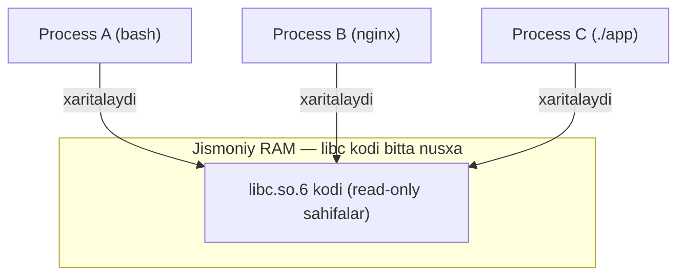
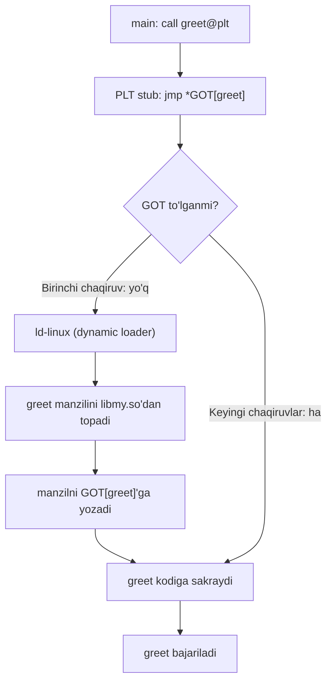
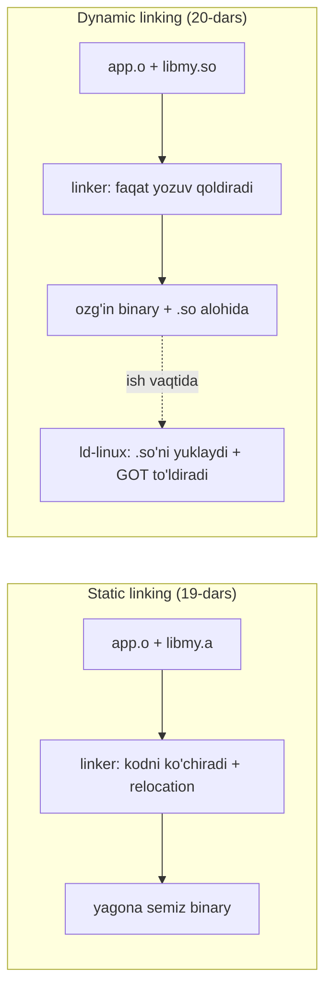

# 20. Dynamic Linking, PIC va PLT/GOT — shared library ichidan

> Manba: CS:APP 2-nashr, 7.10-7.13 · Muhit: Ubuntu 24.04 x86-64 (Docker), gcc 13.3.0, go 1.22.2 · [← Oldingi](19-static-linking.md) · [Kurs xaritasi](00-README.md) · [Keyingi →](21-exceptions-processes.md)

## Nima uchun kerak

19-darsda static linking'ni ko'rdik: linker hamma kodni bitta katta faylga ko'chiradi va `undefined reference` yo'qolguncha kurashadik. Bu darsda teskari yo'lni o'rganamiz — kod binary ichiga **umuman ko'chirilmaydi**, balki ish vaqtida yuklanadi. Bu **dynamic linking**.

Nega bu Go dasturchisiga muhim? Chunki `FROM scratch` Docker image'ida ishlab turgan Go binary'ingiz to'satdan `net` paketini chaqirganda ishlamay qolishi mumkin — bu aynan dynamic linking hikoyasi. `libc`'da kritik xavfsizlik xatosi (CVE) topilganda, minglab dastur bir vaqtda qanday tuzatiladi — bu ham shu. `LD_PRELOAD` bilan profiling va debug qilish, crash yoki exploit tahlilida `PLT`/`GOT` zanjirini o'qish — hammasi shu darsning mavzusi.

## Nazariya

### 1. Dynamic linking nima

**Static linking**'da (19-dars) linker `libmy` funksiyalarining **kodini** app ichiga fizik ko'chirib qo'yadi. Natijada har bir dasturda `printf` kodining o'z nusxasi bo'ladi.

**Dynamic linking**'da esa **shared library** (umumiy kutubxona, `.so` fayl) kodi binary ichiga ko'chirilmaydi. Binary'da faqat "menga `greet` funksiyasi kerak, u `libmy.so`'da" degan **yozuv** qoladi. Haqiqiy kod ikki paytda ulanishi mumkin:

- **Load time** (yuklash vaqti) — dastur ishga tushganda `ld-linux` (dynamic loader) `.so`'larni xotiraga joylashtiradi.
- **Run time** (ish vaqti) — dastur o'zi `dlopen`/`dlsym` orqali ish davomida yuklaydi (plugin arxitekturasi).

> Static: kod compile vaqtida binary ichiga **ko'chiriladi**. Dynamic: kod alohida `.so`'da qoladi, faqat ish vaqtida **ulanadi**.

01-darsda "dynamic vs static binary" farqini yuzaki ko'rgan edik — `file` buyrug'i biriga "dynamically linked", boshqasiga "statically linked" degan edi. Endi shu farq **ichida** nima borligini ochamiz: nega dinamik binary'da `interpreter /lib64/ld-linux-...` yozuvi bor, static'da esa yo'q; nega dinamik binary kichikroq, lekin yolg'iz o'zi ishlay olmaydi.

### 2. Nega dynamic — uch afzallik, ikki narx

| Jihat | Static | Dynamic |
| --- | --- | --- |
| RAM | Har dastur `libc` nusxasini yuklaydi | Bitta `libc` RAM'da, hamma bo'lishadi |
| Disk | Har binary katta | Binary kichik, `.so`'lar umumiy |
| Security patch | Har dasturni qayta build | Bitta `.so` yangilanadi — HAMMA tuzaladi |
| Ko'chirish (deploy) | Bitta fayl, bog'liqlik yo'q | `.so`'lar mos kelishi kerak (dependency hell) |
| Ishga tushish | Tez | Loader biroz ish qiladi (deyarli sezilmas) |

Xotira tejash mexanikasi: `libc.so.6` kodi RAM'da **bir marta** yuklanadi, keyin barcha process'lar o'sha bitta fizik sahifalarni virtual xotiralariga xaritalaydi (bu 24-25-darsdagi virtual memory mavzusi). 100 ta dastur ishlasa ham `libc` kodi RAM'da bitta nusxa.



Diqqat: bu faqat **kod** (read-only) uchun ishlaydi. Har processning o'z **data**si (masalan o'zgaruvchan global'lar) alohida bo'ladi — aks holda bir dastur boshqasining ma'lumotini buzardi. Kod bo'lishiladi, data bo'lishilmaydi.

### 3. PIC — position-independent code

Muammo: bitta `libmy.so` bir vaqtda o'nlab process'da ishlatiladi. Har processda uning virtual manzili boshqacha bo'lishi mumkin (ayniqsa ASLR yoqilganda). Agar kod ichida "manzil 0x401000'dagi `shared_val`'ni o'qi" deb qattiq yozilgan bo'lsa, kod faqat bitta manzilda ishlardi.

Yechim — **PIC** (position-independent code, manzildan mustaqil kod). Kod istalgan virtual manzilga yuklansa ham to'g'ri ishlaydi. Buni x86-64'da **RIP-relative addressing** (06-darsda) ta'minlaydi: kod "hozirgi `rip`'dan +0xeac baytda" deb nisbiy adres ishlatadi, absolyut manzil emas. `.so` qayerga tushsa ham, ma'lumotgacha bo'lgan **masofa** o'zgarmaydi.

`-fPIC` bayrog'i aynan shuni yoqadi. Shuning uchun shared library HAR DOIM `-fPIC` bilan build qilinadi.

### 4. PLT + GOT — dinamik chaqiruv mexanikasi

Endi eng nozik joy. `main` `greet`'ni chaqirmoqchi, lekin `greet` kodi boshqa `.so`'da, uning manzili compile vaqtida **noma'lum**. Qanday chaqiramiz?

Yechim — ikki jadval:

- **GOT** (Global Offset Table, global ofsetlar jadvali) — ma'lumot bo'limidagi manzillar jadvali. Har importlangan funksiya uchun bitta yacheyka. Boshida bo'sh, ish vaqtida **loader** to'g'ri manzil bilan to'ldiradi.
- **PLT** (Procedure Linkage Table, protsedura ulash jadvali) — kod bo'limidagi kichik "trampolin" bo'laklar. Har biri mos GOT yacheyka orqali **bilvosita** sakraydi.

`main` to'g'ridan-to'g'ri `greet`'ni emas, `greet@plt` (PLT stub) ni chaqiradi. PLT stub esa `jmp *GOT[greet]` qiladi — GOT'dagi manzilga sakraydi.

### 5. Lazy binding

Agar dastur 1000 ta funksiya import qilsa, lekin faqat 10 tasini chaqirsa — 990 tasining manzilini oldindan izlash isrof bo'lardi. Shuning uchun **lazy binding** (dangasa bog'lash) ishlatiladi:

1. Boshida GOT yacheyka "hali topilmagan" holatda, u qaytib PLT'ning ikkinchi qismiga ishora qiladi.
2. Funksiya **birinchi marta** chaqirilganda, boshqaruv `ld-linux`'ga o'tadi. Loader `greet`'ning haqiqiy manzilini topib, uni GOT'ga **yozadi**.
3. **Keyingi** chaqiruvlarda GOT'da tayyor manzil turadi — to'g'ridan-to'g'ri sakraydi, loader chaqirilmaydi.

Ya'ni har bir funksiya uchun narx faqat **bir marta**, birinchi chaqiruvda to'lanadi.



### 6. Loader relocation'ni tugatadi

19-darsda **relocation**'ni ko'rdik: linker joyni hisoblab, undefined manzillarni to'ldiradi. Dynamic linking'da bu ish **ikkiga bo'linadi**:

- Static qism — linker `.so`'ning ichki relocation'larini bajaradi.
- Dynamic qism — `R_X86_64_JUMP_SLOT` (funksiya uchun) va `R_X86_64_GLOB_DAT` (global data uchun) relocation'larni **loader** ish vaqtida bajaradi.

Ya'ni 19-darsdagi relocation g'oyasi shu yerda ham, faqat uni **linker emas, loader** tugatadi.

Ikki asosiy dinamik relocation turini farqlash muhim:

| Relocation | Nima uchun | Qachon to'ladi |
| --- | --- | --- |
| `R_X86_64_JUMP_SLOT` | funksiya manzili (GOT) | lazy — birinchi chaqiruvda |
| `R_X86_64_GLOB_DAT` | global data manzili (GOT) | eager — yuklashda darhol |

Funksiyalar dangasa (lazy) hal qilinadi, chunki hammasi chaqirilmasligi mumkin. Global data esa odatda darhol hal qilinadi, chunki unga birinchi murojaatni "ushlab qolish" mexanizmi funksiya chaqiruvidagidek qulay emas.



### 7. Interposition va run-time yuklash

- **LD_PRELOAD interposition** — ma'lum `.so`'ni hamma narsadan oldin yuklab, uning funksiyasi asl funksiyani "soyalaydi" (o'rnini bosadi). PLT/GOT bilvosita bo'lgani uchun mumkin — chaqiruv doim GOT orqali o'tadi, GOT'ni esa loader to'ldiradi, demak "kimning funksiyasi" degan qaror ish vaqtiga qoldiriladi.
- **dlopen/dlsym** — dastur ish davomida `.so`'ni o'zi yuklaydi (`dlopen`) va funksiya manzilini oladi (`dlsym`). Bu plugin tizimlarining asosi.

### 8. Notional machine — xotirada aslida nima bo'ladi

Zanjirni bir joyga jamlaymiz. `./app` ishga tushganda kompyuterda ketma-ket quyidagilar sodir bo'ladi:

1. Kernel `app` ELF header'ini o'qiydi, u yerda "interpreter: `/lib64/ld-linux-x86-64.so.2`" yozuvini ko'radi va **avval loader'ni** ishga tushiradi (dastur `main`'idan oldin loader ishlaydi).
2. Loader `app`'ning kerakli `.so` ro'yxatini (`libmy.so`, `libc.so.6`) o'qiydi va ularni process'ning virtual manzil fazosiga `mmap` bilan xaritalaydi (24-25-dars).
3. Loader `app` va har `.so`'ning GOT'idagi bo'sh yacheykalarni tayyorlaydi. Lazy binding'da funksiya GOT yacheykalari hali "PLT'ga qaytar" holatida qoladi.
4. `main` ishlaydi. `call greet@plt` birinchi marta bajarilganda GOT hali bo'sh — boshqaruv loader'ning `_dl_runtime_resolve`'iga o'tadi, u `greet`'ni `libmy.so`'dan topib GOT'ga **yozadi**, keyin `greet`'ga sakraydi.
5. Ikkinchi `greet()` chaqiruvida GOT to'la — to'g'ridan-to'g'ri sakrash, loader chaqirilmaydi.

Ya'ni "bitta funksiya chaqiruvi" ortida process ochilishi, `mmap`, GOT to'ldirilishi va bilvosita sakrash yashiringan. Buni bilmasdan crash yoki exploit tahlilini (masalan GOT overwrite) qilib bo'lmaydi.

## Kod va isbot

Quyidagi to'qqiz demo bir butun hikoya: `.so` yaratamiz (1), uni dinamik ulaymiz (2-3), keyin PLT/GOT zanjirini disassembler ostida ochamiz (4-6), dinamik linking superkuchini ko'rsatamiz (7-8) va oxirida Go CGO amaliyotiga o'tamiz (9). Har bir output real muhitda (x86-64, gcc 13.3.0, go 1.22.2) tekshirilgan.

### Demo 1 — shared library yaratish

`mylib.c`:

```c
#include <stdio.h>
int shared_val = 7;
void greet(const char *who) { printf("salom, %s (shared_val=%d)\n", who, shared_val); }
```

`app.c`:

```c
void greet(const char *);
int main(void) { greet("dunyo"); return 0; }
```

```
$ gcc -Og -fPIC -shared -o libmy.so mylib.c
$ file libmy.so
libmy.so: ELF 64-bit LSB shared object, x86-64, version 1 (SYSV)
```

`-fPIC` — position-independent code, `-shared` — shared object. E'tibor bering: `file` "shared object" deydi, "executable" emas. Bu fayl o'zi ishga tushmaydi, boshqa dastur ichidan chaqiriladi.

### Demo 2 — dinamik link va ishga tushirish

```
$ gcc -Og -o app app.c -L. -lmy
$ LD_LIBRARY_PATH=. ./app
salom, dunyo (shared_val=7)
```

`app` ichida `greet`'ning **kodi yo'q** — u `libmy.so`'da. `LD_LIBRARY_PATH=.` dynamic loader'ga `.so`'ni joriy papkadan qidirishni aytadi.

### Demo 3 — bog'liqliklarni ko'rish (ldd)

```
$ LD_LIBRARY_PATH=. ldd app
	libmy.so => ./libmy.so (0x00007fffff7b9000)
	libc.so.6 => /lib/x86_64-linux-gnu/libc.so.6 (0x00007fffff5a4000)
	/lib64/ld-linux-x86-64.so.2 (0x00007ffffffc6000)
```

`app` uchta narsaga bog'liq:

- `libmy.so` — bizning kutubxona,
- `libc.so.6` — C standart kutubxona (`printf` shu yerdan),
- `ld-linux-x86-64.so.2` — dynamic loader, u qolgan `.so`'larni yuklaydi.

`ldd` — Go dasturchisi uchun ham asosiy tekshiruv quroli: "binary'im nimalarga bog'liq?".

### Demo 4 — main greet'ni PLT stub orqali chaqiradi

```
$ objdump -d app
0000000000001149 <main>:
    1149:	f3 0f 1e fa          	endbr64
    114d:	48 83 ec 08          	sub    $0x8,%rsp
    1151:	48 8d 3d ac 0e 00 00 	lea    0xeac(%rip),%rdi        # "dunyo" satr
    1158:	e8 f3 fe ff ff       	call   1050 <greet@plt>
    115d:	b8 00 00 00 00       	mov    $0x0,%eax
    1162:	48 83 c4 08          	add    $0x8,%rsp
    1166:	c3                   	ret
```

Eng muhim satr: `call 1050 <greet@plt>`. `main` `greet`'ni **to'g'ridan-to'g'ri** chaqirmaydi — u `greet@plt`, ya'ni PLT stub'ni chaqiradi. Sababi: `greet` manzili compile vaqtida **noma'lum**, u boshqa `.so`'da va ish vaqtida qayerga yuklanishi ham oldindan bilinmaydi.

`lea 0xeac(%rip),%rdi` — RIP-relative addressing (06-dars): "dunyo" satri manzili `rip`'ga nisbatan hisoblanadi. Bu PIC.

### Demo 5 — PLT stub GOT orqali sakraydi

```
$ objdump -d app
0000000000001050 <greet@plt>:
    1050:	f3 0f 1e fa          	endbr64
    1054:	ff 25 76 2f 00 00    	jmp    *0x2f76(%rip)        # 3fd0 <greet@Base>
```

PLT stub bitta ish qiladi: `jmp *0x2f76(%rip)` — bu GOT yacheyka `0x3fd0` orqali **bilvosita** sakrash, ya'ni `jmp *GOT[greet]`. GOT — ish vaqtida to'ldiriladigan manzillar jadvali. Hozircha bu yacheyka bo'sh yoki loader'ga qaytaradigan qiymatga ega.

### Demo 6 — GOT yacheyka uchun relocation

```
$ readelf -r app
000000003fd0  000300000007 R_X86_64_JUMP_SLO 0000000000000000 greet + 0
```

Bu yozuvni shunday o'qing: "GOT[0x3fd0]'ni `greet`'ning haqiqiy manzili bilan to'ldir — ish vaqtida". `R_X86_64_JUMP_SLOT` — bu 19-darsdagi relocation'ning dinamik versiyasi.

- Static'da: **linker** relocation'ni to'ldirardi.
- Bu yerda: **loader** ish vaqtida to'ldiradi.

Lazy binding: birinchi `greet()` chaqiruvida loader manzilni topib GOT'ga yozadi; keyingi chaqiruvlar to'g'ridan-to'g'ri o'tadi. Demo 4 → 5 → 6 zanjiri bir butun: `call greet@plt` → `jmp *GOT[greet]` → `JUMP_SLOT` relocation.

### Demo 7 — LD_PRELOAD interposition

Funksiyani ish vaqtida almashtiramiz. `fake.c`:

```c
#include <stdio.h>
void greet(const char *who) { printf("[FAKE] men asl greet emasman! (%s)\n", who); }
```

```
$ gcc -Og -fPIC -shared -o libfake.so fake.c
$ LD_LIBRARY_PATH=. ./app
salom, dunyo (shared_val=7)
$ LD_LIBRARY_PATH=. LD_PRELOAD=./libfake.so ./app
[FAKE] men asl greet emasman! (dunyo)
```

`LD_PRELOAD` `libfake.so`'ni **hamma narsadan oldin** yuklaydi. Loader `greet`'ni izlaganda avval `libfake.so`'ni ko'radi va uning `greet`'ini GOT'ga yozadi — asl `greet` "soyalanadi". Bu PLT/GOT bilvosita bo'lgani uchun mumkin.

Foydali qo'llanishlar: profiling, debug, `malloc`'ni `tcmalloc`/`jemalloc` bilan almashtirish, testda mock. Xavf: zararli `LD_PRELOAD` ham xuddi shu tarzda funksiyani o'zgartirishi mumkin — shuning uchun bu security nuqtai nazaridan nozik.

### Demo 8 — kutubxonani almashtirish, app'ni qayta compile qilmasdan

`mylib2.c`'da `shared_val=999` va `greet` yangi matn beradi. Faqat `.so`'ni qayta build qilamiz:

```
$ gcc -Og -fPIC -shared -o libmy.so mylib2.c
$ LD_LIBRARY_PATH=. ./app
salom, dunyo (YANGI versiya, shared_val=999)
```

`libmy.so`'ni yangiladik, `app` **umuman o'zgarmadi** — lekin yangi kod ishladi! Bu dynamic linking'ning superkuchi va **security patch modeli**: `libc`'da xato topilsa, bitta `.so` yangilanadi, uni ishlatuvchi HAMMA dastur avtomatik tuzaladi. Static'da esa har bir dasturni qayta link qilish kerak bo'lardi.

### Demo 9 — Go CGO va dynamic/static

`main.go` `net.LookupHost` ishlatadi. `net` paketi ba'zi holatlarda CGO resolver (C tilidagi DNS hal qiluvchi) ishlatadi.

```
$ CGO_ENABLED=1 go build -o app_cgo main.go
$ file app_cgo
app_cgo: ELF 64-bit LSB executable, x86-64, dynamically linked, interpreter /lib64/ld-linux-x86-64.so.2
$ ldd app_cgo
	libc.so.6 => /lib/x86_64-linux-gnu/libc.so.6
	/lib64/ld-linux-x86-64.so.2
```

```
$ CGO_ENABLED=0 go build -o app_pure main.go
$ file app_pure
app_pure: ELF 64-bit LSB executable, x86-64, statically linked, Go BuildID=...
$ ldd app_pure
	not a dynamic executable
```

Hal qiluvchi farq:

- `CGO_ENABLED=1` (C kod ishlatilsa) — Go binary **dinamik** bo'ladi, `libc.so.6` kerak → `FROM scratch` Docker image'da **ishlamaydi** (u yerda `libc` yo'q).
- `CGO_ENABLED=0` — sof Go, **static**, hech narsaga bog'liq emas → `scratch`'da bemalol ishlaydi.

Bu 19-darsdagi CGO eslatmasining to'liq isboti.

## Go dasturchiga ko'prik

Demo 9 — bu darsning eng amaliy qismi. Ko'p Go dasturchi `docker build` qilib, `FROM scratch` ishlatganda kutilmaganda quyidagi xatoga uchraydi:

```
exec /app: no such file or directory
```

Fayl bor, lekin "no such file" deydi. Sababi: binary dinamik, unga `/lib64/ld-linux-x86-64.so.2` va `libc.so.6` kerak, lekin `scratch`'da ular yo'q. Xato aslida **loader topilmadi** degani.

### CGO qachon yoqiladi

Odatiy holda CGO **yoqilgan** (`CGO_ENABLED=1`). Ba'zi standart paketlar default'da C resolver ishlatishga moyil:

- `net` — DNS uchun `getaddrinfo` (C funksiya),
- `os/user` — foydalanuvchini `/etc/passwd`'dan C kutubxona orqali qidiradi.

Shu sabab siz hech qanday C kod yozmasangiz ham, `net` ishlatilsa binary dinamik chiqishi mumkin. Sof Go resolver'ni majburlash yo'llari:

- `CGO_ENABLED=0 go build` — eng sodda, hamma CGO'ni o'chiradi;
- `-tags netgo` yoki `GODEBUG=netdns=go` — faqat `net` resolver'ini sof Go'ga o'tkazadi.

### musl vs glibc muammosi

Alpine Linux `musl` libc ishlatadi, oddiy Ubuntu esa `glibc`. Agar binary'ni Ubuntu (`glibc`) da dinamik build qilib, Alpine (`musl`) ga ko'chirsangiz:

```
$ ./app
sh: ./app: not found
```

Fayl bor, lekin "not found" — dynamic loader mos kelmaydi (`glibc` loader'ni izlaydi, `musl` boshqacha). Yechim: yo `CGO_ENABLED=0` bilan static build, yo bir xil libc'da build va run.

### Amaliy qoida

| Maqsad | Buyruq |
| --- | --- |
| scratch/distroless uchun | `CGO_ENABLED=0 go build` |
| Tekshirish | `file app` va `ldd app` |
| CGO shart bo'lsa (SQLite) | `CC=musl-gcc` bilan static, yoki distroless glibc image |

Qachon CGO kerak: `mattn/go-sqlite3` kabi C kutubxonaga tayanuvchi paketlar, ba'zi grafika/kripto kutubxonalar. Bunda `CGO_ENABLED=0` ishlamaydi — Alpine + `musl-gcc` yoki glibc-li distroless image kerak.

Diqqat qiling: `CGO_ENABLED=0` xotira tejash afzalligini yo'qotadi (endi `libc` bo'lishilmaydi, har binary o'z nusxasini olib yuradi), lekin konteyner dunyosida bu narx arzimas — image kichik va bog'liqliksiz bo'lishi muhimroq. Ya'ni server/konteynerda static, tizim darajasidagi ko'p dasturli muhitda (masalan oddiy Linux desktop) dynamic afzal.

### Tekshirish odati

Har CI/CD pipeline' da image'ga qo'yishdan oldin ikki buyruq bilan tekshiring:

```
$ file app       # "statically linked" bo'lsa — scratch tayyor
$ ldd app        # "not a dynamic executable" bo'lsa — bog'liqlik yo'q
```

Agar `file` "dynamically linked" desa va siz `scratch`/`distroless` ishlatmoqchi bo'lsangiz — build sozlamasini qayta ko'ring (`CGO_ENABLED`, `-tags`). Bu ikki tekshiruv "no such file" xatosini deploy'dan **oldin** ushlaydi.

## Real-world scenariylar

### 1. "no such file" scratch/Alpine'da

Multi-stage Docker'da `golang:1.22` (glibc) da build qilib, `FROM scratch` yoki `FROM alpine` ga ko'chirdingiz. Binary dinamik — libc yoki mos loader yo'q. Yechim: `CGO_ENABLED=0 go build`, keyin `scratch`'da ishlaydi. `ldd app` "not a dynamic executable" desa — tayyor.

### 2. glibc CVE security patch

Faraz qiling `glibc`'da masofaviy exploit topildi (bunday CVE'lar tarixda ko'p bo'lgan). Dinamik dasturlar `apt upgrade libc6` bilan bir buyruqda tuzaladi — hamma binary avtomatik yangi `libc.so.6`'ni oladi (Demo 8 modeli). Ammo `CGO_ENABLED=0` static Go binary'lar `libc`'ni ichiga olmaydi, shuning uchun bu ularga tegmaydi ham (ijobiy tomoni) — lekin agar sizda static C dastur bo'lsa, uni qayta build qilishga majbursiz.

### 3. LD_PRELOAD bilan malloc almashtirish va profiling

Production'da xotira taqsimlashni tezlatish uchun `LD_PRELOAD=/usr/lib/libtcmalloc.so ./app` — dasturni qayta compile qilmasdan `malloc`/`free`'ni `tcmalloc` bilan almashtiradi (Demo 7 mexanikasi). Xuddi shu usul bilan `libprofiler` ulanadi yoki xato izlash uchun har `malloc`'ni loglaydigan shim qo'yiladi.

### 4. Bir marta build, hamma joyda ishlashini ta'minlash

Jamoada bir dasturchi Ubuntu 24.04 (yangi glibc) da build qiladi, boshqasi Ubuntu 20.04 (eski glibc) da ishga tushiradi va `GLIBC_2.34 not found` xatosini oladi. Sababi: dinamik binary yangi glibc symbol versiyasini so'raydi, eski tizimda u yo'q. Yechim ikki xil: yo `CGO_ENABLED=0` bilan static (glibc'ga bog'liqlik butunlay yo'qoladi), yo build'ni eng eski qo'llab-quvvatlanadigan glibc'da bajarish. Bu "build once, run anywhere" muammosining klassik ko'rinishi.

## Zamonaviy yondashuv

- **PIE endi default.** Zamonaviy Ubuntu (16.10'dan) va boshqa distributivlar executable'larni ham `-fPIE -pie` bilan build qiladi — **position-independent executable**. Sababi **ASLR** (Address Space Layout Randomization): agar executable ham PIC bo'lsa, kernel uni har ishga tushirishda tasodifiy manzilga qo'yadi. Bu 11-darsdagi buffer overflow / ROP hujumlariga qarshi himoya — hujumchi funksiya manzillarini oldindan bilmaydi.
- **Lazy vs now binding.** `LD_BIND_NOW=1` yoki `-z now` bilan lazy binding o'chiriladi: hamma GOT ish boshida to'ldiriladi. Keyin **RELRO** (`-z relro`) GOT'ni faqat-o'qish qiladi — hujumchi GOT'ga soxta manzil yoza olmaydi (GOT overwrite hujumi). Bu xavfsizlik uchun standart.
- **Static qayta tug'ildi.** Go, Rust va konteynerlar davrida static linking yana ommalashdi: bitta fayl, bog'liqliksiz deploy, `distroless`/`scratch` image. "Dependency hell"dan qochish uchun konteyner ichiga hamma narsani static jamlash qulay.
- **musl libc** — Alpine'da yengil alternativa; kichik, lekin glibc bilan binary darajasida mos emas.
- **dlopen plugin arxitekturasi** — server ish davomida yangi funksionalni `.so` sifatida yuklaydi (masalan nginx modullari). Symbol versioning (`GLIBC_2.34` kabi) bir `.so`'da bir funksiyaning bir nechta versiyasini saqlab, orqaga moslikni ta'minlaydi.

### Loader `.so`'ni qanday topadi

Loader `.so`'ni izlash tartibi (yuqoridan pastga):

1. Binary ichidagi `RPATH`/`RUNPATH` (build vaqtida `-Wl,-rpath` bilan yoziladi) — eng ishonchli, chunki fayl ichida saqlanadi.
2. `LD_LIBRARY_PATH` muhit o'zgaruvchisi — faqat dev uchun, production'da xavfli.
3. `ld.so.cache` (`ldconfig` yaratadi, `/etc/ld.so.conf` asosida) — tizim standart kutubxonalari.
4. Standart yo'llar: `/lib`, `/usr/lib`.

Shuning uchun demo'larda `LD_LIBRARY_PATH=.` ishlatdik — `libmy.so` standart yo'lda emas edi. Production'da esa `RPATH` yoki `ldconfig` afzal.

## Keng tarqalgan xatolar

1. **scratch Docker'da CGO binary.** `CGO_ENABLED=1` (default) bilan build qilingan binary dinamik — `scratch`'da libc yo'q, "no such file" xatosi. To'g'risi: `CGO_ENABLED=0` yoki distroless image.
2. **glibc'da build, Alpine/musl'da run.** Binary bor, lekin "not found" — loader mos emas. To'g'risi: bir xil libc'da build+run yoki static.
3. **Production'da LD_LIBRARY_PATH.** Uni global qo'yish noto'g'ri `.so` yuklanishiga va xavfsizlik teshigiga olib keladi. To'g'risi: build vaqtida `rpath` (`-Wl,-rpath`) ishlatish yoki `.so`'ni standart yo'lga qo'yish.
4. **"Dynamic sekin" degan afsona.** Lazy binding tufayli har funksiya bir marta, birinchi chaqiruvda hal qilinadi — overhead deyarli nol. Dynamic sekinligidan qo'rqib static'ga o'tish odatda asossiz.
5. **LD_PRELOAD xavfsizligini e'tiborsiz qoldirish.** Ishonchsiz muhitda `LD_PRELOAD` orqali funksiya almashtirilishi mumkin. setuid dasturlar buni e'tiborsiz qoldiradi, lekin oddiy dasturlarda bu real vektor.

## Amaliy mashqlar

Quyidagi savollar tekshirilgan demo outputlariga tayanadi. Avval o'zingiz javob berishga urinib ko'ring, keyin ochib solishtiring.

**1.** `main` nega `call greet` emas, `call greet@plt` qiladi? (Demo 4)

<details>
<summary>Yechim</summary>

Chunki `greet` kodi boshqa `.so`'da va uning haqiqiy manzili compile vaqtida noma'lum — u ish vaqtida qayerga yuklanishi oldindan bilinmaydi. Shuning uchun linker `main` ichiga bilvosita chaqiruv (PLT stub) qo'yadi. PLT stub GOT orqali sakraydi, GOT'ni esa loader ish vaqtida to'ldiradi.
</details>

**2.** GOT nima uchun kerak? Nega PLT to'g'ridan-to'g'ri sakramaydi?

<details>
<summary>Yechim</summary>

PLT — kod bo'limida, u faqat-o'qish (read-only) va PIC. Agar manzil kod ichiga qattiq yozilsa, ish vaqtida uni yangilab bo'lmaydi va PIC buziladi. GOT — ma'lumot bo'limida, yoziladi. Loader haqiqiy manzilni GOT'ga yozadi, PLT esa har doim o'sha GOT yacheykaga qaraydi. Shu tufayli kod o'zgarmaydi, faqat data o'zgaradi.
</details>

**3.** Demo 8'da `.so`'ni almashtirdik, `app`'ni qayta compile qilmadik — nega yangi kod ishladi?

<details>
<summary>Yechim</summary>

Chunki `app` ichida `greet`'ning kodi yo'q, faqat "`greet` `libmy.so`'da" degan yozuv bor. Har ishga tushishda loader joriy `libmy.so`'dan `greet` manzilini topib GOT'ga yozadi. `.so` yangilangani uchun yangi `greet` yuklandi. Bu security patch modelining asosi.
</details>

**4.** `CGO_ENABLED=0 go build` nima beradi va nega scratch uchun kerak?

<details>
<summary>Yechim</summary>

CGO o'chadi — sof Go binary, static linking, hech qanday `.so` yoki loader kerak emas (`ldd` "not a dynamic executable" deydi). `FROM scratch` image'da libc ham, loader ham yo'q, shuning uchun faqat static binary ishlaydi. `CGO_ENABLED=0` aynan shuni beradi.
</details>

**5.** `LD_PRELOAD=./libfake.so` qanday qilib asl `greet`'ni almashtiradi?

<details>
<summary>Yechim</summary>

Loader `LD_PRELOAD` dagi `.so`'ni hamma narsadan oldin yuklaydi. `greet` symbol'ini hal qilishda birinchi topilgan `libfake.so`'niki ishlatiladi va uning manzili GOT'ga yoziladi. Asl `greet` "soyalanadi". Bu PLT/GOT bilvosita bo'lgani uchun mumkin — chaqiruv doim GOT orqali o'tadi.
</details>

**6.** `ldd app` "not a dynamic executable" desa, bu nimani anglatadi?

<details>
<summary>Yechim</summary>

Binary static link qilingan — hech qanday shared library'ga bog'liq emas, hamma kod ichida. Bu Go'da `CGO_ENABLED=0` natijasi. Bunday binary'ni `scratch`'da ishlatish bexavotir.
</details>

**7.** glibc'da build qilingan dinamik binary Alpine'da "not found" beradi, garchi fayl mavjud bo'lsa. Nega?

<details>
<summary>Yechim</summary>

Alpine `musl` libc ishlatadi, uning dynamic loader'i `glibc`'nikidan farq qiladi. Binary o'z ELF header'ida `/lib64/ld-linux-x86-64.so.2` (glibc loader) so'raydi, lekin Alpine'da u yo'q. Kernel loader'ni topolmay "not found" beradi — bu fayl emas, loader haqida. Yechim: static build yoki bir xil libc.
</details>

**8.** Lazy binding'da birinchi va ikkinchi `greet()` chaqiruvi orasida qanday farq bor?

<details>
<summary>Yechim</summary>

Birinchi chaqiruvda GOT yacheyka bo'sh — boshqaruv loader'ga o'tadi, u `greet` manzilini `libmy.so`'dan topib GOT'ga yozadi, keyin `greet`'ga sakraydi (sekinroq). Ikkinchi chaqiruvda GOT to'la — PLT stub to'g'ridan-to'g'ri GOT'dagi manzilga sakraydi, loader umuman chaqirilmaydi (tez). Shuning uchun narx faqat bir marta to'lanadi.
</details>

**9.** `RPATH` va `LD_LIBRARY_PATH` orasida qaysi biri production uchun afzal va nega?

<details>
<summary>Yechim</summary>

`RPATH` — binary fayl ichiga yoziladi, tashqi muhitga bog'liq emas, buzib bo'lmaydi. `LD_LIBRARY_PATH` esa har kim o'zgartira oladigan muhit o'zgaruvchisi — noto'g'ri yoki zararli `.so` yuklanishiga sabab bo'lishi mumkin. Shuning uchun production'da `RPATH` (yoki `.so`'ni standart yo'lga + `ldconfig`) afzal.
</details>

## Cheat sheet

| Buyruq / Tushuncha | Nima | Eslab qolish |
| --- | --- | --- |
| `-fPIC` | position-independent code | `.so` istalgan manzilga yuklanadi |
| `-shared` | shared object build | `.so`, executable emas |
| `ldd app` | bog'liqliklarni ko'rsatadi | "not a dynamic executable" = static |
| `file app` | dynamic/static ekanini aytadi | "dynamically linked" vs "statically linked" |
| `LD_LIBRARY_PATH=.` | loader'ga `.so` qayerdan izlashni aytadi | faqat dev, production'da rpath |
| `LD_PRELOAD=x.so` | funksiyani soyalash (interposition) | profiling, mock, malloc almashtirish |
| PLT | kod bo'limi trampolin jadvali | `call greet@plt` |
| GOT | data bo'limi manzillar jadvali | `jmp *GOT[greet]`, loader to'ldiradi |
| lazy binding | funksiya birinchi chaqiruvda hal qilinadi | overhead deyarli nol |
| `R_X86_64_JUMP_SLOT` | GOT'ni ish vaqtida to'ldirish relocation'i | linker emas, loader bajaradi |
| PIC / PIE | manzildan mustaqil kod / executable | PIE + ASLR = himoya |
| `CGO_ENABLED=0` | sof Go, static binary | scratch/distroless uchun |
| `dlopen`/`dlsym` | ish vaqtida `.so` yuklash | plugin arxitekturasi |
| `R_X86_64_GLOB_DAT` | global data GOT relocation'i | eager, yuklashda to'ladi |
| `LD_BIND_NOW` / `-z now` | lazy'ni o'chiradi | + RELRO = GOT himoyasi |
| `RPATH` / `RUNPATH` | `.so` yo'li binary ichida | production'da `LD_LIBRARY_PATH` o'rniga |
| `ldconfig` | `ld.so.cache` yangilaydi | tizim `.so` yo'llari |

## Qo'shimcha manbalar

- [technovelty — PLT and GOT: the key to code sharing and dynamic libraries](https://www.technovelty.org/linux/plt-and-got-the-key-to-code-sharing-and-dynamic-libraries.html)
- [Intezer — ELF 101 Part 4: Dynamic Linking](https://intezer.com/blog/executable-linkable-format-101-part-4-dynamic-linking/)
- [How to Choose Between Scratch and Distroless Base Images](https://oneuptime.com/blog/post/2026-02-08-how-to-choose-between-scratch-and-distroless-base-images/view)
