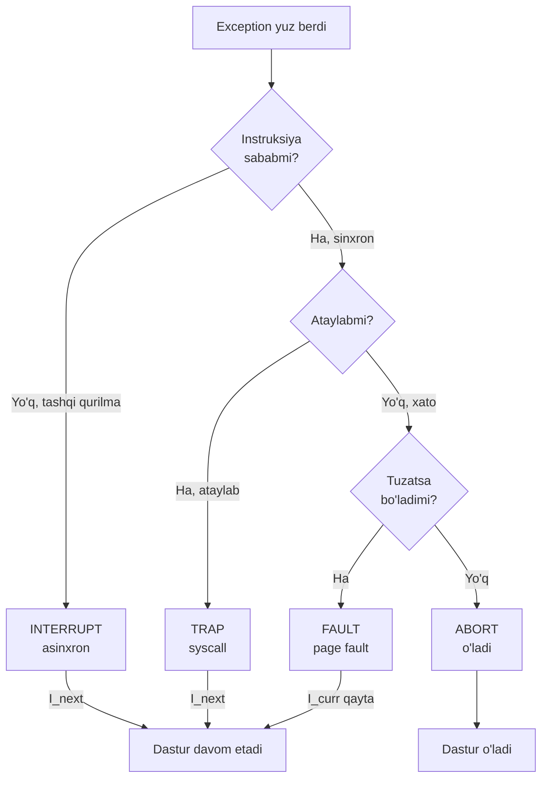
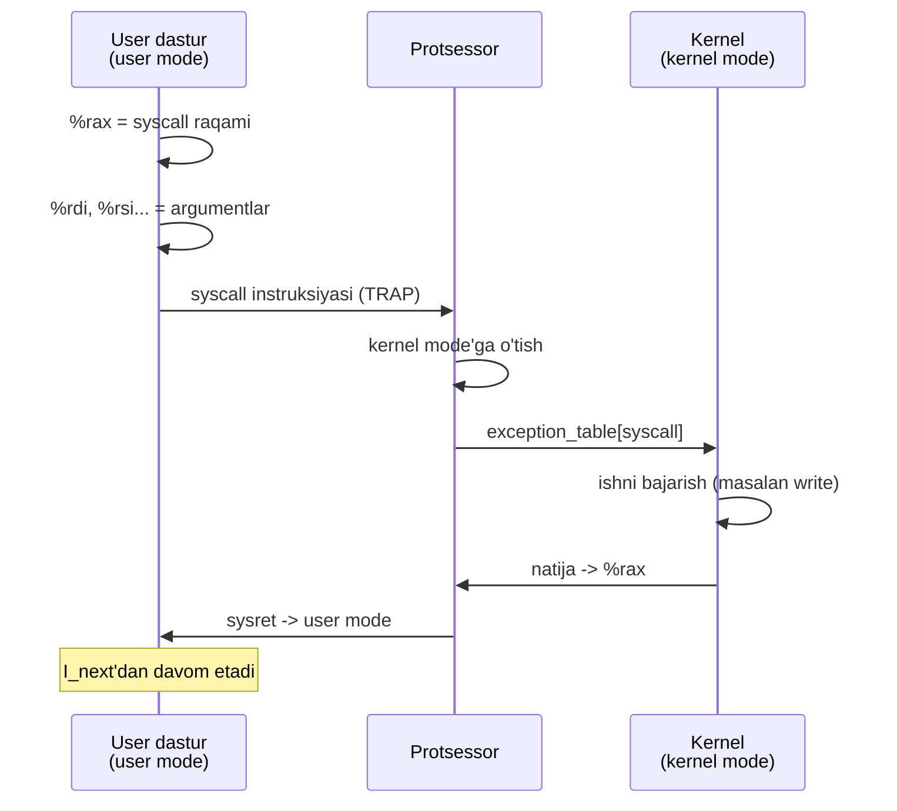
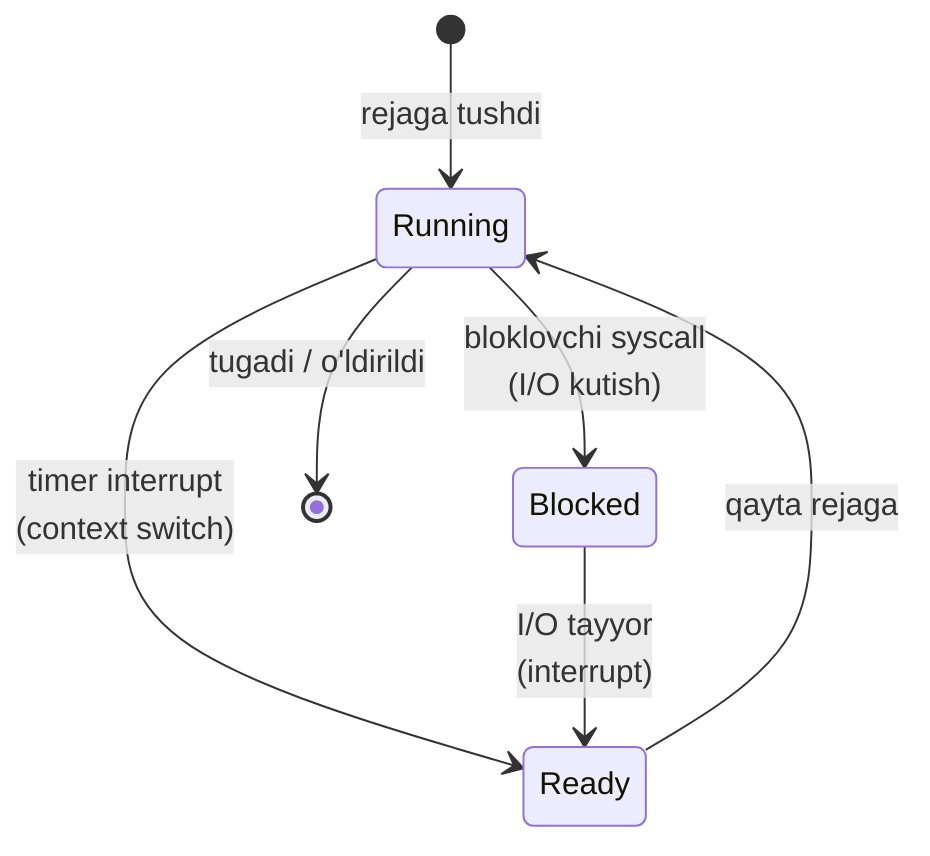
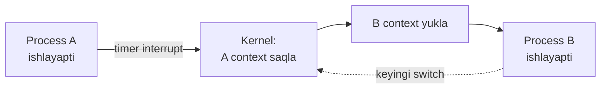
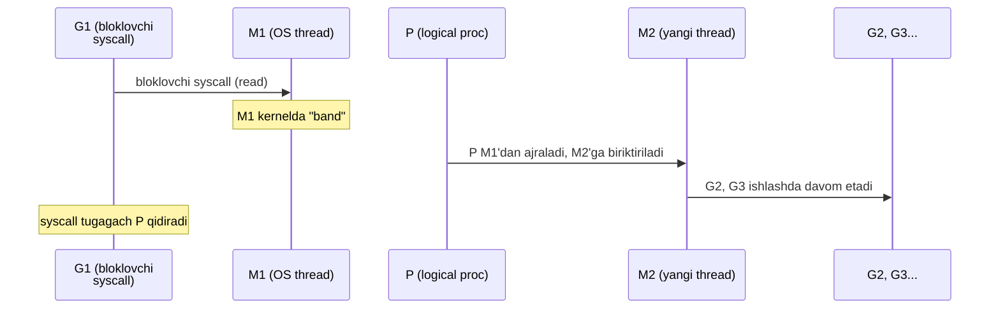

# 21. Exceptions va Processlar — syscall, kernel mode, context switch

> Manba: CS:APP 2-nashr, 8.1-8.3 · Muhit: syscall mexanikasi x86-64 (Docker), latency native arm64 Apple Silicon · [← Oldingi](20-dynamic-linking.md) · [Kurs xaritasi](00-README.md) · [Keyingi →](22-process-control.md)

## Nima uchun kerak

3 yillik Go backend developer sifatida sen har kuni process yaratasan, fayl o'qiysan, tarmoqqa yozasan — bularning HAMMASI ostida **system call** va **exception** mexanizmi ishlaydi. Nega bloklovchi `os.ReadFile` chaqirilganda butun dasturing "muzlab qolmaydi", boshqa goroutine'lar ishlashda davom etadi? Nega minglab mayda `log.Print` chaqiruvi bitta katta yozuvdan sekinroq? Nega dasturing xotiraga birinchi murojaatda "page fault" bo'ladi-yu, lekin crash bo'lmaydi? Bu darsda process abstraksiyasini — butun backend dunyosining poydevorini — apparat darajasidan tushunasan.

20-darsda dinamik bog'lash (PLT) orqali funksiya chaqiruvi kutubxonaga qanday yetib borishini ko'rgan eding. Endi bir qadam pastga tushamiz: `write` yoki `read` funksiyasi OXIR-OQIBAT nima qiladi? U kernel'ga **trap** qiladi. Bu dars 8-bobning (exceptional control flow) boshi va u process boshqaruvi (22-dars, fork/exec/wait), signallar (23-dars) va virtual memory (24-25 darslar) uchun poydevor qo'yadi.

## Nazariya

### 1. EXCEPTIONAL CONTROL FLOW (ECF)

01-darsda process va context switch tanishtirilgan edi. Endi ostiga tushamiz. Protsessor odatda dasturni **ketma-ket** bajaradi: bir instruksiya, keyingisi, yana keyingisi — bu **control flow** (bajarilish oqimi). 09-darsda ko'rgan `call`/`ret` ham shu oqimni boshqaradi, lekin ular DASTUR ichida.

Ammo real dunyo tartibsiz: klaviatura bosiladi, tarmoq paketi keladi, dastur nol'ga bo'ladi, kernel'dan xizmat so'raladi. Bu hodisalar normal instruksiya oqimini **buzadi** — ularni apparat va OS birgalikda boshqaradi. Buni **Exceptional Control Flow (ECF)** — istisnoli boshqaruv oqimi deb ataymiz.

Farqni his qil: `call`/`ret` (09-dars) ECF EMAS — ular DASTUR ichidagi rejalashtirilgan sakrash, dastur o'zi boshqaradi. ECF esa dasturdan TASHQARI kuchlar (qurilma, xato, kernel so'rovi) tomonidan qo'zg'atiladi va uni APPARAT + OS boshqaradi, dastur ko'pincha bexabar qoladi. Aynan shu tashqi boshqaruv tufayli bitta CPU minglab process va I/O qurilmasini bir vaqtda "jonglyor" qila oladi.

> Oltin qoida: ECF — bu kompyuterning "kutilmagan hodisaga javob berish" mexanizmi. Tashqi qurilmalardan tortib xotira xatosigacha, hammasi shu bitta apparat mexanizmi orqali boshqariladi.

### 2. EXCEPTION nima va u qanday ishlaydi

**Exception** (istisno) — bu protsessor holatidagi biror o'zgarishga (event) javoban boshqaruvni user dasturidan OS'ning maxsus subroutine'iga (**exception handler**) o'tkazish. Ketma-ketlik:

1. Protsessor `I_curr` instruksiyasini bajarayotganda **event** yuz beradi (masalan tarmoq karta signal berdi).
2. Protsessor joriy holatni saqlaydi va **kernel mode**'ga o'tadi.
3. **Exception table** (istisnolar jadvali) orqali tegishli handler manzili topiladi.
4. Handler ishlaydi (event'ni qayta ishlaydi).
5. Handler tugagach, boshqaruv qaytariladi (yoki `I_curr`'ga, yoki `I_next`'ga, yoki dastur o'ldiriladi).

### 3. EXCEPTION'ning to'rt turi

Bu darsning yuragi. To'rt tur ikki o'lchov bo'yicha farqlanadi: **sinxronmi yoki asinxron** (instruksiya bajarilishiga bog'liqmi) va **qanday qaytadi**.

| Tur | Sabab | Sinxron/Asinxron | Handler qaytishi | Misol |
| --- | --- | --- | --- | --- |
| **Interrupt** | Tashqi qurilma signali | Asinxron | Keyingi instruksiyaga (`I_next`) | Timer, klaviatura, tarmoq karta |
| **Trap** | Ataylab (instruksiya) | Sinxron | Keyingi instruksiyaga (`I_next`) | **System call**, breakpoint |
| **Fault** | Xato, tuzatsa bo'ladi | Sinxron | Joriy instruksiyaga (`I_curr`) qayta urinish | **Page fault** |
| **Abort** | Tuzatib bo'lmas xato | Sinxron | Qaytmaydi (dastur o'ladi) | Apparat/xotira nosozligi |

- **Interrupt** — ASINXRON, ya'ni joriy instruksiyaga bog'liq emas. Tashqi qurilma protsessor pinini "chertadi". Handler ishlab bo'lgach, oqim `I_next`'dan davom etadi — dastur hech narsani sezmaydi.
- **Trap** — SINXRON va ATAYLAB. Dastur `syscall` instruksiyasini bajaradi — "kernel'dan xizmat so'rayapman" deyish uchun. Bu backend dasturchi uchun ENG muhim tur, chunki har fayl/tarmoq amali oxir-oqibat trap.
- **Fault** — SINXRON, XATO, lekin ko'pincha TUZATSA bo'ladi. Eng mashhuri **page fault**: dastur hali xotiraga yuklanmagan sahifaga murojaat qiladi, kernel sahifani yuklaydi va HUDDI SHU instruksiyani qaytadan bajaradi. Dastur davom etadi (24-25 darslar, virtual memory).
- **Abort** — SINXRON va TUZATIB BO'LMAS. Masalan xotira apparatida parity xatosi. Dastur o'ldiriladi.

Backend kontekstida to'rt turni bog'lab qo'yaylik: Go serveringda tarmoq paketi kelganda — **interrupt** (tarmoq karta signal beradi, netpoller uyg'onadi); `conn.Read` chaqirilganda — **trap** (`read` syscall); yangi ajratilgan slice'ga birinchi yozishda — **fault** (page fault, lazy allocation); RAM apparat nosozligida — **abort** (juda kam, odatda ko'rmaysan). Ya'ni kunlik ishing ostida asosan interrupt va trap yashaydi.



### 4. EXCEPTION TABLE — jump table apparat darajasida

08-darsdagi `switch` operatori ostida **jump table** (sakrash jadvali) bor edi — har `case` uchun manzil. Exception table AYNAN shu g'oyani apparat darajasida takrorlaydi. Har exception turi o'z **raqami**ga (exception number) ega. Protsessor ichida maxsus registr (x86-64 da IDTR) jadval boshiga ko'rsatadi. Exception `k` bo'lganda:

```
handler_manzil = exception_table[k]
```

Bu O(1) — indeksdan to'g'ridan-to'g'ri manzilga. Raqamlarning bir qismi apparat tomonidan (masalan 0 = divide error, 14 = page fault), qolgani OS tomonidan belgilanadi.

### 5. USER MODE va KERNEL MODE

Protsessorda **mode bit** (rejim biti) bor — u ikki privilege darajasini ajratadi:

| | User mode | Kernel mode |
| --- | --- | --- |
| Hardware'ga to'g'ridan | Yo'q | Ha |
| Privileged instruksiyalar | Taqiqlangan | Ruxsat |
| Boshqa process xotirasi | Yo'q | Ha |
| Nima ishlaydi | Sening dasturing | OS yadrosi |

Sening Go dasturing NORMAL holatda **user mode**'da ishlaydi — u to'g'ridan-to'g'ri diskka yozolmaydi, tarmoq kartaga buyruq berolmaydi. Buning uchun u kernel'dan SO'RASHI kerak. Bu so'rov — **system call** (syscall) — nazoratlangan yagona eshik. Boshqacha aytganda: user mode = "mehmon huquqlari", kernel mode = "administrator huquqlari", syscall = "administratorga rasmiy ariza".

Nega ikki rejim kerak? **Himoya va izolyatsiya.** Agar har dastur hardware'ga to'g'ridan-to'g'ri tegisha olsa, bitta xato yoki zararli kod butun tizimni ag'darib tashlar edi — diskni o'chirar, boshqa process xotirasini o'qir edi. Mode bit apparat darajasida bu chegarani majburiy qiladi: privileged instruksiya user mode'da bajarilsa, protsessor **fault** (general protection fault) ko'taradi. Shuning uchun kernel yagona "darvozabon" — barcha hardware murojaati u orqali, syscall interfeysi bilan boradi.

### 6. SYSTEM CALL — trap orqali kernelga kirish

**System call** — user dasturi kernel'dan xizmat so'rashi (fayl ochish, xotira olish, process yaratish). Mexanika (2-demoda isbotlaymiz):

1. Dastur syscall RAQAMINI `%rax` registriga qo'yadi (06-darsdagi registrlar).
2. Argumentlarni `%rdi`, `%rsi`, `%rdx`... ga qo'yadi.
3. `syscall` instruksiyasini bajaradi → bu **TRAP**.
4. Protsessor **kernel mode**'ga o'tadi, exception table'dan syscall handler'ni topadi.
5. Kernel ishni bajaradi, natijani `%rax`'ga qaytaradi.
6. `sysret` bilan **user mode**'ga qaytadi.



### 7. PROCESS abstraksiyasi — ikki katta illyuziya

01-darsda process tanishtirilgan. Endi ikki asosiy illyuziyasini aniq ajratamiz:

- **Logical control flow** — har process CPU'ni YOLG'IZ ishlatayotgandek his qiladi. Aslida OS bir nechta processni bitta CPU'da navbatlashtiradi (**context switch**), lekin har biri uzluksiz ishlayotgandek ko'rinadi.
- **Private address space** — har process O'Z xotirasiga ega bo'lgandek his qiladi (24-25 darslar). Boshqa process xotirasini ko'rolmaydi. Bu himoya va izolyatsiya beradi.

Bu illyuziyalarni OS **kernel** yaratadi. Har process uchun kernel maxsus struktura (Linux'da `task_struct`) saqlaydi: PID, holat (running/sleeping), registrlar konteksti, xotira xaritasi (page table), ochiq file descriptorlar (28-dars). Process bir necha holatda bo'ladi:



Blocked holat MUHIM: process bloklovchi syscall qilsa (masalan diskdan o'qish), kernel uni "sleeping" qiladi va CPU'ni BOSHQA process'ga beradi. I/O tayyor bo'lganda qurilma **interrupt** yuboradi, kernel process'ni yana "ready" qiladi. Bu Go netpoller'ining OS darajasidagi asosi.

### 8. CONTEXT SWITCH

**Context switch** (kontekst almashuvi) — OS bir processdan boshqasiga o'tishi. Bu ECF'ning yuqori darajali ko'rinishi: kernel joriy process **context**'ini (registrlar, program counter, stack ko'rsatkichi, xotira xaritasi) saqlaydi, keyingi processnikini yuklaydi. Odatda timer interrupt (asinxron exception) buni qo'zg'atadi. Context switch QIMMAT — registrlar saqlanadi, TLB/kesh sovuydi. Ikki holatda yuz beradi: (1) timer interrupt — process CPU vaqtini "yeb bo'ldi" (preemption); (2) bloklovchi syscall — process I/O kutishga o'tdi. Ikkalasi ham ECF orqali kernel'ga o'tishni talab qiladi.



### 9. Notional machine — syscall paytida xotirada ASLIDA nima bo'ladi

Kod satrlari ortida real mexanikani ko'raylik. `write(1, buf, 6)` chaqirilganda:

1. **User stack** — argumentlar registrlarga joylashadi: `%rax=1` (SYS_write), `%rdi=1` (fd), `%rsi=buf manzili`, `%rdx=6`. Bu 06-darsdagi calling convention.
2. **`syscall` instruksiyasi** — protsessor `%rip` (program counter)'ni saqlaydi, mode bit'ni **kernel**'ga o'zgartiradi, va **kernel stack**'ga o'tadi (har process'ning alohida kernel stack'i bor). User stack'ga TEGILMAYDI.
3. **Exception table** — protsessor syscall handler manzilini jadvaldan oladi (MSR registrida saqlangan). Kernel `%rax`'dagi raqamga qarab syscall jadvalidan `sys_write`'ni topadi.
4. **Kernel ishlaydi** — `buf`'dagi 6 baytni kernel bufer'iga (page cache) ko'chiradi (`copy_from_user`), fd'ga bog'langan qurilmaga navbatga qo'yadi.
5. **`sysret`** — natija (yozilgan bayt soni) `%rax`'ga, mode bit **user**'ga, saqlangan `%rip` tiklanadi. Dastur `I_next`'dan davom etadi.

Muhim nuqta: syscall paytida SENING xotirang (user address space) o'zgarmaydi — kernel faqat argumentlarni O'QIYDI (yoki `copy_from_user`/`copy_to_user` bilan ko'chiradi). Bu izolyatsiya (private address space) himoyasi. Demo 2'dagi ~166 ns'ning katta qismi aynan mode almashuvi + stack o'tish + Spectre/Meltdown yumshatishlariga ketadi.

### 10. Exception vs Signal — chegarani ayt

Adashmaslik uchun: **exception** — apparat/kernel darajasidagi past darajali mexanizm (interrupt, trap, fault, abort). **Signal** (23-dars) — kernel'dan USER process'ga yuboriladigan yuqori darajali xabar (masalan `SIGINT` Ctrl+C'da). Ko'pincha exception SIGNAL'ga aylanadi: page fault ruxsatsiz manzilda bo'lsa, kernel process'ga `SIGSEGV` yuboradi. Ya'ni exception — apparat hodisasi, signal — uning process'ga yetkazilgan ko'rinishi. Bu darsda exception'ga, 23-darsda signal'ga fokuslanamiz.

### 11. SYSTEM CALL ERROR HANDLING — errno

Ko'p Unix syscall xato bo'lganda **-1** qaytaradi va global **`errno`** o'zgaruvchisini xato kodiga o'rnatadi. Muhim qoida: `errno`'ni HAR syscall'dan KEYIN, natija tekshirilgandan so'ng o'qi (chunki keyingi muvaffaqiyatli chaqiruv uni O'CHIRMAYDI, lekin boshqa chaqiruv o'zgartirishi mumkin). C'da namuna:

```c
if ((pid = fork()) < 0) {
    fprintf(stderr, "fork xatosi: %s\n", strerror(errno));
    exit(0);
}
```

Go'da bu abstraksiya `error` qiymatiga o'raladi — `if err != nil` naqshi aynan shu `errno` tekshiruvining zamonaviy ko'rinishi. Go standart kutubxonasi syscall'ni chaqirib, -1/errno'ni tekshirib, uni `*os.PathError` yoki `syscall.Errno` kabi tipli xatoga aylantiradi. Masalan `os.Open` fayl topilmasa, ostida `open` syscall -1 qaytargan va errno=ENOENT bo'lgan; Go buni `err` sifatida beradi va sen `errors.Is(err, os.ErrNotExist)` bilan tekshirasan. Ya'ni C'dagi qo'lda `errno` tekshiruvi Go'da tipli, xavfsiz `error` interfeysiga ko'tarilgan — lekin ostidagi mexanizm bir xil.

## Kod va isbot

Quyidagi demolar ikki muhitda tekshirilgan: syscall MEXANIKASI (registrlar, PLT, assembly) x86-64 (Docker), latency O'LCHOVI esa native arm64 (Apple Silicon). Sabab: assembly va syscall raqamlari x86-64'da klassik CS:APP bilan mos; latency esa emulyatsiyasiz real apparatda o'lchanishi kerak. Printsip ikkala arxitekturada bir xil — faqat aniq raqamlar farq qiladi.

### Demo 1 — Syscall ikki yo'l bilan (x86-64, gcc 13.3.0)

Bir xil natijaga ikki yo'l: `libc` wrapper va to'g'ridan-to'g'ri `syscall`.

```c
#include <stdio.h>
#include <unistd.h>
#include <sys/syscall.h>

int main(void)
{
    pid_t p1 = getpid();                    /* libc wrapper */
    long  p2 = syscall(SYS_getpid);         /* to'g'ridan-to'g'ri syscall */
    printf("getpid() wrapper  = %d\n", p1);
    printf("syscall(SYS_getpid) = %ld\n", p2);
    printf("SYS_getpid raqami = %d\n", SYS_getpid);
    printf("SYS_write raqami   = %d\n", SYS_write);
    return 0;
}
```

Output:

```
getpid() wrapper  = 737
syscall(SYS_getpid) = 737
SYS_getpid raqami = 39
SYS_write raqami   = 1
```

Tahlil: `getpid()` — bu **libc wrapper** (o'ram funksiya), uning ICHIDA `syscall` instruksiyasi bajariladi. `syscall(SYS_getpid)` esa to'g'ridan-to'g'ri chaqiradi. Ikkalasi ham **bir xil PID (737)** qaytardi — chunki oxir-oqibat IKKALASI HAM bitta kernel syscall'ni chaqiradi. Har syscall'ning RAQAMI bor: `getpid=39`, `write=1`. Mexanika: `%rax`'ga raqam, argumentlar `%rdi/%rsi/...`'ga (06-darsdagi registrlar), keyin `syscall` instruksiyasi → CPU kernel mode'ga o'tadi, exception table'dan handler topiladi. Bu **TRAP** — ataylab qilingan exception.

### Demo 2 — Syscall NARXI: kernel crossing (native arm64, Apple Silicon)

Bu darsning MARKAZIY o'lchovi. `getpid` syscall'ni N marta vs oddiy user-space amalni N marta o'lchaymiz.

```c
/* getpid syscall N marta vs oddiy user-space amal */
for(long i=0;i<N;i++) syscall(SYS_getpid);   /* har safar kernelga o'tadi */
for(long i=0;i<N;i++) x+=i;                    /* user-space, kernelga o'tmaydi */
```

Output (N=5,000,000):

```
syscall (getpid): 166.3 ns
user-space amal:  2.15 ns
nisbat: ~77x
```

Tahlil: Bitta syscall ~166 ns, oddiy user-space amal ~2 ns — syscall **~77x QIMMAT**! Nega? Har syscall'da user mode → kernel mode → user mode o'tish sodir bo'ladi:

- registrlarni saqlash,
- privilege darajasini (mode bit) o'zgartirish,
- kernel stack'ga o'tish,
- qaytishda teskarisi.

Bu **"kernel crossing"** narxi. `getpid` maxsus tezlatilmagani uchun to'liq syscall narxini ko'rsatadi. AMALIY XULOSA: **syscall'larni kamaytir** — masalan mayda `write`'larni buffer'lab bitta katta `write` qil (29-dars). Bu o'lchov Apple Silicon (arm64) da; syscall MEXANIKASI esa yuqorida x86-64 (csapp) da — printsip ikkalasida ham universal.

> Eslab qol: syscall arzon EMAS. ~100-170 ns — oddiy funksiya chaqiruvidan o'nlab-yuzlab marta qimmat. Sening I/O naqshing shu narxni necha marta to'lashini belgilaydi.

Perspektiva uchun taxminiy latency zinasi (kattalik tartibi, mashinaga bog'liq):

| Amal | Taxminiy narx | Izoh |
| --- | --- | --- |
| Registr amal (`x+=i`) | ~1-2 ns | Kernel crossing yo'q (Demo 2) |
| Funksiya chaqiruv (`call`) | ~1-3 ns | User-space, 09-dars |
| **Syscall (getpid)** | **~100-170 ns** | **Kernel crossing (Demo 2)** |
| OS thread context switch | ~1-2 mks | Registr saqla + TLB flush |
| Page fault (minor) | ~1-5 mks | Sahifa xaritalash |
| SSD'dan o'qish | ~50-150 mks | Real qurilma I/O |

Xulosa: syscall funksiya chaqiruvdan ~100x qimmat, lekin real disk I/O'dan ~1000x arzon. Shuning uchun mayda syscall'lar (buffering yo'q) og'riq beradi, lekin syscall'ning O'ZI emas — uni CHAQIRISH SONI muammo.

### Demo 3 — write syscall assembly'da (x86-64)

```c
#include <unistd.h>
int main(void) { write(1, "salom\n", 6); return 0; }
```

`objdump -d` chiqishi (asosiy qator):

```
    1162:	e8 e9 fe ff ff       	call   1050 <write@plt>
```

Tahlil: `write()` — bu **libc wrapper**, u **PLT** orqali chaqiriladi (20-dars, dynamic linking). Wrapper ichida `%rax=1` (SYS_write), `%rdi=1` (fd — stdout), `%rsi=buffer manzili`, `%rdx=6` (uzunlik) o'rnatilib `syscall` instruksiyasi bajariladi. Natijada kernel ekranga yozadi. `fd=1` — stdout (28-darsda file descriptorlar batafsil).

### strace haqida (halol izoh)

Native Linux'da `strace ./prog` buyrug'i har syscall'ni argumentlari bilan real vaqtda ko'rsatadi, masalan:

```
write(1, "salom\n", 6) = 6
```

LEKIN bizning verify muhitimiz Docker + QEMU user-mode emulyatsiya ostida. Bu rejimda `strace` INDIVIDUAL syscall qatorlarini KO'RSATA OLMAYDI — faqat `+++ exited with 0 +++` chiqadi (QEMU user-mode cheklovi). Shuning uchun yuqoridagi `write(1, ...) = 6` qatorini "verify qilingan output" deb OLMA — u KONTSEPTUAL misol. Native Linux'da `strace` to'liq ishlaydi, `strace -c` esa syscall'larni SANAB jadval beradi (I/O naqsh muammolarini topishda oltin vosita).

## Go dasturchiga ko'prik

Endi eng qiziq qismi — bularning HAMMASI Go runtime'ida qanday namoyon bo'ladi.

### Goroutine bloklovchi syscall qilganda

Savol: agar bitta goroutine bloklovchi syscall qilsa (masalan katta fayl o'qish), butun dastur to'xtaydimi? **YO'Q.** Go **M:N scheduler** ishlatadi: M ta OS thread ustida N ta goroutine navbatlashtiriladi. Uch asosiy tushuncha:

- **G** — goroutine,
- **M** — OS thread (machine),
- **P** — logical processor (context, run queue'ni ushlaydi).

Goroutine bloklovchi syscall'ga kirganda (`entersyscall`), runtime o'sha goroutine'ni `_Gsyscall` holatiga o'tkazadi. Agar syscall UZOQ bloklab qolsa, **P** o'sha M'dan AJRALADI (detach) va BOSHQA M'ga (yoki yangi thread'ga) biriktiriladi — shunda P'ning run queue'sidagi qolgan goroutine'lar ishlashda davom etadi. Syscall tugagach (`exitsyscall`), goroutine yana biror P'ni olishga urinadi.



Xulosa: **bitta bloklovchi syscall butun dasturni to'xtatmaydi** — scheduler boshqa goroutine'ni boshqa thread'da ishga tushiradi. Bu Go'ning konkurensiyadagi kuchi.

Muhim nuance: har goroutine syscall'i P'ni AJRATMAYDI. Agar syscall TEZ tugasa (masalan cache'dan `getpid`), runtime `entersyscallblock` o'rniga arzon yo'ldan boradi va P'ni ushlab turadi. Faqat syscall UZOQ bloklasa (sysmon ~20 mikrosekunddan keyin sezadi), P boshqa M'ga ko'chiriladi. Bu balans: tez syscall'da ortiqcha P ko'chirish overhead'i bo'lmaydi, uzun syscall'da esa boshqa goroutine'lar och qolmaydi.

### Netpoller — tarmoq syscall'lari uchun

Tarmoq I/O (`conn.Read`, `conn.Write`) uchun Go ALOHIDA mexanizm — **netpoller** — ishlatadi. Har tarmoq amali uchun thread bloklamaslik uchun netpoller OS'ning non-blocking primitivlaridan foydalanadi: Linux'da **epoll**, macOS/BSD'da kqueue, Windows'da IOCP (32-dars, concurrency). Goroutine tarmoqda bloklanishi kerak bo'lsa, netpoller fd'ni OS'ga ro'yxatga oladi va goroutine'ni `_Gwaiting` holatiga o'tkazadi — shunda MINGLAB goroutine minglab thread'siz I/O kutishi mumkin. Data tayyor bo'lganda epoll xabar beradi, goroutine uyg'onadi.

### Syscall narxi Go'da ham bor

Demo 2'dagi ~166 ns narx Go'da ham yashamaydi emas. `fmt.Println` yoki `os.File.Write`'ning HAR chaqiruvi — potensial syscall. Shuning uchun Go standart kutubxonasi **`bufio`** (29-dars) beradi: mayda yozuvlarni xotira buferida to'plab, BITTA katta `write` syscall qiladi. Bu kernel crossing sonini keskin kamaytiradi.

### Boshqa foydali detallar

- `runtime.LockOSThread()` — goroutine'ni MA'LUM OS thread'ga bog'laydi (masalan OpenGL yoki ba'zi C kutubxonalari uchun kerak).
- `syscall.Syscall` — Go'da to'g'ridan-to'g'ri syscall qilish mumkin, lekin kam ishlatiladi (odatda standart kutubxona yetarli).
- `GODEBUG=schedtrace=1000` — har sekundda scheduler holatini (M, P, G soni) ko'rsatadi. `GODEBUG=scheddetail=1` batafsil.

### GODEBUG=schedtrace bilan kuzatish

Terminalda `GODEBUG=schedtrace=1000 ./server` deb ishga tushirsang, har sekundda quyidagiga o'xshash qator chiqadi (kontseptual namuna, real raqamlar mashinaga bog'liq):

```
SCHED 1000ms: gomaxprocs=8 idleprocs=6 threads=12 runqueue=0 [0 0 1 0 0 0 0 0]
```

O'qilishi: `gomaxprocs=8` — 8 ta P (logical processor); `idleprocs=6` — 6 tasi bo'sh; `threads=12` — 12 ta M (OS thread) — bu 8 dan KO'P, chunki ba'zilari bloklovchi syscall'da "band"; `runqueue` va kvadrat qavs — kutayotgan goroutine'lar soni. Agar `threads` P'dan juda ko'p bo'lsa — ko'p goroutine bloklovchi syscall'da, ya'ni I/O og'ir yuk. Bu Demo 2'dagi syscall narxining tizim darajasidagi ko'rinishi.

### Context switch narxi — goroutine vs OS thread

01-darsdan eslasang, OS thread context switch QIMMAT (~1-2 mikrosekund — registrlar, TLB flush, kesh sovishi). Go'ning ustunligi shundaki, GOROUTINE almashuvi context switch EMAS — u user-space'da, kernel'ga o'tmasdan sodir bo'ladi (~ncha yuz nanosekund yoki kamroq). Ya'ni Go scheduler bir goroutine'dan boshqasiga o'tganda syscall/trap YO'Q. Faqat goroutine bloklovchi syscall QILGANDA kernel aralashadi. Shuning uchun minglab goroutine arzon, minglab OS thread qimmat.

## Real-world scenariylar

### Scenariy 1 — Ko'p mayda write → sekin log

Backend'da har request uchun `log.Printf` chaqirasan. Yuqori yuklamada bu minglab mayda syscall'ga aylanadi — har biri ~150+ ns kernel crossing. Yechim: `bufio.Writer` bilan log'ni bufer'lab, davriy `Flush` qilish yoki asinxron log kanaliga yozish. Demo 2 aynan shu muammoning apparat sababini ko'rsatadi.

### Scenariy 2 — Page fault normal hodisa (lazy allocation)

Katta slice ajratasan (`make([]byte, 1<<30)`) — lekin OS xotirani DARROV bermaydi. Birinchi murojaatda har sahifa uchun **page fault** (FAULT tipi) yuz beradi, kernel sahifani yuklaydi va instruksiyani QAYTA bajaradi. Bu CRASH emas — bu **lazy allocation** (dangasa ajratish). Xuddi shunday `mmap` bilan fayl'ni xotiraga xaritalasang (25-dars), birinchi murojaatda fayl bloki page fault orqali yuklanadi. Minor page fault normal; ular ortib ketsa (`/usr/bin/time -v` da major fault) — xotira bosimi belgisi.

### Scenariy 3 — Yuqori syscall soni profilda

Servising sekin, lekin CPU bo'sh? `strace -c ./server` (native Linux) yoki `perf` bilan syscall statistikasini ko'r. Agar `read`/`write`/`futex` soni haddan tashqari ko'p bo'lsa — bu I/O naqsh muammosi: buffer yo'q, yoki juda mayda porsiyalarda o'qiyapsan, yoki lock contention (`futex`). Yechim: buffer'lash, batching, yoki lock granularligini kamaytirish.

### Scenariy 4 — Konteynerda seccomp syscall'ni bloklaydi

Docker/Kubernetes ostida process seccomp profili bilan cheklanadi — ba'zi syscall'lar (masalan `ptrace`, ba'zi mount amallari) TAQIQLANGAN. Agar Go dasturing kutilmaganda "operation not permitted" xatosini bersa, sabab kod emas — konteyner seccomp profili o'sha syscall'ni blokladi. Debug uchun profilni yumshatish (`--security-opt seccomp=unconfined`) yoki kerakli syscall'ni ruxsat berish kerak. Bu exception mexanizmining xavfsizlik qatlamidagi ko'rinishi: kernel har syscall'ni ruxsat ro'yxatiga solishtiradi.

## Zamonaviy yondashuv

Web sintezidan zamonaviy tendensiyalar:

- **Syscall narxi oshdi.** Spectre/Meltdown zaifliklariga qarshi yumshatishlar (KPTI — Kernel Page Table Isolation, retpoline/IBRS) har user↔kernel o'tishga qo'shimcha TLB flush va instruksiyalar qo'shdi. Endi bare mode switch ~100-300 ns, real `read` esa page cache'da ~1 mikrosekundgacha. Bu syscall'ni kamaytirishni yanada muhim qildi.
- **vDSO (virtual Dynamic Shared Object).** Ba'zi "syscall"lar (`gettimeofday`, `clock_gettime`) aslida kernelga O'TMAYDI — kernel ma'lumotni user-space'ga xaritalangan sahifada saqlaydi, funksiya to'g'ridan-to'g'ri o'qiydi. Shuning uchun vaqt olish ODATDA arzon (Demo 2'dagi `getpid` esa maxsus tezlatilmagan — to'liq narxni ko'rsatadi).
- **io_uring.** Linux'ning yangi asinxron I/O interfeysi: user va kernel umumiy ring buferlar orqali gaplashadi, ko'p operatsiyani BITTA syscall'da (yoki umuman syscall'siz) bajarish mumkin — syscall sonini minimallashtiradi (28-darsga teaser).
- **eBPF** — kernel ichida xavfsiz dastur ishlatish (kuzatuv, tarmoq, xavfsizlik) syscall overhead'siz.
- **seccomp** — process qila oladigan syscall'lar ro'yxatini CHEKLASH (sandboxing). Konteynerlar (Docker) va brauzerlar shu bilan hujum yuzasini kamaytiradi.
- **Kernel bypass.** Yuqori chastotali tarmoq (HFT, ma'lumot markazlari) uchun DPDK/RDMA kabi texnologiyalar syscall'ni UMUMAN chetlab, tarmoq kartaga user-space'dan to'g'ridan-to'g'ri murojaat qiladi — kernel crossing narxini nolga tushiradi. Bu Demo 2'dagi 77x muammoni ekstremal darajada hal qilish.

Umumiy tendensiya bitta: **kernel crossing qimmat, uni kamaytir yoki chetlab o't**. Buffer'lash (`bufio`), batching (io_uring), vDSO, kernel bypass — hammasi shu bir maqsadga xizmat qiladi. 3 yillik backend developer uchun eng amaliy xulosa: hot path'da syscall sonini profil bilan o'lchab, `bufio` va batching bilan kamaytirish.

## Keng tarqalgan xatolar

1. **"Syscall arzon" deb o'ylash.** Demo 2 aniq ko'rsatdi: ~166 ns, oddiy user-space amaldan ~77x qimmat. Issiq yo'lda (hot path) har syscall'ni sana.
2. **Buffer'lamaslik — mayda write/read.** Har `os.File.Write([]byte{b})` — potensial syscall. `bufio` bilan o'ra (29-dars).
3. **Page fault'ni crash deb o'ylash.** Ko'p page fault NORMAL (lazy loading, mmap). Faqat major fault ko'pligi yoki segfault (protection fault) muammo. FAULT ≠ ABORT.
4. **`errno`/`error`'ni tekshirmaslik.** Syscall -1 qaytarsa `errno` o'rnatiladi. Go'da `if err != nil`'ni tashlab ketma — bu aynan `errno` tekshiruvining zamonaviy shakli.
5. **"Goroutine bloklovchi syscall'da hamma goroutine to'xtaydi" degan noto'g'ri tasavvur.** YO'Q — M:N scheduler P'ni boshqa thread'ga o'tkazadi, qolgan goroutine'lar ishlashda davom etadi.
6. **User va kernel mode'ni chalkashtirish.** Sening kodung user mode'da; hardware'ga tegish uchun ALBATTA syscall (trap) orqali kernel'dan so'rash kerak.

## Amaliy mashqlar

### 1-mashq (oson)
`getpid()` (libc wrapper) va `syscall(SYS_getpid)` nega BIR XIL qiymat (737) qaytardi?

<details>
<summary>Yechim</summary>

Chunki ikkalasi ham OXIR-OQIBAT bitta va o'sha kernel syscall'ni (raqami 39) chaqiradi. `getpid()` — shunchaki `syscall(SYS_getpid)`'ni o'raydigan libc wrapper. Farq — sintaksisda, natijada emas.
</details>

### 2-mashq (oson)
Demo 2'da syscall ~166 ns, user-space amal ~2 ns. Nega syscall ~77x qimmat? Kamida uch sababni ayt.

<details>
<summary>Yechim</summary>

Har syscall'da: (1) registrlarni saqlash, (2) privilege darajasini (mode bit) user→kernel→user o'zgartirish, (3) kernel stack'ga o'tish va qaytish, (4) Spectre/Meltdown yumshatishlari — TLB flush, qo'shimcha instruksiyalar. Bu "kernel crossing" narxi. User-space amal (`x+=i`) hech qanday mode o'tishisiz bajariladi.
</details>

### 3-mashq (o'rta)
1 million marta `write(1, buf, 1)` (har biri 1 bayt) vs 1 million baytni BITTA `write` bilan — qaysi tez va nechi barobar? Nega?

<details>
<summary>Yechim</summary>

Bitta katta write ~1 million marta tez. Sabab: har `write` — bitta syscall (~150+ ns kernel crossing). 1 million mayda write = 1 million kernel crossing ≈ 150+ millisekund faqat o'tishlarga. Bitta katta write = 1 kernel crossing. Demo 2'dagi 77x mantiq shu — Go'da `bufio.Writer` aynan buni hal qiladi (29-dars).
</details>

### 4-mashq (o'rta)
Har hodisa uchun exception TURINI ayt: (a) Ctrl+C bosildi, (b) dastur yuklanmagan xotira sahifasiga murojaat qildi, (c) `read` syscall chaqirildi, (d) xotira apparatida parity xatosi.

<details>
<summary>Yechim</summary>

(a) Ctrl+C → **interrupt** (asinxron, tashqi qurilma — klaviatura → keyin signal, 23-dars). (b) yuklanmagan sahifa → **fault** (page fault, tuzatsa bo'ladi — sahifa yuklanadi, instruksiya qayta bajariladi). (c) `read` syscall → **trap** (ataylab, kernel'dan xizmat). (d) parity xatosi → **abort** (tuzatib bo'lmas, dastur o'ladi).
</details>

### 5-mashq (o'rta)
User mode va kernel mode farqi nima? Sening Go dasturing qaysi rejimda ishlaydi va diskka yozish uchun nima qiladi?

<details>
<summary>Yechim</summary>

User mode — cheklangan (hardware'ga to'g'ridan-to'g'ri tegolmaydi, privileged instruksiyalar taqiqlangan, faqat o'z xotirasi). Kernel mode — to'liq huquq. Go dasturing NORMAL holatda user mode'da. Diskka yozish uchun u `write` **syscall** (trap) qiladi → CPU kernel mode'ga o'tadi → kernel diskka yozadi → user mode'ga qaytadi.
</details>

### 6-mashq (qiyin)
Nega bitta goroutine `os.ReadFile` bilan 5 sekund bloklansa ham, boshqa goroutine'lar ishlashda davom etadi? Mexanizmni M/P/G bilan tushuntir.

<details>
<summary>Yechim</summary>

Goroutine bloklovchi syscall'ga kirganda (`entersyscall`) Go runtime uni `_Gsyscall` holatiga qo'yadi. Syscall uzoq bloklasa, sysmon buni sezib **P**'ni o'sha bloklab qolgan **M** (OS thread)'dan ajratadi va boshqa M'ga (yoki yangi thread'ga) biriktiradi. Shunda P'ning run queue'sidagi qolgan **G**'lar boshqa thread'da ishlaydi. Syscall tugagach (`exitsyscall`) goroutine yana biror P olishga urinadi. Shuning uchun bitta bloklovchi syscall butun dasturni to'xtatmaydi.
</details>

### 7-mashq (qiyin)
`clock_gettime` (vaqt olish) nega odatda `getpid`dan ancha arzon, garchi ikkalasi ham "syscall" ko'rinsa?

<details>
<summary>Yechim</summary>

`clock_gettime` ko'p platformada **vDSO** orqali bajariladi — kernelga UMUMAN o'tmaydi. Kernel vaqt ma'lumotini user-space'ga xaritalangan maxsus sahifada saqlaydi, funksiya uni to'g'ridan-to'g'ri o'qiydi — kernel crossing YO'Q. `getpid` esa vDSO'da tezlatilmagan (Demo 2), shuning uchun to'liq trap narxini (~166 ns) to'laydi.
</details>

### 8-mashq (qiyin)
Demo 3'da `write` chaqiruvi `call 1050 <write@plt>` ko'rinishida. Nega to'g'ridan-to'g'ri `syscall` instruksiyasi emas, balki avval PLT orqali libc wrapper chaqiriladi? (20-darsni esla.)

<details>
<summary>Yechim</summary>

`write` — dinamik bog'langan libc funksiyasi. 20-darsdagi lazy binding sabab birinchi chaqiruvda **PLT** (Procedure Linkage Table) orqali haqiqiy manzil topiladi. Libc wrapper ichida registrlar (`%rax=1` va h.k.) o'rnatilib, KEYIN `syscall` instruksiyasi bajariladi. Ya'ni ikki qatlam: PLT (dynamic linking) → wrapper → `syscall` (trap). Wrapper qulaylik va portativlik beradi (turli platformada syscall raqamlari farq qiladi, libc buni yashiradi).
</details>

### 9-mashq (qiyin)
Nega minglab goroutine arzon, lekin minglab OS thread qimmat? Context switch nuqtai nazaridan tushuntir.

<details>
<summary>Yechim</summary>

OS thread almashuvi — kernel darajasidagi context switch (~1-2 mikrosekund): kernel'ga trap, registrlar saqlash, TLB flush, kesh sovishi. Goroutine almashuvi esa Go runtime tomonidan USER-SPACE'da bajariladi — kernel'ga o'tish YO'Q, faqat bir necha registr va stack ko'rsatkichini almashtirish (~yuz nanosekund). Minglab OS thread = minglab kernel context switch = katta overhead + har biriga ~megabaytlab stack. Goroutine'lar bitta OS thread ustida navbatlashadi, boshlang'ich stack ~2 KB. Shuning uchun M:N model tejamli.
</details>

### 10-mashq (qiyin)
`os.Open("yoq.txt")` mavjud bo'lmagan faylni ochsa, `err != nil` bo'ladi. Bu xato apparat/kernel darajasida qayerdan keladi? To'liq zanjirni ayt.

<details>
<summary>Yechim</summary>

Zanjir: (1) `os.Open` ostida `openat` **syscall** (trap) chaqiriladi; (2) CPU kernel mode'ga o'tadi, exception table orqali syscall handler ishlaydi; (3) kernel fayl tizimida faylni topa olmaydi, syscall **-1** qaytaradi va **errno=ENOENT** o'rnatadi; (4) `sysret` bilan user mode'ga qaytadi; (5) Go runtime -1'ni ko'rib, errno'ni `*os.PathError` (ichida `syscall.Errno(ENOENT)`) tipli `error`'ga o'raydi; (6) sen `if err != nil` yoki `errors.Is(err, os.ErrNotExist)` bilan ushlaysan. Ya'ni yuqori darajali `error` — past darajali trap + errno mexanizmining o'ralgan ko'rinishi.
</details>

## Cheat sheet

| Tushuncha | Nima | Eslab qolish |
| --- | --- | --- |
| **ECF** | Normal oqimni buzuvchi hodisalar boshqaruvi | "Kutilmagan hodisaga javob" mexanizmi |
| **Interrupt** | Asinxron, tashqi qurilma | Timer, klaviatura, tarmoq → `I_next` |
| **Trap** | Sinxron, ataylab | **syscall** — kernel'dan xizmat → `I_next` |
| **Fault** | Sinxron, xato, tuzatsa bo'ladi | **Page fault** → `I_curr` qayta |
| **Abort** | Sinxron, tuzatib bo'lmas | Apparat xatosi → dastur o'ladi |
| **Exception table** | Raqam → handler manzili | Jump table apparatda (08-dars) |
| **User mode** | Cheklangan huquq | Sening kodung — hardware yo'q |
| **Kernel mode** | To'liq huquq | OS yadrosi — hamma narsa mumkin |
| **System call** | Kernel'dan xizmat so'rash | `%rax`=raqam, `syscall` instruksiyasi |
| **Process** | Ishlayotgan dastur abstraksiyasi | Logical control flow + private address space |
| **Context switch** | Process almashuvi | Registr saqla/yukla — QIMMAT |
| **errno** | Syscall xato kodi | -1 → errno; Go'da `if err != nil` |
| **Syscall narxi** | ~100-170 ns | User-space amaldan ~77x qimmat |
| **vDSO** | Kernelga o'tmasdan syscall | `clock_gettime` tez |
| **M / P / G** | OS thread / logical proc / goroutine | Go M:N scheduler |
| **netpoller** | Non-blocking tarmoq I/O | epoll/kqueue (32-dars) |
| **seccomp** | Syscall'larni cheklash | Konteyner sandboxing |
| **io_uring** | Asinxron batch I/O | Syscall sonini minimallashtiradi |
| **Amaliy qoida** | Syscall'ni kamaytir | Buffer qil (`bufio`, 29-dars) |

## Qo'shimcha manbalar

- [CS:APP Chapter 8 preview — Exceptional Control Flow (CMU)](https://csapp.cs.cmu.edu/2e/ch8-preview.pdf) — bu darsning asosiy manbasi (8.1-8.3).
- [What Makes System Calls Expensive: A Linux Internals Deep Dive](https://blog.codingconfessions.com/p/what-makes-system-calls-expensive) — KPTI, Spectre/Meltdown va syscall narxi.
- [The Go netpoller — Morsing's blog](https://morsmachine.dk/netpoller) — Go tarmoq I/O va epoll integratsiyasi.
- [Goroutine Scheduler — DeepWiki (golang/go)](https://deepwiki.com/golang/go/2.1-goroutine-scheduler) — M/P/G, entersyscall/exitsyscall mexanikasi.

Bog'liq darslar: [20-dynamic-linking.md](20-dynamic-linking.md) (PLT — libc wrapper qanday topiladi), [22-process-control.md](22-process-control.md) (fork/exec/wait — keyingi qadam), Linux kursi: [08-processes.md](../5. Linux/1. Linux commands/08-processes.md) (ps, top, process holatlari amaliyoti).
