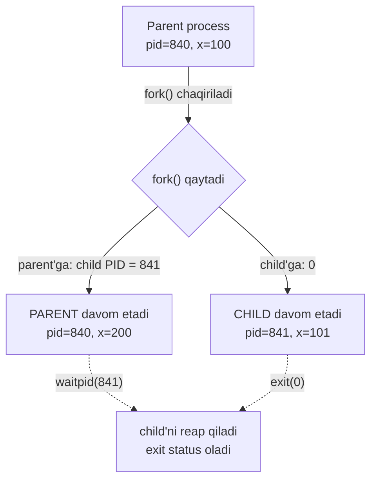
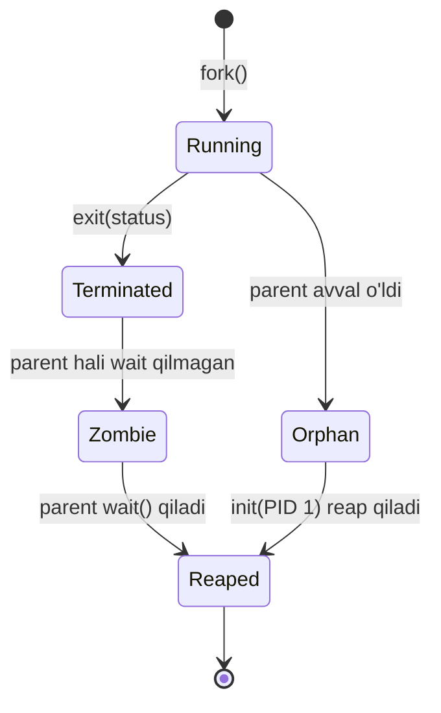
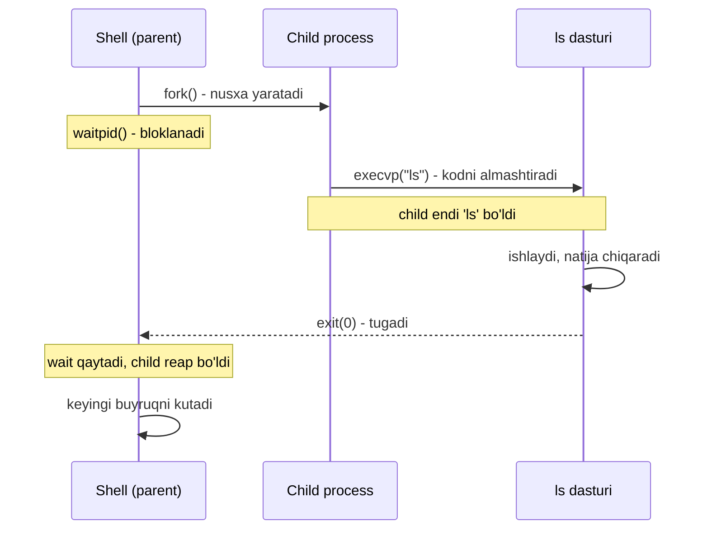

# 22. Process Control — fork, exec, wait va shell modeli

> Manba: CS:APP 2-nashr, 8.4 · Muhit: Ubuntu 24.04 x86-64 (Docker), gcc 13.3.0, go 1.22.2 · [← Oldingi](21-exceptions-processes.md) · [Kurs xaritasi](00-README.md) · [Keyingi →](23-signals.md)

## Nima uchun kerak

Har safar terminalda `ls` yozib Enter bosganingda, shell (bash) sahna ortida uchta syscall bajaradi: **fork** (o'zining nusxasini yaratadi), **exec** (nusxani `ls` dasturiga aylantiradi) va **wait** (u tugashini kutadi). Butun Unix dunyosi — CI pipeline, Docker konteyner, `make`, hatto Go'dagi `exec.Command` — shu uch qadamning ustiga qurilgan. Go backend developer sifatida sen bu mexanizmni bilishing shart: monitoring'da paydo bo'lgan **zombie process** ("defunct") nima ekanini, nega konteynerda PID 1 alohida e'tibor talab qilishini, va nega Go concurrency uchun `fork()` emas, `goroutine` ishlatishini shu darsda tushunasan. 21-darsda syscall va kernel mode mexanizmini ko'rgan eding — endi shu syscall'lar bilan haqiqiy process yaratamiz.

## Nazariya

### 1. PROCESS ID — har process'ning noyob raqami

01-darsda process — bu ishlayotgan dasturning "jonli" nusxasi ekanini ko'rgan eding. Har bir process'ga OS noyob **PID** (process ID) beradi — bu xuddi fuqarolik passport raqami kabi, ikkita process bir vaqtda bir xil PID'ga ega bo'lmaydi.

Ikkita asosiy funksiya:

- `getpid()` — joriy process'ning o'z PID'ini qaytaradi.
- `getppid()` — **parent** (ota) process'ning PID'ini qaytaradi (parent = seni yaratgan process).

Har process (init'dan tashqari) aynan bitta parent'ga ega. Bu daraxtsimon iyerarxiya hosil qiladi: PID 1 (`init`/`systemd`) — ildiz, undan qolgan hamma process o'sib chiqadi.

### 2. FORK — bir marta chaqiriladi, IKKI marta qaytadi

Yangi process yaratishning yagona klassik yo'li — `fork()`. Bu syscall'ning eng g'alati jihati shundaki:

> Oltin qoida: `fork()` BIR marta chaqiriladi, lekin IKKI marta qaytadi — bir marta parent'da, bir marta yangi tug'ilgan child'da.

`fork()` chaqirilgach OS chaqiruvchi process'ning DEYARLI to'liq nusxasini yaratadi: bir xil kod, bir xil o'zgaruvchilar qiymatlari, bir xil ochiq file descriptor'lar. Ikkalasi ham `fork()` dan KEYINGI qatordan davom etadi. Yagona farq — qaytish qiymati:

- **child**'da `fork()` → `0` qaytaradi ("sen yangisan").
- **parent**'da `fork()` → yangi child'ning PID'ini qaytaradi ("mana sening bolang").
- Xato bo'lsa → `-1`.

Aynan shu qaytish qiymati orqali `if (pid == 0)` bilan "men child'manmi yoki parent" degan savolga javob beramiz — bitta kod, ikki yo'nalish.

**Notional machine — xotirada nima bo'ladi.** `fork()` parent'ning butun **address space**'ini (kod, stack, heap, global o'zgaruvchilar) child uchun nusxalaydi. MUHIM: bu ikkita ALOHIDA nusxa. child'da `x` ni o'zgartirsang, parent'dagi `x` tegilmaydi — ular endi turli xotira sahifalarida yashaydi. Amalda OS buni **copy-on-write** (yozilganda nusxalash) bilan tejamkor qiladi: darhol nusxa olmaydi, ikkalasi bir xotirani "o'qish uchun" bo'lishadi, faqat kimdir YOZganda o'sha sahifa nusxalanadi (24-darsda virtual memory bilan chuqur ko'ramiz).



### 3. PROCESS HOLATLARI

Har process uchta asosiy holatdan birida bo'ladi:

| Holat | Ma'nosi |
| --- | --- |
| **Running** | CPU'da ishlayapti yoki ishlashga tayyor (scheduler navbatida) |
| **Stopped** | To'xtatilgan (masalan `SIGSTOP` signali bilan — 23-darsda) |
| **Terminated** | Tugagan — o'z ishini bajarib bo'lgan yoki o'ldirilgan |

Process uchta sabab bilan **terminated** bo'ladi: (1) `main` dan `return`, (2) `exit()` chaqirig'i, (3) o'ldiruvchi signal olishi (23-dars).

### 4. EXIT — process'ni tugatish

`exit(status)` process'ni darhol tugatadi va `status` — 0 dan 255 gacha bo'lgan bir baytli **exit status** — parent'ga qaytadi. Konvensiya: `0` = muvaffaqiyat, noldan farqli = xato. Terminalda `echo $?` bilan oxirgi buyruqning exit status'ini ko'rasan — bu aynan shu qiymat.

MUHIM: exit status faqat past 8 bitni saqlaydi. `exit(300)` aslida `300 & 0xFF = 44` bo'lib qaytadi.

### 5. WAIT / WAITPID — child'ni kutish va "reap" qilish

Parent o'z child'i tugashini kutishi kerak. Buning uchun:

- `wait(&status)` — HAR QANDAY child tugashini kutadi, tugagan child'ning PID'ini qaytaradi.
- `waitpid(pid, &status, opts)` — AYNAN berilgan `pid`li child'ni kutadi (aniqroq nazorat).

"Kutish" ikki ish qiladi: (1) child tugaguncha parent'ni bloklaydi, (2) tugagan child'ni **reap** qiladi — ya'ni uning exit status'ini oladi va process jadvalidagi yozuvini tozalaydi. `status` — bu paketlangan integer; undan exit kodini `WEXITSTATUS(status)` makrosi bilan chiqaramiz.

> Oltin qoida: parent HAR child uchun `wait` qilishi shart — aks holda tugagan child process jadvalida "yig'ilmagan" bo'lib qoladi (zombie).

### 6. ZOMBIE va ORPHAN

Bu ikki tushunchani ko'p aralashtirishadi — farqi aniq:

| Tushuncha | Nima bo'lgan | Kim hal qiladi |
| --- | --- | --- |
| **Zombie** | child TUGAGAN, lekin parent hali `wait` qilmagan | parent `wait` qilishi bilan reap bo'ladi |
| **Orphan** | parent child'dan OLDIN o'lgan | `init` (PID 1) asrab oladi va reap qiladi |

**Zombie** (`ps` da "defunct" ko'rinadi) — o'lik, lekin process jadvalidan tozalanmagan process. U CPU va xotira ishlatmaydi, faqat jadvalda BITTA yozuv (exit status'ni saqlash uchun) egallaydi. Kam sonda zarar yo'q, lekin parent hech qachon `wait` qilmasa, zombie'lar YIG'ILADI va process jadvalini to'ldiradi — bu real bug.

**Orphan** — hali ishlayotgan, lekin parent'i o'lgan child. Uni PID 1 avtomatik "asrab oladi" (adopt) — endi orphan'ning yangi ppid'i 1 bo'ladi. child tugaganda PID 1 uni reap qiladi, shuning uchun orphan zombie bo'lib qolmaydi.



### 7. EXEC oilasi — process kodini ALMASHTIRISH

`fork()` yangi process yaratadi, lekin u parent'ning NUSXASI — bir xil kod. Boshqa dasturni (masalan `ls`) ishga tushirish uchun **exec** kerak.

> Oltin qoida: `exec` YANGI process yaratmaydi — u MAVJUD process'ning kodini butunlay yangi dastur bilan ALMASHTIRADI.

`exec` chaqirilganda joriy process'ning kodi, stack'i, heap'i — hammasi o'chiriladi va o'rniga yangi dastur yuklanadi (20-darsdagi loader shu ishni qiladi). PID, ochiq file descriptor'lar saqlanadi, lekin bajarilayotgan DASTUR butunlay boshqa bo'ladi.

Eng muhim xususiyat:

> `exec` MUVAFFAQIYATLI bo'lsa hech QACHON qaytmaydi — chunki qaytadigan eski kod endi mavjud emas. Faqat exec XATO bo'lsa (masalan dastur topilmadi), keyingi qatorga qaytadi.

`exec` — bu oila (`execve`, `execlp`, `execvp`...). Asosiysi `execve` (system call), qolganlari uning qulay o'ramlari. Nomdagi harflar ma'nosini eslab qolish oson:

| Variant | `l` = list, `v` = vector | `p` = PATH qidiradi | `e` = environ beriladi |
| --- | --- | --- | --- |
| `execl` | argumentlar ro'yxat sifatida | yo'q, to'liq yo'l kerak | yo'q |
| `execlp` | ro'yxat | ha, PATH'dan qidiradi | yo'q |
| `execv` | argumentlar massiv (`argv[]`) | yo'q | yo'q |
| `execvp` | massiv | ha | yo'q |
| `execve` | massiv | yo'q | ha (system call) |

Demo 2'da `execlp("echo", ...)` ishlatildi: `l` — argumentlarni birma-bir sanadik, `p` — `echo`ni PATH'dan topdi (to'liq `/bin/echo` yozish shart emas).

**File descriptor'lar exec'dan omon qoladi.** `exec` kod va xotirani almashtiradi, LEKIN ochiq file descriptor'lar (0=stdin, 1=stdout, 2=stderr va boshqalar) saqlanadi. Aynan shu tufayli shell pipe (`ls | grep x`) ishlaydi: shell fork'dan keyin, exec'dan OLDIN child'ning stdout'ini pipe'ga ulaydi; exec'dan keyin ham o'sha ulanish qoladi, `ls` bexabar pipe'ga yozadi. Bu Go'da `cmd.Stdout = ...` ning past darajali asosidir.

### 8. FORK + EXEC = shell modeli

Endi hammasi birlashadi. Yangi dasturni ishga tushirish uchun:

1. **fork** — yangi process (parent'ning nusxasi).
2. **exec** — child o'zining kodini kerakli dastur bilan almashtiradi.
3. **wait** — parent child tugashini kutadi.

Aynan shu — bash har buyruqni bajarganda qiladigan ishi. Nega avval fork, keyin exec? Chunki shell exec'dan keyin ham YASHASHI kerak (keyingi buyruqni kutish uchun). Agar shell to'g'ridan-to'g'ri exec qilsa, o'zi `ls` ga aylanib, tugagach o'lardi. Shuning uchun avval o'zining nusxasini (child) yaratadi, o'sha nusxa exec qiladi.



## Kod va isbot

### Demo 1 — fork xotirani nusxalaydi (x mustaqil)

```c
#include <stdio.h>
#include <stdlib.h>
#include <unistd.h>
#include <sys/wait.h>

int main(void)
{
    int x = 100;
    printf("fork'dan OLDIN: x=%d, pid=%d\n", x, getpid());
    fflush(stdout);                 /* buffer'ni fork'dan oldin bo'shat */

    pid_t pid = fork();
    if (pid == 0) {
        x += 1;                     /* child o'z NUSXASINI o'zgartiradi */
        printf("  CHILD:  x=%d, pid=%d, ppid=%d\n", x, getpid(), getppid());
        exit(0);
    }
    x += 100;                       /* parent o'z NUSXASINI o'zgartiradi */
    int status;
    waitpid(pid, &status, 0);
    printf("  PARENT: x=%d, pid=%d, child %d chiqdi (kod %d)\n",
           x, getpid(), pid, WEXITSTATUS(status));
    return 0;
}
```

Output:

```
fork'dan OLDIN: x=100, pid=840
  CHILD:  x=101, pid=841, ppid=840
  PARENT: x=200, pid=840, child 841 chiqdi (kod 0)
```

Bu demo `fork()`ning butun sehrini ko'rsatadi. Diqqat qil:

- **Bir chaqiruv, ikki qaytish.** `fork()` bitta joyda chaqirilgan, lekin `if (pid == 0)` bloki HAM (child), undan keyingi qism HAM (parent) bajarilgan. Chunki `fork()` ikki process'da ikki xil qiymat qaytardi: child'ga `0`, parent'ga `841`.
- **x MUSTAQIL.** Boshda ikkalasida `x=100`. child `x += 1` qildi → 101. parent `x += 100` qildi → 200. Ular bir-biriga TEGMADI — chunki child parent'ning xotira NUSXASI, aloqasiz. Bu global emas, hech qanday "shared memory" yo'q.
- **ppid tasdiqlaydi.** child'ning `getppid()` = 840, ya'ni aynan parent'ning PID'i. Iyerarxiya isbotlandi.
- **fflush hayotiy.** `fflush(stdout)` ni olib tashlasang, "fork'dan OLDIN" IKKI marta chiqadi! Sababi: `printf` matnni darhol chiqarmay, stdout buffer'iga yozadi. `fork()` o'sha to'lgan buffer'ni HAM nusxalaydi, keyin ikkala process buffer'ni "flush" qilganda ikki marta bosiladi. Bu klassik "buffering + fork" tuzog'i.

### Demo 2 — exec process obrazini almashtiradi (shell modeli)

```c
#include <stdio.h>
#include <unistd.h>
#include <sys/wait.h>

int main(void)
{
    printf("PARENT (pid=%d): 'echo' ishga tushiraman\n", getpid());
    fflush(stdout);

    pid_t pid = fork();
    if (pid == 0) {
        /* CHILD: o'z kodini echo bilan ALMASHTIRADI */
        execlp("echo", "echo", "  [exec'dan keyin men echo'man!]", (char*)NULL);
        perror("exec muvaffaqiyatsiz");   /* faqat exec xato bo'lsa bajariladi */
        _exit(1);
    }
    wait(NULL);
    printf("PARENT: child tugadi\n");
    return 0;
}
```

Output:

```
PARENT (pid=848): 'echo' ishga tushiraman
  [exec'dan keyin men echo'man!]
PARENT: child tugadi
```

Bu — **shell modelining** to'liq ko'rinishi:

- **fork** yangi child yaratdi (parent'ning nusxasi).
- child `execlp` bilan o'zining butun kodini `echo` dasturi bilan ALMASHTIRDI. Shu paytdan child endi `echo`, undagi eski kod (perror qatori) YO'Q.
- Shuning uchun `perror` bajarilMAYDI. U faqat `execlp` XATO qaytarsa (masalan echo topilmasa) ishga tushardi. exec muvaffaqiyatli bo'ldi — qaytmadi.
- parent `wait(NULL)` bilan child tugashini kutdi, keyin "child tugadi" chiqardi.

Bu aynan bash `echo ...` yozganingda qiladigan ishi. Linux kursidagi HAR buyruq (`ls`, `cat`, `grep`) shu fork+exec+wait tarzda ishga tushadi (Linux kursi 08-dars).

### Demo 3 — bir necha child va exit status yig'ish

```c
#include <stdio.h>
#include <stdlib.h>
#include <unistd.h>
#include <sys/wait.h>

int main(void)
{
    for (int i = 1; i <= 3; i++) {
        if (fork() == 0) { exit(i * 10); }   /* har child boshqa kod bilan chiqadi */
    }
    int status;
    pid_t pid;
    while ((pid = wait(&status)) > 0)
        printf("child %d chiqdi, exit kodi = %d\n", pid, WEXITSTATUS(status));
    return 0;
}
```

Output:

```
child 857 chiqdi, exit kodi = 10
child 858 chiqdi, exit kodi = 20
child 859 chiqdi, exit kodi = 30
```

Bu demo `wait` va exit status'ni chuqurroq ko'rsatadi:

- parent siklda 3 marta `fork()` qildi → 3 ta child. Har biri `exit(i * 10)` bilan turli kod (10, 20, 30) qaytardi.
- Diqqat: child `exit` qilgani uchun siklni DAVOM ettirmaydi. Faqat parent (fork noldan farqli qaytargan) siklni aylanadi va yana fork qiladi. Aks holda child'lar ham fork qilib, process portlashi bo'lardi.
- parent `while ((pid = wait(&status)) > 0)` bilan har iteratsiyada BITTA tugagan child'ni reap qildi. `wait` tugagan child'ning PID'ini va status'ini beradi. child qolmaganda `wait` `-1` qaytaradi (0 dan kichik) va sikl tugaydi.
- `WEXITSTATUS(status)` paketlangan status'dan aynan exit kodini chiqaradi (10, 20, 30).

**Agar `wait` bo'lmasa nima bo'lardi?** Har 3 child TUGAB, lekin reap qilinmay — ZOMBIE bo'lardi. `ps aux | grep defunct` bilan ularni ko'rgan bo'larding. Va agar parent child'lardan OLDIN o'lsa — ular ORPHAN bo'lib, `init` (PID 1) asrab olib reap qilardi.

## Go dasturchiga ko'prik

### Demo 4 — Go: os/exec ostida fork+exec+wait

```go
package main

import (
	"fmt"
	"os"
	"os/exec"
)

func main() {
	fmt.Printf("PARENT goroutine (pid=%d)\n", os.Getpid())

	out, err := exec.Command("echo", "  [child echo natijasi]").Output()
	if err != nil {
		fmt.Println("xato:", err)
		return
	}
	fmt.Printf("child chiqishi: %s", out)
	fmt.Println("Go'da xom fork() yo'q: goroutine'lar bir process ichida ishlaydi")
}
```

Output:

```
PARENT goroutine (pid=1016)
child chiqishi:   [child echo natijasi]
Go'da xom fork() yo'q: goroutine'lar bir process ichida ishlaydi
```

Bu demo Demo 2 (C shell modeli) ning aynan Go ekvivalenti. `exec.Command("echo", ...).Output()` ostida C'dagi bilan bir xil uchlik ishlaydi: **fork** (aslida `clone`) + **exec** (echo dasturini yuklaydi) + **wait** (tugashini kutib, stdout'ni yig'adi). Go bu murakkablikni yashiradi, lekin syscall darajasida hech narsa o'zgarmadi.

### Nega Go'da xom fork() YO'Q

Bu darsning eng muhim Go tushunchasi. Go'da `syscall.ForkExec` bor, lekin xom, yolg'iz `fork()` DEYARLI yo'q va hech kim ishlatmaydi. Sababi chuqur:

> `fork()` faqat CHAQIRUVCHI thread'ni nusxalaydi, boshqa hamma thread'ni "muzlatib" tashlaydi. Multi-threaded programda bu halokatli.

Go runtime har doim KO'P thread ishlatadi: goroutine scheduler, garbage collector, network poller — bularning hammasi alohida OS thread'larda ishlaydi. Endi tasavvur qil: bir thread heap'dan xotira ajratayotgan (mutex ushlab turgan) paytda boshqa thread `fork()` qildi. Yangi child'da faqat chaqiruvchi thread bor, xotira mutex'i esa MANGU qulflangan (uni ochadigan thread nusxalanmadi). child heap'ga birinchi murojaatda **deadlock** — muzlab qoladi.

Shuning uchun Go ikki yo'lni tanladi:

1. **Concurrency (parallel ish)** kerak bo'lsa → `fork` EMAS, `goroutine`. Bir process ichida, ko'p oqim, umumiy xotira (32-darsda goroutine scheduler'ni chuqur ko'ramiz).
2. **Yangi PROCESS** (boshqa dastur) kerak bo'lsa → `os/exec`. U fork'ni exec bilan DARHOL ketma-ket qiladi — oradagi xavfli holatga vaqt qolmaydi, chunki exec butun xotirani (heap, stack, mutex'lar) yangi dastur bilan almashtiradi.

Uch yondashuvni yonma-yon ko'r:

| Xususiyat | `fork()` (C) | `goroutine` (Go) | `os/exec` (Go) |
| --- | --- | --- | --- |
| Nima yaratadi | yangi PROCESS | bir process ichida oqim | yangi PROCESS (boshqa dastur) |
| Xotira | alohida address space | umumiy (shared) | butunlay alohida (exec) |
| Narxi | o'rtacha (copy-on-write) | juda arzon (~KB) | fork+exec narxi |
| Aloqa | pipe / signal / fayl | channel / umumiy xotira | pipe (Stdin/Stdout) |
| Qachon | Unix past daraja | parallel ish, concurrency | tashqi dastur ishga tushirish |

Xulosa: Go'da "parallel bajarish" savoliga javob deyarli har doim `goroutine`, "boshqa dasturni ishga tushirish" savoliga javob `os/exec`. Xom `fork` ikkalasiga ham to'g'ri kelmaydi.

### Amaliy os/exec imkoniyatlari

- **Timeout / cancel:** `exec.CommandContext(ctx, ...)` — context bekor bo'lsa (yoki deadline o'tsa) subprocess avtomatik `Kill` qilinadi. Backend'da tashqi buyruqni cheksiz kutib qolmaslik uchun shart.
- **Pipe'lar:** `cmd.Stdout`, `cmd.Stdin`, `cmd.StdinPipe()` — child'ning oqimlarini ulash. `.Output()` — stdout'ni yig'adi; `.Run()` — kutadi; `.Start()` + `.Wait()` — qo'lda boshqarish (C'dagi fork keyin wait kabi).
- **os.Exit va defer tuzog'i:** `os.Exit()` process'ni DARHOL o'ldiradi — `defer` funksiyalar ishga TUSHMAYDI. C'dagi `exit` kabi. Shuning uchun tozalash kerak bo'lsa `os.Exit` dan oldin qo'lda bajar.
- **syscall.ForkExec:** eng past daraja — juda kam, maxsus holatlarda (masalan PID namespace yaratish, konteyner runtime). Odatdagi kodda ishlatilmaydi.

## Real-world scenariylar

**1. CI/CD va shell — dastur ishga tushirish.** Har `make`, har GitHub Actions qadami, har `bash script.sh` ichidagi buyruq — fork+exec+wait. Go'da build vositasi yozayotganingda `exec.Command("go", "test", "./...").Run()` aynan shu naqshni takrorlaydi: child yaratiladi, `go test` ga aylanadi, sen exit kodiga qarab muvaffaqiyat/xatoni bilasan.

**2. Zombie yig'ilishi — konteynerda PID 1 muammosi.** Docker konteynerda sening dastur ko'pincha PID 1 bo'lib ishlaydi. Ammo PID 1 alohida mas'uliyatga ega: orphan bo'lgan barcha child'larni reap qilishi kerak. Agar dasturing subprocess'lar yaratsa-yu, ular yetim qolsa va PID 1 ularni reap qilmasa — **zombie'lar yig'iladi**, oxir-oqibat process jadvali to'ladi. Yechim: `docker run --init` (tini init'ni qo'shadi) yoki image'ga `tini`/`dumb-init` kiritish — ular PID 1 sifatida zombie'larni reap qiladi.

**3. Subprocess timeout va cancel.** Backend tashqi buyruqni (masalan `ffmpeg`, `imagemagick`) ishga tushirganda, u osilib qolsa butun so'rovni bloklaydi. `exec.CommandContext(ctx, ...)` bilan `ctx` ga deadline qo'yasan — vaqt o'tsa Go child'ni avtomatik o'ldiradi. Bu C'da qo'lda `waitpid` + timer + `kill` yozishni talab qilardi; Go uni context bilan soddalashtiradi.

## Zamonaviy yondashuv

Web sintezi va amaliyot:

- **Copy-on-write fork tejamkor.** Zamonaviy `fork()` xotirani DARHOL nusxalamaydi. Parent va child bir xotira sahifalarini "faqat o'qish" rejimida bo'lishadi; qaysidir biri YOZganda o'sha sahifa nusxalanadi. Shuning uchun gigabaytli process ham `fork` qilinganda deyarli bir zumda va arzon (24-darsda mexanizmni ko'ramiz).
- **posix_spawn** — fork+exec'ni bitta atomik chaqiruvga birlashtirgan zamonaviy API. Multi-threaded programda xavfsizroq, chunki oradagi "yarim nusxalangan" holat yo'q. Ba'zi runtime'lar (Python subprocess) buni tanlaydi.
- **vfork eskirgan** — fork'ning tejamkor, lekin xavfli varianti (parent'ni bloklab, xotirani bo'lishadi). Copy-on-write kelgach deyarli keraksiz bo'lib qoldi, ishlatmaslik tavsiya etiladi.
- **clone() (Linux)** — fork'dan kuchliroq: nimani bo'lishish/nusxalashni bayroq bilan tanlaysan. Thread ham (`pthread`), namespace ham (konteyner izolyatsiyasi) shu bitta syscall ustiga qurilgan. Go runtime ham thread yaratishda `clone` ishlatadi.
- **Docker PID 1 va zombie reaping** — konteyner dunyosining klassik tuzog'i. `--init` yoki tini ishlatish deyarli har production konteynerda tavsiya etiladi.

## Keng tarqalgan xatolar

**1. fork'dan oldin fflush qilmaslik.** `printf` buffer'ga yozadi; `fork` buffer'ni ham nusxalaydi; natijada bir xabar IKKI marta chiqadi. Yechim: fork'dan oldin `fflush(stdout)` yoki bufferlanmagan yozuv.

**2. wait qilmaslik → zombie.** Parent child yaratib, uni hech qachon `wait` qilmasa, tugagan child'lar zombie bo'lib process jadvalini to'ldiradi. HAR child uchun `wait`/`waitpid` (yoki `SIGCHLD` handler — 23-dars) shart.

**3. exec qaytadi deb o'ylash.** "execlp'dan keyin log yozaman" — bu KOD ISHLAMAYDI, chunki muvaffaqiyatli exec qaytmaydi. exec'dan keyingi qator FAQAT exec xato bo'lsa bajariladi; u yerga xato ishlovi (`perror` + `_exit`) qo'yiladi.

**4. Go'da xom syscall.Fork ishlatishga urinish.** Multi-threaded Go runtime'da yolg'iz fork child'ni buzuq holatda qoldiradi (deadlock/corruption). Concurrency kerak bo'lsa `goroutine`, yangi process kerak bo'lsa `os/exec` — hech qachon xom fork emas.

**5. Konteynerda PID 1 e'tiborsizligi.** Dasturing PID 1 bo'lsa, orphan child'larni reap qilmasa zombie yig'iladi va signal handling ham buziladi (PID 1 default signal harakatiga ega emas). `--init`/tini bilan hal qil.

## Amaliy mashqlar

**1. (Oson)** Demo 1'da child `x += 1` o'rniga `x += 50` qilsa, va parent `x += 100` qolsa — output'da child'da va parent'da x qancha bo'ladi?

<details>
<summary>Yechim</summary>

child'da `x = 150`, parent'da `x = 200`. Ular MUSTAQIL nusxalar — child'dagi o'zgarish parent'ga tegmaydi, parent'niki child'ga tegmaydi. Boshlang'ich 100 dan har biri o'z yo'lidan ketadi.
</details>

**2. (Oson)** `fork()` bir process'da chaqirilsa, u NECHA marta qaytadi va har qaytishda qanday qiymat beradi?

<details>
<summary>Yechim</summary>

IKKI marta qaytadi. child'da `0`, parent'da yangi child'ning PID'i (musbat son). Xato bo'lsa parent'da `-1` (child umuman yaralmaydi).
</details>

**3. (Oson)** Demo 2'da `execlp` MUVAFFAQIYATLI ishlasa, undan keyingi `perror("exec muvaffaqiyatsiz")` qatori nega hech qachon chiqmaydi?

<details>
<summary>Yechim</summary>

Chunki muvaffaqiyatli `exec` QAYTMAYDI — u child'ning butun kodini `echo` bilan almashtiradi, `perror` qatori bo'lgan eski kod endi xotirada yo'q. Bu qator FAQAT exec xato qaytarganda (dastur topilmasa) bajariladi.
</details>

**4. (O'rta)** Quyidagi skeleton'ni to'ldir: 2 ta child yaratib, biri `exit(5)`, ikkinchisi `exit(7)` qilsin, parent ikkalasining exit kodini chiqarsin.

```c
#include <stdio.h>
#include <stdlib.h>
#include <unistd.h>
#include <sys/wait.h>

int main(void)
{
    int codes[2] = {5, 7};
    for (int i = 0; i < 2; i++) {
        if (fork() == 0) {
            // TODO: child i-kod bilan chiqsin
        }
    }
    int status;
    pid_t pid;
    // TODO: har child'ni reap qilib, exit kodini chiqar
    return 0;
}
```

<details>
<summary>Yechim</summary>

```c
    for (int i = 0; i < 2; i++) {
        if (fork() == 0) {
            exit(codes[i]);          /* child o'z kodi bilan chiqadi */
        }
    }
    int status;
    pid_t pid;
    while ((pid = wait(&status)) > 0)
        printf("child %d exit kodi = %d\n", pid, WEXITSTATUS(status));
```

Muhim: `exit` child'ni tugatadi, shuning uchun child siklni davom ettirmaydi — faqat parent yana fork qiladi.
</details>

**5. (O'rta)** Parent 3 ta child yaratdi, lekin bironta `wait` chaqirmadi va uzoq `sleep(1000)` ga ketdi. `ps` da bu child'lar qanday ko'rinadi va nega?

<details>
<summary>Yechim</summary>

Ular **zombie** (`<defunct>`) bo'lib ko'rinadi. child'lar tugagan, lekin parent hali ishlab turibdi va ularni `wait` bilan reap qilmagan — shuning uchun exit status'ni saqlash uchun process jadvalida yozuv qoladi. CPU/xotira ishlatmaydi, faqat jadval yozuvi. parent nihoyat wait qilsa (yoki o'lsa, PID 1 reap qilsa) tozalanadi.
</details>

**6. (Qiyin)** Nega Go concurrency uchun `fork()` emas, `goroutine` ishlatadi? Uch jumlada tushuntir.

<details>
<summary>Yechim</summary>

`fork()` faqat chaqiruvchi thread'ni nusxalaydi, qolgan thread'lar (Go'ning scheduler, GC, netpoller) child'da yo'qoladi. Agar o'sha thread'lar mutex ushlab turgan bo'lsa, child o'sha resursga murojaatda mangu deadlock bo'ladi. Shuning uchun Go bir process ichida ko'p oqim beradigan `goroutine`ni tanlaydi; yangi PROCESS kerak bo'lsa `os/exec` (fork+exec darhol) ishlatadi.
</details>

**7. (Qiyin)** Noldan yoz: Go'da `exec.CommandContext` ishlatib, `sleep 5` buyrug'ini ishga tushir, lekin context'ga 1 soniyalik deadline qo'y. Nima kutasan?

<details>
<summary>Yechim</summary>

```go
ctx, cancel := context.WithTimeout(context.Background(), 1*time.Second)
defer cancel()
cmd := exec.CommandContext(ctx, "sleep", "5")
err := cmd.Run()
fmt.Println("natija:", err)   // "signal: killed" - context deadline o'tdi
```

1 soniyadan keyin context deadline o'tadi, Go child (`sleep`) ni avtomatik `Kill` qiladi. `cmd.Run()` xato qaytaradi (`signal: killed`). Bu C'dagi qo'lda timer+kill+waitpid ni bitta context bilan almashtiradi.
</details>

## Cheat sheet

| Buyruq / Tushuncha | Nima | Eslab qolish |
| --- | --- | --- |
| `getpid()` / `getppid()` | o'z PID / parent PID | passport raqami va otasi |
| `fork()` | yangi child yaratadi | 1 chaqiruv, 2 qaytish: child'ga 0, parent'ga child PID |
| copy-on-write | xotira faqat yozilganda nusxalanadi | fork arzon: darhol nusxa yo'q |
| process holatlari | running / stopped / terminated | ishlayapti / to'xtatilgan / tugagan |
| `exit(status)` | process'ni tugatadi | status 0-255, 0 = muvaffaqiyat |
| `wait` / `waitpid` | child'ni kutadi va reap qiladi | bloklaydi + jadvaldan tozalaydi |
| `WEXITSTATUS(s)` | status'dan exit kodini chiqaradi | paketlangan int'dan kod |
| zombie | tugagan, reap qilinmagan | "defunct"; parent wait qilmadi |
| orphan | parent avval o'lgan | init (PID 1) asrab oladi |
| `exec` oilasi | kodni yangi dastur bilan almashtiradi | muvaffaqiyatli bo'lsa QAYTMAYDI |
| fork+exec | yangi dastur ishga tushirish | shell modeli: fork -> exec -> wait |
| `os/exec` (Go) | ostida fork+exec+wait | `exec.Command(...).Output()` |
| Go'da fork yo'q | multi-threaded'da xavfli | concurrency = goroutine, process = os/exec |

## Qo'shimcha manbalar

- [Fork–exec — Wikipedia](https://en.wikipedia.org/wiki/Fork%E2%80%93exec) — fork+exec naqshining umumiy sharhi.
- [Thorsten Ball — Why threads can't fork](https://thorstenball.com/blog/2014/10/13/why-threads-cant-fork/) — multi-threaded fork xavfi, Go dizayni.
- [Zombie and Orphan Processes in C — GeeksforGeeks](https://www.geeksforgeeks.org/c/zombie-and-orphan-processes-in-c/) — zombie/orphan amaliy misollari.
