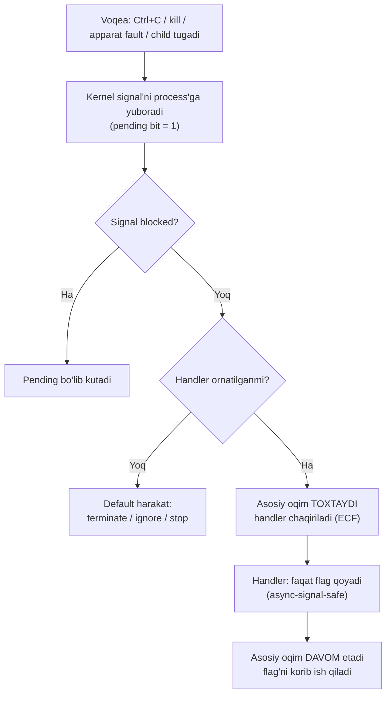
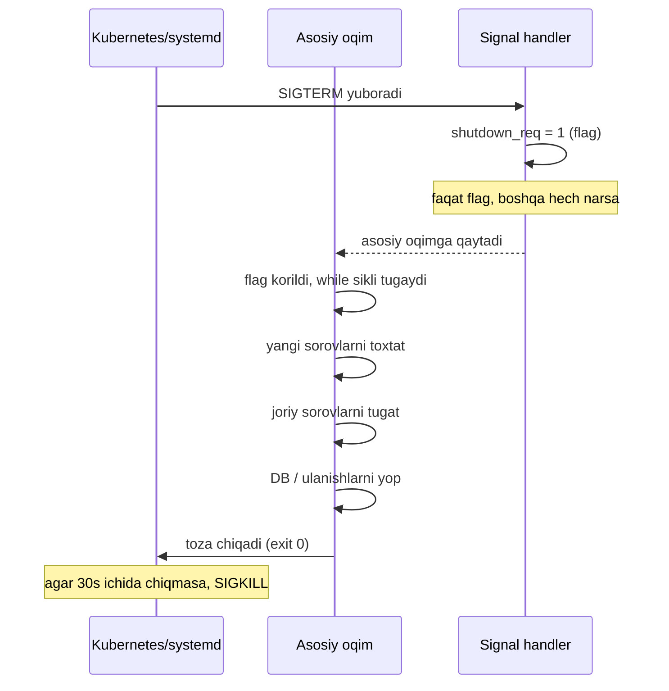
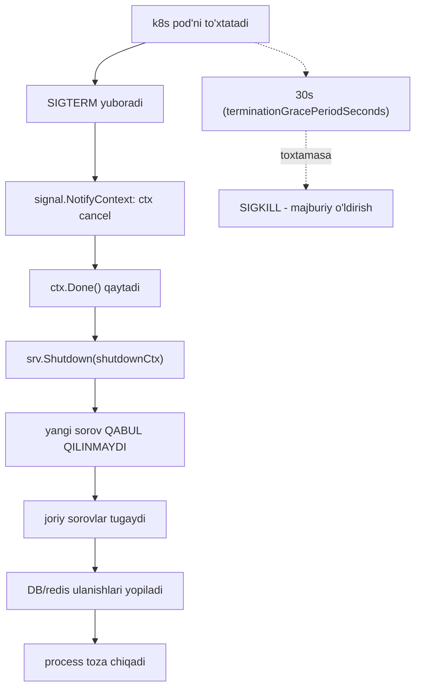

# 23. Signals — graceful shutdown va async-signal-safe

> Manba: CS:APP 2-nashr, 8.5-8.7 · Muhit: Ubuntu 24.04 x86-64 (Docker), gcc 13.3.0, go 1.22.2 · [← Oldingi](22-process-control.md) · [Kurs xaritasi](00-README.md) · [Keyingi →](24-virtual-memory.md)

## Nima uchun kerak

Har bir production Go serverda `signal.Notify` yoki `signal.NotifyContext` bilan yozilgan graceful shutdown kodi bor. Sen uni ko'chirib qo'yasan, lekin ichida ASLIDA nima sodir bo'lishini bilmasang, xato paydo bo'lganda tuzata olmaysan. Bu dars o'sha "sehr"ning ichini ochadi.

Kubernetes pod'ni to'xtatganda unga `SIGTERM` yuboradi va 30 soniya kutadi — nega aynan shunday? Nega `Ctrl+C` dasturingni to'xtatadi, `kill -9` esa uni majburan o'ldiradi? Nega NULL pointer'ga yozganingda "Segmentation fault" chiqadi? Bularning hammasi bitta mexanizm — **signal** — orqali ishlaydi. Bu 8-bob (ECF — exceptional control flow) yakuni: signal — bu process darajasidagi software exception (21-darsda apparat exception'larni ko'rgan eding, endi ularning process'ga yetkazilishini ko'ramiz).

## Nazariya

### 1. Signal nima

**Signal** — bu kernel (yoki boshqa process) tomonidan process'ga yuboriladigan qisqa xabar: "sen bilan biror muhim voqea sodir bo'ldi". Bu **software exception**ning yuqori darajadagi ko'rinishi (21-dars). Signal kelganda process joriy ishini TO'XTATADI, signal'ga javob beradi (default harakat yoki **handler** funksiya), keyin (agar tirik qolsa) davom etadi.

Signal — bu integer raqam (masalan `SIGTERM` = 15). Har bir raqamning nomi va standart ma'nosi bor. Process signal kelishini "so'ramaydi" — u istalgan paytda, kod bajarilishining ISTALGAN nuqtasida keladi. Aynan shu asinxronlik keyingi barcha murakkablikning sababi.

### 2. Signal turlari

Eng ko'p uchraydigan signallar:

| Signal | Raqam | Sabab | Default harakat |
| --- | --- | --- | --- |
| `SIGINT` | 2 | `Ctrl+C` bosilgan | Terminate |
| `SIGKILL` | 9 | Majburiy o'ldirish | Terminate — **USHLANMAYDI** |
| `SIGSEGV` | 11 | Segmentation fault (noto'g'ri xotira) | Terminate + core dump |
| `SIGPIPE` | 13 | Yopilgan pipe/socket'ga yozish | Terminate |
| `SIGTERM` | 15 | Muloyim to'xtatish so'rovi | Terminate |
| `SIGCHLD` | 17 | Child process tugadi/to'xtadi | Ignore |
| `SIGSTOP` | 19 | Process'ni to'xtatib qo'yish | Stop — **USHLANMAYDI** |
| `SIGCONT` | 18 | To'xtatilgan process'ni davom ettirish | Continue |

Ikkita signal — `SIGKILL` va `SIGSTOP` — HECH QACHON ushlanmaydi, bloklanmaydi yoki e'tiborsiz qoldirilmaydi. Bu kernel kafolati: system administrator har doim istalgan process'ni to'xtatib yoki o'ldira olishi kerak. Shuning uchun `kill -9` (SIGKILL) "so'nggi chora" hisoblanadi.

### 3. Signal yuborish

Signal yuborishning bir necha yo'li bor:

- **Kernel avtomatik** — apparat fault (NULL dereference → `SIGSEGV`), yoki voqea (child tugadi → `SIGCHLD`).
- **`kill(pid, sig)`** — C funksiyasi, boshqa process'ga signal yuboradi.
- **`raise(sig)`** — process o'ziga signal yuboradi (`kill(getpid(), sig)` bilan bir xil).
- **Shell `kill` buyrug'i** — `kill -TERM 1234`, `kill -9 1234` (Linux kursi [08-processes](../5.%20Linux/1.%20Linux%20commands/08-processes.md)).
- **Klaviatura** — `Ctrl+C` → `SIGINT`, `Ctrl+\` → `SIGQUIT`, `Ctrl+Z` → `SIGTSTP`.

### 4. Signal ushlash (handler)

Default harakatni o'zgartirish uchun **handler** — signal kelganda chaqiriladigan funksiya — o'rnatiladi:

- **`signal(sig, handler)`** — sodda, lekin platformalar orasida xatti-harakati farq qiladi (portativ emas).
- **`sigaction(sig, ...)`** — professional tanlov: aniq semantika, `SA_RESTART` bilan EINTR muammosini hal qiladi. Production kodda har doim `sigaction`.

Default harakatlar to'rt xil bo'ladi:

| Harakat | Ma'nosi |
| --- | --- |
| **Terminate** | Process o'ladi |
| **Terminate + core** | Process o'ladi va xotira dump'i yoziladi (debug uchun) |
| **Ignore** | Signal e'tiborsiz qoldiriladi |
| **Stop / Continue** | Process to'xtatiladi / davom ettiriladi |

### 5. Async-signal-safe — eng muhim qoida

Handler asosiy oqimni ISTALGAN nuqtada uzadi. Tasavvur qil: asosiy kod `printf` ishlatib, ichki buffer'ni yarim yozib turgan payt signal keladi va handler ham `printf` chaqiradi — buffer buziladi yoki **deadlock** (`printf` ichidagi lock ikki marta olinmoqchi). Bu **reentrancy** (qayta kirish) muammosi.

> **Oltin qoida:** Handler ichida faqat **async-signal-safe** funksiyalarni chaqir. `printf`, `malloc`, `free` — XAVFLI. `write`, `_exit`, `waitpid` — xavfsiz. Eng yaxshi amaliyot: handler faqat bitta `volatile sig_atomic_t` flag'ni o'zgartirsin, asosiy kod o'sha flag'ni tekshirib ish qilsin.

`sig_atomic_t` — bu tur bo'lib, unga yozish/o'qish bitta bo'linmas (atomic) amal, ya'ni signal o'rtada uza olmaydi. `volatile` — kompilyatorga "bu o'zgaruvchi tashqaridan o'zgarishi mumkin, keshlamang" deb aytadi.

### 6. Signal coalesce — navbatga turmaydi

Signallar **navbatga turmaydi** (queue emas). Har bir signal turi uchun faqat bitta "kutayotgan" (**pending**) bit bor. Agar handler ishlayotganda o'sha turdagi yana 3 ta signal kelsa — ular BITTAGA birlashadi (**coalesce**). Ya'ni "3 ta SIGCHLD keldi" ≠ "handler 3 marta chaqiriladi". Bu SIGCHLD bilan zombie yig'ishning klassik tuzog'i (pastda ko'ramiz).

### 7. Pending, blocked va EINTR

Kernel har process uchun ikkita bit maskasini yuritadi:
- **Pending** — yuborilgan lekin hali yetkazilmagan signallar.
- **Blocked** — vaqtincha bloklangan (kechiktirilgan) signallar. Bloklangan signal pending bo'lib turadi, blok olib tashlanganda yetkaziladi.

Signal bloklovchi syscall'ni (masalan `read`, `pause`, `waitpid`) UZADI — syscall `-1` qaytaradi va `errno = EINTR` bo'ladi. Bu xato emas! To'g'ri kod EINTR'da syscall'ni QAYTA urinadi (yoki `sigaction` da `SA_RESTART` flag'i buni avtomatik qiladi).

### 8. Exit kodi qoidasi

Signal bilan o'lgan process exit kodi = **128 + signal_raqami**. Masalan SIGSEGV (11) → exit 139, SIGKILL (9) → exit 137, SIGTERM (15) → exit 143. Shell'da `$?` orqali ko'riladi.

### Signal yetkazish oqimi



### Graceful shutdown pattern



## Kod va isbot

### Demo 1 — Signal ushlash: SIGTERM handler

```c
#include <stdio.h>
#include <stdlib.h>
#include <signal.h>
#include <unistd.h>

volatile sig_atomic_t got_signal = 0;

void handler(int sig)
{
    got_signal = sig;              /* faqat async-signal-safe amal */
}

int main(void)
{
    signal(SIGTERM, handler);
    signal(SIGINT, handler);

    printf("PID=%d, o'zimga SIGTERM yuboraman\n", getpid());
    raise(SIGTERM);                /* o'zimga signal */

    if (got_signal)
        printf("signal ushlandi: %d (SIGTERM=%d)\n", got_signal, SIGTERM);
    return 0;
}
```

Output:
```
PID=1035, o'zimga SIGTERM yuboraman
signal ushlandi: 15 (SIGTERM=15)
```

**Notional machine.** `signal(SIGTERM, handler)` kernelga "SIGTERM kelganda `handler` funksiyasini chaqir" deb aytadi. `raise(SIGTERM)` o'ziga signal yuboradi — kernel asosiy oqimni TO'XTATADI, `handler`ni bajaradi (bu ECF — 21-dars: control flow oddiy oqimdan chetga chiqadi), keyin asosiy oqim `raise`dan keyingi qatordan davom etadi. Handler ichida faqat `got_signal = sig` bor — bu xavfsiz, chunki `sig_atomic_t` ga yozish atomic. Agar handler ichida `printf` bo'lganida — xavfli edi.

### Demo 2 — Graceful shutdown pattern (markaziy!)

```c
#include <stdio.h>
#include <signal.h>
#include <unistd.h>

volatile sig_atomic_t shutdown_req = 0;

void on_sigint(int sig) { (void)sig; shutdown_req = 1; }

int main(void)
{
    signal(SIGINT, on_sigint);
    printf("Ishlayapman... (SIGINT kutilmoqda)\n");

    raise(SIGINT);                            /* simulyatsiya */

    while (!shutdown_req) pause();
    printf("Graceful shutdown: resurslar tozalandi, chiqyapman\n");
    return 0;
}
```

Output:
```
Ishlayapman... (SIGINT kutilmoqda)
Graceful shutdown: resurslar tozalandi, chiqyapman
```

**Bu — eng muhim amaliy pattern.** Handler faqat `shutdown_req = 1` qo'yadi va darhol qaytadi. Asosiy sikl flag'ni ko'radi, `while`dan chiqadi va resurslarni TOZA yopadi. Natija: `Ctrl+C` (SIGINT) yoki kubernetes SIGTERM kelganda dastur DARHOL o'lmaydi — ishini tugatib, keyin chiqadi. `pause()` — signal kelguncha kutadi (protsessorni behuda ishlatmaydi). Signal kelganda `pause()` EINTR bilan uziladi, `while` sharti qayta tekshiriladi.

### Demo 3 — SIGSEGV: himoyalanmagan xotira signalga aylanadi

```c
#include <stdio.h>
int main(void)
{
    int *p = NULL;
    printf("NULL pointer'ga yozaman...\n");
    *p = 42;                       /* SIGSEGV - segmentation fault */
    printf("bu qator bajarilmaydi\n");
    return 0;
}
```

Ishga tushirish:
```
$ ./segv; echo "exit kodi: $?"
NULL pointer'ga yozaman...
Segmentation fault
exit kodi: 139
```

**Notional machine.** `*p = 42` da CPU NULL (0-manzil) ga yozmoqchi bo'ladi — bu himoyalangan sahifa, apparat **fault** ko'taradi (21-dars). Kernel bu fault'ni process'ga `SIGSEGV` (11) sifatida yetkazadi. Handler yo'q, shuning uchun default harakat — terminate. Exit kodi = 128 + 11 = **139**. "bu qator bajarilmaydi" — chunki process undan oldin o'ldi. Go'da bunga `runtime error: invalid memory address or nil pointer dereference` panic mos keladi (Go runtime SIGSEGV'ni ushlab, chiroyli panic ko'rsatadi).

### Demo 4 — SIGCHLD: zombie'larni avtomatik reap qilish (coalesce muammosi!)

```c
#include <stdio.h>
#include <stdlib.h>
#include <signal.h>
#include <unistd.h>
#include <sys/wait.h>

volatile sig_atomic_t reaped = 0;

void sigchld_handler(int sig)
{
    (void)sig;
    /* Signal COALESCE bo'lishi mumkin (3 signal -> 1 yetkazish), shuning uchun
       while sikli MUHIM: bitta handler chaqiruvida hammasini yig'adi. */
    while (waitpid(-1, NULL, WNOHANG) > 0) reaped++;
}

int main(void)
{
    signal(SIGCHLD, sigchld_handler);

    for (int i = 0; i < 3; i++)
        if (fork() == 0) { exit(0); }

    while (reaped < 3) pause();    /* pause signal bilan uziladi - EINTR */
    printf("SIGCHLD handler %d ta zombie'ni reap qildi\n", reaped);
    return 0;
}
```

Output:
```
SIGCHLD handler 3 ta zombie'ni reap qildi
```

**Bu — coalesce muammosining klassik yechimi.** Child tugaganda kernel parent'ga `SIGCHLD` yuboradi (22-darsdagi zombie muammosining signal bilan avtomatik yechimi). LEKIN signallar navbatga turmaydi: agar 3 child deyarli bir vaqtda tugasa, 3 ta SIGCHLD BITTAGA birlashishi mumkin. Agar handler faqat bitta `waitpid` qilsa — 2 ta zombie qoladi! Yechim: `while (waitpid(-1, NULL, WNOHANG) > 0)` — bitta handler chaqiruvida BARCHA tayyor child'larni yig'adi. `WNOHANG` — tayyor child yo'q bo'lsa bloklamaydi, darhol qaytadi. `waitpid` async-signal-safe, shuning uchun handler ichida ishlatish xavfsiz.

## Go dasturchiga ko'prik

### Demo 5 — Go: signal.Notify graceful shutdown

```go
package main

import (
	"context"
	"fmt"
	"os/signal"
	"syscall"
	"time"
)

func main() {
	ctx, stop := signal.NotifyContext(context.Background(),
		syscall.SIGINT, syscall.SIGTERM)
	defer stop()

	fmt.Println("server ishga tushdi (SIGTERM/SIGINT kutilmoqda)")

	go func() {
		time.Sleep(100 * time.Millisecond)
		syscall.Kill(syscall.Getpid(), syscall.SIGTERM)   // real serverda k8s/systemd yuboradi
	}()

	<-ctx.Done()                              // signal kutish
	fmt.Println("signal keldi: graceful shutdown boshlandi")
	time.Sleep(50 * time.Millisecond)         // ulanishlarni yopish simulyatsiyasi
	fmt.Println("hamma ulanish yopildi, chiqyapman")
}
```

Output:
```
server ishga tushdi (SIGTERM/SIGINT kutilmoqda)
signal keldi: graceful shutdown boshlandi
hamma ulanish yopildi, chiqyapman
```

**Go C'dagi murakkablikni YASHIRADI.** C'da handler → flag → async-signal-safe qoidalari bilan kurashishing kerak edi. Go'da esa runtime signalni maxsus ichki goroutine'da qabul qiladi va uni oddiy **channel** yoki **context** orqali kodingga yetkazadi. Natijada handler ichida "oddiy Go kod" yozasan — async-signal-safe muammosi YO'Q, chunki bu kod signal handler kontekstida emas, oddiy goroutine'da ishlaydi.

`signal.NotifyContext` signal kelganda `ctx`ni CANCEL qiladi. `<-ctx.Done()` shu cancel'ni kutadi — bu C'dagi `while (!shutdown_req) pause()` ning aynan Go analogi.

### Real HTTP server pattern

Production Go serverida graceful shutdown zanjiri quyidagicha:



Amalda `http.Server.Shutdown(ctx)` chaqiriladi: u yangi so'rovlarni to'xtatadi, joriy so'rovlar tugashini kutadi, keyin qaytadi. Muhim nuqtalar:

- **Kubernetes lifecycle:** pod o'chganda `SIGTERM` → `terminationGracePeriodSeconds` (default 30s) kutadi → hali tirik bo'lsa `SIGKILL`. Shutdown'ing shu vaqtdan qisqa bo'lishi shart (odatda ~20% zaxira qoldiring).
- **`context` butun zanjirni tarqatadi:** bitta cancel signali handler → server → repository → external client'gacha yetadi, hamma ish to'xtaydi.
- **`signal.Stop(ch)` / `stop()`:** signal kuzatuvni bekor qiladi, default harakatni tiklaydi.
- **SIGPIPE Go'da:** `net` paketi ichki ravishda ishlov beradi — yopilgan socket'ga yozganda Go dasturing crash bo'lmaydi, oddiy `write: broken pipe` xatosi qaytadi. C'da esa SIGPIPE default'da process'ni o'ldiradi.
- **SIGKILL Go'da ham ushlanmaydi:** `signal.Notify(ch, syscall.SIGKILL)` ishlamaydi — kernel kafolati (grace period tugagach k8s aynan shuni yuboradi).

## Real-world scenariylar

**1. Kubernetes rolling update.** Yangi versiya deploy qilganingda k8s eski pod'larni birma-bir o'chiradi. Har biriga `SIGTERM` yuboradi. Server graceful shutdown qiladi: yangi so'rov qabul qilmaydi (endpoint'dan olib tashlanadi), joriy so'rovlarni tugatadi, DB ulanishlarini yopadi — hammasi 30s ichida. Agar bu vaqtda tugamasa, `SIGKILL` keladi va foydalanuvchi "connection reset" ko'radi. Shuning uchun `srv.Shutdown` timeout'i grace period'dan kichik bo'lishi shart.

**2. Zombie process to'planishi.** Konteynerda dasturing PID 1 bo'lsa va child'lar spawn qilsang, ularni reap qilish shart — aks holda zombie'lar yig'iladi (22-dars). Yechim: SIGCHLD handler bilan `while waitpid`, yoki `tini`/`dumb-init` kabi proper init process ishlatish (docker `--init` flagi). Init process signal'larni child'ga uzatadi va zombie'larni reap qiladi.

**3. SIGPIPE — uzilgan client.** Client HTTP so'rov yuboradi, javob kelishini kutmasdan ulanishni uzadi. Server hali javob yozmoqchi bo'ladi → yopilgan socket'ga yozish → C'da `SIGPIPE` → default harakat process'ni o'ldiradi! Yechim: `SIGPIPE`'ni ignore qilib, `write`ning `EPIPE` xatosini tekshirish (28-29-dars). Go'da bu avtomatik hal qilingan.

## Zamonaviy yondashuv

Klassik `signal(handler)` model'ining zaif tomoni — handler kontekstidagi async-signal-safe cheklovlari. Zamonaviy Linux qulayroq usullarni beradi:

- **`signalfd`** — signalni fayl deskriptori sifatida o'qish imkonini beradi. Signal handler o'rniga `read(sfd)` qilasan, natijada signal'ni oddiy `epoll` event loop ichida boshqa fd'lar bilan birga ishlaysan — async-signal-safe muammosi yo'q. Go runtime ichida ham shunga o'xshash g'oya: signal maxsus goroutine'da channel'ga aylantiriladi.
- **`pidfd`** — process'ga PID orqali emas, barqaror fayl deskriptori orqali signal yuborish (`pidfd_send_signal`), PID qayta ishlatilishi (race) muammosini yo'q qiladi.
- **`sigaction` > `signal`:** har doim `sigaction` ishlat — portativ, `SA_RESTART` bilan EINTR'ni avtomatik hal qiladi, aniq semantika beradi.
- **SIGKILL/SIGSTOP ushlanmasligi** — kafolat: platforma har doim process'ni majburan to'xtata oladi. Kubernetes graceful termination aynan shunga tayanadi (muloyim SIGTERM → majburiy SIGKILL).
- **systemd** o'z servislarini SIGTERM bilan to'xtatadi (`TimeoutStopSec`), keyin SIGKILL — k8s bilan bir xil eskalatsiya.
- **Container init (tini):** PID 1 muammosini hal qiladi — signal forwarding va zombie reaping.

## Keng tarqalgan xatolar

1. **Handler ichida `printf`/`malloc`.** Bu async-signal-unsafe funksiyalar global buffer va lock ishlatadi. Signal asosiy `printf` o'rtasida kelsa — buffer buziladi yoki deadlock. To'g'risi: handler faqat `sig_atomic_t` flag qo'ysin.

2. **SIGCHLD handler'da faqat bitta `waitpid`.** Coalesce sababli bir nechta child bitta signal'ga birlashadi → zombie qoladi. To'g'risi: `while (waitpid(-1, NULL, WNOHANG) > 0)`.

3. **SIGKILL yoki SIGSTOP ushlashga urinish.** `signal(SIGKILL, h)` ishlamaydi — kernel bunga yo'l qo'ymaydi. Cleanup'ni SIGKILL'da qilib bo'lmaydi, faqat SIGTERM'da.

4. **EINTR'ni e'tiborsiz qoldirish.** Signal `read`/`write`ni uzganda `-1` va `errno=EINTR` qaytadi. Agar tekshirmasang, o'qishni "xato" deb qabul qilib to'xtaysan. To'g'risi: EINTR'da qayta urin, yoki `SA_RESTART` ishlat.

5. **Graceful shutdown yo'q.** SIGTERM'da darhol `exit(0)` yoki umuman ushlamaslik → joriy so'rovlar uziladi, tranzaksiyalar yarim qoladi, ma'lumot yo'qoladi. Har production serverda graceful shutdown bo'lishi shart.

## Amaliy mashqlar

**1.** SIGSEGV bilan o'lgan process shell'da qanday exit kodi qaytaradi va nega?

<details>
<summary>Yechim</summary>

139. Qoida: signal bilan o'lgan process exit kodi = 128 + signal_raqami. SIGSEGV = 11, demak 128 + 11 = 139. Shell'da `./segv; echo $?` bilan ko'riladi.
</details>

**2.** Nega Demo 1'dagi handler ichida `printf` o'rniga faqat `got_signal = sig` yozilgan?

<details>
<summary>Yechim</summary>

`printf` async-signal-unsafe: u global buffer va lock ishlatadi. Agar asosiy oqim `printf` o'rtasida turganda signal kelsa va handler ham `printf` chaqirsa — buffer buziladi yoki deadlock bo'ladi (reentrancy muammosi). `sig_atomic_t` ga yozish esa atomic va xavfsiz. Shuning uchun handler faqat flag qo'yadi, chiqarishni asosiy kod qiladi.
</details>

**3.** Demo 4'da `while (waitpid(...) > 0)` o'rniga bitta `waitpid` yozsak nima bo'ladi?

<details>
<summary>Yechim</summary>

Zombie qolishi mumkin. Signallar navbatga turmaydi (coalesce): 3 child deyarli bir vaqtda tugasa, 3 SIGCHLD bitta yetkazishga birlashadi. Bitta `waitpid` faqat bitta child'ni reap qiladi, qolgan 2 tasi zombie bo'lib qoladi. `while` bitta handler chaqiruvida barcha tayyor child'larni yig'adi.
</details>

**4.** Nima uchun SIGKILL (9) ni ushlab, oldindan cleanup qilib bo'lmaydi?

<details>
<summary>Yechim</summary>

SIGKILL va SIGSTOP kernel darajasida ushlanmaydi, bloklanmaydi va e'tiborsiz qoldirilmaydi. Bu kafolat administratorga har qanday process'ni majburan to'xtatish imkonini beradi. Shuning uchun barcha cleanup'ni muloyim SIGTERM'da qilish kerak — SIGKILL kelganda process darhol o'ladi, hech qanday kod bajarilmaydi.
</details>

**5.** SIGTERM va SIGKILL o'rtasidagi asosiy farq nima? Kubernetes qaysi tartibda yuboradi?

<details>
<summary>Yechim</summary>

SIGTERM (15) — muloyim to'xtatish so'rovi, ushlanishi mumkin, graceful shutdown qilish imkonini beradi. SIGKILL (9) — majburiy o'ldirish, ushlanmaydi, cleanup imkoni yo'q. Kubernetes avval SIGTERM yuboradi, `terminationGracePeriodSeconds` (default 30s) kutadi, agar process hali tirik bo'lsa SIGKILL yuboradi.
</details>

**6.** `pause()` yoki `read()` signal kelganda `-1` va `errno=EINTR` bilan qaytdi. Bu xatomi? Nima qilish kerak?

<details>
<summary>Yechim</summary>

Bu xato emas. Signal bloklovchi syscall'ni uzdi (interrupted). To'g'ri javob: syscall'ni QAYTA urinish (masalan `while` loop ichida EINTR'ni tekshirib), yoki `sigaction`'da `SA_RESTART` flag'ini o'rnatib syscall'ni avtomatik qayta ishga tushirish. Uni "haqiqiy xato" deb qabul qilib to'xtash noto'g'ri.
</details>

**7.** Graceful shutdown pattern'ining asosiy 4 qadamini ketma-ketligi bilan ayt.

<details>
<summary>Yechim</summary>

(1) SIGTERM/SIGINT signal keladi va handler faqat flag qo'yadi (yoki Go'da ctx cancel bo'ladi). (2) Asosiy oqim flag'ni ko'radi va yangi so'rovlarni qabul qilishni to'xtatadi. (3) Joriy so'rovlar/tranzaksiyalar tugashini kutadi. (4) Resurslar (DB, socket, fayl) yopiladi va process toza chiqadi (exit 0). Bularning hammasi grace period ichida bo'lishi kerak.
</details>

## Cheat sheet

| Signal / Tushuncha | Nima | Eslab qolish |
| --- | --- | --- |
| `SIGINT` (2) | `Ctrl+C` | Interrupt terminal |
| `SIGKILL` (9) | Majburiy o'ldirish | USHLANMAYDI, `kill -9` |
| `SIGSEGV` (11) | Segmentation fault | NULL/noto'g'ri xotira, exit 139 |
| `SIGPIPE` (13) | Yopilgan pipe'ga yozish | Uzilgan client |
| `SIGTERM` (15) | Muloyim to'xtatish | Graceful shutdown, `kill` default |
| `SIGCHLD` (17) | Child tugadi | `while waitpid` bilan reap |
| `kill(pid,sig)` / `raise(sig)` | Signal yuborish | `raise` = o'ziga |
| `signal` / `sigaction` | Handler o'rnatish | Production'da `sigaction` |
| async-signal-safe | Handler cheklovi | Faqat flag qo'y, `printf` yo'q |
| coalesce | Navbatga turmaydi | `while waitpid` shart |
| EINTR | Syscall uzildi | Qayta urin / `SA_RESTART` |
| Exit kodi | Signal bilan o'lish | 128 + signal_raqami |
| Graceful shutdown | Toza to'xtash | SIGTERM → toza chiq → SIGKILL |
| Go `signal.Notify` | Go signal | Channel/context, async-safe yo'q |

## Qo'shimcha manbalar

- [SUSE: SIGKILL vs SIGTERM — process termination in Linux and Kubernetes](https://www.suse.com/c/observability-sigkill-vs-sigterm-a-developers-guide-to-process-termination/)
- [man7: signal-safety(7) — async-signal-safe funksiyalar ro'yxati](https://man7.org/linux/man-pages/man7/signal-safety.7.html)
- [VictoriaMetrics: Graceful Shutdown in Go — Practical Patterns](https://victoriametrics.com/blog/go-graceful-shutdown/)
