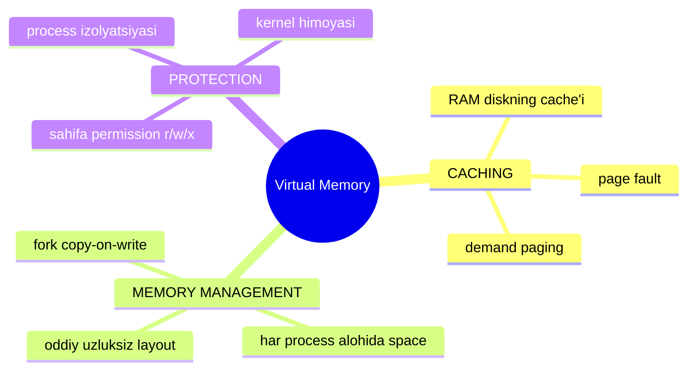
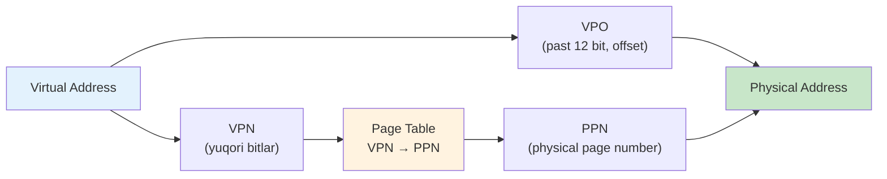
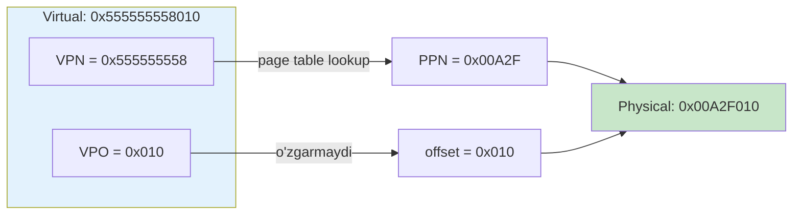
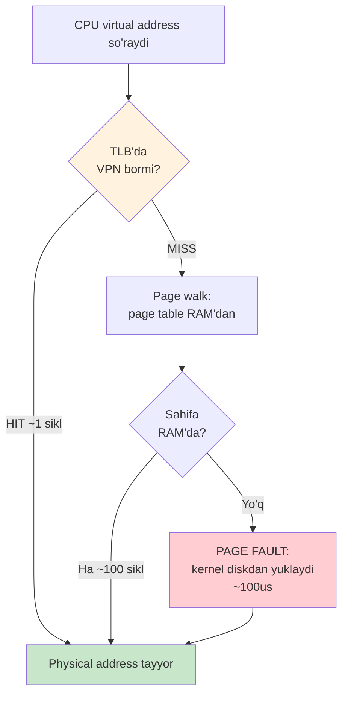
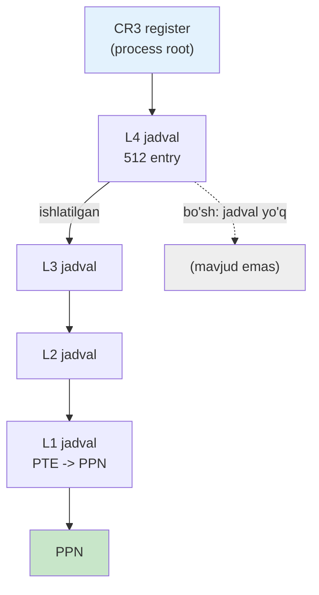
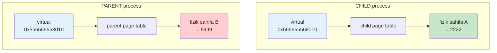

# 24. Virtual Memory — page table, TLB va address translation

> Manba: CS:APP 2-nashr, 9.1-9.6 · Muhit: Ubuntu 24.04 x86-64 (Docker), gcc 13.3.0 · [← Oldingi](23-signals.md) · [Kurs xaritasi](00-README.md) · [Keyingi →](25-linux-memory-mmap.md)

## Nima uchun kerak

Ikki process bir vaqtda ishlaydi va IKKALASI ham `0x555555558010` degan bir xil address'ga yozadi — lekin ular bir-birining ma'lumotini buzmaydi. Qanday? Chunki bu address VIRTUAL: har process o'zining alohida fizik xotirasiga ega, page table esa har birini boshqa joyga tarjima qiladi. Aynan shu illyuziya butun operatsion tizim, xavfsizlik va konteyner modelining poydevori.

Bu bitta g'oya sizga bir nechta amaliy savolni ochib beradi: nega `ps` da VSZ (virtual) 1 GB, RSS (fizik) esa atigi 30 MB (25-darsda); nega konteyner OOM killer tomonidan o'ldiriladi; nega Go'da `nil` pointer'ga murojaat SIGSEGV bilan crash beradi (VM protection 0-address'ni bloklaydi); nega bitta process buzilsa boshqasi omon qoladi. Bularning hammasi virtual memory mexanizmidan kelib chiqadi.

## Nazariya

### 1. Fizik vs Virtual addressing

CPU'ning bajaruvchi qismi HECH QACHON fizik xotira address'ini ko'rmaydi. Har bir `mov`, har bir pointer dereference — hammasi **virtual address** ustida ishlaydi. Bu virtual address'ni fizik RAM address'iga aylantiruvchi apparat — **MMU** (Memory Management Unit), CPU chip ichida joylashgan.

Nega bunday murakkablik kerak? Sababi oddiy: fizik RAM cheklangan (masalan 16 GB), tarqoq (bo'sh bloklar u yer-bu yerda) va bo'lingan (bir nechta process bo'lishadi). Agar dasturlar to'g'ridan-to'g'ri fizik address ishlatsaganda, har biri bir-birining xotirasini bosib, boshqarib bo'lmas tartibsizlik bo'lardi. VM esa har processga **to'liq, uzluksiz, xususiy** address space illyuziyasini beradi.

### 2. Address space

Address space — bu process murojaat qila oladigan address'lar to'plami. Ikki turi bor:

| Tur | Kim ko'radi | Hajmi |
|-----|-------------|-------|
| **Virtual address space** | Har process (alohida) | 48-bit → 281 TB |
| **Physical address space** | Butun tizim (yagona) | RAM hajmi (masalan 16 GB) |

x86-64 nomiga "64-bit" bo'lsa ham, amalda virtual address'ning 48 biti ishlatiladi. Bu har processga 281 TB "illyuziya" beradi — RAM hajmidan minglab marta katta. Bu mumkin, chunki hech kim bu bo'shliqning hammasini bir vaqtda ishlatmaydi; faqat haqiqatan tegilgan sahifalar fizik RAM egallaydi.

### 3. VM ning UCH vazifasi

Virtual memory bir mexanizm, uch xizmat:



**(a) CACHING** — RAM diskning cache'i sifatida. Barcha virtual sahifalar mantiqan diskda yashaydi; RAM esa faqat aktiv ishlatilayotgan sahifalarni "cache" qiladi. Agar CPU RAM'da yo'q sahifaga murojaat qilsa, **page fault** (21-darsdagi FAULT turidagi exception) yuz beradi; kernel kerakli sahifani diskdan RAM'ga yuklaydi. Sahifa faqat haqiqatan kerak bo'lganda yuklanadi — bu **demand paging** ("talab bo'yicha").

**(b) MEMORY MANAGEMENT** — har processga bir xil sodda layout beradi. Kompilyator dasturni har doim bir xil virtual address'lardan boshlanadi deb faraz qila oladi (masalan kod `0x555555...` da), fizik joylashuv esa MMU'ning ishi. Bu allocation'ni, bo'shatishni va `fork` copy-on-write'ni juda soddalashtiradi.

**(c) PROTECTION** — har page table entry'da permission bitlari bor (read/write/execute). CPU sahifaga ruxsatsiz murojaat qilsa (masalan read-only kodga yozmoqchi bo'lsa), MMU **protection fault** beradi → Linux'da SIGSEGV. Har processning alohida page table'i bo'lgani uchun ular bir-birining xotirasiga hatto qaray olmaydi — bu process izolyatsiyasi.

### 4. Address translation — VPN va VPO

Virtual address ikki qismga bo'linadi. Sahifa o'lchami 4 KB = 2^12, demak past **12 bit** — sahifa ichidagi **offset** (VPO, Virtual Page Offset). Qolgan yuqori bitlar — **VPN** (Virtual Page Number), qaysi sahifa ekanini bildiradi.



Diqqat qiling: **offset tarjima QILINMAYDI** — u to'g'ridan-to'g'ri o'tadi. Faqat VPN → PPN tarjima bo'ladi. Bu mantiqiy: sahifa ichidagi bayt pozitsiyasi fizik va virtual dunyoda bir xil, faqat SAHIFA boshqa joyga ko'chadi.

**Page table** — bu har processning o'z jadvali, VPN'ni indeks sifatida ishlatadi va har entry (**PTE**, Page Table Entry) PPN + permission bitlarini saqlaydi. MMU har xotira murojaatida shu jadvalni o'qib tarjima qiladi.

### Qadamma-qadam: 0x555555558010 ni ajratamiz

Nazariyani Demo 1 dagi haqiqiy address ustida ishlab ko'ramiz. `global_var = 0x555555558010`, sahifa o'lchami 4 KB.

**1-qadam — VPO (offset) ni ajratamiz.** 4 KB = 2^12, demak past **12 bit** offset. 12 bit = 3 hex raqam. Address'ning oxirgi 3 hex raqami:

```
0x555555558010
             ^^^  <- past 12 bit = offset
VPO = 0x010 = 16 (o'nlik)
```

Ya'ni bu bayt o'z sahifasining boshidan 16-baytda joylashgan.

**2-qadam — VPN (sahifa raqami) ni ajratamiz.** Qolgan yuqori bitlar VPN:

```
0x555555558010
0x555555558      <- VPN (past 3 hex raqamni tashladik)
```

VPN = `0x555555558`. Bu "qaysi virtual sahifa" degan savolga javob.

**3-qadam — page table VPN → PPN qiladi.** MMU page table'ga `0x555555558` indeks bilan kiradi va PTE'ni o'qiydi. Faraz qilaylik, PTE PPN = `0x00A2F` (bu fizik RAM'dagi sahifa raqami) va permission = `rw-` deb qaytardi.

**4-qadam — fizik address'ni yig'amiz.** PPN + o'zgarmagan offset:

```
PPN  = 0x00A2F
VPO  = 0x010     (o'zgarmadi!)
-----------------
Physical address = 0x00A2F010
```



Asosiy g'oya: **offset hech qachon o'zgarmaydi**, faqat VPN → PPN almashadi. Demo 3 da child va parent bir xil VPN (`0x555555558`) ishlatgan, lekin ularning page table'lari uni turli PPN'ga (turli fizik sahifaga) tarjima qilgan — shuning uchun qiymatlar mustaqil edi.

### 5. TLB — tarjima cache'i

Muammo: page table'ning O'ZI RAM'da yashaydi. Demak har bir tarjima uchun avval RAM'dan PTE o'qish kerak — bu har xotira murojaatini ikki barobar sekinlashtiradi. Yechim: **TLB** (Translation Lookaside Buffer) — MMU ichidagi kichik, o'ta tez cache, eng so'nggi VPN → PPN tarjimalarini saqlaydi.

Bu 16-17 darslardagi cache g'oyasining aynan o'zi, faqat ma'lumot o'rniga TARJIMA cache'lanadi. TLB ham xuddi data cache kabi **hit** va **miss** tushunchalari bilan ishlaydi: kerakli VPN → PPN tarjimasi TLB'da bormi yoki yo'qmi.

Har bir xotira murojaati uchta yo'ldan biriga tushadi, tezligi keskin farqli:

| Holat | Nima sodir bo'ladi | Taxminiy narx |
|-------|---------------------|---------------|
| **TLB hit** | Tarjima TLB'da tayyor, RAM'ga tegmaymiz | ~1 sikl (~1 ns) |
| **TLB miss** | Page walk: MMU page table'ni RAM'dan o'qiydi | ~100+ sikl (RAM latency) |
| **Page fault** | Sahifa RAM'da yo'q, kernel diskdan yuklaydi | milliardlab sikl (~100 us SSD) |

Farqni his qiling: TLB hit va page fault orasida million baravardan katta tafovut. Shuning uchun TLB hit rate (odatda 99%+) performance uchun hal qiluvchi. TLB miss "faqat" RAM'dan page table o'qiydi (sekin, lekin diskka bormaydi); page fault esa haqiqiy sahifani diskdan yuklaydi — eng qimmat holat.



Diqqat: TLB miss va page fault BOSHQA narsa. TLB miss — tarjima cache'da yo'q, lekin sahifa RAM'da bor (page table'dan topiladi). Page fault — sahifa umuman RAM'da yo'q (diskdan kerak). TLB miss tez-tez bo'ladi va normal; page fault esa kamroq va qimmatroq.

### 6. Ko'p darajali page table

Nega bitta tekis (single-level) page table ishlamaydi? Raqamlab ko'raylik. Virtual space 281 TB (2^48), sahifa 4 KB (2^12). Sahifalar soni:

```
2^48 / 2^12 = 2^36 = ~68 milliard sahifa
```

Har sahifa uchun bitta PTE (~8 bayt) kerak bo'lsa, bitta process'ning page table'i:

```
68 milliard x 8 bayt = ~512 GB
```

Bu bema'ni — page table'ning O'ZI RAM'dan katta! Va bu FAQAT bitta process uchun. Ko'p process'da mumkin emas.

**Yechim — ierarxiya (daraxt).** x86-64 page table'ni **4 darajaga** bo'ladi. 48-bit VPN qismi 4 ta 9-bitlik indeksga bo'linadi (4 x 9 = 36 bit VPN, + 12 bit offset = 48):

```
[ 9 bit ][ 9 bit ][ 9 bit ][ 9 bit ][ 12 bit offset ]
  L4       L3       L2       L1        VPO
```

MMU har darajada 9-bit indeks bilan keyingi darajaga o'tadi (daraxt bo'ylab pastga tushadi), oxirida PPN'ni topadi. Har daraja jadvali atigi 2^9 = 512 entry.

**Nega bu tejamkor?** Ierarxiyaning kuchi: **bo'sh diapazonlar uchun butun sub-daraxt umuman mavjud bo'lmaydi**. Agar process virtual space'ning katta qismiga umuman tegmasa (odatda shunday — 281 TB dan bir necha MB ishlatiladi), o'sha yo'nalishdagi past darajali jadvallar hech qachon yaratilmaydi. Yuqori darajadagi entry shunchaki "bo'sh" (invalid) deb belgilanadi. Amaliy process'ning page table'i megabaytlarda emas, kilobaytlarda o'lchanadi.



Salbiy tomoni: bitta TLB miss endi 4 ta RAM murojaatini talab qiladi (har daraja uchun bittadan) — shuning uchun TLB yanada muhim, va CPU'da "page walk cache" ham bor.

## Kod va isbot

### Demo 1 — process virtual address space layout

Avval processning virtual address'lari qanday joylashishini ko'ramiz.

```c
#include <stdio.h>
#include <stdlib.h>

int global_var = 42;
const char *rodata = "read-only";

int main(void)
{
    int local = 1;
    int *heap = malloc(sizeof(int) * 100);

    printf("kod (main)   : %p (.text)\n", (void*)main);
    printf("global_var   : %p (.data/.bss)\n", (void*)&global_var);
    printf("heap (malloc): %p (heap)\n", (void*)heap);
    printf("local (stack): %p (stack)\n", (void*)&local);
    free(heap);
    return 0;
}
```

Output:

```
kod (main)   : 0x5555555551a9 (.text)
global_var   : 0x555555558010 (.data/.bss)
heap (malloc): 0x5555555592a0 (heap)
local (stack): 0x7ffffffc5af4 (stack)
```

Bu KLASSIK layout. Past address'da kod (`0x555555...`), yuqoriroqda global data, keyin heap (yuqoriga o'sadi), eng yuqorida stack (`0x7ffff...`, pastga o'sadi). Bularning HAMMASI virtual address — har process aynan shunday tanish layout ko'radi, fizik RAM'da esa qayerda yotgani muhim emas.

`0x5555...` baza — PIE (position-independent executable, 20-darsdagi ASLR uchun tasodifiy baza). Heap va stack orasidagi ulkan bo'sh diapazon — shared library'lar va `mmap` uchun (25-dars). Bu bo'shliq "bepul" — u faqat virtual, hech qanday fizik RAM egallamaydi.

### Demo 2 — sahifa o'lchami va address space hajmi

```
$ getconf PAGE_SIZE
4096
```

```c
long ps = sysconf(_SC_PAGESIZE);
printf("Sahifa o'lchami   : %ld bayt (%ld KB)\n", ps, ps/1024);
printf("48-bit virtual    : %.0f TB address space\n", (double)(1L<<48)/1e12);
```

Output:

```
Sahifa o'lchami   : 4096 bayt (4 KB)
48-bit virtual    : 281 TB address space
```

Xotira SAHIFALAR (page) bilan boshqariladi — standart 4 KB. Bu raqam address translation'ning yuragi: 4096 = 2^12, demak virtual address'ning past **12 biti** offset. Virtual address 48-bit → har processga 281 TB address space. Fizik RAM esa ancha kichik (masalan 16 GB) — bu VM illyuziyasining aniq raqamli isboti: virtual >> physical.

### Demo 3 — ENG MUHIM: bir xil virtual address, alohida fizik xotira

Bu darsning yuragi. `fork` bilan ikki process yaratamiz va ikkalasi ham AYNAN BIR XIL virtual address'ni ishlatishini, lekin qiymatlar mustaqil ekanini ko'rsatamiz.

```c
#include <stdio.h>
#include <stdlib.h>
#include <unistd.h>
#include <sys/wait.h>

int global = 1000;

int main(void)
{
    pid_t pid = fork();
    if (pid == 0) {
        global = 2222;                       /* child o'zgartiradi */
        printf("CHILD : &global=%p, qiymat=%d\n", (void*)&global, global);
        exit(0);
    }
    wait(NULL);
    global = 9999;                            /* parent o'zgartiradi */
    printf("PARENT: &global=%p, qiymat=%d\n", (void*)&global, global);
    return 0;
}
```

Output:

```
CHILD : &global=0x555555558010, qiymat=2222
PARENT: &global=0x555555558010, qiymat=9999
```

Diqqat bilan qarang: child va parent IKKALASI ham `&global = 0x555555558010` — **aynan bir xil virtual address**. LEKIN qiymatlar butunlay boshqa: child'da 2222, parent'da 9999. Qanday mumkin?

Javob — page table. Bir xil virtual address `0x555555558010` ikki processda IKKI ALOHIDA fizik sahifaga tarjima qilinadi:



Har processning O'Z page table'i bor. Bu bitta demo VM ning ikki vazifasini bir vaqtda ko'rsatadi:
- **Memory management** — ikkala process ham bir xil sodda layout (`0x5555...`) ko'radi, kompilyatorga qulay.
- **Protection / izolyatsiya** — child'ning `2222` ni parent ko'ra olmaydi va aksincha; xotiralar butunlay ajratilgan.

`fork` mexanizmi **copy-on-write** (22-dars): dastlab child va parent AYNI fizik sahifani bo'lishadi (nusxa yo'q, tez). Kimdir YOZGANDA (`global = 2222`) MMU protection fault beradi, kernel o'sha sahifaning nusxasini oladi va yozuvchiga beradi. Shuning uchun `fork` arzon, lekin izolyatsiya saqlanadi.

### Demo 4 — /proc/self/maps: haqiqiy memory xaritasi va PROTECTION

Page table'dagi permission bitlarini `/proc/PID/maps` orqali real ko'rish mumkin.

```
555555556000-55555555b000 r-xp ... /usr/bin/cat        (kod - r-x)
55555555e000-55555555f000 rw-p ... /usr/bin/cat        (data - rw)
7fffff5d8000-7fffff760000 r-xp ... libc.so.6           (kutubxona kodi - r-x)
7fffff7c6000-7ffffffc6000 rw-p ...                     (stack - rw)
```

Har qator bir virtual memory diapazoni: address chegaralari + **permission** bitlari + fayl. Permission ustuni — VM protection vazifasining aniq isboti:

| Segment | Permission | Ma'nosi |
|---------|-----------|---------|
| kod (.text) | `r-x` | o'qish + bajarish, YOZIB bo'lmaydi |
| data / stack | `rw-` | o'qish + yozish, BAJARIB bo'lmaydi |
| `p` | private | copy-on-write |

MUHIM nuqta: kod `r-x` — yozib bo'lmaydi, shuning uchun dastur o'zining kodini o'zgartira olmaydi. Data va stack `rw-` — o'qish/yozish mumkin, lekin BAJARIB bo'lmaydi. Bu **W^X** (Write XOR eXecute) himoyasi: buffer overflow orqali stack'ga zararli kod joylab, uni ishga tushirib bo'lmaydi (11-darsdagi attack himoyasi). Bu himoya SAHIFA darajasida, page table entry'dagi bitlar orqali amalga oshadi.

## Go dasturchiga ko'prik

Go runtime virtual memory'ni juda faol ishlatadi va uning xatti-harakati faqat shu dars kontekstida tushunarli bo'ladi.

**VSZ katta, RSS kichik.** Go runtime ishga tushishida katta virtual address space RESERVE qiladi (heap arena'lar uchun) — shuning uchun `ps` da VSZ (virtual size) juda katta ko'rinadi (yuz MB yoki GB). Lekin faqat haqiqatan tegilgan sahifalar fizik RAM egallaydi — RSS (resident set size) ancha kichik. Reserve ≠ commit. Batafsil RSS/VSZ farqi 25-darsda.

**Heap va mmap.** Go heap'i operatsion tizimdan `mmap` orqali katta virtual bloklar oladi (arena, 64 MB) va ularni ichida boshqaradi (26-darsda malloc/allocator). Yangi olingan sahifa birinchi marta yozilganda page fault yuz beradi — kernel o'sha payt fizik sahifa biriktiradi (demand paging). Shuning uchun Go dasturda ham "birinchi yozuv sekinroq" effekti bor.

**nil pointer → SIGSEGV.** Virtual address'ning 0 atrofidagi sahifasi HECH QACHON map qilinmaydi (protection). Go'da `nil` pointer'ni dereference qilsangiz, MMU o'sha map qilinmagan sahifaga murojaatni ko'radi, page fault → protection fault → SIGSEGV (21-dars) → Go runtime buni ushlab `panic: runtime error: invalid memory address or nil pointer dereference` beradi. Ya'ni Go'ning nil panic'i to'g'ridan-to'g'ri VM protection mexanizmiga tayanadi.

**Goroutine stack.** Har goroutine kichik stack (8 KB) bilan boshlanadi, lekin virtual address space'da o'sishga joy ajratilgan; kerak bo'lsa Go stack'ni kattaroq bloka ko'chiradi. Bu ham virtual memory bo'lgani uchun arzon.

**Container va OOM.** Konteynerda Go processga cgroup memory limit qo'yiladi. Bu limit RSS (fizik) ni sanaydi, VSZ'ni emas. RSS limitdan oshsa, kernel OOM killer processni o'ldiradi. GC (27-dars) aynan RSS'ni nazoratda ushlash uchun ishlaydi.

## Real-world scenariylar

**1. Container OOMKilled.** Go servis Kubernetes pod'da `memory limit: 512Mi` bilan ishlaydi. Yuk ostida heap o'sadi, RSS 512 MB'dan oshadi. Kernel cgroup limitini nazorat qiladi va processni `SIGKILL` bilan o'ldiradi (`OOMKilled`). Diqqat: bu yerda RSS (fizik) muhim, VSZ (virtual) emas — Go'ning VSZ'si har doim katta bo'ladi va bu normal (25-dars).

**2. nil pointer / segfault.** Go'da `var p *User; fmt.Println(p.Name)` — `p` nil, uning `Name` maydoniga murojaat 0 atrofidagi map qilinmagan address'ga tegadi. VM protection bu sahifani bloklaydi → SIGSEGV → panic. Xuddi shu narsa C'da process crash beradi. VM 0-address'ni himoyalagani uchun nil bug'lar darhol qo'lga tushadi, "jimgina buzilish" bo'lmaydi.

**3. Process izolyatsiyasi.** Bir web serverda ikkita mustaqil process ishlaydi; biri buzilib crash bo'lsa (segfault), ikkinchisi mutlaqo ta'sirlanmaydi — chunki ularning address space'lari alohida page table'lar orqali to'liq ajratilgan. Bu izolyatsiya multi-tenancy va konteyner platformalarining butun xavfsizlik asosidir: bir tenant boshqasining xotirasini ko'ra olmaydi.

**4. TLB miss "bo'roni" va huge pages.** Katta ma'lumot ustida TARQOQ (random) murojaat qiladigan dastur — masalan bir necha GB'lik hash jadval yoki grafda tasodifiy sakrash — TLB'ni "urib yiqitadi". TLB atigi bir necha yuz entry saqlaydi; har entry 4 KB qamraydi, demak TLB jami ~1-2 MB'ni "yodda" tutadi. Ma'lumot bundan katta va murojaat tarqoq bo'lsa, deyarli har murojaat TLB miss → page walk (4 daraja x RAM murojaati). CPU hisoblashning yarmini tarjimaga sarflaydi.

Belgilari: `perf stat` da `dTLB-load-misses` yuqori, CPU band lekin foydali ish sekin. Yechim — **huge pages** (2 MB yoki 1 GB). Bitta 2 MB huge page 512 ta oddiy 4 KB sahifa o'rnini bosadi, demak bitta TLB entry 512 baravar ko'p xotira qamraydi. Natijada bir xil TLB bilan ~1-2 MB emas, gigabaytlarni qoplash mumkin → TLB miss keskin kamayadi. PostgreSQL (`huge_pages=on`), JVM va katta-heap'li Go servislari shu sabab huge pages'dan foyda ko'radi.

## Zamonaviy yondashuv

Amaliyotda address translation bir necha optimizatsiya bilan boyitilgan:

- **4-darajali page table** x86-64 standarti; yangi CPU'larda **5-daraja** (128 PB virtual space, katta serverlar uchun).
- **Huge pages** (2 MB yoki 1 GB) — 4 KB o'rniga katta sahifalar. Bir sahifa ko'proq xotira qamragani uchun TLB'da kamroq entry kerak → TLB bosimi kamayadi, katta heap'li bazalarga (PostgreSQL, Go big-heap servislari) foydali.
- **TLB shootdown** — multi-core tizimda bir core page table'ni o'zgartirsa, boshqa core'larning TLB'sidagi eski tarjimalarni bekor qilish kerak (IPI orqali). Bu ko'p yadroli tizimda sezilarli xarajat.
- **ASLR** — layout'ni har ishga tushirishda tasodifiy qilish (Demo 1 dagi `0x5555...` baza). VM + tasodifiylik = xavfsizlik: attacker address'larni oldindan bilmaydi.
- **Memory overcommit** — Linux VSZ yig'indisi fizik RAM'dan katta bo'lishiga ruxsat beradi (ko'p reserve hech qachon tegilmaydi). Agar hamma commit qilsa — OOM killer. Swap kamayib bormoqda (RAM arzonlashdi), lekin overcommit muhim.
- **KSM** (Kernel Same-page Merging) — bir xil mazmunli fizik sahifalarni birlashtirish, virtualizatsiya zichligini oshirish.

## Keng tarqalgan xatolar

**1. "virtual address = fizik address" deb o'ylash.** Yo'q. CPU ko'rgan har address virtual; MMU uni page table orqali fizikga tarjima qiladi. Demo 3 buni buzib tashlaydi: bir xil virtual, ikki fizik.

**2. VSZ (virtual) ni RSS (fizik) bilan chalkashtirish.** VSZ — process reserve qilgan virtual space (har doim katta, ayniqsa Go'da). RSS — haqiqatan RAM egallagan qism. OOM killer RSS'ga qaraydi, VSZ'ga emas. "VSZ 2 GB, tizim yiqiladi" — noto'g'ri xavotir (25-dars).

**3. "malloc darhol RAM oladi" deb o'ylash.** `malloc` (yoki Go'da katta slice) faqat VIRTUAL diapazon reserve qiladi. Fizik sahifa faqat siz o'sha xotiraga birinchi marta YOZGANDA biriktiriladi (page fault, demand paging). Shuning uchun katta bufer allocate qilish tez, birinchi to'ldirish esa sekinroq.

**4. "page fault = xato/bug" deb o'ylash.** Ko'p page fault'lar butunlay normal (minor fault): demand paging'da yangi sahifa yuklash, copy-on-write nusxasi, zero-fill. Bular kerakli mexanizm. Faqat protection buzilishi (map qilinmagan/ruxsatsiz sahifa) → SIGSEGV, bu esa haqiqiy bug.

**5. Process izolyatsiyasini e'tiborsiz qoldirish.** Ba'zilar "global o'zgaruvchi processlar orasida bo'lishiladi" deb o'ylaydi. Yo'q — `fork` dan keyin har process o'z nusxasiga ega (Demo 3). Xotira bo'lishish uchun maxsus shared memory (`mmap MAP_SHARED`) kerak.

## Amaliy mashqlar

**1.** Demo 3 da child `global = 2222`, parent `global = 9999` qildi, lekin `&global` ikkalasida ham `0x555555558010`. Bir xil address turli qiymat berishi qanday mumkin?

<details>
<summary>Yechim</summary>

`&global` VIRTUAL address, u ikki processda bir xil. Lekin har processning alohida page table'i bu bir xil virtual address'ni IKKI ALOHIDA fizik sahifaga tarjima qiladi. Child'ning fizik sahifasida 2222, parent'nikida 9999. `fork` copy-on-write: `global = 2222` yozuvi sahifani ajratdi (nusxa oldi).
</details>

**2.** Sahifa o'lchami 4096 bayt. Virtual address'ning necha biti offset (VPO), qolgani nima?

<details>
<summary>Yechim</summary>

4096 = 2^12, demak past **12 bit** — offset (VPO). Qolgan yuqori bitlar — VPN (virtual page number). x86-64 da 48 ishlaydigan bitdan 12 tasi offset, 36 tasi VPN. Offset tarjima qilinmaydi, to'g'ridan-to'g'ri fizik address'ga o'tadi.
</details>

**3.** Virtual address space 281 TB dedik. Bu raqam qayerdan? Nega 64-bit'dan 18 EB emas?

<details>
<summary>Yechim</summary>

x86-64 nomiga 64-bit, lekin amalda faqat **48 bit** virtual address ishlatiladi. 2^48 = 281 TB. Qolgan yuqori bitlar hozircha ishlatilmaydi (kanonik address qoidasi). Yangi 5-darajali page table CPU'lari 57 bit → 128 PB beradi.
</details>

**4.** Go dasturda `ps` VSZ = 1.2 GB, RSS = 45 MB ko'rsatdi. Bu bug'mi? Tizim yiqiladimi?

<details>
<summary>Yechim</summary>

Bug emas, normal. Go runtime katta virtual space RESERVE qildi (VSZ 1.2 GB), lekin faqat 45 MB fizik RAM ishlatilyapti (RSS). Reserve fizik RAM egallamaydi. OOM killer RSS'ga qaraydi (45 MB), VSZ'ga emas. Tizim xavf ostida emas.
</details>

**5.** `/proc/self/maps` da kod segmenti `r-x`, stack esa `rw-`. Nega kod'da `w` yo'q, stack'da `x` yo'q?

<details>
<summary>Yechim</summary>

W^X himoyasi. Kod `r-x` (yozib bo'lmaydi) — dastur o'z kodini o'zgartira olmaydi va zararli o'zgartirish bloklanadi. Stack `rw-` (bajarib bo'lmaydi) — buffer overflow orqali stack'ga kod joylab, uni ishga tushirib bo'lmaydi. Permission page table entry darajasida, MMU tomonidan majburlanadi.
</details>

**6.** Go'da `nil` pointer'ni dereference qilsangiz nega aniq SIGSEGV bo'ladi, tasodifiy xotira buzilishi emas?

<details>
<summary>Yechim</summary>

Virtual address 0 atrofidagi sahifa HECH QACHON map qilinmaydi (page table'da entry yo'q, VM protection). MMU o'sha address'ga murojaatni ko'rib page fault → protection fault → SIGSEGV beradi. Go runtime buni panic'ga aylantiradi. Shuning uchun nil bug darhol, aniq joyda qo'lga tushadi — "jimgina" xotira buzilishi bo'lmaydi.
</details>

**7.** Virtual address `0x555555558ABC` berilgan (4 KB sahifa). VPN va VPO'ni ajrating.

<details>
<summary>Yechim</summary>

Past 12 bit (3 hex raqam) = offset. `0xABC` — VPO (offset). Qolgani `0x555555558` — VPN (virtual page number). Tarjimada `0x555555558` page table orqali PPN'ga aylanadi, `0xABC` esa o'zgarmasdan fizik address'ning past 12 bitiga ko'chadi.
</details>

## Cheat sheet

| Tushuncha | Nima | Eslab qolish |
|-----------|------|--------------|
| **virtual address** | CPU ishlatadigan address | Har process alohida ko'radi |
| **physical address** | RAM'dagi haqiqiy joy | Butun tizimga yagona |
| **MMU** | apparat tarjimon | virtual → physical, CPU ichida |
| **page** | xotira birligi | 4 KB (2^12) |
| **VPO** | offset | past 12 bit, tarjima yo'q |
| **VPN** | qaysi sahifa | yuqori bitlar, tarjima bo'ladi |
| **page table** | VPN → PPN jadval | har processning o'zi |
| **PTE** | page table entry | PPN + permission bitlar |
| **PPN** | physical page number | tarjima natijasi |
| **TLB** | tarjima cache'i | MMU ichida, 99% hit |
| **page fault** | sahifa RAM'da yo'q | kernel yuklaydi (ko'pi normal) |
| **demand paging** | talab bo'yicha yuklash | birinchi murojaatda fizik |
| **copy-on-write** | yozganda nusxa | fork'ni arzonlashtiradi |
| **VM 3 vazifa** | caching / management / protection | bir mexanizm, uch xizmat |
| **permission** | r / w / x | sahifa darajasida, W^X |
| **4-darajali table** | ierarxik page table | 281 TB uchun tejamkor |

## Qo'shimcha manbalar

- [OSTEP: Paging — Faster Translations (TLBs)](https://pages.cs.wisc.edu/~remzi/OSTEP/vm-tlbs.pdf) — TLB va address translation chuqur, bepul kitob bobi.
- [Coding Confessions: Virtual Memory — Page Tables, TLBs, and Linux Internals](https://blog.codingconfessions.com/p/virtual-memory) — Linux amaliyotidagi page table va TLB.
- [Demand paging — Wikipedia](https://en.wikipedia.org/wiki/Demand_paging) — demand paging, minor/major fault, copy-on-write.
