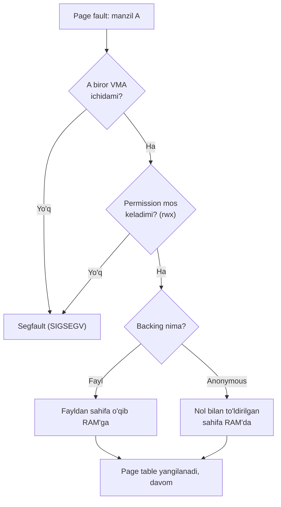
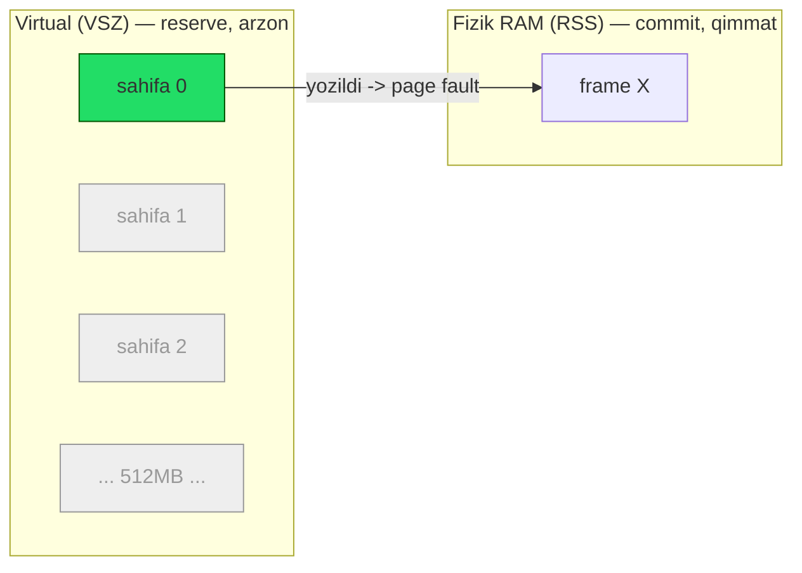
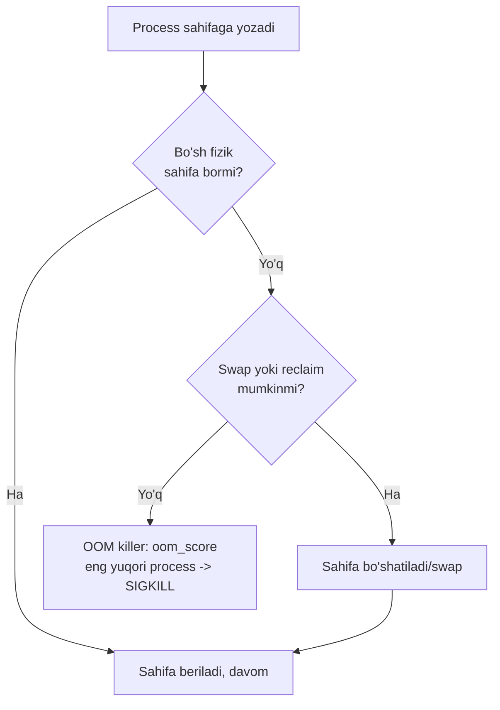

# 25. Linux Memory System va mmap — RSS/VSZ, demand paging, OOM

> Manba: CS:APP 2-nashr, 9.7-9.8 · Muhit: Ubuntu 24.04 x86-64 (Docker), gcc 13.3.0, go 1.22.2 · [← Oldingi](24-virtual-memory.md) · [Kurs xaritasi](00-README.md) · [Keyingi →](26-dynamic-memory-allocation.md)

## Nima uchun kerak

Sen Go servisni Kubernetes'ga deploy qilding, `memory limit: 512Mi` qo'yding — va u tinch turibdi, keyin birdan `OOMKilled` bo'ldi. `kubectl top` esa RSS 400Mi ko'rsatgan edi. Nega? Chunki OOM killer VSZ'ga emas, RSS'ga (va cgroup working set'ga) qaraydi, va sen bu ikki metrikni chalkashtirding.

Yoki: Go servising GC ishlagach ham RSS'i pastga tushmaydi — monitoring "memory leak" deb signal beradi, lekin aslida leak yo'q. Yoki: `malloc(1GB)` chaqirasan, lekin `free -m` hech narsa o'zgarmaganini ko'rsatadi. Bularning HAMMASI bitta mavzuning turli qirralari: **virtual xotira reserve** va **fizik xotira commit** orasidagi farq, hamda uning ustiga qurilgan **mmap** mexanizmi.

Bu — backend developer uchun eng amaliy memory dars. Uni tushunsang, OOM debugging, konteyner memory tuning va katta fayl processing sirini yechasan.

## Nazariya

### 1. Linux process address space — VMA'lar to'plami

24-darsda ko'rdikki, har process o'z **virtual address space**'iga ega (0 dan katta manzilgacha bo'lgan xayoliy tekis xotira). Lekin bu space bir butun bo'lak emas — u alohida **regionlar (areas)** dan iborat. Kernel har bir regionni **VMA** (`vm_area_struct` — Virtual Memory Area) struktura bilan ifodalaydi.

Har bir VMA quyidagilarni saqlaydi:

- **Diapazon**: `vm_start` — `vm_end` (region qayerdan qayergacha).
- **Permission**: o'qish/yozish/bajarish (rwx) — kod regioni `r-x`, data `rw-`.
- **Backing (orqa fon)**: bu regionni nima "to'ldiradi" — **fayl** (masalan kod libc'dan keladi) yoki **anonymous** (fayl emas, sof nol xotira: heap, stack).

Klassik layout (24-darsdagi):

| Region | Backing | Permission | Nima |
| --- | --- | --- | --- |
| `.text` (kod) | ELF fayl | `r-x` | Mashina kodi |
| `.data`/`.bss` | ELF fayl / anonymous | `rw-` | Global o'zgaruvchilar |
| **heap** | anonymous | `rw-` | `malloc` bergani, yuqoriga o'sadi |
| **mmap region** | fayl yoki anonymous | turli | shared library'lar, katta `malloc` bloklar |
| **stack** | anonymous | `rw-` | Lokal o'zgaruvchilar, pastga o'sadi |

Bu regionlarni ko'z bilan ko'rish uchun `/proc/PID/maps` faylini o'qi — har qatori bitta VMA. Page fault (21-dars) kelganda kernel ayni shu VMA ro'yxatidan qidiradi: agar manzil biror VMA ichida bo'lsa va permission mos kelsa — legal fault (sahifa yuklanadi); aks holda **segfault**.



### 2. Demand paging — reserve va commit ikki bosqichi

Bu darsning yuragi. Xotira "olinishi" bir amal emas, **ikki bosqich**:

1. **Virtual reserve (arzon)** — `malloc`/`mmap` faqat VMA'ni ochadi: "shu manzillar diapazoni endi menga tegishli". Fizik RAM olinmaydi, faqat kernel ma'lumot strukturasi yangilanadi. Bu deyarli tekin.

2. **Fizik commit (qimmat)** — sahifaga BIRINCHI marta murojaat (yozish yoki o'qish) qilganingda **page fault** yuz beradi, kernel o'shanda va faqat o'shanda haqiqiy fizik sahifa (4KB RAM) ajratadi. Bu **demand paging** (24-dars).

> Oltin qoida: `malloc(1GB)` RAM olmaydi — u faqat 1GB virtual manzilni band qiladi. RAM faqat sen HAQIQATDA yozgan sahifalarga, yozgan paytda beriladi.

Shuning uchun process VSZ >> RSS bo'lishi mutlaqo normal: sen 1GB reserve qilib faqat 10MB'ga yozsang, RSS 10MB'ga oshadi, VSZ 1GB'ga.



Faqat yozilgan sahifa (yashil) fizik frame oladi; qolganlari (kulrang) hali RAM'da yo'q.

### 3. RSS vs VSZ — monitoring tili

| Metrika | To'liq nomi | Nima o'lchaydi | Xarakter |
| --- | --- | --- | --- |
| **VSZ** | Virtual Size (`VmSize`) | Process ko'rgan BUTUN virtual address space | Katta, arzon, deyarli ahamiyatsiz |
| **RSS** | Resident Set Size (`VmRSS`) | HAQIQATDA RAM'da band bo'lgan sahifalar | Kichikroq, qimmat, MUHIM |

`RSS = anonymous (heap/stack yozilgan) + mapped file (RAM'ga yuklangan qismi) + shared`. Shuni yodda tut:

- **VSZ** — "men so'ragan maksimum". Monitoring uchun deyarli befoyda (har doim shishgan ko'rinadi).
- **RSS** — "men haqiqatda ishlatayotgan RAM". OOM killer, cgroup limit, `kubectl top` — hammasi shunga qaraydi.

### 4. mmap — fayl yoki xotirani address space'ga xaritalash

`mmap` — Linux'ning eng kuchli syscall'laridan biri. U VMA yaratib, uni biror **backing**'ga bog'laydi:

- **File-backed mapping**: fayl to'g'ridan-to'g'ri xotira massiviga aylanadi. `read`/`write` syscall'siz, fayl mazmunini oddiy pointer orqali o'qiysan/yozasan. Kernel sahifalarni demand paging bilan yuklaydi.
- **Anonymous mapping**: fayl emas, sof nol xotira (`MAP_ANONYMOUS`, `fd=-1`). Aynan `malloc` katta bloklar uchun ishlatadigan mexanizm (26-dars).

`MAP_SHARED` vs `MAP_PRIVATE` — mapping'ning yozish semantikasi:

| Flag | Yozish qayerga boradi | Boshqa process ko'radimi | Ishlatilishi |
| --- | --- | --- | --- |
| `MAP_SHARED` | Faylga VA page cache'ga | Ha (aynan shu fayl) | IPC, fayl tahrirlash |
| `MAP_PRIVATE` | Faqat o'z nusxaga (**copy-on-write**) | Yo'q | Kod yuklash, `fork` |

### 5. mmap qayerda yashiringan — shared library, fork, malloc

mmap'ni to'g'ridan-to'g'ri chaqirmasang ham, u har qadamda ishlaydi:

- **Shared library'lar (20-dars)**: `libc.so` bitta marta RAM'ga yuklanadi (file-backed, `MAP_PRIVATE`, `r-x`), va HAMMA process bir xil fizik sahifalarni **bo'lishadi**. 100 ta process ishga tushsa ham libc kodi RAM'da bir marta yotadi. Bu — mmap orqali `MAP_PRIVATE` file mapping.
- **`fork` copy-on-write (22-dars)**: bola parent sahifalarini nusxalamaydi, `MAP_PRIVATE` kabi COW bilan bo'lishadi; biror sahifaga yozilganda o'sha sahifa ko'chiriladi.
- **`malloc` (26-dars)**: kichik bloklar uchun `brk` (heap chegarasini surish), katta bloklar (odatda >128KB) uchun to'g'ridan-to'g'ri anonymous `mmap`.

### 6. OOM killer — RAM tugaganda kim o'ladi

Linux **overcommit** qiladi: jami reserve fizik RAM'dan katta bo'lishiga ruxsat beradi (chunki hamma reserve ham commit bo'lmaydi). Lekin agar hamma birdan yozib RAM + swap tugasa, kernel'da ajratadigan sahifa qolmaydi. O'shanda **OOM killer** ishga tushadi: `oom_score` bo'yicha eng "yomon" (ko'p RSS ishlatgan) process'ni tanlab `SIGKILL` yuboradi.

Konteynerda esa bu **cgroup** darajasida: konteyner memory limit'i — cgroup limit. Working set (RSS + reclaim qilib bo'lmaydigan page cache) limitdan oshsa, cgroup OOM killer aynan shu konteyner ichidagi process'ni o'ldiradi — hostda RAM bo'lsa ham.



## Kod va isbot

### Demo 1 — RSS vs VSZ: reserve va commit isboti (markaziy)

Bu darsning eng muhim kodi. `/proc/self/status` faylidan `VmSize` (VSZ) va `VmRSS` (RSS) ni o'qib, `malloc` va `memset` bosqichlarida qanday o'zgarishini ko'ramiz.

```c
#include <stdio.h>
#include <stdlib.h>
#include <string.h>
#include <unistd.h>

void print_mem(const char *tag) {
    FILE *f = fopen("/proc/self/status", "r");
    char line[128]; long vsz=0, rss=0;
    while (fgets(line, sizeof(line), f)) {
        sscanf(line, "VmSize: %ld kB", &vsz);
        sscanf(line, "VmRSS: %ld kB", &rss);
    }
    fclose(f);
    printf("%-24s VSZ=%ld MB, RSS=%ld MB\n", tag, vsz/1024, rss/1024);
}

int main(void)
{
    print_mem("boshlanish:");
    size_t N = 512L*1024*1024;                /* 512 MB */
    char *p = malloc(N);
    print_mem("malloc(512MB) keyin:");        /* faqat virtual reserve */
    memset(p, 1, N);                          /* endi HAR sahifaga yozamiz */
    print_mem("memset(butun) keyin:");        /* endi fizik commit */
    free(p);
    return 0;
}
```

Output:

```
boshlanish:              VSZ=282 MB, RSS=4 MB
malloc(512MB) keyin:     VSZ=794 MB, RSS=4 MB
memset(butun) keyin:     VSZ=794 MB, RSS=516 MB
```

Bu uch qatorda butun dars mujassam. Qadam-qadam:

1. **`malloc(512MB)` keyin**: VSZ 282 → 794 MB (+512, xuddi so'ralganidek). Lekin **RSS o'zgarmadi** — hamon 4 MB! `malloc` faqat virtual address space RESERVE qildi, birorta ham fizik RAM olmadi. Bu — reserve bosqichi.

2. **`memset` (har baytga yozish) keyin**: VSZ o'sha-o'sha (794). Lekin **RSS 4 → 516 MB**! Endi biz har bir sahifaga tegdik; har birinchi tegishda page fault (24-dars) yuz berdi va kernel demand paging bilan fizik RAM berdi. Bu — commit bosqichi.

**Notional machine**: `memset` davomida CPU 512MB / 4KB ≈ 131072 marta page fault generatsiya qildi, har birida kernel bo'sh frame topib, page table'ga yozdi, nol sahifani frame'ga bog'ladi. RSS aynan shu 131072 ta frame'ni aks ettiradi.

> Xulosa: OOM killer VSZ (794 MB) ga emas, RSS (516 MB) ga qaraydi. Agar sen 512MB reserve qilib yozmasang, RAM'ga hech qanday bosim bo'lmaydi.

### Demo 2 — mmap: faylni xotira massiviga aylantirish

Endi file-backed mmap. Faylni ochib, `mmap` bilan xotiraga xaritalaymiz va `read`/`write` syscall'siz ishlaymiz.

```c
#include <stdio.h>
#include <stdlib.h>
#include <string.h>
#include <fcntl.h>
#include <unistd.h>
#include <sys/mman.h>
#include <sys/stat.h>

int main(void)
{
    const char *msg = "Salom, mmap dunyosi!\n";
    int fd = open("data.txt", O_RDWR | O_CREAT | O_TRUNC, 0644);
    write(fd, msg, strlen(msg));

    struct stat st; fstat(fd, &st);
    char *map = mmap(NULL, st.st_size, PROT_READ | PROT_WRITE, MAP_SHARED, fd, 0);

    printf("mmap orqali o'qish: %.20s", map);      /* fayl = xotira massivi */
    map[0] = 'J';                                   /* xotiraga yozish = faylga yozish */

    munmap(map, st.st_size);
    close(fd);

    fd = open("data.txt", O_RDONLY);
    char buf[32] = {0};
    read(fd, buf, 21);
    printf("fayldan o'qish:     %.20s", buf);       /* J bilan boshlanadi */
    close(fd);
    return 0;
}
```

Output:

```
mmap orqali o'qish: Salom, mmap dunyosi!
fayldan o'qish:     Jalom, mmap dunyosi!
```

Nima bo'ldi:

- `mmap(..., MAP_SHARED, fd, 0)` — faylni `map` pointeri orqali address space'ga oldi. Endi `map` — oddiy `char` massiv: `map[0]` = fayl 1-bayti, `map[1]` = 2-bayti.
- `printf("%.20s", map)` — faylni o'qish uchun `read` chaqirmadik, to'g'ridan-to'g'ri xotiradan o'qidik. Kernel kerakli sahifani demand paging bilan page cache'dan olib keldi.
- `map[0] = 'J'` — bu shunchaki xotiraga yozish emas, **faylga yozish**! `MAP_SHARED` bo'lgani uchun o'zgarish page cache'ga tegdi va keyin faylga writeback bo'ldi.
- Ikkinchi ochishda `read` bilan fayl mazmunini tekshirdik — "Salom" o'rniga "Jalom". Fayl haqiqatan o'zgardi, biror `write` chaqirmasak ham.

**Notional machine**: `map` pointeri VMA'ning `vm_start` manziliga ishora qiladi. Bu VMA backing'i — `data.txt` fayl. `map[0]`ga tegilganda page fault → kernel faylning 0-sahifasini page cache'dan (yoki diskdan) frame'ga yukladi, page table'ni yangiladi. Yozish o'sha frame'ni "dirty" belgiladi, keyin kernel uni diskka qaytardi.

Bu naqsh katta fayllarni qayta-qayta o'qishda `read()`'dan tez bo'lishi mumkin: user↔kernel copy yo'q, zero-copy (28-dars).

### Demo 3 — Anonymous mmap: sof xotira (malloc buni ishlatadi)

Endi fayl emas, sof xotira. Aynan `malloc` katta bloklar uchun chaqiradigan narsa.

```c
#include <stdio.h>
#include <sys/mman.h>
int main(void)
{
    size_t N = 100L*1024*1024;
    void *p = mmap(NULL, N, PROT_READ|PROT_WRITE, MAP_PRIVATE|MAP_ANONYMOUS, -1, 0);
    printf("anonymous mmap(100MB): %p (%s)\n", p, p == MAP_FAILED ? "XATO" : "OK");
    ((char*)p)[0] = 42;
    printf("birinchi bayt yozildi: %d\n", ((char*)p)[0]);
    munmap(p, N);
    return 0;
}
```

Output:

```
anonymous mmap(100MB): 0x7ffff91ae000 (OK)
birinchi bayt yozildi: 42
```

Tahlil:

- `MAP_ANONYMOUS | fd=-1` — hech qanday fayl yo'q, kernel nol bilan to'ldirilgan sof xotira beradi.
- Manzil `0x7ffff...` — bu **mmap region** (24-darsdagi layout'da heap va stack orasidagi zona). `malloc` katta bloklarni aynan shu yerga joylashtiradi.
- Yana o'sha demand paging: 100MB reserve qildik, faqat `((char*)p)[0]` ga yozdik — demak faqat 1 ta sahifa (4KB) fizik commit bo'ldi. Qolgan ~99.99MB hali RAM'da yo'q.

**Ko'prik**: 26-darsda ko'ramizki, `malloc(200MB)` chaqirsang, glibc allocator ichida aynan shu `mmap(MAP_ANONYMOUS)` chaqiriladi. Demak Demo 1'dagi `malloc` ham perde ortida shu mexanizmga tayangan.

## Go dasturchiga ko'prik

### Demo 4 — Go heap: HeapAlloc vs HeapSys vs HeapReleased

Go runtime'i ham AYNAN shu virtual/fizik farqiga tayanadi. `runtime.MemStats` uch muhim metrikani beradi. Ko'ramiz:

```go
package main

import (
	"fmt"
	"runtime"
)

func main() {
	var m runtime.MemStats

	runtime.ReadMemStats(&m)
	fmt.Printf("boshlanish: HeapAlloc=%d MB, HeapSys(reserve)=%d MB\n",
		m.HeapAlloc/1024/1024, m.HeapSys/1024/1024)

	big := make([]byte, 200*1024*1024)
	for i := range big {
		big[i] = 1 // har sahifaga tegamiz (commit)
	}

	runtime.ReadMemStats(&m)
	fmt.Printf("200MB keyin: HeapAlloc=%d MB, HeapSys(reserve)=%d MB\n",
		m.HeapAlloc/1024/1024, m.HeapSys/1024/1024)

	big = nil
	runtime.GC()
	runtime.ReadMemStats(&m)
	fmt.Printf("GC keyin:    HeapAlloc=%d MB, HeapReleased=%d MB\n",
		m.HeapAlloc/1024/1024, m.HeapReleased/1024/1024)
}
```

Output:

```
boshlanish: HeapAlloc=0 MB, HeapSys(reserve)=3 MB
200MB keyin: HeapAlloc=200 MB, HeapSys(reserve)=203 MB
GC keyin:    HeapAlloc=0 MB, HeapReleased=2 MB
```

Uch metrikaning ma'nosi:

| Metrika | Nima | C dagi analog |
| --- | --- | --- |
| `HeapAlloc` | Hozir JONLI (reachable) obyektlar | Aktual foydalanilayotgan RSS qismi |
| `HeapSys` | OS'dan RESERVE qilingan virtual (mmap orqali) | VSZ / reserve |
| `HeapReleased` | OS'ga QAYTARILGAN qism | Bo'shatilgan fizik |

Tahlil:

1. **200MB keyin**: `HeapAlloc` 0 → 200MB (slice jonli). `HeapSys` 3 → 203MB — Go OS'dan mmap orqali virtual reserve oldi.

2. **GC keyin**: `big = nil` qildik, slice o'ldi, `HeapAlloc` 200 → 0. Lekin `HeapSys` **203'da qoladi** (chiqishda ko'rsatilmagan, lekin shunday). Go bu reserve'ni saqlaydi — keyingi allocation uchun qayta `mmap` qilmaslik uchun. `HeapReleased` faqat 2MB — Go OS'ga juda sekin, ehtiyotkorlik bilan qaytaradi (`madvise(MADV_FREE)` orqali).

> Muhim: Go GC'dan keyin process RSS'i DARHOL tushmaydi. `HeapAlloc` 0 bo'lsa ham RSS baland qoladi, chunki Go virtual reserve'ni ushlab turadi va OS'ga sekin qaytaradi. Bu — "Go xotira bo'shatmayapti" degan noto'g'ri xulosaning asosiy sababi.

### GOMEMLIMIT — konteynerda hayotiy sozlama

Go 1.19 `GOMEMLIMIT` (soft memory limit) qo'shdi. Bu — konteynerda ENG muhim Go memory tuning vositasi. Muammo shundaki:

- Default'da Go GC'ni faqat `GOGC` (default 100 — heap ikki barobar o'sganda GC) boshqaradi. Go cgroup memory limit'ini O'ZI BILMAYDI.
- Konteyner limit'i 512Mi bo'lsa, lekin trafik oshib heap 600Mi'ga o'ssa, GC hali ishga tushmaydi (chunki GOGC hali ruxsat beradi) → cgroup OOM → `OOMKilled`.

`GOMEMLIMIT` yechim: `GOMEMLIMIT=450MiB` qo'ysang, Go heap shu chegaraga yaqinlashganda GC'ni AGRESSIV chaqiradi, xotirani ushlab qolishga urinadi. Bu soft limit — kafolat emas, target (fragmentation tufayli baribir oshib ketishi mumkin), lekin OOM ehtimolini keskin kamaytiradi.

Qo'shimcha vositalar:

- **`GOGC`** — GC chastotasi. `GOGC=off` + `GOMEMLIMIT` — faqat memory pressure'da GC (yuqori throughput uchun).
- **`debug.FreeOSMemory()`** — Go'ni majburan OS'ga xotira qaytarishga undaydi (RSS'ni darhol tushirish uchun, lekin qimmat amal).
- **pprof heap profil (15-dars)** — haqiqiy leak'ni topish uchun; RSS baland bo'lsa avval `HeapAlloc`ni tekshir.

Best practice: konteynerda `GOMEMLIMIT`'ni cgroup limit'ining ~85-90% ga qo'y (masalan 512Mi limit → `GOMEMLIMIT=460MiB`), page cache va non-heap uchun bufer qoldirib.

## Real-world scenariylar

### Scenariy 1 — "OOMKilled, lekin RSS limit'dan past edi"

Konteyner limit 512Mi, `kubectl top` 400Mi ko'rsatadi, lekin pod `OOMKilled`. Sabab: cgroup OOM **working set**'ga qaraydi — bu RSS + reclaim qilib bo'lmaydigan page cache. Agar servising katta fayllarni `mmap`/`read` bilan o'qisa, page cache limit ichida hisoblanadi. RSS 400Mi + 150Mi active page cache = 550Mi > 512Mi → OOM.

**Yechim**: `GOMEMLIMIT`ni limit'dan past qo'y; page cache'ni monitoring qil (`container_memory_working_set_bytes`, oddiy RSS emas); katta fayl o'qishda `MADV_DONTNEED`/`O_DIRECT` bilan cache'ni cheklashni ko'r.

### Scenariy 2 — "Go servis RSS o'smoqda, leak bormi?"

Dashboard RSS asta-sekin o'smoqda, jamoada vahima: "goroutine leak? memory leak?". Debugging tartibi:

1. **pprof heap** (`go tool pprof`) — `HeapAlloc` o'smoqdami? Agar YO'Q bo'lsa (jonli obyektlar barqaror), bu leak emas.
2. Agar `HeapAlloc` barqaror, lekin RSS baland — bu **fragmentation** yoki Go'ning sekin `HeapReleased`'i. Go `MADV_FREE` ishlatadi: sahifalarni "kerak bo'lsa ol" deb belgilaydi, lekin RSS'da hamon ko'rinadi, kernel faqat bosim bo'lganda tortib oladi.
3. **Yechim**: `GOMEMLIMIT` qo'y (reserve'ni cheklaydi); kerak bo'lsa `debug.FreeOSMemory()`; yoki `GODEBUG=madvdontneed=1` (eski kernel'larda RSS'ni tezroq tushiradi, lekin sekinroq).

### Scenariy 3 — Katta fayl processing: mmap vs read/write

10GB log faylni parse qilyapsan. Qaysi yaxshi?

| Naqsh | Qachon yaxshi | Ehtiyot |
| --- | --- | --- |
| **mmap** | Random access; fayl bir necha marta o'qiladi; RAM'ga sig'adigan hajm | Fayl RAM'dan katta bo'lsa page cache miss ko'payadi, sekinlashadi |
| **read/write (buffered)** | Ketma-ket (sequential) bir marta o'qish; oqim (stream) | Har chunk uchun syscall, user↔kernel copy |

Amaliy qoida: **ketma-ket** bir martalik ishlov uchun `bufio` + `read` ko'pincha yaxshiroq (kamroq page cache bosimi, prefetch yaxshi ishlaydi). **Random access** yoki takroriy murojaat uchun `mmap` yutadi (zero-copy, page cache qayta ishlatiladi). Web'dagi o'lchovlar mmap'ni ba'zi holatlarda 25x tezroq ko'rsatadi, lekin bu naqshga qattiq bog'liq — o'z workload'ingda o'lcha.

## Zamonaviy yondashuv

- **cgroup v2 memory** — konteyner limit'i shu yerda: `memory.max` (hard limit, oshsa OOM), `memory.high` (soft, throttle). Kubernetes `limits.memory` → `memory.max`.
- **GOMEMLIMIT (Go 1.19+)** — Go'ni cgroup limit'iga "xabardor" qilishning standart usuli. Kelajakda Go runtime cgroup limitni avtomatik o'qishi taklif qilinmoqda (hozircha qo'lda qo'yasan yoki `automemlimit` kutubxonasi).
- **`madvise`** — `MADV_FREE` (Go default, tez, RSS baland ko'rinadi) vs `MADV_DONTNEED` (RSS darhol tushadi, sekinroq). `MADV_HUGEPAGE` — transparent huge pages.
- **Transparent Huge Pages (THP)** — 4KB o'rniga 2MB sahifalar; TLB (24-dars) bosimini kamaytiradi, lekin fragmentation va latency spike keltirishi mumkin; DB'larda ko'pincha o'chiriladi.
- **`vm.overcommit_memory`** — reserve'ga qanchalik ruxsat berish (0=heuristik, 1=har doim ha, 2=strict). Default 0 — shuning uchun `malloc` deyarli hech qachon `NULL` qaytarmaydi, OOM esa keyin yozganda keladi.
- **io_uring** — mmap va syscall I/O'ga zamonaviy alternativa: batched, asinxron I/O, kamroq syscall overhead (28-dars).
- **zram/zswap** — swap'ni siqilgan holda RAM'da saqlash; OOM'ni kechiktiradi.

## Keng tarqalgan xatolar

1. **VSZ ni monitoring qilish**. VSZ har doim shishgan (reserve), u haqida deyarli hech narsa aytmaydi. RSS (yoki cgroup working set) ni kuzat. VSZ 794MB, RSS 4MB bo'lishi mumkin — panika qilma.

2. **"`malloc` RAM oldi" deb o'ylash**. Yo'q. `malloc`/`mmap` faqat virtual reserve. RAM sen yozgan sahifalarga, yozgan paytda beriladi (demand paging). Demo 1 buni isbotladi.

3. **Go RSS tushmasa "memory leak" deb xulosa qilish**. Avval `HeapAlloc`ni tekshir (pprof). Agar u barqaror bo'lsa — leak yo'q, bu Go'ning sekin `HeapReleased`'i yoki fragmentation. `GOMEMLIMIT`/`FreeOSMemory` bilan boshqar.

4. **Konteynerda `GOMEMLIMIT` qo'ymaslik**. Go cgroup limit'ini o'zi bilmaydi. Limit'siz trafik cho'qqisida heap limit'dan oshib `OOMKilled` bo'ladi. Har doim `GOMEMLIMIT` qo'y.

5. **mmap'ni har joyda ishlatish**. Kichik yoki ketma-ket bir martalik fayl uchun `read`/`bufio` sodda va ko'pincha tez. mmap random access va takroriy o'qish uchun. Ko'r-ko'rona mmap RAM'dan katta faylda page cache miss'lardan sekinlashadi.

## Amaliy mashqlar

**1.** Demo 1'da `malloc(512MB)` dan keyin RSS nega hamon 4MB, VSZ esa 794MB bo'ldi?

<details><summary>Yechim</summary>

`malloc` faqat **virtual reserve** qildi — VMA ochib, 512MB manzilni band qildi (VSZ +512). Fizik RAM olinmadi, chunki biz hali birorta sahifaga tegmadik. Demand paging: RAM faqat birinchi yozishda beriladi. Shuning uchun RSS o'zgarmadi.
</details>

**2.** `memset(p, 1, N)` dan keyin RSS 4 → 516MB bo'ldi. Nima uchun aynan yozish RSS'ni oshirdi?

<details><summary>Yechim</summary>

`memset` har baytga yozdi. Har bir sahifaga (4KB) BIRINCHI tegishda page fault yuz berdi, kernel o'shanda fizik frame ajratdi (commit). 512MB / 4KB ≈ 131072 ta page fault, har biri bitta frame — natijada RSS ≈ 516MB. Bu — reserve'ning commit'ga aylanishi.
</details>

**3.** OOM killer process'ni tanlashda VSZ ga qaraydimi yoki RSS ga? Nega?

<details><summary>Yechim</summary>

RSS ga (aniqrog'i `oom_score`, u RSS'ga tayanadi; konteynerda cgroup working set). VSZ — faqat reserve, fizik RAM'ni band qilmaydi, shuning uchun tizimga bosim bermaydi. RAM'ni haqiqatda RSS iste'mol qiladi, demak OOM aynan shunga qaraydi.
</details>

**4.** Demo 2'da `map[0] = 'J'` shunchaki xotiraga yozish edi. Nega u faylni ham o'zgartirdi?

<details><summary>Yechim</summary>

`mmap` `MAP_SHARED` bilan chaqirilgan. Bunda `map` pointeri faylning page cache sahifalariga ishora qiladi. `map[0]`ga yozish o'sha sahifani "dirty" belgiladi, kernel keyin uni faylga writeback qildi — `write` syscall'siz. Agar `MAP_PRIVATE` bo'lganda copy-on-write ishlagan, o'zgarish faqat lokal nusxada qolib, faylga bormas edi.
</details>

**5.** Go Demo 4'da GC'dan keyin `HeapAlloc` 0 bo'ldi, lekin `HeapSys` 203MB'da qoladi. Nega Go bu reserve'ni ushlab turadi?

<details><summary>Yechim</summary>

Keyingi allocation'lar uchun. Agar Go har GC'da butun reserve'ni OS'ga qaytarsa, keyingi `make`da yana qimmat `mmap` syscall qilishga to'g'ri kelardi. Reserve'ni ushlab turib, Go qayta-qayta OS'ga murojaat qilmaydi. OS'ga sekin, `madvise` bilan (`HeapReleased`) qaytaradi — shuning uchun RSS darhol tushmaydi.
</details>

**6.** Konteyner limit 512Mi. Nega faqat `GOGC` yetarli emas, `GOMEMLIMIT` ham kerak?

<details><summary>Yechim</summary>

`GOGC` heap o'sish nisbatiga qaraydi (default: ikki barobar o'sganda GC), lekin cgroup limit'ini BILMAYDI. Trafik cho'qqisida heap 512Mi'dan oshib ketishi mumkin, GC esa hali ishga tushmaydi → cgroup OOM. `GOMEMLIMIT=460MiB` qo'yilsa, Go shu chegaraga yaqinlashganda GC'ni agressiv chaqiradi, OOM'ning oldini oladi. Bu soft limit — cgroup limit'ining ~90% ga qo'yiladi.
</details>

**7.** Anonymous mmap (Demo 3) va file-backed mmap (Demo 2) orasidagi asosiy farq nima, va `malloc` qaysi birini ishlatadi?

<details><summary>Yechim</summary>

File-backed mmap biror faylga bog'langan (backing = fayl), sahifalar fayldan yuklanadi va (SHARED bo'lsa) faylga qaytadi. Anonymous mmap (`MAP_ANONYMOUS`, `fd=-1`) hech qanday faylga bog'lanmagan — sof nol xotira. `malloc` katta bloklar uchun aynan **anonymous mmap**'ni ishlatadi (26-dars), chunki unga fayl emas, faqat toza RAM kerak.
</details>

## Cheat sheet

| Tushuncha | Nima | Eslab qolish |
| --- | --- | --- |
| **VSZ** | Virtual Size — butun reserve qilingan address space | Katta, arzon, monitoring uchun befoyda |
| **RSS** | Resident Set Size — RAM'da band fizik sahifalar | Qimmat, MUHIM — OOM shunga qaraydi |
| **Demand paging** | Fizik RAM faqat birinchi yozishda beriladi | reserve (arzon) → commit (yozganda) |
| **VMA** | `vm_area_struct` — address space regioni | `/proc/PID/maps` har qatori bitta VMA |
| **mmap** | Fayl yoki xotirani address space'ga xaritalash | Fayl = pointer orqali massiv |
| **MAP_SHARED** | Yozish faylga/process'lar aro ko'rinadi | IPC, fayl tahrirlash |
| **MAP_PRIVATE** | Copy-on-write, yozish lokal | Kod yuklash, `fork` |
| **Anonymous mmap** | Fayl emas, sof nol xotira (`fd=-1`) | `malloc` katta bloklari (26-dars) |
| **COW** | Yozilganda sahifa ko'chiriladi | `fork` va shared library asosi |
| **OOM killer** | RAM tugaganda `oom_score` bo'yicha o'ldiradi | RSS/working set'ga qaraydi |
| **HeapAlloc** | Go jonli obyektlar | Leak bormi — shuni tekshir |
| **HeapSys** | Go OS'dan reserve (mmap) | GC'dan keyin QOLADI |
| **HeapReleased** | Go OS'ga qaytargani | Sekin (`MADV_FREE`) — RSS sekin tushadi |
| **GOMEMLIMIT** | Go 1.19 soft memory limit | Konteynerda cgroup limit'ning ~90% |
| **page cache** | Fayl sahifalari RAM'da | cgroup working set'ga kiradi |

## Qo'shimcha manbalar

- [Kubernetes Memory Limits and Go — Ardan Labs](https://www.ardanlabs.com/blog/2024/02/kubernetes-memory-limits-go.html) — GOMEMLIMIT va cgroup limit chuqur tahlil.
- [GOMEMLIMIT is a game changer — Weaviate](https://weaviate.io/blog/gomemlimit-a-game-changer-for-high-memory-applications) — real servisdagi OOM muammosi va yechim.
- [Page Cache, the Affair Between Memory and Files — Gustavo Duarte](https://manybutfinite.com/post/page-cache-the-affair-between-memory-and-files/) — mmap, page cache va demand paging tushuntirishi.
