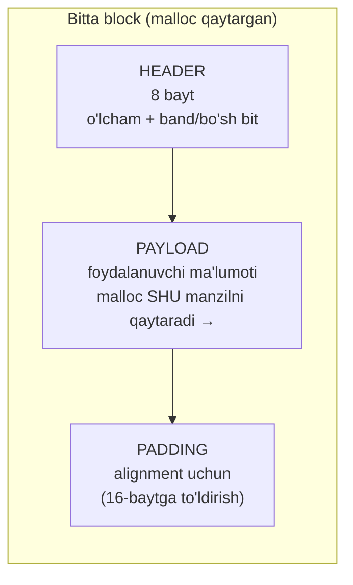
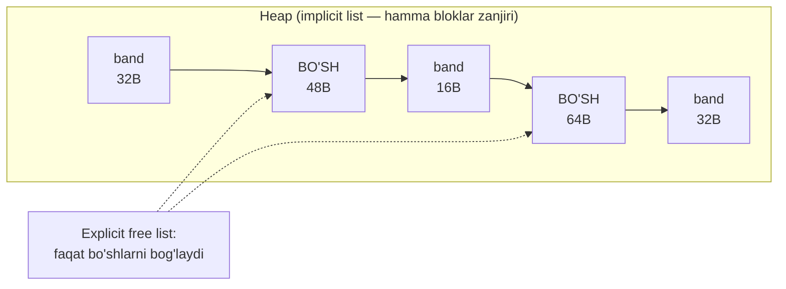
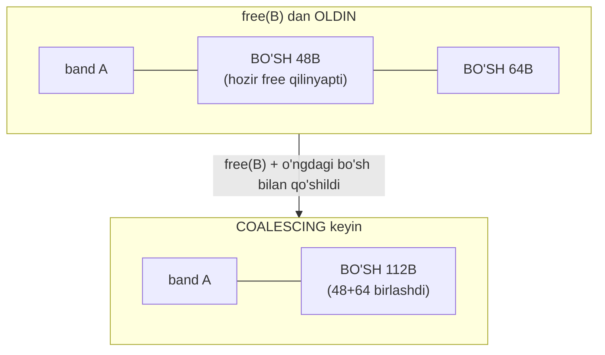
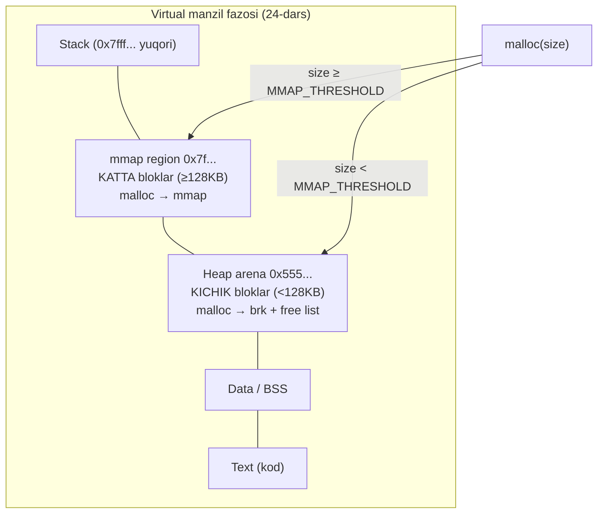
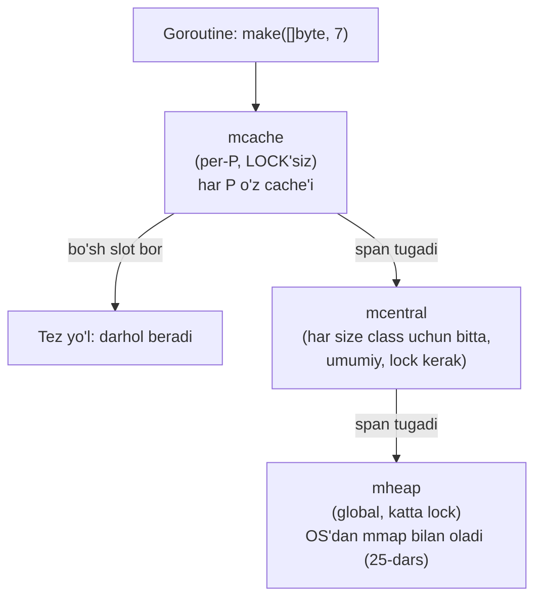

# 26. Dynamic Memory Allocation — malloc ichida nima bor

> Manba: CS:APP 2-nashr, 9.9 · Muhit: Ubuntu 24.04 x86-64 (Docker), gcc 13.3.0, go 1.22.2 · [← Oldingi](25-linux-memory-mmap.md) · [Kurs xaritasi](00-README.md) · [Keyingi →](27-garbage-collection.md)

## Nima uchun kerak

Sen har kuni `make([]byte, n)` yoki C'da `malloc(n)` yozasan, lekin kamdan-kam o'ylaysan: `malloc(100)` chaqirganda kompyuter aslida **112 bayt** oladi. Qayerdan qo'shimcha 12 bayt? Chunki har blok o'z **header**iga (o'lchamini yozib qo'yish) va **alignment**ga (16-baytga tekislash) ega. Bu darsda `malloc` va `free` ichida nima borligini ochamiz.

Bu bilim amaliy: uzoq ishlaydigan server minglab mayda allocatsiya qilsa, heap **fragmentatsiya**ga uchraydi — bo'sh joy bor, lekin ishlatib bo'lmaydi, natijada RSS (25-darsdagi rezident xotira) o'sadi. Go dasturchisiga bu ayniqsa muhim: Go allocator (tcmalloc naslidan) **per-P cache** tufayli lock'siz va tez, lekin uning ham o'z narxi bor — GC bosimi (27-darsda). Allocatsiya patternini tushunish — performance va xotira tejashning kaliti.

## Nazariya

### 1. Nega dinamik allocation

Ba'zan dastur yozilayotganda ma'lumot hajmi noma'lum bo'ladi: foydalanuvchi nechta qator kiritadi, fayl qancha katta, tarmoqdan qancha bayt keladi — buni faqat **run-time**da bilamiz. Stack'da bunday obyektni saqlab bo'lmaydi (stack hajmi cheklangan, funksiya qaytganda yo'qoladi). Shuning uchun **heap** kerak: run-time'da o'sadigan-kichrayadigan xotira sohasi. `malloc` heap'dan blok so'raydi, `free` qaytaradi.

Konkret misol: HTTP server so'rov tanasini (body) o'qiydi. Bir so'rov 200 bayt, boshqasi 2 megabayt bo'lishi mumkin. Kompilyatsiya paytida bu hajm noma'lum — faqat `Content-Length` kelganda ma'lum bo'ladi. Shu sabab buferni `make([]byte, contentLength)` bilan run-time'da ajratamiz. Bu — dinamik allocation'ning tipik holati: hajm ma'lumotga bog'liq, kodga emas.

### 2. Allocator vazifasi

**Allocator** (xotira taqsimlagich) — bu `malloc`/`free` ortidagi kutubxona kodi. Uning vazifasi: OS'dan olingan katta heap sohasini (25-darsdagi `brk`/`mmap` region) mayda bloklarga bo'lib berish. OS'ga har mayda so'rov uchun syscall qilish qimmat (21-darsdagi kontekst almashish), shuning uchun allocator OS'dan **ulgurji** oladi va ilovaga **chakana** ulashadi.

Allocator ikki asosiy operatsiyani bajaradi:

- `malloc(size)` — heap'dan `size` baytdan katta-teng bo'sh blok topib, uning **payload** (foydali qism) manzilini qaytaradi.
- `free(ptr)` — o'sha blokni "bo'sh" deb belgilaydi, keyingi so'rovda qayta ishlatish uchun.

Allocator qiyin cheklovlar ostida ishlaydi: so'rovlar **ixtiyoriy tartibda** keladi (`malloc`/`free` aralash), javob **darhol** kerak (so'rovni kechiktirib bo'lmaydi), band bloklarni **ko'chirib bo'lmaydi** (foydalanuvchi pointer ushlab turibdi) va faqat bo'sh xotira bilan ishlaydi. Shu cheklovlar ostida ikki qarama-qarshi maqsadni bir vaqtda quvadi:

| Maqsad | Nima | Qanday o'lchanadi |
|---|---|---|
| **Throughput** | Sekundiga qancha `malloc`/`free` bajariladi | operatsiya tezligi |
| **Utilization** | Heap qanchalik zich ishlatiladi (behuda kam) | peak payload / heap hajmi |

Bu ikkovi qarama-qarshi: best fit utilization'ni oshiradi lekin throughput'ni pasaytiradi (ko'p qidiruv); first fit teskari. Yaxshi allocator — muvozanat topgani.

### 3. Block strukturasi — header + payload + padding

Allocator har blokni shunday tashkil qiladi:



Diagrammadagi tartib muhim: `malloc` payload'ning boshini qaytaradi, header esa undan **oldinda** yashiringan — foydalanuvchi uni ko'rmaydi, lekin allocator har doim `ptr - 8` orqali unga yetadi.

- **Header** — blok boshidagi 8 bayt: blok o'lchami VA "band/bo'sh" bitini saqlaydi. `free(ptr)` qilinganda allocator `ptr` dan 8 bayt orqaga qarab header'ni topadi va o'lchamini biladi (sen `free` ga o'lcham bermaysan-ku!).
- **Payload** — sen ishlatadigan qism. `malloc` aynan shu manzilni qaytaradi.
- **Padding** — blokni 16-baytga tekislash uchun bo'sh joy (10-darsdagi alignment: SSE/SIMD instruksiyalar tekislangan manzil talab qiladi).

Shu sabab `malloc(100)` > 100 bayt: header (8) + payload (100) + padding = 112 bayt (keyingi blok 16-ga tekis boshlanishi uchun).

**Header nega ikki ma'lumotni bitta 8 baytga sig'diradi?** Hiyla oddiy: bloklar 16-baytga tekislanganligi uchun o'lcham HAR DOIM 16 ga karrali (masalan 112). Ya'ni o'lcham ikkilik sanoqda `...1110000` — eng pastki 4 bit har doim `0`. Bu bo'sh bitlar behuda turibdi, shuning uchun allocator ularni **bayroq** (flag) sifatida ishlatadi: eng pastki bit — `band/bo'sh` holati. `size | 1` — band, `size | 0` — bo'sh. O'lchamni o'qish uchun `header & ~0xF` (pastki bitlarni tozalash), holatni o'qish uchun `header & 1`. Bitta 8 bayt — ikki vazifa.

### 4. Free list — bo'sh bloklar ro'yxati

Allocator qaysi bloklar bo'shligini qandaydir eslab qolishi kerak. Bu ma'lumot strukturasi — **free list**.

| Tur | Qanday ishlaydi | Tezlik |
|---|---|---|
| **Implicit free list** | Barcha bloklar (band+bo'sh) header orqali zanjir; bo'sh blok topish uchun BUTUN heap'ni skanerlash | Sekin: O(band+bo'sh) |
| **Explicit free list** | Faqat BO'SH bloklar ikki tomonlama bog'langan ro'yxatda (next/prev payload ichida saqlanadi) | Tez: O(bo'sh) |



Ko'p real allocatorlar (glibc, tcmalloc) bundan ham tezroq: har o'lcham uchun alohida free list (**segregated / size class**, pastda).

**Implicit list qanday yuriladi?** Har blok header'ida o'lcham bor. Keyingi blok manzili = joriy blok manzili + joriy o'lcham. Shunday qilib allocator heap boshidan oxirigacha "sakrab" o'tadi, band bloklarni o'tkazib, birinchi yetarli bo'sh blokni topguncha. Muammo: bu O(barcha bloklar) — heap katta bo'lsa, har `malloc` sekinlashadi. **Explicit list** faqat bo'sh bloklarni ko'radi, shu sabab band bloklar ko'p bo'lsa keskin tezroq. Payload band bo'lmaganda bekor turibdi — allocator o'sha bo'sh payload ichiga `next`/`prev` pointer'larini yashiradi (bo'sh blokda ma'lumot yo'q, joyni tekinga ishlatish mumkin).

### 5. Allocatsiya strategiyalari

`malloc(size)` free list'dan qaysi bo'sh blokni tanlaydi?

- **First fit** — birinchi yetarli blokni oladi. Tez, lekin ro'yxat boshida mayda "chiqindilar" yig'iladi.
- **Best fit** — eng mos (eng kichik yetarli) blokni oladi. Kam fragmentatsiya, lekin sekin (butun ro'yxatni ko'rish kerak).
- **Next fit** — first fit, lekin qidiruvni oxirgi to'xtagan joydan davom ettiradi.

Bu klassik trade-off: tezlik ↔ fragmentatsiya.

Yana bir muhim qaror — **splitting** (bo'lish): agar 100B so'rovga 512B bo'sh blok topilsa, allocator uni ikkiga bo'ladi — 112B beradi, qolgan ~400B ni yangi bo'sh blok qilib free list'ga qaytaradi. Agar bo'lmasa, 512B ning hammasi 100B so'rovga ketib, ~400B internal fragmentation'ga aylanardi. Aksincha, ortiqcha qism juda kichik bo'lsa (masalan 8B) — bo'lish foydasiz, chunki 8B blokka header'ning o'zi sig'maydi. Shunday hollarda allocator butun blokni beradi (kichik internal frag'ga rozi bo'ladi).

### 6. Coalescing — qo'shni bo'sh bloklarni birlashtirish

Muammo: ikki qo'shni bo'sh blok (masalan 48B + 64B) alohida tursa, allocator 100B so'rovni bajarolmaydi — garchi jami 112B bo'sh bo'lsa ham! Bu **false fragmentation**. Yechim: `free` qilinganda qo'shni bo'sh bloklarni **birlashtirish** (coalesce) — bitta katta 112B blok hosil qilish.



Lekin muammo: `free` qilingan blokdan **oldingi** blok bo'shmi? Uni topish uchun orqaga yurish kerak, header esa faqat oldinda. Yechim — **boundary tags** (chegara teglari): har blok oxiriga header'ning nusxasi — **footer** qo'yiladi. Keyingi blok o'z oldidagi footer'ni o'qib, oldingi blok o'lchamini va bo'sh-band holatini biladi. Shunday qilib ikki tomonlama coalescing O(1) da bajariladi.

**Coalescing'ning 4 holati.** `free(B)` qilinganda allocator B ning ikki qo'shnisini (oldingi va keyingi) tekshiradi. To'rt kombinatsiya bor:

| Holat | Oldingi | Keyingi | Nima bo'ladi |
|---|---|---|---|
| 1 | band | band | Coalescing yo'q — B shunchaki bo'sh deb belgilanadi |
| 2 | band | **bo'sh** | B + keyingi birlashadi (o'ngga o'sish) |
| 3 | **bo'sh** | band | oldingi + B birlashadi (chapga o'sish) |
| 4 | **bo'sh** | **bo'sh** | uch blok bitta katta blokka birlashadi |

Boundary tag'siz 3 va 4-holatlarni bajarib bo'lmaydi — oldingi blok header'iga yetib borishning yagona yo'li footer orqali. Bu — CS:APP 9.9.11-12 ning markaziy g'oyasi.

### 7. Fragmentation — internal vs external

Bu ikkovini aralashtirmaslik muhim:

| Tur | Ta'rifi | Misol |
|---|---|---|
| **Internal fragmentation** | Blok ICHIDAGI behuda joy | `malloc(100)` → 112B blok: header + padding = 12B behuda. Go'da `make([]byte,7)` → 8B size class: 1B behuda |
| **External fragmentation** | Bloklar ORASIDAGI teshiklar: jami bo'sh yetarli, lekin uzluksiz emas | 500 ta 128B teshik = 64KB bo'sh, lekin 256B uzluksiz blok yo'q |

Internal — har doim ma'lum (allocatsiya paytida), external — kelajakdagi so'rovlarga bog'liq, oldindan bilib bo'lmaydi. Coalescing external fragmentation'ga qarshi asosiy qurol.

**Raqamda ko'raylik (Demo 2 asosida).** 1000 ta 128B blok ajratdik = ~128KB payload. Har ikkinchisini bo'shatdik → 71KB band, 192KB bo'sh, jami arena 264KB. Diqqat: band payload atigi 71KB, lekin allocator OS'dan 264KB olgan — **utilization ~27%**. Nega shunchalik past? Ikki sabab: (1) internal fragmentation — har 128B blokka header qo'shildi; (2) external fragmentation — bo'shatilgan bloklar coalesce bo'lmadi (orasida band bloklar), shuning uchun 192KB "muzlab" qoldi. Bu — uzoq ishlovchi serverda RSS'ning nega haqiqiy ma'lumotdan katta bo'lib ketishining asl sababi.

### 8. brk vs mmap — kichik vs katta

glibc malloc bloklarni ikki manbadan oladi (25-dars):

- **Kichik bloklar** (< `MMAP_THRESHOLD`, odatda 128KB) — **arena**dan (heap sohasi, `brk` bilan kengaytiriladi). Past manzil (`0x5555...`).
- **Katta bloklar** (≥ 128KB) — to'g'ridan-to'g'ri **`mmap`** bilan. Yuqori manzil (`0x7fff...`, mmap region).

Nega? Katta blokni `free` qilganda uni darhol OS'ga qaytarish oson (`munmap`) — RSS pasayadi. Kichik bloklar uchun har biriga syscall qilish qimmat, shuning uchun ular arena'da yig'iladi va qayta ishlatiladi.

### 9. Bir tsikl — `p = malloc(100); free(p)` ichkarida

Endi barcha qismlarni birlashtiraylik. `malloc(100)` chaqirganda allocator quyidagilarni bajaradi:

1. So'ralgan 100 baytga header (8B) qo'shib, 16-baytga yaxlitlaydi → 112B kerak.
2. Free list'dan 112B (yoki katta) bo'sh blok qidiradi (first/best fit).
3. Topilgan blok ancha katta bo'lsa — **split** qiladi: 112B ajratadi, qolganini bo'sh blok qilib qoldiradi.
4. Blok header'iga o'lcham + "band" bitini yozadi (`112 | 1`).
5. Payload manzilini (header'dan 8B keyin) qaytaradi.

`free(p)` esa:

1. `p - 8` dan header'ni o'qib, blok o'lchamini biladi.
2. Header'da "bo'sh" bitini yoqadi (`112 | 0`).
3. Boundary tag orqali chap va o'ng qo'shnilarni tekshiradi; bo'sh bo'lsa — **coalesce** qiladi.
4. Yakuniy bo'sh blokni free list'ga qo'yadi (keyingi `malloc` uchun tayyor).



## Kod va isbot

### Demo 1 — Block header + alignment + free list qayta ishlatish

```c
#include <stdio.h>
#include <stdlib.h>

int main(void)
{
    void *a = malloc(100);
    void *b = malloc(100);
    void *c = malloc(100);
    printf("a=%p b=%p c=%p\n", a, b, c);
    printf("b-a=%ld bayt (100 so'radik, header+alignment bilan)\n", (char*)b-(char*)a);

    free(b);                          /* b bo'shatildi */
    void *d = malloc(100);            /* xuddi shu o'lcham */
    printf("free(b) keyin malloc(100)=%p (b bilan bir xilmi? %s)\n",
           d, d == b ? "HA - qayta ishlatildi" : "yo'q");

    free(a); free(c); free(d);
    return 0;
}
```

Output:

```
a=0x5555555592a0 b=0x555555559310 c=0x555555559380
b-a=112 bayt (100 so'radik, header+alignment bilan)
free(b) keyin malloc(100)=0x555555559310 (b bilan bir xilmi? HA - qayta ishlatildi)
```

**Notional machine — nima sodir bo'ldi:**

- `b - a = 112`. Biz 100 bayt so'radik, lekin ketma-ket bloklar orasi 112 bayt. Ortiqcha 12 bayt = **header** (blok o'lchami/holati) + **alignment** padding. Allocator har blokni 16-baytga tekislaydi: 100 → yuqoriga yaxlitlab 112.
- `free(b)` chaqirilganda allocator `b` manzilidan 8 bayt orqaga qarab header'ni topadi, "bo'sh" bitini yoqadi va blokni **free list**ga qo'yadi.
- Keyingi `malloc(100)` xuddi shu o'lchamni so'raganda, allocator free list'dan **aynan o'sha blok**ni (`0x...310 == b`) topib qaytaradi. Bu allocator'ning yuragi: bo'sh bloklarni yuritish va qayta ishlatish. Yangi joy OS'dan so'ralmadi.

> Oltin qoida: `malloc(n)` senga `n` bayt beradi, lekin heap'dan `n` dan KO'P oladi — header + alignment ustma-ust qo'shiladi.

### Demo 2 — Fragmentation: teshikli heap

```c
#include <stdio.h>
#include <stdlib.h>
#include <malloc.h>

int main(void)
{
    void *ptrs[1000];
    for (int i = 0; i < 1000; i++) ptrs[i] = malloc(128);
    /* Har ikkinchisini bo'shatamiz - "teshikli" heap */
    for (int i = 0; i < 1000; i += 2) free(ptrs[i]);

    struct mallinfo2 mi = mallinfo2();
    printf("Jami heap (arena):  %zu KB\n", mi.arena/1024);
    printf("Ishlatilayotgan:    %zu KB (uordblks: band bloklar)\n", mi.uordblks/1024);
    printf("Bo'sh (fordblks):   %zu KB (fragmentatsiya - teshiklar)\n", mi.fordblks/1024);

    for (int i = 1; i < 1000; i += 2) free(ptrs[i]);
    return 0;
}
```

Output:

```
Jami heap (arena):  264 KB
Ishlatilayotgan:    71 KB (uordblks: band bloklar)
Bo'sh (fordblks):   192 KB (fragmentatsiya - teshiklar)
```

**Notional machine — external fragmentation ko'zga ko'rinadi:**

- 1000 blok ajratdik, har ikkinchisini bo'shatdik → heap "shanadek teshikli": band, bo'sh, band, bo'sh...
- `fordblks` = 192 KB bo'sh. Katta ko'rinadi! Lekin bu 192 KB **500 ta alohida 128B teshikka** tarqalgan.
- Endi 256 baytlik uzluksiz blok so'rasak: jami bo'sh joy (192KB) yetarli, LEKIN uzluksiz 256B teshik YO'Q (har biri atigi 128B, orasida band bloklar). Allocator OS'dan yangi joy so'rashga majbur → heap yanada o'sadi.

Bu **external fragmentation**: bo'sh xotira bor, ammo foydalanib bo'lmaydi. Solishtir: Demo 1'dagi 12 bayt behuda — bu **internal fragmentation** (blok ichida). Coalescing bu yerda yordam bermaydi, chunki teshiklar orasida band bloklar turibdi.

### Demo 3 — brk vs mmap: kichik heap'da, katta mmap'da

```c
#include <stdio.h>
#include <stdlib.h>
int main(void)
{
    void *small = malloc(100);           /* brk/heap arena'dan */
    void *big = malloc(200*1024);        /* > 128KB -> mmap (MMAP_THRESHOLD) */
    printf("small (100 B):   %p\n", small);
    printf("big (200 KB):    %p\n", big);
    printf("farq: small heap'da (past), big mmap region'da (yuqori, 0x7f...)\n");
    free(small); free(big);
    return 0;
}
```

Output:

```
small (100 B):   0x5555555592a0
big (200 KB):    0x7fffff57b010
printf farq qatori...
```

**Notional machine — ikki manba arxitekturasi:**

- `small` manzili `0x5555...` — bu heap **arena** sohasi, past manzillarda (24-darsdagi jarayon layout'i). Bu blok `brk` bilan kengaytirilgan heap'dan olingan.
- `big` manzili `0x7fffff...` — bu **mmap region**, yuqori manzillarda (25-dars). 200KB > 128KB (`MMAP_THRESHOLD`), shuning uchun malloc uni to'g'ridan-to'g'ri `mmap` syscall bilan oldi.
- Nega ikki xil? Katta blok `free` qilinganda `munmap` bilan darhol OS'ga qaytariladi — RSS pasayadi. Kichik bloklar uchun har biriga syscall qilish qimmat (21-dars), shuning uchun ular arena'da yig'iladi va free list orqali qayta ishlatiladi.

### Demo 4 — Go allocator: size class'lar (tcmalloc nasli)

```go
package main

import (
	"fmt"
	"runtime"
)

var sink [][]byte // global - allocatsiyani heap'ga majburlaydi (escape)

func main() {
	var m runtime.MemStats
	runtime.ReadMemStats(&m)
	before := m.Mallocs

	sink = make([][]byte, 0, 100000)
	for i := 0; i < 100000; i++ {
		sink = append(sink, make([]byte, 7)) // 7 bayt -> 8 baytlik size class
	}

	runtime.ReadMemStats(&m)
	fmt.Println("Go allocator (tcmalloc nasli, size class'lar):")
	fmt.Printf("  100000 ta make([]byte,7) -> yangi mallocs: %d\n", m.Mallocs-before)
	fmt.Printf("  Jonli obyektlar: %d\n", m.Mallocs-m.Frees)
	fmt.Printf("  HeapAlloc: %d KB\n", m.HeapAlloc/1024)
	runtime.KeepAlive(sink)
}
```

Output:

```
Go allocator (tcmalloc nasli, size class'lar):
  100000 ta make([]byte,7) -> yangi mallocs: 100001
  Jonli obyektlar: 50074
  HeapAlloc: 3238 KB
```

**Notional machine — Go allocator C malloc'dan qanday farq qiladi:**

- `make([]byte, 7)` 7 bayt so'radi, lekin Go uni **8 baytlik size class**ga yaxlitladi (internal fragmentation, lekin free list boshqaruvi juda tez).
- 100001 malloc — har `make` heap'ga tushdi, chunki `sink` global (13-darsdagi escape analysis: obyekt funksiyadan "qochib chiqadi" → stack'da qololmaydi → heap).
- Jonli obyektlar 50074, HeapAlloc 3238 KB — bular ancha kam, chunki tsikl davomida GC ishlab, endi yashamaydigan oraliq obyektlarni tozalab turdi (27-dars).
- Bu 100000 `make` chaqiruvi mcache orqali **lock'siz** bajarildi: har 8B blok P ning lokal span'idagi bitmap'dan bo'sh slot oldi. mcache tugagandagina mcentral'ga (lock bilan) murojaat qilindi — shuning uchun umumiy tezlik yuqori.
- Agar `sink` global bo'lmaganda edi, escape analysis bu slice'larni stack'da qoldirar va `Mallocs` deyarli o'zgarmasdi. Global `sink` obyektlarni "heap'ga qochish"ga majbur qildi (13-dars) — shu sabab 100001 malloc.

## Go dasturchiga ko'prik

Go allocator — Google'ning **tcmalloc**idan (Thread-Caching Malloc) ilhomlangan. Uni tushunish backend performance uchun kritik.

**Ko'p bosqichli cache ierarxiyasi:**



- **Size class'lar** — Go ~67 ta oldindan belgilangan o'lcham ishlatadi (8, 16, 24, 32, 48, 64... 32KB gacha). Har so'rov eng yaqin size class'ga yaxlitlanadi. Bu internal fragmentation keltiradi, lekin free list boshqaruvi juda tez (o'lchamni qidirish shart emas). Bir nechta namuna:

| So'ralgan hajm | Size class | Behuda (internal frag) |
|---|---|---|
| 1 bayt | 8 | 7 bayt |
| 7 bayt | 8 | 1 bayt |
| 9 bayt | 16 | 7 bayt |
| 33 bayt | 48 | 15 bayt |
| 100 bayt | 112 | 12 bayt |
| 32 KB dan katta | to'g'ridan-to'g'ri mheap'dan sahifalar | — |
- **mcache (per-P cache)** — har mantiqiy protsessor (P) o'z lokal cache'iga ega. Kichik allocatsiya **lock'siz** bajariladi — goroutine'lar orasida contention yo'q (33-darsdagi concurrency). Bu tcmalloc'ning asosiy g'oyasi: sinxronizatsiya hodisalarini kamaytirish.
- **mcentral → mheap** — mcache tugasa, mcentral'dan yangi **span** (bir xil size class bloklaridan iborat sahifa) oladi; u ham tugasa, mheap OS'dan `mmap` bilan yangi joy so'raydi.
- **Tiny allocator** — < 16 baytli, pointer'siz obyektlarni (masalan mayda stringlar) bitta 16B blokka **birlashtirib** joylaydi. Bu tcmalloc'da yo'q, Go'ning o'ziga xos optimizatsiyasi.
- **Manual `free` YO'Q** — Go'da sen `free` chaqirmaysan; obyektni **GC** (27-dars) yig'ishtiradi. Bu qulay, lekin narxi bor: GC ishlashi CPU va latency oladi.
- **Escape analysis (13-dars)** — agar obyekt funksiyadan qochib chiqmasa, u **stack**da qoladi va allocator umuman chaqirilmaydi — eng tez yo'l. `go build -gcflags=-m` bilan tekshir.
- **sync.Pool** — allocatsiyani qayta ishlatish uchun (bufferlar, oraliq obyektlar), GC bosimini keskin kamaytiradi. `bytes.Buffer`, JSON decode kabi hot path'larda.

**span nima?** span — mheap dan olingan uzluksiz sahifalar to'plami (8KB ning karrasi), bitta size class'ning bloklariga bo'lingan. Masalan 32-baytli size class span'i 256 ta 32B slotdan iborat. mcache har size class uchun bittadan **span**ni cache qiladi; slot band-bo'shligini **bitmap** orqali kuzatadi. Bo'sh slot topish — bitmap'da bitni qidirish (juda tez, lock'siz). Go'da span'ning yana pointer'li va pointer'siz varianti bor (jami ~134 span class), bu GC skanerlashni tezlashtiradi: pointer'siz span'ni GC umuman kezmaydi.

**sync.Pool amalda qanday tejaydi** — g'oya oddiy: `Get()` pool'dan tayyor obyekt beradi (yo'q bo'lsa `New` funksiyasi bilan yaratadi), ishlatib bo'lgach `Put()` qaytaradi. Har so'rovda `make([]byte, 4096)` chaqirish o'rniga bir marta ajratilgan buffer aylanaveradi: `Get` yangi allocatsiya emas, qayta ishlatilgan slot beradi; `Put(buf[:0])` esa uni GC ko'zidan yashirib keyingi `Get` uchun saqlaydi. Natijada allocator umuman chaqirilmaydi va GC'ga ish qolmaydi. Muhim ogohlantirish: `sync.Pool` GC paytida tozalanishi mumkin — u kafolatli cache emas, faqat "yaqin kelajakda kerak bo'ladigan" obyektlar uchun mo'ljallangan.

**Qisqa taqqoslash — C malloc vs Go allocator:**

| Xususiyat | C (glibc malloc) | Go allocator |
|---|---|---|
| Bo'shatish | qo'lda `free` | avtomatik GC (27-dars) |
| Struktura | arena + free list (bin'lar) | mcache → mcentral → mheap |
| Lock | arena per-thread, lekin lock bor | mcache lock'siz (per-P) |
| Size class | bin'lar (fastbin, smallbin...) | ~67 size class + span |
| Kichik vs katta | brk vs mmap (128KB) | span vs to'g'ridan mheap (32KB) |
| Stack optimizatsiyasi | yo'q (dasturchi hal qiladi) | escape analysis avtomatik (13-dars) |

**Allocatsiyani kamaytirish — amaliy retseptlar (backend hot path):**

- **Preallocate slice** — hajm taxminan ma'lum bo'lsa `make([]T, 0, N)`. `append` har o'sishda qayta allocatsiya + nusxa qiladi; sig'imni oldindan bersang bu yo'qoladi.
- **strings.Builder** — string'larni `+` bilan ulash har safar yangi string ajratadi (string immutable). `strings.Builder` bitta o'sib boruvchi buferga yozadi.
- **[]byte reuse** — `bytes.Buffer.Reset()` yoki `buf[:0]` bilan bir buferni qayta ishlat, har so'rovda yangi `make` qilma.
- **sync.Pool** — qisqa umrli, ammo tez-tez kerak bo'ladigan obyektlar uchun (bufferlar, encoder'lar).
- **interface{}/any dan qoch** — mayda qiymatni `interface{}` ga solish uni heap'ga "box" qiladi (escape). Aniq tip ishlatilsa stack'da qoladi.
- **pprof bilan o'lchash** — taxmin qilma; `go test -bench -benchmem` va `alloc_space` profili bilan haqiqiy aybdorni top.

## Real-world scenariylar

**1. Hot path'da ko'p mayda allocatsiya.** Har HTTP so'rovda bir nechta mayda struct/slice yaratsang, minglab RPS'da GC bosimi va fragmentatsiya oshadi. Yechim: `sync.Pool` bilan obyektlarni qayta ishlatish yoki slice'ni oldindan `make([]T, 0, N)` bilan preallocate qilish — reallocatsiya va nusxa ko'chirishni kamaytiradi.

**2. `[]byte` buffer reuse.** Har so'rovda yangi buffer o'rniga `bufio` yoki `sync.Pool`dan olingan bufferni ishlat. `bytes.Buffer.Reset()` bilan tozalab qayta ishlat — allocator umuman chaqirilmaydi, GC ishlamaydi.

**3. Fragmentation uzoq ishlovchi serverda RSS'ni oshiradi.** C serveri (masalan Redis) kunlab ishlaganda glibc malloc external fragmentation to'playdi — RSS haqiqiy ma'lumotdan katta bo'lib ketadi. Yechim: `LD_PRELOAD` bilan (20-darsdagi dinamik linking) allocator'ni **jemalloc** yoki **tcmalloc**ga almashtirish. Redis rasman jemalloc'ni tavsiya qiladi aynan shu sabab.

**4. Go'da "false sharing" emas, allocatsiya profili.** Agar servisning latency'si tishlab-tishlab o'ssa (GC pauza), sabab ko'pincha allocatsiya tezligi. `go tool pprof` ning `alloc_objects` va `alloc_space` profillari qaysi funksiya eng ko'p allocatsiya qilayotganini ko'rsatadi. Odatiy aybdorlar: string konkatenatsiya (`+` o'rniga `strings.Builder`), `interface{}` ga boxing (mayda qiymatlar heap'ga qochadi), va slice'ni preallocate qilmaslik (`append` har o'sishda qayta allocatsiya + nusxa). Bularni bartaraf etish GC bosimini keskin kamaytiradi.

## Zamonaviy yondashuv

CS:APP'dagi implicit free list — o'quv modeli. Zamonaviy allocatorlar ancha murakkab, lekin bitta umumiy retseptga tayanadi: **size class + per-thread cache + arena**.

- **tcmalloc (Google)** — thread/CPU-lokal cache, har size class uchun bitta bog'langan ro'yxat. Ko'p yadroli serverlarda contention'ni 10-100x kamaytiradi.
- **jemalloc (Facebook/FreeBSD)** — thread'larni **arena**larga round-robin taqsimlaydi; size class'larni internal fragmentation minimal bo'ladigan qilib tanlaydi (2 darajasiga yaxlitlamaydi — bu 50% gacha behuda bo'lardi).
- **mimalloc (Microsoft)** — free list sharding, juda past latency.
- **glibc malloc (ptmalloc)** — har thread'ga arena, lekin ko'p yadroda tcmalloc/jemalloc'dan sekinroq.
- **Go/Rust/Java** — o'z allocatorlariga ega. Go tcmalloc nasli + GC; Rust'da global allocator almashtirilishi mumkin.

Umumiy g'oya: **allocatsiya endi global qulf ostidagi bitta free list emas** — u thread-lokal, size-class asosidagi, contention'siz tizim. `LD_PRELOAD=/usr/lib/libjemalloc.so ./server` bilan kodni o'zgartirmasdan almashtirib, RSS va P99 latency'ni o'lchab ko'r.

| Allocator | Muallif | Kuchli tomoni |
|---|---|---|
| **ptmalloc** | glibc (default) | universal, lekin ko'p yadroda sekinroq |
| **tcmalloc** | Google | per-CPU cache, past latency, katta serverlar |
| **jemalloc** | Facebook/FreeBSD | past fragmentation, arena, profiling |
| **mimalloc** | Microsoft | free list sharding, juda tez |
| **Go runtime** | Go jamoasi | tcmalloc nasli + GC + escape analysis |

Amaliy maslahat: xotira ko'p ishlatadigan uzoq ishlovchi C/C++ serverni jemalloc yoki tcmalloc'ga o'tkazish ko'pincha kodni o'zgartirmasdan RSS'ni 20-40% kamaytiradi va P99 latency'ni yaxshilaydi — chunki default ptmalloc fragmentation'ni yomon boshqaradi.

## Keng tarqalgan xatolar

1. **"`malloc(n)` aynan `n` bayt oladi"** — Yo'q. Header (8B) + alignment padding qo'shiladi. `malloc(100)` → 112B (Demo 1). Go'da `make([]byte, 7)` → 8B size class. Xotira budjetini hisoblaganda buni unutma.
2. **Ko'p mayda allocatsiya zararsiz deb o'ylash** — Har mayda `malloc`/`make` header oladi (internal frag), free list'ni to'ldiradi (external frag), Go'da GC bosimini oshiradi. Bitta katta blokni bo'lib ishlatish yoki `sync.Pool` afzal.
3. **Fragmentation'ni e'tiborsiz qoldirish** — Uzoq ishlovchi server "xotira sizmoqda" ko'rinadi, aslida external fragmentation. RSS o'sadi (25-dars), lekin heap profildan ko'rinmaydi. jemalloc/tcmalloc bilan hal bo'ladi.
4. **Go'da har so'rovda yangi buffer** — Hot path'da `make([]byte, N)` o'rniga `sync.Pool` yoki `bytes.Buffer.Reset()`. Aks holda GC minglab qisqa umrli obyektni tozalashga majbur.
5. **"`free` darhol OS'ga xotira qaytaradi"** — Yo'q. Kichik bloklar arena'da qoladi (free list), OS'ga qaytarilmaydi (Demo 3). Faqat katta `mmap` bloklari `munmap` bilan darhol qaytadi. Go'da `free` umuman yo'q — GC + `runtime.GC()`/scavenger sekin qaytaradi.
6. **"Size class internal fragmentation yomon, undan qochish kerak"** — Aksincha, bu ataylab qilingan kelishuv. Bir necha bayt behuda ketadi, lekin evaziga free list boshqaruvi O(1) va lock'siz bo'ladi (o'lchamni qidirish, splitting, coalescing shart emas). Ko'p yadroli serverda bu almashuv juda foydali — throughput fragmentation'dan muhimroq.
7. **"Go'da allocatsiya bepul, GC hammasini hal qiladi"** — Har allocatsiya GC'ga kelajakda ish qo'shadi. Ko'p mayda allocatsiya = tez-tez GC = CPU va latency. Eng tez allocatsiya — umuman qilinmagani (escape analysis stack'da qoldirsa).

## Amaliy mashqlar

**1. (Oson)** `malloc(100)` nega 112 bayt oladi? 12 baytning taqsimoti qanday?

<details><summary>Yechim</summary>
Header (8 bayt: blok o'lchami + band/bo'sh bit) + alignment padding. Payload 100 + header 8 = 108, keyingi blok 16-baytga tekis boshlanishi uchun 112 ga yaxlitlandi. Ya'ni 8B header + 4B padding = 12B internal fragmentation.
</details>

**2. (Oson)** Demo 1'da `free(b)` dan keyingi `malloc(100)` nega AYNAN `b` manzilini qaytardi?

<details><summary>Yechim</summary>
`free(b)` blokni free list'ga qo'ydi. Keyingi `malloc(100)` xuddi shu o'lchamni so'raganda, allocator free list'dan mos blokni (aynan b) topib qaytardi. Yangi joy OS'dan so'ralmadi — bu allocator'ning qayta ishlatish mexanizmi.
</details>

**3. (O'rta)** Demo 2'da 192KB bo'sh, lekin 256B uzluksiz blok so'rasak fail bo'ladi. Nega? Bu qaysi fragmentation?

<details><summary>Yechim</summary>
External fragmentation. 192KB bo'sh joy 500 ta alohida 128B teshikka tarqalgan; orasida band bloklar bor. 256B uzluksiz teshik yo'q, coalescing ham yordam bermaydi (qo'shni teshiklar band bloklar bilan ajratilgan). Allocator OS'dan yangi joy so'raydi.
</details>

**4. (O'rta)** Demo 3'da `big` (200KB) nega `0x7fff...` da, `small` (100B) nega `0x5555...` da?

<details><summary>Yechim</summary>
200KB > MMAP_THRESHOLD (128KB) → malloc uni to'g'ridan-to'g'ri mmap bilan oldi (mmap region, yuqori manzil). 100B < threshold → heap arena'dan (brk bilan kengaytirilgan, past manzil). Katta blok free qilinganda munmap bilan darhol OS'ga qaytadi.
</details>

**5. (O'rta)** Go'da `make([]byte, 7)` nega 8 baytlik size class'ga tushadi? Bu qaysi fragmentation?

<details><summary>Yechim</summary>
Go ~67 ta oldindan belgilangan size class ishlatadi (8, 16, 24...). 7 bayt eng yaqin katta class — 8 ga yaxlitlanadi. 1 bayt behuda = internal fragmentation. Buning evaziga free list boshqaruvi juda tez (o'lchamni qidirish shart emas).
</details>

**6. (O'rta)** Coalescing nima hal qiladi? Boundary tag nega kerak?

<details><summary>Yechim</summary>
Coalescing qo'shni bo'sh bloklarni birlashtirib external (false) fragmentation'ni kamaytiradi. Boundary tag (blok oxiridagi footer — header nusxasi) keyingi blokka o'zidan OLDINGI blok o'lchami/holatini bilishga imkon beradi, shu bilan ikki tomonlama coalescing O(1) da bajariladi.
</details>

**7. (Qiyin)** Go serverida hot path har so'rovda `make([]byte, 4096)` qiladi, GC bosimi yuqori. Ikki yechim taklif qil.

<details><summary>Yechim</summary>
(1) `sync.Pool` — bufferlarni qayta ishlat: `p.Get().([]byte)`, ishlatib bo'lgach `p.Put(b)`. Allocatsiya va GC bosimi keskin kamayadi. (2) Buffer'ni struct maydonida saqlab `[:0]` bilan reset qilib qayta ishlatish (agar so'rovlar ketma-ket bo'lsa). Bonus: escape analysis (`-gcflags=-m`) bilan tekshirib, iloji bo'lsa stack'da qoldirish.
</details>

**8. (O'rta)** Best fit utilization'ni yaxshilaydi, lekin nega throughput'ni pasaytiradi? First fit teskarisini tushuntir.

<details><summary>Yechim</summary>
Best fit eng mos blokni topish uchun butun free list'ni ko'rib chiqishga majbur — har `malloc` sekinroq (past throughput), lekin ortiqcha kam qoladi (yuqori utilization). First fit birinchi yetarli blokda to'xtaydi — tez (yuqori throughput), lekin ro'yxat boshida mayda "chiqindilar" yig'iladi, utilization pasayadi. Bu allocator dizaynining asosiy trade-off'i.
</details>

**9. (Qiyin)** Coalescing'ning 4 holatidan qaysilari boundary tag'siz ishlamaydi va nega?

<details><summary>Yechim</summary>
3-holat (oldingi bo'sh) va 4-holat (ikkala qo'shni bo'sh). Sabab: oldingi blok header'iga faqat undan oldingi footer orqali yetib boriladi — heap'da orqaga yurishning boshqa yo'li yo'q (header faqat blok boshida). Boundary tag (footer = header nusxasi) bo'lmasa, `free` qilingan blok o'zidan oldingi blok bo'sh-band ekanini bilolmaydi va chapga coalesce qilolmaydi.
</details>

## Cheat sheet

| Tushuncha | Nima | Eslab qolish |
|---|---|---|
| **malloc / free** | Heap'dan blok olish / qaytarish | free list orqali qayta ishlatiladi |
| **Block** | header + payload + padding | `malloc(100)` → 112B |
| **Header** | Blok o'lchami + band/bo'sh bit (8B) | `free` uni ptr-8'dan topadi |
| **Alignment** | Payload 16-baytga tekislanadi | SIMD/SSE talabi (10-dars) |
| **Free list** | Bo'sh bloklar ro'yxati | implicit (skan) vs explicit (bog'langan) |
| **First fit** | Birinchi yetarli blok | tez, mayda chiqindi |
| **Best fit** | Eng mos blok | kam frag, sekin |
| **Splitting** | Katta blokni bo'lib, ortiqchani qaytarish | internal frag'ni kamaytiradi |
| **Coalescing** | Qo'shni bo'sh bloklarni birlashtirish | false frag'ga qarshi |
| **Throughput / Utilization** | Tezlik / zichlik | best fit vs first fit trade-off |
| **span** | Bir size class bloklaridan iborat sahifalar | mcache bitmap bilan slot beradi |
| **Boundary tag** | Footer = header nusxasi | orqaga coalescing O(1) |
| **Internal frag** | Blok ICHIDA behuda | header + padding + size class |
| **External frag** | Bloklar ORASIDA teshiklar | bo'sh bor, uzluksiz yo'q |
| **brk vs mmap** | Kichik arena vs katta mmap | MMAP_THRESHOLD = 128KB |
| **Go size class** | ~67 ta oldindan belgilangan o'lcham | 7B → 8B class |
| **mcache/mcentral/mheap** | per-P cache → umumiy → global | mcache lock'siz (33-dars) |
| **tcmalloc/jemalloc** | Zamonaviy allocatorlar | size class + thread cache |
| **sync.Pool** | Allocatsiyani qayta ishlatish | GC bosimini kamaytiradi |

## Qo'shimcha manbalar

- [TCMalloc Design — Google](https://google.github.io/tcmalloc/design.html) — thread-caching, size class'lar rasmiy hujjati
- [A visual guide to Go Memory Allocator — Ankur Anand](https://medium.com/@ankur_anand/a-visual-guide-to-golang-memory-allocator-from-ground-up-e132258453ed) — mcache/mcentral/mheap vizual tushuntirish
- [CMU 15-213 Dynamic Memory Allocation (PDF)](https://www.cs.cmu.edu/afs/cs/academic/class/15213-s12/www/lectures/18-allocation-basic-1up.pdf) — CS:APP 9.9 asosidagi ma'ruza

> Keyingi dars (27): band bloklar qachon "axlat"ga aylanadi va GC ularni qanday topib bo'shatadi — hamda `double free`, `use-after-free`, `memory leak` kabi xotira xatolari. Bu darsdagi block/header/free list bilimi o'sha yerda to'g'ridan-to'g'ri kerak bo'ladi.
