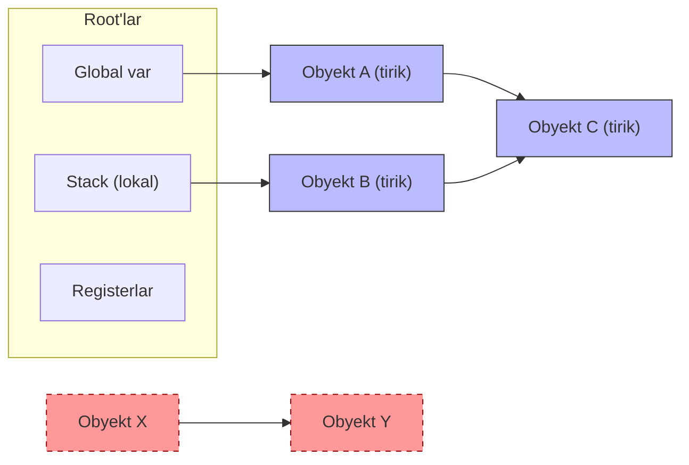
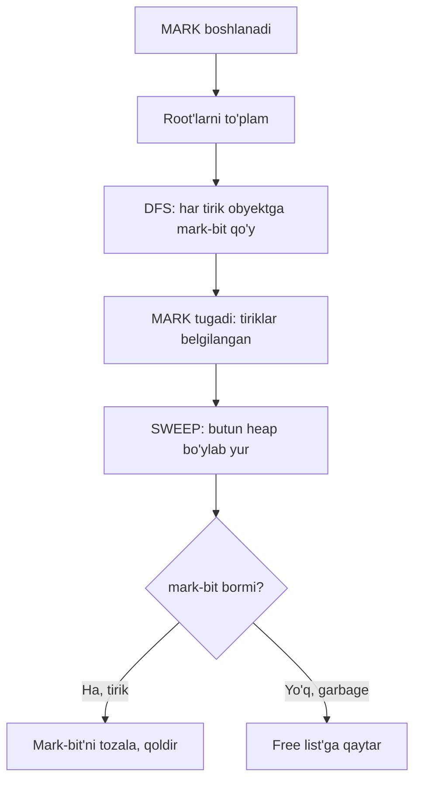
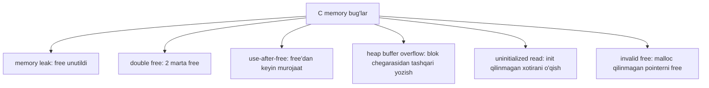
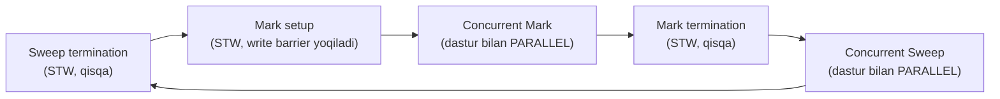

# 27. Garbage Collection va Memory Bug'lar — Go GC vs C manual

> Manba: CS:APP 2-nashr, 9.10-9.11 · Muhit: Ubuntu 24.04 x86-64 (Docker), gcc 13.3.0, go 1.22.2 · [← Oldingi](26-dynamic-memory-allocation.md) · [Kurs xaritasi](00-README.md) · [Keyingi →](28-unix-io.md)

## Nima uchun kerak

C'da har `malloc` uchun sen o'zing `free` chaqirishing shart — bu dunyoni ikki xatoga ochadi: `free` unutilsa **memory leak** (xotira asta oqib ketadi), noto'g'ri joyda `free` qilsa **use-after-free** yoki **double free** (crash yoki security teshigi). Uzoq ishlovchi C server leak bilan sekin, ammo muqarrar OOM (25-darsdagi Out Of Memory) tomon o'ladi. Go'da esa `free` degan operatsiya umuman **yo'q**: **garbage collector** (GC) tirik obyektlarni o'zi topib, o'liklarni avtomatik yig'adi. Shu sabab use-after-free va double free Go'da **printsipial mumkin emas**, leak esa kamayadi (lekin butunlay yo'qolmaydi). Bu dars 9-bobning (virtual memory) yakuni: allocator ustiga (26-dars) endi avtomatik boshqaruvni qo'yamiz.

Bu darsda javob beradigan asosiy savollar:

- GC qanday qilib "bu obyekt endi kerak emas" deb biladi? (**reachability**)
- Tirik va o'lik obyektni qanday ajratadi? (**mark & sweep**, **tricolor**)
- Go GC nega deyarli sezilmaydigan pauza bilan ishlaydi? (**concurrent**, **write barrier**)
- Go'da `free` yo'q bo'lsa ham, leak qanday qilib mumkin? (**reference qolib ketishi**)
- C'ning eng xavfli xatolarini qaysi vositalar ushlaydi? (**valgrind**, **AddressSanitizer**)

## Nazariya

### 1. Muammo: manual xotira boshqaruvi xato-provokatsion

26-darsda `malloc`/`free` ni ko'rdik. Muammo `malloc`da emas — `free`da. Katta programmada bitta blok bir nechta joydan ishlatiladi. Savol: **qachon `free` qilish xavfsiz?** Agar erta `free` qilsang — boshqa kod hali o'sha xotiradan foydalanadi (use-after-free). Agar hech qachon `free` qilmasang — leak. Agar ikki marta `free` qilsang — allocator ichki tuzilmasi (26-darsdagi free list) buziladi (double free). Bu qaror ba'zan **printsipial hal qilib bo'lmaydigan** darajada murakkab: kod oqimiga qarab blok tirikmi yoki o'likmi — bilib bo'lmaydi.

### 2. GC g'oyasi: allocatorning o'zi tiriklarni aniqlaydi

**Garbage collection** — bu dasturchi `free` qilmaydi, o'rniga runtime davriy ravishda heap'ni skanerlab, endi **ishlatilmaydigan** (garbage) bloklarni topib, ularni bo'sh (free list'ga) qaytaradigan avtomatik xotira boshqaruvi. Dasturchi faqat allocatsiya qiladi (`new`, `make`, `&T{}`), bo'shatishni butunlay GC'ga topshiradi. Savol shu: runtime qanday qilib "bu blok endi kerak emas" deb biladi? Javob — **reachability**.

GC yechadigan asosiy muammoni bir jumlada aytish mumkin: **manual boshqaruvda "qachon free qilish xavfsiz?" degan qaror dasturchiga tushadi va u ko'pincha xato qiladi; GC bu qarorni reachability qoidasi asosida mashinaga topshiradi.** Buning evaziga runtime ozgina CPU va vaqti-vaqti bilan qisqa pauza sarflaydi — zamonaviy servislar uchun bu deyarli har doim maqbul kelishuv.

### 3. Reachability: tirik = root'lardan yetib boradigan

Obyekt **tirik** (live) deb hisoblanadi, agar unga programmaning **root** to'plamidan pointer zanjiri orqali yetib borish mumkin bo'lsa. Root'lar — bu programma to'g'ridan-to'g'ri "ushlab turgan" joylar:

- **global (static) o'zgaruvchilar** — data segmentida (24-dars);
- **stack'dagi lokal o'zgaruvchilar** — har bir goroutine/thread stack'i;
- **registerlardagi pointerlar** — CPU registerlarida turgan manzillar.

Reachability **tranzitiv**: agar root A obyektga ko'rsatsa, A esa B'ga ko'rsatsa — B ham tirik. Agar biror obyektga **hech qaysi zanjir orqali** yetib bo'lmasa — u **garbage**, uni bemalol yig'ish mumkin, chunki programma unga hech qachon murojaat qila **olmaydi**. Bu GC'ning matematik asosi: yetib bo'lmaydigan obyektga hech qachon murojaat yo'q, demak yig'ish xavfsiz.

Reachability qoidasini uch punktda eslab qol:

- **Tirik** = root'dan pointer zanjiri bilan yetib boriladi;
- **Garbage** = hech bir root'dan yetib bo'lmaydi (reference bor-yo'qligidan qat'i nazar);
- **Muhim** = "obyektga reference bormi" emas, "root'dan YO'L bormi" degan savol hal qiladi.



Yuqorida A, B, C — root'lardan yetib boriladi, demak **tirik**. X va Y bir-biriga ko'rsatadi, ammo ularga **hech bir root'dan** yetib bo'lmaydi — ular **garbage** (o'chirilgan qutilar). E'tibor ber: X, Y bir-biriga ko'rsatsa ham (reference bor), reachability yo'q — demak GC ularni yig'adi. Bu **reference counting**dan asosiy farq (pastda).

### 4. Mark & Sweep algoritmi

Klassik GC ikki fazadan iborat:

1. **MARK (belgilash)** — GC root'lardan boshlaydi va pointer zanjirlari bo'ylab DFS (chuqurlikka qidiruv) bilan yuradi, har bir yetib borilgan obyektni "mark-bit" bilan belgilaydi. Faza tugagach, **barcha tirik obyektlar belgilangan**, qolganlari belgilanmagan.
2. **SWEEP (supurish)** — GC butun heap'ni ketma-ket bosib o'tadi. Har bir **belgilanmagan** blokni free list'ga qaytaradi (26-dars). Belgilanganlarning mark-bit'ini keyingi sikl uchun tozalaydi.



Klassik mark & sweep'ning kamchiligi — u **stop-the-world** (STW): mark va sweep davomida butun programma **to'xtatiladi**, aks holda kod pointerlarni o'zgartirib GC'ni chalg'itadi. STW pauzasi katta heap'da uzoq (yuz millisekundlar) bo'lishi mumkin. Bu Go 1.5 gacha bo'lgan holat edi.

**Notional machine — mark davomida xotirada aslida nima bo'ladi?** Har heap bloki header'ida (26-dars) bitta bit — **mark-bit** — ajratilgan. Mark boshida u hamma bloklarda 0. GC root'lar ro'yxatini oladi (bu ro'yxat kompilyator yaratgan "pointer map"lar orqali aniqlanadi: stack'ning qaysi so'zi pointer, qaysi biri oddiy son — buni GC biladi). Har root pointer qiymatini o'qib, ko'rsatgan blok header'idagi mark-bit'ni 1 qiladi, so'ng o'sha blok ichidagi pointerlarni (yana pointer map orqali) rekursiv skanerlaydi. Sweep esa heap'ni chiziqli bosib o'tib, mark-bit=0 bo'lgan har blokni free list'ga (26-dars) qo'shadi va mark-bit'larni keyingi sikl uchun 0 ga qaytaradi. Ya'ni GC — bu heap grafida oddiy graf bosib o'tish (traversal), root'lar — boshlang'ich tugunlar.

### 5. Tricolor: concurrent GC uchun

STW'ni qisqartirish uchun **tricolor** (uch rangli) usul ishlatiladi. Har obyekt uch rangdan biriga bo'yaladi:

| Rang | Ma'nosi |
|------|---------|
| **Oq (white)** | Hali ko'rilmagan — sikl oxirida oq qolsa, garbage |
| **Kulrang (gray)** | Belgilangan, lekin bolalari (ko'rsatgan obyektlari) hali skanerlanmagan |
| **Qora (black)** | To'liq skanerlangan — o'zi va barcha bolalari ko'rildi |

Algoritm qadamma-qadam:

1. Boshida barcha obyekt **oq**, root'lar **kulrang**ga bo'yaladi.
2. Kulrang to'plamdan bitta obyekt olinadi.
3. Uning barcha bolalari (ko'rsatgan obyektlari) **kulrang**ga bo'yaladi.
4. Obyektning o'zi **qora**ga o'tadi (to'liq skanerlangan).
5. Kulrang to'plam bo'shaguncha 2-4 takrorlanadi.
6. Yakunda **oq qolgan** obyektlar — garbage, sweep ularni yig'adi.

Muhim invariant: **qora obyekt hech qachon to'g'ridan-to'g'ri oq obyektga ko'rsatmasligi kerak** (aks holda oq obyekt xato yig'ilardi). Bu jarayonni programma bilan **parallel** (concurrent) bajarsa bo'ladi, faqat **write barrier** (yozuv to'sig'i) kerak — pointer o'zgartirilganda GC'ga xabar beriladigan kichik kod, u "qora obyekt oq obyektga ko'rsatib qoldi" degan xavfli holatni bartaraf qiladi (o'zgartirilgan obyektni qayta kulrangga qaytaradi). Go aynan shuni ishlatadi.

### 6. Muqobil: reference counting

Boshqa yondashuv — **reference counting**: har obyekt uchun unga nechta pointer ko'rsatayotganini sanaydigan hisoblagich saqlanadi. Pointer qo'shilsa +1, olib tashlansa -1. Hisob **0** ga tushsa — obyekt darhol yig'iladi. Afzalligi: yig'ish darhol, STW yo'q. Kamchiligi: (1) har pointer operatsiyasi qimmat; (2) **sikl muammosi** — X va Y bir-biriga ko'rsatsa, ikkalasining hisobi 1 bo'lib qoladi, garchi root'dan yetib bo'lmasa ham — hech qachon yig'ilmaydi (leak). Python `sys.getrefcount` shu modelni ishlatadi (plyus sikl detektori). Go esa reachability asosidagi mark-sweep'ni tanlagan — aynan shu sabab u siklni to'g'ri yig'adi.

Ikki yondashuvni yonma-yon qo'yamiz:

| Xususiyat | Mark-sweep (reachability) | Reference counting |
|-----------|---------------------------|--------------------|
| Qachon yig'adi | Davriy skanerlashda | Hisob 0 ga tushganda darhol |
| Sikl muammosi | Yo'q (root'dan yetib bo'lmasa yig'adi) | Bor (sikl hech qachon yig'ilmaydi) |
| Ish taqsimoti | Vaqti-vaqti bilan "portlash" (STW) | Doimiy, tekis yuk |
| Pointer operatsiya narxi | Arzon | Har +1/-1 qimmat |
| Kim ishlatadi | Go, Java, JavaScript | CPython, Swift ARC, C++ `shared_ptr` |

Go'ning tanlovi — mark-sweep, chunki concurrent tricolor bilan STW'ni mikroskopik qilib, sikl muammosidan ham qutuladi.

### 7. C memory bug'lar taksonomiyasi

Manual boshqaruv quyidagi bug'larni tug'diradi (hammasi Go'da GC tufayli yumshoq yoki mumkin emas):



- **memory leak** — `free` unutildi, blok yetib bo'lmaydi lekin bo'shatilmagan;
- **double free** — bitta blokni ikki marta `free` — allocator free list'i buziladi;
- **use-after-free** — `free`'dan keyin **dangling pointer** orqali murojaat (eng xavfli, security);
- **heap buffer overflow** — `malloc`'da so'ralgan chegaradan tashqari yozish;
- **uninitialized read** — `malloc` init qilmaydi, ichida axlat bor, o'qilsa noaniqlik;
- **invalid free** — `malloc` qaytarmagan manzilni (masalan, stack o'zgaruvchisini) `free`.

Bu bug'larni bir necha o'lchov bo'yicha taqqoslaymiz:

| Bug | Sabab | Oqibat | Go'da? |
|-----|-------|--------|--------|
| **memory leak** | `free` unutildi | RAM asta oqadi, OOM | Kamroq (reference qolsa mumkin) |
| **double free** | 2 marta `free` | Free list buziladi, crash | Mumkin emas (`free` yo'q) |
| **use-after-free** | Free'dan keyin murojaat | Ma'lumot buziladi, security | Mumkin emas |
| **heap overflow** | Chegaradan tashqari yozish | Metadata/qo'shni blok buziladi | Runtime `panic` (chegara tekshiruvi) |
| **uninitialized read** | Init qilinmagan xotira o'qildi | Noaniq xatti-harakat | Mumkin emas (Go zero-init qiladi) |
| **invalid free** | Xato manzil `free` qilindi | Crash yoki buzilish | Mumkin emas |

Diqqat qiladigan jihat: bu bug'larning **yarmidan ko'pi** Go'da printsipial mumkin emas — aynan shuning uchun `free`'siz, GC'li tilga o'tish security va ishonchlilikni keskin oshiradi. Qolgan ikkitasi (leak va, kamdan-kam, panic'ga aylangan overflow) Go'da ham bo'lishi mumkin, lekin oqibati yumshoqroq: leak — sekin, panic — nazoratli to'xtash, xotira buzilishi emas.

### 8. Vositalar: valgrind va AddressSanitizer

- **valgrind** — programmani sanab, virtual CPU ustida ishlatadi. Manba kodini qayta kompilyatsiya qilish shart emas, lekin ~20x sekin. Har `malloc`/`free`'ni kuzatib, chiqishda leak va invalid access'larni topadi.
- **AddressSanitizer (ASan)** — kompilyatorga o'rnatilgan (`gcc -fsanitize=address`). Kod atrofiga "redzone"lar qo'yib, chegaradan tashqari murojaatni **darhol** ushlaydi. valgrindan ~10x tez (~2x overhead), shuning uchun CI'da standart.

Ular orasidagi tanlov:

| Xususiyat | valgrind | AddressSanitizer |
|-----------|----------|------------------|
| Qayta kompilyatsiya | Kerak emas | Kerak (`-fsanitize=address`) |
| Sekinlik | ~20x | ~2x (~10x tezroq) |
| Xatoni ushlash payti | Chiqishda yig'ilib | Darhol, sodir bo'lgan joyda |
| Qo'llanish | Lokal debug | CI/nightly test |

Amaliy qoida: kundalik ishda **ASan** (tez, CI'ga mos), chuqurroq va kompilyatsiyasiz tahlil kerak bo'lganda **valgrind**. Ikkalasi ham "notinch" (heisenbug) memory bug'larni deterministik qiladi — bug har safar bir xil joyda ko'rinadi.

## Kod va isbot

### Demo 1 — Memory leak (valgrind)

```c
#include <stdlib.h>
int main(void)
{
    for (int i = 0; i < 3; i++) {
        char *p = malloc(1000);       /* free QILINMADI - leak */
        p[0] = 'x';
    }
    return 0;
}
```

`valgrind --leak-check=full ./leak`:

```
==1935==     in use at exit: 3,000 bytes in 3 blocks
==1935== 3,000 bytes in 3 blocks are definitely lost in loss record 1 of 1
==1935== LEAK SUMMARY:
```

3 marta `malloc(1000)` chaqirildi, hech biri `free` qilinmadi — 3000 bayt **"definitely lost"**. "definitely lost" degani: blokka hech bir pointer qolmagan, demak uni endi hech qachon `free` qilib bo'lmaydi — bu 100% leak. Uzoq ishlovchi serverda bu asta-sekin RAM'ni yeydi va OOM'ga (25-dars) olib keladi. valgrind har allocatsiya/free'ni ichki jadvalda kuzatib, dastur tugaganda hali "ushlab turilgan" bloklarni sanaydi.

### Demo 2 — Use-after-free (dangling pointer)

```c
#include <stdlib.h>
#include <stdio.h>
int main(void)
{
    char *p = malloc(100);
    p[0] = 'A';
    free(p);
    p[0] = 'B';                       /* XATO: bo'shatilgandan keyin yozish */
    return 0;
}
```

`valgrind ./uaf`:

```
==1944== Invalid write of size 1
==1944== All heap blocks were freed -- no leaks are possible
```

`free(p)` dan **keyin** `p` — **dangling pointer** (osilib qolgan pointer): u endi allocatorga qaytarilgan xotiraga ko'rsatadi. `p[0]='B'` — bu **use-after-free**. Nega bu eng xavfli bug? Chunki allocator o'sha blokni orada **boshqa** so'rovga bergan bo'lishi mumkin — sen yozgan `'B'` begona ma'lumotni buzadi. Bundan ham yomoni: agar hujumchi o'sha bo'shatilgan xotiraga o'z ma'lumotini joylashtira olsa, u programmani nazorat qilishi mumkin — bu real security CVE'larning katta qismi. valgrind buni "Invalid write" deb ushlaydi.

### Demo 3 — Heap buffer overflow (valgrind)

```c
#include <stdlib.h>
int main(void)
{
    char *p = malloc(10);
    for (int i = 0; i <= 15; i++)     /* 10 baytga 16 bayt yozamiz */
        p[i] = 'A';                    /* i=10..15 heap overflow */
    free(p);
    return 0;
}
```

`valgrind ./overflow`:

```
==1968== Invalid write of size 1
==1968==  Address 0x4a7204a is 0 bytes after a block of size 10 alloc'd
```

`malloc(10)` — 10 baytlik blok. Lekin sikl `i=0..15`, ya'ni 16 bayt yozadi. `i=10` dan boshlab blok **chegarasidan tashqari**ga yozamiz — **heap buffer overflow**. valgrind aniq ko'rsatadi: **"0 bytes after a block of size 10"** — ya'ni 10 baytlik blokdan darhol keyin. Bu qo'shni heap metadata'sini (26-dars: header, chunk chegaralari) yoki qo'shni blokni buzadi. Stack overflow (11-dars) security teshigi bo'lgani kabi, heap overflow ham xavfli va real ekspluatatsiya vektori.

### Demo 4 — AddressSanitizer (zamonaviy, tez)

```c
#include <stdlib.h>
int main(void)
{
    int *a = malloc(4 * sizeof(int));
    a[4] = 1;                          /* off-by-one: indeks 4 (0..3 valid) */
    free(a);
    return 0;
}
```

`gcc -fsanitize=address -g -o asan asan.c && ./asan`:

```
==1977==ERROR: AddressSanitizer: heap-buffer-overflow on address 0x502000000020
WRITE of size 4 at 0x502000000020 thread T0
allocated by thread T0 here:
```

**AddressSanitizer** — kompilyatorga o'rnatilgan (`-fsanitize=address`), valgrindan ~10x tez, CI'da standart. Bu klassik **off-by-one** xato: `malloc(4*4)=16` bayt, valid indekslar `0..3`, `a[4]` esa **chegaradan bir qadam tashqarida**. ASan buni "heap-buffer-overflow" deb **darhol**, aniq manzil bilan ushlaydi ("allocated by thread T0 here" — qayerda allocatsiya bo'lganini ham ko'rsatadi). Zamonaviy C/C++ loyihalar nightly build'da ASan bilan test qiladi.

### Demo 5 — Go GC: unreachable obyektlarni avtomatik yig'ish

Endi Go'ga o'tamiz. C'dagi 4 bug'ning hech biri bu yerda yo'q — `free` yozmaymiz.

```go
package main

import (
	"fmt"
	"runtime"
)

type Node struct {
	data [1024]byte
	next *Node
}

func main() {
	var m runtime.MemStats
	runtime.ReadMemStats(&m)
	fmt.Printf("Boshlanish: HeapAlloc=%d KB, NumGC=%d\n",
		m.HeapAlloc/1024, m.NumGC)

	for round := 0; round < 5; round++ {
		var head *Node
		for i := 0; i < 10000; i++ {
			head = &Node{next: head}   // bog'langan ro'yxat
		}
		_ = head
		// round tugagach head yo'qoladi -> obyektlar UNREACHABLE -> GC yig'adi
	}
	runtime.GC()

	runtime.ReadMemStats(&m)
	fmt.Printf("5 round keyin: HeapAlloc=%d KB, NumGC=%d\n",
		m.HeapAlloc/1024, m.NumGC)
	fmt.Printf("Jami GC pauza: %.3f ms (butun dastur bo'yicha)\n",
		float64(m.PauseTotalNs)/1e6)
}
```

Output:

```
Boshlanish: HeapAlloc=112 KB, NumGC=0
5 round keyin: HeapAlloc=131 KB, NumGC=8
Jami GC pauza: 1.379 ms (butun dastur bo'yicha)
```

Diqqat qil: 5 round x 10000 Node x ~1KB = **~50 MB** obyekt yaratildi, LEKIN `HeapAlloc` atigi **131 KB** da qoldi! Nega? Har round oxirida `head` o'zgaruvchisi scope'dan chiqib **yo'qoladi** — shu round'dagi 10000 Node endi **root'lardan yetib bo'lmaydi** (unreachable). Reachability qoidasi bo'yicha ular **garbage**, GC ularni yig'ib RAM'ni operatsion sistemaga qaytaradi. `NumGC=8` — GC 8 marta ishladi. Eng muhimi: butun dastur bo'yicha jami **STW pauza atigi 1.379 ms** — Go GC **concurrent**, ish asosan dastur bilan parallel bajariladi, to'xtash mikroskopik.

C'dagi 4 bug Go'da qanday? **leak** — kamayadi (GC yig'adi), lekin reference qolsa hali mumkin. **use-after-free** va **double free** — **printsipial mumkin emas**, chunki manual `free` umuman yo'q. **buffer overflow** — Go slice/array chegara tekshiruvi bilan runtime'da `panic: index out of range` beradi, xotira buzilmaydi.

### Demo 6 — GODEBUG=gctrace=1: GC ishini kuzatish

`GODEBUG=gctrace=1 go run main.go` (yuqoridagi dastur) chiqishidan namuna:

```
gc 1 @0.065s 16%: 0.80+19+0.73 ms clock, ... 3->4->0 MB, 4 MB goal, 10 P
gc 5 @0.280s 9%: 0.54+11+0.096 ms clock, ... 3->4->2 MB, 4 MB goal, 10 P
```

Bu qatorlarni bo'lib o'qiymiz (`gc 1` misolida):

- `gc 1` — birinchi GC sikli; `@0.065s` — dastur boshlanganidan 0.065 s o'tgach; `16%` — start'dan beri CPU'ning 16% GC'ga ketgan.
- `0.80+19+0.73 ms clock` — uch faza vaqti: **0.80 ms mark setup (STW)** + **19 ms concurrent mark** + **0.73 ms mark termination (STW)**. Faqat 0.80 va 0.73 ms — STW (dastur to'xtaydi); asosiy 19 ms mark dastur bilan **parallel**.
- `3->4->0 MB` — eng muhim uchlik: GC OLDIDAN heap **3 MB**, mark davomida PEAK **4 MB**, GC'dan KEYIN tirik **0 MB**. Ya'ni hammasi garbage edi, hammasi yig'ildi!
- `4 MB goal` — keyingi GC heap 4 MB ga yetganda ishga tushadi. Bu **GOGC=100** (default) natijasi: heap oldingi tirik hajmdan ikki baravar oshganda GC boshlanadi.
- `10 P` — 10 ta processor (logical CPU) ishtirok etdi.

Bu Go'ning **tricolor concurrent mark-sweep**ining aniq izi. STW qismlari (0.80+0.73 ≈ 1.5 ms), asosiy ish (19 ms mark) esa foydali ishga xalaqit bermaydi.

Go GC siklining to'liq fazalari (soddalashtirilgan):



E'tibor ber: **ikkita** STW faza (mark setup va mark termination) — juda qisqa (~mikrosekund-millisekund). Asosiy og'ir ish — mark va sweep — dastur bilan **parallel**. Aynan shu sabab gctrace'da 19 ms mark ko'rinsa ham, dastur to'xtamaydi: u faqat ~1.5 ms to'xtaydi, qolgan vaqt ishlashda davom etadi. Bu Go 1.5+ ning asosiy yutug'i.

## Go dasturchiga ko'prik

Bu dars allaqachon Go-markazli. Chuqurlashtiramiz:

- **Go GC = tricolor concurrent mark-sweep** — non-generational, non-compacting. Ish dastur bilan parallel, STW faqat mark setup va termination'da (~mikrosekund-millisekund). **write barrier** concurrent mark davomida pointer o'zgarishlarini kuzatib, invariantni saqlaydi.
- **GOGC** (default **100**) — GC qachon ishga tushishini boshqaradi. `GOGC=100` degani: tirik heap **ikki baravar** o'sganda GC. `GOGC=200` — kamroq GC, ko'proq RAM; `GOGC=50` — tez-tez GC, kam RAM. `debug.SetGCPercent` yoki `GOGC` env bilan sozlanadi.
- **GOMEMLIMIT** (25-dars) — **soft** xotira chegarasi. Heap shu chegaraga yaqinlashsa, GC intensivroq ishlaydi. Konteynerda (RSS limit bor) OOM'dan saqlaydi. GOGC bilan birga ishlatiladi.
- **GC evolyutsiyasi** — Go 1.5 gacha STW ~100+ ms edi; concurrent GC joriy etilgach hozir odatda **<1 ms**. Bu latency-sensitive servislar uchun burilish nuqtasi bo'ldi.
- **Go'da LEAK HALI MUMKIN** — GC faqat **unreachable** obyektni yig'adi. Agar reference **qolib ketsa**, obyekt "tirik" hisoblanadi va yig'ilmaydi: (1) unutilgan/bloklangan **goroutine** (uning stack va obyektlari); (2) cheksiz o'sadigan **map** (kalitlar o'chirilmaydi); (3) doim o'sadigan **global slice**. Bu leak'ni **pprof heap** (15-dars) bilan topamiz.
- **escape analysis** (13-dars) — agar obyekt funksiyadan "qochib chiqmasa", kompilyator uni **stack**'da joylashtiradi. Stack'dagi obyekt GC'ni **ko'rmaydi** (funksiya qaytganda avtomatik yo'qoladi) — bu GC bosimini kamaytiradi. Shuning uchun keraksiz pointerlardan qochish GC'ni yengillashtiradi.
- **sync.Pool** — qayta-qayta allocatsiya qilinadigan obyektlarni qayta ishlatib, GC yukini kamaytirish uchun bufer pool. **finalizer** (`runtime.SetFinalizer`) — obyekt yig'ilishidan oldin chaqiriladigan funksiya, kam va ehtiyotkorlik bilan ishlatiladi.
- **GC bosimini kamaytirish amaliyoti** — kamroq va yiriroq allocatsiya (masalan, slice'ni bir marta kerakli sig'im bilan `make`); qiymat (value) semantikasini afzal ko'rish; keraksiz pointerdan qochish (escape analysis yordamida stack'da qoldirish); issiq yo'lda `sync.Pool`.

Amaliy jihatdan Go dasturchi GC'ni "unutib" ishlaydi — lekin latency yoki RAM muammosi chiqqanda uchta tugmani biladi: **GOGC** (chastota), **GOMEMLIMIT** (chegara), va **allocatsiya kamaytirish** (escape analysis + pool). Uchalasi birga pauza va xotira o'rtasidagi balansni boshqaradi.

## Real-world scenariylar

### Scenariy 1 — Go goroutine leak (pprof bilan topish)

Eng ko'p uchraydigan Go "memory leak" — aslida **goroutine leak**. Masalan, `ch <-` da abadiy bloklangan goroutine hech qachon tugamaydi: uning stack'i va ushlab turgan obyektlari **reachable** bo'lib qoladi, GC yig'a olmaydi. Symptom: RSS (25-dars) asta o'sadi, `runtime.NumGoroutine()` ham o'sadi.

Go'da leak keltirib chiqaradigan asosiy manbalar:

1. **Bloklangan goroutine** — yopilmagan `channel`ga yozish/o'qish, `context` bilan bekor qilinmagan ish.
2. **O'sadigan map** — cache'dan eski kalitlar `delete` qilinmaydi.
3. **Global slice** — doim `append` qilinadi, hech qachon qisqarmaydi.
4. **Unutilgan timer/ticker** — `time.Ticker` `Stop` qilinmasa, ichki goroutine yashaydi.
5. **Katta obyektga kichik reference** — kichik slice katta massivning bir qismiga ko'rsatsa, butun massiv tirik qoladi.

Topish yo'li: `go tool pprof http://.../debug/pprof/heap` bilan heap profilini (15-dars) olib, qaysi allocatsiya joyi o'smoqda deb ko'rish; goroutine profilida bloklangan goroutine'larni sanash. Diff (`-base`) rejimida ikki snapshot farqi o'sish manbasini aniq ko'rsatadi.

### Scenariy 2 — C server use-after-free -> security CVE

Real C server (masalan, eski web server) so'rov obyektini `free` qilib, keyin xato yo'lda o'sha **dangling pointer**ga qaytadan murojaat qiladi. Hujumchi shu oynani ("free bilan qayta-murojaat orasidagi vaqt") ishlatib, bo'shatilgan xotiraga o'z ma'lumotini (masalan, funksiya pointeri) joylashtiradi. Endi server o'sha "eski" obyektni o'qiganda hujumchi ma'lumotini bajaradi — remote code execution. Bu use-after-free CVE'larning klassik shakli. Go'da bu **mumkin emas**, chunki `free` yo'q va GC obyektni faqat **hech kim ko'rmaganda** yig'adi.

### Scenariy 4 — Go'da map cheksiz o'sishi (klassik "leak")

Keng tarqalgan Go leak — cache sifatida ishlatilgan **map**dan kalitlar hech qachon o'chirilmaydi. Masalan, har kelgan HTTP so'rov session ID'sini `sessions[id] = data` ga yozadi, lekin eskilarini `delete` qilmaydi. Map ichidagi qiymatlar **reachable** (map global yoki uzoq yashovchi), demak GC ularni **yig'olmaydi** — bu texnik jihatdan leak emas (obyektlar tirik), lekin amalda RAM cheksiz o'sadi. Yechim: TTL bilan eskirgan kalitlarni `delete` qilish, yoki chegaralangan LRU cache ishlatish. Bu Go'da GC borligiga qaramay leak bo'lishining eng ko'p uchraydigan sababi — reachability qoidasini eslab, "reference ushlab turilganmi?" degan savolni berish kerak.

### Scenariy 3 — GC tuning: latency vs RAM balansi

Latency-sensitive servis (masalan, past p99 kerak bo'lgan API) uchun GC pauzasi muhim. Ikki tutqich: **GOGC** va **GOMEMLIMIT**. `GOGC` ni oshirish (masalan 200-300) GC chastotasini kamaytiradi -> kamroq CPU, kamroq pauza, lekin ko'proq RAM. Konteynerda RAM chegarasi bor — shuning uchun `GOMEMLIMIT` ni konteyner limitidan biroz past qo'yib (masalan 90%), OOM'dan himoyalanamiz: heap limitga yaqinlashsa GC agressivlashadi. Odatiy retsept: `GOGC` bilan CPU/latency, `GOMEMLIMIT` bilan xavfsizlik chegarasi.

Amaliy qadamlar tartibi:

1. `GODEBUG=gctrace=1` bilan hozirgi GC chastotasi va pauzani o'lchash.
2. `go tool pprof` bilan allocatsiya issiq nuqtalarini topib, keraksiz allocatsiyalarni kamaytirish (eng arzon yutuq).
3. Agar RAM zaxira bo'lsa, `GOGC` ni oshirib pauzani kamaytirish.
4. Konteynerda `GOMEMLIMIT` ni RAM limitidan ~10% past qo'yib OOM'dan himoyalanish.
5. O'zgarishlarni yuk (load) testi ostida tekshirish — p99 va RSS'ni birga kuzatish.

## Zamonaviy yondashuv

- **Go GC** — concurrent tricolor mark-sweep, STW <1 ms; oddiylik va past latency'ga urg'u.
- **Java GC** — bir necha zamonaviy collector: **G1** (region-based, balansli), **ZGC** va **Shenandoah** (juda past pauza, katta heap uchun), **generational** g'oyalar (yosh obyektlar tez o'ladi degan gipoteza asosida yosh/keksa avlodni alohida yig'ish).
- **Rust** — **GC yo'q**. O'rniga kompilyatsiya vaqtidagi **ownership** va **borrow checker**: har qiymatning bitta egasi bor, egasi scope'dan chiqsa xotira avtomatik bo'shatiladi (RAII). Kompilyator use-after-free va double free'ni **kompilyatsiya vaqtida** rad etadi — runtime overhead ham, GC pauza ham yo'q. Bu GC'siz xavfsizlikning eng ta'sirli modeli.
- **C++** — **smart pointer**lar: `unique_ptr` (bitta egalik, RAII), `shared_ptr` (reference counting), `weak_ptr` (sikl uzish uchun). Manual `new`/`delete` o'rniga tavsiya etiladi.
- **Sanitizers** — ASan (address), **MSan** (uninitialized memory), **TSan** (data race). CI'da nightly test uchun standart. C/C++ xavfsizligini oshirishning amaliy yo'li.
- **generational GC** — "ko'p obyekt yosh o'ladi" gipotezasiga tayanadi: yangi (yosh) obyektlarni alohida, tez-tez yig'ish; keksa avlodni kamroq skanerlash. Java/JavaScript ishlatadi. Go **non-generational** — soddaligi va concurrent dizayni tufayli generational murakkabligini olmagan.

Umumiy tendensiya ikki qutbga bo'linadi: bir tomonda **runtime GC** (Go, Java, JS) — dasturchi uchun qulay, lekin pauza va CPU narxi bor; ikkinchi tomonda **kompilyatsiya vaqtida xavfsizlik** (Rust ownership, C++ smart pointers) — nol runtime narx, lekin dasturchidan ko'proq intizom talab qiladi. Go backend developer sifatida sen GC tomondasan, lekin C bug'larni bilish past darajadagi kod (cgo, syscall, xotira profili) bilan ishlaganda asqotadi.

## Keng tarqalgan xatolar

1. **"Go'da memory leak mumkin emas"** — noto'g'ri. GC faqat **unreachable** obyektni yig'adi. Reference qolsa (goroutine leak, o'sadigan map, global slice) — leak hali mumkin. Yechim: pprof heap (15-dars).
2. **C'da `free` unutish yoki double free** — leak yoki heap buzilishi. Har `malloc`'ga aniq **bitta** `free` bo'lsin; `free`'dan keyin pointerni `NULL` qilish double free'dan himoya qiladi.
3. **use-after-free (dangling pointer)** — `free`'dan keyin pointer hali "ishlaydigandek" ko'rinadi, lekin xotira allaqachon boshqaga berilgan. Eng xavfli, eng qiyin topiladigan bug.
4. **GOGC/GOMEMLIMIT ni konteynerda sozlamaslik** — default GOGC=100 katta heap'da tez-tez GC yoki, aksincha, GOMEMLIMIT yo'qligi tufayli konteyner OOM. Konteyner limitini hisobga olib sozlash kerak.
5. **"GC butun dasturni to'xtatadi"** — eski tasavvur. Go GC **concurrent**, STW faqat kichik setup/termination fazalarida, odatda <1 ms. Gctrace'dagi `0.80+19+0.73 ms` shuni ko'rsatadi: 19 ms parallel, faqat ~1.5 ms STW.
6. **"C'da valgrind toza chiqsa, kod xavfsiz"** — noto'g'ri. valgrind faqat **bajarilgan** yo'llarni tekshiradi. Test qamrab olmagan tarmoqda leak yoki use-after-free qolishi mumkin. Shuning uchun ASan/valgrind'ni keng test qamrovi va fuzzing bilan birga ishlatish kerak.
7. **`shared_ptr` sikli** — C++'da reference counting'ga tayangan `shared_ptr` ikki obyekt bir-biriga ko'rsatsa leak beradi; birini `weak_ptr` qilib siklni uzish kerak. Reference counting'ning tabiiy zaifligi.

## Amaliy mashqlar

**1.** valgrind chiqishida `3,000 bytes in 3 blocks are definitely lost` deydi. Bu raqamlar qayerdan keldi va "definitely lost" nimani anglatadi?

<details><summary>Yechim</summary>
Demo 1'da sikl 3 marta `malloc(1000)` chaqiradi, hech biri `free` qilinmaydi: 3 x 1000 = 3000 bayt, 3 blok. "definitely lost" — blokka ko'rsatadigan pointer umuman qolmagan, demak uni endi hech qachon `free` qilib bo'lmaydi, 100% leak.
</details>

**2.** Demo 2'da `free(p)`'dan keyin `p[0]='B'` nega faqat "xato emas", balki security jihatdan xavfli?

<details><summary>Yechim</summary>
`free`'dan keyin allocator o'sha blokni boshqa so'rovga bergan bo'lishi mumkin. `p[0]='B'` begona ma'lumotni buzadi. Agar hujumchi o'sha bo'shatilgan xotiraga o'z ma'lumotini (masalan, funksiya pointeri) joylashtira olsa, programmani nazorat qilishi mumkin — remote code execution. Bu use-after-free CVE'larning asosi.
</details>

**3.** Quyidagi obyektlardan qaysilari tirik? Root faqat `A`'ga ko'rsatadi. `A -> B`, `B -> C`, `D -> E`, `E -> D`.

<details><summary>Yechim</summary>
Tirik: A, B, C (root -> A -> B -> C zanjiri). Garbage: D, E — ular bir-biriga ko'rsatadi (reference bor), lekin root'dan yetib bo'lmaydi. Reachability muhim, reference emas. Reference counting bu siklni yig'a olmaydi, mark-sweep esa yig'adi.
</details>

**4.** gctrace'dagi `3->4->0 MB` nimani anglatadi? `0` nega yaxshi belgi?

<details><summary>Yechim</summary>
GC OLDIDAN heap 3 MB, mark davomida PEAK 4 MB, GC'dan KEYIN tirik 0 MB. `0` degani — o'sha 3 MB'ning hammasi garbage edi (unreachable), hammasi yig'ildi. Demo 5'dagidek: har round'dagi Node'lar round tugagach unreachable bo'ladi.
</details>

**5.** Go'da `free` yo'q. Unda memory leak umuman bo'lmaydimi? Misol keltir.

<details><summary>Yechim</summary>
Bo'ladi. GC faqat unreachable obyektni yig'adi. Agar reference qolsa: (1) bloklangan goroutine stack'i; (2) elementlari o'chirilmaydigan, cheksiz o'sadigan map; (3) doim `append` qilinadigan global slice. Bularning hammasi hali "reachable" — GC yig'maydi. pprof heap bilan topiladi.
</details>

**6.** Mark & sweep ikki fazasini o'z so'zing bilan tasvirla. Nega klassik variantda STW kerak?

<details><summary>Yechim</summary>
MARK: root'lardan DFS bilan yurib, har tirik obyektga mark-bit qo'yiladi. SWEEP: butun heap bo'ylab yurib, mark-bit yo'q bloklar free list'ga qaytariladi. Klassik variantda STW kerak — aks holda programma mark davomida pointerlarni o'zgartirib, GC'ni chalg'itadi (tirik obyekt garbage deb yig'ilishi mumkin). Tricolor + write barrier bu muammoni hal qilib concurrent ishlashga imkon beradi.
</details>

**7.** Demo 4'da `int *a = malloc(4*sizeof(int)); a[4]=1;` — nega bu xato? ASan buni valgrindan qanday farq bilan ushlaydi?

<details><summary>Yechim</summary>
`malloc(4*4)=16` bayt, valid indekslar 0..3, `a[4]` chegaradan bir qadam tashqarida (off-by-one heap overflow). ASan — kompilyatorga o'rnatilgan (`-fsanitize=address`), redzone'lar bilan xatoni DARHOL, ~10x tezroq ushlaydi va allocatsiya joyini ham ko'rsatadi. valgrind qayta kompilyatsiyasiz ishlaydi lekin ~20x sekin.
</details>

**8.** Reference counting X va Y sikl (X -> Y -> X, root yo'q)'ni nega yig'olmaydi, mark-sweep esa yig'adi?

<details><summary>Yechim</summary>
Reference counting'da X'ning hisobi 1 (Y ko'rsatadi), Y'niki ham 1 (X ko'rsatadi) — hech qachon 0 ga tushmaydi, yig'ilmaydi (leak). Mark-sweep reachability'ga qaraydi: root'dan X'ga ham, Y'ga ham yetib bo'lmaydi, demak ikkalasi ham garbage — yig'iladi. Reference borligi tiriklik demak emas; root'dan yo'l borligi muhim.
</details>

**9.** Latency-sensitive Go servisda p99 pauza yuqori. GOGC=100 (default). Qanday sozlash pauzani kamaytiradi va uning narxi nima?

<details><summary>Yechim</summary>
`GOGC` ni oshirish (masalan 200-300) GC chastotasini kamaytiradi -> kamroq STW pauza va CPU, lekin ko'proq RAM ishlatiladi. Konteynerda RAM chegarasi bor, shuning uchun birga `GOMEMLIMIT` ni konteyner limitidan ~10% past qo'yib, OOM'dan himoyalanamiz: heap limitga yaqinlashsa GC agressivlashadi. Balans: GOGC bilan latency/CPU, GOMEMLIMIT bilan xavfsizlik.
</details>

**10.** `escape analysis` (13-dars) GC bosimini qanday kamaytiradi? Bir jumlada tushuntir.

<details><summary>Yechim</summary>
Agar obyekt funksiyadan "qochib chiqmasa" (referensi tashqariga o'tmasa), kompilyator uni heap emas, **stack**'da joylashtiradi; stack'dagi obyekt funksiya qaytganda avtomatik yo'qoladi va GC uni umuman ko'rmaydi — demak mark/sweep qilinadigan obyektlar soni kamayadi.
</details>

## Cheat sheet

| Tushuncha | Nima | Eslab qolish |
|-----------|------|--------------|
| **garbage collection** | Avtomatik xotira boshqaruvi | `free` o'rniga runtime yig'adi |
| **reachability** | Root'lardan yetib borilsa tirik | Reference emas, yo'l muhim |
| **root** | Global, stack, registerlar | GC skanerni shu yerdan boshlaydi |
| **mark-sweep** | Mark: belgila; Sweep: yig' | Ikki faza |
| **tricolor** | Oq/kulrang/qora | Concurrent GC uchun |
| **write barrier** | Pointer o'zgarishini kuzatish | Concurrent mark invarianti |
| **reference counting** | Referens sonini sanash | Sikl muammosi bor |
| **memory leak** | Yig'ilmagan xotira | C: free unutish; Go: reference qolishi |
| **double free** | Bir blokni 2 marta free | Heap free list buziladi |
| **use-after-free** | Free'dan keyin murojaat | Dangling pointer, security |
| **dangling pointer** | Bo'shatilganga ko'rsatuvchi | Use-after-free manbai |
| **heap overflow** | Blok chegarasidan tashqari | Metadata/qo'shni blok buziladi |
| **valgrind** | Runtime debugger | Rekompilyatsiyasiz, ~20x sekin |
| **AddressSanitizer** | Kompilyator sanitizeri | `-fsanitize=address`, ~10x tez |
| **GOGC** | GC tetigi (default 100) | Heap 2x oshganda GC |
| **GOMEMLIMIT** | Soft xotira chegarasi | Konteyner OOM'dan himoya (25-dars) |
| **STW** | Stop-the-world pauza | Go'da <1 ms, mikroskopik |
| **escape analysis** | Stack'da qoldirish | GC ko'rmaydi (13-dars) |
| **write barrier** narxi | Concurrent mark uchun kichik overhead | Pauzasizlik uchun to'lov |
| **sync.Pool** | Obyekt qayta ishlatish | GC bosimini kamaytiradi |
| **gctrace** | `GODEBUG=gctrace=1` | `oldin->peak->keyin MB` |
| **goroutine leak** | Bloklangan goroutine | Go'da leak'ning eng ko'p sababi |

## Qo'shimcha manbalar

- [A Guide to the Go Garbage Collector — go.dev](https://go.dev/doc/gc-guide) — GOGC, GOMEMLIMIT, pacer'ning rasmiy qo'llanmasi.
- [Understanding AddressSanitizer — Trail of Bits](https://blog.trailofbits.com/2024/05/16/understanding-addresssanitizer-better-memory-safety-for-your-code/) — ASan qanday ishlashi va C memory bug'lar.
- [Mark-and-Sweep Garbage Collection — GeeksforGeeks](https://www.geeksforgeeks.org/java/mark-and-sweep-garbage-collection-algorithm/) — mark-sweep va reachability asoslari.
