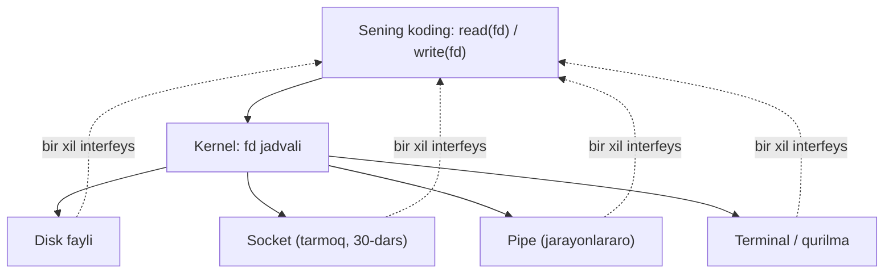
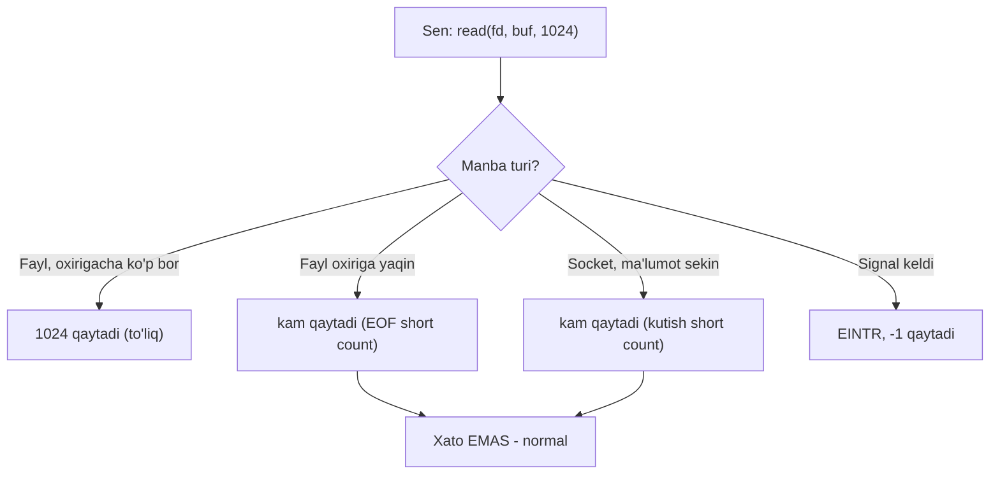
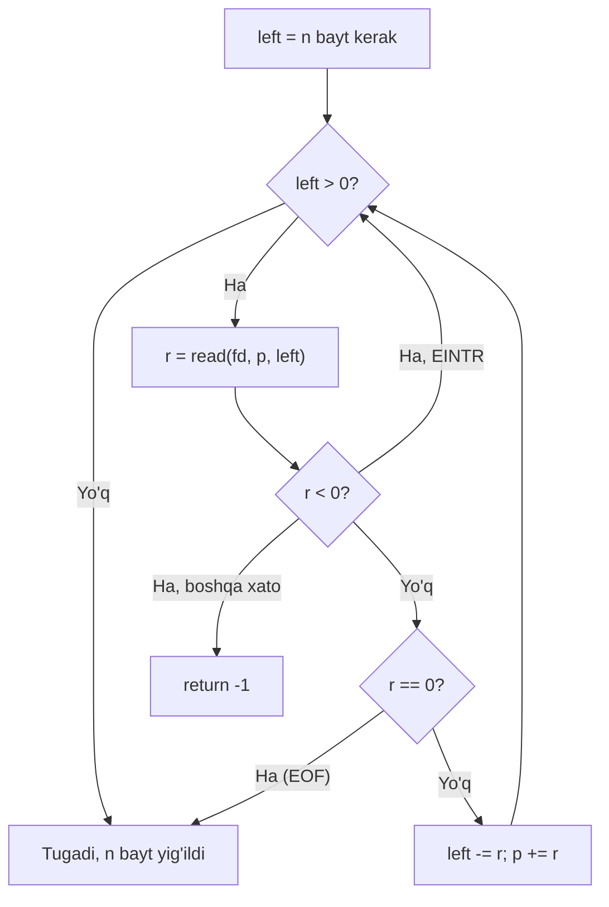
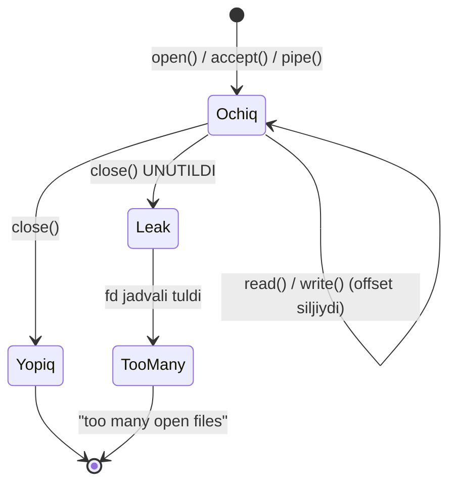

# 28. Unix I/O — fayl deskriptorlari, short count, RIO

> Manba: CS:APP 2-nashr, 10.1-10.4 · Muhit: Ubuntu 24.04 x86-64 (Docker), gcc 13.3.0, go 1.22.2 · [← Oldingi](27-garbage-collection.md) · [Kurs xaritasi](00-README.md) · [Keyingi →](29-file-metadata-sharing.md)

## Nima uchun kerak

Sen `net.Conn.Read` chaqirasan va 1024 bayt so'raysan — lekin 300 bayt qaytadi. Kod "hammasi keldi" deb o'ylaydi va protokol buziladi. Bu **short count** — network kodidagi eng ko'p uchraydigan bug, va aynan shu dars uni tushuntiradi. `io.ReadFull`, `io.ReadAll` nega mavjud — javob shu yerda.

Ikkinchidan, servering ishlab turadi va bir kun `too many open files` bilan qulaydi. Sabab — **file descriptor** (fd) leak: ochilgan fayl yoki `response.Body` yopilmagan. fd nima ekanini, nega cheklangan resurs ekanini bilsang, bu xatoni oldindan ko'rasan. Va nihoyat, Unix'ning "hamma narsa fayl" g'oyasi — fayl, socket, pipe, terminal bir xil interfeys orqali ishlaydi — Go'dagi `io.Reader` ekotizimining aynan poydevori.

Bu dars 10-bobning boshi: bu yerda past darajali (raw) `read`/`write` bilan tanishasan, keyingi darsda (29) bufer va stdio ustki qavatini ko'rasan, 30-31 darslarda esa aynan shu interfeys socket'larga qanday cho'zilishini ko'rasan. Go dasturchisi sifatida sen bu qavatlarni har kuni `io.Reader` orqali ishlatasan — bu dars ularning ostidagi mexanizmni ochib beradi.

## Nazariya

> Oltin qoida: `read`/`write` so'raganingdan **kam** qaytarishi mumkin (short count) — bu xato emas, normal. Har doim loop bilan to'lguncha o'qi, va har ochilgan fd'ni yop.

### 1. UNIX I/O modeli — "hamma narsa fayl"

Unix'ning eng kuchli abstraksiyasi: disk fayli, terminal, tarmoq **socket**'i (30-darsda), **pipe** (jarayonlararo kanal), qurilma — hammasi bir xil to'rtta amal orqali boshqariladi:

- **open** — manbani ochib, fd oladi
- **read** — bayt o'qiydi
- **write** — bayt yozadi
- **close** — fd'ni bo'shatadi

Bu shuni anglatadiki, faylga baytlarni ko'chiruvchi kod aynan o'zgarishsiz socket'ga yoki pipe'ga ham ishlaydi. Bir interfeys — cheksiz manba. `cat` buyrug'i faylni ham, terminalni ham, pipe'ni ham bir xil o'qiydi (Linux kursi 05-dars).

Kalit g'oya: sen kod yozganda "bu socketmi yoki faylmi" deb ajratmaysan — fd oldingda, sen `read`/`write` chaqirasan, qolganini kernel hal qiladi. Aynan shu bir xillik keyinchalik Go'da `io.Reader` bo'lib qayta tug'iladi.



### 2. FILE DESCRIPTOR — kernel'ga tutqich

**File descriptor** (fd) — kichik butun son. U faylning o'zi emas — kernel ichidagi "ochiq fayllar jadvali"ga **indeks** (29-darsda batafsil). Sen fd raqamini ushlaysan, kernel esa u ortida real holatni (offset, ruxsatlar, inode) saqlaydi.

Har bir process **o'z** fd jadvaliga ega. Process fork qilinganda child fd'larni meros oladi (22-dars). fd — cheklangan resurs: `ulimit -n` bilan chegara qo'yiladi, shuning uchun har bir ochilgan fayl yopilishi shart.

Nega bu muhim? Chunki fd — bu shunchaki raqam, lekin har biri ortida kernel'da hotira va holat turadi. 10000 ta ulanishni ochib, birortasini yopmasang, jadval to'ladi va yangi `open`/`accept` muvaffaqiyatsiz bo'ladi. Bu Go serverida `defer resp.Body.Close()` unutilganda aynan sodir bo'ladi (pastda ko'ramiz). fd — o'z kodingda ko'rinmaydigan, lekin kernel'da real narsaning "kalitchasi".

### 3. STANDART fd — 0, 1, 2

Har bir process uchta tayyor fd bilan boshlanadi:

| fd | Nomi | Vazifa |
|----|------|--------|
| 0 | `stdin` | Kiritish (klaviatura) |
| 1 | `stdout` | Oddiy chiqish |
| 2 | `stderr` | Xatolar chiqishi |

`printf` aslida `write(1, ...)` ustiga qurilgan. Shell redirect (`> file`, `2>err`) aynan shu fd'larni qayta yo'naltiradi (29-dars, Linux kursi 05-dars).

### 4. OPEN — fayl ochish

`open()` faylni ochadi va **eng past bo'sh** fd raqamini qaytaradi. Flaglar rejimni belgilaydi: `O_RDONLY` (faqat o'qish), `O_WRONLY` (faqat yozish), `O_RDWR` (ikkisi), `O_CREAT` (yo'q bo'lsa yarat), `O_TRUNC` (bo'shat), `O_APPEND` (oxiriga qo'sh).

"Eng past bo'sh" qoidasi muhim amaliy oqibatga ega. Agar fd 1 (`stdout`)'ni yopib, keyin `open` chaqirsang — yangi fayl fd 1 ni oladi, chunki u endi bo'sh. Aynan shu hiyla bilan shell `> file` redirect'ni amalga oshiradi: `stdout`'ni yopib, faylni ochadi, u avtomatik fd 1 bo'ladi (29-dars, Linux kursi 05-dars). `open` xato bo'lsa (fayl yo'q, ruxsat yo'q) `-1` qaytaradi va `errno`'ni o'rnatadi — real kodda buni har doim tekshirish kerak.

### 5. READ / WRITE — bayt ko'chirish

`read(fd, buf, n)` — fd'dan `n` baytgacha `buf`'ga o'qiydi. `write(fd, buf, n)` — teskarisi. Har biri **syscall** — kernel'ga o'tish (21-dars, qimmat amal). Kernel har fd uchun joriy **offset** (pozitsiya) saqlaydi: har o'qishdan keyin offset oldinga siljiydi.

Notional machine — mashina ostida nima bo'ladi: `read` chaqirilganda CPU user rejimdan kernel rejimiga o'tadi (context switch), kernel disk/socket bufferidan baytlarni sening `buf`'ingga ko'chiradi, offset'ni siljitadi va o'qigan bayt sonini qaytaradi. Aynan shu "kernel'ga o'tish" qimmat bo'lgani uchun har baytni alohida o'qish o'rniga kattaroq bloklar bilan o'qiladi (yoki `bufio` buffer qo'yiladi, 29-dars). Offset — bu fd'ga bog'langan, `buf`'ga emas: shuning uchun ketma-ket ikki `read` fayl bo'ylab oldinga yuradi.

### 6. SHORT COUNT — kutilgandan kam

Mana darsning yuragi. `read` va `write` **so'ralgandan kam** qaytarishi mumkin — bu **short count**, va bu **xato EMAS**, normal hodisa. Sabablari:

- **EOF** — fayl oxiriga yetdi, qolgan baytlar yo'q
- **pipe / socket** — ma'lumot hali kelib ulgurmagan (network sekin)
- **EINTR** — signal syscall'ni uzib yubordi (23-dars)



Short count qanchalik tez-tez uchrashini manba turi belgilaydi. Quyidagi jadval buni umumlashtiradi:

| Manba | Short count qachon? | Amaliy xulosa |
|-------|---------------------|---------------|
| Disk fayli | Faqat oxirida (EOF) | Ko'pincha to'liq keladi, lekin oxirni tekshir |
| Terminal (stdin) | Har satrda (Enter) | Satr-satr keladi, kutish normal |
| Pipe | Yozuvchi tempiga qarab | Doim loop kerak |
| Socket (network) | Har doim mumkin | RIO / io.ReadFull MAJBURIY |

Xulosa: faylda beparvo yozgan kod socket'da buziladi — chunki faylda short count kam, socket'da esa qoida. Shuning uchun "har doim short count kutish" — universal odat.

### 7. RIO — short count'ni loop bilan yengish

Kitob **Rio** (Robust I/O) paketini beradi: `read`'ni **loop** ichida chaqirib, to'liq `n` bayt olguncha davom etadi. Mantiq:

- `r < 0` va `errno == EINTR` → qayta urin (`continue`)
- `r == 0` → EOF, to'xta
- aks holda → hisoblagichni yangila, davom et

Bu **har** network / pipe kodida majburiy: bitta `read` hech qachon yetarli emas degan qoidani mustahkamlaydi.



### 8. EOF va EINTR — ikki xil "to'xta"

Short count'ni to'g'ri boshqarish uchun ikki holatni ajratish shart:

- **EOF** (end of file) — o'qiydigan ma'lumot **butunlay** tugadi. C'da `read` `0` qaytaradi (xato emas!), Go'da `io.EOF` xatosi keladi. Bu "to'xta, boshqa hech nima yo'q" signali.
- **EINTR** — `read`/`write` **signal** bilan uzildi (23-dars), lekin ma'lumot hali kelishi mumkin. Bu real xato emas — syscall'ni shunchaki **qayta chaqirish** kerak (`continue`).

Yangi boshlovchining klassik xatosi — bu ikkisini aralashtirish: EINTR'da to'xtash (ma'lumotni yo'qotish) yoki EOF'ni xato deb hisoblash (protokolni buzish). RIO ikkalasini to'g'ri ajratadi.

### 9. fd — resurs, close majburiy

fd'ning hayoti oddiy davra: ochiladi, ishlatiladi, yopiladi. Har bir bosqichda holat kernel'da saqlanadi:



Har `open` fd sarflaydi. `close` qilinmasa fd'lar tugaydi → `too many open files`. `ulimit -n` limitni ko'rsatadi (ko'p distribda 1024). Server kodida har fayl, har `response.Body` yopilishi shart. Amaliy odat: fd ochilgan zahoti darhol uni yopadigan mexanizmni yoz — C'da xato yo'lida ham `close` chaqir, Go'da `defer f.Close()` qo'y. Bu "ochdim → yopishni rejalashtirdim" tartibi leak'ni deyarli to'liq yo'q qiladi.

## Kod va isbot

### Demo 1 — open / read / write / close: xom fd

```c
#include <stdio.h>
#include <fcntl.h>
#include <unistd.h>
#include <string.h>

int main(void)
{
    int fd = open("test.txt", O_WRONLY | O_CREAT | O_TRUNC, 0644);
    printf("open() qaytardi fd = %d\n", fd);
    const char *msg = "Salom, Unix I/O!\n";
    ssize_t n = write(fd, msg, strlen(msg));
    printf("write() %zd bayt yozdi\n", n);
    close(fd);

    fd = open("test.txt", O_RDONLY);
    char buf[64];
    n = read(fd, buf, sizeof(buf));
    printf("read() %zd bayt o'qidi: %.20s", n, buf);
    close(fd);
    return 0;
}
```

Output:

```
open() qaytardi fd = 9
write() 17 bayt yozdi
read() 17 bayt o'qidi: Salom, Unix I/O!
```

`open()` **fd** — kichik butun son — qaytaradi, bu kernel'dagi ochiq faylga "tutqich". Kitobda birinchi `open` odatda 3 qaytaradi (0/1/2 band), lekin **bizning muhitda 9** — Docker/QEMU runtime allaqachon bir necha fd ochgan. Qoida o'zgarmaydi: `open` **eng past bo'sh** fd'ni beradi. `write`/`read` fd orqali ishlaydi. Bu POSIX past darajali I/O — `printf`/`fopen` (stdio, 29-dars) shu ustiga qurilgan. Har `read`/`write` — syscall (21-dars, kernel crossing).

Diqqat: fd 9 raqami "sehrli" emas — u shunchaki bo'sh o'rinlarning birinchisi. Boshqa muhitda 3, 4 yoki 12 bo'lishi mumkin. Muhimi — fd raqamining o'ziga bog'lanib qolma; kodni "qaytgan qiymat qanday bo'lsa, shuni ishlat" tarzida yoz. Bu demoda biz faylni yozish uchun ochdik, yopdik, keyin o'qish uchun qayta ochdik — har `open` yangi fd, har `close` uni bo'shatadi.

### Demo 2 — standart fd raqamlari (0, 1, 2)

```c
#include <unistd.h>
#include <string.h>
int main(void)
{
    const char *out = "stdout (fd=1) ga yozildi\n";
    const char *err = "stderr (fd=2) ga yozildi\n";
    write(1, out, strlen(out));       /* STDOUT_FILENO */
    write(2, err, strlen(err));       /* STDERR_FILENO */
    return 0;
}
```

Output:

```
stdout (fd=1) ga yozildi
stderr (fd=2) ga yozildi
```

`printf`'siz, to'g'ridan-to'g'ri fd'ga yozdik. Har process 3 ta standart fd bilan boshlanadi: 0 = `stdin`, 1 = `stdout`, 2 = `stderr`. `write(1, ...)` — `printf` ostidagi asl mexanizm. Shell redirect (Linux kursi 05-dars: `> file`, `2>err`) aynan shu fd'larni qayta yo'naltiradi (29-dars).

Nega `stdout` va `stderr` ajratilgan? Shuning uchun sen dastur natijasini (`stdout`) faylga yo'naltirib, xatolarni (`stderr`) ekranda ko'ra olasan: `./app > out.txt` — bunda faqat fd 1 faylga ketadi, fd 2 terminalda qoladi. Bu ikki oqim ajratilgani tufayli log va natija aralashmaydi — Unix filisofiyasining klassik namunasi.

### Demo 3 — SHORT COUNT: read kam qaytaradi

```c
#include <stdio.h>
#include <fcntl.h>
#include <unistd.h>
int main(void)
{
    int fd = open("test.txt", O_RDONLY);
    char buf[64];
    ssize_t n = read(fd, buf, 64);   /* 64 so'raymiz, fayl kichik */
    printf("64 bayt so'radik, read() %zd qaytardi (fayl kichik -> short count)\n", n);
    close(fd);
    return 0;
}
```

Output:

```
64 bayt so'radik, read() 17 qaytardi (fayl kichik -> short count)
```

**Kritik tushuncha.** 64 bayt **so'radik**, lekin faqat 17 qaytdi (fayl 17 baytlik). Bu **short count** — xato emas, normal! `read` so'ralgan miqdorni **kafolat bermaydi**. Sabablari: fayl oxiri (EOF), pipe/socket'da ma'lumot hali kelmagan, signal uzdi (EINTR). Faylda oxirda bu oddiy, lekin **network / pipe**'da har doim short count kutish shart — bu eng ko'p uchraydigan bug manbai.

E'tibor ber: `n` — bu **haqiqiy** o'qilgan bayt soni, `buf`'ning to'liq hajmi emas. Real kodda doim `buf[:n]` bilan ishlaysan, aks holda buffer'dagi eski axlatni ma'lumot deb qabul qilasan. Agar bu funksiya faylning **hammasini** o'qishi kerak bo'lsa (masalan 1 MB fayl 64 KB buffer bilan), bir `read` yetmaydi — mana shu yerda RIO loop kirib keladi (keyingi demo).

### Demo 4 — RIO: short count'ni loop bilan yengish

```c
#include <stdio.h>
#include <unistd.h>
#include <errno.h>

/* Robust read: n bayt to'liq o'qilguncha yoki EOF/xato bo'lguncha */
ssize_t rio_readn(int fd, void *buf, size_t n)
{
    size_t left = n;
    char *p = buf;
    while (left > 0) {
        ssize_t r = read(fd, p, left);
        if (r < 0) { if (errno == EINTR) continue; return -1; }  /* signal -> qayta */
        if (r == 0) break;                                       /* EOF */
        left -= r;
        p += r;
    }
    return n - left;
}

int main(void)
{
    int pipefd[2];
    pipe(pipefd);
    write(pipefd[1], "AAAA", 4);
    write(pipefd[1], "BBBB", 4);
    write(pipefd[1], "CCCC", 4);
    close(pipefd[1]);

    char buf[13] = {0};
    ssize_t n = rio_readn(pipefd[0], buf, 12);
    printf("rio_readn 12 bayt so'radi, %zd oldi: %s\n", n, buf);
    close(pipefd[0]);
    return 0;
}
```

Output:

```
rio_readn 12 bayt so'radi, 12 oldi: AAAABBBBCCCC
```

**RIO** (kitobning Rio paketi) short count muammosini yechadi: `read`'ni **loop** ichida chaqiradi to'liq `n` bayt olguncha. Har iteratsiyada: `r < 0` va `EINTR` → qayta urin (signal, 23-dars); `r == 0` → EOF, to'xta; aks holda hisoblagichni yangila. Pipe'ga 3 qismda (4+4+4) yozdik, `rio_readn` 12 baytni **to'liq** yig'di. Bu har network / pipe kodida kerak — bitta `read` hech qachon yetarli emas.

Diqqat qil, funksiya ichida ikkita ko'rsatkich yuritiladi: `left` — yana necha bayt kerakligi, `p` — buffer'da qayerga yozish. Har muvaffaqiyatli `read`'dan keyin `left` kamayadi va `p` oldinga siljiydi. Loop `left == 0` bo'lganda (to'liq) yoki `r == 0` bo'lganda (EOF, ma'lumot tugadi) to'xtaydi. Bu aynan `io.ReadFull` va `io.ReadAll` ostidagi mantiq — Go uni kutubxonaga yashirgan, C'da esa o'zing yozasan. Shu 12 qatorlik funksiyani tushunsang, Go'ning butun I/O yordamchilarini "ichidan" bilasan.

> gcc `write` return qiymatini e'tiborsiz qoldirgani uchun warning berishi mumkin — bu kosmetik, dastur to'g'ri ishlaydi.

### Demo 5 — Go: io.Reader interface va ReadFull

```go
package main

import (
	"bytes"
	"fmt"
	"io"
	"os"
)

func main() {
	f, _ := os.Create("test.txt")
	f.WriteString("Salom, Go I/O!\n")
	f.Close()

	f, _ = os.Open("test.txt")
	data, _ := io.ReadAll(f)              // butun fayl (short count'ni o'zi yengadi)
	f.Close()
	fmt.Printf("io.ReadAll: %d bayt: %s", len(data), data)

	r := bytes.NewReader([]byte("ABCDEFGH"))
	buf := make([]byte, 5)
	n, _ := io.ReadFull(r, buf)           // aynan N bayt (RIO ekvivalenti)
	fmt.Printf("io.ReadFull 5 bayt: %d oldi: %s\n", n, buf)
}
```

Output:

```
io.ReadAll: 15 bayt: Salom, Go I/O!
io.ReadFull 5 bayt: 5 oldi: ABCDE
```

Bu yerda ikki yordamchi ishlaydi. `io.ReadAll(f)` — faylni oxirigacha o'qiydi va o'sib boruvchi buffer'ga yig'adi; ostida u short count'larni loop bilan yengadi, xuddi RIO kabi. `io.ReadFull(r, buf)` esa aynan `len(buf)` = 5 baytni kafolatlaydi — `bytes.Reader` bir zarbda ko'proq bera olsa ham, u faqat 5 baytni oladi va to'xtaydi. E'tibor ber: biz `bytes.NewReader`'dan foydalandik, lekin bu `os.File` yoki `net.Conn` bo'lsa ham kod bir xil — `io.Reader` interfeysi manbani yashiradi. Go RIO muammosini aynan shu **interface** bilan abstraktlaydi (pastda ko'prik bo'limida chuqurroq).

## Go dasturchiga ko'prik

Go Unix'ning "hamma narsa fayl" g'oyasini `io.Reader` interfeysi bilan qayta ixtiro qildi:

```go
type Reader interface {
    Read(p []byte) (n int, err error)
}
```

**Har** narsa — fayl (`os.File`), tarmoq ulanishi (`net.Conn`), buffer (`bytes.Reader`), HTTP body — shu bitta metodni amalga oshiradi. Fayldan o'qiydigan kod aynan o'zgarishsiz socket'dan ham o'qiydi. Bu C'dagi fd universalligining Go versiyasi.

**Muhim:** `io.Reader.Read` ham **short count** qaytaradi — aynan C `read` kabi. `p` slice'ni to'liq to'ldirishga va'da bermaydi, faqat o'qigan miqdorini `n` sifatida qaytaradi. Shuning uchun xom `Read`'ni kamdan-kam chaqirasan; standart kutubxona yordamchilar beradi:

| Yordamchi | Vazifa | C ekvivalenti |
|-----------|--------|---------------|
| `io.ReadFull(r, buf)` | Aynan `len(buf)` bayt | `rio_readn` |
| `io.ReadAll(r)` | Butun oqim oxirigacha | RIO loop + o'sadigan buffer |
| `io.Copy(dst, src)` | Reader → Writer stream | RIO + rio_writen |

`net.Conn.Read` short count qaytargani uchun network'da **majburiy** loop kerak — yoki `io.ReadFull`, yoki `bufio.Reader/Scanner` (29-dars buffer qo'shadi). `os.File` ostida ham fd yotadi: `f.Fd()` uni ochib beradi.

Notional machine — Go tarafidan: `os.File.Read` chaqirilganda u ichida `syscall.Read` ni chaqiradi, ya'ni aynan C'dagi `read` syscall'ga tushadi. Ya'ni Go'ning chiroyli interfeysi ostida shu darsda ko'rgan `read(fd, buf, n)` yotadi — fd, buffer, bayt soni, short count, EINTR — hammasi bir xil, faqat Go runtime EINTR'ni siz uchun avtomatik qayta uradi va netpoller bloklashni goroutine'ga aylantiradi. Shuning uchun bu C darsi Go dasturchisiga "ustki qavatning ostida nima bor"ni ko'rsatadi.

fd leak Go'da ham bor: `defer f.Close()` yoki `defer resp.Body.Close()` unutilsa — `too many open files` (ba'zan goroutine leak bilan birga). EOF esa Go'da `io.EOF` sentinel qiymati orqali bildiriladi (C'da `r == 0`).

Yana bir muhim nuqta — Go'da `Read` bir vaqtda **ham** bayt (`n > 0`) **ham** xato (masalan `io.EOF`) qaytarishi mumkin. To'g'ri idioma: avval `n` baytni qayta ishla, keyin xatoni tekshir. Bu C'dagi "avval qaytgan bayt sonini ishlat, keyin qolganini hal qil" mantig'ining aynan davomi. `io.ReadFull` esa bu nozikliklarni yashiradi: agar hech nima o'qimay EOF bo'lsa `io.EOF`, agar bir qism o'qib turib uzilsa `io.ErrUnexpectedEOF` qaytaradi — protokol xatolarini aniq ajratish uchun qulay.

Umumiy xarita — C past darajali amal qanday Go yordamchisiga to'g'ri keladi:

| C (Unix I/O) | Go ekvivalenti | Vazifa |
|--------------|----------------|--------|
| `open()` | `os.Open` / `os.Create` | Fayl ochish, fd olish |
| `read()` | `f.Read` / `io.Reader` | Bayt o'qish (short count) |
| `write()` | `f.Write` / `io.Writer` | Bayt yozish |
| `close()` | `f.Close` (`defer`) | fd bo'shatish |
| `rio_readn` | `io.ReadFull` | Aynan N bayt |
| RIO to'liq oqim | `io.ReadAll` | Butun manba |
| RIO copy | `io.Copy` | Stream ko'chirish |
| `r == 0` (EOF) | `io.EOF` | Oqim tugadi |

## Real-world scenariylar

**1. Qisman o'qish protokolni buzadi.** Sen 4 baytlik uzunlik prefiksini kutasan, `conn.Read(buf[:4])` chaqirasan — lekin 2 bayt keladi (network paketi bo'lindi). Xom `Read` bilan kod noto'g'ri uzunlikni o'qiydi va butun protokol siljiydi. Yechim: `io.ReadFull(conn, buf[:4])` — aynan 4 baytni kafolatlaydi.

**2. `too many open files`.** HTTP client'da har so'rovda `resp.Body.Close()` unutilgan. Har so'rov bitta fd va bitta goroutine sarflaydi; minglab so'rovdan keyin server qulaydi. Diagnostika: `lsof -p <pid>` ochiq fd'larni ko'rsatadi, `ulimit -n` limitni oshiradi — lekin asl yechim har body'ni yopish. Bu bug ayniqsa xavfli, chunki u sekin o'sadi: kod test va staging'da mukammal ishlaydi, lekin ishlab chiqarishda bir necha kunlik yuklamadan keyin to'satdan portlaydi. Shuning uchun `defer resp.Body.Close()` — HTTP kodida shartsiz odat.

**3. Katta fayl kopyalash.** 4 GB faylni ko'chirmoqchisan. `io.ReadAll` butun faylni RAM'ga yuklaydi — OOM. To'g'ri yechim: `io.Copy(dst, src)` — kichik buffer orqali stream qiladi, RAM'ni tejaydi (aynan RIO'ning yozish tarafi).

**4. Log parser satr-satr o'qish.** Terminaldan yoki katta log fayldan satrlarni o'qiganingda xom `Read` yordamsiz — u satr chegarasini bilmaydi, ixtiyoriy bo'lakni beradi. `bufio.Scanner` (29-dars) yoki `bufio.Reader.ReadString('\n')` short count'ni buffer bilan yig'ib, sizga to'liq satr uzatadi. Bu — RIO g'oyasining satr darajasidagi ko'rinishi.

## Zamonaviy yondashuv

Klassik `read`/`write` bloklovchi (blocking) va har chaqiruv syscall — qimmat. Zamonaviy tizimlar buni yengadi:

- **epoll / kqueue** — bir vaqtda minglab non-blocking fd'ni kuzatadi (30-32 dars). Go'ning **netpoller**'i shu ustiga qurilgan: u non-blocking fd'larni goroutine bilan **sinxron** ko'rinishda taqdim etadi — sen oddiy `conn.Read` yozasan, runtime esa ostidan epoll bilan jang qiladi.
- **io_uring** (Linux) — asinxron I/O, syscall sonini keskin kamaytiradi: so'rovlar navbatga qo'yiladi, kernel ularni ommaviy bajaradi.
- **vectored I/O** (`readv`/`writev`) — bir syscall'da bir necha bufferni o'qiydi/yozadi.
- **sendfile** — faylni to'g'ridan-to'g'ri socket'ga user-space'siz ko'chiradi (zero-copy).
- **fd limit tuning** — yuqori yuklamali serverlarda `ulimit -n` va systemd `LimitNOFILE` oshiriladi.

Muhim jihat: bu texnologiyalar short count'ni **yo'q qilmaydi** — ular uni tezroq va samaraliroq boshqaradi. epoll bilan sen fd "o'qishga tayyor" degan xabarni olasan, lekin `read` baribir qisman qaytarishi mumkin. io_uring bilan yuzlab so'rov bir syscall'da ketadi, lekin har biri baribir o'z bayt sonini beradi. Ya'ni RIO mantig'i (loop, EOF/EINTR, qisman uzatish) hech qachon eskirmaydi — faqat pastroq qatlamga ko'chadi.

Go dasturchisi uchun idiomatik yo'l — xom syscall emas, `io.Reader`/`io.Writer` ekotizimidan foydalanish: `io.Copy`, `bufio`, `io.ReadFull`. Go netpoller aynan shu tufayli "sehrli": sen bloklovchi `conn.Read` yozasan, lekin ostida hech qanday OS thread bloklanmaydi — goroutine to'xtaydi, fd epoll'ga qo'yiladi, ma'lumot kelganda goroutine uyg'onadi. Minglab ulanish bir nechta thread'da xizmat qilinadi.

## Keng tarqalgan xatolar

1. **`read`/`write`'ni bir marta chaqirish** (short count'ni e'tiborsiz qoldirish) — network'da eng ko'p uchraydigan bug. Kod test muhitida (lokal, tez ulanish) ishlaydi, lekin real tarmoqda paket bo'lingan zahoti buziladi. Har doim loop yoki `io.ReadFull`.
2. **fd'ni close qilmaslik** — leak, `too many open files`. Sekin o'sadi, shuning uchun ishlab chiqarishda kunlar keyin qulaydi. Har `open`'ga `defer close`.
3. **EINTR'ni qayta urinmaslik** — signal syscall'ni uzganda dastur noto'g'ri xato beradi; `EINTR`'da `continue` kerak. Bu signal ko'p ishlatiladigan dasturlarda (masalan `SIGCHLD`) yashirin bug bo'ladi.
4. **Short count'ni xato deb hisoblash** — `n < requested`'ni error qaytarish; aslida normal hodisa. Aksincha, bayt sonini tekshirmay to'liq keldi deb faraz qilish ham xato.
5. **Go: `resp.Body.Close()` unutish** — fd + goroutine leak; hatto body'ni o'qimasang ham yopish shart, aks holda ulanish qayta ishlatilmaydi (connection pool zaharlanadi).
6. **`buf`'ni to'liq deb hisoblash** — `read` 10 qaytarsa, `buf`'ning faqat birinchi 10 bayti haqiqiy; qolgani eski axlat. Doim `buf[:n]` bilan ishla.

## Amaliy mashqlar

**1.** `read(fd, buf, 64)` chaqirdik, u 17 qaytardi. Bu xatomi? Nega?

<details><summary>Yechim</summary>
Xato emas. Bu <b>short count</b> — fayl 17 baytlik edi, undan ortiq o'qib bo'lmaydi. read so'ralgan miqdorni kafolatlamaydi.
</details>

**2.** Faylda `read` bir marta ko'pincha yetadi, network'da nega yetmaydi?

<details><summary>Yechim</summary>
Faylda barcha baytlar tayyor turadi (EOF'ga qadar). Network/pipe'da ma'lumot bo'lak-bo'lak keladi — bitta read faqat o'sha paytda kelgan qismni oladi. Shuning uchun RIO loop yoki io.ReadFull kerak.
</details>

**3.** fd 0, 1, 2 nimalar? Ular qayerdan keladi?

<details><summary>Yechim</summary>
0 = stdin, 1 = stdout, 2 = stderr. Har process ishga tushganda kernel tomonidan ochiq holda beriladi (odatda terminaldan meros).
</details>

**4.** `rio_readn`'da nega `EINTR` bo'lsa `continue` qilamiz, `-1` qaytarmaymiz?

<details><summary>Yechim</summary>
EINTR — signal read'ni uzgani, real I/O xatosi emas (23-dars). Ma'lumot hali kelishi mumkin, shuning uchun read'ni qayta urinamiz. Boshqa xatolarda -1 qaytaramiz.
</details>

**5.** `io.ReadFull` va `io.ReadAll` farqi nimada? Qachon qaysi biri?

<details><summary>Yechim</summary>
ReadFull — aynan len(buf) bayt (uzunligi oldindan ma'lum: protokol header). ReadAll — butun oqim oxirigacha (hajmi noma'lum kichik ma'lumot). Katta oqimda ikkalasi ham xavfli — io.Copy ishlat.
</details>

**6.** `close` unutilsa qanday xato yuzaga keladi va uni qanday diagnostika qilasan?

<details><summary>Yechim</summary>
fd leak -> "too many open files". Diagnostika: lsof -p PID (ochiq fd'lar), ulimit -n (limit). Yechim: har open'ga defer close / defer resp.Body.Close().
</details>

**7.** `write` ham short count qaytaradimi? Qachon?

<details><summary>Yechim</summary>
Ha, lekin read'dan kamroq. Sabab: disk to'lgan, socket buffer to'lgan (network sekin), yoki signal uzgan. Robust yozish uchun rio_writen (yozishning loop varianti) yoki io.Copy kerak.
</details>

**8.** `read` 10 qaytardi, lekin `buf` 64 baytlik edi. `buf`'ning 11-64 baytlarida nima bor?

<details><summary>Yechim</summary>
Eski, tasodifiy qiymatlar (axlat) — read faqat birinchi 10 baytni to'ldirdi. Faqat buf[:n] = buf[:10] haqiqiy ma'lumot. Qolganini ishlatsang bug bo'ladi.
</details>

**9.** Nima uchun aynan bir xil kod fayl bilan ishlaydi-yu, socket bilan buziladi (short count nuqtai nazaridan)?

<details><summary>Yechim</summary>
Faylda barcha baytlar tayyor turadi, shuning uchun bitta read ko'pincha to'liq keladi. Socketda ma'lumot tarmoq orqali bo'lak-bo'lak keladi, bitta read faqat kelgan qismni oladi. Faylda "yashiringan" bug socketda ochiladi. Yechim: har doim RIO/io.ReadFull.
</details>

## Cheat sheet

| Buyruq / Tushuncha | Nima | Eslab qolish |
|--------------------|------|--------------|
| `open(path, flags)` | Fayl ochadi, fd qaytaradi | Eng past bo'sh fd |
| `read(fd, buf, n)` | fd'dan `n` baytgacha o'qiydi | Short count mumkin |
| `write(fd, buf, n)` | fd'ga `n` baytgacha yozadi | Short count mumkin |
| `close(fd)` | fd'ni bo'shatadi | Unutma — leak! |
| fd 0 / 1 / 2 | stdin / stdout / stderr | Har process bilan tayyor |
| short count | So'ralgandan kam qaytdi | Xato EMAS, normal |
| EOF | Fayl/oqim tugadi | C: `r == 0`, Go: `io.EOF` |
| EINTR | Signal syscall'ni uzdi | `continue` — qayta urin |
| RIO (`rio_readn`) | Loop bilan to'liq o'qish | Bitta read yetmaydi |
| "hamma narsa fayl" | Fayl/socket/pipe bir interfeys | open/read/write/close |
| `io.Reader` | Go universal o'qish interfeysi | `Read(p) (n, err)` |
| `io.ReadFull` | Aynan N bayt | rio_readn ekvivalenti |
| `io.ReadAll` | Butun oqim | Kichik ma'lumot uchun |
| `io.Copy` | Reader → Writer stream | Katta fayl, RAM tejash |
| `io.Writer` | Go universal yozish interfeysi | `Write(p) (n, err)` |
| `f.Fd()` | Go `os.File` ostidagi fd | Interface ostida raw fd |
| `buf[:n]` | Faqat o'qilgan qism haqiqiy | `n` — real bayt soni |
| `too many open files` | fd leak | `ulimit -n`, defer Close |

Feynman testi: bu darsni kod so'zlarisiz do'stingga tushuntir — "Unix'da hamma narsa (fayl, tarmoq, terminal) bir xil eshik orqali o'qiladi; bu eshik so'raganingdan kam berishi mumkin, shuning uchun to'lguncha qayta-qayta so'raysan; eshikni yopishni unutsang, ular tugab qoladi." Uch jumla — mavzuning to'liq mag'zi.

## Qo'shimcha manbalar

- [CS 61 (Harvard): File Descriptors](https://cs61.seas.harvard.edu/site/2025/file-descriptors/) — fd va short read amaliy tushuntirish
- [Go `io` package](https://pkg.go.dev/io) — `io.Reader`, `ReadFull`, `ReadAll`, `Copy` rasmiy hujjati
- [CMU 15-213: System-Level I/O](https://www.cs.cmu.edu/afs/cs/academic/class/15213-s14/www/lectures/15-io.pdf) — CS:APP mualliflari slaydlari

- [Go `io.ReadFull` va `io.Reader` tushuntirishi (YourBasic)](https://yourbasic.org/golang/io-reader-interface-explained/) — interfeys va short read amaliy misollar

Keyingi dars (29): fayl metadata, fd sharing (jarayonlar bir fd'ni bo'lishishi), redirection va stdio bufer qavati — bu darsda ochilgan raw I/O ustidagi qulayliklar.
