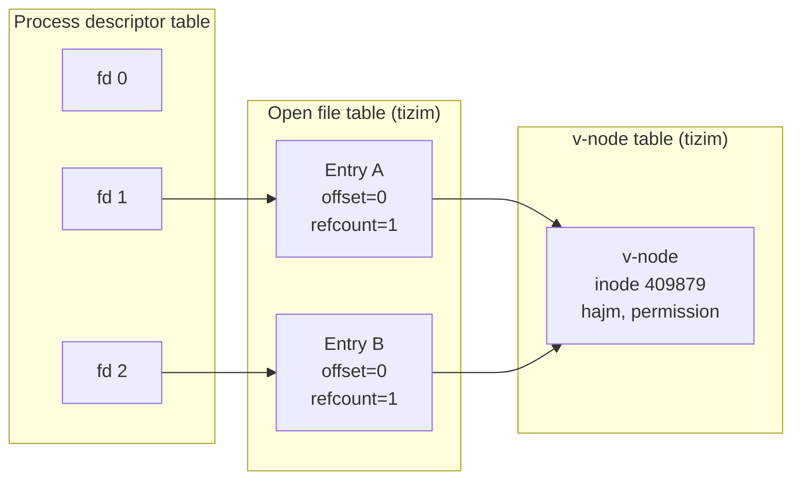
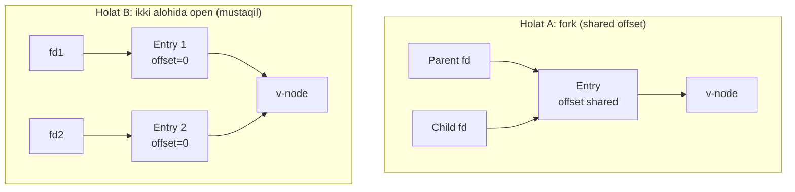
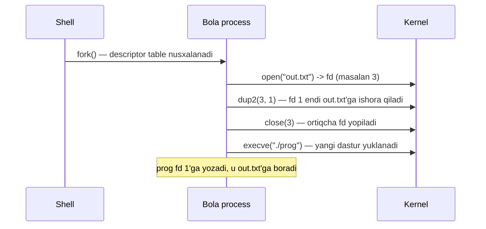
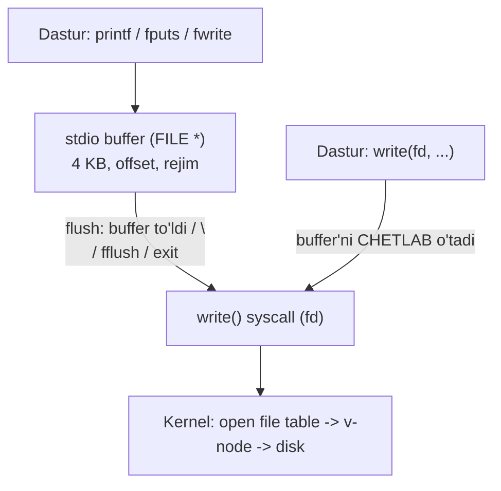

# 29. Fayl Metadata, Sharing va stdio — kernel uch jadvali, redirection, buffering

> Manba: CS:APP 2-nashr, 10.5-10.9 · Muhit: Ubuntu 24.04 x86-64 (Docker), gcc 13.3.0 · [← Oldingi](28-unix-io.md) · [Kurs xaritasi](00-README.md) · [Keyingi →](30-sockets.md)

## Nima uchun kerak

Shell'da `./prog > output.txt` yozganingda dastur kodini o'zgartirmasdan chiqishi faylga tushadi — bu sehr emas, `dup2` degan bitta syscall. `2>&1` ham xuddi shu mexanika. Ikkinchidan, agar bir dasturda `printf` va `write` aralashtirsang, chiqish tartibi kutilmaganda buziladi — sababi stdio **buffering**. Uchinchidan, `fork`'dan keyin ota va bola bitta faylni o'qisa, ular fayl **offset**'ini bo'lishadi (bola 'A' o'qisa, ota 'B' oladi). Va nihoyat, `inode` — faylning haqiqiy "kimligi", nom esa unga faqat ishora; `os.Stat`, `bufio.Writer`, container'ning stdout log yig'ishi — barchasi shu darsdagi tushunchalar ustiga qurilgan.

Amaliy misol: production'da "log fayli o'sib turibdi, lekin `du` bilan qarasak fayl bo'sh" degan g'alati holat — bu deleted-but-open fayl (refcount hali 1, chunki dastur fd'ni ushlab turibdi). Yoki "log rotation'dan keyin dastur eski faylga yozishda davom etyapti" — inode va open file entry sharing tushunilmagani sabab. Bu darsni tushungan Go backend developer bunday buglarni bir qarashda tashxis qiladi.

## Nazariya

Bu 10-bobning yakuni. 28-darsda `file descriptor`, `read`/`write`, short count va RIO'ni ko'rdik. Endi fayl **atrofidagi** mexanikani ochamiz: metadata, kernel qanday jadvallar bilan faylni kuzatadi, redirection va buffering.

Asosiy g'oyani oldindan aytib qo'yaman: `fd` — bu faylning o'zi emas, balki kernel ichidagi jadvallar zanjiriga **ishora** (indeks). Fayl offset, ochilish rejimi, hatto faylning haqiqiy metadata'si `fd`'da emas, kernel jadvallarida yashaydi. Shu tushunchani mahkam ushlasang, shared offset, redirection va leak — barchasi bitta modeldan kelib chiqadi. Buni "notional machine" sifatida ko'z oldingga keltir: har `read`/`write` bu jadvallar bo'ylab sayohat.

### 1. File metadata — stat va fstat

Faylning o'zi (ma'lumot) va fayl **haqidagi** ma'lumot (metadata) — ikki xil narsa. Metadata: hajm, egasi, permission, yaratilgan/o'zgartirilgan vaqt, tur, `inode` raqami, hard link soni. Buni `stat(nom, &st)` (fayl nomi orqali) yoki `fstat(fd, &st)` (ochiq `file descriptor` orqali) beradi. `ls -l` va `stat` buyruqlari aynan shu syscall ostida ishlaydi.

Muhim tushuncha — **inode** (index node): bu fayl tizimidagi noyob raqam, faylning "haqiqiy kimligi". Nom faylning o'zi emas — nom faqat `inode`'ga ishora (pointer). Bir `inode`'ga bir nechta nom ishora qilishi mumkin — bu **hard link**, va `st_nlink` (link soni) nechta nom shu `inode`'ga ishora qilishini ko'rsatadi. `inode` ichida faylning permission (07-Linux darsidagi `chmod` — `rw-r--r--` = 644), hajmi, vaqtlari va disk bloklariga pointerlar saqlanadi.

`st_mode` maydoni ham turni, ham permission'ni bitlarda ushlaydi. Turni makrolar aniqlaydi: `S_ISREG` (oddiy fayl), `S_ISDIR` (katalog), `S_ISLNK` (symlink), `S_ISFIFO` (pipe), `S_ISSOCK` (socket). Permission'ni ajratish uchun `st_mode & 0777` (past 9 bit).

`struct stat` uch xil vaqtni ham beradi, ularni chalkashtirmaslik muhim:

| Maydon | Nomi | Qachon yangilanadi |
|--------|------|---------------------|
| `st_atime` | access time | Fayl **o'qilganda** (`read`) |
| `st_mtime` | modify time | Fayl **mazmuni** o'zgarganda (`write`) |
| `st_ctime` | change time | **inode metadata** o'zgarganda (`chmod`, rename, link) |

Ko'p dasturchi `ctime`'ni "create time" deb o'ylaydi — bu xato: u **change** (inode o'zgarishi) vaqti, yaratilish emas. Yaratilish vaqti (`birthtime`/`crtime`) Linux'da ext4 saqlaydi, lekin klassik `struct stat`'da yo'q (`statx` syscall'i beradi). Bu vaqtlar `make`, `rsync`, backup vositalari uchun asosiy — ular `mtime`'ni solishtirib faylni qayta ishlash kerakligini hal qiladi.

### 2. Kernel uch jadvali — file sharing asosi

Kernel ochiq fayllarni **uch bosqichli** jadval bilan boshqaradi. Bu darsning yuragi:

| Jadval | Kimga tegishli | Nima saqlaydi |
|--------|----------------|----------------|
| **Descriptor table** | Har process alohida | `fd` raqami → open file table entry'ga pointer |
| **Open file table** | Butun tizim (bitta) | Fayl offset, refcount, ochilish rejimi (read/write); har `open` uchun **alohida** entry |
| **v-node table** | Butun tizim (bitta) | `inode` nusxasi — faylning haqiqiy metadata'si |

Zanjir: `fd` → descriptor table → open file entry (**offset shu yerda**) → v-node (**inode shu yerda**). Bir faylni ikki marta `open` qilsang — ikkita **alohida** open file entry hosil bo'ladi (ikki mustaqil offset), lekin ikkalasi **bir xil** v-node'ga ishora qiladi (fayl bitta).

Open file entry'dagi **refcount** — nechta descriptor shu entry'ga ishora qilayotganini sanaydi. `fork` yoki `dup`/`dup2` refcount'ni oshiradi (yangi entry emas, o'sha entry'ga yangi ishora), `close` esa kamaytiradi. Entry faqat refcount 0 bo'lganda yo'q qilinadi. Shuning uchun 28-darsdagi "har `open` uchun bitta `close`" qoidasi aniqroq: har **ishora** (fd) yopilishi kerak, aks holda entry va u orqali v-node band qolib, "too many open files" xatosiga olib keladi. Bu descriptor leak'ning ildizi.



### 3. File sharing — fork shared offset vs alohida open

Endi eng nozik joy. Ikki holatni farqla:

**Holat A — bitta `open`, keyin `fork`.** `fork` (22-dars) descriptor table'ni **nusxalaydi**: bola `fd`'lari otaning `fd`'lari bilan **bir xil** open file entry'ga ishora qiladi. Ya'ni ota va bola bitta offset'ni **bo'lishadi** (shared). Bola 1 bayt o'qisa, offset 0→1 bo'ladi; ota o'qiganda 1-baytdan boshlaydi (2-bayt oladi). Bu shell pipeline'lari va koordinatsiya uchun asos.

**Holat B — ikki alohida `open`.** Ikkita open file entry, har biri **o'z** offset'i (mustaqil). Ikkalasi ham 0-offsetdan boshlaydi, shuning uchun ikkalasi bir xil birinchi baytni o'qiydi.



### 4. Redirection — dup va dup2

Ikki qarindosh syscall bor. `dup(oldfd)` — `oldfd`'ning nusxasini **eng kichik bo'sh** fd raqamiga qo'yadi (raqamni o'zing tanlay olmaysan). `dup2(oldfd, newfd)` esa — `oldfd`'ni **aynan** `newfd` ustiga nusxalaydi (raqamni sen belgilaysan), shuning uchun redirection uchun aynan `dup2` kerak. Amalda `dup2`: `newfd` avval yopiladi (agar ochiq bo'lsa), keyin `newfd` ham `oldfd` ishora qilayotgan **o'sha** open file entry'ga ishora qiladigan bo'ladi. Ya'ni `dup2(fd, 1)` dan keyin `fd 1` (STDOUT) endi `fd` ochgan faylga yozadi. Muhim: `dup`/`dup2` yangi open file entry yaratmaydi — faqat mavjud entry'ga yangi ishora qo'shadi (refcount oshadi), shuning uchun ikkala fd offset'ni bo'lishadi (Demo 3 mantig'i).

Shell `>` mexanikasi aynan shu (Linux kursi 05-dars): shell `fork` qiladi, bolada faylni `open` qiladi, `dup2(fd, STDOUT_FILENO)` bilan STDOUT'ni faylga yo'naltiradi, keyin `exec` bilan dasturni ishga tushiradi. Dastur oddiygina `fd 1`'ga yozadi — u faylga borishini bilmaydi ham. `2>&1` esa `dup2(1, 2)` — stderr'ni stdout ketgan joyga yo'naltirish. Muhim tartib: `> file 2>&1` avval stdout'ni faylga, keyin stderr'ni stdout'ga; teskarisi boshqacha natija beradi.

`./prog > out.txt` uchun shell qiladigan qadamlar ketma-ketligi:



Nega `close(fd)` dan keyin ham fayl yozishga tayyor qoladi? Chunki `dup2` fd 1'ni o'sha open file entry'ga bog'ladi — refcount 2 bo'lgan edi, `close(3)` uni 1 ga tushirdi, entry hali tirik. Fayl faqat oxirgi ishora yopilganda (refcount 0) yopiladi.

### 5. Standard I/O — buffering qatlami

Unix I/O (`read`/`write`, `fd`) — past daraja, har chaqiruv bitta syscall. **stdio** (standart C kutubxonasi: `fopen`/`printf`/`fgets`/`fwrite`) esa `fd` **ustiga BUFFER qatlami** qo'shadi. `printf` darhol syscall qilmaydi — u xotiradagi buffer'ga yozadi. Buffer faqat quyidagilarda **flush** bo'ladi (haqiqiy `write` syscall):

- buffer to'lganda,
- dastur normal tugaganda,
- `fflush` chaqirilganda,
- (line-buffered rejimda) yangi qator `\n` yozilganda.

Uch rejim: **full buffering** (fayllar — buffer to'lganda flush), **line buffering** (terminal — `\n`da flush), **no buffering** (stderr — darhol). Buffering nima uchun kerak? 100 ta mayda `printf` o'rniga **bitta** katta `write` — syscall soni keskin kamayadi (21-dars: syscall qimmat). Lekin buning narxi bor: `printf` va `write`'ni aralashtirsang, tartib buziladi (write darhol chiqadi, printf buffer'da qoladi).

Diqqat qiladigan nozik holat: dastur terminaldan pipe'ga yo'naltirilganda buffering rejimi **o'zgaradi**. Terminalda `printf` line-buffered (`\n`da chiqadi), lekin `./prog | grep x` qilganda stdout endi terminal emas — full-buffered bo'ladi, ya'ni chiqish buffer to'lguncha ko'rinmaydi. Shuning uchun ba'zi dasturlar interaktiv rejimda darhol chiqib, pipe ostida "muzlab" turgandek ko'rinadi. Demo 4 aynan shu holatni ko'rsatadi (chiqish pipe'ga borgani uchun printf'lar oxirida flush bo'ldi). Buni majburan hal qilish: `setvbuf` bilan rejimni belgilash yoki har muhim yozuvdan keyin `fflush(stdout)`.

Buffer qatlamining tuzilishi quyidagicha — stdio `FILE *` ichida buffer va uning holatini saqlaydi, `fd` esa eng past qatlamda:



Diagrammada e'tibor ber: `write` buffer'ni **chetlab** to'g'ridan-to'g'ri syscall qiladi, `printf` esa buffer orqali o'tadi — Demo 4'dagi tartib buzilishining sababi aynan shu ikki yo'l.

### 6. Qaysi I/O ishlatish

| Vaziyat | Tavsiya |
|---------|---------|
| Disk fayl, matn, ko'p mayda yozish | **stdio** (buffer qulay, tez) |
| Socket, signal-safe kod | **Unix I/O** yoki RIO (28-dars) |
| Aralash `printf` + `write` | **Aralashtirma** — bittasini tanla |

Umumiy qoida: oddiy fayllar uchun stdio qulay va tez; network/socket (30-dars) uchun stdio ba'zi hollarda muammoli (buffering deadlock), shuning uchun Unix I/O yoki RIO afzal.

> **Oltin qoida:** offset `fd`'da emas — open file entry'da yashaydi; buffering `fd`'da emas — stdio/`bufio` qatlamida yashaydi. Ikkalasini ham "faylning o'zida" deb o'ylash — bu darsning eng ko'p uchraydigan xato modeli.

Nega socket'da stdio xavfli? stdio ikki tomonlama (read va write) bitta `FILE *`'da ishlaganda ichki buffer holatini boshqarish murakkab: ikki tomon bir-birini buffered javobini kutib **deadlock**'ga tushishi mumkin (client server javobini kutadi, lekin so'rovi hali stdio buffer'da flush qilinmagan). 28-darsdagi RIO (Robust I/O) aynan shu muammoni hal qilish uchun yozilgan: u buffered, lekin signal-safe va short count'ni to'g'ri boshqaradi. Amaliy qoida: **disk fayl → stdio/bufio; socket → RIO yoki Unix I/O**. Go'da bu masala yumshoq — `net.Conn` `io.Reader`/`io.Writer` interfeysini beradi va `bufio` ustidan qulay o'raladi, chunki Go runtime I/O'ni goroutine-friendly qiladi.

## Kod va isbot

Barcha demolar x86-64 csapp muhitida verify qilingan. gcc ba'zi funksiyalarda return qiymatini tekshirmasak kosmetik warning berishi mumkin — mantiqqa ta'sir qilmaydi, e'tiborsiz qoldiring. Demolar tartibi: metadata (1) → redirection (2) → file sharing (3) → buffering (4); markaziy ikkitasi — file sharing va buffering, ularni chuqur o'zlashtir.

### Demo 1 — stat: fayl metadata

```c
#include <stdio.h>
#include <sys/stat.h>
#include <time.h>

int main(void)
{
    FILE *f = fopen("sample.txt", "w");
    fprintf(f, "12 baytli fayl");
    fclose(f);

    struct stat st;
    stat("sample.txt", &st);
    printf("Hajm:        %ld bayt\n", (long)st.st_size);
    printf("Inode:       %ld\n", (long)st.st_ino);
    printf("Permission:  %o (oktal)\n", st.st_mode & 0777);
    printf("Turi:        %s\n", S_ISREG(st.st_mode) ? "oddiy fayl" : "boshqa");
    printf("Link soni:   %ld\n", (long)st.st_nlink);
    return 0;
}
```

Output:

```
Hajm:        14 bayt
Inode:       409879
Permission:  644 (oktal)
Turi:        oddiy fayl
Link soni:   1
```

`stat()` faylning **metadata**'sini beradi, ma'lumotini emas. Hajm 14 bayt — "12 baytli fayl" matni aslida 14 belgidan iborat (raqamga aldanma, haqiqiy bayt sanog'i). `inode` 409879 — fayl tizimidagi noyob ID; agar faylni rename qilsang, `inode` o'zgarmaydi (nom o'zgaradi, fayl o'sha). Permission 644 = `rw-r--r--` (07-Linux `chmod`). Link soni 1 — bu `inode`'ga hozircha bitta nom ishora qiladi; `ln sample.txt copy` qilsang, 2 bo'ladi. `fstat(fd, &st)` esa ochiq `fd` uchun aynan shu ma'lumotni beradi.

### Demo 2 — dup2: redirection (shell `>` qanday ishlaydi)

```c
#include <stdio.h>
#include <fcntl.h>
#include <unistd.h>

int main(void)
{
    printf("bu STDOUT'ga (terminal)\n");
    fflush(stdout);

    int fd = open("output.txt", O_WRONLY | O_CREAT | O_TRUNC, 0644);
    dup2(fd, STDOUT_FILENO);          /* STDOUT'ni faylga yo'naltir */
    close(fd);

    printf("bu endi output.txt'ga (redirect!)\n");   /* faylga boradi */
    fflush(stdout);
    return 0;
}
```

Terminal chiqishi:

```
bu STDOUT'ga (terminal)
```

output.txt ichi:

```
bu endi output.txt'ga (redirect!)
```

Bu shell redirect mexanikasining isboti. Birinchi `printf` STDOUT (fd 1) terminalga ishora qilganda ishladi — terminalda ko'rindi. Keyin `dup2(fd, STDOUT_FILENO)` fd 1'ni `output.txt` ustiga nusxaladi: endi fd 1 faylga ishora qiladi. `close(fd)` dan keyin ham fayl ochiq qoladi, chunki fd 1 hali unga ishora qilyapti (open file entry refcount hali 1). Ikkinchi `printf` **o'zgarishsiz** fd 1'ga yozdi — lekin u endi faylga bordi. Bu aynan `./prog > output.txt` qiladigan ish: shell `fork` qiladi, bolada `dup2`, keyin `exec`.

### Demo 3 — File sharing: fork shared offset vs alohida open

```c
#include <stdio.h>
#include <fcntl.h>
#include <unistd.h>
#include <sys/wait.h>

int main(void)
{
    int w = open("shared.txt", O_WRONLY|O_CREAT|O_TRUNC, 0644);
    write(w, "ABCDEFGHIJ", 10);
    close(w);

    /* Holat A: bitta open, fork -> offset BO'LISHILADI */
    int fd = open("shared.txt", O_RDONLY);
    if (fork() == 0) {
        char c; read(fd, &c, 1);
        printf("CHILD  o'qidi: '%c' (offset bo'lishildi)\n", c);
        return 0;
    }
    wait(NULL);
    char c; read(fd, &c, 1);
    printf("PARENT o'qidi: '%c' (child'dan KEYINGI bayt - shared offset)\n", c);
    close(fd);

    /* Holat B: ikki alohida open -> offset MUSTAQIL */
    int fd1 = open("shared.txt", O_RDONLY);
    int fd2 = open("shared.txt", O_RDONLY);
    char c1, c2;
    read(fd1, &c1, 1);
    read(fd2, &c2, 1);
    printf("fd1 o'qidi: '%c', fd2 o'qidi: '%c' (ikkalasi 'A' - mustaqil offset)\n", c1, c2);
    close(fd1); close(fd2);
    return 0;
}
```

Output:

```
CHILD  o'qidi: 'A' (offset bo'lishildi)
PARENT o'qidi: 'B' (child'dan KEYINGI bayt - shared offset)
fd1 o'qidi: 'A', fd2 o'qidi: 'A' (ikkalasi 'A' - mustaqil offset)
```

Bu kernel uch jadvalining eng aniq isboti. **Holat A**: `open` bitta open file entry yaratdi (offset=0). `fork` descriptor table'ni nusxaladi — bola va ota bir xil entry'ga ishora qiladi. Bola 1 bayt o'qidi: 'A', offset 0→1. Ota keyin o'qidi: 'B' (offset 1→2) — bo'lishilgan offset tufayli **navbatdagi** baytni oldi. **Holat B**: ikki alohida `open` = ikki alohida open file entry, har biri o'z offset'i (ikkalasi 0). Shuning uchun `fd1` va `fd2` ikkalasi 'A' — bir-biridan mustaqil. Xulosa: offset **descriptor**da emas, **open file entry**da yashaydi; kim entry'ni bo'lishsa, offset'ni ham bo'lishadi.

Offset'ning bosqichma-bosqich o'zgarishini kuzatsak (fayl ichi `ABCDEFGHIJ`):

| Qadam | Amal | Shared offset (A) | Natija |
|-------|------|--------------------|--------|
| 1 | `open` + `fork` | 0 | Ikkala process bir entry'da |
| 2 | Child `read` 1 bayt | 0 → 1 | Child oldi: **'A'** |
| 3 | `wait` — child tugadi | 1 (o'zgarmadi) | Offset saqlanib qoldi |
| 4 | Parent `read` 1 bayt | 1 → 2 | Parent oldi: **'B'** |

| Qadam | Amal | fd1 offset | fd2 offset | Natija |
|-------|------|-----------|-----------|--------|
| 1 | `open` fd1, `open` fd2 | 0 | 0 | Ikki mustaqil entry |
| 2 | `read` fd1 | 0 → 1 | 0 | fd1: **'A'** |
| 3 | `read` fd2 | 1 | 0 → 1 | fd2: **'A'** |

Ikki jadvalni yonma-yon qo'ysang, farq aniq: Holat A'da offset **bitta** ustunda o'sadi (bo'lishilgan), Holat B'da har fd o'z ustunida mustaqil o'sadi.

### Demo 4 — stdio buffering: printf vs write

```c
#include <stdio.h>
#include <unistd.h>

int main(void)
{
    printf("printf-1 ");           /* buffer'ga */
    write(1, "write-1 ", 8);       /* darhol */
    printf("printf-2 ");           /* buffer'ga */
    write(1, "write-2 ", 8);       /* darhol */
    printf("\n(printf'lar oxirida chiqadi - buffer flush)\n");
    return 0;
}
```

Output (toza):

```
write-1 write-2 printf-1 printf-2 
(printf'lar oxirida chiqadi - buffer flush)
```

Buffering'ning eng aniq isboti. Kodda tartib: printf-1, write-1, printf-2, write-2. Lekin chiqishda: **write-1 write-2 printf-1 printf-2**! Sabab: `write()` — to'g'ridan-to'g'ri syscall (21-dars), darhol ekranga chiqadi. `printf()` — stdio buffer'ga yozadi; buffer bu yerda faylga (pipe'ga) yo'naltirilgani uchun **full buffering** rejimida — faqat dastur tugaganda flush bo'ldi. Shuning uchun ikkala `write` oldin, ikkala `printf` oxirida (dastur yakunida) chiqdi. stdio `fd` ustiga buffer qatlami qo'shib, ko'p mayda `printf`'ni bitta katta `write`'ga birlashtiradi (syscall'ni kamaytiradi). Amaliy xulosa: `printf` va `write`'ni **aralashtirma** — tartib prognoz qilib bo'lmas holga keladi. Ehtiyoj bo'lsa, `fflush(stdout)` bilan majburan flush qil.

## Go dasturchiga ko'prik

Go bu tushunchalarni standart kutubxonada qulay o'raydi. Mapping quyidagicha:

- **Metadata** → `os.Stat(name)` yoki `file.Stat()` `FileInfo` qaytaradi: `Size()`, `Mode()`, `ModTime()`, `IsDir()`. Bu aynan `stat`/`fstat` ustidagi qatlam. `Mode()` permission bitlarini `os.FileMode` sifatida beradi.
- **stdio buffer ekvivalenti** → `bufio.Writer` va `bufio.Reader`. `bufio.NewWriter(f)` odatda 4 KB buffer ajratadi (fayl tizimi blok o'lchamiga mos). Ko'p mayda `Write` o'rniga bitta katta syscall — xuddi stdio'dagidek.
- **KRITIK: `bufio.Writer.Flush()` SHART.** Agar Flush chaqirmasang, buffer'da qolgan ma'lumot **yo'qoladi** — bu Go'da eng ko'p uchraydigan I/O xatosi. Odat: `defer w.Flush()` yoz.
- **os.Stdout / os.Stderr** → fd 1 va fd 2. `fmt.Println` bulardan yozadi.
- **Redirection** → `exec.Cmd.Stdout = file`. Bu ostidan Go aynan `dup2` qiladi: bola process'ning STDOUT'ini faylga bog'laydi. Shell `>` ning Go'dagi ekvivalenti.
- **io.MultiWriter** → bir yozuvni bir necha joyga (masalan fayl + terminal) — tee mexanikasi.
- **fmt.Fprintf(file, ...)** → istalgan `io.Writer`'ga formatli yozish (fayl, buffer, socket bir xil).

`bufio` nega tez? Xuddi stdio kabi: N ta mayda yozishni 1 ta syscall'ga yig'adi, syscall qimmat (21-dars). 100 ta log qatori = buffer'siz 100 syscall, `bufio.Writer` bilan taxminan 1 syscall.

Metadata olish Go'da qanday ko'rinadi (Demo 1 ning Go ekvivalenti):

```go
info, err := os.Stat("sample.txt")
if err != nil { log.Fatal(err) }
fmt.Println("Hajm:", info.Size())        // st_size
fmt.Println("Rejim:", info.Mode())       // st_mode (permission + tur)
fmt.Println("Vaqt:", info.ModTime())     // st_mtime
fmt.Println("Katalogmi:", info.IsDir())  // S_ISDIR
```

`os.Stat` ostidan aynan `stat` syscall'ini chaqiradi; `info.Mode().Perm()` esa `st_mode & 0777` ekvivalenti. `inode` kabi platformaga xos maydonlarga `info.Sys().(*syscall.Stat_t)` orqali yetish mumkin (masalan `.Ino`, `.Nlink`).

Buffered yozishning to'g'ri shakli — `Flush`'ni `defer` bilan kafolatlash:

```go
f, _ := os.Create("app.log")
defer f.Close()
w := bufio.NewWriter(f)   // 4 KB buffer (stdio ekvivalenti)
defer w.Flush()           // SHART: aks holda buffer'dagi log yo'qoladi
for i := 0; i < 100; i++ {
    fmt.Fprintf(w, "qator %d\n", i)   // 100 marta, lekin ~1 syscall
}
```

Bu yerda `defer` tartibiga e'tibor ber: `defer f.Close()` avval yozildi, `defer w.Flush()` keyin — LIFO tartibida `Flush` **avval** ishlaydi, keyin `Close`. Teskari yozsang, fayl yopilgach flush qilishga urinasan — ma'lumot yo'qoladi. Bu Demo 4'dagi buffering mantig'ining bevosita amaliy oqibati.

`io.MultiWriter(os.Stdout, file)` bir yozuvni ham terminalga, ham faylga yuboradi — Unix'dagi `tee` buyrug'ining Go ekvivalenti. `exec.Cmd`'da esa `cmd.Stdout = f` va `cmd.Stderr = f` bola process'ning fd 1/2'ni faylga bog'laydi — Go runtime buni ostidan `dup2` bilan bajaradi, ya'ni Demo 2'dagi redirection mexanikasi standart kutubxonada yashiringan.

## Real-world scenariylar

**1. High-throughput logging.** Har `log.Print` odatda bitta `write` syscall — sekundiga minglab log yozsa, syscall bosimi profil'da ko'rinadi. Yechim: `bufio.Writer` bilan `os.Stdout`'ni o'ra, log'larni buffer'ga yig', davriy Flush qil. Ehtiyot: crash bo'lsa, buffer'dagi (hali flush qilinmagan) log'lar yo'qoladi — muhim audit log uchun buffer kichik yoki tez flush qilinsin.

**2. Container stdout/stderr yig'ish.** 12-factor prinsipi: dastur log'ni faylga emas, `stdout`/`stderr`'ga yozsin. Container runtime (Docker/containerd) bola process'ning fd 1/2'ni pipe'ga `dup2` qiladi va log driver (json-file, fluentd) ularni yig'adi. Ya'ni sening `fmt.Println`'ing container'da avtomatik markazlashgan log'ga tushadi — hech qanday fayl yozmasang ham. Bu aynan Demo 2'dagi dup2 mexanikasi, faqat fayl o'rniga pipe. Muhim nuqta: container'da chiqishing full-buffered bo'lib qolmasligi uchun log kutubxonasi har yozuvda flush qilishi yoki liniyaviy buffering ishlatishi kerak — aks holda crash'da oxirgi (eng muhim) log qatorlari yo'qoladi. Go'ning `log` va `slog` paketlari har yozuvda `os.Stderr`'ga to'g'ridan yozib, bu muammoni chetlab o'tadi.

**3. fork'dan keyin shared fd.** Agar Go'da `os/exec` bilan bola process yaratsang va uning STDOUT'ini ota bilan bir faylga bog'lasang, ular offset'ni bo'lishishi mumkin (Demo 3, Holat A) — ikki yozuvchi bir-birining ustiga yozib qo'yishi kutilmagan buglarga olib keladi. Yechim: `O_APPEND` (har yozuv oxiriga atomik).

**4. Pipe ostida "muzlagan" chiqish.** CLI dasturing terminalda progress'ni chiroyli ko'rsatadi, lekin `./tool | tee log.txt` qilinganda chiqish uzoq vaqt ko'rinmaydi. Sabab: stdout terminaldan pipe'ga o'tganda full-buffered bo'ldi (nazariya 5). Yechim: muhim nuqtalarda `fflush(stdout)` (C) yoki `os.Stdout.Sync()` / buffer'ni Flush qilish (Go). CI/CD log'larida bu klassik muammo — buffer tufayli log crash'dan oldingi oxirgi qatorlarni ko'rsatmaydi.

**5. Log rotation va shared fd.** Log rotator (`logrotate`) faylni rename qilib yangisini yaratganda, dastur hali **eski** open file entry'ni (eski `inode`) ushlab turadi — yozuv o'chirilishi kerak bo'lgan eski faylga davom etadi. Shuning uchun rotator dasturga signal (`SIGHUP`) yuboradi: dastur faylni qayta `open` qilib yangi `inode`'ga fd oladi. Bu inode va fd sharing tushunchasining bevosita amaliy oqibati.

**6. Deleted-but-open fayl (disk to'ldi jumbog'i).** Dastur katta log faylini ochib turgan holda kimdir `rm` bilan faylni o'chiradi. `rm` faqat nomni (hard link) o'chiradi, `st_nlink` 0 bo'ladi, LEKIN dastur hali fd (refcount 1) ushlab turgani uchun `inode` va disk bloklari **band qoladi**. Natija: `ls` faylni ko'rsatmaydi, `du` uni sanamaydi, lekin disk to'la. Yechim: dasturni restart qilish yoki fd'ni yopish (refcount 0 → disk bo'shaydi). `lsof | grep deleted` bunday fayllarni topadi. Bu refcount modelining eng chalkash amaliy ko'rinishi.

**7. Metadata bilan tez tekshiruv.** Web server statik fayl bergancha `If-Modified-Since` header'ini `os.Stat().ModTime()` (ya'ni `st_mtime`) bilan solishtiradi — fayl o'zgarmagan bo'lsa, `304 Not Modified` qaytaradi va butun faylni o'qimaydi. Bu metadata (arzon `stat`) va ma'lumot (qimmat `read`) farqining klassik optimizatsiyasi: faqat metadata yetadigan joyda faylni umuman ochma.

## Zamonaviy yondashuv

Go ekotizimida `bufio` — standart yechim, va `io.Writer` interfeysi (28-darsda `io.Reader` ko'rgan edik) barcha yozuvchilarni bir xil qiladi: fayl, buffer, socket, gzip — hammasi `io.Writer`. Structured logging kutubxonalari (`slog` standart kutubxonada, `zerolog`, `zap`) ichida buffered yozuvni ishlatadi va JSON qatorlar chiqaradi.

Container log driver'lar (`json-file`, `fluentd`, `journald`) stdout/stderr'ni yig'ib markazlashtiradi — dastur faylga yozmaydi. Ko'p process bir log fayliga yozganda `O_APPEND` **atomik** yozuvni kafolatlaydi (yozuv oxiriga siljish + yozish bitta atomik amal) — bu shared offset muammosini yo'q qiladi. Aniq offset kerak bo'lsa, `pwrite`/`pread` (Go'da `WriteAt`/`ReadAt`) offset'ni argument sifatida oladi va open file table'dagi umumiy offset'ga tegmaydi — parallel I/O uchun ideal. Yuqori unumdorlik uchun `sendfile`/`splice` (zero-copy) ma'lumotni user-space'ga ko'chirmasdan fd'dan fd'ga uzatadi.

Zamonaviy I/O yo'nalishlarini qisqa jamlab:

| Muammo | Klassik | Zamonaviy yechim |
|--------|---------|-------------------|
| Ko'p mayda syscall | har `write` bitta syscall | `bufio` / buffered logging |
| Shared offset raqobati | umumiy offset ustma-ust yozuv | `O_APPEND` (atomik) yoki `pwrite` (offset argument) |
| Log yig'ish | dastur faylga yozadi | stdout/stderr → container log driver (12-factor) |
| Fayldan socketga nusxa | read user-space, keyin write | `sendfile`/`splice` (zero-copy) |
| Yuqori parallel I/O | thread-per-syscall bloklash | `io_uring` (batafsil, asinxron submission) |

`io_uring` — Linux'ning eng yangi asinxron I/O interfeysi: syscall'larni **batch** qilib, kernel bilan umumiy ring buffer orqali almashadi, bu syscall overhead'ini deyarli yo'qotadi. Go hozircha uni to'g'ridan-to'g'ri standart kutubxonada bermaydi, lekin runtime netpoller epoll ustida ishlaydi va aksariyat holatda buffered `io.Writer` yetarli tez.

## Keng tarqalgan xatolar

1. **printf va write aralashtirish** — Demo 4 ko'rsatdi: buffer tufayli chiqish tartibi buziladi. Bittasini tanla yoki har `printf`'dan keyin `fflush`.
2. **`bufio.Writer.Flush()` unutish** — Go'ning eng klassik I/O bugi: buffer'da qolgan ma'lumot indamay yo'qoladi. Har doim `defer w.Flush()`.
3. **fork'dan keyin shared offset e'tiborsizligi** — ota va bola bir faylga yozsa, offset bo'lishilib bir-birini ustiga yozadi. `O_APPEND` ishlat.
4. **fd close unutish** (28-dars) — har `open`/`os.Open` uchun `close`/`defer f.Close()`; aks holda descriptor leak, "too many open files".
5. **Katta throughput'da buffer'siz yozish** — har mayda yozuv bitta syscall; profil'da syscall bosimi. `bufio` bilan birlashtir.
6. **`ctime`'ni "create time" deb o'ylash** — u aslida inode **change** vaqti (`chmod`, rename ham yangilaydi). Yaratilish vaqti klassik `stat`'da yo'q, `statx` beradi.
7. **Buffered writer'ni parallel goroutine'lardan himoyasiz ishlatish** — `bufio.Writer` thread-safe emas; bir nechta goroutine bir writer'ga yozsa, buffer buziladi. `sync.Mutex` yoki bitta yozuvchi goroutine (channel orqali) ishlat.

## Amaliy mashqlar

**1.** Demo 3, Holat A'da bola 'A', ota 'B' o'qidi. Nega ota 'A' emas 'B' oldi?

<details><summary>Yechim</summary>
`fork` descriptor table'ni nusxaladi, lekin ota va bola bitta open file entry'ga ishora qiladi — offset **bo'lishilgan**. Bola 1 bayt o'qib offset'ni 0→1 qildi; ota o'qiganda offset 1'dan boshladi va navbatdagi bayt 'B'ni oldi.
</details>

**2.** Demo 3, Holat B'da `fd1` va `fd2` ikkalasi 'A' o'qidi. Nega?

<details><summary>Yechim</summary>
Ikki alohida `open` = ikki **alohida** open file entry, har biri o'z offset'i (ikkalasi 0). Ular offset'ni bo'lishmaydi, shuning uchun ikkalasi ham birinchi baytni ('A') o'qidi.
</details>

**3.** Demo 2'da `dup2(fd, 1)` aniq nima qiladi va nega ikkinchi `printf` faylga bordi?

<details><summary>Yechim</summary>
`dup2(fd, 1)` fd 1'ni (avval yopib) `fd` ishora qilayotgan open file entry ustiga nusxalaydi — endi fd 1 `output.txt`'ga ishora qiladi. `printf` fd 1'ga yozadi, lekin u endi faylga bog'langan, shuning uchun chiqish faylga tushdi.
</details>

**4.** Demo 4'da nega write-1 printf-1'dan **oldin** chiqdi, garchi kodda printf-1 birinchi bo'lsa?

<details><summary>Yechim</summary>
`write` — darhol syscall. `printf` — stdio buffer'ga yozadi, buffer faqat dastur tugaganda flush bo'ldi. Shuning uchun write'lar darhol, printf'lar dastur yakunida chiqdi.
</details>

**5.** Go'da `bufio.NewWriter(f)` bilan 100 ta qator yozib, dastur oxirida `Flush` chaqirmasang nima bo'ladi?

<details><summary>Yechim</summary>
Buffer'da (odatda 4 KB) qolgan ma'lumot faylga yozilmasdan yo'qoladi — fayl bo'sh yoki chala qoladi. `defer w.Flush()` shu bugni oldini oladi.
</details>

**6.** Faylni `mv old.txt new.txt` qilsang, `inode` o'zgaradimi? Nega?

<details><summary>Yechim</summary>
O'zgarmaydi. `inode` — faylning haqiqiy kimligi; nom faqat `inode`'ga ishora. `mv` (bir fayl tizimi ichida) faqat katalog yozuvidagi nomni o'zgartiradi, `inode` va ma'lumot o'sha joyda qoladi.
</details>

**7.** Bitta faylni `ln file.txt link.txt` bilan hard link qilsang, `st_nlink` qanday o'zgaradi va faylni `rm file.txt` qilsak ma'lumot yo'qoladimi?

<details><summary>Yechim</summary>
`st_nlink` 1'dan 2'ga oshadi (ikki nom bir `inode`). `rm file.txt` faqat bitta nomni o'chiradi, `st_nlink` 1 bo'ladi; `inode` va ma'lumot `link.txt` orqali hali mavjud. Ma'lumot faqat oxirgi hard link o'chganda (nlink 0) yo'qoladi.
</details>

**8.** Demo 2'da `dup2(fd, 1)` dan keyin `close(fd)` bor. Nega bu `close` faylni yopib qo'ymaydi va ikkinchi `printf` hali ham faylga yozadi?

<details><summary>Yechim</summary>
`dup2` fd 1'ni fd bilan bir open file entry'ga bog'ladi — refcount 2 bo'ldi. `close(fd)` refcount'ni 1 ga tushiradi, entry hali tirik (fd 1 unga ishora qilyapti). Fayl faqat refcount 0 bo'lganda yopiladi, ya'ni fd 1 ham yopilganda (dastur tugaganda).
</details>

**9.** `./tool` terminalda progress'ni darhol ko'rsatadi, lekin `./tool | tee log.txt` da chiqish uzoq "muzlab" turadi. Nega va qanday tuzatasan?

<details><summary>Yechim</summary>
Terminalda stdout line-buffered (`\n`da chiqadi), pipe'ga yo'naltirilganda full-buffered bo'ladi (faqat buffer to'lganda). Yechim: muhim yozuvlardan keyin `fflush(stdout)` (C) yoki buffer'ni Flush qilish (Go); yoki `setvbuf` bilan line-buffered majburlash.
</details>

**10.** Ikki alohida process bir log fayliga `O_APPEND`siz yozsa nima muammo, `O_APPEND` uni qanday hal qiladi?

<details><summary>Yechim</summary>
`O_APPEND`siz har process o'z offset'idan yozadi (alohida open entry) — ular bir-birining ustiga yozib log'ni buzadi. `O_APPEND` har `write`da "oxiriga siljish + yozish"ni **atomik** qiladi, shuning uchun yozuvlar bir-birini ustiga chiqmaydi.
</details>

## Cheat sheet

Bir qarashda takrorlash uchun asosiy tushunchalar jadvali:

| Tushuncha | Nima | Eslab qolish |
|-----------|------|---------------|
| `stat` / `fstat` | Fayl metadata (nom / fd orqali) | `ls -l` ostidagi syscall |
| inode | Faylning noyob ID, "haqiqiy kimligi" | Nom emas — inode fayl; nom faqat ishora |
| Descriptor table | Har process: fd → open file entry | Fork nusxalaydi |
| Open file table | Tizim: offset + refcount, har open uchun alohida | **Offset shu yerda** |
| v-node table | Tizim: inode, fayl ma'lumoti | Bir faylga bir v-node |
| Shared offset | fork/dup: bir entry'ni bo'lishish | Child 'A' → parent 'B' |
| Mustaqil offset | Ikki alohida open | fd1 'A', fd2 'A' |
| `dup2(fd, 1)` | STDOUT'ni fd'ga yo'naltirish | Shell `>` mexanikasi |
| stdio buffer | fd ustiga buffer qatlami | printf buffer'ga, write darhol |
| Full / line buffering | Fayl → to'lganda / terminal → `\n` | Aralashtirma |
| `bufio.Writer` + Flush | Go buffered yozish | **Flush unutma — yo'qoladi** |
| Unix I/O vs stdio | Past daraja vs buffered | Socket → Unix I/O; fayl → stdio |
| `O_APPEND` | Oxiriga atomik yozuv | Ko'p yozuvchi bir log fayliga |
| refcount | Entry'ga nechta fd ishora qiladi | fork/dup oshiradi, close kamaytiradi |
| Deleted-but-open | rm bo'ldi, fd hali ushlab turibdi | Disk band qoladi (refcount > 0) |
| `ctime` | inode **change** vaqti | "Create" EMAS — chmod ham yangilaydi |
| RIO (28-dars) | Signal-safe buffered I/O | Socket uchun stdio o'rniga |

## Qo'shimcha manbalar

- [File descriptor — Wikipedia](https://en.wikipedia.org/wiki/File_descriptor) — descriptor / open file / v-node uch jadvali
- [Redirecting stdout with dup2 — Baeldung](https://www.baeldung.com/linux/c-dup2-redirect-stdout) — dup2 va shell redirection
- [Efficient Buffering — Go Optimization Guide](https://goperf.dev/01-common-patterns/buffered-io/) — bufio unumdorlik va Flush
- [Pipes, Forks and Dups — rozmichelle](https://www.rozmichelle.com/pipes-forks-dups/) — dup2 va pipe mexanikasi chuqur
- Redirect/pipe amaliyoti: [Linux kursi 05-dars](../5. Linux/1. Linux commands/05-redirection-and-pipelines.md)
- Oldingi dars: [28. Unix I/O](28-unix-io.md) · Keyingi: [30. Sockets](30-sockets.md) · [Kurs xaritasi](00-README.md)
