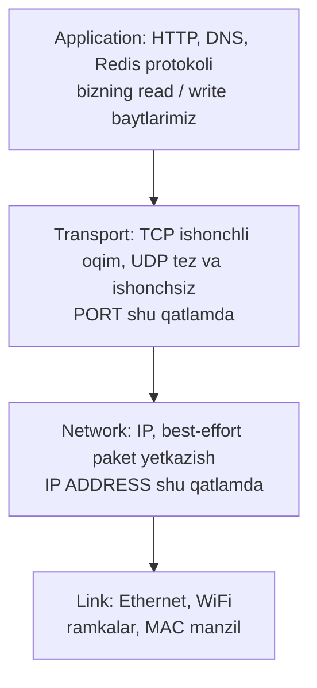
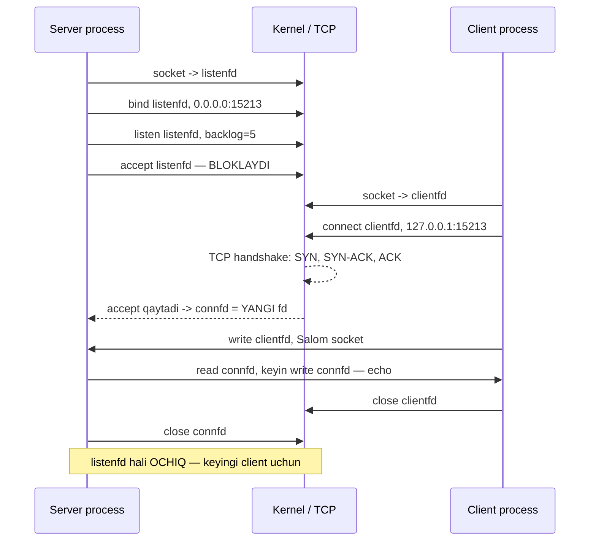
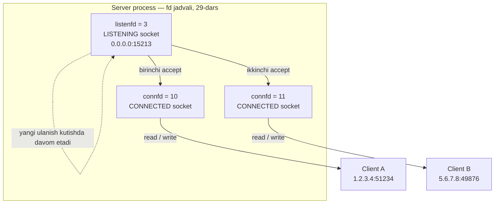

# 30. Sockets Interface — net.Listen ostidagi dunyo

> Manba: CS:APP 2-nashr, 11.1-11.4 · Muhit: Ubuntu 24.04 x86-64 (Docker), gcc 13.3.0, go 1.22.2 · [← Oldingi](29-file-metadata-sharing.md) · [Kurs xaritasi](00-README.md) · [Keyingi →](31-web-server.md)

## Nima uchun kerak

Go'da server yozish bitta qator: `ln, _ := net.Listen("tcp", ":8080")`. Bu "sehr" emas — ostida to'rtta syscall bor: `socket()`, `bind()`, `listen()` va keyin `accept()`. Shu to'rttasini bilmasang, `net` paketi qora quti bo'lib qoladi, va u qora quti sindirilganda (production'da) sen nima bo'layotganini tushunmaysan.

Bu dars uchta savolga javob beradi. Birinchi: **nega socket ham `file descriptor`** — ya'ni nega `net.Conn` ustida `bufio`, `io.Copy`, `io.ReadFull` (28-dars) hech qanday moslashtirishsiz ishlaydi. Ikkinchi: **nega byte order konversiyasi shart** — x86 little-endian, tarmoq big-endian (02-dars), va `htons` unutilsa port butunlay boshqa raqamga aylanadi. Uchinchi: **"address already in use" nima** — TCP'ning `TIME_WAIT` holati va `SO_REUSEADDR` opsiyasi.

Amaliy foydasi darhol seziladi: konteynerda `127.0.0.1:8080` ga bind qilingan server tashqaridan nega ko'rinmaydi, `too many open files` nega minglab ulanishda chiqadi, `conn.Read` nega xabarni bo'lak-bo'lak beradi — bularning hammasi shu darsdagi bitta modeldan kelib chiqadi. 31-darsda shu poydevor ustiga HTTP server quramiz.

## Nazariya

### 1. Client-server modeli — transaction

Deyarli har qanday tarmoq dasturi bitta naqshga tayanadi: **client-server** modeli. Server — biror **resurs** egasi (fayl, ma'lumotlar bazasi, hisoblash quvvati), client — shu resursdan foydalanmoqchi bo'lgan tomon.

Muhim nozik nuqta: client va server — bu **process**'lar (22-dars), mashinalar emas. Bitta mashinada client ham, server ham ishlashi mumkin — bizning demoda aynan shunday bo'ladi (`127.0.0.1`).

Ular orasidagi asosiy amal — **transaction** (bitim). To'rt qadam:

1. Client serverga **so'rov** (request) yuboradi;
2. Server so'rovni oladi va **resurs bilan ishlaydi** (faylni o'qiydi, DB'ga so'rov qiladi);
3. Server **javob** (response) qaytaradi;
4. Client javobni oladi va qayta ishlaydi (masalan, ekranga chiqaradi).

Bu "transaction" ma'lumotlar bazasidagi ACID transaction emas — atomiklik, rollback yo'q. Nomlar bir xil, ma'nolar boshqa; chalkashtirma.

### 2. Tarmoq ierarxiyasi — LAN, WAN, Internet

Dastur nuqtai nazaridan tarmoq — bu shunchaki **I/O qurilma** (01-dars). Diskdan bayt oqimi keladi, tarmoqdan ham bayt oqimi keladi; farq — manba, mexanika bir xil.

Ierarxiya pastdan yuqoriga:

- **LAN** (Local Area Network) — bitta bino/ofis ichidagi tarmoq. Klassik texnologiya: Ethernet segment (hostlar + switch).
- **WAN / internet** — bir nechta LAN router'lar bilan bog'lanadi. Bu allaqachon **internetwork** (kichik "i" bilan) — turli xil texnologiyalardan iborat aralash tarmoq.
- **Internet** (katta "I") — global, TCP/IP protokollari ustida ishlaydigan yagona tarmoq.

Bu yerda tub savol: Ethernet, WiFi va optik tola bir-biriga umuman o'xshamaydi — ular qanday **bitta** tarmoqqa birlashadi? Javob: **protokol** ularning farqini yashiradi. IP protokoli ikkita narsani beradi:

- **Naming scheme** — har host uchun yagona formatdagi manzil (IP address);
- **Delivery mechanism** — paketlarni bir hostdan boshqasiga yetkazish usuli.

Protokollar **qatlamlarga** (layers) bo'linadi; har qatlam o'zidan pastdagisini "bilmaydi", faqat interfeysidan foydalanadi:



Qatlamlar orasidagi mas'uliyat taqsimoti:

| Qatlam | Protokol | Kafolat | Nima aniqlaydi |
|--------|----------|---------|----------------|
| Network | **IP** | Hech qanday — best-effort | Paket **qaysi mashinaga** boradi |
| Transport | **TCP** | Ishonchli, tartibli bayt oqimi | Paket **qaysi process'ga** boradi |
| Transport | **UDP** | Yo'q — tez, datagram | Xuddi shu, lekin kafolatsiz |

**IP best-effort** degani: paket yo'qolishi, ikki marta kelishi yoki tartibsiz kelishi mumkin — IP hech narsa va'da qilmaydi. **TCP** shu ishonchsiz poydevor ustida ishonchli **bayt oqimi** (byte stream) yaratadi: har paketga sequence number qo'yadi, yo'qolganini qayta yuboradi (retransmission), tartibini tiklaydi, tezlikni boshqaradi (flow va congestion control).

Bitta juda muhim oqibat: TCP — bu **oqim**, "xabarlar" emas. TCP xabar chegarasini (message boundary) **saqlamaydi**. Sen bitta `write` bilan 100 bayt yuborsang, qabul qiluvchi ularni 40 + 60 bayt bo'lib olishi mumkin. Bu 28-darsdagi **short count**ning tarmoqdagi ko'rinishi va u yerdan `bufio` / `io.ReadFull` zarurati kelib chiqadi.

### 3. IP address va port — kim va qayerda

**IP address** mashinani aniqlaydi. IPv4 — 32-bitli son (`0.0.0.0` dan `255.255.255.255` gacha), inson uchun nuqtali shaklda yoziladi: `127.0.0.1`. C'da u `struct in_addr` ichida oddiy `uint32_t` bo'lib yashaydi — va u **doim network byte order**da saqlanadi (7-bo'limga qara).

Lekin bitta mashinada yuzlab process ishlaydi. Paket kelganda kernel uni **kimga** berishini qanday biladi? **Port** — 16-bitli son — aynan shu savolga javob beradi: u host ichidagi **process**ni (aniqrog'i, socket'ni) aniqlaydi.

> **IP mashinani topadi, port shu mashinadagi process'ni topadi. Socket address = IP:port.**

Portlar ikki turga bo'linadi:

| Tur | Diapazon | Kim beradi | Misol |
|-----|----------|-----------|-------|
| **Well-known** | 0-1023 | Kelishuv (IANA), root huquqi kerak | 22 (ssh), 80 (HTTP), 443 (HTTPS) |
| **Registered / ephemeral** | 1024-65535 | Dastur yoki kernel avtomatik | 5432 (postgres), 6379 (redis), 8080 |

Server porti **oldindan ma'lum** bo'lishi kerak (client uni bilishi shart) — shuning uchun server `bind` bilan portni **o'zi tanlaydi**. Client porti esa muhim emas — kernel `connect` vaqtida bo'sh **ephemeral port**ni avtomatik beradi. Shuning uchun client kodida `bind` yo'q.

Endi eng muhim xulosa. TCP ulanish bitta port bilan emas, **to'rtlik** (4-tuple) bilan aniqlanadi:

```
(client IP, client port, server IP, server port)
```

Ana shuning uchun bitta server porti (masalan 15213) bir vaqtda **minglab** client bilan ishlay oladi: har ulanishning 4-tupli noyob, chunki client tomondagi IP yoki port farq qiladi.

### 4. DNS — nom IP ga aylanadi

Inson `api.example.com` ni eslaydi, `connect()` esa raqamli IP talab qiladi. Bu bo'shliqni **DNS** (Domain Name System) — butun dunyoga tarqalgan taqsimlangan ma'lumotlar bazasi to'ldiradi: nom → IP.

C'da bu ish uchun zamonaviy funksiya — **`getaddrinfo()`**, eskirgani — `gethostbyname()`. Go'da: `net.LookupHost` yoki `net.Resolver`; `net.Dial("tcp", "api.example.com:80")` esa DNS lookup'ni **o'zi ichida** bajaradi.

Yodda tut: DNS — socket'dan **oldingi** qadam va u **bloklaydi** (tarmoq bo'ylab so'rov ketadi, o'nlab millisekund). Sekin `Dial` sabablarining eng ko'p uchraydigani — TCP emas, DNS.

### 5. Socket — "hamma narsa fayl" ning tarmoq versiyasi

Endi darsning yuragi. Kitobning mashhur ta'rifi:

> **Dastur nuqtai nazaridan socket — bu ochiq fayl (`file descriptor`); kernel nuqtai nazaridan — ulanishning oxirgi nuqtasi (endpoint).**

`socket()` syscall'i **fd** qaytaradi — xuddi `open()` kabi (28-dars). Bu bitta jumla juda katta amaliy oqibatga ega: socket ustida oddiy **`read`** va **`write`** ishlaydi. Alohida "network read" yo'q. 29-darsdagi kernel uch jadvali ham o'z kuchida: socket ham v-node'ga ega (`S_ISSOCK` makrosi shuni tekshiradi), `dup2` socket'ga ham ishlaydi (`inetd` shunday qilgan).

Farqlarini ham bil:

| | Oddiy fayl | Socket |
|--|-----------|--------|
| `lseek` (offset) | Ishlaydi | **Ishlamaydi** — oqimda "orqaga" qaytish yo'q |
| Yo'nalish | Odatda bir tomonlama | **Ikki tomonlama** (o'qish ham, yozish ham) |
| Short count | Kamdan-kam (fayl oxirida) | **Deyarli har doim** — paketlar bo'linadi |
| Yopilishi | `close` | `close`, lekin TCP `TIME_WAIT`ga o'tadi |

### 6. Socket API — server va client qadamlari

Ikki tomon ikki xil ketma-ketlik bajaradi:

- **Server:** `socket()` → `bind()` → `listen()` → `accept()` → `read`/`write` → `close()`
- **Client:** `socket()` → `connect()` → `write`/`read` → `close()`



Har bir chaqiruvni alohida ochamiz.

**`socket(AF_INET, SOCK_STREAM, 0)`** — endpoint yaratadi va fd qaytaradi. `AF_INET` = IPv4 (`AF_INET6` = IPv6), `SOCK_STREAM` = TCP (`SOCK_DGRAM` = UDP). Bu fd hali "yarim tayyor": u mavjud, lekin **manzili yo'q** va hech kim bilan bog'lanmagan.

**`bind(fd, addr, len)`** — kernel'ga "men shu IP:port'man" deb aytadi. Bu yerda `INADDR_ANY` (= `0.0.0.0`) juda muhim: u "shu mashinaning **har qanday** interfeysida tingla" degani (loopback, LAN IP, public IP). Agar `127.0.0.1` ga bind qilsang, faqat **shu mashinadan** ulanish mumkin bo'ladi — konteynerdagi server tashqaridan ko'rinmasligining eng ko'p uchraydigan sababi aynan shu.

**`listen(fd, backlog)`** — bu yerda tub o'zgarish yuz beradi. `socket()` qaytargan fd **active** socket'dir — ya'ni u "client bo'lishga tayyor" (`connect` qilishi mumkin). `listen()` uni **passive** (**listening**) socket'ga aylantiradi: endi u ulanish **kutadi**. `backlog` — kernel'dagi tayyor, lekin hali `accept` qilinmagan ulanishlar navbatining uzunligi (Linux'da: accept queue). Navbat to'lsa, yangi ulanishlar rad etiladi yoki kutadi.

**`accept(listenfd, cliaddr, len)`** — **bloklaydi**, client kelguncha kutadi. Va eng muhimi:

> **`accept` YANGI fd (`connfd`) qaytaradi. `listenfd` tinglashda QOLADI.**

Nega ikkita fd? Chunki serverning ikki xil ishi bor: (1) **yangi** ulanishlarni qabul qilishda davom etish, (2) **mavjud** client bilan gaplashish. `listenfd` — "qabulxona", u umr bo'yi bitta va faqat ulanish kutadi. Har `accept` esa yangi `connfd` beradi — u aynan **shu bitta client** bilan muloqot kanali:



Har `connfd` — bitta fd. Minglab client = minglab fd, va bu yerdan `ulimit -n` cheklovi (28-dars) va `too many open files` xatosi kelib chiqadi.

**`connect(fd, servaddr, len)`** — client tomoni. TCP **three-way handshake**ni (SYN → SYN-ACK → ACK) boshlaydi va ulanish o'rnatilguncha bloklaydi. Muvaffaqiyatli tugasa, fd endi ulangan; server tomonda esa `accept` shu paytda qaytadi.

### 7. Byte order — nega htons/htonl SHART

02-darsda ko'rdik: x86-64 — **little-endian** (eng kichik bayt eng past manzilda). Lekin Internet protokollari (IP va TCP header'lari, shu jumladan port va IP maydonlari) **big-endian** deb belgilangan. Bu kelishuv **network byte order** deb ataladi.

Nega big-endian? Sof tarixiy sabab: 1970-80 yillarda tarmoq standartlari yozilganda Motorola/IBM mashinalari big-endian edi, va kelishuv shunday muhrlandi. Texnik ustunlik emas — shunchaki **yagona standart**, chunki turli mashinalar bir-birini tushunishi kerak.

Konversiya funksiyalari:

| Funksiya | Nima o'giradi | Ishlatiladi |
|----------|---------------|-------------|
| `htons` | host → network, **16-bit** (short) | **port** |
| `htonl` | host → network, **32-bit** (long) | **IPv4 address** |
| `ntohs` / `ntohl` | teskari (network → host) | qabul qilingan maydonlar |

Konkret misol — nega buni unutish halokatli. Bizning port: 15213 = `0x3B6D`. Little-endian mashinada xotirada u `6D 3B` bo'lib yotadi. Agar `htons` siz to'g'ridan-to'g'ri yozsak, tarmoq bu baytlarni o'z tartibida (big-endian) o'qiydi va `0x6D3B` = **27963** deb tushunadi. Server 27963 portda tinglaydi, client 15213 ga uriladi — va hech qachon uchrashmaydi.

Muhim odat: "men x86'daman, konversiya kerak emas" — noto'g'ri fikr. Big-endian mashinada bu funksiyalar **hech narsa qilmaydi** (no-op), shuning uchun ularni doim yozish kodni **portable** qiladi va hech qanday narx qo'shmaydi.

E'tibor ber: `inet_pton("127.0.0.1", ...)` satrni to'g'ridan-to'g'ri network byte order'ga o'giradi — u yerda qo'shimcha `htonl` kerak emas.

### 8. SO_REUSEADDR va TIME_WAIT

TCP ulanish yopilganda, uni **birinchi bo'lib yopgan** tomon `TIME_WAIT` holatiga o'tadi va u yerda 2×MSL (odatda 30-120 soniya) turadi. Ikki sabab bor: (1) tarmoqda kechikib qolgan paketlar shu port bilan ochiladigan **yangi** ulanishga tushib qolmasin; (2) oxirgi ACK yo'qolsa, uni qayta yuborish imkoni bo'lsin.

Amaliy oqibat: serverni to'xtatib **darhol** qayta ishga tushirsang, `bind()` xato beradi — **`Address already in use`** (`EADDRINUSE`). Port aslida bo'sh, lekin eski ulanish `TIME_WAIT`da va kernel portni "band" deb hisoblaydi.

Yechim — `setsockopt(fd, SOL_SOCKET, SO_REUSEADDR, ...)`: "TIME_WAIT'dagi manzilga ham bind qilishga ruxsat ber". Har bir jiddiy server dasturi buni birinchi qadamda qiladi. Go `net` paketi buni **default** qo'yadi — shuning uchun Go serverni qayta ishga tushirish muammosiz.

## Kod va isbot

### Demo 1 — TCP echo server: socket, bind, listen, accept

```c
#include <stdio.h>
#include <stdlib.h>
#include <string.h>
#include <unistd.h>
#include <arpa/inet.h>

int main(void)
{
    /* 1. socket - endpoint yaratish */
    int listenfd = socket(AF_INET, SOCK_STREAM, 0);
    int opt = 1;
    setsockopt(listenfd, SOL_SOCKET, SO_REUSEADDR, &opt, sizeof(opt));

    /* 2. bind - manzil/portga bog'lash */
    struct sockaddr_in addr = {0};
    addr.sin_family = AF_INET;
    addr.sin_addr.s_addr = htonl(INADDR_ANY);   /* network byte order! */
    addr.sin_port = htons(15213);
    bind(listenfd, (struct sockaddr*)&addr, sizeof(addr));

    /* 3. listen - tinglash rejimiga o'tish */
    listen(listenfd, 5);
    printf("SERVER: port 15213 da tinglayapman\n");
    fflush(stdout);

    /* 4. accept - ulanishni qabul qilish (BLOKLAYDI) */
    int connfd = accept(listenfd, NULL, NULL);
    printf("SERVER: ulanish qabul qilindi (yangi fd=%d)\n", connfd);

    /* 5. echo: o'qib, qaytarish */
    char buf[128];
    ssize_t n = read(connfd, buf, sizeof(buf));
    buf[n] = 0;
    printf("SERVER: oldi: %s", buf);
    write(connfd, buf, n);                       /* echo back */

    close(connfd);
    close(listenfd);
    return 0;
}
```

Ketma-ketlikni qadam-baqadam o'qi. `socket()` fd beradi, lekin u hali manzilsiz. `setsockopt(SO_REUSEADDR)` — `bind`'dan **oldin** chaqirilishi shart, aks holda ta'siri bo'lmaydi. `bind` `struct sockaddr_in` orqali manzilni beradi: `sin_family` = IPv4, `sin_addr` = `INADDR_ANY` (barcha interfeyslar), `sin_port` = 15213.

Ikkala maydonda ham konversiya bor: `htonl` (32-bit IP uchun) va `htons` (16-bit port uchun). `listen(listenfd, 5)` fd'ni passive socket'ga aylantiradi, `5` — accept navbati uzunligi.

`fflush(stdout)` bejiz emas (29-dars): chiqish pipe'ga yo'naltirilganda stdio full-buffered bo'ladi va `accept` bloklab qolganda xabar ekranga chiqmay qolardi.

Diqqat markazida — `accept`. U **bloklaydi** va client kelganda **yangi** fd qaytaradi. Keyingi qatorlarga qara: `read`/`write` `connfd` ustida ishlaydi, `listenfd` ustida emas. Va bular — 28-darsdagi **o'sha** `read`/`write`, hech qanday "tarmoq versiyasi" emas. Socket = fd.

### Demo 2 — TCP client: socket, connect

```c
#include <stdio.h>
#include <string.h>
#include <unistd.h>
#include <arpa/inet.h>

int main(void)
{
    int fd = socket(AF_INET, SOCK_STREAM, 0);
    struct sockaddr_in addr = {0};
    addr.sin_family = AF_INET;
    addr.sin_port = htons(15213);
    inet_pton(AF_INET, "127.0.0.1", &addr.sin_addr);

    connect(fd, (struct sockaddr*)&addr, sizeof(addr));
    printf("CLIENT: ulandim\n");

    const char *msg = "Salom, socket!\n";
    write(fd, msg, strlen(msg));

    char buf[128];
    ssize_t n = read(fd, buf, sizeof(buf));
    buf[n] = 0;
    printf("CLIENT: echo qaytdi: %s", buf);

    close(fd);
    return 0;
}
```

Client tomoni ancha qisqa: `socket()` va darhol `connect()`. **`bind` yo'q** — chunki client porti hech kimni qiziqtirmaydi, kernel `connect` paytida bo'sh ephemeral port beradi.

`inet_pton` ("presentation to network") `"127.0.0.1"` satrini binar IP'ga o'giradi — natija allaqachon network byte order'da, shuning uchun `htonl` qo'shilmagan. Port esa oddiy son, unga `htons` **kerak**.

Ikkalasini birga ishga tushiramiz (`gcc -o server server.c`, `gcc -o client client.c`, keyin `./server & sleep 1; ./client`). REAL output:

```
SERVER: port 15213 da tinglayapman
SERVER: ulanish qabul qilindi (yangi fd=10)
SERVER: oldi: Salom, socket!
CLIENT: ulandim
CLIENT: echo qaytdi: Salom, socket!
```

To'liq client-server zanjiri ishladi. Uchta xulosani qattiq yodda tut.

**Birinchi: `accept` yangi fd berdi — `fd=10`.** `listenfd` boshqa raqamda qolgan va u hali ham tinglayapti. Nega 10, 4 emas? 28-darsdagi qoida: kernel **eng past bo'sh** fd'ni beradi, va bizning Docker/QEMU muhitida runtime allaqachon bir nechta fd ochib qo'ygan. Raqamning o'ziga bog'lanma — qaytgan qiymatni ishlat.

**Ikkinchi: socket ham fd.** Ma'lumot almashinuvi qatorlarida hech qanday maxsus tarmoq funksiyasi yo'q — faqat `read(connfd, ...)` va `write(connfd, ...)`. Bu 28-darsdagi "hamma narsa fayl" tamoyilining tarmoqqa tatbig'i.

**Uchinchi: byte order konversiyasi ishlagani uchun ulanish topildi.** `htons(15213)` bo'lmaganida server 27963 portda tinglagan bo'lardi va `connect` `Connection refused` bilan qaytardi.

Output tartibiga ham e'tibor ber: `SERVER: oldi:` qatori `CLIENT: ulandim` dan oldin chiqqan. Bu ikki mustaqil process — chiqish tartibi scheduler'ga bog'liq (22-dars), determinizm yo'q.

### Demo 3 — Go: net.Listen va net.Dial

```go
package main

import (
	"bufio"
	"fmt"
	"net"
	"time"
)

func main() {
	// SERVER: net.Listen socket+bind+listen ni birlashtiradi
	ln, _ := net.Listen("tcp", ":15214")
	defer ln.Close()

	go func() {
		conn, _ := ln.Accept()            // accept
		defer conn.Close()
		msg, _ := bufio.NewReader(conn).ReadString('\n')
		fmt.Printf("SERVER oldi: %s", msg)
		conn.Write([]byte("echo: " + msg))
	}()

	time.Sleep(100 * time.Millisecond)

	// CLIENT: net.Dial socket+connect ni birlashtiradi
	conn, _ := net.Dial("tcp", "127.0.0.1:15214")
	defer conn.Close()
	fmt.Fprintf(conn, "Salom, Go net!\n")
	reply, _ := bufio.NewReader(conn).ReadString('\n')
	fmt.Printf("CLIENT oldi: %s", reply)

	time.Sleep(50 * time.Millisecond)
}
```

Output:

```
SERVER oldi: Salom, Go net!
CLIENT oldi: echo: Salom, Go net!
```

Bir xil ish, uch barobar kam kod. Chunki Go **aynan o'sha** socket API ustiga qurilgan, faqat uni o'ragan:

| C (Demo 1-2) | Go (Demo 3) |
|--------------|-------------|
| `socket()` + `bind()` + `listen()` | `net.Listen("tcp", ":15214")` — **uchalasi birga** |
| `accept()` | `ln.Accept()` |
| `socket()` + `connect()` | `net.Dial("tcp", addr)` — **ikkalasi birga** |
| `read()` / `write()` | `conn.Read()` / `conn.Write()` |
| `htons` / `htonl` | Go o'zi hal qiladi — ko'rinmaydi |
| `setsockopt(SO_REUSEADDR)` | Default yoqilgan |

Va mana eng chiroyli joyi: `bufio.NewReader(conn)` ishlayapti. Nega? Chunki `net.Conn` — bu `io.Reader` va `io.Writer` (28-dars). Socket fd bo'lgani uchun u `read`/`write` semantikasiga bo'ysunadi, shuning uchun `bufio`, `io.Copy`, `io.ReadFull`, `json.NewDecoder(conn)` — hammasi hech qanday moslashtirishsiz socket ustida ishlaydi.

`time.Sleep(100ms)` — bu demo uchun chiqish tartibini barqaror qilish uchun. Muhim nozik nuqta: `Sleep` bo'lmasa ham `net.Dial` **muvaffaqiyatli** bo'lar edi, chunki `net.Listen` allaqachon `bind`+`listen` qilib bo'lgan va kernel handshake'ni `accept` chaqirilishini kutmasdan yakunlab, ulanishni **backlog navbatiga** qo'yadi. `Accept` shunchaki navbatdan oladi.

### Demo 4 — DNS: nom IP ga

```go
ips, _ := net.LookupHost("localhost")
fmt.Println("localhost ->", ips)
```

Output:

```
localhost -> [127.0.0.1 ::1]
```

`localhost` ikkita manzil berdi: `127.0.0.1` (IPv4) va `::1` (IPv6). Real dunyoda `api.example.com` → `93.184.216.34`. C'da bu ishni `getaddrinfo()` bajaradi.

Bu **socket'dan oldingi** qadam: `connect` uchun raqamli IP kerak, nom emas. `net.Dial("tcp", "api.example.com:80")` ichida shu lookup jimgina bajariladi — va agar DNS sekin bo'lsa, "sekin ulanish" aslida "sekin DNS" bo'lib chiqadi.

## Go dasturchiga ko'prik

Endi Go `net` paketini "ochib" qaraymiz. Har bir chaqiruv ostida sen endi biladigan syscall'lar bor:

`net.Listen("tcp", ":8080")` → `socket()` + (`setsockopt(SO_REUSEADDR)`) + `bind()` + `listen()`. Qaytgan `net.Listener` ichida `netFD` struct'i bor, uning ichida `Sysfd` — o'sha xom fd raqami.

`ln.Accept()` → `accept4()` syscall'i; qaytgan yangi fd atrofida yangi `netFD` va `net.Conn` quriladi. Demo 1'dagi `listenfd`/`connfd` ajrimi bu yerda ham aynan o'zi: `ln` tinglashda qoladi, har `Accept` yangi `conn` beradi.

`net.Dial("tcp", "host:port")` → DNS lookup (kerak bo'lsa) + `socket()` + `connect()`.

**`net.Conn` = `io.Reader` + `io.Writer`.** Bu 28-darsning to'g'ridan-to'g'ri mevasi va shuning uchun `io.Copy(dst, src)` bilan proxy yozish bir qator kod.

**Short count socket'da qoida.** `conn.Read(buf)` so'ralgandan **kam** bayt qaytarishi mumkin va bu **xato emas** — TCP bayt oqimi, xabar chegarasi yo'q. Yechim 28-darsdan: aniq N bayt kerak bo'lsa `io.ReadFull(conn, buf)`, qatorlar bilan ishlasang `bufio.Scanner` yoki `bufio.Reader.ReadString('\n')` (Demo 3'da aynan shu).

**Bloklash va goroutine.** C'da `accept` bloklaganda butun process to'xtaydi (yoki `fork` kerak, 22-dars). Go'da `ln.Accept()` ham bloklaydi, lekin faqat **goroutine**ni. Ostida runtime **netpoller** (Linux'da `epoll`) ishlaydi: fd tayyor emas bo'lsa, goroutine "park" qilinadi va OS thread'i bo'shab boshqa goroutine'ni ishga tushiradi; fd tayyor bo'lganda netpoller goroutine'ni qayta uyg'otadi. Natija: kod **sinxron** ko'rinadi, ish esa **asinxron** boradi — minglab ulanish arzon. Bu 32-darsning asosiy mavzusi.

Amalda kerak bo'ladigan yana uchta narsa:

- **`SetDeadline` / `SetReadDeadline`** — socket'da timeout. `net.Dialer{Timeout: ...}` va `http.Server{ReadTimeout: ...}` — production'da **majburiy**, aks holda sekin client goroutine'ni abadiy ushlab turadi.
- **`TCP_NODELAY`** — Nagle algoritmini o'chiradi (mayda paketlarni birlashtirib kutish). Go `net`'da **default o'chirilgan** (ya'ni `NODELAY` yoqilgan) — past kechikish uchun to'g'ri tanlov.
- **Connection pooling** — `http.Transport` TCP ulanishlarni qayta ishlatadi (keep-alive), chunki har `Dial` = yangi socket + handshake + (TLS bo'lsa) yana bir necha RTT. Shuning uchun `http.Client`ni har so'rovda qayta yaratma — bitta client'ni ulashib ishlat.

## Real-world scenariylar

**1. "address already in use" deploydan keyin.** Servisni to'xtatib darhol qayta ishga tushirdik — `bind: address already in use`. Sabab: eski ulanishlar `TIME_WAIT`da. C'da yechim — `SO_REUSEADDR` (Demo 1'da bor); Go'da u default yoqilgan, shuning uchun Go'da bu xato boshqa narsani anglatadi: **portni haqiqatan ham boshqa process band qilgan** (eski instance o'lmagan). `ss -ltnp` yoki `lsof -i :8080` bilan kim ushlab turganini top.

**2. "too many open files" yuk ostida.** Har ulanish = bitta fd (`connfd`). 10 000 bir vaqtdagi ulanish = 10 000 fd, lekin default `ulimit -n` ko'pincha 1024. Natija: `Accept` xato beradi va servis yangi client qabul qilmay qo'yadi. Yechim: `ulimit -n` ni oshirish (yoki systemd'da `LimitNOFILE`) va `defer conn.Close()`ni **hech qachon** unutmaslik (28-dars: fd leak). Leak'ni `ls /proc/PID/fd | wc -l` bilan kuzat — soni faqat o'sib borsa, leak bor.

**3. Protokol xabari bo'lak-bo'lak keldi.** Client 4 baytlik uzunlik + payload yubordi, server bitta `conn.Read` bilan hammasini olaman deb o'yladi — va yarim xabar oldi. Bu bug **kichik yukda ko'rinmaydi** (paket bir bo'lak keladi), production'da esa "vaqti-vaqti bilan JSON parse xatosi" bo'lib portlaydi. Sabab: TCP — oqim, xabar emas. Yechim: `io.ReadFull` (aniq uzunlik) yoki `bufio` (ajratgich bo'yicha), ya'ni 28-darsdagi RIO mantig'ining aynan o'zi.

## Zamonaviy yondashuv

**`getaddrinfo` — protokoldan mustaqil kod.** `gethostbyname()` faqat IPv4 biladi va thread-safe emas — POSIX uni eskirgan deb belgilagan. `getaddrinfo()` esa IPv4 va IPv6 ni birdek qaytaradi, thread-safe, va natijasi (`struct addrinfo`) to'g'ridan-to'g'ri `socket()`/`connect()`/`bind()` ga uzatiladi — ya'ni kodda `AF_INET` yozib qotirishning hojati yo'q. Go'da bu muammo umuman yo'q: `net.Dial("tcp", "host:port")` ikkala oilani ham o'zi boshqaradi (Happy Eyeballs — IPv4 va IPv6 ga parallel uriladi).

**epoll va C10K.** Klassik `accept` + `read` bloklaydi, shuning uchun eski serverlar har client uchun process (`fork`) yoki thread ochardi — 10 000 ulanishda bu jiddiy resurs. Yechim: **non-blocking** socket + **`epoll`** (Linux) / `kqueue` (BSD): bitta thread minglab fd'ni kuzatadi va faqat **tayyor** bo'lganlari bilan ishlaydi.

**Go netpoller** shu `epoll`ni runtime ichiga yashirgan: sen sinxron `conn.Read` yozasan, runtime esa fd'ni epoll'ga registratsiya qilib, goroutine'ni park qiladi. Natija — "har ulanishga bitta goroutine" modeli ham sodda, ham arzon (32-dars).

**Yangi to'lqin:**

| Texnologiya | Muammo | Yechim |
|-------------|--------|--------|
| **`io_uring`** | Har `read`/`write` = syscall overhead | Kernel bilan umumiy ring buffer, batch, asinxron |
| **QUIC / HTTP3** | TCP handshake + head-of-line blocking | **UDP** ustida yangi transport, 0-RTT qayta ulanish |
| **TLS** | Ochiq matn tarmoqda | `crypto/tls` — socket ustidagi shifrlangan qatlam |
| **Keep-alive / pooling** | Har so'rovga yangi TCP + TLS handshake | Ulanishni qayta ishlatish (`http.Transport`) |

E'tibor ber: QUIC ham oxir-oqibat **socket** ustida ishlaydi — faqat `SOCK_STREAM` emas, `SOCK_DGRAM`. Bu darsdagi API o'zgarmaydi.

## Keng tarqalgan xatolar

1. **`htons` / `htonl` unutish.** Port `15213` o'rniga `27963` bo'lib qoladi (`0x3B6D` → `0x6D3B`), client serverni topolmaydi. Big-endian mashinada bu funksiyalar no-op — ularni doim yoz, kod portable bo'lsin (02-dars).
2. **`accept` qaytargan yangi fd o'rniga `listenfd` bilan ishlash.** `read(listenfd, ...)` mantiqan noto'g'ri: `listenfd` — "qabulxona", ma'lumot kanali emas. Ma'lumot faqat `connfd` orqali oqadi.
3. **Bitta `read` butun xabarni oladi deb o'ylash.** TCP — bayt oqimi, xabar chegarasi yo'q; short count normal holat. `io.ReadFull` yoki `bufio` ishlat (28-dars).
4. **fd'ni yopmaslik.** Har `connfd` — bitta fd. `close`/`defer conn.Close()` bo'lmasa, descriptor leak → `too many open files` (28, 29-darslar).
5. **`SO_REUSEADDR`siz server.** Qayta ishga tushirishda `Address already in use`. `setsockopt` `bind`dan **oldin** chaqirilishi shart, aks holda ta'sir qilmaydi.
6. **`127.0.0.1` ga bind qilib, konteynerdan tashqariga kutish.** Loopback'ga bind qilingan server faqat shu mashina ichidan ko'rinadi. Tashqi ulanish uchun `INADDR_ANY` (`0.0.0.0`) kerak.
7. **Timeout qo'ymaslik.** `Read` cheksiz bloklaydi; sekin yoki o'lik client goroutine va fd'ni abadiy band qiladi. `SetDeadline` / `http.Server` timeout'lari — majburiy.

## Amaliy mashqlar

**1.** Demo 1 outputida `accept` `fd=10` qaytardi. Nega `accept` yangi fd beradi — nega `listenfd`ning o'zi bilan ishlab bo'lmaydi?

<details><summary>Yechim</summary>
Serverning bir vaqtda ikki xil ishi bor: yangi ulanishlarni kutish va mavjud client bilan gaplashish. `listenfd` — "qabulxona" (LISTENING socket), u faqat ulanish kutadi va shu holatda qoladi. Har `accept` esa aynan **bitta client** bilan bog'langan yangi CONNECTED socket (`connfd`) beradi. Agar bitta fd bo'lganida, birinchi client bilan gaplashayotgan server yangi ulanishlarni umuman qabul qila olmasdi.
</details>

**2.** Demo 1'da `htons(15213)` ni olib tashlab, `addr.sin_port = 15213` deb yozsak nima bo'ladi? Aniq raqam bilan tushuntir.

<details><summary>Yechim</summary>
15213 = `0x3B6D`. x86 little-endian, shuning uchun xotirada baytlar `6D 3B` tartibida yotadi. Tarmoq (va kernel) bu maydonni big-endian deb o'qiydi va `0x6D3B` = **27963** deb tushunadi. Server 27963 portda tinglaydi; client 15213 ga uriladi va `Connection refused` oladi. Konversiya SHART (02-dars).
</details>

**3.** "Socket ham fd" degan da'voni Demo 1-2 kodining qaysi qatorlari **isbotlaydi**?

<details><summary>Yechim</summary>
Ma'lumot almashinuvi qatorlari: server'da `read(connfd, buf, sizeof(buf))` va `write(connfd, buf, n)`, client'da `write(fd, msg, strlen(msg))` va `read(fd, buf, sizeof(buf))`. Bular 28-darsdagi **o'sha** `read`/`write` syscall'lari — hech qanday maxsus "network read" yo'q. `socket()` `open()` kabi fd qaytargani uchun "hamma narsa fayl" tamoyili tarmoqqa ham tegishli. Shu sababli Go'da `net.Conn` avtomatik `io.Reader`/`io.Writer` bo'ladi.
</details>

**4.** `net.Listen("tcp", ":8080")` va `net.Dial("tcp", "127.0.0.1:8080")` qaysi C syscall'lariga aylanadi?

<details><summary>Yechim</summary>
`net.Listen` = `socket()` + `setsockopt(SO_REUSEADDR)` + `bind()` + `listen()` — to'rttasi bitta chaqiruvda. `ln.Accept()` = `accept()`. `net.Dial` = (kerak bo'lsa DNS lookup) + `socket()` + `connect()`. Go bularni `netFD` struct'i ichida yashiradi, lekin ichida o'sha `Sysfd` — xom fd raqami turadi.
</details>

**5.** Demo 3'da `time.Sleep(100 * time.Millisecond)` ni olib tashlasak, `net.Dial` xato beradimi? Nega?

<details><summary>Yechim</summary>
Yo'q, `Dial` baribir muvaffaqiyatli bo'ladi. `net.Listen` allaqachon `bind`+`listen` qilib bo'lgan, ya'ni socket LISTENING holatda. Kernel TCP handshake'ni `Accept` chaqirilishini **kutmasdan** yakunlaydi va tayyor ulanishni **backlog navbatiga** qo'yadi; `Accept` shunchaki navbatdan oladi. `Sleep` faqat demo chiqishi tartibini barqaror qilish uchun.
</details>

**6.** Client kodida (Demo 2) `bind()` yo'q. Client qaysi portdan foydalanadi va uni kim tanlaydi?

<details><summary>Yechim</summary>
Kernel `connect()` paytida bo'sh **ephemeral port**ni (odatda 32768-60999 oralig'idan) avtomatik tanlaydi. Client portining aniq raqami hech kimga kerak emas — server javobni o'sha ulanish bo'yicha qaytaradi. Ulanish esa 4-tuple bilan aniqlanadi: (client IP, client port, server IP, server port). Server porti aksincha **oldindan ma'lum** bo'lishi shart, shuning uchun serverda `bind` bor.
</details>

**7.** Serverni `Ctrl+C` bilan to'xtatib, darhol qayta ishga tushirdik: `bind: address already in use`. Nima bo'ldi va koddagi qaysi qator buni oldini oladi?

<details><summary>Yechim</summary>
Ulanishni birinchi bo'lib yopgan tomon TCP `TIME_WAIT` holatiga o'tadi (2×MSL, odatda 30-120 s) — kechikkan paketlar yangi ulanishga tushmasligi uchun. Shu davrda kernel portni band deb hisoblaydi. Demo 1'dagi `setsockopt(listenfd, SOL_SOCKET, SO_REUSEADDR, &opt, sizeof(opt))` qatori bunga ruxsat beradi va u `bind`dan **oldin** turishi shart. Go'da bu default yoqilgan.
</details>

**8.** Serverda client 200 baytlik JSON yubordi, lekin `n, _ := conn.Read(buf)` faqat 128 bayt qaytardi. Bu bugmi? Qanday tuzatasan?

<details><summary>Yechim</summary>
Bu bug emas — bu **short count** (28-dars), TCP'da normal holat, chunki TCP bayt **oqimi** va xabar chegarasini saqlamaydi. Ma'lumot bir necha paketda kelishi mumkin. Tuzatish: aniq N bayt kerak bo'lsa `io.ReadFull(conn, buf)`; ajratgich (`\n`) bo'yicha o'qisang `bufio.Reader.ReadString('\n')` yoki `bufio.Scanner`; strukturaviy protokolda `json.NewDecoder(conn).Decode(&v)` — u ham ichida buferlab to'liq o'qiydi.
</details>

## Cheat sheet

| Buyruq / Tushuncha | Nima | Eslab qolish |
|--------------------|------|---------------|
| Client-server transaction | so'rov → ishlov → javob | Process'lar, mashina emas |
| `socket(AF_INET, SOCK_STREAM, 0)` | Endpoint yaratadi, **fd** qaytaradi | IPv4 + TCP; hali manzilsiz |
| `bind(fd, addr)` | fd'ni IP:port ga bog'laydi | Faqat server; `INADDR_ANY` = 0.0.0.0 |
| `listen(fd, backlog)` | Active → **passive** socket | backlog = accept navbati |
| `accept(listenfd)` | Bloklaydi, **YANGI fd** qaytaradi | listenfd tinglashda **qoladi** |
| `connect(fd, servaddr)` | TCP handshake | Client `bind` qilmaydi (ephemeral port) |
| `listenfd` vs `connfd` | Qabulxona vs muloqot kanali | Har client = alohida connfd = alohida fd |
| `htons` / `htonl` | host → network (16 / 32 bit) | Network = **BIG**-endian, x86 = little (02-dars) |
| `SO_REUSEADDR` | TIME_WAIT'dagi portga bind ruxsati | `bind`dan **oldin**; Go'da default |
| `TIME_WAIT` | Yopgan tomon 2×MSL kutadi | "Address already in use" sababi |
| Socket = fd | `read`/`write` ishlaydi | "Hamma narsa fayl" (28-dars) |
| TCP = bayt oqimi | Xabar chegarasi **yo'q** | Short count → `io.ReadFull` / `bufio` |
| IP vs port | Mashina vs process | Ulanish = 4-tuple |
| DNS / `getaddrinfo` | Nom → IP | Socket'dan **oldingi** qadam, bloklaydi |
| `net.Listen` | socket + bind + listen | Bitta qatorda uch syscall |
| `net.Dial` | socket + connect | DNS ham ichida |
| `net.Conn` | `io.Reader` + `io.Writer` | `bufio`, `io.Copy` ishlaydi (28-dars) |
| netpoller (epoll) | Bloklovchi kod, asinxron ish | Goroutine park bo'ladi (32-dars) |

## Qo'shimcha manbalar

- [How Servers Work: A Hands-On Introduction to TCP Sockets — iximiuz Labs](https://labs.iximiuz.com/tutorials/how-servers-work-tcp-sockets) — socket/bind/listen/accept amaliy mashqlar bilan
- [htons(), htonl(), ntohs(), ntohl() — man sahifasi](https://www.gta.ufrj.br/ensino/eel878/sockets/htonsman.html) — network byte order va konversiya funksiyalari
- [How Go Handles Networking — Go Optimization Guide](https://goperf.dev/02-networking/networking-internals/) — netFD, netpoller va epoll integratsiyasi
- [getaddrinfo(3) — Linux manual](https://man7.org/linux/man-pages/man3/getaddrinfo.3.html) — protokoldan mustaqil zamonaviy DNS API
- Oldingi dars: [29. Fayl metadata va sharing](29-file-metadata-sharing.md) · Keyingi: [31. Web server](31-web-server.md) · [Kurs xaritasi](00-README.md)
