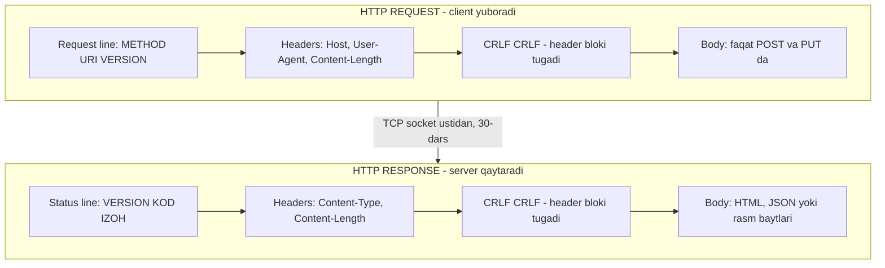
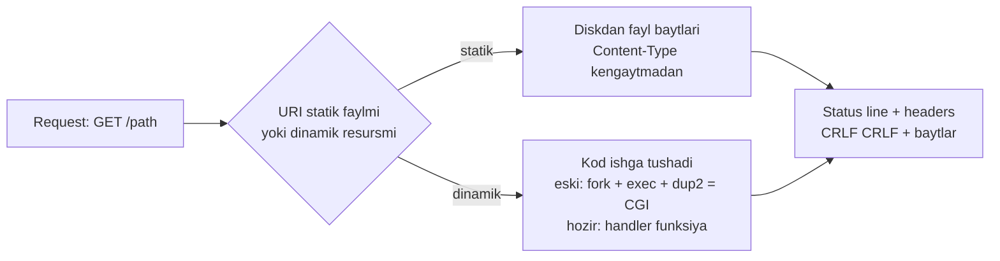
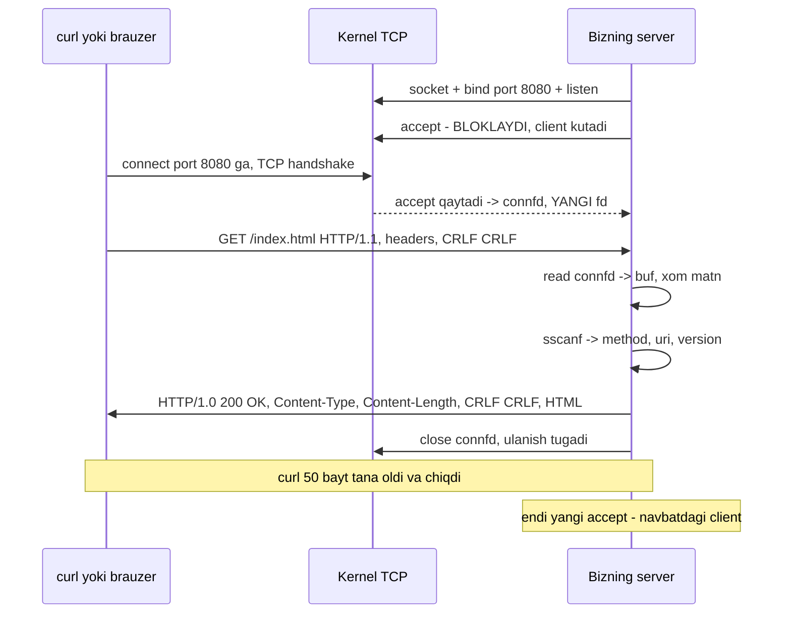

# 31. Web Server Ichidan — HTTP protokoli va net/http sehrining yo'qolishi

> Manba: CS:APP 2-nashr, 11.5-11.6 · Muhit: Ubuntu 24.04 x86-64 (Docker), gcc 13.3.0, go 1.22.2 · [← Oldingi](30-sockets.md) · [Kurs xaritasi](00-README.md) · [Keyingi →](32-concurrency-models.md)

## Nima uchun kerak

Sen har kuni `http.HandleFunc` yozasan va u ishlaydi. Lekin `w.Write([]byte("ok"))` chaqirilganda socket'ga **aniq qanday baytlar** ketadi? `r.Method` qayerdan paydo bo'ldi? Nega `Content-Length` noto'g'ri bo'lsa client osilib qoladi? Bu savollarga javob bermaguningcha `net/http` — qora quti, va u qora quti buzilganda (production'da, tunda) sen ojizsan.

Bu dars 11-bobning yakuni va u bitta narsa bilan tugaydi: **biz o'zimiz HTTP server yozamiz**, u ~40 qator C kod bo'ladi, va unga **haqiqiy `curl` va haqiqiy brauzer** ulanadi. Undan keyin `nc` bilan qo'lda HTTP so'rov yozib yuboramiz — hech qanday kutubxonasiz, chunki HTTP shunchaki **matn**.

Amaliy foyda darhol keladi: `curl -i` chiqishini o'qish, `Content-Type` xatosini debug qilish, `Content-Length` va **bo'sh qator**ning nima uchun borligini bilish, `502`/`truncated response` sabablarini ko'rish. Va oxirida bitta ochiq muammo qoladi: bizning server bir vaqtda **bitta** client bilan ishlaydi — 32-dars aynan shundan boshlanadi.

## Nazariya

### 1. Web modeli — bu shunchaki client-server

30-darsda ko'rgan client-server transaction'ining ustiga bitta qatlam qo'shsak, Web chiqadi. **Client** — brauzer yoki `curl`. **Server** — Apache, nginx yoki bizning 40 qatorlik `httpd`. Ular orasida **content** (kontent) uzatiladi: HTML, JSON, rasm, video — ya'ni baytlar ketma-ketligi + uning **turi** haqidagi ma'lumot.

Web'ning HTTP'gacha bo'lgan barcha mexanikasi bizga allaqachon tanish:

- **DNS** nomni IP'ga o'giradi (30-dars);
- **TCP socket** o'rnatiladi: `socket` + `connect` (client), `socket` + `bind` + `listen` + `accept` (server);
- baytlar `read` / `write` bilan oqadi (28-dars) — socket ham fd.

HTTP shu bayt oqimi ustidagi **kelishuv**dan boshqa narsa emas: "so'rovni shunday yoz, javobni shunday qaytar".

### 2. HTTP — MATN protokol

Eng muhim gap darsning boshida turadi:

> **HTTP/1.x — binar emas, ASCII MATN protokol. Qatorlar CRLF (`\r\n`) bilan tugaydi.**

Bu tasodif emas — 1990-yillar dizayn qarori: protokolni **inson o'qiy oladigan** qilish. Oqibatlari juda amaliy:

- `telnet` yoki `nc` bilan qo'lda HTTP so'rov yozib yuborish mumkin (3-demo shuni isbotlaydi);
- `tcpdump` / Wireshark trafikni o'qiy oladi (agar TLS bo'lmasa);
- xatolarni ko'z bilan ko'rish mumkin: `curl -i` yetadi, maxsus dekoder kerak emas.

Diqqat: bu **HTTP/1.0 va HTTP/1.1** haqida. **HTTP/2** dan boshlab protokol **binar** bo'ldi (frame'lar, HPACK header siqish) — u yerda `nc` bilan qo'lda yozib bo'lmaydi. Shuning uchun matn davrini tushunish — asos, undan keyingisi optimizatsiya.

### 3. TCP'da chegara yo'q — HTTP o'z ramkasini O'ZI quradi

Bu darsning intellektual yuragi. 30-darsdan bilamiz: **TCP — bayt oqimi**, u xabar chegarasini (message boundary) saqlamaydi. `write` bilan yuborilgan 200 bayt, `read` bilan 128 + 72 bo'lib kelishi mumkin (short count, 28-dars).

Unda client "so'rov qayerda tugadi" ni qanday biladi? Va server "javob tanasi qayerda tugadi" ni-chi? Javob: **HTTP o'zining framing qoidalarini o'zi kiritadi**. Ikkita mexanizm bor, va ular butun protokolni ushlab turadi:

| Nima chegaralanadi | Mexanizm | Buzilsa nima bo'ladi |
|--------------------|----------|----------------------|
| **Header bloki** | **BO'SH QATOR** — `\r\n\r\n` | Qabul qiluvchi header kutishda davom etadi → **osilib qoladi** |
| **Tana (body)** | **`Content-Length: N`** (yoki chunked, yoki ulanishni yopish) | Kam bayt kutiladi → **kesilgan javob**; ko'p kutiladi → **osilib qoladi** |

> **Bo'sh qator "header'lar tugadi" deydi. `Content-Length` "tana necha bayt" deydi. TCP bularni bilmaydi — bu HTTP'ning o'z ixtirosi.**

Shuning uchun keyinroq ko'radigan ikkita eng ko'p uchraydigan HTTP bug'i — aynan shu ikkita chiziqning buzilishi.

### 4. So'rov (request) formati

So'rov to'rt qismdan iborat va tartibi qat'iy:

```
GET /index.html HTTP/1.1\r\n      <-- request line: METHOD URI VERSION
Host: localhost:8080\r\n          <-- header'lar: "Nom: qiymat"
User-Agent: curl/8.5.0\r\n
Accept: */*\r\n
\r\n                              <-- BO'SH QATOR = header'lar tugadi
(tana - GET da yo'q, POST/PUT da bor)
```

**Request line** — bitta qator, uchta so'z, probel bilan ajratilgan:

- **METHOD** — `GET` (resursni o'qish), `POST` (ma'lumot yuborish), `HEAD` (faqat header'lar, tanasiz), `PUT`, `DELETE`, `OPTIONS`. HTTP/1.0 da faqat GET/POST/HEAD bor edi.
- **URI** — odatda faqat **yo'l** (`/index.html?id=42`), to'liq URL emas. To'liq URL faqat proxy'ga yuborilgan so'rovda ishlatiladi — bu tarixiy nozik nuqta.
- **VERSION** — `HTTP/1.0` yoki `HTTP/1.1`.

**Header'lar** — `Nom: qiymat` juftliklari, har biri CRLF bilan tugaydi. `Host:` HTTP/1.1 da **majburiy** (bitta IP'da yuzta sayt turishi mumkin — virtual hosting shu header bilan ishlaydi).

### 5. Javob (response) formati va status kodlar

Javob **aynan shu strukturaga** ega, faqat birinchi qator boshqacha:

```
HTTP/1.0 200 OK\r\n              <-- status line: VERSION KOD IZOH
Content-Type: text/html\r\n      <-- header'lar
Content-Length: 50\r\n
\r\n                             <-- BO'SH QATOR
<html><body>...                  <-- tana (50 bayt)
```

**Status kod** — 3 xonali son, birinchi raqami sinfni beradi:

| Sinf | Ma'nosi | Tipik kodlar |
|------|---------|--------------|
| **1xx** | Informational | 100 Continue |
| **2xx** | Muvaffaqiyat | **200 OK**, 201 Created, 204 No Content |
| **3xx** | Redirect | 301 Moved Permanently, 304 Not Modified |
| **4xx** | **Client** xatosi | 400 Bad Request, 401, 403, **404 Not Found** |
| **5xx** | **Server** xatosi | **500 Internal Server Error**, 501 Not Implemented, 502 Bad Gateway |

Eslab qolish uchun yagona qoida: **4xx — "sen xato qilding", 5xx — "men xato qildim"**. `404` faylni topolmadim, `500` mening kodim panic bo'ldi, `502` — men proxy'man va orqamdagi server javob bermadi.

Yonidagi **izoh** (`OK`, `Not Found`) — faqat inson uchun; dastur **kodga** qaraydi.



Ikkala xabar ham bir xil skeletga ega: **birinchi qator + header'lar + bo'sh qator + tana**. Butun HTTP shu.

### 6. Content-Type va Content-Length — ikkita eng muhim header

**`Content-Type`** tananing **turini** aytadi (MIME type): `text/html`, `application/json`, `image/png`, `text/plain`. Nega kerak? Chunki TCP faqat **baytlar** beradi — ularning "ma'nosi" yo'q. Brauzer `text/html` ko'rsa render qiladi, `application/octet-stream` ko'rsa yuklab oladi. JSON API `text/plain` qaytarsa, ba'zi client'lar parse qilmaydi.

**`Content-Length`** tana **necha bayt** ekanini aytadi. Client aynan shuncha bayt o'qiydi va to'xtaydi. Uch xil alternativa bor:

1. `Content-Length: N` — eng oddiy, tana oldindan tayyor bo'lsa;
2. `Transfer-Encoding: chunked` (HTTP/1.1) — uzunlik oldindan noma'lum bo'lsa (stream, katta hisob);
3. **ulanishni yopish** — HTTP/1.0 uslubi: "tana EOF'gacha davom etadi".

Bizning server 1-usulni ishlatadi **va** ulanishni yopadi — shuning uchun u ikki tomonlama xavfsiz.

### 7. Statik va dinamik kontent — CGI qanday o'lgan

Server ikki xil kontent qaytaradi:

- **Statik** — diskdagi fayl. Server uni ochadi, o'qiydi, socket'ga yozadi (`open` + `read` + `write`, 28-dars). `Content-Type` odatda **fayl kengaytmasidan** aniqlanadi (`.html` → `text/html`, `.png` → `image/png`).
- **Dinamik** — javob **hisoblab yaratiladi** (DB'dan olinadi, shablon render qilinadi).

Kitob davrida dinamik kontent **CGI** (Common Gateway Interface) bilan qilinardi va uning mexanikasi bizga tanish: server har so'rov uchun `fork` qiladi (22-dars), bola process'da `execve` bilan CGI dasturini ishga tushiradi, so'rov parametrlarini **environment variable**larga (`QUERY_STRING`, `REQUEST_METHOD`, `CONTENT_LENGTH`) joylaydi va — eng chiroyli qismi — bolaning `stdout`'ini `dup2` bilan **to'g'ridan-to'g'ri `connfd`ga** ulaydi (29-dars). Natijada CGI dasturi oddiy `printf` qiladi, matn esa to'ppa-to'g'ri client'ga uchadi.



CGI **o'ldi**, chunki har so'rovga `fork` + `exec` — juda qimmat (yangi process, yangi address space, 24-dars). Zamonaviy yechim: **uzoq yashaydigan process** ichida **handler funksiya** chaqiriladi (Go `net/http`, Java servlet, Python WSGI). Go'da bu shunchaki funksiya chaqiruvi — process yaratish yo'q, goroutine bor.

### 8. To'liq HTTP transaction — boshidan oxirigacha

Endi hamma qismni bitta oqimga yig'amiz. `curl http://localhost:8080/index.html` yozganingda aynan shu sodir bo'ladi:



Chap tomondagi hamma narsa — 30-dars (socket, bind, listen, accept, connect). O'ng tomondagi hamma narsa — bugungi dars (matn parse, status line, header, bo'sh qator). **HTTP — socket ustidagi bitta yupqa matn qatlami**, boshqa hech narsa emas.

### 9. Bizning serverning cheklovi — bitta client, ketma-ket

Diagrammadagi oxirgi izohga qara: `close` bo'lmaguncha yangi `accept` yo'q. Serverimiz `accept` → `serve` → `close` sikliga ega, ya'ni: **bitta client'ga xizmat qilib bo'lmaguncha, ikkinchisi navbatda kutadi**. Agar birinchi client sekin bo'lsa (mobil tarmoq, 10 MB fayl), qolgan hamma **bloklanadi**.

Bu bug emas — bu **dizayn cheklovi** va u 11-bobning tabiiy chegarasi. Yechim uch xil bo'ladi: har client uchun process (`fork`), har client uchun thread, yoki bitta thread + `epoll` (event loop). Go'da yechim — **har ulanishga bitta goroutine**. Bularning hammasi 32-darsda.

## Kod va isbot

### Demo 1 — 40 qatorlik HTTP server (C)

```c
#include <stdio.h>
#include <stdlib.h>
#include <string.h>
#include <unistd.h>
#include <arpa/inet.h>

/* Minimal HTTP/1.0 server: so'rovni parse qiladi, javob qaytaradi */
static void serve(int connfd)
{
    char buf[1024] = {0};
    read(connfd, buf, sizeof(buf) - 1);

    /* So'rov qatorini parse: "GET /path HTTP/1.1" */
    char method[16] = {0}, uri[256] = {0}, version[16] = {0};
    sscanf(buf, "%15s %255s %15s", method, uri, version);
    printf("SERVER: so'rov qabul qilindi -> method=%s uri=%s version=%s\n",
           method, uri, version);

    /* HTTP javobi: status qatori + header'lar + bo'sh qator + tana */
    const char *body = "<html><body><h1>Salom, CS:APP!</h1></body></html>\n";
    char resp[1024];
    int len = snprintf(resp, sizeof(resp),
        "HTTP/1.0 200 OK\r\n"
        "Content-Type: text/html\r\n"
        "Content-Length: %zu\r\n"
        "\r\n"                                  /* bo'sh qator: header tugadi */
        "%s", strlen(body), body);
    write(connfd, resp, len);
}

int main(void)
{
    int listenfd = socket(AF_INET, SOCK_STREAM, 0);
    int opt = 1;
    setsockopt(listenfd, SOL_SOCKET, SO_REUSEADDR, &opt, sizeof(opt));

    struct sockaddr_in addr = {0};
    addr.sin_family = AF_INET;
    addr.sin_addr.s_addr = htonl(INADDR_ANY);
    addr.sin_port = htons(8080);
    bind(listenfd, (struct sockaddr*)&addr, sizeof(addr));
    listen(listenfd, 10);
    printf("SERVER: http://localhost:8080 da tinglayapman\n");
    fflush(stdout);

    for (int i = 0; i < 2; i++) {        /* 2 ta so'rovga xizmat qilamiz */
        int connfd = accept(listenfd, NULL, NULL);
        serve(connfd);
        close(connfd);
    }
    close(listenfd);
    return 0;
}
```

`main()` da yangilik **yo'q** — bu 30-darsdagi o'sha `socket` + `setsockopt(SO_REUSEADDR)` + `bind` + `listen` + `accept` ketma-ketligi, faqat port 8080. Butun "web" `serve()` ichida, uch qadamda.

**1-qadam: so'rovni o'qish.** `read(connfd, buf, sizeof(buf) - 1)` — socket ham fd, shuning uchun oddiy `read` (28-dars). `- 1` qoldirildi, chunki `buf` nol bilan tugashi kerak (`{0}` bilan to'ldirilgan). Bu yerda **halol bo'laylik**: bitta `read` butun so'rovni oladi degan taxmin — **soddalashtirish**. TCP oqimida so'rov ikki paketga bo'linishi mumkin (short count, 28-dars). Bizning demoda ishlaydi, chunki `curl` so'rovi bitta segmentga sig'adi. Jiddiy server esa `\r\n\r\n` ko'rmaguncha **sikl bilan** o'qiydi (CS:APP'dagi RIO `readlineb` aynan shu uchun kerak).

**2-qadam: parse.** `sscanf(buf, "%15s %255s %15s", method, uri, version)` — `%s` probelgacha o'qiydi, shuning uchun `GET /index.html HTTP/1.1` aynan uchga bo'linadi. Raqamlar (`15`, `255`) — tasodifiy emas: ular **maksimal uzunlik**. Ularsiz uzun URI `uri[256]` massividan oshib ketardi va bu klassik **buffer overflow** bo'lardi (11-dars) — tarmoqdan kelgan ma'lumotga hech qachon ishonma.

**3-qadam: javob qurish.** `snprintf` bitta buferga **butun javobni** yig'adi: status qatori, ikkita header, **bo'sh qator**, tana. C'da qo'shni satr literallari avtomatik yopishadi, shuning uchun `"\r\n"` alohida qatorda turgani — faqat o'qish qulayligi uchun; natijada bitta uzun satr chiqadi.

`strlen(body)` = **50**. Sanab ko'r: HTML matni 49 belgi + oxiridagi `\n` = 50 bayt. Aynan shu son `Content-Length: 50` bo'lib header'ga tushadi va `curl` chiqishida ko'rinadi. Agar bu yerda `sizeof(body)` yozganimizda (pointer o'lchami, 8), javob buzilardi.

Va oxirida `write(connfd, resp, len)` — bitta `write`, socket'ga xom baytlar. Hech qanday "HTTP kutubxonasi" yo'q.

### Demo 2 — curl bilan sinash: haqiqiy javob

```
$ ./httpd &
SERVER: http://localhost:8080 da tinglayapman
$ curl -s -i http://localhost:8080/index.html
HTTP/1.0 200 OK
Content-Type: text/html
Content-Length: 50

<html><body><h1>Salom, CS:APP!</h1></body></html>
```

Kompilyatsiya: `gcc -o httpd httpd.c`. **Bizning 40 qatorlik server haqiqiy `curl` bilan gaplashdi** — va aynan shunday brauzer bilan ham gaplashadi (`http://localhost:8080` ni oching, `Salom, CS:APP!` sarlavhasi chiqadi).

`curl -i` bayrog'i javobning **hammasini** ko'rsatadi (`-i` = include headers). Chiqishni yuqoridan pastga o'qi va nazariya bilan solishtir:

1. `HTTP/1.0 200 OK` — **status line**: versiya, kod, izoh;
2. `Content-Type: text/html` va `Content-Length: 50` — **header'lar**;
3. **bo'sh qator** — mana u, ko'z bilan ko'rinib turibdi: header'lar tugadi;
4. `<html>...` — **tana**, aniq 50 bayt.

Nozik nuqta: `curl` so'rovni `HTTP/1.1` bilan yubordi (4-demo logi shuni ko'rsatadi), biz esa `HTTP/1.0` bilan javob qaytardik. `curl` bunga rozi — u javobni HTTP/1.0 qoidalari bo'yicha talqin qiladi: **keep-alive yo'q**, ulanish javobdan keyin yopiladi. Bizning `close(connfd)` aynan shuni qiladi.

### Demo 3 — nc bilan qo'lda HTTP: protokol matn ekanining isboti

```
$ printf 'GET /test HTTP/1.0\r\n\r\n' | nc -q1 localhost 8080
HTTP/1.0 200 OK
Content-Type: text/html
Content-Length: 50

<html><body><h1>Salom, CS:APP!</h1></body></html>
```

Bu demo darsning eng muhim g'oyasini bitta qatorda isbotlaydi: **hech qanday brauzer, hech qanday HTTP kutubxona kerak emas**. Biz `printf` bilan **qo'lda matn** yozdik va uni `nc` (netcat) orqali TCP socket'ga tashladik.

Yuborgan baytlarimizni ajratamiz:

- `GET /test HTTP/1.0` — request line (uch so'z, probel bilan);
- `\r\n` — qator tugadi;
- `\r\n` — **yana CRLF = BO'SH QATOR** — "header'larim yo'q, so'rovim tugadi".

Aynan shu ikkinchi `\r\n` bo'lmasa, server (va har qanday haqiqiy server) header'lar davom etyapti deb **kutishda qolar edi**. Bo'sh qator — so'rovning "nuqta" belgisi.

`nc -q1` — stdin tugagach 1 soniya kutib, javobni o'qib chiqishni bildiradi. `HTTP/1.0` yozganimiz uchun `Host:` header'i kerak emas (HTTP/1.1 da u majburiy).

Xulosa: HTTP — **socket ustidagi matn kelishuvi**, boshqa hech narsa emas. `net/http` sehri shu yerda tugaydi.

### Demo 4 — server tomonidagi parse logi

```
SERVER: http://localhost:8080 da tinglayapman
SERVER: so'rov qabul qilindi -> method=GET uri=/index.html version=HTTP/1.1
SERVER: so'rov qabul qilindi -> method=POST uri=/api/users version=HTTP/1.1
```

Bu — serverning o'z chiqishi (ikkita so'rovga xizmat qilib, sikl tugadi va process chiqdi). Birinchi so'rovni `curl` yubordi, ikkinchisini `nc` bilan qo'lda yozdik: `POST /api/users HTTP/1.1`.

Ko'rib turganingdek, `sscanf` **ikkalasini ham** to'g'ri uchga ajratdi. Va mana bu yerda `net/http` bilan ko'prik quriladi:

| Bizning C serverda | Go'da |
|--------------------|-------|
| `method` (sscanf natijasi) | `r.Method` |
| `uri` | `r.URL.Path` |
| `version` | `r.Proto` |

Bir xil ma'lumot, bir xil manba (so'rovning **birinchi qatori**) — farq faqat shundaki, Go buni sen uchun qiladi.

Bizning server bu yerda **to'xtaydi**, real server esa davom etadi: (1) `uri` bo'yicha **routing** (qaysi handler), (2) qolgan **header'larni** parse qilish, (3) `Content-Length` bo'yicha **tanani** o'qish (POST uchun), (4) `method` bo'yicha mantiq (GET va POST har xil ishlaydi). E'tibor ber: bizniki POST kelganda ham xuddi o'sha HTML'ni qaytardi — chunki bizda routing yo'q. Lekin **protokol** — bir xil.

### Demo 5 — Go net/http: xuddi shu, lekin avtomatik

```go
package main

import (
	"fmt"
	"io"
	"net/http"
	"time"
)

func main() {
	mux := http.NewServeMux()
	mux.HandleFunc("/", func(w http.ResponseWriter, r *http.Request) {
		// r.Method, r.URL - biz C'da sscanf bilan QO'LDA parse qilgan edik
		fmt.Printf("SERVER: method=%s uri=%s proto=%s\n", r.Method, r.URL.Path, r.Proto)
		w.Header().Set("Content-Type", "text/html")
		fmt.Fprint(w, "<html><body><h1>Salom, Go net/http!</h1></body></html>\n")
		// status qatori, Content-Length, bo'sh qator - Go O'ZI qo'shadi
	})

	srv := &http.Server{Addr: ":8081", Handler: mux}
	go srv.ListenAndServe() // socket+bind+listen+accept loop (30-dars)
	time.Sleep(200 * time.Millisecond)

	resp, _ := http.Get("http://localhost:8081/index.html")
	body, _ := io.ReadAll(resp.Body)
	resp.Body.Close()

	fmt.Printf("CLIENT: status=%s\n", resp.Status)
	fmt.Printf("CLIENT: Content-Type=%s\n", resp.Header.Get("Content-Type"))
	fmt.Printf("CLIENT: body=%s", body)

	srv.Close()
}
```

Output:

```
SERVER: method=GET uri=/index.html proto=HTTP/1.1
CLIENT: status=200 OK
CLIENT: Content-Type=text/html
CLIENT: body=<html><body><h1>Salom, Go net/http!</h1></body></html>
```

Diqqat bilan qara: `CLIENT: status=200 OK` — lekin biz kodda **hech qayerda `200 OK` yozmadik**. `Content-Length`ni ham yozmadik. Bo'sh qatorni ham qo'ymadik. Ularni **Go qo'ydi** — birinchi `Write` chaqirilganda `net/http` status qatorini, header'larni va bo'sh qatorni socket'ga o'zi yozadi.

Ya'ni Demo 5 = Demo 1, faqat qo'l mehnati o'rniga kutubxona. Baytlar simda **bir xil**.

## Go dasturchiga ko'prik

Endi `net/http`ni qatlamma-qatlam ochamiz — har qatlam ostida sen endi biladigan narsa turadi.

**`srv.ListenAndServe()`** = `net.Listen("tcp", ":8081")` → ya'ni `socket()` + `setsockopt` + `bind()` + `listen()` (30-dars), keyin cheksiz **accept loop**. Har `Accept` yangi `connfd` beradi va Go darhol **`go c.serve(ctx)`** qiladi — ya'ni **har ulanishga bitta goroutine**. Bizning C serverda bu joyda `serve(connfd)` **to'g'ridan-to'g'ri** chaqirilgan edi (shuning uchun bitta client). Butun farq — bitta `go` so'zida (32-dars).

**So'rovni parse qilish.** Go `bufio.Reader` ustida `textproto` ishlatadi: birinchi qatorni o'qiydi (`METHOD URI VERSION` → `r.Method`, `r.URL`, `r.Proto`), keyin **bo'sh qator uchraguncha** header'larni o'qiydi (`r.Header`), so'ng `Content-Length` yoki `chunked` bo'yicha `r.Body` ni tayyorlaydi. Bu bizning `sscanf` + qo'lda `\r\n\r\n` qidirishning to'liq, xatolarga chidamli versiyasi.

**`r.Body`** — bu `io.ReadCloser`, ya'ni **oqim** (28-dars): u xotiraga to'liq o'qilmagan, socket'dan lozim bo'lganda o'qiladi. Shuning uchun 1 GB'lik yuklamani `io.Copy` bilan diskka oqizish mumkin, xotira portlamaydi.

**Javob qurish.** `w.Header().Set("Content-Type", "text/html")` — hali hech narsa yuborilmaydi, faqat map'ga yoziladi. `w.WriteHeader(404)` — status qatorini yuboradi. Agar `WriteHeader`ni chaqirmasang, birinchi `w.Write` **avtomatik `200 OK`** qiladi (Demo 5'da aynan shu bo'ldi). Muhim qoida: **`WriteHeader` `Write`dan keyin ishlamaydi** — header'lar allaqachon simga ketgan (`superfluous response.WriteHeader` ogohlantirishi shundan).

**`Content-Length`ni Go qanday qo'yadi?** Handler tugaganda javob tanasi kichik bo'lsa (buferga sig'sa), Go uzunlikni **o'zi hisoblab** `Content-Length` qo'yadi. Sig'masa — HTTP/1.1'da `Transfer-Encoding: chunked` ga o'tadi. `Content-Type` qo'yilmagan bo'lsa — birinchi baytlardan **taxmin qiladi** (`http.DetectContentType`).

**`http.ServeMux`** — bizda umuman yo'q bo'lgan qism: **routing**. U URI naqshini handler'ga bog'laydi. Go 1.22'dan (bizning versiya) mux **method va wildcard**ni ham tushunadi:

```go
mux.HandleFunc("GET /users/{id}", getUser)   // Go 1.22+
```

**`http.Handler` interfeysi** — atigi bitta metod: `ServeHTTP(w, r)`. `http.HandlerFunc` esa — funksiya **tipi**, unda `ServeHTTP` metodi bor. Shu kichkina hiyla tufayli oddiy funksiya interfeysni qanoatlantiradi. Va shundan **middleware** kelib chiqadi:

```go
func logging(next http.Handler) http.Handler {
	return http.HandlerFunc(func(w http.ResponseWriter, r *http.Request) {
		start := time.Now()
		next.ServeHTTP(w, r)                       // asosiy handler
		log.Printf("%s %s %v", r.Method, r.URL.Path, time.Since(start))
	})
}
```

Middleware — handler'ni handler bilan **o'rash**, boshqa hech narsa emas.

**Client tomoni.** `http.Get` → `http.DefaultClient` → `http.Transport` — va u **connection pool** yuritadi (keep-alive): TCP handshake qimmat (30-dars), shuning uchun ulanish qayta ishlatiladi. Buning sharti bitta: **`resp.Body.Close()`** (va tanani oxirigacha o'qish). Aks holda ulanish pool'ga qaytmaydi → fd va goroutine **leak** bo'ladi. Demo 5'da `resp.Body.Close()` bejiz emas.

**Production'da majburiy:** `http.Server` default'da **timeout'siz** keladi. `ReadHeaderTimeout`, `ReadTimeout`, `WriteTimeout`, `IdleTimeout`ni qo'ymasang, sekin client (yoki Slowloris hujumi) ulanishlarni va goroutine'larni abadiy ushlab turadi.

## Real-world scenariylar

**1. "Brauzerda HTML o'rniga kod ko'rinyapti".** Sabab deyarli doim bitta: noto'g'ri `Content-Type`. Server `text/plain` yubordi — brauzer HTML'ni matn deb chiqardi; yoki API `text/html` yubordi — client JSON'ni parse qilmadi. Debug usuli — Demo 2'dagi buyruq: `curl -s -i URL` (yoki batafsilroq `curl -v`, u **yuborilgan so'rovni** ham ko'rsatadi). Header'ni ko'z bilan ko'rasan va bir daqiqada tugaydi.

**2. "Javob kesilgan" yoki "client osilib qoldi".** Ikkalasi ham `Content-Length` bilan tananing haqiqiy uzunligi mos kelmaganidan: uzunlik **kichik** ko'rsatilsa — tana kesiladi va keep-alive ulanishda ortiqcha baytlar **keyingi javobning boshi** deb o'qiladi (bu HTTP request smuggling zaifligining ildizi); **katta** ko'rsatilsa — client yetishmayotgan baytlarni **timeout'gacha kutadi**. Go'da bu xato kamdan-kam, chunki uzunlikni Go o'zi hisoblaydi — lekin `Content-Length`ni **qo'lda** `w.Header().Set` bilan yozsang, o'zing javobgarsan.

**3. "Yuk ostida javoblar navbatga tizilib qoldi".** Bizning C serverda bu **kafolatlangan**: `serve()` tugamaguncha keyingi `accept` bo'lmaydi. Bitta sekin client — hamma kutadi. Real serverda bu holat proxy orqasidagi bitta thread'li app'da yoki handler ichida global mutex ushlab turilganda takrorlanadi. Yechim — concurrency (32-dars): Go'da `go c.serve()` avtomatik, lekin handler ichidagi **umumiy resurs** (DB pool, mutex) baribir yangi bo'yin bo'g'zi bo'lishi mumkin.

## Zamonaviy yondashuv

Kitob HTTP/1.0 davrida yozilgan. 2026-da manzara shunday:

| Versiya | Transport | Format | Asosiy yutuq |
|---------|-----------|--------|--------------|
| **HTTP/1.0** | TCP | matn | Sodda; har so'rovga yangi ulanish |
| **HTTP/1.1** | TCP | matn | **keep-alive** (ulanish qayta ishlatiladi), `Host`, **chunked** |
| **HTTP/2** | TCP + TLS | **binar** | Bitta ulanishda **multiplexing**, HPACK header siqish |
| **HTTP/3** | **QUIC (UDP)** | binar | TCP head-of-line blocking yo'q, 0-RTT qayta ulanish |

Diqqat: HTTP/2 dan boshlab protokol **matn emas** — `nc` bilan qo'lda yozib bo'lmaydi, `curl --http2` va `nghttp` kerak. Lekin **semantika o'zgarmadi**: method, URI, status kod, header'lar — hammasi joyida, faqat **kodlash** boshqacha. Shuning uchun HTTP/1.1 matnini tushunish — HTTP/2 va HTTP/3 ni tushunishning yagona yo'li.

Qolgan zamonaviy manzara qisqacha:

- **TLS/HTTPS** — socket ustidagi shifr qatlami; Go'da `srv.ListenAndServeTLS(cert, key)`. Endi trafikni `tcpdump` bilan o'qib bo'lmaydi.
- **REST/JSON** — bugungi standart API uslubi: `Content-Type: application/json` + status kodlar bilan semantik javob.
- **gRPC** — HTTP/2 ustida, protobuf (binar) bilan; matn emas, tez, sxemali.
- **WebSocket** — oddiy HTTP so'rovi `Upgrade` header'i bilan boshlanadi va socket **ikki tomonlama doimiy** kanalga aylanadi.
- **Reverse proxy** (nginx, Envoy) — TLS termination, statik fayllar, load balancing; sening Go servising odatda uning orqasida turadi.
- **CGI o'ldi** — har so'rovga `fork`+`exec` juda qimmat. O'rniga: uzoq yashovchi process + handler (Go), yoki FastCGI/PHP-FPM.
- **Observability** — `traceparent` (W3C Trace Context) header'i, structured log, OpenTelemetry. E'tibor ber: distributed tracing **faqat shuning uchun** mumkin — HTTP header'lari **kengaytiriladigan matn juftliklari**.

## Keng tarqalgan xatolar

1. **Bo'sh qatorni unutish.** `"Content-Length: 50\r\n"` dan keyin darhol tanani yozsang, client header'lar davom etyapti deb o'ylaydi va **osilib qoladi** (yoki tananing birinchi qatorini header deb parse qilib, `400 Bad Request` beradi). `\r\n\r\n` — muzokarasiz.
2. **`Content-Length` noto'g'ri.** Kichik bo'lsa — tana kesiladi va keep-alive'da keyingi javob buziladi; katta bo'lsa — client yetmagan baytlarni timeout'gacha kutadi. Uzunlikni **doim tananing haqiqiy bayt sonidan** ol (Demo 1'da `strlen(body)`, `sizeof` emas).
3. **`\n` yozish, `\r\n` o'rniga.** HTTP **CRLF** talab qiladi. Ko'p serverlar yolg'iz `\n`ni kechiradi, lekin qat'iy parser va proxy'lar rad etadi — va header qiymatiga foydalanuvchi kiritgan `\r\n` tushib qolsa, bu **header injection** zaifligi (Go header qiymatidagi CRLF'ni bloklaydi).
4. **"Bitta `read` butun so'rovni oladi".** TCP — oqim, xabar emas (30-dars); so'rov ikki paketda kelishi mumkin (**short count**, 28-dars). To'g'ri yechim: `\r\n\r\n` ko'rmaguncha sikl bilan o'qish, keyin `Content-Length` bo'yicha tanani **aniq shuncha** bayt o'qish (`io.ReadFull` mantig'i).
5. **Go client'da `resp.Body.Close()`ni unutish.** Ulanish pool'ga qaytmaydi → fd leak → `too many open files`. Qoida: `defer resp.Body.Close()` **har doim**, hatto tanani ishlatmasang ham.
6. **`w.WriteHeader(404)` ni `w.Write` dan keyin chaqirish.** Ishlamaydi — status allaqachon `200` bo'lib ketgan. Avval status, keyin tana.

## Amaliy mashqlar

**1.** Demo 1'da javobdagi `"\r\n"` (bo'sh qator) qatorini olib tashlasak, `curl` nima qiladi va nega?

<details><summary>Yechim</summary>
`curl` header'lar hali tugamagan deb hisoblaydi va davomini kutadi. Bizning javobda undan keyin darhol `<html>...` keladi — `curl` uni header deb parse qilmoqchi bo'ladi va xato beradi (`Bad header`), yoki server ulanishni yopgunicha kutadi. Sabab: TCP'da xabar chegarasi yo'q (30-dars), shuning uchun **HTTP header blokining oxirini bo'sh qator (`\r\n\r\n`) bilan o'zi belgilaydi**. Bu chegarani olib tashlash — protokolni buzish.
</details>

**2.** `Content-Length: 50` — 50 qayerdan chiqdi? Aniq sanab ber.

<details><summary>Yechim</summary>
`body` = `"<html><body><h1>Salom, CS:APP!</h1></body></html>\n"` — 49 ta belgi + oxiridagi `\n` = **50 bayt**. Kodda bu `strlen(body)` bilan hisoblanadi va `snprintf` orqali header'ga tushadi. Agar `strlen` o'rniga `sizeof(body)` yozilsa, bu **pointer o'lchami** (8) bo'lardi va client atigi 8 bayt o'qib to'xtardi — kesilgan javob.
</details>

**3.** Brauzersiz, kutubxonasiz, faqat `nc` bilan serverga `POST /api/users HTTP/1.1` so'rovini qanday yuborasan? Aniq nima yozasan?

<details><summary>Yechim</summary>
Demo 3'dagi shakl: `printf 'POST /api/users HTTP/1.1\r\nHost: localhost\r\n\r\n' | nc -q1 localhost 8080`. Uch qism: (1) **request line** — `METHOD URI VERSION`; (2) header'lar (HTTP/1.1 da `Host:` majburiy); (3) **bo'sh qator** `\r\n\r\n` — so'rov tugadi degan belgi. Server logida (4-demo) aynan shu ko'rindi: `method=POST uri=/api/users version=HTTP/1.1`. Agar tana ham yubormoqchi bo'lsang, `Content-Length: N` header'ini qo'shib, bo'sh qatordan keyin N bayt yozasan.
</details>

**4.** Demo 1'ni `404 Not Found` qaytaradigan qilish uchun javobning qaysi qismlari o'zgaradi?

<details><summary>Yechim</summary>
Faqat **status qatori** va tana o'zgaradi, struktura **o'zgarmaydi**:
`"HTTP/1.0 404 Not Found\r\nContent-Type: text/html\r\nContent-Length: %zu\r\n\r\n%s"` — bo'sh qator ham, `Content-Length` ham **baribir kerak** (404 ham to'liq HTTP javob). Logika: `uri` ni tekshirib, mos resurs bo'lmasa shu javobni yozish. Muhim: 404 — bu **client** xatosi (4xx), server ishlayapti; server kodi panic bo'lsa — `500` (5xx). Go'da: `http.Error(w, "not found", http.StatusNotFound)` yoki `w.WriteHeader(http.StatusNotFound)` (Write'dan **oldin**).
</details>

**5.** Demo 5'da biz `200 OK` ni ham, `Content-Length`ni ham, bo'sh qatorni ham yozmadik — lekin `curl` ularni oladi. Go buni qachon va qanday qiladi?

<details><summary>Yechim</summary>
Birinchi `w.Write` (yoki `fmt.Fprint(w, ...)`) chaqirilganda `net/http` implicit `WriteHeader(200)` qiladi va socket'ga **status qatori + header'lar + bo'sh qator**ni yozadi. `Content-Length`ni Go handler tugagach hisoblaydi (kichik tana buferga sig'sa), sig'masa `Transfer-Encoding: chunked`ga o'tadi. `Content-Type` qo'yilmagan bo'lsa — birinchi baytlardan taxmin qiladi (`DetectContentType`). Ya'ni Go bizning `snprintf` bloki (Demo 1) qilgan ishning **hammasini** avtomatlashtirgan; simdagi baytlar bir xil.
</details>

**6.** Nega bizning server bir vaqtda faqat bitta client bilan ishlaydi? Koddagi qaysi qator buni belgilaydi?

<details><summary>Yechim</summary>
`main()` siklidagi `serve(connfd);` qatori — u **to'g'ridan-to'g'ri chaqiruv**, ya'ni `serve` tugamaguncha keyingi `accept` bajarilmaydi. Sekin client (yoki katta fayl) butun serverni bloklaydi. Go'da `net/http` shu joyda `go c.serve(ctx)` qiladi — **har ulanishga goroutine**, shuning uchun minglab client parallel ishlaydi. C'da muqobillar: `fork` (har client uchun process, 22-dars), thread pool, yoki `epoll` event loop. Bularning hammasi 32-darsda.
</details>

**7.** `sscanf(buf, "%15s %255s %15s", ...)` da 15 va 255 raqamlari nega turibdi? Ularsiz nima bo'lardi?

<details><summary>Yechim</summary>
Ular — **maksimal uzunlik chegarasi**. `method[16]`, `uri[256]`, `version[16]` massivlariga mos (oxirgi bayt `\0` uchun). Ularsiz `%s` massiv chegarasidan oshib yozardi — stack'dagi qo'shni ma'lumot, hatto return address ustiga (**buffer overflow**, 11-dars). So'rovni **tarmoqdan begona odam** yuboradi: u 10 000 belgilik URI yuborishi hech gap emas. Qoida: tarmoqdan kelgan har baytga ishonchsiz munosabatda bo'l va uzunlikni doim chegarala.
</details>

**8.** Demo 2'da `curl` `HTTP/1.1` yubordi, biz `HTTP/1.0` bilan javob berdik — nega hech narsa buzilmadi?

<details><summary>Yechim</summary>
Chunki javobdagi versiya client'ga "men 1.0 qoidalari bo'yicha gaplashaman" deydi, va `curl` ularga moslashadi: **keep-alive yo'q**, javob tugagach ulanish yopiladi. Bizning `close(connfd)` aynan shuni qiladi, ustiga `Content-Length: 50` ham berilgan — shuning uchun `curl` tananing qayerda tugashini **ikki xil yo'l bilan** biladi. Agar `HTTP/1.1` deb javob bersak-u, ulanishni yopsak, `Connection: close` header'ini qo'shish to'g'riroq bo'lardi.
</details>

## Cheat sheet

| Tushuncha | Nima | Eslab qolish |
|-----------|------|--------------|
| HTTP/1.x | Socket ustidagi **MATN** protokol | `nc` bilan qo'lda yozsa bo'ladi |
| Request line | `METHOD URI VERSION` | `GET /index.html HTTP/1.1` |
| Status line | `VERSION KOD IZOH` | `HTTP/1.0 200 OK` |
| Header | `Nom: qiymat` + CRLF | Kengaytiriladigan, matn |
| **Bo'sh qator** | `\r\n\r\n` | **Header'lar tugadi** degan yagona belgi |
| `Content-Type` | Tana **turi** (MIME) | `text/html`, `application/json` |
| `Content-Length` | Tana **necha bayt** | Client qachon to'xtashni biladi |
| Alternativa | `chunked` yoki ulanishni yopish | Uzunlik oldindan noma'lum bo'lsa |
| 2xx / 4xx / 5xx | OK / **sen** xato / **men** xato | 200, 404, 500 |
| Statik kontent | Diskdagi fayl | `open` + `read` + `write` (28-dars) |
| Dinamik kontent | Hisoblab yaratiladi | CGI = `fork`+`exec`+`dup2` (22, 29-darslar) |
| CGI o'ldi | Har so'rovga process — qimmat | Hozir: handler funksiya |
| `curl -i` / `-v` | Xom javob / so'rov + javob | Birinchi debug quroli |
| Bizning C server | `accept` → `serve` → `close` | **Bitta** client, ketma-ket |
| `srv.ListenAndServe()` | socket+bind+listen+accept loop | 30-dars, bitta qatorda |
| `r.Method` / `r.URL` / `r.Proto` | Bizning `sscanf` parse | Manba: so'rovning 1-qatori |
| `w.Header().Set` + `w.Write` | Javob qurish | Status/Length/bo'sh qator — Go o'zi |
| `w.WriteHeader(404)` | Status kod | **`Write`dan OLDIN** |
| `http.ServeMux` | URI → handler routing | Go 1.22+: `"GET /users/{id}"` |
| `http.Handler` | `ServeHTTP(w, r)` | Middleware = handler'ni o'rash |
| Goroutine per connection | `go c.serve()` | Bizda `serve()` — 32-dars |
| `resp.Body.Close()` | Ulanishni pool'ga qaytaradi | Unutsang — fd leak |
| HTTP/2, HTTP/3 | **Binar**, multiplexing, QUIC | Semantika o'sha, kodlash boshqa |

## Qo'shimcha manbalar

- [HTTP messages — MDN](https://developer.mozilla.org/en-US/docs/Web/HTTP/Guides/Messages) — request/response strukturasi, header'lar va status kodlarning rasmiy tavsifi
- [Writing a web server from scratch: HTTP and sockets — notes.eatonphil.com](https://notes.eatonphil.com/web-server-basics-http-and-sockets.html) — socket'dan HTTP'gacha, bizning Demo 1 bilan bir mantiqda
- [Life of an HTTP request in a Go server — Eli Bendersky](https://eli.thegreenplace.net/2021/life-of-an-http-request-in-a-go-server/) — `net/http` ichidagi accept loop, goroutine va handler zanjiri
- Oldingi dars: [30. Sockets Interface](30-sockets.md) · Keyingi: [32. Concurrency modellari](32-concurrency-models.md) · [Kurs xaritasi](00-README.md)
