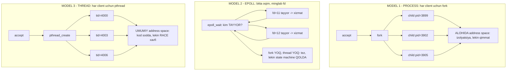
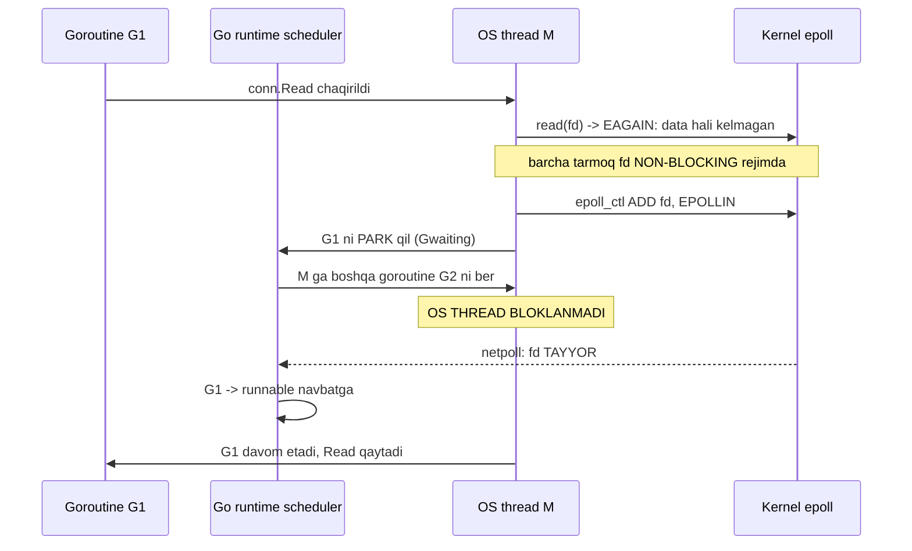
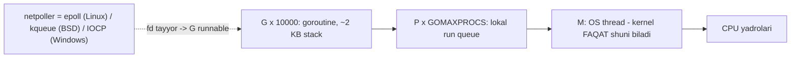

# 32. Concurrency Modellari — process, epoll, thread va goroutine

> Manba: CS:APP 2-nashr, 12.1-12.3 · Muhit: Ubuntu 24.04 x86-64 (Docker), gcc 13.3.0, go 1.22.2 · [← Oldingi](31-web-server.md) · [Kurs xaritasi](00-README.md) · [Keyingi →](33-shared-variables.md)

## Nima uchun kerak

31-darsda biz haqiqiy HTTP server yozdik va u ishladi — lekin bitta kamchilik bilan: u bir vaqtda **bitta** client bilan gaplashadi. `serve(connfd)` tugamaguncha keyingi `accept` bo'lmaydi, ya'ni bitta sekin client butun serverni ushlab turadi. Real server minglab ulanishni bir vaqtda ko'tarishi kerak — bu dars aynan shu bo'shliqni to'ldiradi. Kitob uchta yechim beradi: har client uchun **process** (fork), bitta oqimda **I/O multiplexing** (epoll event loop), va har client uchun **thread**. Uchalasini ham yozamiz, ishga tushiramiz va trade-off'larini o'z ko'zimiz bilan ko'ramiz.

Va oxirida darsning yuragi keladi: **goroutine nima?** Uch yil `go func()` yozgan bo'lsang ham, ehtimol javob "yengil thread" bo'lgandir. Bu javob **noto'g'ri**. Goroutine — 2- va 3-modelning **gibridi**: sen 3-model kabi sodda sinxron kod yozasan, kompyuter esa 2-model kabi epoll event loop bajaradi. Shu bir gapni to'liq tushunsang, nega Go tarmoq serverlari uchun ideal ekani, nega `goroutine leak` bo'ladi va nega `GOMAXPROCS` mavjudligi o'z-o'zidan ravshan bo'ladi.

## Nazariya

### 1. Muammo: iterative server — bu server emas

31-darsdagi asosiy sikl mana bunday edi:

```c
while (1) {
    connfd = accept(listenfd, ...);   /* KUTADI */
    serve(connfd);                    /* TO'LIQ xizmat qiladi */
    close(connfd);
}
```

Bu **iterative server** (ketma-ket server). Muammo `serve()` da: u tugamaguncha `accept` navbatga qaytmaydi. Va `serve()` ichida nima bor? `read` — ya'ni **bloklovchi syscall** (21-dars). Client sekin yozsa, tarmoq kechiksa, yoki client umuman jim qolsa — butun server o'sha yerda qotadi. Boshqa yuzta client backlog navbatida o'tiradi.

Kerak bo'lgan narsa — **concurrency**: bir necha **mantiqiy oqim** (logical flow) vaqtda ustma-ust tushishi. E'tibor ber: bu **parallelism** emas. Bir yadroli mashinada ham concurrency bor — kernel oqimlarni almashtiradi (context switch, 21-dars). Parallelism — concurrency'ning bir yadrodan ko'proq yadroda bajarilgan xususiy holati (34-dars).

Savol shunday qo'yiladi: **mantiqiy oqimni kim quradi va kim rejalashtiradi?** Uchta javob bor — process (kernel rejalashtiradi, xotira alohida), I/O multiplexing (dasturchining o'zi rejalashtiradi, bitta oqim), thread (kernel rejalashtiradi, xotira umumiy) — va butun dars shu uchta javob haqida.

### 2. Model 1 — PROCESS: har client uchun `fork`

Eng qadimiy va eng sodda g'oya: `accept` qaytargach `fork` qil (22-dars). Parent darhol `accept` ga qaytadi, child esa client bilan gaplashadi.

Bu yerda ikkita detal bor va ikkalasini ham unutish — klassik xato:

1. **Parent `connfd`ni yopishi SHART.** `fork` dan keyin fd child'da ham, parent'da ham ochiq — open file description'ning **refcount** 2 bo'ladi (29-dars). Parent yopmasa, refcount hech qachon 0 ga tushmaydi: ulanish yopilmaydi va fd sekin-asta oqib ketadi (`too many open files`).
2. **Zombie'larni reap qilish kerak.** Har tugagan child `SIGCHLD` yuboradi; `waitpid` bilan yig'ib olinmasa — zombie qoladi (23-dars). Shuning uchun demoda `signal(SIGCHLD, reap)` bor.

**Afzallik — IZOLYATSIYA.** Har client alohida address space'da. Bitta handler segfault bo'lsa, faqat **o'sha** child o'ladi — server va boshqa clientlar tirik. Xotira buzilishi, global o'zgaruvchining ifloslanishi bir clientdan boshqasiga **o'ta olmaydi**. Bu juda kuchli xavfsizlik xususiyati.

**Kamchilik — NARX.** `fork` — qimmat syscall: page table nusxalanadi, kernel struct'lar yaratiladi (copy-on-write bo'lsa ham). Process'lar orasida ma'lumot bo'lishish (umumiy cache, statistika) uchun **IPC** kerak — shared memory yoki pipe. Va minglab process = kernel scheduler uchun og'ir yuk, process orasidagi context switch esa address space almashishini talab qiladi (TLB flush — 24-dars). Tarixiy misol: Apache `prefork` MPM va CGI (31-dars) aynan shu modelda ishlagan.

### 3. Model 2 — I/O MULTIPLEXING: bitta oqim, minglab fd

Endi butunlay boshqa fikr. Serverning asosiy muammosi nima? U **ikki xil narsani bir vaqtda kutishi** kerak:

- `listenfd` da — yangi ulanish;
- `connfd`larda — mavjud clientlardan ma'lumot.

`accept` bloklaydi. `read` bloklaydi. Ikkalasini bir vaqtda bloklab kutib bo'lmaydi. Yechim — kernel'dan **boshqacha** narsa so'rash:

> **"Mana fd'lar ro'yxati. Ulardan BIRONTASI o'qishga tayyor bo'lganda meni uyg'ot."**

Bu — **I/O multiplexing**. Linux'da uchta avlodi bor, va farqlari C10K uchun hal qiluvchi:

| | `select` (1983) | `poll` (1986) | `epoll` (2002, Linux 2.5.44) |
|--|--------------|-------------|-------------------------|
| fd chegarasi | `FD_SETSIZE` = 1024 | chegara yo'q | chegara yo'q |
| Qiziqish ro'yxati | **har chaqiriqda** kernel'ga nusxalanadi | **har chaqiriqda** nusxalanadi | **kernel'da saqlanadi** (red-black tree) |
| Skanlash | kernel **hamma** fd'ni skanlaydi — O(n) | O(n) | faqat **tayyorlar** qaytadi — O(tayyorlar) |
| Portativlik | hamma Unix | hamma Unix | **faqat Linux** |

10 000 ulanish bor, 5 tasida ma'lumot bor deylik. `select` har aylanishda 10 000 fd'ni ko'zdan kechiradi — 99.95% ish behuda. `epoll` esa 5 ta hodisani qaytaradi. Mana shu — C10K'ning texnik ildizi.

`epoll` API atigi uch chaqiriqdan iborat:

- `epoll_create1(0)` — kuzatuvchi obyekt yaratadi (u ham fd! 28-dars: Unix'da hamma narsa fayl);
- `epoll_ctl(ep, EPOLL_CTL_ADD/DEL, fd, &ev)` — qiziqish ro'yxatini boshqaradi;
- `epoll_wait(ep, events, max, timeout)` — bloklaydi va **tayyorlar ro'yxatini** qaytaradi.

**Eng muhim aqliy sakrash — INVERSION OF CONTROL.** Oddiy (thread) kodda sen kodning egasisan: `read(fd)` deysan, javobni kutasan, keyingi qatorga o'tasan. "Qayerda edim" — bu **stack**da o'zi saqlanadi. Event loop'da esa aksincha: **loop** senga hodisa keladi va sening handler'ingni **chaqiradi**. Sen bir marta bajariladigan bo'lakni yozasan va **darhol qaytishing** kerak.

Oqibati og'ir: har client uchun "qayerda edim" holatini **QO'LDA** saqlash kerak — bu **state machine**. Header'ni o'qib bo'ldingmi? Tananing nechta bayti keldi? Javobning nechta bayti yozildi (short count, 28-dars)? Bularning hammasi struct'da yashashi va har hodisada tiklanishi kerak. "Callback do'zaxi" degan ibora shundan tug'ilgan.

Ikkinchi jiddiy kamchilik: **bitta uzoq hisob butun loop'ni bloklaydi**. Loop — bitta oqim. Handler'da 200 ms JSON parse qilsang, o'sha 200 ms davomida server **hech kimga** javob bermaydi. Va bitta thread — bitta yadro: 16 yadroli mashinada 15 tasi bo'sh turadi.

**Afzalliklar** esa jiddiy: eng kam xotira (bir ulanish = fd + kichkina struct), context switch deyarli yo'q, **race condition yo'q** (bitta oqim — bo'lishiladigan xotirani himoyalash shart emas), debug oson (bitta stack). nginx, Redis, HAProxy, Node.js — hammasi shu model.

### 4. Model 3 — THREAD: har client uchun `pthread`

Thread — process **ichidagi** mantiqiy oqim. Linux'da (NPTL) u haqiqiy kernel obyekti: kernel uni ko'radi, rejalashtiradi va unga o'z **tid**ini beradi (demoda `syscall(SYS_gettid)` shuni isbotlaydi).

Process bilan asosiy farq bitta jumlada: **thread'lar bir address space'ni BO'LISHADI.**

| | Process (`fork`) | Thread (`pthread_create`) |
|--|-----------------|--------------------------|
| Address space | **nusxa** (copy-on-write) | **UMUMIY** |
| Global, heap | alohida | **UMUMIY** |
| Stack | alohida | har thread'ga alohida (~8 MB **virtual**) |
| fd jadvali | nusxa, refcount +1 (29-dars) | **UMUMIY** |
| Yaratish narxi | katta | kichikroq |
| Ma'lumot bo'lishish | IPC kerak | to'g'ridan-to'g'ri — lekin **RACE** |

**Afzallik — KOD SODDA.** Thread ichida ketma-ket, sinxron yozasan: `read` bloklasa ham mayli, chunki faqat **shu** thread bloklanadi, boshqalari ishlayveradi. Holat stack'da o'zidan-o'zi saqlanadi — epoll'dagi qo'lda quriladigan state machine **kerak emas**. Ma'lumot bo'lishish oson: umumiy cache, umumiy hisoblagich.

**Kamchilik — aynan o'sha "oson bo'lishish".** Umumiy xotira = **race condition** xavfi. `counter++` atomik emas: u `load`, `add`, `store` — ikki thread bir vaqtda bajarsa, natija yo'qoladi. Bu 33-darsning butun mavzusi, va u bu modelning haqiqiy narxi.

Boshqa kamchiliklar: har thread stack oladi (default 8 MB virtual — real sahifalar demand paging bilan keladi, 24-dars, lekin virtual address space va kernel struct baribir band bo'ladi); minglab thread'da kernel scheduler bo'g'iladi va context switch cache/TLB'ni sovutadi; `pthread_detach` yoki `pthread_join` qilinmasa — thread resurslari qolib ketadi (zombie'ning thread versiyasi). Va eng achinarlisi: bitta thread'dagi segfault **butun process**ni o'ldiradi — process modelidagi izolyatsiya **yo'q**.

### 5. Uchta modelning trade-off jadvali

| Mezon | Process | I/O multiplexing (epoll) | Thread |
|-------|---------|--------------------------|--------|
| Oqimni kim rejalashtiradi | kernel | **dasturchi** (event loop) | kernel |
| Bir ulanish narxi | juda katta | **juda kichik** | o'rta (stack) |
| Kod murakkabligi | sodda | **murakkab** (state machine, IoC) | sodda |
| Race xavfi | yo'q | yo'q (bitta oqim) | **BOR** (33-dars) |
| Crash izolyatsiyasi | **to'liq** | yo'q | yo'q |
| Ma'lumot bo'lishish | qiyin (IPC) | oson | oson (lekin lock kerak) |
| Ko'p yadro | ha | **yo'q** (bitta thread) | ha |
| 10 000 ulanish | o'ladi | **yengadi** | qiynaladi |



### 6. C10K muammosi

1999-yilda Dan Kegel savol qo'ydi: bitta server **10 000 ulanishni bir vaqtda** ushlab tura oladimi? O'sha davr apparati (1 GHz CPU, 2 GB RAM) yetarli edi — muammo **dasturiy modelda** edi. **Thread-per-connection**: 10 000 x 8 MB = 80 GB virtual address space, va kernel scheduler 10 000 thread bilan bo'g'iladi. **`select`**: har aylanishda 10 000 fd skan qilinadi — CPU bo'sh ulanishlarni sanashga sarflanadi.

Yechim ikki tomondan keldi: **kernel** yangi mexanizm berdi (`epoll` Linux'da, `kqueue` FreeBSD'da — ikkalasi ham O(tayyorlar)), **dasturlar** esa event loop'ga o'tdi (nginx, lighttpd).

Bu yerda muhim kuzatuv bor: real serverda ulanishlarning **ko'pchiligi bo'sh turadi** (idle) — chat, WebSocket, mobil app'ning uzun poll'i, keep-alive. Ular **xotira** yeydi, CPU emas. Shuning uchun "bir ulanishning narxi" — birinchi darajali mezon. Thread modelida bu narx megabaytlarda, epoll'da — baytlarda.

Bugun C10K yechilgan (oddiy noutbukda ham). Yangi chegara — **C10M** (10 million ulanish): u yerda kernel'ning o'zi to'siq bo'ladi va `io_uring`, `SO_REUSEPORT`, kernel bypass (DPDK) kabi qurollar ishga tushadi.

### 7. Go yechimi — uch modelning SINTEZI

Endi savolni to'g'ri qo'yamiz:

> **Kod 3-model kabi SODDA, ish esa 2-model kabi ARZON bo'lishi mumkinmi?**

Mumkin — agar oqimni **kernel emas, runtime** rejalashtirsa. Aynan shuni Go qiladi.

**Goroutine — thread emas.** Bu Go runtime rejalashtiradigan yengil oqim:

| | OS thread | Goroutine |
|--|-----------|-----------|
| Stack | ~8 MB (virtual, qat'iy) | **~2 KB**, kerak bo'lsa o'sadi (09-dars, `morestack`) |
| Kim biladi | kernel | **faqat Go runtime** |
| Yaratish | qimmat syscall | funksiya chaqiruvi darajasida arzon |
| Context switch | kernel'ga chiqadi | runtime ichida, user space'da |
| Nechta bo'la oladi | minglab (og'ir) | **millionlab** |

**Netpoller — bu yerda epoll yashiringan.** Go'da barcha tarmoq fd'lari **non-blocking** rejimga o'tkaziladi va **epoll**ga (Linux; BSD'da kqueue, Windows'da IOCP) ro'yxatga olinadi. `conn.Read()` chaqirilganda ma'lumot bo'lmasa, `read` `EAGAIN` qaytaradi — va shu yerda sehr boshlanadi:

1. Goroutine **park** qilinadi (`Gwaiting` holati) — u navbatdan chiqadi;
2. OS thread (`M`) **bloklanmaydi** — u darhol boshqa goroutine'ni olib ishga tushiradi;
3. Ma'lumot kelganda kernel epoll orqali xabar beradi; scheduler `netpoll()` chaqiradi va park qilingan goroutine'ni **runnable** qiladi;
4. Goroutine `conn.Read()` dan qaytadi — go'yo hech narsa bo'lmagandek.



Natija — sintez:

| Nima olindi | Qaysi modeldan |
|-------------|----------------|
| Sinxron, sodda, ketma-ket kod (state machine yo'q) | **Model 3** (thread) |
| Bloklanmaydigan I/O, minglab ulanish arzon | **Model 2** (epoll) |
| Ko'p yadroda parallel bajarilish | **Model 3** (epoll'da yo'q edi) |
| Race xavfi (afsuski, bu ham meros) | **Model 3** (33-dars) |

> **Sen sinxron kod yozasan — kompyuter event loop bajaradi. Goroutine — ana shu tarjimon.**

## Kod va isbot

Quyidagi to'rt server ham **haqiqatan ishga tushirilgan** va uchtadan client bilan sinalgan (har client `client-1`, `client-2`, `client-3` matnini yuboradi).

### Demo 1 — PROCESS modeli: har client uchun `fork`

```c
#include <stdio.h>
#include <stdlib.h>
#include <string.h>
#include <unistd.h>
#include <signal.h>
#include <sys/wait.h>
#include <arpa/inet.h>

void reap(int s) { (void)s; while (waitpid(-1, NULL, WNOHANG) > 0); }  /* zombie (23-dars) */

int main(void)
{
    signal(SIGCHLD, reap);
    int lfd = socket(AF_INET, SOCK_STREAM, 0);
    int opt = 1; setsockopt(lfd, SOL_SOCKET, SO_REUSEADDR, &opt, sizeof(opt));
    struct sockaddr_in a = {0};
    a.sin_family = AF_INET; a.sin_addr.s_addr = htonl(INADDR_ANY); a.sin_port = htons(9001);
    bind(lfd, (struct sockaddr*)&a, sizeof(a));
    listen(lfd, 10);
    printf("PROCESS server: 9001\n"); fflush(stdout);

    for (int i = 0; i < 3; i++) {
        int cfd = accept(lfd, NULL, NULL);
        if (fork() == 0) {                    /* HAR CLIENT UCHUN YANGI PROCESS */
            close(lfd);
            char buf[64] = {0};
            read(cfd, buf, sizeof(buf)-1);
            printf("  child pid=%d xizmat qildi: %s", getpid(), buf);
            write(cfd, "javob\n", 6);
            close(cfd);
            exit(0);
        }
        close(cfd);                            /* parent connfd'ni yopadi */
    }
    sleep(1);
    close(lfd);
    return 0;
}
```

```
PROCESS server: 9001
  child pid=3899 xizmat qildi: client-1
  child pid=3902 xizmat qildi: client-2
  child pid=3905 xizmat qildi: client-3
```

**Nima isbotlandi.** Uchta **turli pid** (3899, 3902, 3905) — bular haqiqiy alohida process'lar, har biri o'z address space'ida (24-dars). Parent `accept` ga qaytdi va navbatdagi clientni oldi, child esa xizmat qildi. 31-darsdagi "bitta client" cheklovi yo'qoldi.

**Uchta detal — hammasi oldingi darslardan:**

- `close(lfd)` child'da: child'ga listening socket kerak emas; ushlab tursa, server to'xtaganda port band qolishi mumkin.
- `close(cfd)` **parent'da** — bu eng ko'p unutiladigan qator. `fork` fd jadvalini nusxalaydi, open file description'ning refcount'i 2 bo'ladi (29-dars). Parent yopmasa, child `close(cfd)` qilsa ham refcount 1 da qoladi: **TCP ulanish yopilmaydi** va fd oqadi.
- `signal(SIGCHLD, reap)` — har tugagan child zombie bo'ladi (23-dars). `waitpid(-1, NULL, WNOHANG)` **sikl ichida**, chunki signal'lar navbatga tizilmaydi: bitta SIGCHLD bir necha child tugaganini bildirishi mumkin.

**Narxi.** Har client uchun `fork` — page table nusxasi, kernel struct'lar, yangi PID. 10 000 client uchun 10 000 process: kernel scheduler bo'g'iladi, xotira tugaydi. Ustiga, umumiy statistika yuritmoqchi bo'lsang — shared memory yoki pipe qurishing kerak, chunki xotira **alohida**.

### Demo 2 — EPOLL: bitta oqim, `fork` ham, thread ham YO'Q

```c
#include <stdio.h>
#include <string.h>
#include <unistd.h>
#include <arpa/inet.h>
#include <sys/epoll.h>

int main(void)
{
    int lfd = socket(AF_INET, SOCK_STREAM, 0);
    int opt = 1; setsockopt(lfd, SOL_SOCKET, SO_REUSEADDR, &opt, sizeof(opt));
    struct sockaddr_in a = {0};
    a.sin_family = AF_INET; a.sin_addr.s_addr = htonl(INADDR_ANY); a.sin_port = htons(9002);
    bind(lfd, (struct sockaddr*)&a, sizeof(a));
    listen(lfd, 10);

    int ep = epoll_create1(0);
    struct epoll_event ev = { .events = EPOLLIN, .data.fd = lfd };
    epoll_ctl(ep, EPOLL_CTL_ADD, lfd, &ev);
    printf("EPOLL server: 9002 (BITTA thread, ko'p client)\n"); fflush(stdout);

    struct epoll_event events[16];
    int served = 0;
    while (served < 3) {
        int n = epoll_wait(ep, events, 16, 5000);   /* qaysi fd TAYYOR? */
        for (int i = 0; i < n; i++) {
            int fd = events[i].data.fd;
            if (fd == lfd) {                         /* yangi ulanish */
                int cfd = accept(lfd, NULL, NULL);
                struct epoll_event cev = { .events = EPOLLIN, .data.fd = cfd };
                epoll_ctl(ep, EPOLL_CTL_ADD, cfd, &cev);
                printf("  epoll: yangi client fd=%d ro'yxatga olindi\n", cfd);
            } else {                                  /* client ma'lumot yubordi */
                char buf[64] = {0};
                ssize_t r = read(fd, buf, sizeof(buf)-1);
                if (r > 0) {
                    printf("  epoll: fd=%d dan o'qildi: %s", fd, buf);
                    write(fd, "javob\n", 6);
                    served++;
                }
                epoll_ctl(ep, EPOLL_CTL_DEL, fd, NULL);
                close(fd);
            }
        }
    }
    printf("  BITTA thread %d ta clientga xizmat qildi (fork/thread YO'Q)\n", served);
    close(lfd);
    return 0;
}
```

```
EPOLL server: 9002 (BITTA thread, ko'p client)
  epoll: yangi client fd=11 ro'yxatga olindi
  epoll: yangi client fd=12 ro'yxatga olindi
  epoll: fd=11 dan o'qildi: client-3
  epoll: yangi client fd=11 ro'yxatga olindi
  epoll: fd=12 dan o'qildi: client-2
  epoll: fd=11 dan o'qildi: client-1
  BITTA thread 3 ta clientga xizmat qildi (fork/thread YO'Q)
```

**Nima isbotlandi.** `fork` **yo'q**, `pthread_create` **yo'q** — bitta oqim uchta clientga xizmat qildi. Bu — event loop.

**Mexanika.** `epoll_wait` bloklaydi, lekin **bitta clientni** emas — **hammasini** birdan kutadi. U qaytganda qo'lingda "hozir tayyor bo'lganlar" ro'yxati bo'ladi, va sen faqat o'shalarga xizmat qilasan. `listenfd` ham shu ro'yxatda: **yangi ulanish ham shunchaki hodisa** (`fd == lfd` sharti aynan shuni tekshiradi).

**Output'ni diqqat bilan o'qi — u ikki nozik haqiqatni fosh qiladi:**

1. **Xizmat tartibi kelish tartibi emas, TAYYORLIK tartibi.** Birinchi accept qilingan `fd=11` `client-3` ning socket'i bo'lib chiqdi, `client-1` esa eng oxirida xizmat oldi. Event loop "kim birinchi kelgan" bilan emas, "kim **hozir** tayyor" bilan ishlaydi. Uchinchi client backlog navbatida turdi va `listenfd` keyingi marta "tayyor" bo'lganda qabul qilindi.
2. **`fd=11` ikki marta ishlatildi.** Birinchi client yopilgach fd bo'shadi, keyingi `accept` **eng past bo'sh fd**ni qaytardi — yana 11 (28-dars). Bu POSIX kafolati, tasodif emas.

**Narxi — KOD MURAKKABLIGI.** Bizning demo'da har client bitta `read` + bitta `write` bilan tugaydi, shuning uchun holat saqlash shart bo'lmadi. Real HTTP serverda esa (31-dars) `read` **short count** qaytarishi mumkin: header'ning yarmi keldi, tanasining uchdan biri keldi. Event loop'da sen **hech narsani kutib turolmaysan** — darhol qaytishing shart. Demak har client uchun "qayerda edim" holatini struct'da saqlab, keyingi hodisada tiklashing kerak. Bu — **state machine** va **inversion of control**: sen `read` chaqirmaysan, `read` bo'lganda **seni** chaqirishadi.

Va yana: bu loop **bitta oqim**. Handler'da bitta og'ir hisob qilsang — **hamma** client kutadi. Ko'p yadro ishlatilmaydi.

### Demo 3 — THREAD modeli: har client uchun `pthread`

```c
#include <stdio.h>
#include <string.h>
#include <unistd.h>
#include <pthread.h>
#include <stdlib.h>
#include <arpa/inet.h>
#include <sys/syscall.h>

struct job { int cfd; int id; };

void *worker(void *arg)
{
    struct job *j = arg;
    pthread_detach(pthread_self());       /* o'zini tozalaydi (join kerak emas) */
    char buf[64] = {0};
    read(j->cfd, buf, sizeof(buf)-1);
    printf("  thread #%d (kernel tid=%ld) xizmat qildi: %s",
           j->id, (long)syscall(SYS_gettid), buf);
    write(j->cfd, "javob\n", 6);
    close(j->cfd);
    free(j);
    return NULL;
}

int main(void)
{
    int lfd = socket(AF_INET, SOCK_STREAM, 0);
    int opt = 1; setsockopt(lfd, SOL_SOCKET, SO_REUSEADDR, &opt, sizeof(opt));
    struct sockaddr_in a = {0};
    a.sin_family = AF_INET; a.sin_addr.s_addr = htonl(INADDR_ANY); a.sin_port = htons(9005);
    bind(lfd, (struct sockaddr*)&a, sizeof(a));
    listen(lfd, 10);
    printf("THREAD server: 9005 (main tid=%ld)\n", (long)syscall(SYS_gettid)); fflush(stdout);

    for (int i = 1; i <= 3; i++) {
        struct job *j = malloc(sizeof(*j));
        j->cfd = accept(lfd, NULL, NULL);
        j->id = i;
        pthread_t t;
        pthread_create(&t, NULL, worker, j);   /* HAR CLIENT UCHUN THREAD */
    }
    sleep(1);
    close(lfd);
    return 0;
}
```

```
THREAD server: 9005 (main tid=3996)
  thread #1 (kernel tid=4000) xizmat qildi: client-1
  thread #2 (kernel tid=4003) xizmat qildi: client-2
  thread #3 (kernel tid=4006) xizmat qildi: client-3
```

**Nima isbotlandi.** `main` ning tid'i 3996, worker'larniki 4000, 4003, 4006 — bular **haqiqiy kernel thread'lar**, kernel ularni ko'radi va o'zi rejalashtiradi (Linux NPTL'da 1:1 model: bitta pthread = bitta kernel thread). Lekin `getpid()` hammasida **bir xil** bo'lardi — chunki bu bitta process ichidagi oqimlar.

**Kod SODDA.** `worker` ichida ketma-ket yozilgan: `read` -> `printf` -> `write` -> `close`. `read` bloklasa — faqat shu thread uxlaydi, boshqalari ishlayveradi. Epoll'dagi state machine **kerak emas**, chunki holat thread'ning **o'z stack'ida** yashaydi. Mana nega thread modeli o'qishga yoqimli.

**`malloc` bejiz emas.** Har clientga `struct job` **heap**da ajratiladi va pointer thread'ga uzatiladi. Agar buning o'rniga sikl ichidagi lokal `cfd` ning **manzili** uzatilsa — klassik bug tug'ilardi: keyingi iteratsiya o'sha o'zgaruvchining ustiga yozadi va yangi thread noto'g'ri fd bilan ishlaydi. Bu **race condition**ning eng mashhur ko'rinishi (33-dars). `free(j)` — thread ishini tugatgach.

**`pthread_detach`** — `fork`dagi `waitpid`ning analogi: thread tugagach o'z resurslarini o'zi tozalaydi. Aks holda `pthread_join` chaqirish shart, bo'lmasa thread struct'lari **qolib ketadi** (zombie thread — 23-darsdagi hikoyaning takrori).

**Narxi — RACE va OG'IRLIK.** Thread'lar **bir address space**ni bo'lishadi. Bu qulay (umumiy cache, umumiy hisoblagich) va **xavfli**: ikki thread bir o'zgaruvchini o'zgartirsa, natija buziladi. Bu 33-darsning butun mavzusi. Ustiga, har thread ~8 MB virtual stack oladi — 10 000 thread virtual address space va scheduler uchun jiddiy yuk. Va bitta thread'dagi segfault **butun process**ni yiqitadi: 1-modeldagi izolyatsiya yo'q.

### Demo 4 — GO: goroutine = epoll + thread GIBRIDI (darsning yuragi)

```go
package main

import (
	"bufio"
	"fmt"
	"net"
	"runtime"
	"sync"
	"time"
)

func main() {
	ln, _ := net.Listen("tcp", ":9006")
	defer ln.Close()
	fmt.Printf("GOROUTINE server: 9006 (GOMAXPROCS=%d, OS thread'lar: %d)\n",
		runtime.GOMAXPROCS(0), runtime.NumGoroutine())

	var wg sync.WaitGroup
	go func() {
		for i := 1; i <= 3; i++ {
			conn, err := ln.Accept()
			if err != nil {
				return
			}
			wg.Add(1)
			// HAR CLIENT UCHUN GOROUTINE (thread emas!)
			go func(c net.Conn, id int) {
				defer wg.Done()
				defer c.Close()
				msg, _ := bufio.NewReader(c).ReadString('\n')
				fmt.Printf("  goroutine #%d (jami goroutine: %d) xizmat qildi: %s",
					id, runtime.NumGoroutine(), msg)
				c.Write([]byte("javob\n"))
			}(conn, i)
		}
	}()

	time.Sleep(200 * time.Millisecond)
	for i := 1; i <= 3; i++ {
		c, _ := net.Dial("tcp", "127.0.0.1:9006")
		fmt.Fprintf(c, "client-%d\n", i)
		bufio.NewReader(c).ReadString('\n')
		c.Close()
	}
	wg.Wait()
}
```

```
GOROUTINE server: 9006 (GOMAXPROCS=10, OS thread'lar: 1)
  goroutine #1 (jami goroutine: 3) xizmat qildi: client-1
  goroutine #2 (jami goroutine: 3) xizmat qildi: client-2
  goroutine #3 (jami goroutine: 3) xizmat qildi: client-3
```

**Kodga qara: u Demo 3 (thread) ga qanchalik o'xshaydi.** `accept` -> yangi oqim -> ichida ketma-ket `Read`, `Printf`, `Write`, `Close`. State machine yo'q, callback yo'q, holat oqimning o'z stack'ida. **Sinxron kod** — 3-modelning barcha qulayligi.

**Endi ostiga qara: u aslida Demo 2 (epoll) kabi ishlaydi.**

- `net.Listen` ichida `socket` + `bind` + `listen` bor (30-dars), lekin ustiga fd **non-blocking** rejimga o'tkaziladi va **netpoller**ga (Linux'da `epoll`) ro'yxatga olinadi.
- `ln.Accept()` bloklangandek ko'rinadi — aslida **goroutine** parkda uxlaydi, OS thread esa bo'sh: u boshqa goroutine'larni bajaradi. Ha, hatto `accept` ham epoll hodisasi.
- `bufio.Reader.ReadString` ichidagi `conn.Read()` xuddi shunday: ma'lumot yo'q bo'lsa `EAGAIN`, goroutine **park**, thread ozod. Ma'lumot kelganda `netpoll` goroutine'ni uyg'otadi.

Ya'ni: **kod thread modeli, bajarilishi event loop.** Aynan shu — sintez. **Output'dagi raqamlar nimani anglatadi:**

- **`GOMAXPROCS=10`** — Go bir vaqtda ko'pi bilan 10 ta goroutine'ni **parallel** bajaradi (mashinada 10 mantiqiy yadro). Bu — 2-modelda **yo'q** bo'lgan imkoniyat: epoll loop bitta yadro bilan cheklangan edi.
- **`jami goroutine: 3`** — har worker chop etgan payt tirik goroutine'lar: `main` + accept qiluvchi goroutine + o'sha payt ishlayotgan worker. Oldingi worker'lar allaqachon tugagan va **yo'q bo'lgan** — goroutine shunchalik arzonki, uni yaratish va yo'qotish odatiy hol.
- **`OS thread'lar: 1`** — bu yorliq **atayin qo'yilgan tuzoq**. `Printf`ga aslida `runtime.NumGoroutine()` uzatilgan, ya'ni bu **goroutine soni** (dastur boshida faqat `main` bor). Go'da OS thread sonini shu funksiya bermaydi (buning uchun `runtime/pprof` ning `threadcreate` profili yoki `/proc/PID/status` dagi `Threads:` qatori kerak). Bu farqni sezish — goroutine bilan thread'ni **ajrata bilish** demakdir. Mashq 5 shu haqda.

## Go dasturchiga ko'prik

**1. Goroutine THREAD EMAS.** Demo 3 dagi `pthread` kernel obyekti edi (kernel tid 4000, 4003, 4006). Goroutine haqida kernel **umuman bilmaydi** — u Go runtime'ning ichki struct'i, ~2 KB stack bilan (09-darsdagi stack frame'lar shu yerda o'sadi: `morestack` stack tugaganda uni ikki barobar kattaroq joyga **ko'chiradi**). Shuning uchun million goroutine normal, million thread — mumkin emas.

**2. GMP modeli — M:N rejalashtirish.** **G** — goroutine (mantiqiy oqim, minglab/millionlab); **M** — machine, ya'ni **OS thread** (kernel faqat shuni ko'radi); **P** — processor, bajarilish **konteksti** va lokal run queue, soni = `GOMAXPROCS`. Goroutine bajarilishi uchun unga P va M kerak: **minglab G bir necha M ustida** ishlaydi (M:N), bu esa 1:1 (pthread) modelidan tubdan farq qiladi.



**3. Netpoller — Go'ning yashirin event loop'i.** Scheduler ishsiz qolganda (lokal va global navbat bo'sh) `netpoll()` chaqiradi — u aslida `epoll_wait`. Tayyor fd'lar topilsa, ularga bog'langan goroutine'lar runnable qilinadi. Ya'ni Demo 2'dagi event loop **hech qayoqqa ketmagan** — u Go runtime ichiga ko'chgan va sen uni ko'rmaysan.

**4. `net/http` — goroutine per connection.** 31-darsda ko'rdik: `srv.ListenAndServe()` ichida `accept` loop bor va har ulanish uchun `go c.serve(ctx)` chaqiriladi. Bu aynan Demo 4. Sen handler'da bemalol `db.Query()` yozasan — u bloklangandek ko'rinadi, lekin ostida goroutine park bo'ladi va thread boshqa so'rovga o'tadi.

**5. Bloklovchi syscall — netpoller qutqara olmaydigan holat.** Netpoller faqat **tarmoq** (va pipe) fd'lari uchun ishlaydi. Oddiy **fayl I/O** (`os.ReadFile`) yoki `cgo` chaqiruvi — haqiqiy bloklovchi syscall (21-dars): OS thread rostdan bloklanadi. Bu holatda runtime'ning `sysmon` monitori buni sezadi, P ni o'sha M dan **tortib oladi** va boshqa (yoki yangi) thread'ga beradi — shuning uchun dasturing to'xtab qolmaydi, lekin OS thread soni o'sadi (chegara `runtime/debug.SetMaxThreads`, default 10 000).

**6. Goroutine leak — bu memory leak.** Goroutine hech qachon tugamasa (channel'da abadiy bloklangan, `conn.Read` timeout'siz kutmoqda), uning stack'i va u ushlab turgan barcha obyektlar **GC uchun tirik** bo'lib qoladi (27-dars). Xotira sekin o'sadi, `runtime.NumGoroutine()` esa monoton ko'tariladi. Demo 4'da `defer c.Close()` va `defer wg.Done()` bejiz emas: har goroutine'ning **tugash yo'li** bo'lishi shart.

**7. `GOMAXPROCS` va konteynerlar.** `GOMAXPROCS` — bir vaqtda ishlaydigan P soni, ya'ni parallellik darajasi (34-dars). Go 1.22 da u host mashinaning yadrolari bo'yicha aniqlanadi va **cgroup CPU limit'ini ko'rmaydi** — 64 yadroli node'dagi "0.5 CPU" konteynerda 64 ta P yaratiladi, natijada ortiqcha context switch va uzun GC pauza. Klassik yechim: `uber-go/automaxprocs` import qilish yoki `GOMAXPROCS`ni qo'lda o'rnatish.

## Real-world scenariylar

**1. Apache vs nginx — bu aslida Model 1/3 vs Model 2.** Apache'ning `prefork` MPM'i har ulanishga process, `worker` MPM'i thread ajratardi. Yuk ostida RAM va context switch narxi uni bo'g'di. nginx **event loop** (epoll) bilan chiqdi va bir xil apparatda o'nlab barobar ko'p ulanish ko'tardi — ayniqsa **idle keep-alive** ulanishlarda, chunki u yerda ulanish narxi = bir necha yuz bayt. Go serveri esa uchinchi yo'ldan bordi: kod Apache'dagidek sodda, xarajat nginx'nikiga yaqin.

**2. Node.js / Python asyncio — Model 2 ning sof ko'rinishi va uning tuzog'i.** Node bitta event loop thread'ida ishlaydi. `JSON.parse` bilan 50 MB hujjatni parse qilsang yoki `bcrypt`ni sinxron chaqirsang — **butun server** o'sha vaqt davomida hech kimga javob bermaydi. Bu "uzoq hisob loop'ni bloklaydi" muammosining aynan o'zi. Go'da esa CPU-og'ir goroutine boshqa P'da parallel ishlaydi va scheduler preemptiv (Go 1.14+ dan asinxron preemption bor), shuning uchun bitta og'ir goroutine boshqalarni ochlikda qoldirmaydi.

**3. Goroutine leak production'da.** Tipik ssenariy: tashqi API'ga `http.Get` timeout'siz yuborilgan, `resp.Body.Close()` unutilgan, yoki natija hech kim o'qimaydigan unbuffered channel'ga yuborilmoqchi. Har so'rov bitta goroutine'ni abadiy qoldiradi. Belgi: RSS sekin o'sadi, `runtime.NumGoroutine()` monoton ko'tariladi. Topish usuli (15-dars): `import _ "net/http/pprof"` va `go tool pprof http://host/debug/pprof/goroutine` — profil sizga **qaysi qatorda** minglab goroutine osilib qolganini aniq ko'rsatadi. Davo: `context.WithTimeout`, `http.Client{Timeout: ...}`, `srv.ReadTimeout`/`WriteTimeout` (31-dars).

## Zamonaviy yondashuv

**Event notification — har OS'da o'zicha.** `epoll` (Linux 2002), `kqueue` (FreeBSD/macOS 2000), IOCP (Windows). Uchalasining maqsadi bir xil: "qaysi fd tayyor?" savoliga O(tayyorlar) narxida javob berish. Go netpoller shu uchalasini bitta ichki interfeys ostiga yashiradi — shuning uchun bir xil Go kodi Linux'da ham, macOS'da ham optimal ishlaydi.

**`io_uring` — keyingi avlod.** epoll faqat "tayyor" ekanini aytadi, o'qishni baribir sen qilasan (readiness model). `io_uring` esa **completion** modeli: siz ring buffer'ga "shu fayldan shu joyga o'qi" degan so'rov qo'yasiz, kernel bajaradi va natijani ring'ga qaytaradi — syscall'lar deyarli yo'qoladi. Diski og'ir yuklar uchun sezilarli yutuq (Go runtime'da hozircha standart emas).

**Java 21 virtual threads (Project Loom) — goroutine'ning JVM versiyasi.** Yigirma yil davomida Java "thread pool + `CompletableFuture` + callback" yo'lidan bordi; endi virtual thread bilan **sinxron kod yozib, ostida event loop olish** mumkin. Ya'ni butun sanoat Go 2009-yilda tanlagan sintezga kelmoqda. **Rust `async`/`await`** boshqacharoq yo'l tutadi: kompilyator kodni state machine'ga aylantiradi va uni `tokio` runtime'idagi event loop bajaradi — tez va xotira arzon, lekin "rangli funksiyalar" muammosi bilan (`async fn` ni oddiy funksiyadan chaqirib bo'lmaydi). Go'da bunday bo'linish **yo'q**, chunki park qilish runtime darajasida bajariladi.

**C10M va kernel bypass.** 10 million ulanishda kernel'ning o'zi to'siqqa aylanadi: `SO_REUSEPORT` bilan har thread'ga alohida accept navbati, DPDK/XDP bilan paketni user space'da qabul qilish. Go dunyosida ham shunga yaqin loyihalar bor (`gnet`, `evio`) — ular goroutine-per-connection o'rniga **ochiq epoll loop** taklif qiladi: millionlab ulanishda ~2 KB stack ham qimmatga tushadi. Lekin bu — 1% holatlar uchun; qolgan 99% da goroutine-per-connection to'g'ri tanlov.

## Keng tarqalgan xatolar

1. **"Goroutine — bu yengil thread".** Yarim haqiqat eng xavfli yolg'on. Thread'ni **kernel** rejalashtiradi (~8 MB stack, 1:1), goroutine'ni **Go runtime** (~2 KB, M:N, netpoller bilan). Bu farqni bilmasang, "nega 100 000 goroutine ochsam bo'ladi-yu, 100 000 thread ochsam bo'lmaydi" degan savolga javob bera olmaysan.
2. **Thread-per-connection'ni minglab ulanishga miqyoslash.** Har ulanish ~8 MB virtual stack + kernel struct + scheduler yuki. 10 000 idle ulanishda RAM va context switch narxi serverni o'ldiradi — bu aynan C10K muammosi. Bunday holatda event loop yoki goroutine kerak.
3. **Event loop'da uzoq hisob bajarish.** Node.js/asyncio/nginx handler'ida 200 ms CPU ishi — **butun server** 200 ms jim qoladi. Yechim: og'ir ishni worker thread/process'ga uzatish. Go'da bu muammo yo'q, lekin unga o'xshashi bor: `runtime.LockOSThread` yoki cgo bilan thread'ni uzoq band qilish.
4. **Goroutine leak.** Bloklangan `chan` operatsiyasi, timeout'siz `conn.Read`, `ctx` uzatilmagan chaqiriq — goroutine abadiy park'da qoladi, uning stack'i va ushlagan obyektlari GC'dan qutilib qoladi (27-dars). Har goroutine uchun "u qanday tugaydi?" degan savolga javobing bo'lsin.
5. **`fork` dan keyin zombie reap qilmaslik yoki parent'da `connfd`ni yopmaslik.** Birinchisi process jadvalini zombie bilan to'ldiradi (23-dars), ikkinchisi refcount'ni 0 ga tushirmaydi va ulanish/fd oqadi (29-dars). Demo 1'dagi `signal(SIGCHLD, reap)` va `close(cfd)` — muzokarasiz. Thread modelida ham shunga o'xshash tuzoq bor: `pthread_create`ga stack'dagi `cfd`ning **manzilini** uzatsang, keyingi iteratsiya uning ustiga yozadi — shuning uchun Demo 3'da `malloc` bilan alohida `struct job` ajratilgan.

## Amaliy mashqlar

**1.** Demo 2 (epoll) uchta clientga xizmat qildi. U nechta process va nechta thread yaratdi? Buni output'dan qanday isbotlaysan?

<details><summary>Yechim</summary>
**Nol** yangi process, **nol** yangi thread — jami **bitta** oqim. Isbot kodda: `fork` ham, `pthread_create` ham chaqirilmagan; butun ish `while (served < 3)` sikli ichida bajarilgan. Output'ning oxirgi qatori buni tasdiqlaydi: `BITTA thread 3 ta clientga xizmat qildi (fork/thread YO'Q)`. Taqqoslash uchun: Demo 1 uchta process yaratdi (pid 3899/3902/3905), Demo 3 uchta thread (tid 4000/4003/4006). Bir xil natija — uch xil narx.
</details>

**2.** Demo 2 output'ida `fd=11` **ikki marta** "ro'yxatga olindi" deb chiqdi. Bu bug'mi?

<details><summary>Yechim</summary>
Bug emas — **fd qayta ishlatilishi**. Birinchi client (`fd=11`) xizmat olgach `close(fd)` bilan yopildi va 11-raqam **bo'shadi**. Keyingi `accept` esa POSIX qoidasi bo'yicha **eng past bo'sh deskriptorni** qaytaradi (28-dars) — yana 11. Shuning uchun `epoll_ctl(EPOLL_CTL_DEL, ...)` **yopishdan oldin** chaqirilgan: eski fd epoll ro'yxatida qolib ketsa, u yangi ulanish bilan chalkashardi. Real event loop'larda har fd bilan birga "generation" raqami saqlanadi — aynan shu chalkashlikning oldini olish uchun.
</details>

**3.** Demo 2 output'ida birinchi xizmat olgan client — `client-3`, oxirgisi — `client-1`. Nega tartib buzildi va bu nimani ko'rsatadi?

<details><summary>Yechim</summary>
Event loop **kelish tartibi** bilan emas, **tayyorlik tartibi** bilan ishlaydi. `epoll_wait` "kim navbatda birinchi edi" deb emas, "kim **hozir** o'qishga tayyor" deb javob beradi. Uchta client deyarli bir vaqtda ulandi; kernel accept navbatiga ularni o'z ketma-ketligida qo'ydi va `fd=11` birinchi accept qilingan socket bo'lib chiqdi — u `client-3` niki edi. Uchinchi ulanish esa backlog'da turdi va `listenfd` keyingi marta "tayyor" bo'lganda qabul qilindi. Muhim xulosa: event loop'da **hech qanday adolat kafolati yo'q** — bu 1-va 3-modellarda ham shunday, ularda tartibni kernel scheduler belgilaydi.
</details>

**4.** Demo 3'da uchta worker `printf` bilan bitta umumiy `stdout`ga yozdi va hech narsa buzilmadi. Xuddi shu joyda umumiy `int counter` ni `counter++` qilsak, nima buzilishi mumkin?

<details><summary>Yechim</summary>
`printf` glibc'da **thread-safe** (ichida qulf bor), shuning uchun qatorlar aralashib ketmadi. `counter++` esa **atomik emas**: u mashina darajasida `load` -> `add` -> `store` (07-dars). Ikki thread bir vaqtda `load` qilsa — ikkalasi bir xil eski qiymatni oladi, ikkalasi 1 qo'shadi, ikkalasi **bir xil** qiymatni yozadi: ikki inkrement o'rniga bitta. Bu — **race condition**, thread modelining haqiqiy narxi. Diqqat: Demo 1 (process) da bunday xavf **yo'q** edi, chunki har child'da `counter`ning **o'z nusxasi** bor. Bu 33-darsning boshlanish nuqtasi.
</details>

**5.** Demo 4 output'ida `OS thread'lar: 1` deb yozilgan. Bu Go dasturi haqiqatan bitta OS thread ishlatganini anglatadimi?

<details><summary>Yechim</summary>
**Yo'q — bu yorliq noto'g'ri.** `Printf`ga `runtime.NumGoroutine()` uzatilgan, ya'ni chiqqan `1` — **goroutine soni** (dastur boshida faqat `main` goroutine bor). Haqiqiy OS thread soni bundan **ko'proq**: runtime GC uchun, `sysmon` monitori uchun va bloklovchi syscall'lar uchun thread'lar ochadi. `runtime`da OS thread sonini beradigan oddiy funksiya **yo'q**; buning uchun `runtime/pprof` ning `threadcreate` profili yoki Linux'da `/proc/PID/status` dagi `Threads:` qatori kerak. Aynan shu chalkashlik — "goroutine = thread" degan xato tasavvurning ildizi: sen goroutine'larni sanaysan, kernel esa thread'larni ko'radi va bu **ikki xil raqam**.
</details>

**6.** Goroutine `conn.Read()` chaqirdi, lekin client hali hech narsa yubormagan. Shu paytda OS thread nima qilyapti? Demo 3'dagi `pthread` bilan farqi nimada?

<details><summary>Yechim</summary>
**Demo 3 (pthread):** `read` — bloklovchi syscall (21-dars). Kernel thread'ni `TASK_INTERRUPTIBLE` holatiga qo'yadi va uni CPU'dan chiqaradi. **OS thread rostdan uxlaydi** va uning ~8 MB stack'i shu ulanish uchun band bo'lib turadi.

**Demo 4 (goroutine):** fd **non-blocking**, shuning uchun `read` darhol `EAGAIN` qaytaradi. Runtime fd'ni epoll'ga ro'yxatga oladi, **goroutine'ni park qiladi** (`Gwaiting`) va OS thread'ni **bo'shatadi** — u darhol boshqa goroutine'ni bajarishga o'tadi. Ma'lumot kelganda scheduler `netpoll()` (ya'ni `epoll_wait`) orqali buni bilib oladi va goroutine'ni runnable qiladi. Farqi bir gapda: pthread'da **thread kutadi**, goroutine'da **faqat goroutine kutadi** — shuning uchun 10 000 kutayotgan goroutine ~20 MB, 10 000 kutayotgan thread esa o'nlab GB virtual xotira talab qiladi.
</details>

**7.** 100 000 ta uzoq yashaydigan WebSocket ulanishini ko'taradigan server yozyapsan; ulanishlarning 95% i **bo'sh** turadi. Uch C modelidan qaysi biri o'lmaydi va nega? Go'da nima bo'ladi?

<details><summary>Yechim</summary>
- **Process (Model 1):** 100 000 process — mumkin emas. Har biriga page table, kernel struct, PID kerak. O'ladi.
- **Thread (Model 3):** 100 000 x ~8 MB virtual stack + kernel scheduler yuki. Bitta ulanishning narxi bajarilayotgan ishga emas, **mavjudligiga** to'lanadi — bo'sh ulanishlar uchun bu isrof. Amalda o'ladi yoki nafas oladi.
- **Epoll (Model 2):** yengadi. Bo'sh ulanish = fd + kichik struct; `epoll_wait` faqat **faol** fd'larni qaytaradi, bo'shlari CPU yemaydi. Lekin kodni state machine sifatida yozishga majbursan.
- **Go:** yengadi va kod sodda qoladi. 100 000 goroutine x ~2 KB = ~200 MB stack (real ishlatilgani kamroq), hammasi netpoller'da park'da — CPU yemaydi. Aynan shuning uchun chat/WebSocket/gateway servislari Go'da mashhur.
</details>

## Cheat sheet

| Model | Oqim nima | Kuchli tomoni | Zaif tomoni |
|-------|-----------|---------------|-------------|
| **Process** (`fork`) | alohida process, alohida xotira | to'liq **izolyatsiya**; race yo'q | `fork` qimmat; IPC qiyin; minglab process og'ir |
| **I/O multiplexing** (`epoll`) | bitta oqim + event loop | eng **arzon** ulanish; race yo'q; C10K yechimi | kod **murakkab** (state machine, IoC); uzoq hisob loop'ni bloklaydi; bitta yadro |
| **Thread** (`pthread`) | thread, **umumiy** xotira | kod **sodda**; bo'lishish oson; ko'p yadro | **race condition** (33-dars); ~8 MB stack; crash butun process'ni yiqitadi |
| **Goroutine** (Go) | runtime rejalashtiradigan yengil oqim | sinxron kod + epoll samaradorligi + ko'p yadro | race baribir bor; leak; GOMAXPROCS sozlash |

| Atama | Ma'nosi |
|-------|---------|
| `epoll_create1` / `epoll_ctl` / `epoll_wait` | kuzatuvchi yarat / fd qo'sh-o'chir / **tayyorlar** ro'yxatini ol |
| `select` / `poll` | eski multiplexing: har chaqiriqda O(n) skan; `select`da 1024 chegara |
| Level- vs edge-triggered | fd tayyor **turganda** xabar / faqat holat **o'zgarganda** xabar |
| `pthread_create` / `pthread_detach` | thread yarat / tugagach o'zini tozala (`waitpid` analogi) |
| Inversion of control | sen `read` chaqirmaysan — hodisa bo'lganda **seni** chaqirishadi |
| C10K / C10M | 10 ming / 10 million bir vaqtdagi ulanish |
| Goroutine | ~2 KB stack, runtime rejalashtiradi, kernel bilmaydi |
| **G / M / P** | goroutine / OS thread (machine) / kontekst (`GOMAXPROCS` ta) |
| Netpoller | Go runtime ichidagi epoll (kqueue/IOCP) — goroutine'ni park qiladi va uyg'otadi |
| `GOMAXPROCS` | bir vaqtda ishlaydigan P soni = **parallellik** darajasi (34-dars) |
| Goroutine leak | tugamaydigan goroutine = stack + obyektlar GC'dan qutuladi (27-dars); `pprof goroutine` bilan topiladi (15-dars) |

## Qo'shimcha manbalar

- [The C10K problem — Dan Kegel](https://kegel.com/c10k.html) — 1999-yilda muammoni birinchi bo'lib shakllantirgan matn; barcha I/O strategiyalarining tizimli ro'yxati
- [Async IO on Linux: select, poll, and epoll — Julia Evans](https://jvns.ca/blog/2017/06/03/async-io-on-linux--select--poll--and-epoll/) — uch avlodning farqi va nega `epoll` O(tayyorlar) ekani
- [The Go netpoller — Morsing's blog](https://morsmachine.dk/netpoller) — goroutine park/unpark mexanikasi va epoll bilan bog'lanishi
- Oldingi dars: [31. Web server ichidan](31-web-server.md) · Keyingi: [33. Shared variables va race condition](33-shared-variables.md) · [Kurs xaritasi](00-README.md)
