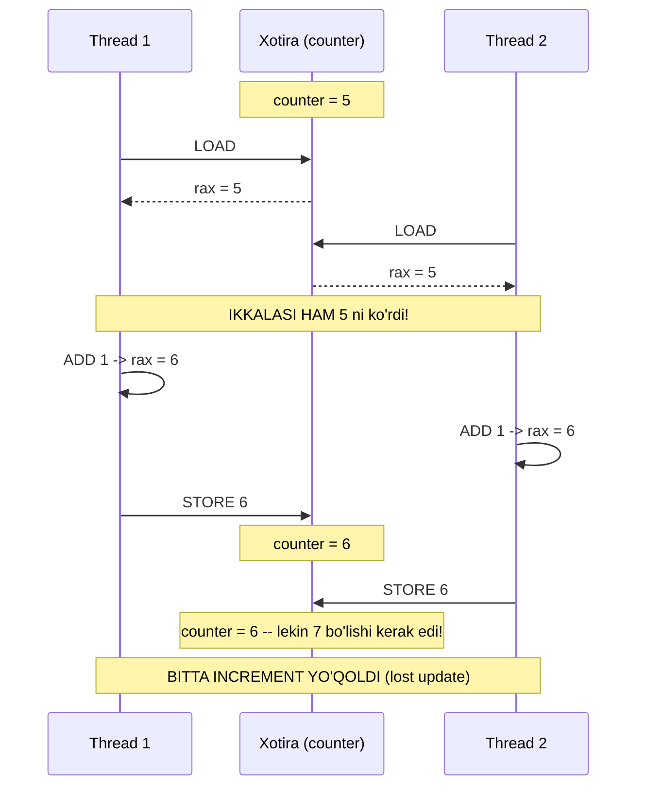
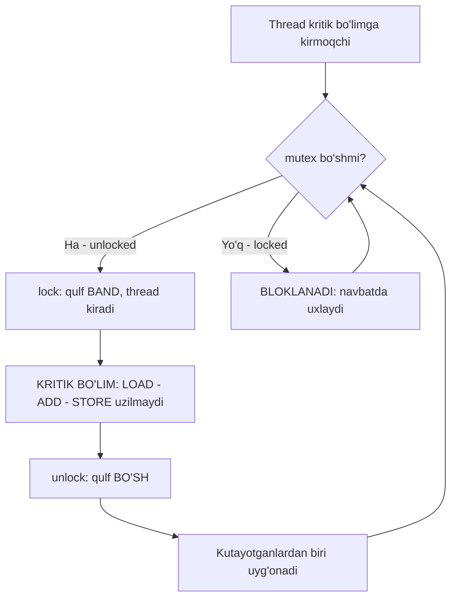
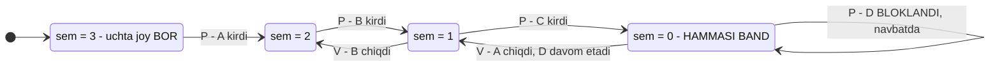

# 33. Shared Variables va Sinxronizatsiya — race condition, mutex, atomic

> Manba: CS:APP 2-nashr, 12.4-12.5 · Muhit: Ubuntu 24.04 x86-64 (Docker), gcc 13.3.0, go 1.22.2 · [← Oldingi](32-concurrency-models.md) · [Kurs xaritasi](00-README.md) · [Keyingi →](34-parallelism-issues.md)

## Nima uchun kerak

32-darsda thread modeli process modelidan yengil va tez ekanini ko'rdik: thread'lar bitta address space'ni **bo'lishadi**, shuning uchun ular orasida ma'lumot uzatish tekin. Bu darsda o'sha "tekin"ning narxini to'laymiz. Chunki bo'lishilgan xotira — bu **imkoniyat** emas, balki **xavf**: to'rtta thread `counter++` qilsa, `400000` o'rniga `300000` chiqadi va hech kim xato bermaydi, hech qayerda `panic` bo'lmaydi — shunchaki sonlar **jimgina yo'qoladi**.

Bu darsda o'sha yo'qolishning aniq mexanizmini assembly darajasida ko'ramiz (spoiler: `counter++` — bitta amal emas, **uchta**), va nima uchun hatto **bitta instruksiya** ham atomik emasligini isbotlaymiz. Keyin uch yechimni sinaymiz: **mutex**, **semaphore**, **atomic**. Va oxirida Go'ning superkuchini ishlatamiz — `go test -race`, C dunyosida bo'lmagan qurol. Race condition — dasturchi hayotidagi eng qiyin topiladigan bug turi: u **nondeterministik** (har safar boshqa natija), testda ko'rinmaydi, `printf` qo'shsang yo'qoladi, va production'da tunda, yuk cho'qqisida chiqadi.

## Nazariya

### 1. Thread xotira modeli: nima bo'lishiladi, nima yo'q

32-darsdan bilamiz: bitta process ichidagi thread'lar **bitta virtual address space**da (24-dars) yashaydi. Amalda bu quyidagicha taqsimlanadi:

| Xotira sohasi | Kim ko'radi | Misol |
|---------------|-------------|-------|
| **`.text`** (kod) | Hamma thread | Funksiyalar |
| **`.data` / `.bss`** (global, static) | **HAMMA — SHARED** | `long counter;` |
| **Heap** (`malloc`, Go'da `make`/`new`) | **HAMMA — SHARED** | `map`, `slice` ichki massivi |
| **Ochiq fayl deskriptorlari** | Hamma (28-dars) | socket, fayl |
| **Stack** (lokal o'zgaruvchilar) | **Har thread — o'ziniki** | `for` sikldagi `i` |
| **Registrlar** (`%rax`, `%rsp`, `%rip`) | Har thread — o'ziniki | 06-darsdagi registrlar |

Ya'ni **global** va **heap** — umumiy, **stack** — shaxsiy. Lekin bu yerda CS:APP ta'kidlaydigan nozik gap bor:

> Thread stack'lari bir-biridan **himoyalanmagan** — ular shunchaki **alohida**. Agar bir thread o'z lokal o'zgaruvchisining **manzilini** (pointer) boshqa thread'ga uzatsa, u ham o'sha xotiraga bemalol yozadi.

Shuning uchun "shared o'zgaruvchi" ta'rifi joylashuvga emas, **erishimlilikka** bog'liq: agar bittadan ortiq thread bir xotira katagiga tega olsa — u **shared**, tamom. Go'da bu ayniqsa yashirin: `go func() { counter++ }()` yozganingda closure `counter`ni **ushlab qoladi** (capture), kompilyator uni escape analysis bilan **heap**ga ko'chiradi — va endi u global bo'lmasa ham hamma goroutine uchun bitta, umumiy nusxada turadi.

### 2. Race condition — natija tartibga bog'liq bo'lib qolganda

**Data race** ta'rifi uchta shartdan iborat va uchalasi ham bir vaqtda bajarilishi kerak:

1. Ikki yoki undan ortiq thread **bitta xotira joyiga** murojaat qiladi;
2. Ulardan kamida bittasi **yozadi** (faqat o'qish — race emas);
3. Ular orasida **sinxronizatsiya yo'q** (hech qanday happens-before munosabati).

Natijada dastur chiqishi **thread'larning bajarilish tartibiga** bog'liq bo'lib qoladi — ya'ni scheduler qaroriga (21-dars), yadro soniga, mashinadagi umumiy yukka. Bu **nondeterminizm**: bir xil kod, bir xil kirish ma'lumoti — har safar boshqa natija.

> Race condition — bu "ba'zan buziladi" degan bug emas. Bu "**har doim buzuq**, lekin ba'zan omading kelib to'g'ri chiqadi" degan bug.

### 3. Nega buziladi: `counter++` atomik EMAS

Butun darsning yuragi shu yerda. C'da `counter++` — bitta ifoda, bitta nuqtali vergul. Mashinada esa u **uchta** amal (06-darsdagi `mov` va 04-darsdagi arifmetika):

```
1. LOAD   xotiradan %rax ga o'qish
2. MODIFY %rax ga 1 qo'shish
3. STORE  %rax ni xotiraga qaytarish
```

Va thread bu **uch qadamning istalgan ikkitasi orasida** to'xtatilishi mumkin: timer interrupt keladi, scheduler thread'ni almashtiradi (21-dars). Ko'p yadroli mashinada esa bundan ham yomoni — hech kimni almashtirish shart emas, ikki thread **haqiqatan bir vaqtda**, ikki yadroda ishlaydi.

Quyidagi interleaving (aralashuv) `counter = 5` holatidan boshlanadi. Ikki thread bittadan increment qiladi, natija `7` bo'lishi kerak edi:



Xuddi shu narsani qadamma-qadam jadval bilan ham ko'ring — imtihonda va intervyuda shu jadvalni chiza olish talab qilinadi:

| Qadam | Thread 1 | Thread 2 | T1 `%rax` | T2 `%rax` | Xotirada `counter` |
|-------|----------|----------|-----------|-----------|--------------------|
| 1 | LOAD | — | 5 | — | 5 |
| 2 | — | LOAD | 5 | 5 | 5 |
| 3 | ADD | — | **6** | 5 | 5 |
| 4 | — | ADD | 6 | **6** | 5 |
| 5 | STORE | — | 6 | 6 | **6** |
| 6 | — | STORE | 6 | 6 | **6** ← 7 emas! |

T2 o'zining LOAD'ini T1 STORE qilishidan **oldin** bajardi — ya'ni u **eskirgan qiymat** bilan ishladi va T1 ning ishini **ustidan yozib yubordi**. 1-demoda yo'qolgan 100000 increment — aynan shu holatning yuz minglab marta takrorlanishi.

### 4. Nozik nuqta: bitta instruksiya ham atomik EMAS

Bu joyda ko'p dasturchi adashadi. `gcc -O1` bilan kompilyatsiya qilsak, uchta instruksiya **bittaga** siqiladi: `addq $1, counter(%rip)`. Tabiiy xulosa: "bitta instruksiya — demak bo'linmas — demak race yo'q". **Bu xato.**

Sabab: x86'da xotira ustidagi `addq` — bu **read-modify-write** instruksiyasi. Protsessor uni ichida baribir uch bosqichda bajaradi (cache'dan o'qiydi, qo'shadi, cache'ga yozadi). Bitta yadroda bu instruksiya **interrupt bilan uzilmaydi** (interrupt instruksiya chegarasida qabul qilinadi) — shuning uchun eski bir yadroli mashinalarda bunday kod **ishlayotgandek ko'rinardi**. Lekin ikkita yadro shu instruksiyani **bir vaqtda** bajarsa, ularning ichki bosqichlari aralashadi va yana o'sha lost update chiqadi.

> Atomiklik protsessorga **aytilishi** kerak. x86'da buning yagona yo'li — **`lock` prefiksi**. `lock` bo'lmasa, xotiraga tegadigan hech qanday arifmetik instruksiya ko'p yadroda atomik emas.

`lock addq` bajarilganda CPU shu instruksiya davomida tegishli **cache line**ni eksklyuziv holatda ushlab turadi (17-darsdagi cache va MESI coherence protokoli) — boshqa yadro bu vaqtda o'sha cache line'ga tega olmaydi. Bu 3- va 5-demolar orasidagi bitta so'zlik farq: `addq` va `lock addq`.

### 5. Kritik bo'lim va mutual exclusion

Shared o'zgaruvchiga tegadigan kod bo'lagi — **critical section** (kritik bo'lim). Yechim g'oyasi juda sodda:

> **Mutual exclusion** (o'zaro istisno): kritik bo'limda bir vaqtda **faqat bitta** thread bo'lsin. Unda LOAD-MODIFY-STORE ketma-ketligi uzilmaydi va tashqaridan **bo'linmas** (atomik) ko'rinadi.

CS:APP buni **progress graph** bilan tushuntiradi: ikki thread progressi — ikkita o'q; dastur bajarilishi — shu tekislikdagi trayektoriya; ikkala thread ham kritik bo'limda bo'lgan soha — **XAVFLI ZONA**:

```text
   Thread 2 progressi
     ^
     |           +---------------------+
 STORE|   .    . |    .     .     .    |   .
  ADD |   .    . |    .  XAVFLI  .     |   .     Ikkala thread ham
 LOAD |   .    . |    .   ZONA   .     |   .     kritik bo'limda ->
     |   .    .  +---------------------+   .     natija BUZUQ
     |   .    .    .     .     .     .     .
     +----------------------------------------> Thread 1 progressi
          LOAD   ADD   STORE
   Trayektoriya to'rtburchak ICHIDAN o'tsa -> race.
   Mutex to'rtburchakni "kirib bo'lmaydigan" qiladi -> trayektoriya AYLANIB o'tadi.
```

Butun sinxronizatsiya san'ati shu: **trayektoriyani xavfli zonadan chetlab o'tkazish**.

### 6. Mutex — qulf

**Mutex** (MUTual EXclusion) — ikki amalli qulf:

- **`lock()`** — "men kiryapman". Agar qulf band bo'lsa, thread **bloklanadi** (uxlaydi, CPU'ni bo'shatadi — Linux'da bu `futex` syscall orqali, 21-dars).
- **`unlock()`** — "chiqdim". Kutayotganlardan biri uyg'onadi.



Mutexning **narxi** bor va u bepul emas:

- **Serializatsiya** — kritik bo'lim endi ketma-ket bajariladi. Parallelizm aynan shu joyda **o'ladi** (34-darsdagi Amdahl qonuni shundan kelib chiqadi).
- **Overhead** — lock/unlock o'zi ham vaqt oladi; band qulfda thread uxlab-uyg'onadi (context switch).
- **Contention** (talashuv) — qancha ko'p thread bitta qulfni talashsa, shuncha yomon.

> Qoida: kritik bo'lim **imkon qadar kichik** bo'lsin, lekin **invariantni buzmaydigan** darajada katta bo'lsin. Kritik bo'lim ichida **I/O qilma** (syscall, tarmoq, disk) — qulfni ushlab turib uxlaysan, hamma seni kutadi.

### 7. Semaphore — sanoqli resurs

**Semaphore** (Dijkstra, 1965) — manfiy bo'lmagan butun son `s` va ikkita **atomik** amal:

| Amal | Boshqa nomi | Nima qiladi |
|------|-------------|-------------|
| **`P(s)`** | `wait`, `acquire`, `down` | `s > 0` bo'lguncha **kutadi**, keyin `s--` |
| **`V(s)`** | `signal`, `release`, `up` | `s++` qiladi va kutayotganlardan birini uyg'otadi |

Ikkita ishlatish usuli bor:

- **Binary semaphore** (`s = 1` dan boshlanadi) — bu aynan **mutex**: `P` = lock, `V` = unlock.
- **Counting semaphore** (`s = N`) — **N ta bir xil resurs**: DB connection pool, bir vaqtda ruxsat etilgan yuklab olishlar soni, ishchi slotlar.



Mutex va semaphore orasidagi eng muhim **kontseptual** farq — **egalik**: mutexni **kim qulflasa, o'sha ochadi**; semaphore'da esa `P` va `V` ni **turli thread'lar** bajarishi normal holat (aynan shu narsa producer-consumer'da kerak: producer `V` qiladi, consumer `P` qiladi). Go'da counting semaphore uchun alohida tip yo'q — **buffered channel** aynan shu (`sem := make(chan struct{}, N)`: `sem <- struct{}{}` = P, `<-sem` = V).

### 8. Atomik amallar va CAS

Uchinchi yechim — qulf **umuman olmaslik**, o'rniga apparatdan atomiklik so'rash:

- **`lock addq`** — atomik qo'shish (`atomic.AddInt64` shunga tushadi).
- **`xchg`** — atomik almashtirish (x86'da `xchg` xotira bilan **avtomatik** `lock`li).
- **`cmpxchg`** — **compare-and-swap (CAS)**: "agar qiymat hali ham `old` bo'lsa, `new` ga almashtir; bo'lmasa, xabar ber". Bu barcha lock-free algoritmlarning poydevori: `for { old := load(); if cas(old, f(old)) { break } }`.

Atomik amal **tez** (bitta instruksiya, syscall yo'q, uxlash yo'q), lekin **tor**: u faqat **bitta so'z** (word) ustidagi **sodda** amalni himoyalaydi. Agar kritik bo'liming ikki o'zgaruvchini bog'lasa (`balance -= x; history = append(...)`), atomik amal seni qutqarmaydi — **mutex** kerak.

| Vosita | Qachon | Narxi | Go'da |
|--------|--------|-------|-------|
| **atomic** | Bitta son/pointer, sodda amal (counter, flag) | Eng arzon | `sync/atomic`, `atomic.Int64` |
| **mutex** | Bir necha o'zgaruvchi, murakkab invariant, map | O'rtacha, serializatsiya | `sync.Mutex`, `sync.RWMutex` |
| **semaphore** | N ta bir xil resurs, rate limiting | Mutex bilan bir xil | buffered `chan struct{}` |
| **channel** | Ma'lumot **egaligini uzatish**, pipeline, koordinatsiya | Eng qimmat | `chan T` |

## Kod va isbot

### Demo 1 — Race condition: himoyasiz shared counter

To'rtta thread, har biri global `counter`ni 100000 marta oshiradi. Matematika oddiy: `4 x 100000 = 400000`.

```c
#include <stdio.h>
#include <pthread.h>

#define THREADS 4
#define ITERS   100000

long counter = 0;                     /* SHARED - himoyasiz! */

void *bump(void *arg)
{
    (void)arg;
    for (int i = 0; i < ITERS; i++)
        counter++;                    /* RACE: read-modify-write atomik EMAS */
    return NULL;
}

int main(void)
{
    pthread_t t[THREADS];
    for (int i = 0; i < THREADS; i++) pthread_create(&t[i], NULL, bump, NULL);
    for (int i = 0; i < THREADS; i++) pthread_join(t[i], NULL);

    long kutilgan = (long)THREADS * ITERS;
    printf("Kutilgan: %ld\n", kutilgan);
    printf("Haqiqiy:  %ld\n", counter);
    printf("YO'QOLGAN: %ld ta increment (race condition!)\n", kutilgan - counter);
    return 0;
}
```

```
Kutilgan: 400000
Haqiqiy:  300000
YO'QOLGAN: 100000 ta increment (race condition!)
```

Chorak million amal **yo'qoldi**. E'tibor ber: dastur **xato bermadi**, `segfault` bo'lmadi, hech narsa yonmadi — u shunchaki **yolg'on javob** qaytardi. Bu ishonch bilan aytilgan noto'g'ri javob — mumkin bo'lgan eng yomon xato turi. Va bu son barqaror emas: keyingi ishga tushirishda boshqa qiymat chiqadi, hatto omading kelib 400000 ham bo'lishi mumkin — natija **nondeterministik** (6-demoda Go xuddi shu kodda 266848 berdi).

### Demo 2 — Nega: `counter++` assembly'da (gcc -O0)

Sababni ko'rish uchun kompilyatordan so'raymiz:

```c
long counter;
void bump(void) { counter++; }
```

`gcc -O0 -S`:

```asm
bump:
	movq	counter(%rip), %rax     # 1. LOAD (xotiradan o'qish)
	addq	$1, %rax                # 2. MODIFY (1 qo'shish)
	movq	%rax, counter(%rip)     # 3. STORE (xotiraga yozish)
	ret
```

Mana u — race'ning **butun sababi** uch qatorda. `counter++` — bitta C amali, lekin mashinada **UCH** qadam (06-dars). Qadamlar orasida thread almashishi mumkin (context switch, 21-dars) yoki boshqa yadro parallel ishlashi mumkin. Nazariyadagi jadvalni endi shu uch instruksiya bilan o'qing: T1 LOAD (5 oldi), T2 LOAD (5 oldi), T1 ADD (6), T2 ADD (6), T1 STORE (6), T2 STORE (6) — ikkita increment o'rniga **bitta**.

### Demo 3 — Nozik nuqta: bitta instruksiya, lekin baribir race

Endi eng qiziq eksperiment. Xuddi shu kodni `gcc -O1 -S` bilan kompilyatsiya qilamiz:

```asm
bump:
	addq	$1, counter(%rip)       # BITTA instruksiya - lekin ATOMIK EMAS!
	ret
```

Optimizator uchta qadamni **bitta** `addq` ga siqdi. Ko'pchilik shu yerda "demak endi race yo'q" deb xulosa qiladi — va **adashadi**. x86'da xotira ustidagi `addq` **ichida** baribir read-modify-write bajariladi, va **`lock` prefiksi bo'lmasa** boshqa yadro shu jarayonning o'rtasiga kirib oladi.

Amaliy isbot: 1-demoni `-O1` bilan kompilyatsiya qilganda ham natija **300000** bo'lib qoladi — race yo'qolmadi. Bitta instruksiya ekani hech narsani kafolatlamaydi. Atomiklik — bu **instruksiya soni** haqidagi savol emas, **apparat kafolati** haqidagi savol.

### Demo 4 — Yechim A: mutex

```c
#include <stdio.h>
#include <pthread.h>

#define THREADS 4
#define ITERS   100000

long counter = 0;
pthread_mutex_t lock = PTHREAD_MUTEX_INITIALIZER;

void *bump(void *arg)
{
    (void)arg;
    for (int i = 0; i < ITERS; i++) {
        pthread_mutex_lock(&lock);     /* KRITIK BO'LIM boshlanishi */
        counter++;                      /* faqat BITTA thread bir vaqtda */
        pthread_mutex_unlock(&lock);   /* KRITIK BO'LIM oxiri */
    }
    return NULL;
}

int main(void)
{
    pthread_t t[THREADS];
    for (int i = 0; i < THREADS; i++) pthread_create(&t[i], NULL, bump, NULL);
    for (int i = 0; i < THREADS; i++) pthread_join(t[i], NULL);
    printf("Mutex bilan: kutilgan=%d, haqiqiy=%ld %s\n",
           THREADS*ITERS, counter, counter == (long)THREADS*ITERS ? "TO'G'RI" : "XATO");
    return 0;
}
```

```
Mutex bilan: kutilgan=400000, haqiqiy=400000 TO'G'RI
```

`lock()` — "men kirdim, boshqalar kutsin"; `unlock()` — "chiqdim". LOAD-MODIFY-STORE uchligi endi **uzilmaydi**, chunki boshqa thread bu vaqtda kritik bo'limga kira olmaydi. Natija — barqaror `400000`, har ishga tushirishda.

Narxini ham ko'ramiz: har increment uchun **ikkita** qo'shimcha amal (lock + unlock) bajarilyapti, ya'ni bitta `addq` uchun butun sinxronizatsiya mashinasi ishga tushyapti. Bu yerda kritik bo'lim juda kichik — shuning uchun overhead **foydali ishdan katta**. Aynan shu holat uchun keyingi demo mavjud.

### Demo 5 — Yechim B: atomik amal (lock prefiksi)

```c
#include <stdio.h>
#include <pthread.h>
#include <stdatomic.h>

#define THREADS 4
#define ITERS   100000

atomic_long counter = 0;               /* ATOMIK tip */

void *bump(void *arg)
{
    (void)arg;
    for (int i = 0; i < ITERS; i++)
        atomic_fetch_add(&counter, 1);  /* apparat darajasida atomik */
    return NULL;
}

int main(void)
{
    pthread_t t[THREADS];
    for (int i = 0; i < THREADS; i++) pthread_create(&t[i], NULL, bump, NULL);
    for (int i = 0; i < THREADS; i++) pthread_join(t[i], NULL);
    printf("Atomik bilan: kutilgan=%d, haqiqiy=%ld TO'G'RI\n", THREADS*ITERS, counter);
    return 0;
}
```

```
Atomik bilan: kutilgan=400000, haqiqiy=400000 TO'G'RI
```

Endi eng muhim qism — `gcc -O1 -S` nima chiqardi:

```asm
	lock addq	$1, counter(%rip)     # LOCK PREFIKSI - endi HAQIQATAN atomik
```

3-demo bilan solishtiring: instruksiya **o'sha** `addq`, farq **bitta so'zda** — `lock`. Shu bitta prefiks CPU'ga aytadi: "bu instruksiya davomida bu cache line **meniki**". Protsessor cache coherence protokoli orqali (17-dars) cache line'ni eksklyuziv holatga o'tkazadi va boshqa yadrolar kutadi.

Atomik yondashuv mutexdan **tezroq** (uxlash yo'q, syscall yo'q, navbat yo'q), lekin **chegarali**: faqat sodda amallar (increment, swap, compare-and-swap). Bir necha o'zgaruvchini birga himoyalash kerak bo'lsa — mutexga qayting.

### Demo 6 — Go: aynan shu uch holat

Go bu muammodan **ozod emas**. Goroutine'lar ham xuddi thread'lar kabi xotirani bo'lishadi (32-dars):

```go
package main

import (
	"fmt"
	"sync"
	"sync/atomic"
)

const (
	goroutines = 4
	iters      = 100000
)

func racy() int64 {
	var counter int64
	var wg sync.WaitGroup
	for i := 0; i < goroutines; i++ {
		wg.Add(1)
		go func() {
			defer wg.Done()
			for j := 0; j < iters; j++ {
				counter++ // RACE - himoyasiz
			}
		}()
	}
	wg.Wait()
	return counter
}

func withMutex() int64 {
	var counter int64
	var mu sync.Mutex
	var wg sync.WaitGroup
	for i := 0; i < goroutines; i++ {
		wg.Add(1)
		go func() {
			defer wg.Done()
			for j := 0; j < iters; j++ {
				mu.Lock()
				counter++
				mu.Unlock()
			}
		}()
	}
	wg.Wait()
	return counter
}

func withAtomic() int64 {
	var counter int64
	var wg sync.WaitGroup
	for i := 0; i < goroutines; i++ {
		wg.Add(1)
		go func() {
			defer wg.Done()
			for j := 0; j < iters; j++ {
				atomic.AddInt64(&counter, 1)
			}
		}()
	}
	wg.Wait()
	return counter
}

func main() {
	want := int64(goroutines * iters)
	fmt.Printf("Kutilgan:        %d\n", want)
	fmt.Printf("Himoyasiz (race): %d  <- noto'g'ri!\n", racy())
	fmt.Printf("sync.Mutex:      %d  TO'G'RI\n", withMutex())
	fmt.Printf("sync/atomic:     %d  TO'G'RI\n", withAtomic())
}
```

```
Kutilgan:        400000
Himoyasiz (race): 266848  <- noto'g'ri!
sync.Mutex:      400000  TO'G'RI
sync/atomic:     400000  TO'G'RI
```

`266848` — C'dagi `300000` dan ham yomonroq, chunki Go scheduler goroutine'larni tez-tez almashtiradi. Va bu son **har ishga tushirishda boshqacha** bo'ladi. Diqqat: `counter` bu yerda **lokal** o'zgaruvchi, global emas — lekin closure uni ushlab qolgani uchun u **heap**ga ko'chgan va hamma goroutine uchun **bitta nusxada**. Aynan 1-bo'limda aytilgan tuzoq.

`sync.Mutex` = C mutexning ekvivalenti. `sync/atomic` = `lock addq` ning ekvivalenti (Go kompilyatori `atomic.AddInt64` uchun x86'da `LOCK XADDQ` chiqaradi). Ikkalasi ham to'g'ri javob beradi.

### Demo 7 — Race detector: Go'ning superkuchi

Yuqoridagi kodni **shu flag** bilan ishga tushiramiz: `go run -race main.go`

```
WARNING: DATA RACE
      /work/33/go/main.go:22 +0x99
Previous write at 0x00c00019e028 by goroutine 8:
      /work/33/go/main.go:22 +0xab
```

Go **ishga tushish paytida** race'ni topdi va aniq **qatorini** (`main.go:22` — bizning `counter++`), **manzilini** (`0x00c00019e028`) va **qaysi goroutine'lar** ekanini ko'rsatdi. Bu C dunyosida standart emas (ThreadSanitizer bor, lekin alohida flag va alohida bilim talab qiladi).

Race detector qanday ishlaydi: `-race` bilan kompilyator **har bir xotira murojaatiga** kuzatuv kodi qo'shadi va runtime happens-before munosabatlarini kuzatadi. Shuning uchun:

- Dastur **~10 marta sekinlashadi** va **5-10 barobar** ko'p xotira yeydi — production'da emas, **test/CI**da ishlatiladi.
- U **faqat haqiqatan bajarilgan** kod yo'llaridagi race'ni ko'radi. Test o'sha yo'ldan o'tmasa — race jim qoladi. Ya'ni `-race` **yo'qlikni isbotlamaydi**, faqat **borlikni isbotlaydi**.

> Amaliy qoida: `go test -race ./...` — CI'da **majburiy** qadam. Bu bitta flag sizning eng qimmat production incident'ingizni oldini oladi.

## Go dasturchiga ko'prik

**`sync.Mutex`** — nol qiymati **tayyor** (`var mu sync.Mutex` yetadi, init shart emas). Har doim `defer mu.Unlock()` yozing: funksiya `panic` bo'lsa yoki o'rtada `return` qilsa ham qulf ochiladi. `sync.RWMutex` — ko'p o'quvchi, bitta yozuvchi: `RLock()` ni bir vaqtda **ko'p** goroutine oladi, `Lock()` esa hammani to'sadi. Konfiguratsiya, routing table, cache kabi **kam yoziladigan, ko'p o'qiladigan** ma'lumot uchun ideal.

**`sync/atomic`** — `atomic.AddInt64`, `atomic.LoadInt64`, `atomic.CompareAndSwapInt64`. Go 1.19+ da yangi tiplar bor: `atomic.Int64`, `atomic.Bool`, `atomic.Pointer[T]` — ular metodli (`c.Add(1)`), va 32-bit platformalardagi **alignment** muammosini o'zi hal qiladi. Yangi kodda aynan shularni ishlating.

**`sync.WaitGroup`** — "hamma tugaguncha kut" (C'dagi `pthread_join` sikliga mos). **`sync.Once`** — `Do(f)` funksiyani **aniq bir marta** bajaradi, hatto 100 goroutine bir vaqtda chaqirsa ham (singleton, lazy init).

**Go falsafasi** esa boshqa yo'lni taklif qiladi:

> Xotirani bo'lishib muloqot qilma — **muloqot qilib xotirani bo'lish.**

Channel ma'lumot uzatish bilan birga **sinxronizatsiyani ham** olib yuradi: qiymat channel orqali o'tganda, u bilan birga unga **egalik** ham o'tadi va happens-before munosabati **kafolatlanadi**. Amaliy tanlov qoidasi:

| Vazifa | To'g'ri vosita |
|--------|----------------|
| Bitta counter, flag | `atomic` |
| Struct/map ichidagi **holatni himoyalash** | `sync.Mutex` |
| Ma'lumotni goroutine'lar orasida **uzatish** | `chan` |
| N ta parallel ishni cheklash (rate limit) | buffered `chan struct{}` (semaphore) |
| Ishning tugashini kutish | `sync.WaitGroup` |

Va oxirgi ko'prik — **false sharing** (17-dars): agar ikki goroutine ikki **turli** atomik counter'ni yangilasa, lekin ular **bitta cache line**da (64 bayt) yotsa, yadrolar o'sha cache line'ni bir-biridan tortqilab, dastur **sekinlashadi** — mantiqiy race yo'q, lekin apparat darajasida talashuv bor. Yechim: counter'larni padding bilan alohida cache line'larga tarqatish.

## Real-world scenariylar

**1. Goroutine'lardan umumiy map/cache.** Go'da himoyasiz `map`ga ikki goroutine yozsa, runtime buni **o'zi sezadi** va `fatal error: concurrent map writes` bilan dasturni **o'ldiradi** (bu `recover` qilib bo'lmaydigan xato). Yechimlar: (a) `sync.RWMutex` bilan o'rash — eng oddiy va eng ko'p ishlatiladigan; (b) `sync.Map` — faqat **read-heavy** yoki "har kalit bitta marta yoziladi" holatlarida foydali, universal emas; (c) **sharded map** — 256 ta bo'lakcha, har birida o'z mutexi, kalitning hash'i bo'yicha tanlanadi (lock contention 256 barobar kamayadi); (d) map'ni **bitta goroutine egallaydi**, qolganlar unga channel orqali so'rov yuboradi.

**2. Metrics/counter hot path.** HTTP handler'da har so'rovni sanash kerak. Mutex qo'ysang, minglab goroutine bitta qulfni talashadi — u **bo'yin bo'g'zi**ga aylanadi. To'g'ri yechim: `atomic.Int64.Add(1)` — bitta `lock addq`, kutish yo'q. Yuk juda katta bo'lsa: **per-shard counter** (masalan har CPU uchun bitta, padding bilan false sharing'dan himoyalangan), o'qishda hammasini yig'ish. Prometheus client kutubxonasi ichida aynan shu yondashuv.

**3. Race testda ko'rinmaydi, production'da chiqadi.** Bu eng ko'p uchraydigan hikoya: lokal mashinada test **yashil**, staging'da **yashil**, production'da yuk cho'qqisida ma'lumot buziladi. Sabab: race nondeterministik — u parallel yuk, ko'p yadro va scheduler bosimi ostida "uyg'onadi". Qarshi chora: `go test -race ./...` CI'da majburiy; parallel testlar (`t.Parallel()`); yuk ostidagi (load) testlarni ham `-race` bilan bir marta o'tkazish.

## Zamonaviy yondashuv

**ThreadSanitizer (TSan).** Go'ning `-race` bayrog'i aynan shu texnologiya ustiga qurilgan. C/C++ uchun ham mavjud: `gcc -fsanitize=thread`. Ya'ni C dunyosida ham qurol bor — lekin u **standart odat** emas, Go'da esa bir bayt bilan ishlaydi.

**Memory model va happens-before.** Zamonaviy CPU va kompilyator amallarni **qayta tartiblaydi** (13-dars). Shuning uchun "sinxronizatsiya" faqat "qulf" degani emas — u **happens-before** munosabatini o'rnatish degani. Go Memory Model rasman aytadi: mutex `Unlock` keyingi `Lock` dan **oldin sodir bo'ladi**; channel'ga yuborish undan qabul qilishdan oldin sodir bo'ladi. C++11 esa dasturchiga memory order'larni qo'lda beradi (`relaxed`, `acquire`, `release`, `seq_cst`) — kuchli, lekin xatoga juda moyil. Go'ning `sync/atomic` amallari **sequentially consistent** — bu ataylab qilingan soddalashtirish.

**Lock-free strukturalar.** CAS ustiga qurilgan: retry sikli bilan ishlaydi, qulf umuman olinmaydi (lock-free queue, stack). Afzalligi — bitta thread to'xtab qolsa boshqalar bloklanmaydi. Kamchiligi — juda murakkab, **ABA muammosi** bor (qiymat A dan B ga, keyin yana A ga qaytsa, CAS "o'zgarmadi" deb o'ylaydi), va amalda ko'pincha yaxshi mutexdan tezroq emas. Qoida: lock-free'ga faqat o'lchov (15-dars) contention'ni isbotlagandan **keyin** o'ting.

**Contention'ni kamaytirish.** Sinxronizatsiyaning eng yaxshi turi — **umuman kerak bo'lmagani**. Yondashuvlar: sharding/striping (qulfni bo'laklarga bo'lish), immutable ma'lumot (o'zgarmasa — race yo'q), copy-on-write, va "har goroutine o'z nusxasida ishlaydi, oxirida yig'iladi" (map-reduce uslubi).

**Rust.** Boshqacha falsafa: data race'ni **kompilyatsiya vaqtida** taqiqlaydi. Ownership va borrow checker `Send`/`Sync` tiplari orqali "himoyasiz shared mutable ma'lumot" ni **yozib bo'lmaydigan** qiladi. Ya'ni bizning 1-demo Rust'da **kompilyatsiya qilinmaydi**. Bu — race muammosini runtime'dan compile-time'ga ko'chirishning eng jiddiy urinishi.

## Keng tarqalgan xatolar

1. **"`counter++` atomik-ku"** — eng klassik xato. Mashinada bu **LOAD-MODIFY-STORE** (2-demo), va hatto `-O1` bitta `addq` chiqarsa ham, **`lock` prefiksisiz** atomik emas (3-demo). Bitta instruksiya bo'lishi — kafolat emas.
2. **Race'ni test bilan "yo'q" deb hisoblash.** Race nondeterministik: 100 marta o'tgan test 101-marta yiqilishi mumkin. `-race`siz sen race yo'qligini **isbotlay olmaysan**, faqat "hozircha ko'rmadim" deya olasan. `go test -race` — CI'da majburiy.
3. **Kritik bo'limning bir qismini himoyalash.** `mu.Lock()` bilan **yozdim**, lekin boshqa joyda **qulfsiz o'qidim** — bu ham data race. Yoki `if !exists(k) { mu.Lock(); insert(k); mu.Unlock() }` — tekshiruv qulfdan **tashqarida** (check-then-act): ikki goroutine bir vaqtda "yo'q" deb ko'radi. Qoida: **hamma** murojaat (o'qish ham!) **bitta va o'sha** qulf ostida bo'lsin.
4. **`Unlock()` ni unutish yoki o'tkazib yuborish.** Erta `return`, `panic`, yoki xato tarmog'i — qulf ochilmay qoladi va butun dastur **muzlaydi** (deadlock, 34-dars). Yechim bitta va oddiy: `mu.Lock(); defer mu.Unlock()`.
5. **`sync.Mutex`ni nusxalash.** Mutexli struct'ni **qiymat bo'yicha** uzatsang (`func f(c Counter)`), qulfning **nusxasi** ketadi va himoya yo'qoladi. Har doim pointer bilan ishla (`*Counter`); `go vet` buni `copylocks` bilan ushlaydi.
6. **Har joyga mutex qo'yish.** "Xavfsiz bo'lsin" deb butun handler'ni bitta global mutex bilan o'rash — parallelizmni **o'ldiradi**, server bir yadroli bo'lib qoladi. Va eng yomoni: kritik bo'lim ichida **I/O** (DB so'rovi, HTTP call) qilish — qulfni ushlab turib millisekundlar davomida uxlaysan.

## Amaliy mashqlar

**1.** 1-demoda 400000 kutildi, 300000 chiqdi. O'sha 100000 increment **qayerga ketdi**? Mexanizmni aniq ayt.

<details><summary>Yechim</summary>
Hech qayerga "ketmadi" — ular **ustidan yozildi** (lost update). Interleaving: T1 LOAD (5), T2 LOAD (5), T1 ADD (6), T2 ADD (6), T1 STORE (6), T2 STORE (6). Ikki thread ham `counter = 5` ni ko'rdi, ikkalasi ham `6` yozdi — natijada **ikkita** increment o'rniga **bitta** qoldi. T2 ning STORE'i T1 ning ishini o'chirib tashladi. Bu holat siklda yuz minglab marta takrorlandi. Yo'qolgan aniq son **nondeterministik** — keyingi ishga tushirishda boshqacha bo'ladi.
</details>

**2.** `counter++` nechta mashina amali, va nima uchun aynan **qadamlar orasi** xavfli?

<details><summary>Yechim</summary>
Uchta (2-demo, `gcc -O0`): `movq counter(%rip), %rax` (LOAD), `addq $1, %rax` (MODIFY), `movq %rax, counter(%rip)` (STORE). Xavf shundaki, thread bu qadamlar **orasida** to'xtatilishi mumkin — timer interrupt kelib scheduler thread'ni almashtiradi (21-dars) — yoki ko'p yadroli mashinada boshqa thread **ayni damda parallel** o'sha xotiraga tegayotgan bo'ladi. LOAD dan keyin `%rax` dagi qiymat **eskirgan** bo'lib qolishi mumkin, lekin STORE buni sezmaydi va eski qiymatga asoslangan natijani yozadi.
</details>

**3.** Do'sting: "`gcc -O1` bitta `addq` chiqardi — bitta instruksiya bo'linmaydi, demak race yo'q". Rad et.

<details><summary>Yechim</summary>
Bu xato (3-demo). x86'da xotira ustidagi `addq` — **read-modify-write** instruksiyasi: protsessor uni ichida baribir "cache'dan o'qi, qo'sh, cache'ga yoz" bosqichlarida bajaradi. **Bitta yadroda** u interrupt bilan uzilmaydi (interrupt instruksiya chegarasida qabul qilinadi) — shuning uchun ko'pchilik adashadi. Lekin **ikki yadro** shu instruksiyani bir vaqtda bajarsa, ularning ichki bosqichlari aralashadi. Kafolat faqat **`lock` prefiksi** bilan keladi (5-demo: `lock addq`), u cache line'ni instruksiya davomida eksklyuziv ushlaydi (17-dars). Amaliy dalil: 1-demo `-O1` bilan ham 300000 beradi.
</details>

**4.** Qaysi holatda `atomic` **yetarli emas** va mutex **shart**? Konkret misol keltir.

<details><summary>Yechim</summary>
Atomik amal faqat **bitta so'z** ustidagi **bitta** amalni himoyalaydi. Agar invariant **bir necha o'zgaruvchini** bog'lasa — atomik ojiz. Misol: pul o'tkazish — `from -= x` va `to += x`. Ikkalasini alohida-alohida atomik qilsang ham, orada boshqa goroutine "pul yo'qolgan" oraliq holatni ko'radi (jami balans buziladi). Boshqa misol: `map` (bir necha xotira katagi bilan ishlaydi) yoki `slice` ga `append` (uzunlik + pointer + cap birga o'zgaradi). Bunday hollarda **butun blok** bitta `mu.Lock()`/`mu.Unlock()` ichida bo'lishi kerak. Qoida: **atomic = bitta son; mutex = invariant**.
</details>

**5.** `lock` prefiksi apparat darajasida nima qiladi va bu cache bilan qanday bog'liq?

<details><summary>Yechim</summary>
`lock addq $1, counter(%rip)` bajarilganda CPU shu instruksiya davomida `counter` yotgan **cache line**ni eksklyuziv holatda ushlab turadi (cache coherence protokoli, 17-dars). Boshqa yadrolar shu vaqtda o'sha cache line'ni o'qiy ham, yoza ham olmaydi — ular kutadi. Natijada read-modify-write **bo'linmas** bo'lib qoladi. Eski protsessorlarda bu butun **xotira shinasini** qulflash orqali qilinardi (juda qimmat); zamonaviylarida faqat bitta cache line ushlanadi. Yon effekt: bir cache line'ni ko'p yadro tez-tez `lock` bilan urib tursa — **contention** va **false sharing** kelib chiqadi, ya'ni atomik counter ham cheksiz arzon emas.
</details>

**6.** `go test -race` nimani topadi va nimani **topa olmaydi**?

<details><summary>Yechim</summary>
**Topadi:** haqiqatan **bajarilgan** kod yo'lidagi data race'ni — ikki goroutine bir xotira manziliga tegdi, kamida bittasi yozdi, orada happens-before yo'q. Aniq qator, manzil va ikkala goroutine'ning stack'ini ko'rsatadi (7-demo). **Topa olmaydi:** test bosmagan kod yo'lidagi race'ni (u **statik tahlil emas** — faqat kuzatgan narsasini ayta oladi); deadlock, livelock, mantiqiy xatolarni (masalan check-then-act natijasida ikki marta insert — bu race detector uchun ko'rinmas bo'lishi mumkin, agar hamma murojaat qulf ostida bo'lsa). Shuning uchun: `-race` + parallel testlar + yuk ostidagi sinov. Va u ~10x sekinlashtiradi — production'da yoqilmaydi.
</details>

**7.** Go'da: `for i := 0; i < 4; i++ { go func() { mu.Lock(); counter++ }() }` — bu yerda **ikki** xato bor. Topib to'g'rila.

<details><summary>Yechim</summary>
(a) **`mu.Unlock()` yo'q**: birinchi goroutine qulfni oladi va **hech qachon qo'ymaydi** — qolgan uchtasi `Lock()` da abadiy bloklanadi (deadlock, 34-dars). To'g'risi: `mu.Lock(); defer mu.Unlock()`. (b) **Kutish yo'q**: `main` goroutine'lar tugashini kutmaydi, dastur `counter` yangilanmasidan chiqib ketishi mumkin. To'g'risi: `sync.WaitGroup` — `wg.Add(1)` siklda, `defer wg.Done()` goroutine ichida, `wg.Wait()` oxirida (6-demo `withMutex` funksiyasidagi shakl).
</details>

## Cheat sheet

| Tushuncha | Nima | Eslab qolish |
|-----------|------|--------------|
| **Shared** | Global, static, heap (`malloc`/`make`), closure ushlagan o'zgaruvchi | Bittadan ortiq thread tega olsa — shared |
| **Private** | Stack'dagi lokal o'zgaruvchi, registrlar | Lekin manzilini bersang — u ham shared bo'ladi |
| **Data race** | Shared + kamida bitta **yozuv** + sinxronizatsiya yo'q | Uch shart birga bo'lsa — race |
| **Nondeterminizm** | Natija thread tartibiga bog'liq | Har run boshqa son: 300000, 266848... |
| **`counter++`** | **LOAD → MODIFY → STORE** (uch qadam) | Bitta C amali ≠ bitta mashina amali |
| **Lost update** | Ikki thread bir qiymatni o'qib, bir xil natija yozadi | Ikki increment o'rniga bitta |
| **`addq mem`** | Bitta instruksiya, lekin **atomik EMAS** | Bitta instruksiya — kafolat emas! |
| **`lock` prefiksi** | Cache line'ni eksklyuziv ushlaydi (17-dars) | **Haqiqiy** atomiklikning yagona yo'li |
| **Critical section** | Shared ma'lumotga tegadigan kod bo'lagi | Kichik, lekin invariantni buzmaydigan |
| **Mutual exclusion** | Kritik bo'limda bir vaqtda **bitta** thread | Progress graph: xavfli zonani aylanib o'tish |
| **Mutex** | `lock()` / `unlock()` | Egasi bor: kim qulflasa, o'sha ochadi |
| **Semaphore** | `P` (wait, `s--`) / `V` (signal, `s++`) | `s=1` → mutex; `s=N` → N ta resurs |
| **Atomic** | Apparat kafolatlaydi, qulfsiz | Tez, lekin faqat **bitta so'z**, sodda amal |
| **CAS** | `cmpxchg`: "eski `old` bo'lsa, `new` yoz" | Barcha lock-free algoritmlar poydevori |
| **`sync.Mutex`** | Go mutex, nol qiymati tayyor | `mu.Lock(); defer mu.Unlock()` |
| **`sync.RWMutex`** | Ko'p o'quvchi / bitta yozuvchi | Read-heavy cache, config |
| **`sync/atomic`** | `atomic.AddInt64`, `atomic.Int64` (1.19+) | Counter, flag — hot path |
| **`sync.WaitGroup`** | "Hammasi tugaguncha kut" | `Add` / `Done` / `Wait` |
| **Buffered channel** | Counting semaphore | `make(chan struct{}, N)` = N ta slot |
| **`go test -race`** | Data race detektori | **CI'da majburiy**; ~10x sekin |
| **Go falsafasi** | Bo'lishib muloqot qilma — muloqot qilib bo'lish | Mutex = holat; channel = uzatish |
| **False sharing** | Turli o'zgaruvchi, bitta cache line | Race emas, lekin **sekin** (17-dars) |

## Qo'shimcha manbalar

- [Data Race Detector — go.dev](https://go.dev/doc/articles/race_detector) — `-race` qanday ishlaydi, hisobotni o'qish, cheklovlar va CI'da ishlatish
- [Synchronization: Atomics, Mutexes — Brown CS 0300](https://cs.brown.edu/courses/csci0300/2023/notes/l22.html) — `lock` prefiksi, atomik amallar va mutexning apparatdan qurilishi
- [Compare-and-swap — Wikipedia](https://en.wikipedia.org/wiki/Compare-and-swap) — CAS semantikasi, `cmpxchg`, ABA muammosi, lock-free asoslari
- Oldingi dars: [32. Concurrency modellari](32-concurrency-models.md) · Keyingi: [34. Parallelism va Concurrency muammolari](34-parallelism-issues.md) · [Kurs xaritasi](00-README.md)
