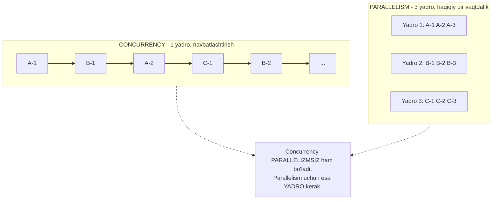
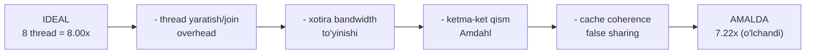
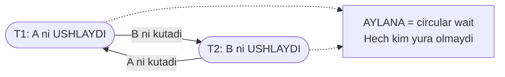
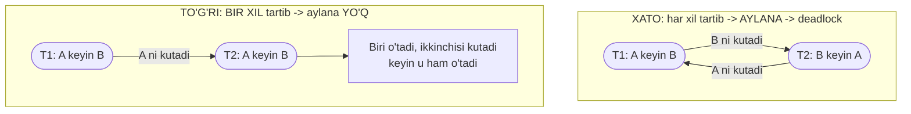

# 34. Parallelism va Concurrency Muammolari — deadlock, thread safety, kurs yakuni

> Manba: CS:APP 2-nashr, 12.6-12.7 · Muhit: deadlock/Go demolari — Ubuntu 24.04 x86-64 (Docker), gcc 13.3.0, go 1.22.2; speedup o'lchovlari — **native arm64 host, 10 yadro** · [← Oldingi](33-shared-variables.md) · [Kurs xaritasi](00-README.md)

## Nima uchun kerak

**Concurrency** va **parallelism** — intervyuda eng ko'p chalkashtiriladigan ikki so'z, va bu tasodif emas: ular haqiqatan boshqa-boshqa narsalar, biri **dizayn**, ikkinchisi **apparat**. Shu farqni tushunmagan dasturchi I/O kutayotgan servisga yadro qo'shib pul sarflaydi, yoki 8 yadroda 8 barobar tezlik kutib, 3 barobar olganda hayron bo'ladi.

Bu darsda ikkala tomonni ham oxirigacha ochamiz. Birinchisi — **narx**: 8 thread nega hech qachon aniq 8x bermaydi (o'lchaymiz: 7.22x), va bu chegarani kim qo'yadi (Amdahl, 15-dars). Ikkinchisi — **xavf**: **deadlock**, ya'ni ikki thread bir-birini abadiy kutib qotib qolishi. Deadlock — production'dagi eng qo'rqinchli bug: `panic` yo'q, log jim, CPU 0%, servis shunchaki **javob bermaydi**. Race condition (33-dars) noto'g'ri javob berardi; deadlock esa **umuman javob bermaydi**.

Va oxirida Go bizga alternativa taklif qiladi: qulf o'rniga **channel** — "xotirani bo'lishib muloqot qilma, muloqot qilib xotirani bo'lish". Bu kursning **so'nggi** darsi: 12-bobni yopamiz va 34 darsda qurilgan butun rasmni bir joyga yig'amiz.

## Nazariya

### 1. Concurrency va parallelism — ikki BOSHQA narsa

Eng qisqa ta'rif (Rob Pike):

> **Concurrency** — ko'p ishni bir vaqtda **BOSHQARISH** (dealing with). Bu **dastur strukturasi** haqida.
> **Parallelism** — ko'p ishni bir vaqtda **BAJARISH** (doing). Bu **apparat** haqida.

Oshxona analogiyasi buni bir zumda tushuntiradi. **Bitta** oshpaz uch taomni navbatlashtirib pishiradi: bittasi qaynayotganda ikkinchisini to'g'raydi, uchinchisini olovga qo'yadi. U bir vaqtda **bitta** harakat qilyapti, lekin uch taomni **boshqaryapti** — bu **concurrency**. **Uch** oshpaz uch taomni haqiqatan bir vaqtda pishirsa — bu **parallelism**.



Ikkalasi bir-biriga bog'liq, lekin **mustaqil**:

| | **Concurrency** | **Parallelism** |
|---|---|---|
| Savol | "Ko'p ishni qanday **boshqaraman**?" | "Ko'p ishni qanday **tez bajaraman**?" |
| Apparat | Bitta yadro **yetadi** | Ko'p yadro **shart** |
| Maqsad | Kutishni yashirish, javobgarlik (I/O) | Throughput, hisob tezligi |
| Misol | epoll event loop (32-dars), JS, `GOMAXPROCS=1` dagi 1000 goroutine | 8 yadroda 8 ta hisob thread'i |
| Go'da | goroutine, channel, select | `GOMAXPROCS`, yadro soni |
| Asosiy muammosi | **To'g'rilik**: race (33-dars), deadlock | **Tezlik**: speedup chegarasi (Amdahl) |

Ikki chekka holat farqni yaqqol ko'rsatadi:

- **Concurrency bor, parallelism yo'q**: JavaScript event loop — bitta thread, minglab so'rovni "bir vaqtda" xizmat qiladi, lekin fizik jihatdan har lahzada faqat **bitta** ish bajariladi. `GOMAXPROCS=1` bilan ishlayotgan Go servisi ham aynan shunday.
- **Parallelism bor, concurrency yo'q**: bitta ketma-ket thread ichida protsessor **ILP** bilan bir necha instruksiyani parallel bajaradi (14-dars) yoki SIMD bilan bir instruksiyada 8 sonni qo'shadi. Kodingda hech qanday concurrency yo'q — parallelizm **apparat ichida**, sen ko'rmaysan.

> Go'da: **goroutine yozsang — concurrency olasan. Yadro qo'shsang — parallelism olasan.** `GOMAXPROCS` — bu sozlagich: nechta goroutine **haqiqatan** bir vaqtda ishlashini belgilaydi (GMP, 32-dars). Goroutine soni bilan parallelizm darajasini chalkashtirma.

### 2. Parallel speedup va uning chegaralari

**Speedup** — o'lchov: `S(N) = T(1) / T(N)`, ya'ni bitta thread'dagi vaqtni N thread'dagi vaqtga bo'lamiz. **Efficiency** (samaradorlik) — `E = S(N) / N`: idealda 1.0 (100%).

Ideal holat — **linear speedup**: `S(N) = N`. Amalda buni **hech qachon** ko'rmaysan. Nega? Beshta soliq bor va ular birga ishlaydi:

| # | Soliq | Nima yeydi | Bog'liq dars |
|---|-------|-----------|--------------|
| 1 | **Thread overhead** | Yaratish, join qilish, scheduler ishi (syscall) | 21-dars |
| 2 | **Xotira bandwidth** | Hamma yadro bitta DRAM shinasidan o'qiydi — u to'yinadi | 16-dars |
| 3 | **Ketma-ket qism** | Parallellashtirib bo'lmaydigan kod (setup, yig'ish, I/O) | 15-dars (Amdahl) |
| 4 | **False sharing / coherence** | Yadrolar cache line'ni bir-biridan tortqilaydi | 17-dars |
| 5 | **Lock contention** | Kritik bo'lim **serial** — u yerda parallelizm o'ladi | 33-dars |

Uchinchisi — eng fundamentali. **Amdahl qonuni** (15-dars) aytadi: agar ishning `p` qismi parallellashsa, `(1-p)` qismi esa **majburan ketma-ket** bo'lsa:

```text
S(N) = ------------------
        (1 - p) + p / N

N -> cheksiz bo'lganda:   S(max) = 1 / (1 - p)
```

Ya'ni **chegara yadrolar soniga emas, ketma-ket qismga bog'liq**. Raqamlarda:

| Parallel ulush `p` | 2 yadro | 4 yadro | 8 yadro | **Cheksiz yadro** |
|---|---|---|---|---|
| 90% | 1.82x | 3.08x | 4.71x | **10x** |
| 95% | 1.90x | 3.48x | 5.93x | **20x** |
| 99% | 1.98x | 3.88x | 7.48x | **100x** |

> Kodingning atigi **5%** i ketma-ket bo'lsa, **1000 ta** yadro ham senga **20x** dan ortiq bermaydi. Yadro qo'shishdan **oldin** ketma-ket qismni kichraytir — aks holda pul sarflab, javob olmaysan.



Va yana bitta amaliy qoida: **thread soni > yadro soni** bo'lsa, speedup **o'smaydi** — faqat context switch overhead qo'shiladi. CPU-bound ishda thread soni = yadro soni (Go'da `GOMAXPROCS` default shunday). I/O-bound ishda esa bu qoida ishlamaydi: u yerda ko'p goroutine **kutishni yashirish** uchun kerak (concurrency, parallelism emas).

### 3. Thread safety — funksiya xavfsizmi?

Ta'rif oddiy, lekin diqqat bilan o'qi — u **funksiya** haqida, o'zgaruvchi haqida emas:

> Funksiya **thread-safe** — agar u bir necha thread'dan **bir vaqtda** (concurrent) chaqirilganda ham **har doim to'g'ri** natija bersa. Aks holda u **thread-unsafe**.

CS:APP thread-unsafe funksiyalarni **to'rt sinfga** bo'ladi. Bu tasnif juda foydali, chunki har sinfning **tuzatish usuli boshqa**:

| Sinf | Muammo | Klassik misol | Tuzatish |
|------|--------|---------------|----------|
| **1** | Shared o'zgaruvchini **himoyasiz** o'zgartiradi | `counter++` (33-dars) | **Oson**: mutex yoki atomic bilan o'ra. Interfeys o'zgarmaydi |
| **2** | Chaqiruvlar orasida **holat saqlaydi** (static/global) | `rand()` — static seed; `strtok()` — static pozitsiya | **Interfeys o'zgaradi**: holatni argumentga chiqar (`rand_r(&seed)`, `strtok_r`) |
| **3** | **Static** ma'lumotga **pointer qaytaradi** | `ctime()`, `localtime()`, `gethostbyname()`, `inet_ntoa()` | Reentrant versiya (`ctime_r`); manba yo'q bo'lsa — **lock-and-copy** |
| **4** | Thread-unsafe funksiyani **chaqiradi** | Yuqoridagilardan birini ishlatuvchi har qanday kod | **Tranzitiv**: chaqirilgan funksiya sinf 2/3 bo'lsa — o'rash **yordam bermaydi** |

Ikki nozik nuqtani alohida ta'kidlash kerak.

**Sinf 3 nega dahshatli.** `ctime()` vaqtni matnga aylantirib, **o'zining ichki static buferiga** pointer qaytaradi. Ikki thread uni chaqirsa — ikkalasi ham **bitta va o'sha** buferga pointer oladi. Birinchi thread pointer'ni ishlatishga ulgurmasdan, ikkinchisi bufer ustidan yozib yuboradi. Natija: birinchi thread **boshqa thread'ning vaqtini** chop etadi. Xato yo'q, `segfault` yo'q — shunchaki **noto'g'ri ma'lumot**.

**Lock-and-copy** — manba kodi yo'q eski kutubxona uchun yagona chora: qulfni ol → funksiyani chaqir → natijani **darhol o'z buferingga nusxala** → qulfni qo'y. Nusxa endi **seniki**, uni hech kim bosmaydi.

**Sinf 4 nega tranzitiv.** Agar funksiyang sinf 1 funksiyani chaqirsa — chaqiruvni qulf bilan o'rasang yetadi. Lekin sinf 2 yoki 3 ni chaqirsa — o'rash **yetmaydi**: muammo o'sha funksiyaning **ichki holatida**, va sen uni qulflasang ham, u baribir bitta buferni hammaga qaytaraveradi (lock-and-copy bundan istisno).

### 4. Reentrancy — thread safety'ning eng kuchli darajasi

> **Reentrant** funksiya — bajarilish davomida **hech qanday shared ma'lumotga tegmaydi**: faqat argumentlar va **stack**dagi lokal o'zgaruvchilar bilan ishlaydi (33-dars: stack — har thread'ning **shaxsiy** mulki).

Shuning uchun reentrant funksiyani 1000 thread bir vaqtda chaqirsa ham hech narsa to'qnashmaydi — **hech qanday qulf kerak emas**. Bu eng arzon va eng ishonchli thread safety: sinxronizatsiya **umuman yo'q**, chunki bo'lishiladigan narsa yo'q.

Munosabat quyidagicha (CS:APP shuni rasm bilan ko'rsatadi):

```text
+---------------------------------------------------------+
|  BARCHA funksiyalar                                      |
|                                                          |
|   +-------------------------------------------------+    |
|   |  THREAD-SAFE (mutex bilan ham erishiladi)       |    |
|   |                                                 |    |
|   |    +---------------------------------------+   |    |
|   |    |  REENTRANT (shared holat UMUMAN yo'q) |   |    |
|   |    +---------------------------------------+   |    |
|   +-------------------------------------------------+    |
+---------------------------------------------------------+

  Reentrant  =>  HAR DOIM thread-safe.
  Thread-safe =/=> reentrant  (mutexli funksiya thread-safe, lekin reentrant EMAS).
```

Nega mutexli funksiya reentrant emas? Chunki u **shared holatga tegadi** — shunchaki uni qulf bilan himoyalaydi. Amaliy oqibati bor: agar bunday funksiya **o'z-o'zini** qayta chaqirsa (rekursiya) yoki signal handler ichida chaqirilsa, u **o'zi ushlab turgan qulfni** yana olishga urinadi va **o'zini o'zi bloklaydi** (self-deadlock). Reentrant funksiyada bunday muammo tug'ilishi **mumkin emas**.

Go'da bu bevosita ko'rinadi: global `math/rand` funksiyalari thread-safe (ichida **global qulf** bor — sinf 2 muammosining "qulf" bilan yechimi), lekin hot path'da minglab goroutine shu bitta qulfni talashadi. Har goroutine uchun **o'z** `rand.New(...)` instansiyangni yaratsang — shared holat yo'qoladi, qulf ham kerak emas. Bu — sinf 2 dan **reentrant** uslubga o'tish.

### 5. Deadlock — abadiy kutish

> **Deadlock** — ikki (yoki undan ortiq) thread'ning har biri **boshqasi ushlab turgan** resursni kutadi. Hech kim qo'yib yubormaydi, hech kim oldinga siljimaydi. **Abadiy qotish.**

Deadlock'ning dahshati uning **jimligida**: dastur o'lmaydi, xato bermaydi, CPU **0%** — u shunchaki **javob bermaydi**. Race condition (33-dars) hech bo'lmasa noto'g'ri **son** berardi; deadlock esa umuman hech narsa bermaydi.

**To'rt shart** (Coffman shartlari) — deadlock uchun **to'rttasi ham birga** kerak:

| # | Shart | Ma'nosi |
|---|-------|---------|
| 1 | **Mutual exclusion** | Resurs eksklyuziv: qulf bir vaqtda **bitta** egaga tegishli |
| 2 | **Hold-and-wait** | Thread bir qulfni **ushlab turib**, ikkinchisini kutadi |
| 3 | **No preemption** | Qulfni zo'rlik bilan **tortib olib bo'lmaydi** — faqat egasi qo'yadi |
| 4 | **Circular wait** | Kutishlar **aylana** hosil qiladi: T1 → T2 → T1 |



Bu **wait-for graph**: tugunlar — thread'lar, o'qlar — "kim kimni kutyapti". Grafda **sikl** bo'lsa — deadlock **bor**. Sikl bo'lmasa — yo'q. Butun deadlock nazariyasi shu bitta gapga siqiladi.

> **To'rt shartdan bittasini buzsang — deadlock MUMKIN EMAS.** Amalda eng arzon buziladigani — to'rtinchisi, **circular wait**.

### 6. Deadlock oldini olish — lock ordering

CS:APP buni **mutex lock ordering rule** deb ataydi:

> Dastur deadlock'siz bo'ladi, agar **har bir mutex juftligi** `(s, t)` uchun ikkalasini ham oladigan **har bir thread** ularni **bir xil tartibda** olsa.

Ya'ni: barcha qulflar uchun **global tartib** e'lon qil va **hamma** unga rioya qilsin. Tartibni qanday tanlash — o'zingga bog'liq, faqat **bir xil** bo'lsin:

- **Manzil bo'yicha**: `if &a < &b { lock(a); lock(b) } else { lock(b); lock(a) }` — universal, hech qanday konvensiya eslab qolish shart emas.
- **ID bo'yicha**: bank o'tkazmasida **doim kichik hisob ID** birinchi qulflanadi. Shunda `transfer(A,B)` va `transfer(B,A)` **bir xil** tartibda qulflaydi.
- **Lock hierarchy** (daraja): qulflarga daraja beriladi (connection > table > row) va faqat **pastga** tushish mumkin, yuqoriga chiqish **taqiqlanadi**.



Qolgan uch shartni buzish yo'llari ham bor, lekin ularning narxi qimmatroq:

| Buziladigan shart | Usul | Narxi |
|---|---|---|
| **Circular wait** (4) | **Lock ordering** — doim bir xil tartib | Faqat kod intizomi. **Eng amaliy** |
| **Hold-and-wait** (2) | Hamma qulfni **bir vaqtda** ol (all-or-nothing), yoki bir vaqtda faqat bitta ushla | Parallelizm kamayadi |
| **No preemption** (3) | `trylock` + timeout + orqaga chekinish | **Livelock** xavfi (random backoff kerak) |
| **Mutual exclusion** (1) | Qulfsiz dizayn: immutable ma'lumot, lock-free/CAS, channel/actor (egalik uzatiladi) | Dizayn butunlay o'zgaradi |

Lock ordering'ning **cheklovi** ham bor va uni bilish shart: u faqat **hamma qulfni oldindan bilsang** va **hamma kod yo'li** qoidaga rioya qilsa ishlaydi. **Bitta** buzilish — deadlock qaytadi. Shuning uchun eng xavfli odat: **qulf ushlab turib, noma'lum kodni chaqirish** (callback, interfeys metodi, plugin) — u kod ichida qanday qulf olinishini sen ko'rmaysan.

### 7. Livelock va starvation — deadlock'ning qarindoshlari

Progress yo'qolishining yana ikki yo'li bor:

| | **Deadlock** | **Livelock** | **Starvation** |
|---|---|---|---|
| Harakat bormi? | **Yo'q** — hamma uxlaydi | **Ha** — hamma qayta urinadi | Ha — tizim ishlaydi |
| Progress bormi? | **Yo'q** | **Yo'q** | Bor, lekin **bir thread** uchun **yo'q** |
| CPU | ~**0%** | ~**100%** | Normal |
| Analogiya | Ikki mashina tor ko'prikda qarama-qarshi turibdi | Koridorda ikki kishi bir-biriga yo'l bermoqchi bo'lib, doim bir tomonga qadam tashlaydi | Navbatda turibsan, lekin har safar oldingga boshqa odam kirib ketadi |
| Yechim | Lock ordering | **Random** backoff (jitter) | **Fair** qulf (FIFO navbat) |

**Livelock** ko'pincha "aqlli" deadlock yechimidan tug'iladi: `trylock` muvaffaqiyatsiz bo'lsa, ushlagan qulfni qo'yib, qayta urinamiz. Ikki thread **bir xil vaqtda** shu ishni qilsa — ikkalasi ham qo'yadi, ikkalasi ham qayta oladi, ikkalasi ham yana to'qnashadi. **Cheksiz.** CPU 100% band, foydali ish **nol**. Yechim: qayta urinishdan oldin **tasodifiy** kutish (random backoff) — shunda ikki thread bir xil ritmda qolmaydi.

**Starvation**da tizim umuman progress qilyapti — lekin bitta thread **hech qachon** navbat olmaydi. Klassik misol: reader-writer qulfida o'quvchilar oqimi to'xtamasa, yozuvchi **abadiy** kutadi. Go'ning `sync.Mutex`ida aynan shundan himoya bor: agar goroutine qulfni **1 ms** dan ortiq kutsa, mutex **starvation mode**ga o'tadi va qulf navbatdagi kutuvchiga **to'g'ridan-to'g'ri** uzatiladi — yangi kelganlar oldinga o'tolmaydi.

## Kod va isbot

### Demo 1 — Deadlock: ikkita mutex, teskari tartib

Butun darsning markaziy misoli. Ikki thread, ikki mutex — va **teskari** olish tartibi:

```c
#include <stdio.h>
#include <pthread.h>
#include <unistd.h>

pthread_mutex_t A = PTHREAD_MUTEX_INITIALIZER;
pthread_mutex_t B = PTHREAD_MUTEX_INITIALIZER;

void *t1(void *arg) {
    (void)arg;
    pthread_mutex_lock(&A);  printf("  T1: A olindi\n"); fflush(stdout);
    usleep(100000);
    printf("  T1: B ni kutyapman...\n"); fflush(stdout);
    pthread_mutex_lock(&B);           /* T2 B ni ushlab turibdi -> KUTADI */
    pthread_mutex_unlock(&B); pthread_mutex_unlock(&A);
    return NULL;
}
void *t2(void *arg) {
    (void)arg;
    pthread_mutex_lock(&B);  printf("  T2: B olindi\n"); fflush(stdout);
    usleep(100000);
    printf("  T2: A ni kutyapman...\n"); fflush(stdout);
    pthread_mutex_lock(&A);           /* T1 A ni ushlab turibdi -> KUTADI */
    pthread_mutex_unlock(&A); pthread_mutex_unlock(&B);
    return NULL;
}

int main(void)
{
    pthread_t x, y;
    pthread_create(&x, NULL, t1, NULL);
    pthread_create(&y, NULL, t2, NULL);
    printf("DEADLOCK kutilmoqda (3 soniya)...\n"); fflush(stdout);
    sleep(3);
    printf("NATIJA: ikkala thread ham QOTIB QOLDI (deadlock)\n");
    return 0;   /* majburan chiqamiz */
}
```

```
DEADLOCK kutilmoqda (3 soniya)...
  T1: A olindi
  T2: B olindi
  T1: B ni kutyapman...
  T2: A ni kutyapman...
NATIJA: ikkala thread ham QOTIB QOLDI (deadlock)
```

Oxirgi ikki qatordan keyin **hech narsa** chiqmadi — thread'lar o'sha `pthread_mutex_lock` qatorida **abadiy** qoldi. `main` faqat `sleep(3)` tugagach `return 0` qilib, butun process'ni majburan tugatgani uchun dastur chiqdi. Agar `pthread_join` yozganimizda — dastur **cheksiz** osilib qolardi.

Vaqt bo'yicha nima sodir bo'ldi:

```mermaid
sequenceDiagram
    participant T1 as Thread 1
    participant MA as Mutex A
    participant MB as Mutex B
    participant T2 as Thread 2
    T1->>MA: lock(A) - OK
    T2->>MB: lock(B) - OK
    Note over T1,T2: usleep(100000) - ikkalasi ham qulfni USHLAB turibdi
    T1->>MB: lock(B) -> BAND (T2 da)
    Note over T1: BLOKLANDI - abadiy uxlaydi
    T2->>MA: lock(A) -> BAND (T1 da)
    Note over T2: BLOKLANDI - abadiy uxlaydi
    Note over T1,T2: T1 A ni ushlab B ni kutadi; T2 B ni ushlab A ni kutadi
    Note over T1,T2: AYLANA - hech kim qulfni QO'YMAYDI
```

To'rt shartning **hammasi** shu kodda bor:

1. **Mutual exclusion** — `pthread_mutex` ta'rifi bo'yicha eksklyuziv.
2. **Hold-and-wait** — T1 `A` ni **ushlab turib** `B` ni kutadi.
3. **No preemption** — hech kim T1 dan `A` ni **tortib ololmaydi**.
4. **Circular wait** — T1 → `B` → T2 → `A` → T1. **Aylana yopildi.**

`usleep(100000)` — bu **pedagogik hiyla**, deadlock'ni **kafolatlash** uchun. Usiz T1 juda tez ikkala qulfni olib, ishini tugatib qo'yishi mumkin edi va deadlock **chiqmasdi**. Aynan shu narsa deadlock'ni qo'rqinchli qiladi: u **timing bug** — testda 1000 marta o'tib, production'da yuk cho'qqisida 1001-marta qotadi.

**Tuzatish bitta qatorlik.** `t2` da qulflarni **A keyin B** tartibida ol (B dan boshlash o'rniga). Endi ikkala thread ham bir xil global tartibga (`A` → `B`) rioya qiladi, wait-for grafida **aylana yo'qoladi** — deadlock **imkonsiz** bo'lib qoladi. Qolgan uch shart o'z joyida qoladi, lekin ular yolg'iz yetarli emas.

**Production'da diagnostika**: servis javob bermaydi, CPU 0%, log jim. C'da: `gdb -p PID` va `thread apply all bt` — hamma thread `__lll_lock_wait` da turgani ko'rinadi. Go'da: `kill -QUIT PID` (yoki Ctrl+Backslash) — runtime **hamma goroutine'ning stack'ini** to'kib beradi va kim qayerda bloklangani darrov ko'rinadi.

### Demo 2 — Parallel speedup: 8 thread nechchi barobar tezlatadi?

Endi ikkinchi tomon — **narx**. Ish: **100 mln** element ustida `sqrt` hisoblash, massiv thread'lar orasida teng bo'laklarga bo'linadi. Har thread **o'z** bo'lagi bilan ishlaydi — hech qanday shared o'zgaruvchi, hech qanday qulf yo'q. Ya'ni bu **deyarli mukammal parallel** ish.

Muhim eslatma o'lchov muhiti haqida: bu raqamlar **native arm64 host**da (10 yadro) olindi, boshqa demolar esa x86-64 Docker konteynerida. Sabab: QEMU emulyatsiyasi ostidagi konteyner **haqiqiy parallelizmni ko'rsatmaydi** — u yadrolarni emulyatsiya qiladi. Speedup hodisasi arxitekturadan **mustaqil**, shuning uchun arm64 o'lchovi x86-64 uchun ham to'g'ri xulosa beradi.

```
Yadro soni: 10
Thread | vaqt (s) | speedup
   1   |  0.095   | 1.00x (baza)
   2   |  0.049   | 1.93x
   4   |  0.025   | 3.78x
   8   |  0.013   | 7.22x
```

Speedup **deyarli** chiziqli — lekin **hech biri ideal emas**:

| Thread | Ideal speedup | **Haqiqiy** | Efficiency `S/N` | Yo'qotilgan |
|---|---|---|---|---|
| 2 | 2.00x | **1.93x** | 96.5% | 0.07x |
| 4 | 4.00x | **3.78x** | 94.5% | 0.22x |
| 8 | 8.00x | **7.22x** | 90.3% | **0.78x** |

Diqqat qil: **efficiency pasayib boryapti** (96.5% → 94.5% → 90.3%). Thread qancha ko'p bo'lsa, har biridan olinadigan foyda shuncha kam. Sabablari — nazariyadagi beshta soliq: thread yaratish/join overhead, xotira bandwidth to'yinishi (16-dars: 8 yadro bitta DRAM shinasidan o'qiydi), ketma-ket qism (massivni tayyorlash, thread'larni yaratish, natijalarni yig'ish), cache coherence trafigi (17-dars).

Endi eng qiziq hisob — **Amdahl'ni teskari yechamiz** (15-dars). O'lchovdan bilamiz: `S(8) = 7.22`. Formuladan `p` ni topamiz:

```text
7.22 = 1 / ((1-p) + p/8)   =>   p ~ 0.985
```

Ya'ni bu ish taxminan **98.5% parallel**. Juda yaxshi ko'rsatkich! Lekin qolgan **1.5%** 8 yadroda bizdan **0.78x** ni yeb qo'ydi. Va eng muhim xulosa: shu `p` bilan **cheksiz** yadroda ham maksimum `1/(1-0.985) ≈ 67x` — 100 yadro ham 100x bermaydi.

> Bu deyarli **ideal** ish edi: shared holat yo'q, qulf yo'q, thread'lar bir-biriga tegmaydi. Real servisda ish shared cache'ga, mutexga, DB pool'iga tegadi — va `p` keskin tushadi. `p = 0.7` bo'lsa, 8 yadroda maksimum atigi **2.6x**.

### Demo 3 — Go: runtime deadlock detektori

C'da deadlock **jimgina** qotib qoladi (1-demo). Go'da esa runtime buni **o'zi topadi**:

```go
package main

import "fmt"

func main() {
	ch := make(chan int) // buffersiz channel
	fmt.Println("channel'ga yozaman, lekin hech kim o'qimaydi...")
	ch <- 1 // BLOKLANADI - hech kim qabul qilmaydi
	fmt.Println("bu qator hech qachon bajarilmaydi")
}
```

```
channel'ga yozaman, lekin hech kim o'qimaydi...
fatal error: all goroutines are asleep - deadlock!

goroutine 1 [chan send]:
```

**Buffersiz** channel'ga yozish — qabul qiluvchi tayyor bo'lguncha **bloklaydi** (bu channel'ning ta'rifi: yozish va o'qish **bir vaqtda** yuz beradi). Bu yerda hech kim o'qimaydi, yagona goroutine uxlab qoladi — va runtime scheduler'da **birorta ham** ishlaydigan goroutine qolmaydi. Shunda runtime `fatal error` beradi va stack trace'ni chop etadi: `goroutine 1 [chan send]` — aniq qayerda qotgani.

E'tibor ber: bu **oddiy `panic` emas** — `fatal error`ni `recover` bilan ushlab bo'lmaydi. Dastur o'ladi. Va bu **yaxshi**: jim qotishdan ko'ra shovqin bilan o'lish afzal.

**Lekin CHEKLOVI juda jiddiy** — buni bilmaslik xavfli xato:

- Detektor faqat **HAMMA** goroutine bloklangan holatni topadi. Bitta goroutine ishlab tursa — u jim qoladi.
- Real serverda bu **deyarli hech qachon** ishlamaydi: netpoller'da `accept` kutayotgan goroutine bor (32-dars), timer'lar bor, background worker'lar bor. Ya'ni "hamma uxlagan" holat **yuzaga kelmaydi**.
- Ikki goroutine `sync.Mutex`larni teskari tartibda olib qotib qolsa (1-demoning aynan Go versiyasi), `main` esa so'rovlarni xizmat qilishda davom etsa — runtime **hech narsa demaydi**. Servis sekin-asta o'ladi, sabab ko'rinmaydi.
- Syscall'da bloklangan (21-dars) yoki cheksiz `for {}` siklda aylanayotgan goroutine "uxlagan" hisoblanmaydi.

> Go deadlock detektori — **o'quv va test** quroli, production kafolati **emas**. Production'da: `kill -QUIT` bilan goroutine dump, pprof goroutine profili (15-dars), yoki `go-deadlock` kutubxonasi.

### Demo 4 — Go: channel bilan koordinatsiya, mutexsiz

Va nihoyat — Go'ning **alternativ** yo'li. Worker pool: 3 goroutine, 5 ta ish, **birorta ham mutex yo'q**:

```go
package main

import (
	"fmt"
	"sync"
)

func main() {
	// Channel = ma'lumot uzatish + sinxronizatsiya BIRGA
	jobs := make(chan int, 100)
	results := make(chan int, 100)

	var wg sync.WaitGroup
	for w := 1; w <= 3; w++ { // 3 worker goroutine
		wg.Add(1)
		go func(id int) {
			defer wg.Done()
			for j := range jobs { // channel'dan ish oladi (mutex KERAK EMAS)
				results <- j * j
			}
		}(w)
	}

	for i := 1; i <= 5; i++ {
		jobs <- i
	}
	close(jobs)
	wg.Wait()
	close(results)

	sum := 0
	for r := range results {
		sum += r
	}
	fmt.Printf("3 worker 5 ta ishni bajardi, kvadratlar yig'indisi = %d\n", sum)
}
```

```
3 worker 5 ta ishni bajardi, kvadratlar yig'indisi = 55
```

Uchta worker `jobs` channel'idan ish **tortib oladi** — va bu yerda **hech qanday qulf yo'q**, chunki channel **o'zi** sinxronizatsiya qiladi: bir elementni **aniq bitta** goroutine oladi. `close(jobs)` — "boshqa ish yo'q" signali, shundan keyin `for j := range jobs` sikli tabiiy tugaydi va worker'lar chiqadi. `sync.WaitGroup` hammasi tugashini kutadi. Natija: `1+4+9+16+25 = 55`.

**Nozik nuqta — `results` nega buffered?** Uning sig'imi 100, ishlar soni esa 5. Ya'ni worker `results <- j*j` da **hech qachon bloklanmaydi**. Agar `results` **buffersiz** bo'lsa: worker natijani yozmoqchi bo'lib bloklanadi (`main` hali `wg.Wait()` da turibdi, hech kim o'qimaydi) → `wg.Done()` chaqirilmaydi → `wg.Wait()` qaytmaydi → hech kim `results` dan o'qimaydi. **Aylana kutish** — mutex o'rniga channel bilan qurilgan **deadlock**. Bu holatda hamma goroutine bloklangani uchun 3-demodagi detektor uni **topadi**.

> **Go falsafasi:** *Xotirani bo'lishib muloqot qilma — muloqot qilib xotirani bo'lish.* Qiymat channel orqali o'tganda, u bilan birga unga **egalik** ham o'tadi. Yuboruvchi endi unga tegmaydi, qabul qiluvchi esa yolg'iz egasi. Shared o'zgaruvchi **yo'q** → race **yo'q** → himoyalash uchun qulf ham **kerak emas**.

## Go dasturchiga ko'prik

**Deadlock Go'da ham bor.** Channel sehrli tayoqcha emas: ikkita `sync.Mutex`ni teskari tartibda olsang — 1-demoning **aynan o'zi** takrorlanadi, faqat C o'rniga Go'da. Channel bilan ham bo'ladi: ikki goroutine bir-biriga yuborishni kutsa yoki 4-demodagi buffersiz `results` holati. **Lock ordering qoidasi Go'da ham xuddi shunday majburiy.**

**Diagnostika arsenali** (C'dagidan boyroq):

| Vosita | Nimani ko'rsatadi |
|---|---|
| `kill -QUIT <pid>` yoki Ctrl+Backslash | **Hamma** goroutine'ning stack'i — kim qayerda bloklangan |
| `GOTRACEBACK=all` | Dump'ni to'liqroq qiladi |
| pprof `goroutine` profili (15-dars) | Bir xil stack'da **minglab** goroutine = leak yoki qotish |
| `runtime.NumGoroutine()` metrikasi | Monotonn **o'sish** = goroutine leak |
| `go-deadlock` kutubxonasi | `sync.Mutex` o'rniga drop-in: **lock order inversion**ni aniqlaydi |
| `go test -race` (33-dars) | Data race'ni topadi — lekin **deadlock'ni EMAS** |

**GOROUTINE LEAK** — Go'ning eng ko'p uchraydigan concurrency bug'i, va u aslida **deadlock'ning kichik ukasi**: bitta goroutine abadiy bloklanadi, qolgan dastur esa ishlashda davom etadi. Shuning uchun runtime detektori uni **sezmaydi**.

Sabablari doim bir xil: channel'ga yozdi — **o'quvchi yo'q**; channel'dan o'qidi — **yozuvchi yo'q**; `for-select` siklida `ctx.Done()` **yo'q**; mutex `Unlock` **qilinmagan**. Narxi: goroutine stack'i (2 KB dan boshlanadi, o'sadi) **plus** eng yomoni — u ushlab turgan hamma obyekt **jonli** hisoblanadi, GC ularni tozalay **olmaydi** (27-dars). Har so'rovda bitta leak = RAM monotonn o'sadi = OOM.

Oldini olish (uchta qoida):

1. **Har goroutine uchun "u qanday tugaydi?" savoliga javob bo'lsin.** Javob yo'q bo'lsa — u leak.
2. **`context` bilan bekor qilish**: `select { case <-ctx.Done(): return; case res := <-ch: ... }`. `ctx` — bu goroutine'ning "chiqish eshigi".
3. **Tashlab ketilishi mumkin bo'lgan javob channel'ini buffered qil** (sig'im 1): shunda yuboruvchi **hech qachon** bloklanmaydi, hatto qabul qiluvchi ketib qolgan bo'lsa ham. Bu 4-demodagi `results` buferining aynan o'sha g'oyasi.

**Channel yoki mutex — qaysi biri?** Go Wiki javobi ochiq: **qaysi biri soddaroq va ifodaliroq bo'lsa, o'shani ol**. Har biri o'z joyida yaxshi:

| Vazifa | Vosita | Nega |
|---|---|---|
| Ishni **taqsimlash** (worker pool), pipeline | **channel** | Egalik uzatiladi (4-demo) |
| Natija/signal yuborish, bekor qilish | **channel** (`ctx.Done()`) | Sinxronizatsiya ma'lumot bilan birga keladi |
| In-memory cache, `map`, counter, struct invarianti | **mutex** (33-dars) | Holat **joyida** turadi, faqat himoya kerak |
| N ta parallel ishni cheklash | **buffered channel** (semaphore) | `make(chan struct{}, N)` |

Muhim ogohlantirish: **mutex arzon** — bir necha nanosekund, Go runtime uni atomik amallar ustiga qurgan. Channel esa allocation, scheduler ishi va context switch keltirishi mumkin. "Chiroyli ko'rinsin" deb hamma joyga channel qo'yish — **anti-pattern**. Bitta counter'ni himoyalash uchun goroutine + channel qurish — 10 barobar sekinroq va 3 barobar murakkabroq.

**GOMAXPROCS** — parallelizm sozlagichi (goroutine soni **emas**!). Default: yadro soni. Konteynerda tarixiy muammo bor edi: Go CPU limitini (cgroup) sezmasdi va 64 yadroli hostda `GOMAXPROCS=64` qo'yardi, garchi konteynerga 2 yadro berilgan bo'lsa ham — natijada ortiqcha context switch. Shuning uchun `automaxprocs` kutubxonasi keng tarqalgan; yangi Go versiyalari (1.25+) cgroup limitini o'zi hisobga oladi.

## Real-world scenariylar

**1. DB tranzaksiya deadlock'i — bu aynan bizning 1-demo.** Ikki tranzaksiya bank o'tkazmasi qilyapti: birinchisi `A` hisobini qulflab `B` ni kutadi, ikkinchisi `B` ni qulflab `A` ni kutadi. **Aylana yopildi.** Farqi shundaki, DB **abadiy qotmaydi**: Postgres wait-for grafda siklni topadi (`deadlock_timeout`, default 1 s) va bir tranzaksiyani **qurbon** qilib bekor qiladi (`deadlock detected`, SQLSTATE 40P01); MySQL/InnoDB kichikrog'ini rollback qiladi. Ya'ni DB deadlock'ni **aniqlaydi va buzadi** — lekin bu sening tranzaksiyangning **yiqilishi** hisobiga. Yechim aynan bizniki: qatorlarni **doim bir xil tartibda** qulfla (masalan `ORDER BY id`, yoki `min(id)` birinchi) va yiqilgan tranzaksiyani **retry** qil.

**2. Goroutine leak HTTP handler'da.** Handler har so'rovda goroutine ishga tushiradi, u og'ir ishni bajarib natijani **buffersiz** channel'ga yozmoqchi. Client uzilib ketdi yoki `ctx` timeout bo'ldi — handler **erta qaytdi**, hech kim channel'dan o'qimaydi. Goroutine `ch <- result` da **abadiy** bloklanadi (3-demoning aynan holati, lekin runtime buni **topmaydi**, chunki qolgan server ishlayapti). Har uzilgan so'rov = **bitta yangi leak**. Yuk ostida minglab goroutine yig'iladi, ular request obyektlarini ushlab turadi → GC ularni bo'shata olmaydi (27-dars) → RAM o'sadi → OOM. Topish: `NumGoroutine()` grafigi monotonn o'syapti; pprof goroutine profili **bir xil qatorda** minglab goroutine ko'rsatadi. Tuzatish: `make(chan T, 1)` (buffered) yoki `select` + `ctx.Done()`.

**3. "8 yadro oldik, 8x kutdik — 3x chiqdi."** 2-demoda deyarli mukammal parallel ish 7.22x berdi. Real servisda ish **shared holatga tegadi**: global mutex ostidagi cache (33-dars), bitta `sync.Map`, bitta DB connection pool, umumiy metrics counter. Har biri **serial** qism qo'shadi. Amdahl'ni teskari yechsang: `S(8) = 3` bo'lsa, `p ≈ 0.76` — ishingning **chorak qismi** ketma-ket ekan. To'g'ri tartib: (a) **o'lcha** (15-dars: pprof CPU profili, `SetMutexProfileFraction` bilan mutex profili, block profili) — taxmin qilma; (b) serial qismni kichraytir (sharding, per-goroutine buferlar, batching, kritik bo'limdan I/O ni chiqarish); (c) **faqat shundan keyin** yadro qo'sh. Yadro qo'shish — birinchi emas, **oxirgi** qadam.

## Zamonaviy yondashuv

**Deadlock detektorlar.** Go runtime detektori (3-demo) — cheklangan, lekin bepul. `sasha-s/go-deadlock` — `sync.Mutex` o'rniga qo'yiladigan drop-in almashtiruv: u qulf olish **tartiblarini** o'rganib boradi va **lock order inversion**ni (ya'ni "kimdir A→B, kimdir B→A oldi") **birinchi** ko'rganida ogohlantiradi — deadlock haqiqatan yuz **bermasidan oldin**. Linux yadrosida xuddi shu g'oya **lockdep** deb ataladi va u yadroning barcha qulflarini shu tarzda validatsiya qiladi. Java'da `ThreadMXBean.findDeadlockedThreads()` mavjud.

**Detection vs prevention.** DB'lar **detection** yo'lini tanlagan: deadlock'ga yo'l qo'yib, keyin siklni topib, qurboni bekor qiladi (chunki tranzaksiyada `rollback` **bor** — no-preemption sharti buziladi). Dasturlash tillarida esa `rollback` yo'q, shuning uchun asosiy yo'l — **prevention**: lock ordering va kod intizomi.

**Structured concurrency** — goroutine leak muammosining **tizimli** yechimi: goroutine'ning **umri** uni yaratgan blok bilan **chegaralanadi**. Blok tugaguncha hamma bola-goroutine tugashi shart. Go'da bu `errgroup` + `context` bilan (norasmiy, intizomga tayanadi); Java 21 da `StructuredTaskScope`, Kotlin'da `coroutineScope` — til darajasida majburlangan. Bu yo'nalish "goroutine yaratdim va uni unutdim" xatosini **strukturaviy** ravishda imkonsiz qiladi.

**Rust** — data race'ni **kompilyatsiya vaqtida** taqiqlaydi (`Send`/`Sync` + ownership, 33-dars). Lekin muhim nuans: Rust **deadlock'ni taqiqlamaydi**. Ikkita `Mutex`ni teskari tartibda olsang — Rust dasturi ham 1-demodagidek **qotadi**. Deadlock — **mantiqiy** xato, tiplar sistemasi uni ko'rmaydi.

**Actor model** (Erlang/Elixir, Akka) — mutual exclusion shartini **dizayn darajasida** yo'q qiladi: shared xotira **umuman yo'q**, faqat xabar almashinuvi. Har aktyor o'z holatini yolg'iz o'zi biladi. Erlang'da bundan tashqari supervisor bor: aktyor o'lsa, qayta tug'iladi. **CSP** (Hoare, 1978) — Go channel'ining nazariy ildizi: process'lar faqat channel orqali muloqot qiladi.

**async/await** (Rust, JS, Python) — thread'siz concurrency: event loop ustida quriladi (32-dars). JS bu farqning eng toza namunasi: bitta thread, minglab "bir vaqtda" bajarilayotgan ish — **concurrency bor, parallelism yo'q**.

## Keng tarqalgan xatolar

1. **Concurrency va parallelism'ni chalkashtirish.** "Goroutine yozdim — endi kod parallel" — yo'q. `GOMAXPROCS=1` bo'lsa, bu faqat **concurrency**. Teskarisi ham xato: I/O-bound servisga yadro qo'shish deyarli hech narsa bermaydi — u parallelizmdan emas, **concurrency**dan tezlashadi.
2. **"N thread = N barobar tezlik" deb kutish.** 2-demo: deyarli **ideal** parallel ish uchun ham 8 thread = **7.22x**. Shared holat qo'shilsa — ancha yomon. Amdahl (15-dars) va overhead **har doim** soliq oladi. Va'da qilishdan oldin o'lchang.
3. **Qulflarni har xil tartibda olish** (1-demo). Eng yashirin ko'rinishi: kritik bo'lim ichida **noma'lum kodni chaqirish** — callback, interfeys metodi, ORM hook. U kod ichida qanday qulf olinishini sen **ko'rmaysan**. Qoida: bitta **global tartib** e'lon qil, hujjatlashtir, va qulf ostida **begona kod chaqirma** (ayniqsa I/O, DB, HTTP).
4. **Goroutine leak** — "u qanday tugaydi?" savoliga javobsiz goroutine yaratish. `ctx` yo'q, buffersiz channel, `select` da `ctx.Done()` yo'q. Runtime detektori buni **topmaydi** (3-demo cheklovi), GC ham tozalay olmaydi (27-dars) — RAM jimgina o'sadi.
5. **"Xavfsiz bo'lsin" deb hamma joyga bitta katta mutex.** Parallelizm **o'ladi**: Amdahl'dagi `p` tushadi, 16 yadroli server bir yadroli bo'lib qoladi. To'g'ri yo'l: kritik bo'limni **kichraytir**, sharding qil, yoki egalikni channel bilan **uzat** (4-demo).
6. **"Testda deadlock chiqmadi — demak yo'q."** 1-demodagi `usleep` deadlock'ni **majburan** ko'rsatish uchun qo'yilgan. Usiz bir xil kod ming marta to'g'ri ishlab, production'da yuk cho'qqisida qotishi mumkin. Deadlock — **timing bug**, uni test **kafolatlab topa olmaydi**. Faqat **struktura** (lock ordering) kafolat beradi.

## Amaliy mashqlar

**1.** 1-demodagi deadlock'ni **bitta o'zgartirish** bilan tuzat. Qaysi shart buziladi va nega qolgan uchtasi yetarli emas?

<details><summary>Yechim</summary>
`t2` da qulflarni **A keyin B** tartibida ol (hozir u B dan boshlaydi). Endi ikkala thread ham **bir xil global tartib** (`A` → `B`) ga rioya qiladi. Buziladigan shart — **circular wait** (4-shart): wait-for grafida sikl hosil bo'lishi **imkonsiz**, chunki `B` ni kutayotgan thread `A` ni allaqachon olgan, va `A` ni ushlagan **faqat bitta** thread bo'ladi. Qolgan uchtasi (mutual exclusion, hold-and-wait, no preemption) **o'z joyida qoladi** — lekin ular **yolg'iz** deadlock hosil qila olmaydi: to'rttasi **birga** kerak edi. Natija: mantiqiy ish o'zgarmaydi, faqat qulf olish tartibi.
</details>

**2.** 2-demo: 8 thread nega **8.00x** emas, **7.22x**? Kamida uchta sabab ayt va Amdahl'dan `p` ni topib ko'r.

<details><summary>Yechim</summary>
Sabablar: (a) **thread yaratish/join overhead** (21-dars: har thread uchun scheduler ishi); (b) **xotira bandwidth** to'yinishi (16-dars) — 8 yadro bitta DRAM shinasidan 100 mln element o'qiydi; (c) **ketma-ket qism** — massivni tayyorlash, thread'larni yaratish, natijalarni yig'ish parallellashmaydi (15-dars); (d) **cache coherence** trafigi (17-dars); (e) mashinada boshqa processlar ham ishlaydi. Amdahl'ni teskari yechamiz: `7.22 = 1/((1-p) + p/8)` → `p ≈ 0.985`. Ya'ni ish **98.5% parallel** — juda yaxshi, lekin qolgan **1.5%** 8 yadroda 0.78x ni yeb qo'ydi. Xulosa: shu `p` bilan **cheksiz** yadro ham `1/0.015 ≈ 67x` dan ortiq bermaydi.
</details>

**3.** Concurrency va parallelism farqi nimada? Biri bor, ikkinchisi **yo'q** bo'lgan ikki misol keltir.

<details><summary>Yechim</summary>
**Concurrency** = ko'p ishni **boshqarish** (dastur strukturasi, bitta yadroda ham bo'ladi). **Parallelism** = ko'p ishni **bajarish** (apparat, ko'p yadro shart). (a) *Concurrency bor, parallelism yo'q*: JS event loop; `GOMAXPROCS=1` bilan ishlayotgan 1000 goroutine'li Go servisi; epoll server (32-dars) — ishlar navbatlashadi, har lahzada faqat **bittasi** bajariladi. (b) *Parallelism bor, concurrency yo'q*: bitta ketma-ket thread ichida CPU **ILP** bilan bir necha instruksiyani parallel bajaradi (14-dars) yoki SIMD bilan bir instruksiyada bir necha sonni qo'shadi — kodda concurrency **yo'q**, parallelizm apparat ichida. Go'da: **goroutine = concurrency**, **GOMAXPROCS = parallelism**.
</details>

**4.** Go runtime deadlock detektori nimani **topa olmaydi**? Uchta holat ayt.

<details><summary>Yechim</summary>
(a) **Qisman deadlock**: ikki goroutine `sync.Mutex`larni teskari tartibda olib qotib qoldi, `main` esa so'rovlarni xizmat qilyapti → "hamma uxlagan" holat yo'q → detektor **jim**. (b) **Real server**: netpoller'da `accept` kutayotgan goroutine (32-dars), timer'lar, background worker'lar doim bor → detektor **hech qachon** ishga tushmaydi. (c) **Goroutine leak**: bitta goroutine channel'da abadiy bloklangan, qolgan dastur normal ishlayapti → detektor ko'rmaydi (RAM esa o'saveradi, 27-dars). Bonus: syscall'da bloklangan (21-dars) yoki cheksiz `for {}` da aylanayotgan goroutine "uxlagan" hisoblanmaydi. Xulosa: detektor — **o'quv/test** quroli. Production'da `kill -QUIT` dump, pprof goroutine profili (15-dars), `go-deadlock`.
</details>

**5.** 4-demoda `results` channel'i **buffered** (sig'im 100, ishlar 5 ta). Uni `make(chan int)` (buffersiz) qilsak nima bo'ladi?

<details><summary>Yechim</summary>
**Deadlock.** Worker `results <- j*j` da bloklanadi — hech kim o'qimayapti, chunki `main` hali `wg.Wait()` da turibdi. Worker bloklangani uchun `wg.Done()` **hech qachon** chaqirilmaydi → `wg.Wait()` qaytmaydi → `main` `results` dan o'qishga **hech qachon yetib bormaydi**. Klassik **aylana kutish**, faqat mutex o'rniga channel bilan qurilgan. Bu holatda **hamma** goroutine bloklangani uchun Go runtime uni **topadi**: `fatal error: all goroutines are asleep - deadlock!` (3-demo). Yechimlar: (a) buffer >= ishlar soni (4-demo shunday qilgan); (b) `results` ni **alohida goroutine**da o'qish, `wg.Wait()` dan keyin `close(results)` qilish.
</details>

**6.** Qaysi holatda **channel**, qaysi holatda **mutex**? Har biriga konkret misol.

<details><summary>Yechim</summary>
**Channel** — ma'lumot yoki ish **egaligini uzatish**: worker pool (4-demo), pipeline (bosqichdan bosqichga), natija/signal yuborish, bekor qilish (`ctx.Done()`), rate limiting (buffered chan = semaphore). **Mutex** — **joyida turgan shared holatni himoyalash**: in-memory cache/`map`, counter, connection pool statistikasi, struct maydonlari orasidagi invariantni saqlash (33-dars). Amaliy qoida (Go Wiki): **qaysi biri soddaroq va ifodaliroq bo'lsa — o'shani ol**. Muhim: mutex **arzon** (nanosekundlar), channel esa allocation + scheduler ishini keltiradi. Bitta counter uchun goroutine + channel qurish — **anti-pattern**: sekinroq **va** murakkabroq.
</details>

**7.** Deadlock'ning **to'rt sharti** qaysi? Har birini **buzish** yo'lini ayt.

<details><summary>Yechim</summary>
(1) **Mutual exclusion** — resurs eksklyuziv. *Buzish*: qulfsiz dizayn — immutable ma'lumot, lock-free/CAS (33-dars), channel/actor (egalik uzatiladi). (2) **Hold-and-wait** — ushlab turib kutish. *Buzish*: hamma qulfni **bir vaqtda** olish (all-or-nothing) yoki bir vaqtda faqat **bitta** qulf ushlash. (3) **No preemption** — qulfni tortib olib bo'lmaydi. *Buzish*: `trylock` + timeout + orqaga chekinish; DB'lar aynan shunday qiladi (victim tranzaksiyani rollback). Diqqat: **livelock** xavfi bor, **random backoff** shart. (4) **Circular wait** — kutishlar aylanasi. *Buzish*: **lock ordering** — barcha qulflarni doim **bir xil global tartibda** olish. Amalda eng arzon va eng ko'p ishlatiladigan yo'l — **to'rtinchisi**.
</details>

**8.** Servis javob bermayapti. **CPU 0%** va **CPU 100%** holatlarida diagnozing nima bo'ladi va nega?

<details><summary>Yechim</summary>
**CPU ~0% + progress yo'q** → **deadlock**: hamma thread/goroutine bloklangan, uxlayapti, hech kim CPU yemaydi (1-demo). Harakat: goroutine dump (`kill -QUIT`) yoki `gdb -p` + `thread apply all bt` — kim qaysi qulfda turganini ko'r, qulf olish tartibini tekshir. **CPU ~100% + progress yo'q** → **livelock** (yoki cheksiz sikl): thread'lar **harakat qilyapti** (qayta urinishyapti, holatini o'zgartirishyapti), lekin foydali ish nol. Odatda `trylock` + retry mantiqidan random backoff'siz kelib chiqadi. Uchinchi variant: **umumiy throughput normal, lekin ba'zi so'rovlarning p99 latency'si dahshatli** → **starvation**/contention: kimdir doim navbat oxirida qolyapti. Go `sync.Mutex` bundan qisman himoyalaydi (**starvation mode**: 1 ms dan ortiq kutgan goroutine'ga qulf navbat bilan **to'g'ridan-to'g'ri** beriladi).
</details>

## Cheat sheet

| Tushuncha | Nima | Eslab qolish |
|-----------|------|--------------|
| **Concurrency** | Ko'p ishni **boshqarish** (struktura) | Bitta yadroda ham bo'ladi: goroutine, epoll |
| **Parallelism** | Ko'p ishni **bajarish** (apparat) | Ko'p yadro **SHART**: GOMAXPROCS |
| **Speedup** | `S(N) = T(1) / T(N)` | Ideal `N` x — amalda **hech qachon** |
| **Efficiency** | `E = S(N) / N` | O'lchandi: 96.5% → 94.5% → **90.3%** |
| **O'lchangan speedup** | 2→1.93x, 4→3.78x, 8→**7.22x** (10 yadro) | Deyarli ideal ishda ham 8x **emas** |
| **Amdahl** (15-dars) | `S = 1/((1-p) + p/N)`, chegara **`1/(1-p)`** | 5% serial → 1000 yadro ham **20x** dan oshmaydi |
| **Speedup dushmanlari** | Overhead, bandwidth (16), serial qism (15), false sharing (17), contention (33) | "Yadro qo'shish" — **oxirgi** qadam |
| **Thread-safe** | Ko'p thread'dan chaqirilganda **har doim to'g'ri** | Ta'rif **funksiya** haqida, o'zgaruvchi haqida emas |
| **Unsafe sinf 1** | Shared o'zgaruvchini himoyasiz o'zgartiradi | Tuzatish **oson**: mutex/atomic (33-dars) |
| **Unsafe sinf 2** | Chaqiruvlar orasida **holat saqlaydi** (static) | `rand()` → `rand_r(&seed)`: interfeys o'zgaradi |
| **Unsafe sinf 3** | **Static buferga pointer** qaytaradi | `ctime` → `ctime_r`; yoki **lock-and-copy** |
| **Unsafe sinf 4** | Unsafe funksiyani chaqiradi | **Tranzitiv**: sinf 2/3 ni o'rash yordam **bermaydi** |
| **Reentrant** | Shared holatga **umuman** tegmaydi | Reentrant → **har doim** thread-safe; teskarisi **yo'q** |
| **Deadlock** | Bir-birini **abadiy** kutish | CPU **0%**, xato yo'q, log **jim** |
| **4 shart** | mutual exclusion, hold-and-wait, no preemption, **circular wait** | To'rttasi **birga** kerak — bittasini buz, tamom |
| **Wait-for graph** | Tugun = thread, o'q = "kimni kutyapti" | Grafda **sikl** bor → deadlock bor |
| **Lock ordering** | Qulflarni **doim bir xil tartibda** ol | Circular wait'ni buzadi — **eng amaliy** yechim |
| **Livelock** | Harakat **bor**, progress **yo'q** | CPU **100%**; yechim: **random** backoff |
| **Starvation** | Bir thread hech qachon navbat olmaydi | Yechim: fair qulf (Go: **starvation mode**, 1 ms) |
| **Go detektori** | `fatal error: all goroutines are asleep` | Faqat **HAMMA** uxlasa; serverda deyarli ishlamaydi |
| **Channel vs mutex** | Channel = **uzatish**; mutex = **himoyalash** | "Qaysi biri sodda bo'lsa — o'sha" |
| **Goroutine leak** | Bloklangan goroutine **hech qachon** tugamaydi | RAM o'sadi (27-dars): `ctx` + **buffered** chan |
| **Diagnostika** | `kill -QUIT`, pprof goroutine profili (15-dars) | Bitta stack'da minglab goroutine = **leak** |
| **GOMAXPROCS** | **Parallelizm** darajasi | Goroutine soni **emas**! |
| **`go test -race`** | Data race detektori (33-dars) | Deadlock'ni **topmaydi** |

## Kurs yakuni

34 darsda biz bitta savolga javob berdik: **"Kod ishga tushganda mashina ichida aslida nima bo'ladi?"** Yo'l shunday bo'ldi:

| Qatlam | Darslar | Nima ochildi |
|---|---|---|
| **Ma'lumot** | 02-05 | Bit, bayt, ikkilik to'ldiruvchi, overflow, IEEE 754 — nega `0.1 + 0.2 != 0.3` |
| **Mashina** | 06-11 | Registrlar, assembly, stack frame, `call`/`ret`, buffer overflow |
| **Protsessor** | 12-15 | Pipeline, branch prediction, ILP, kompilyator chegaralari, profiling, Amdahl |
| **Xotira ierarxiyasi** | 16-18 | Cache, locality, false sharing — nega `[i][j]` va `[j][i]` orasida 10x farq |
| **Linking** | 19-20 | ELF, static/dynamic, PIC, symbol resolution — nega Go binary katta va mustaqil |
| **OS** | 21-23 | Exception, process, `fork`/`exec`, signal — syscall qancha turadi |
| **Virtual xotira** | 24-27 | Page table, TLB, `mmap`, `malloc` ichi, GC, memory bug'lar |
| **I/O** | 28-29 | Fayl deskriptori, RIO, metadata, sharing |
| **Tarmoq** | 30-31 | Socket, TCP, HTTP server ichidan |
| **Concurrency** | 32-34 | Modellar (epoll/thread/goroutine, GMP), race, deadlock, parallelism |

> **Kursning asosiy g'oyasi:** har abstraksiya ostida **mexanizm** bor — va u sening kodingning **tezligiga, xavfsizligiga va to'g'riligiga** ta'sir qiladi. Abstraksiya sizib chiqadi; sizib chiqqanda uni faqat **ostidagi qatlamni bilgan** odam tuzata oladi.

01-darsda `hello world` ning yo'lini kuzatgan edik. Endi sen o'sha yo'lning **har bir** bo'lagini bilasan: matn qanday baytga, bayt qanday instruksiyaga, instruksiya qanday pipeline bosqichiga, o'zgaruvchi qanday virtual sahifaga, sahifa qanday cache line'ga, socket qanday fayl deskriptoriga, goroutine qanday thread va epoll'ga aylanadi.

Go dasturchi sifatida endi bilasan: goroutine — bu thread **emas** (32-dars); `counter++` — bu bitta amal **emas** (33-dars); 8 yadro — bu 8 barobar tezlik **emas** (34-dars); GC — sehr **emas** (27-dars); syscall bepul **emas** (21-dars). Bu bilim seni "kutubxona chaqiradigan" dasturchidan **tizimni ko'radigan** muhandisga aylantiradi.

**Keyingi qadamlar:**

1. **Lab'lar** — `csapp.cs.cmu.edu`: Data Lab, Bomb Lab, Attack Lab, Cache Lab, Malloc Lab, Shell Lab, Proxy Lab. O'qish bilan **qilish** orasidagi farq aynan shu yerda ochiladi.
2. **Go runtime manbasini o'qish** — `runtime/proc.go` (scheduler, GMP), `runtime/chan.go` (channel ichi), `runtime/malloc.go`, `runtime/mgc.go` (GC). Endi bu kod senga **tanish** ko'rinadi.
3. **O'z servisingni profil qil** (15-dars) — pprof: CPU, heap, goroutine, mutex, block profillari. Taxmin qilma — **o'lcha**.

Kurs tugadi. Endi kodni emas, **mashinani** ko'rasan.

## Qo'shimcha manbalar

- [Use a sync.Mutex or a channel? — Go Wiki](https://go.dev/wiki/MutexOrChannel) — rasmiy javob: "qaysi biri ifodaliroq va soddaroq bo'lsa"; channel'ni ortiqcha ishlatish anti-pattern ekani
- [Deadlock Prevention — Jenkov](https://jenkov.com/tutorials/java-concurrency/deadlock-prevention.html) — lock ordering, timeout, detection: uch strategiya va ularning cheklovlari
- [Concurrency is not parallelism — Rob Pike](https://go.dev/blog/waza-talk) — Go concurrency falsafasining manba nutqi
- Oldingi dars: [33. Shared Variables va Sinxronizatsiya](33-shared-variables.md) · [Kurs xaritasi](00-README.md) — **kurs shu dars bilan yakunlandi**
