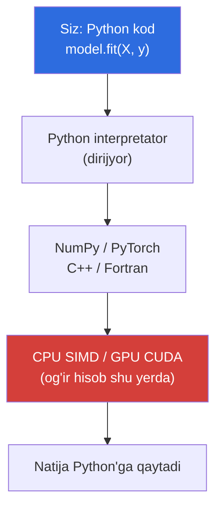
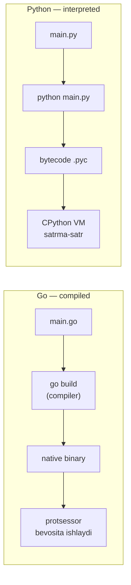
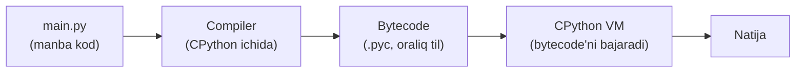
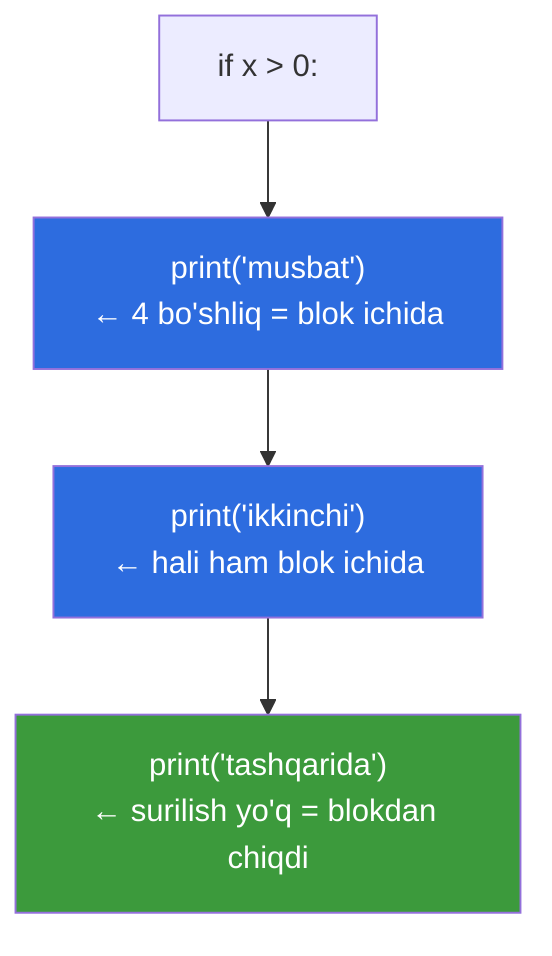

# 01. Kirish — Python nima va nega

> Bu dars — Go backend dasturchi uchun Python'ga "birinchi qadam". Maqsad: sintaksisni yodlash emas, balki Python qanday "fikrlashini" tushunish.

## Nega bu dars kerak? (Hook)

Siz Go'da yaxshi backend yozasiz. Lekin ML Engineer bo'lish yo'lida bir haqiqatga duch kelasiz: **deyarli barcha ML dunyosi Python'da yozilgan**. PyTorch, TensorFlow, scikit-learn, pandas, NumPy — hammasi.

Agar siz "Python — bu shunchaki boshqacha sintaksisdagi Go" deb o'ylab kirsangiz, birinchi kunlaridayoq chalkashasiz. Chunki Python boshqacha **falsafada** qurilgan: dynamic typing, indentation bilan blok, interpreted ishlash.

Bu darsda biz til sintaksisini emas, balki uning **dunyoqarashini** o'rganamiz. Shunda keyingi darslar "nega bunday?" degan savolsiz o'tadi.

---

## Analogiya: Go — samosval, Python — velosiped

Tasavvur qiling. **Go** — bu og'ir yuk tashiydigan samosval: uni oldindan yig'ib, sozlab, tayyorlab qo'yasiz (compile), keyin u tinmay, ishonchli, tez yuradi. Sozlash vaqt oladi, lekin ishga tushgach — quvvatli.

**Python** — bu velosiped: minib, darhol yurib ketasiz (interpreted). Fikringizni tez sinab ko'rasiz, yo'nalishni bir zumda o'zgartirasiz. Tez tajriba uchun ideal.

> Chegarasi: bu analogiya tezlik haqida to'g'ri, lekin adashtirmasin — Python "o'yinchoq" emas. ML'da og'ir hisob-kitob aslida C/CUDA'da bajariladi; Python faqat "rul"da o'tiradi. Buni pastda ko'ramiz.

---

## Python nima? (Sodda ta'rif)

**Python** — 1991-yilda Guido van Rossum yaratgan, o'qilishi oson bo'lishga urg'u beruvchi **interpreted** (satrma-satr ishlaydigan) va **dynamically typed** (o'zgaruvchi turi ish vaqtida aniqlanadigan) umumiy maqsadli dasturlash tili.

Nomi ilonga emas, "Monty Python" komediya guruhiga ishora. Shuning uchun rasmiy misollarda tez-tez hazil uchraydi.

Python'ning bosh qoidasi — **o'qishga qulaylik**. Kod bir marta yoziladi, lekin ko'p marta o'qiladi. Python shu "o'qish" tomonini birinchi o'ringa qo'yadi.

---

## Python falsafasi — Zen of Python

Python'ning ruhini eng yaxshi ifodalovchi matn — **Zen of Python** (PEP 20). Uni ko'rish uchun REPL'da shunday yozing:

```python
import this
```

```text
# Output (qisqartirilgan):
Beautiful is better than ugly.
Explicit is better than implicit.
Simple is better than complex.
Flat is better than nested.
Readability counts.
There should be one-- and preferably only one --obvious way to do it.
Errors should never pass silently.
```

Go dasturchi uchun ikkitasi ayniqsa tanish:

- **"Explicit is better than implicit"** — Go'da ham yashirin "sehr" yoqtirilmaydi.
- **"There should be one obvious way to do it"** — Go'da `gofmt` bitta uslubni majbur qiladi; Python'da bu falsafa darajasida.

---

## Nega ML/Data Science aynan Python'ni tanladi?

Bu tasodif emas. To'rtta sabab bor:

**1. Ekotizim.** NumPy, pandas, scikit-learn, PyTorch — 20 yillik tayyor kutubxonalar. Boshqa tilda buni noldan yozish yillar oladi.

**2. "Glue til" tabiati.** Python'da `model.train()` deb yozganingizda, aslida C++ va CUDA kodi ishlaydi. Python — dirijyor, og'ir hisobni orkestr (C/GPU) bajaradi.

**3. Interaktivlik.** REPL va Jupyter notebook'lar tajribani zudlik bilan sinashga imkon beradi — ML'da "sinab ko'r, natijaga qara" sikli asosiy.

**4. O'qilish qulayligi.** Ilmiy maqola formulasini Python kodi deyarli "so'zma-so'z" takrorlaydi.



Ya'ni Python sekin bo'lsa ham, ML'da bu muhim emas — chunki "issiq" hisob Python'dan tashqarida bajariladi.

---

## Interpreted vs Compiled — Go bilan solishtirish

Bu eng muhim tushunchalardan biri. Keling, ikkalasini yonma-yon qo'yamiz.

**Go (compiled):** siz kodni `go build` qilasiz. Compiler butun kodni oldindan mashina kodiga (native binary) aylantiradi. Natijada bitta fayl — uni ishga tushirsangiz, protsessor to'g'ridan-to'g'ri o'qiydi. Xatolar (masalan, tur mos kelmasligi) **compile paytida** aniqlanadi.

**Python (interpreted):** siz kodni to'g'ridan-to'g'ri `python file.py` bilan ishga tushirasiz. Alohida "build" qadami yo'q. Interpretator kodni **ishlagan sari** o'qib bajaradi. Ko'p xatolar faqat **o'sha satrga yetganda** yuzaga chiqadi.



| Xususiyat | Go | Python |
| --- | --- | --- |
| Ishga tushirish | `go build` keyin ishga tushirish | `python file.py` to'g'ridan-to'g'ri |
| Tur tekshiruvi | compile paytida | ish vaqtida (runtime) |
| Tezlik | juda tez (native) | sekinroq (VM) |
| Xato qachon chiqadi | compile paytida | o'sha satrga yetganda |
| Natija | bitta binary fayl | manba kod + interpretator kerak |

> Diqqat: "interpreted" degani Python kod umuman kompilyatsiya qilinmaydi degani emas. Aslida u avval **bytecode**'ga aylanadi, keyin virtual mashina uni bajaradi. Buni endi ko'ramiz.

---

## CPython nima? (Notional machine)

"Python" so'zi ikki narsani anglatadi: **til** (grammatika, qoidalar) va **interpretator** (o'sha tilni ishga tushiruvchi dastur). Eng keng tarqalgan interpretator — **CPython**, C tilida yozilgan rasmiy amalga oshiruv.

Kod ishlaganda ichkarida aslida nima bo'ladi?



- **1-qadam:** siz yozgan `.py` matn **bytecode**'ga (protsessor emas, virtual mashina tushunadigan oraliq buyruqlar) o'giriladi.
- **2-qadam:** bu bytecode ba'zan `__pycache__` papkasida `.pyc` sifatida saqlanadi (tezlashtirish uchun).
- **3-qadam:** **CPython Virtual Machine** bytecode'ni satrma-satr bajaradi.

Go'da bu ikki qadam bitta `go build`da yakunlanadi va native kod chiqadi. Python'da esa "VM ustida ishlash" doim davom etadi — shuning uchun sekinroq, lekin platformadan mustaqilroq.

Boshqa amalga oshiruvlar ham bor: **PyPy** (JIT bilan tezroq), **Jython** (JVM ustida). Lekin ML'da deyarli har doim **CPython** ishlatiladi.

---

## REPL — Python'ning "tirik konsoli"

**REPL** (Read-Eval-Print-Loop, ya'ni "o'qi-hisobla-chop et-takrorla") — buyruqni yozib, natijani darhol ko'rsatuvchi interaktiv muhit. Terminalda shunchaki `python` deb yozing.

```python
>>> 2 + 3
5
>>> name = "Ali"
>>> len(name)
3
>>> name.upper()
'ALI'
```

Go'da bunday narsa standart emas (tez-tez `main` yozib, `go run` qilasiz). Python'da REPL — tajribaning yuragi: bir g'oyani sinash uchun 2 soniya.

> Amaliy maslahat: `>>>` — bu REPL taklif belgisi (prompt), uni terib yozmaysiz. Fayl kodida `>>>` bo'lmaydi.

REPL'dan chiqish: `exit()` yoki `Ctrl-D`.

---

## Birinchi script — worked example

Endi haqiqiy fayl yozamiz. `hello.py` nomli fayl yarating:

```python
# --- 1-qadam: foydalanuvchi ismini so'raymiz ---
name = input("Isming nima? ")

# --- 2-qadam: kirim uzunligini hisoblaymiz ---
length = len(name)

# --- 3-qadam: natijani ekranga chiqaramiz (f-string bilan) ---
print(f"Salom, {name}! Isming {length} ta harfdan iborat.")
```

Ishga tushirish:

```text
$ python hello.py
Isming nima? Ali
# Output:
Salom, Ali! Isming 3 ta harfdan iborat.
```

Go bilan solishtiring — bu Go'da ancha ko'p qatorli bo'lardi:

```go
package main

import (
    "bufio"
    "fmt"
    "os"
    "strings"
)

func main() {
    reader := bufio.NewReader(os.Stdin)
    fmt.Print("Isming nima? ")
    name, _ := reader.ReadString('\n')
    name = strings.TrimSpace(name)
    fmt.Printf("Salom, %s! Isming %d ta harfdan iborat.\n", name, len(name))
}
```

Farqni sezyapsizmi? Python'da `package`, `import` bloki, `func main`, aniq tur e'lonlari yo'q. **Kamroq marosim, ko'proq mazmun** — bu Python uslubi.

---

## Indentation — Go'dagi `{}` o'rnida

Bu Go dasturchi uchun **eng katta vizual zarba**. Python'da blok chegarasini `{}` emas, **bo'sh joy (indentation)** belgilaydi.

Go'da:

```go
if x > 0 {
    fmt.Println("musbat")
    fmt.Println("ikkinchi qator")
}
```

Python'da xuddi shu narsa:

```python
if x > 0:
    print("musbat")
    print("ikkinchi qator")
```

- `{` o'rnida **ikki nuqta** `:` keladi.
- `}` umuman yo'q — blok **indentation kamayganda** tugaydi.
- Ichki qatorlar bir xil miqdorda (odatda **4 bo'shliq**) surilishi **shart**.



Bu "kosmetika" emas — bu tilning **grammatikasi**. Noto'g'ri indentation = xato:

```python
if x > 0:
print("xato!")   # IndentationError: expected an indented block
```

> Oltin qoida: **bir faylda bo'shliq (space) va tab'ni aralashtirmang.** Standart — 4 ta bo'shliq. Muharringizni "tab = 4 space" qilib sozlang.

---

## PEP 8 — Python'ning uslub qonuni

Go'da `gofmt` bor — u kodni bir xil ko'rinishga keltiradi va bahs tugaydi. Python'da bunga o'xshash narsa **PEP 8** — rasmiy uslub qo'llanmasi.

Asosiy qoidalar:

- Indentation — **4 bo'shliq**.
- O'zgaruvchi va funksiya nomlari — `snake_case` (masalan `user_name`), Go'dagi `camelCase`/`PascalCase` emas.
- Konstantalar — `UPPER_CASE`.
- Qator uzunligi — odatda 79 (yoki jamoada 88–100) belgigacha.

Amalda ko'p jamoalar **`black`** (avtoformatlovchi) va **`ruff`**/`flake8` (tekshiruvchi) vositalaridan foydalanadi — bu `gofmt`ning eng yaqin o'xshashi.

---

## 🤔 O'ylab ko'r

Quyidagi Python kod nima chiqaradi yoki xato beradimi?

```python
x = 10
if x > 5:
print("katta")
```

<details>
<summary>💡 Javobni ko'rish</summary>

**Xato beradi:** `IndentationError: expected an indented block after 'if' statement`.

`if x > 5:` dan keyingi satr blokka kirishi uchun **surilgan (indented)** bo'lishi shart. `print("katta")` esa surilmagan. Go'da bo'lsa `{}` blokni belgilardi va bo'sh joy ahamiyatsiz bo'lardi — Python'da esa bo'sh joyning o'zi grammatika.

To'g'risi:

```python
x = 10
if x > 5:
    print("katta")   # Output: katta
```

</details>

---

## ⚠️ Ko'p uchraydigan xatolar

**1-xato: "Python — bu qavssiz Go".**
- Noto'g'ri tasavvur: sintaksis o'zgargan, qolgani bir xil.
- Nega noto'g'ri: Go — statik tipli, compiled; Python — dinamik tipli, interpreted. Bu ish vaqtidagi xulqni tubdan o'zgartiradi (xatolar runtime'da chiqadi).
- To'g'risi: Python'ni alohida falsafa deb qabul qiling, "Go minus qavslar" deb emas.

**2-xato: `{}` bilan blok yozishga urinish.**
- Noto'g'ri: `if x > 0 { print(x) }`.
- Nega noto'g'ri: Python `{}`ni blok uchun ishlatmaydi (`{}` — bu dict/set, keyingi darslarda).
- To'g'risi: `:` va indentation ishlating.

**3-xato: bo'shliq va tab aralashtirish.**
- Noto'g'ri: bir qator tab, boshqasi bo'shliq bilan surilgan.
- Nega noto'g'ri: ko'zga bir xil ko'rinsa ham, interpretator ularni turlicha o'qiydi — `TabError`.
- To'g'risi: faqat bo'shliq (4 ta), muharrirni shunga sozlang.

**4-xato: nuqta-vergul (`;`) qidirish.**
- Noto'g'ri: har qator oxiriga `;` qo'yish.
- Nega noto'g'ri: kerak emas; qator oxiri o'zi ifoda tugaganini bildiradi. `;` faqat bir qatorga ikki buyruq sig'dirishda ishlaydi, ammo bu PEP 8'ga zid.
- To'g'risi: har buyruq — alohida qatorda, `;`siz.

---

## Go dasturchi ko'zi bilan: tanish / yot jadvali

| Tushuncha | Go'da | Python'da | His |
| --- | --- | --- | --- |
| Blok chegarasi | `{ }` | indentation (`:` + 4 space) | 🟥 yot |
| Tur e'loni | `var x int` | `x = 5` (avtomatik) | 🟥 yot |
| Tur tekshiruvi | compile paytida | runtime | 🟥 yot |
| Ishga tushirish | `go build` + run | `python file.py` | 🟨 yarim |
| Nomlash | `camelCase` | `snake_case` | 🟨 yarim |
| Uslub vositasi | `gofmt` | `black` / `ruff` | 🟩 tanish |
| "Explicit is better" falsafa | ha | ha | 🟩 tanish |
| Interaktiv REPL | yo'q (odatda) | bor va markaziy | 🟥 yot |
| Xato ishlash | `err` qaytarish | `exception` (keyin) | 🟥 yot |

---

## Xulosa

- **Python** — interpreted, dinamik tipli, o'qishga urg'u beruvchi umumiy maqsadli til.
- ML dunyosi Python'ni **ekotizim**, **glue til tabiati**, **interaktivlik** va **o'qilish** uchun tanlagan.
- **CPython** — eng keng tarqalgan interpretator; kod avval **bytecode**'ga, keyin **VM**da bajariladi.
- **Interpreted** (Python) — xatolar runtime'da; **compiled** (Go) — xatolar compile paytida.
- **Indentation** blok chegarasini belgilaydi — Go'dagi `{}` o'rnida. Bu grammatikaning bir qismi.
- **REPL** — Python'da tajribaning yuragi; Go'da bunday markaziy vosita yo'q.
- **PEP 8** — Python uslub qonuni; `snake_case`, 4 bo'shliq, `black`/`ruff` vositalar.

## 🧠 Eslab qol

- Python interpreted va dinamik tipli — xatolar ko'pincha ishlagan **paytda** chiqadi.
- Blokni **indentation** belgilaydi, `{}` emas; `:` dan keyin 4 bo'shliq.
- ML'da og'ir hisob C/GPU'da ishlaydi, Python — dirijyor, shuning uchun sekinligi muhim emas.
- CPython kodni bytecode'ga o'girib, VM'da bajaradi.
- Nomlash uslubi — `snake_case`.

## ✅ O'z-o'zini tekshir (retrieval practice)

**1.** Go'da xato compile paytida, Python'da esa ko'pincha runtime'da chiqadi — nega shunday? Sababi til tuzilishining qaysi xususiyatida?

<details>
<summary>Javob</summary>

Go — **compiled va statik tipli**: butun kod ishga tushishdan oldin compiler tomonidan tekshiriladi, shu jumladan tur mosligi. Python — **interpreted va dinamik tipli**: kod satrma-satr bajariladi va tur faqat o'sha qiymat ishlatilganda tekshiriladi, shuning uchun ko'p xatolar dastur o'sha satrga yetgandagina yuzaga chiqadi.

</details>

**2.** ML'da Python sekin bo'lsa ham nega bu jiddiy muammo emas?

<details>
<summary>Javob</summary>

Chunki Python — "glue til": og'ir sonli hisob (matritsa ko'paytmasi, gradient) aslida NumPy/PyTorch ostidagi **C/C++/CUDA** kodida bajariladi. Python faqat bu operatsiyalarni chaqiradi va boshqaradi. Shuning uchun "issiq" kodning tezligi Python'ga bog'liq emas.

</details>

**3.** `import this` nima chiqaradi va u nima uchun muhim?

<details>
<summary>Javob</summary>

**Zen of Python** (PEP 20) — Python falsafasini ifodalovchi qisqa aforizmlar. U "Beautiful is better than ugly", "Explicit is better than implicit", "There should be one obvious way to do it" kabi qoidalar orqali tilning o'qilish va soddalikka urg'usini ko'rsatadi.

</details>

**4.** Quyidagi ikki qator orasidagi farq nima, qaysi biri xato?

```python
if x > 0:
print(x)
```

va

```python
if x > 0:
    print(x)
```

<details>
<summary>Javob</summary>

Birinchisi **xato** (`IndentationError`) — `print(x)` `if` blokiga kirishi uchun surilishi kerak, lekin surilmagan. Ikkinchisi **to'g'ri** — `print(x)` 4 bo'shliq bilan surilgan, demak `if` blokining ichida. Python'da indentation blokni aniqlaydi.

</details>

**5.** CPython kod ishga tushganda qanday bosqichlardan o'tadi?

<details>
<summary>Javob</summary>

1) Manba `.py` **bytecode**'ga kompilyatsiya qilinadi (ba'zan `.pyc` sifatida `__pycache__`da saqlanadi). 2) **CPython Virtual Machine** bu bytecode'ni satrma-satr bajaradi. Go'dan farqi — natija native binary emas, doim VM ustida ishlaydi.

</details>

## 🛠 Amaliyot

**1. Oson (Modify).** Yuqoridagi `hello.py`ni o'zgartiring: ism o'rniga foydalanuvchidan **yosh** so'rang va "Kelasi yil {yosh+1} yoshga to'lasan" deb chiqaring.

<details>
<summary>Hint</summary>

`input()` doim **string** qaytaradi. Songa aylantirish uchun `int(...)` kerak: `age = int(input("Yoshing? "))`. Keyin f-string ichida `{age + 1}`.

</details>

**2. O'rta (faded example).** Skeletonni to'ldiring — foydalanuvchidan ikkita son olib, yig'indisini chiqarsin:

```python
a = int(input("Birinchi son: "))
b = # TODO: ikkinchi sonni int qilib o'qing
total = # TODO: yig'indini hisoblang
print(f"Yig'indi: {total}")
```

<details>
<summary>Hint</summary>

`b = int(input("Ikkinchi son: "))`, `total = a + b`.

</details>

**3. Qiyin (Make).** Noldan yozing: REPL'da `import this` chiqaring, keyin alohida faylda o'z ismingiz va sevimli tilingizni chop etuvchi `about.py` yozing. So'ng uni `python about.py` bilan ishga tushiring va indentation'ni ataylab buzib, `IndentationError`ni o'z ko'zingiz bilan ko'ring.

<details>
<summary>Hint</summary>

Bitta `if True:` bloki yozing, ichidagi `print`ni surmasdan qoldiring — interpretator qanday xato berishini o'qing. Xato matnini tushunish — debugging ko'nikmasining boshlanishi.

</details>

## 🔁 Takrorlash

- **Bog'liq keyingi mavzular:** "02. O'zgaruvchilar va sonlar" (dinamik tipni chuqurroq ko'ramiz), "04. Boolean va operatorlar" (truthiness).
- **Takrorlash jadvali:** ertaga → 3 kundan keyin → 1 haftadan keyin yuqoridagi "O'z-o'zini tekshir" savollariga qaytib javob bering (kitobga qaramasdan).
- **Feynman testi:** do'stingizga kod so'zisiz, 3 jumlada tushuntiring — "Python nima, u Go'dan nimasi bilan tubdan farq qiladi va nega ML aynan uni tanlagan?" Agar qiynalsangiz — "Interpreted vs Compiled" va "glue til" bo'limlariga qayting.
