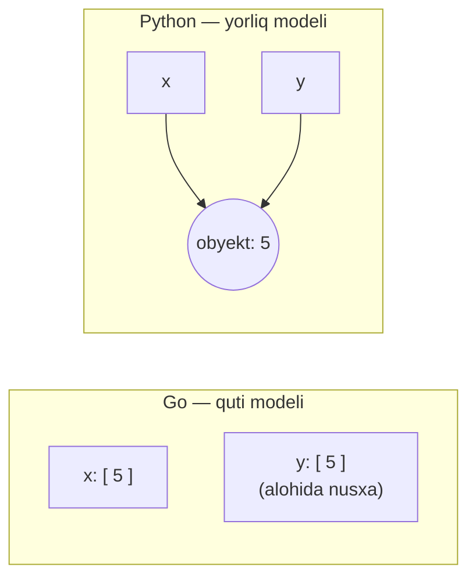
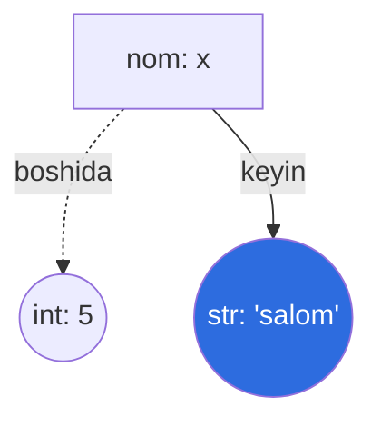
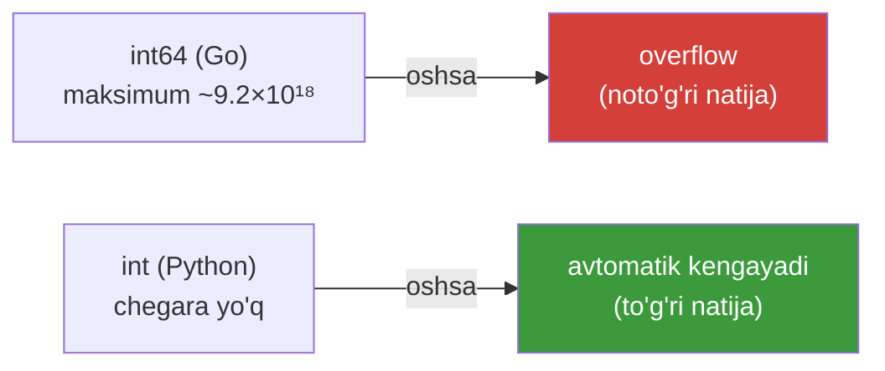
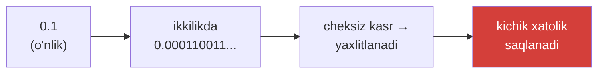

# 02. O'zgaruvchilar va sonlar

> Bu darsda eng muhim aqliy model — "o'zgaruvchi = nom, obyekt = qiymat" — ni o'rnatamiz. Bu Go'dagi "katak" modelidan farq qiladi va keyingi hamma narsaga ta'sir qiladi.

## Nega bu dars kerak? (Hook)

Go'da `var x int = 5` yozganingizda aniq bilasiz: `x` — bu int uchun ajratilgan katak, ichida 5 bor. Python'da esa `x = 5` boshqa narsa bo'ladi.

Agar siz Python o'zgaruvchisini ham "katak" deb tasavvur qilsangiz, keyingi darslarda list'lar bilan ishlaganda **kutilmagan xato**larga duch kelasiz: bir o'zgaruvchini o'zgartirsangiz, boshqasi ham o'zgargandek tuyuladi.

Bu darsda o'zgaruvchining **aslida** nima ekanini va Python sonlarining Go'dan ajablanarli farqlarini (masalan cheksiz katta int) o'rganamiz.

---

## Analogiya: yorliq (label) va quti (box)

**Go modeli — quti (box):** `var x int = 5` — bu "x" deb nomlangan qutini yasaydi va ichiga 5 raqamini soladi. `y = x` desangiz, **yangi quti** yasab, 5 ni **nusxalab** soladi. Ikki alohida quti.

**Python modeli — yorliq (label):** `x = 5` — avval xotirada `5` degan **obyekt** paydo bo'ladi, keyin unga "x" degan **yorliq** ilinadi. `y = x` desangiz, **o'sha obyektga** yana bir "y" yorlig'i ilinadi. Bitta obyekt, ikki yorliq.

> Chegarasi: int'lar **immutable** (o'zgarmas) bo'lgani uchun bu farq hozircha sezilmaydi — ikkalasi ham 5 ko'rsatadi. Lekin list kabi **mutable** obyektlarda bu farq katta ahamiyatga ega bo'ladi (keyingi darslarda).

---

## O'zgaruvchi — sodda ta'rif

**O'zgaruvchi (variable)** — bu xotiradagi biror **obyektga** ilingan **nom (yorliq)**. Nomning o'zi qiymatni saqlamaydi; u faqat qiymatga "ishora qiladi" (reference).

```python
x = 5      # xotirada 5 obyekti; unga "x" yorlig'i
y = x      # o'sha 5 obyektiga "y" yorlig'i ham ilinadi
```



`id()` funksiyasi obyektning xotiradagi "shaxsiy raqamini" ko'rsatadi — shu bilan ikki nom bitta obyektga ishora qilayotganini isbotlaymiz:

```python
x = 5
y = x
print(id(x) == id(y))   # Output: True  (bir xil obyekt)
```

---

## Dynamic typing — tur o'zgaruvchida emas, obyektda

Go'da tur **o'zgaruvchiga** biriktiriladi: `var x int` — x umrbod int. Boshqa tur bera olmaysiz.

Python'da tur **obyektga** biriktiriladi, nomga emas. Shuning uchun bir nom bugun int'ga, keyin string'ga ishora qilishi mumkin:

```python
x = 5          # x hozir int obyektiga ishora qiladi
print(type(x)) # Output: <class 'int'>

x = "salom"    # endi x string obyektiga ishora qiladi
print(type(x)) # Output: <class 'str'>
```

Go'da bu kod **compile bo'lmaydi**. Python'da esa mutlaqo normal — bu **dynamic typing** (tur ish vaqtida, qiymatga qarab aniqlanadi).



> Diqqat: bu qulaylik, lekin xavf ham. Katta ML kodlarida bir nomni tasodifan boshqa turga o'zgartirib, keyin xatoni faqat runtime'da topish oson. Shuning uchun jamoalar **type hint** (`x: int = 5`) ishlatadi — buni keyingi kurslarda ko'ramiz.

---

## `type()` — obyekt turini bilish

`type(obj)` obyektning turini qaytaradi. ML'da ma'lumot turini tekshirishda tez-tez ishlatiladi:

```python
print(type(5))        # Output: <class 'int'>
print(type(5.0))      # Output: <class 'float'>
print(type("hi"))     # Output: <class 'str'>
print(type(True))     # Output: <class 'bool'>
```

---

## `int` — Python'da cheksiz kattalik!

Bu Go dasturchini **hayratga soladigan** xususiyat. Go'da `int64` ning chegarasi bor: `9223372036854775807`. Undan oshsa — **overflow** (aylanib ketish).

Python'da `int` ning **chegarasi yo'q** — u avtomatik ravishda xotira yetguncha kattalashadi (bignum):

```python
# --- Go'da int64 overflow bo'lardigan hisob ---
print(2 ** 100)
# Output: 1267650600228229401496703205376

# --- yanada kattaroq: googol (10^100) ---
print(10 ** 100)
# Output: 1 dan keyin 100 ta nol
```



Katta sonlarni o'qishga qulay yozish uchun **pastki chiziq** ishlatish mumkin (u faqat ko'z uchun, qiymatga ta'sir qilmaydi):

```python
million = 1_000_000
print(million)   # Output: 1000000
```

---

## `float` — kasr sonlar

**float** — o'nlik nuqtali son (masalan `3.14`). Ichida **IEEE 754** double formatda (64-bit) saqlanadi — Go'dagi `float64` bilan bir xil.

```python
pi = 3.14
big = 2.5e3      # ilmiy yozuv: 2.5 × 10³
print(big)       # Output: 2500.0
```

Int va float aralashsa, natija **doim float** bo'ladi:

```python
print(5 + 2.0)   # Output: 7.0  (int + float = float)
print(type(5 + 2.0))  # Output: <class 'float'>
```

---

## Arifmetik operatorlar — Go'dan farqlari bor

Ko'p operator tanish, lekin uchtasida **muhim farq** bor: `/`, `//`, `**`.

| Operator | Ma'nosi | Misol | Natija |
| --- | --- | --- | --- |
| `+` `-` `*` | qo'shish, ayirish, ko'paytirish | `3 * 4` | `12` |
| `/` | **haqiqiy bo'lish (doim float!)** | `6 / 2` | `3.0` |
| `//` | **butun (floor) bo'lish** | `7 // 2` | `3` |
| `%` | qoldiq | `7 % 3` | `1` |
| `**` | **daraja** | `2 ** 10` | `1024` |

### 1. `/` — doim float qaytaradi

Bu Go'dan katta farq. Go'da `6 / 2` (ikki int) → `3` (int). Python'da:

```python
print(6 / 2)     # Output: 3.0   ← float, int emas!
print(7 / 2)     # Output: 3.5
print(type(6 / 2))  # Output: <class 'float'>
```

> Butun natija kerak bo'lsa `//` ishlating, `/` emas.

### 2. `//` — floor bo'lish (manfiy sonlarda tuzoq!)

`//` pastga (manfiy cheksizlik tomon) yaxlitlaydi. Musbat sonlarda Go bilan bir xil, **manfiy sonlarda esa boshqacha**:

```python
print(7 // 2)     # Output: 3
print(-7 // 2)    # Output: -4   ← Go'da bu -3 bo'lardi!
```

Go butun bo'lishda nolga tomon kesadi (`-7 / 2 = -3`), Python esa pastga yaxlitlaydi (`-3.5 → -4`).

### 3. `%` — qoldiq belgisi bo'luvchiga ergashadi

Yana bir tuzoq. Python'da qoldiq belgisi **bo'luvchi** (o'ngdagi son) belgisiga mos keladi:

```python
print(-7 % 3)     # Output: 2    ← Go'da bu -1 bo'lardi!
print(7 % -3)     # Output: -2
```

Sababi: Python `a % b`ni shunday hisoblaydiki, `(a // b) * b + (a % b) == a` doim to'g'ri bo'lsin.

### 4. `**` — daraja (Go'da bu operator yo'q!)

Go'da darajani `math.Pow` funksiyasi bilan olasiz. Python'da bu tildagi operator:

```python
print(2 ** 10)    # Output: 1024
print(2 ** 0.5)   # Output: 1.4142135623730951  (kvadrat ildiz)
```

`divmod(a, b)` esa butun bo'linma va qoldiqni birga qaytaradi:

```python
print(divmod(17, 5))   # Output: (3, 2)   → 17 // 5 = 3, 17 % 5 = 2
```

---

## Worked example — daqiqalarni soat:daqiqaga aylantirish

```python
# --- 1-qadam: umumiy daqiqalar ---
total_minutes = 137

# --- 2-qadam: butun bo'lish bilan soatlarni ajratamiz ---
hours = total_minutes // 60      # 137 // 60 = 2

# --- 3-qadam: qoldiq bilan daqiqalarni ajratamiz ---
minutes = total_minutes % 60     # 137 % 60 = 17

# --- 4-qadam: f-string bilan chiroyli chiqaramiz ---
print(f"{total_minutes} daqiqa = {hours} soat {minutes} daqiqa")
# Output: 137 daqiqa = 2 soat 17 daqiqa
```

`//` va `%` juftligi vaqt, o'lchov, sahifalash (pagination) kabi masalalarda doim birga keladi.

---

## Float aniqlik muammosi — 0.1 + 0.2

Bu **har bir dasturchi** bir marta hayratlanadigan holat. Va bu Python xatosi emas — Go'da ham, C'da ham bir xil:

```python
print(0.1 + 0.2)          # Output: 0.30000000000000004
print(0.1 + 0.2 == 0.3)   # Output: False   ← !!!
```

**Nega?** float sonlar ikkilik (binary) sanoq sistemasida saqlanadi. `0.1` ni ikkilikda **aniq** ifodalab bo'lmaydi (xuddi `1/3` ni o'nlikda `0.333...` deb aniq yozib bo'lmagani kabi). Shuning uchun kichik xatolik yig'iladi.



**Yechim:** float'larni `==` bilan aniq solishtirmang. Buning o'rniga:

```python
import math
print(math.isclose(0.1 + 0.2, 0.3))   # Output: True
```

Pul yoki aniqlik muhim joyda `decimal.Decimal` ishlating. ML'da bu ayniqsa muhim — model natijalarini solishtirganda `==` emas, **tolerance** (`isclose`, `np.allclose`) ishlatiladi.

---

## Qo'shimcha imkoniyatlar — Python idiomlari

Go'da bo'lmagan yoki noqulay bo'lgan bir nechta qulaylik:

```python
# --- ko'p qiymatli tayinlash (multiple assignment) ---
a, b, c = 1, 2, 3

# --- almashtirish (swap) — vaqtinchalik o'zgaruvchisiz! ---
a, b = b, a
print(a, b)      # Output: 2 1

# --- augmented assignment ---
x = 10
x += 5           # x = x + 5
print(x)         # Output: 15

# --- zanjirli tayinlash ---
p = q = 0
print(p, q)      # Output: 0 0
```

Go'da swap uchun vaqtinchalik o'zgaruvchi (`tmp := a; a = b; b = tmp`) kerak bo'ladi — Python'da bir qatorda.

---

## 🤔 O'ylab ko'r

Quyidagi kod nima chiqaradi?

```python
print(-7 // 2)
print(-7 % 2)
```

<details>
<summary>💡 Javobni ko'rish</summary>

```text
-4
1
```

`-7 // 2`: `-3.5` ni pastga yaxlitlaydi → `-4` (Go'da esa nolga tomon kesib `-3` bo'lardi).

`-7 % 2`: qoldiq belgisi bo'luvchi (`2`, musbat) belgisiga ergashadi → `1`. Tekshirish: `(-7 // 2) * 2 + (-7 % 2) = -4*2 + 1 = -8 + 1 = -7` ✓. Go'da esa bu `-1` bo'lardi.

</details>

---

## ⚠️ Ko'p uchraydigan xatolar

**1-xato: `/` butun son qaytaradi deb o'ylash.**
- Noto'g'ri tasavvur: `6 / 2` → `3` (int), Go'dagidek.
- Nega noto'g'ri: Python'da `/` **haqiqiy bo'lish**, doim float — `6 / 2` → `3.0`.
- To'g'risi: butun natija kerak bo'lsa `//` ishlating: `6 // 2` → `3`.

**2-xato: manfiy sonlarda `//` va `%` ni Go'dagidek kutish.**
- Noto'g'ri: `-7 // 2` → `-3`, `-7 % 2` → `-1`.
- Nega noto'g'ri: Python floor bo'ladi va qoldiq belgisi bo'luvchiga ergashadi.
- To'g'risi: `-7 // 2` → `-4`, `-7 % 2` → `1`. Manfiy sonlar bilan ishlashda buni yodda tuting.

**3-xato: float'larni `==` bilan solishtirish.**
- Noto'g'ri: `if 0.1 + 0.2 == 0.3:` — bu hech qachon `True` bo'lmaydi.
- Nega noto'g'ri: float ikkilik yaxlitlash xatosiga ega.
- To'g'risi: `math.isclose(a, b)` yoki tolerance ishlating.

**4-xato: int overflow'dan qo'rqish.**
- Noto'g'ri: "katta sonda overflow bo'ladi" deb `int64` chegarasini kutish.
- Nega noto'g'ri: Python `int` cheksiz — overflow yo'q.
- To'g'risi: bemalol `2 ** 1000` hisoblang, to'g'ri natija chiqadi. (Ammo NumPy massivlarida turlar chegaralangan — buni keyin ko'ramiz.)

**5-xato: `input()` natijasini son deb o'ylash.**
- Noto'g'ri: `age = input("Yosh: "); print(age + 1)` — `TypeError`.
- Nega noto'g'ri: `input()` doim **string** qaytaradi.
- To'g'risi: `age = int(input("Yosh: "))`.

---

## Go dasturchi ko'zi bilan: farqlar jadvali

| Tushuncha | Go | Python |
| --- | --- | --- |
| O'zgaruvchi modeli | quti (qiymatni saqlaydi) | yorliq (obyektga ishora) |
| Tur qayerda | o'zgaruvchida (statik) | obyektda (dinamik) |
| Turni o'zgartirish | mumkin emas | mumkin (`x = 5` keyin `x = "a"`) |
| int chegarasi | `int64` bor | cheksiz |
| `6 / 2` | `3` (int) | `3.0` (float) |
| `-7 % 2` | `-1` | `1` |
| Daraja | `math.Pow(2, 10)` | `2 ** 10` |
| Swap | `tmp` kerak | `a, b = b, a` |

---

## Xulosa

- Python o'zgaruvchisi — **obyektga ilingan yorliq**, Go'dagi "qiymat qutisi" emas.
- **Dynamic typing:** tur obyektga biriktiriladi; bir nom turli turdagi obyektlarga ishora qila oladi.
- `type()` obyekt turini, `id()` esa uning shaxsini ko'rsatadi.
- Python `int` — **cheksiz katta** bo'la oladi (overflow yo'q).
- `/` — **doim float**; `//` — floor bo'lish; `**` — daraja; `%` — qoldiq (belgisi bo'luvchiga ergashadi).
- Manfiy sonlarda `//` va `%` Go'dan **boshqacha** ishlaydi.
- Float aniq emas (`0.1 + 0.2 != 0.3`) — solishtirishda `math.isclose` ishlating.

## 🧠 Eslab qol

- O'zgaruvchi = nom, qiymat = obyekt; `=` obyektga yorliq ilaydi.
- `/` doim float, butun natija uchun `//`.
- Python `int` cheksiz — overflow yo'q.
- Float'ni `==` bilan solishtirmang, `math.isclose` ishlating.
- `input()` doim string qaytaradi — songa `int()` bilan aylantiring.

## ✅ O'z-o'zini tekshir (retrieval practice)

**1.** `x = 5; y = x` dan keyin xotirada nechta int obyekti bor va nega?

<details>
<summary>Javob</summary>

**Bitta** obyekt (`5`), unga **ikkita** yorliq (`x` va `y`) ilingan. Python o'zgaruvchisi qiymatni nusxalamaydi — u obyektga ishora qiladi. `id(x) == id(y)` → `True` buni tasdiqlaydi. (Go'da esa bu ikki alohida katak bo'lardi.)

</details>

**2.** `10 / 3` va `10 // 3` natijalari va turlari qanday farq qiladi?

<details>
<summary>Javob</summary>

`10 / 3` → `3.3333333333333335` (**float**). `10 // 3` → `3` (**int**, floor bo'lish). `/` doim float qaytaradi, `//` butun qism.

</details>

**3.** Nega `0.1 + 0.2 == 0.3` `False` beradi va to'g'ri solishtirish qanday?

<details>
<summary>Javob</summary>

float sonlar ikkilik formatda saqlanadi va `0.1`ni ikkilikda aniq ifodalab bo'lmaydi, shuning uchun kichik yaxlitlash xatosi yig'iladi (`0.30000000000000004`). To'g'ri usul: `math.isclose(0.1 + 0.2, 0.3)` → `True`.

</details>

**4.** `-7 % 3` Python'da nechchi bo'ladi va nega Go'dan farq qiladi?

<details>
<summary>Javob</summary>

Python'da **2**. Python qoldiq belgisini **bo'luvchi** (`3`, musbat) belgisiga moslaydi va `(a // b) * b + (a % b) == a` tenglamasini saqlaydi: `(-3)*3 + 2 = -7` ✓. Go esa nolga tomon kesadi, natija `-1` bo'ladi.

</details>

**5.** Python'da `2 ** 200` overflow beradimi? Go'da-chi?

<details>
<summary>Javob</summary>

Python'da **yo'q** — `int` cheksiz kattalashadi, aniq natija chiqadi. Go'da `int64`da bu chegaradan oshadi va overflow (noto'g'ri, aylangan natija) beradi; `math/big` kerak bo'ladi.

</details>

## 🛠 Amaliyot

**1. Oson (Modify).** Yuqoridagi "daqiqa → soat:daqiqa" misolini o'zgartiring: endi **soniyalar**ni oling (masalan 3725) va uni `soat:daqiqa:soniya` ko'rinishida chiqaring.

<details>
<summary>Hint</summary>

`hours = secs // 3600`, `minutes = (secs % 3600) // 60`, `seconds = secs % 60`.

</details>

**2. O'rta (faded example).** Skeletonni to'ldiring — ikki nuqta orasidagi masofani hisoblasin (Pifagor teoremasi):

```python
x1, y1 = 0, 0
x2, y2 = 3, 4
dx = x2 - x1
dy = y2 - y1
distance = # TODO: (dx² + dy²) ning kvadrat ildizi — ** operatoridan foydalaning
print(f"Masofa: {distance}")   # kutilgan: 5.0
```

<details>
<summary>Hint</summary>

Kvadrat ildiz = `** 0.5`. Demak `distance = (dx**2 + dy**2) ** 0.5`.

</details>

**3. Qiyin (Make).** Noldan yozing: foydalanuvchidan bank omonati (masalan 1000) va yillik foiz (masalan 5) ni oling, 10 yildan keyingi qiymatni **compound interest** formulasi bilan hisoblang: `qiymat = omonat * (1 + foiz/100) ** yillar`. Natijani 2 xona aniqlikda chiqaring.

<details>
<summary>Hint</summary>

`amount = float(input(...))`, `rate = float(input(...))`. Formula: `amount * (1 + rate/100) ** 10`. Chiqarishda `f"{result:.2f}"` — bu format spec'ni keyingi (string) darsida chuqurroq ko'ramiz.

</details>

## 🔁 Takrorlash

- **Bog'liq mavzular:** "01. Kirish" (dynamic typing g'oyasi), keyingi "03. String" (immutable obyektlar) va "04. Boolean" (`is` vs `==` — identity/id bilan bog'liq).
- **Takrorlash jadvali:** ertaga → 3 kundan keyin → 1 haftadan keyin "O'z-o'zini tekshir"ga kitobga qaramay qaytib javob bering. Ayniqsa `//`, `%` manfiy holatini takrorlang.
- **Feynman testi:** do'stingizga kodsiz tushuntiring — "Python'da `x = 5` yozganda xotirada nima bo'ladi va nega Go'dagi `var x int`dan farq qiladi?" 3 jumlada. Qiynalsangiz "yorliq va quti" analogiyasiga qayting.
