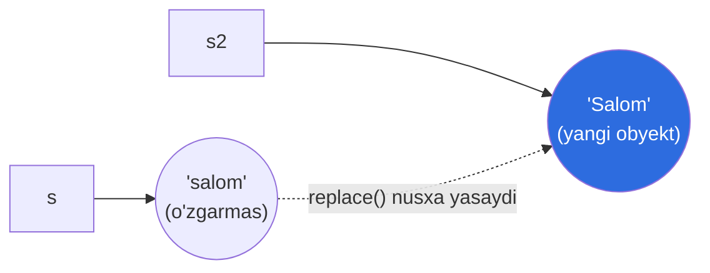
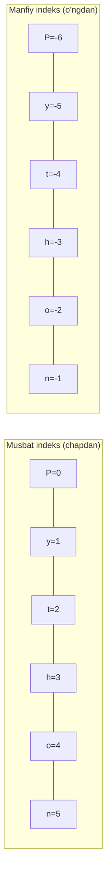
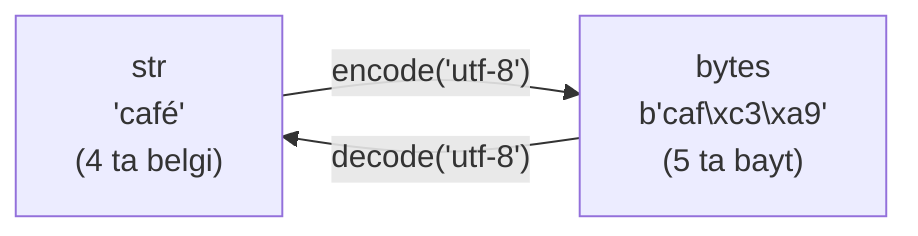

# 03. String

> String — ML'da matn ma'lumot (dataset nomlari, log, tokenlar) bilan ishlashda kunda o'nlab marta ishlatiladi. Bu darsda uni chuqur o'zlashtiramiz: immutability, slicing, metodlar, f-string va Unicode.

## Nega bu dars kerak? (Hook)

Tasavvur qiling: sizga `"2024-07-13"` degan sana matni keldi, sizga faqat yil kerak. Yoki `"  Ali  "` degan iflos kirim keldi, atrofidagi bo'shliqlarni tozalash kerak. Yoki modelning aniqligini `0.8567` deb emas, `85.67%` deb chiroyli chiqarmoqchisiz.

Bularning barchasi — string operatsiyalari. Agar ularni bilmasangiz, oddiy vazifa ham 10 qatorlik "velosiped"ga aylanadi.

Bu darsda Python string'ini Go string'i bilan solishtirib, uning kuchli tomonlarini (ayniqsa slicing va f-string) o'rganamiz.

---

## Analogiya: string — muhrlangan marvarid shodasi

Tasavvur qiling: string — bu **muhrlangan** marvarid shodasi. Har bir marvarid — bitta belgi (character). Siz shodadagi istalgan marvaridni **ko'ra olasiz**, sanay olasiz, bir qismini nusxalab **yangi shoda** yasay olasiz.

Lekin bitta narsa **mumkin emas**: shodadagi marvaridni almashtirish. U muhrlangan (**immutable**, o'zgarmas). O'zgartirish kerak bo'lsa — yangi shoda yasaysiz.

> Chegarasi: bu Go string bilan bir xil (Go string ham immutable). Farq boshqa joyda — Go shodasi **baytlardan**, Python shodasi esa **Unicode belgilaridan** tuzilgan. Buni pastda ko'ramiz.

---

## String — sodda ta'rif

**String** (`str`) — Unicode belgilarining **o'zgarmas (immutable)**, tartiblangan ketma-ketligi. Bir tirnoq `'...'`, ikki tirnoq `"..."` yoki uch tirnoq `"""..."""` bilan yoziladi.

```python
a = 'salom'
b = "salom"       # bir xil — farqi yo'q
print(a == b)     # Output: True
```

Bir yoki ikki tirnoq — did masalasi. Ikki tirnoq ichida apostrof yozish qulay: `"o'zbek"`.

---

## Immutability — string o'zgarmaydi

Go dasturchi buni yaxshi biladi: Go string ham immutable. Python'da ham xuddi shunday — **belgini o'zgartirib bo'lmaydi**:

```python
s = "salom"
s[0] = "S"        # TypeError: 'str' object does not support item assignment
```

O'zgartirish uchun **yangi string** yasaysiz (masalan metod chaqirib):

```python
s = "salom"
s2 = s.replace("s", "S")
print(s)    # Output: salom   ← eski o'zgarmadi
print(s2)   # Output: Salom   ← yangi string
```



> Muhim: string metodlari **hech qachon** asl string'ni o'zgartirmaydi — ular **yangi** string qaytaradi. Natijani o'zgaruvchiga saqlamasangiz, u yo'qoladi.

---

## Indexing — belgiga murojaat

Har bir belgining **indeksi** (o'rin raqami) bor. Sanoq **noldan** boshlanadi (Go'dagidek):

```python
s = "Python"
#    P  y  t  h  o  n
#    0  1  2  3  4  5
#   -6 -5 -4 -3 -2 -1

print(s[0])    # Output: P    (birinchi)
print(s[5])    # Output: n    (oxirgi)
print(s[-1])   # Output: n    (oxirgi — manfiy indeks!)
print(s[-2])   # Output: o    (oxiridan ikkinchi)
```

**Manfiy indeks** — Go'da yo'q va juda qulay xususiyat: `-1` oxirgi belgi, `-2` undan oldingisi. Go'da oxirgi belgi uchun `s[len(s)-1]` yozardingiz.



> Diqqat (Go farqi): Python'da `s[0]` — uzunligi 1 bo'lgan **string** qaytaradi. Go'da `s[0]` — **bayt** (uint8) qaytaradi. Python'da alohida "char/byte/rune" turi yo'q.

Chegaradan tashqari indeks xato beradi:

```python
print(s[10])   # IndexError: string index out of range
```

---

## Slicing — bir bo'lakni kesib olish

**Slicing** — `s[start:stop:step]` bilan string'ning bir qismini olish. Bu Go'dagi slice'ga o'xshaydi, lekin ancha kuchliroq.

Qoidalar:
- `start` — boshlanish indeksi (kiritiladi).
- `stop` — tugash indeksi (**kiritilmaydi**, ya'ni undan oldin to'xtaydi).
- `step` — qadam (ixtiyoriy, standarti 1).

```python
s = "Python"
print(s[1:4])    # Output: yth   (1, 2, 3 — 4 kirmaydi)
print(s[:2])     # Output: Py    (boshidan 2 gacha)
print(s[2:])     # Output: thon  (2 dan oxirigacha)
print(s[:])      # Output: Python (to'liq nusxa)
```

Manfiy indeks va step bilan yanada kuchli:

```python
print(s[-3:])    # Output: hon   (oxirgi 3 belgi)
print(s[::2])    # Output: Pto   (har ikkinchi belgi: 0,2,4)
print(s[::-1])   # Output: nohtyP (teskari! step = -1)
```

`s[::-1]` — string'ni **teskari aylantirishning** eng mashhur idiomi. Go'da buni for-loop bilan yozardingiz.

> Muhim farq: indexing chegaradan oshsa xato, lekin **slicing xato bermaydi** — u shunchaki bor qadar oladi:
> ```python
> print(s[2:100])   # Output: thon  (xato yo'q!)
> ```

---

## Worked example — sanadan yilni ajratish

```python
# --- 1-qadam: sana matni (ISO format) ---
date = "2024-07-13"

# --- 2-qadam: yilni slicing bilan olamiz (birinchi 4 belgi) ---
year = date[:4]          # "2024"

# --- 3-qadam: oyni olamiz (5-6 indeks) ---
month = date[5:7]        # "07"

# --- 4-qadam: kunni olamiz (oxirgi 2 belgi) ---
day = date[-2:]          # "13"

print(f"Yil: {year}, Oy: {month}, Kun: {day}")
# Output: Yil: 2024, Oy: 07, Kun: 13
```

Amaliyotda buni `date.split("-")` bilan ham qilamiz — pastda ko'ramiz.

---

## Asosiy metodlar — string ustidagi amallar

String metodlari yangi string (yoki list) qaytaradi. Eng ko'p ishlatiladiganlari:

| Metod | Vazifasi | Misol → Natija |
| --- | --- | --- |
| `.split(sep)` | ajratib list qaytaradi | `"a,b".split(",")` → `['a','b']` |
| `sep.join(list)` | list'ni yopishtiradi | `"-".join(['a','b'])` → `"a-b"` |
| `.strip()` | chetdagi bo'shliqni oladi | `"  hi  ".strip()` → `"hi"` |
| `.replace(a, b)` | almashtiradi | `"aaa".replace("a","b")` → `"bbb"` |
| `.find(sub)` | indeks (topilmasa -1) | `"hello".find("l")` → `2` |
| `.startswith(x)` | shu bilan boshlanadimi | `"file.py".startswith("f")` → `True` |
| `.lower()` / `.upper()` | registr | `"Hi".lower()` → `"hi"` |

### split va join — juftlik

Bu ikkisi bir-birining teskarisi va ML'da matn tozalashda doim ishlatiladi:

```python
# --- split: string → list ---
csv = "Ali,Vali,Guli"
names = csv.split(",")
print(names)          # Output: ['Ali', 'Vali', 'Guli']

# --- join: list → string ---
joined = " | ".join(names)
print(joined)         # Output: Ali | Vali | Guli
```

Argumentsiz `.split()` bo'shliqlar bo'yicha ajratadi va ortiqcha bo'shliqlarni yutadi:

```python
print("  bir   ikki  uch ".split())
# Output: ['bir', 'ikki', 'uch']
```

### strip, replace, find

```python
raw = "  Salom Dunyo  "
print(raw.strip())               # Output: Salom Dunyo
print(raw.strip().replace("o", "0"))  # Output: Sal0m Duny0
print("hello".find("ll"))        # Output: 2
print("hello".find("z"))         # Output: -1   (topilmadi)
```

`in` operatori esa borligini tekshirishning eng sodda usuli:

```python
print("ell" in "hello")   # Output: True
print("xyz" in "hello")   # Output: False
```

---

## f-string — formatlash qiroli

**f-string** (formatted string literal) — o'zgaruvchi va ifodalarni string ichiga to'g'ridan-to'g'ri joylashtirish. `f` prefiksi bilan yoziladi, `{}` ichiga ifoda qo'yiladi.

```python
name = "Ali"
age = 25
print(f"{name} — {age} yosh")   # Output: Ali — 25 yosh
print(f"Kelasi yil: {age + 1}") # Output: Kelasi yil: 26  (ifoda ham mumkin!)
```

Bu Go'dagi `fmt.Sprintf("%s — %d yosh", name, age)` ning ancha qulayroq varianti — o'zgaruvchi to'g'ridan-to'g'ri o'z o'rnida.

### Format spec — `:` dan keyin

`{qiymat:format}` ko'rinishida chiqishni boshqarasiz. ML'da natijalarni chiroyli ko'rsatishda juda kerak:

```python
pi = 3.14159
print(f"{pi:.2f}")       # Output: 3.14      (2 xona kasr)
print(f"{pi:10.2f}")     # Output: '      3.14' (kenglik 10, o'ngga tekis)
print(f"{42:05}")        # Output: 00042     (nol bilan to'ldirish)
print(f"{1000000:,}")    # Output: 1,000,000 (minglik ajratgich)
print(f"{0.8567:.1%}")   # Output: 85.7%     (foiz)
```

| Format | Ma'nosi | `{3.14159:...}` → |
| --- | --- | --- |
| `.2f` | 2 xona kasr | `3.14` |
| `08.2f` | 8 kenglik, nol to'ldirish | `00003.14` |
| `<10` | chapga tekislash, 10 kenglik | `3.14159   ` |
| `>10` | o'ngga tekislash | `   3.14159` |
| `^10` | markazga | ` 3.14159  ` |

Debug uchun `=` juda qulay (Python 3.8+):

```python
x = 42
print(f"{x = }")   # Output: x = 42   (nom va qiymatni birga)
```

---

## Raw string — backslash'ni "xom" qoldirish

Odatda `\n` — yangi qator, `\t` — tab. Lekin fayl yo'li yoki regex'da backslash **harfiy** kerak bo'ladi. `r"..."` (raw string) buni ta'minlaydi:

```python
print("C:\name")       # Output: C:  (keyin yangi qator! \n ishladi)
print(r"C:\name")      # Output: C:\name   (xom, o'zgarishsiz)
```

Regex (keyingi kurslarda) va Windows yo'llarida `r"..."` deyarli har doim ishlatiladi.

---

## Ko'p qatorli string — uch tirnoq

Uch tirnoq (`"""..."""`) ichida yangi qatorlar saqlanadi. Docstring va uzun matnlar uchun:

```python
text = """Birinchi qator
Ikkinchi qator
Uchinchi qator"""
print(text)
# Output:
# Birinchi qator
# Ikkinchi qator
# Uchinchi qator
```

---

## UTF-8, encode va decode — belgi va bayt

Bu Go dasturchi uchun eng nozik farq. **Python string — Unicode belgilar** (code point) ketma-ketligi. **Baytlar** (`bytes`) esa alohida tur.

- `str.encode("utf-8")` → string'ni **bytes**ga aylantiradi (masalan faylga yozish, tarmoqqa yuborish uchun).
- `bytes.decode("utf-8")` → bytes'ni orqaga string'ga.

```python
s = "café"
b = s.encode("utf-8")
print(b)              # Output: b'caf\xc3\xa9'   (bytes)
print(s.decode)       # xato bo'lardi — str'da decode yo'q
back = b.decode("utf-8")
print(back)           # Output: café
```



Eng muhim natija — **`len` boshqacha sanaydi**:

```python
s = "café"
print(len(s))                  # Output: 4   (belgilar soni)
print(len(s.encode("utf-8")))  # Output: 5   (baytlar soni — é 2 bayt)
```

> **Go farqi:** Go'da `len("café")` → `5` (baytlar!), chunki Go string — baytlar ketma-ketligi. Belgilarni sanash uchun Go'da `utf8.RuneCountInString` kerak. Python'da esa `len(s)` **belgilar**ni sanaydi — bu ML matn ishlashda ancha qulay.

Emoji bunda yanada aniq ko'rinadi:

```python
print(len("😀"))                  # Output: 1   (bitta belgi)
print(len("😀".encode("utf-8")))  # Output: 4   (to'rt bayt)
```

---

## 🤔 O'ylab ko'r

Quyidagi kod nima chiqaradi?

```python
s = "abcdef"
print(s[::-1])
print(s[1:5:2])
```

<details>
<summary>💡 Javobni ko'rish</summary>

```text
fedcba
bd
```

`s[::-1]`: step `-1` — teskari aylantiradi → `"fedcba"`.

`s[1:5:2]`: 1 dan boshlab, 5 gacha (kirmaydi), 2 qadam bilan → indekslar 1, 3 → belgilar `b`, `d` → `"bd"`.

</details>

---

## ⚠️ Ko'p uchraydigan xatolar

**1-xato: string metodi asl string'ni o'zgartiradi deb o'ylash.**
- Noto'g'ri: `s.replace("a", "b")` deb yozib, `s`ni o'zgargan deb kutish.
- Nega noto'g'ri: string immutable — metod **yangi** string qaytaradi, asl o'zgarmaydi.
- To'g'risi: `s = s.replace("a", "b")` — natijani saqlab qo'ying.

**2-xato: `stop` indeksi ham kiritiladi deb o'ylash.**
- Noto'g'ri: `"hello"[0:2]` → `"hel"` deb kutish.
- Nega noto'g'ri: `stop` **kiritilmaydi** — 2-indeksdan **oldin** to'xtaydi.
- To'g'risi: `"hello"[0:2]` → `"he"` (0 va 1-indekslar).

**3-xato: `find` topmasa xato beradi deb o'ylash.**
- Noto'g'ri: yo'q substring uchun `find` xato tashlaydi deb kutish.
- Nega noto'g'ri: `find` topmasa **-1** qaytaradi (xato emas). Xato tashlaydigan versiya — `index`.
- To'g'risi: mavjudlikni `if "x" in s:` yoki `if s.find("x") != -1:` bilan tekshiring.

**4-xato: `len(s)` baytlarni sanaydi deb o'ylash (Go odati).**
- Noto'g'ri: `len("café")` → `5` deb kutish.
- Nega noto'g'ri: Python `len` **belgilarni** sanaydi → `4`. Baytlar uchun avval `.encode()` kerak.
- To'g'risi: belgilar → `len(s)`; baytlar → `len(s.encode("utf-8"))`.

**5-xato: son va string'ni `+` bilan qo'shish.**
- Noto'g'ri: `"Yosh: " + 25` → `TypeError`.
- Nega noto'g'ri: Python string va int'ni avtomatik qo'shmaydi.
- To'g'risi: f-string `f"Yosh: {25}"` yoki `"Yosh: " + str(25)`.

---

## Go dasturchi ko'zi bilan: farqlar jadvali

| Tushuncha | Go | Python |
| --- | --- | --- |
| Immutability | immutable | immutable (bir xil) |
| `s[0]` qaytaradi | bayt (uint8) | uzunligi 1 string |
| Ichki birlik | baytlar (UTF-8) | Unicode belgilar |
| `len("café")` | `5` (baytlar) | `4` (belgilar) |
| Manfiy indeks | yo'q | bor (`s[-1]`) |
| Slicing | `s[1:4]` (bayt bo'yicha) | `s[1:4:2]` step bilan |
| Teskari aylantirish | for-loop | `s[::-1]` |
| Formatlash | `fmt.Sprintf` | f-string `f"{x:.2f}"` |
| Raw string | backtick `` `...` `` | `r"..."` |

---

## Xulosa

- String — **immutable** Unicode belgilar ketma-ketligi; metodlar yangi string qaytaradi.
- **Indexing** noldan; **manfiy indeks** (`s[-1]`) oxirdan sanaydi.
- **Slicing** `s[start:stop:step]` — `stop` kirmaydi, `s[::-1]` teskari aylantiradi, chegaradan oshsa xato bermaydi.
- Asosiy metodlar: `split`/`join` (juftlik), `strip`, `replace`, `find`, `startswith`, `lower`/`upper`.
- **f-string** — formatlashning eng qulay usuli; `:.2f`, `:,`, `:05`, `:.1%` kabi spec'lar bilan.
- **Raw string** `r"..."` backslash'ni harfiy qoldiradi (yo'l, regex uchun).
- Python string **belgilar**dan iborat; baytlar uchun `encode`/`decode`. `len` belgilarni sanaydi (Go'dan farqli).

## 🧠 Eslab qol

- String immutable — metod yangi string qaytaradi, natijani saqlang.
- `s[::-1]` — teskari; slicing'da `stop` kirmaydi.
- f-string: `f"{x:.2f}"` 2 xona, `f"{x:,}"` minglik ajratgich.
- `len(s)` belgilarni sanaydi; baytlar uchun `s.encode()`.
- Substring bor-yo'qligini `"x" in s` bilan tekshiring.

## ✅ O'z-o'zini tekshir (retrieval practice)

**1.** `s = "hello"; s.upper()` dan keyin `print(s)` nima chiqaradi va nega?

<details>
<summary>Javob</summary>

`hello` — o'zgarmagan holda. String **immutable**, `upper()` **yangi** string (`"HELLO"`) qaytaradi, lekin asl `s`ga ta'sir qilmaydi. O'zgartirish uchun `s = s.upper()` yozish kerak edi.

</details>

**2.** `"python"[1:4]` va `"python"[-2:]` natijalari nima?

<details>
<summary>Javob</summary>

`"python"[1:4]` → `"yth"` (1,2,3-indekslar; 4 kirmaydi). `"python"[-2:]` → `"on"` (oxirdan 2 belgi). Slicing'da `stop` doim kiritilmaydi.

</details>

**3.** Nega `len("café")` Python'da 4, lekin Go'da 5?

<details>
<summary>Javob</summary>

Python string **belgilardan** (Unicode code point) iborat, `len` belgilarni sanaydi → `c,a,f,é` = 4. Go string **baytlardan** iborat, `len` baytlarni sanaydi; `é` UTF-8'da 2 bayt bo'lgani uchun jami 5. Python'da baytlarni olish uchun `len("café".encode("utf-8"))` → 5.

</details>

**4.** `f"{0.8567:.1%}"` nima chiqaradi?

<details>
<summary>Javob</summary>

`85.7%`. `.1%` format qiymatni 100 ga ko'paytiradi, bir xona kasrda yaxlitlaydi va `%` belgisini qo'shadi. Model aniqligini ko'rsatishda juda foydali.

</details>

**5.** `"a,b,,c".split(",")` va `"  a  b  ".split()` orasidagi farq nima?

<details>
<summary>Javob</summary>

`"a,b,,c".split(",")` → `['a', 'b', '', 'c']` — aniq ajratgich (`,`) bo'yicha ajratadi, bo'sh element ham qoladi. `"  a  b  ".split()` (argumentsiz) → `['a', 'b']` — bo'shliqlar bo'yicha ajratadi va ortiqcha bo'shliq/bo'sh elementlarni yutadi.

</details>

## 🛠 Amaliyot

**1. Oson (Modify).** "Sanadan yilni ajratish" misolini `slicing` o'rniga `split("-")` bilan qayta yozing.

<details>
<summary>Hint</summary>

`parts = date.split("-")` → `['2024', '07', '13']`. Keyin `year = parts[0]`, `month = parts[1]`, `day = parts[2]`.

</details>

**2. O'rta (faded example).** Skeletonni to'ldiring — to'liq ismni "Familiya, Ism" formatiga aylantirsin:

```python
full = "Ali Valiyev"
parts = full.split(" ")
first = # TODO: ism (birinchi bo'lak)
last = # TODO: familiya (ikkinchi bo'lak)
result = # TODO: f-string bilan "Valiyev, Ali" yasang
print(result)   # kutilgan: Valiyev, Ali
```

<details>
<summary>Hint</summary>

`first = parts[0]`, `last = parts[1]`, `result = f"{last}, {first}"`.

</details>

**3. Qiyin (Make).** Noldan yozing: foydalanuvchidan jumla oling va "matn hisobotini" chiqaring — belgilar soni (bo'shliqsiz), so'zlar soni, va jumlaning teskari ko'rinishi. Masalan `"salom dunyo"` uchun: belgilar (bo'shliqsiz) 10, so'zlar 2, teskari `"oynud molas"`.

<details>
<summary>Hint</summary>

Bo'shliqsiz belgilar: `len(s.replace(" ", ""))`. So'zlar: `len(s.split())`. Teskari: `s[::-1]`. Hammasini f-string bilan chiqaring.

</details>

## 🔁 Takrorlash

- **Bog'liq mavzular:** "02. O'zgaruvchilar va sonlar" (immutable int, `input()` string qaytaradi), keyingi "04. Boolean" (`in` operatori truthiness bilan, `is` vs `==`).
- **Takrorlash jadvali:** ertaga → 3 kundan keyin → 1 haftadan keyin "O'z-o'zini tekshir"ga qaytib javob bering. Slicing (`start:stop:step`) va f-string spec'larni takrorlang.
- **Feynman testi:** kodsiz, 3 jumlada tushuntiring — "Python string va Go string nimasi bilan bir xil, nimasi bilan farq qiladi (bayt vs belgi)?" Qiynalsangiz "encode/decode" va `len` bo'limlariga qayting.
