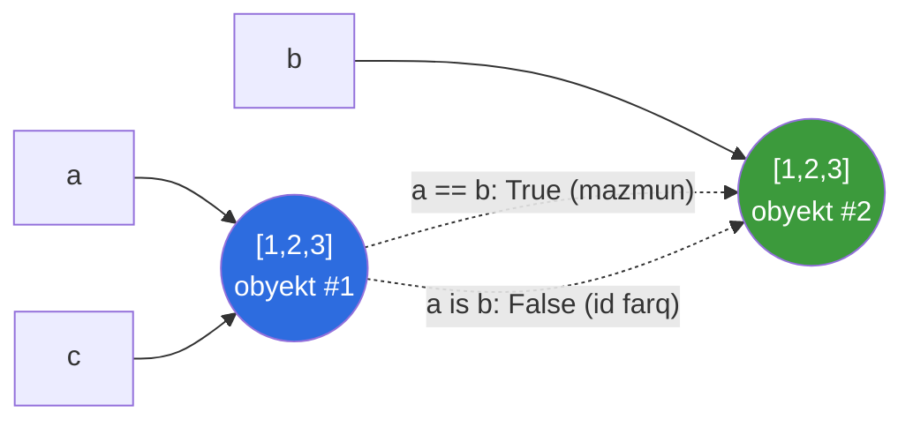
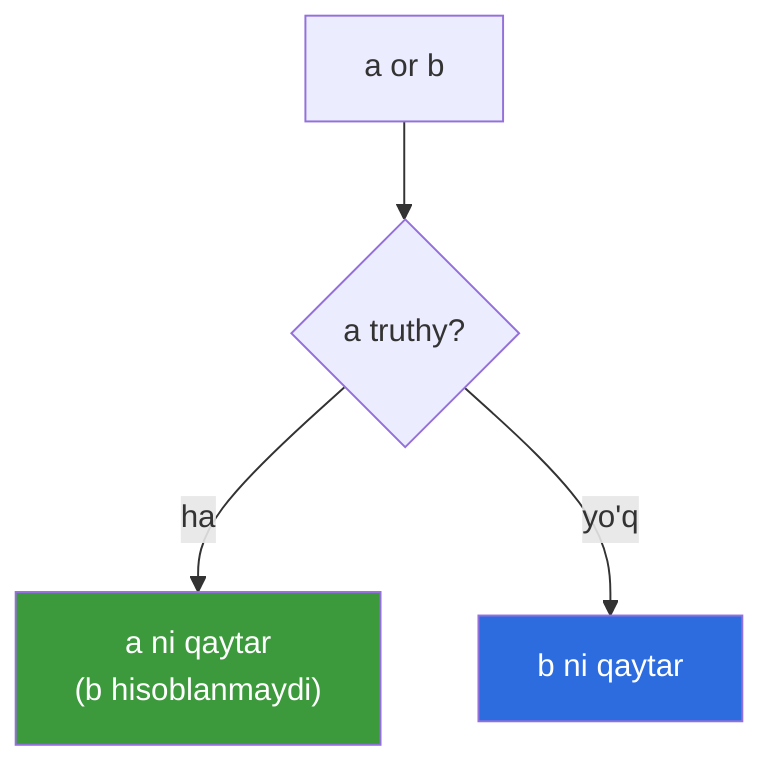
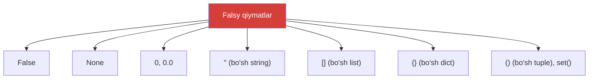

# 04. Boolean va operatorlar

> Bu dars mantiq (logic) haqida. Ko'rinishdan oddiy, lekin ichida Python'ning eng mashhur tuzoqlari yashiringan: `is` vs `==`, truthiness va `or` ning "qiymat qaytarishi". Bularni bilmasangiz — kod jimgina noto'g'ri ishlaydi.

## Nega bu dars kerak? (Hook)

Tasavvur qiling, ML pipeline'ida foydalanuvchi ismini olasiz. Agar bo'sh bo'lsa, "Anonymous" qo'ymoqchisiz. Go'da bu `if name == "" { name = "Anonymous" }` — bir necha qator.

Python'da esa bu **bitta qator**: `name = name or "Anonymous"`. Lekin bu "sehr" qanday ishlashini bilmasangiz, uni na yozasiz, na o'qiganingizda tushunasiz.

Yana bir tuzoq: ikki list bir xil ko'rinsa ham `is` ular "boshqa" deyishi mumkin. Bu darsda bu tuzoqlarni ochib, Python mantiqini puxta o'rnatamiz.

---

## Analogiya: `==` — egizaklar, `is` — bitta odam

Tasavvur qiling ikki egizak aka-uka. Ular **bir xil ko'rinadi** — bo'yi, yuzi, kiyimi bir xil. Bu `==`: **qiymatlar** teng.

Lekin ular **bir odam emas** — ikki alohida inson, ikki alohida shaxsiy raqam (passport). `is` esa aynan shuni tekshiradi: bu **aynan bitta** odammi? Ikki egizak bir xil (`==` True), lekin bitta odam emas (`is` False).

> Chegarasi: bu analogiya `is` va `==` farqini yaxshi ko'rsatadi. Lekin Go'da to'g'ridan-to'g'ri o'xshashi yo'q — Go'da `==` odatda ikkalasini ham (qiymat/ko'rsatkich) turga qarab hal qiladi. Python'da esa bu ikki operator **aniq ajratilgan**.

---

## bool — sodda ta'rif

**bool** — faqat ikki qiymatga ega tur: `True` va `False`. Diqqat — **bosh harf bilan** (Go'da `true`/`false` kichik harf).

```python
x = True
y = False
print(type(x))   # Output: <class 'bool'>
```

Qiziq fakt: Python'da `bool` — aslida `int` ning bir turi. `True` ichida `1`, `False` ichida `0` yashiringan:

```python
print(True + True)      # Output: 2    (1 + 1)
print(False + 10)       # Output: 10
print(int(True))        # Output: 1
```

Go'da bunday emas — `bool` va `int` butunlay alohida turlar. Python'da esa bu ba'zan qulay (masalan `sum([True, False, True])` → 2, ya'ni nechta True borligini sanaydi).

---

## Taqqoslash operatorlari

Taqqoslash **bool** qaytaradi. Go bilan deyarli bir xil:

| Operator | Ma'nosi | Misol → Natija |
| --- | --- | --- |
| `==` | teng | `3 == 3` → `True` |
| `!=` | teng emas | `3 != 4` → `True` |
| `<` `>` | kichik / katta | `2 < 5` → `True` |
| `<=` `>=` | kichik-teng / katta-teng | `5 >= 5` → `True` |

```python
print(10 == 10)    # Output: True
print(10 != 5)     # Output: True
print("a" < "b")   # Output: True   (alifbo tartibida)
```

---

## Chained comparison — Go'da yo'q imkoniyat

Python'da bir necha taqqoslashni **zanjirlab** yozish mumkin — matematikadagidek:

```python
x = 5
print(1 < x < 10)      # Output: True   (1 < 5 VA 5 < 10)
print(0 <= x <= 3)     # Output: False
```

`1 < x < 10` — bu `1 < x and x < 10` ma'nosini beradi, lekin `x` **bir marta** hisoblanadi. Go'da bunday yozib bo'lmaydi — u yerda `1 < x && x < 10` yozardingiz.

```python
# Yosh 18 va 65 orasidami?
age = 30
print(18 <= age <= 65)   # Output: True
```

> Bu Python idiomi — diapazonni tekshirishning eng o'qishli usuli.

---

## `is` vs `==` — eng mashhur tuzoq

Bu ikki operatorni chalkashtirish — yangi kelganlarning **eng ko'p** qiladigan xatosi.

- `==` — **qiymatlar** teng-mi? (equality)
- `is` — **aynan bitta obyekt**-mi? (identity, ya'ni `id()` bir xil-mi)

O'tgan darsdagi "yorliq" modelini eslang: ikki nom **bir xil qiymatli, lekin alohida** obyektga ishora qilishi mumkin.

```python
# --- ikki alohida list, lekin bir xil mazmun ---
a = [1, 2, 3]
b = [1, 2, 3]
print(a == b)    # Output: True    (mazmun bir xil)
print(a is b)    # Output: False   (alohida obyektlar!)

# --- c aynan a ga ishora qiladi ---
c = a
print(a is c)    # Output: True    (bitta obyekt)
```



**Nega tuzoq?** Kichik butun sonlar (`-5` dan `256` gacha) Python tomonidan **kešlanadi** (bitta nusxada saqlanadi), shuning uchun `is` ba'zan tasodifan `True` beradi — bu sizni chalg'itadi:

```python
x = int("257")
y = int("257")
print(x == y)    # Output: True    (qiymat teng)
print(x is y)    # Output: False   (alohida obyekt — 257 keshlanmagan)
```

> **Oltin qoida:** qiymatlarni doim `==` bilan solishtiring. `is` ni **faqat** `None`, `True`, `False` (yagona nusxadagi singleton'lar) uchun ishlating.

---

## and / or / not — mantiqiy operatorlar

Go'da `&&`, `||`, `!` bor. Python'da ular **so'z** bilan: `and`, `or`, `not`.

```python
print(True and False)    # Output: False
print(True or False)     # Output: True
print(not True)          # Output: False
```

Shu yergacha Go bilan bir xil. Lekin Python'da bitta **katta farq** bor: `and`/`or` bool emas, **operandning o'zini** qaytaradi. Buni endi ochamiz.

---

## Short-circuit va qiymat qaytarish — `or` idiomi

Bu Python'ning eng chiroyli (va boshda chalkash) xususiyati.

**Short-circuit (qisqa tutashuv):** natija allaqachon aniq bo'lsa, ikkinchi operand **umuman hisoblanmaydi**.
- `or`: chap tomon **truthy** bo'lsa, o'ngga qaramaydi.
- `and`: chap tomon **falsy** bo'lsa, o'ngga qaramaydi.

**Qiymat qaytarish:** `and`/`or` `True`/`False` emas, **operandlardan birini** qaytaradi:

```python
print(3 or 5)         # Output: 3    (3 truthy — chapni qaytardi)
print(0 or 5)         # Output: 5    (0 falsy — o'ngga o'tdi)
print(3 and 5)        # Output: 5    (3 truthy — o'ngni qaytardi)
print(0 and 5)        # Output: 0    (0 falsy — chapni qaytardi)
```



Bu bizga mashhur **default qiymat idiomini** beradi:

```python
# --- 1-qadam: foydalanuvchi kirimini olamiz (bo'sh bo'lishi mumkin) ---
user_input = ""

# --- 2-qadam: bo'sh bo'lsa, default ishlatamiz ---
name = user_input or "Anonymous"

print(name)   # Output: Anonymous
```

`user_input` bo'sh (`""` — falsy) bo'lgani uchun `or` o'ngdagi `"Anonymous"`ni qaytardi. Agar kirim bo'lsa (`"Ali"` — truthy), o'sha qaytariladi.

> **Go farqi:** Go'da `&&`/`||` **faqat bool** qaytaradi, operandni emas. Shuning uchun bu idioma Go'da ishlamaydi — u yerda `if`/`else` yozasiz.

---

## Truthiness — "bo'sh" narsa False

Python'da `if` ichiga **istalgan** qiymat qo'yish mumkin, faqat bool emas. Har bir obyekt "rost" (truthy) yoki "yolg'on" (falsy) deb baholanadi.

**Falsy** (False deb hisoblanadigan) qiymatlar ro'yxati aniq:



**Qolgan hammasi truthy.** Bu shuni anglatadiki, "bo'shligi"ni tekshirish juda qisqa:

```python
items = []
if items:
    print("ro'yxatda narsa bor")
else:
    print("ro'yxat bo'sh")     # Output: ro'yxat bo'sh

name = "Ali"
if name:
    print("ism bor")           # Output: ism bor
```

`bool()` bilan aniq tekshirish mumkin:

```python
print(bool([]))       # Output: False
print(bool([0]))      # Output: True   (bo'sh emas — ichida element bor!)
print(bool(""))       # Output: False
print(bool("0"))      # Output: True   (bo'sh emas — bu string "0")
```

> **Go farqi:** Go'da `if` faqat **bool** qabul qiladi. Bo'sh list uchun `if len(items) == 0` yozasiz. Python'da `if items:` yetarli — bu Pythonic idioma.

`if len(items) > 0:` yozish ishlaydi, lekin Python'da uni `if items:` deb qisqartirish odat.

---

## None — "qiymat yo'q" belgisi

**None** — "qiymat yo'q, hech narsa" degan maxsus obyekt. Go'dagi `nil` ga o'xshaydi, lekin Python'da **butun dasturda yagona** `None` obyekti bor.

Qiymat qaytarmaydigan funksiya avtomatik `None` qaytaradi:

```python
def greet():
    print("salom")

result = greet()      # Output: salom
print(result)         # Output: None   (funksiya hech nima return qilmadi)
```

**None ni doim `is` bilan tekshiring**, `==` bilan emas:

```python
x = None
print(x is None)        # Output: True    ← to'g'ri usul
print(x is not None)    # Output: False
```

Nega `is`? Chunki `None` — yagona singleton obyekt, uni identity bilan tekshirish ham to'g'ri, ham tez, ham xavfsiz (`==` ni ba'zi obyektlar noto'g'ri qayta ta'riflashi mumkin).

> Diqqat: `None` — bu `False`, `0` yoki `""` **emas**. Ular hammasi falsy, lekin turli obyektlar. `None == False` → `False`.

---

## Worked example — xavfsiz konfiguratsiya o'qish

```python
# --- 1-qadam: config'dan qiymat kelishi mumkin (yoki None) ---
config_timeout = None

# --- 2-qadam: None yoki 0 bo'lsa, default 30 ishlatamiz ---
timeout = config_timeout or 30

# --- 3-qadam: chegara ichidami tekshiramiz (chained) ---
is_valid = 1 <= timeout <= 300

# --- 4-qadam: natijani chiqaramiz ---
print(f"timeout={timeout}, valid={is_valid}")
# Output: timeout=30, valid=True
```

Bu yerda `or` idiomi, truthiness va chained comparison — uchtasi birga ishladi.

---

## 🤔 O'ylab ko'r

Quyidagi kod nima chiqaradi?

```python
a = [1, 2]
b = [1, 2]
print(a == b, a is b)

x = 0
print(x or "bo'sh")
print(x and "bor")
```

<details>
<summary>💡 Javobni ko'rish</summary>

```text
True False
bo'sh
0
```

1-qator: `a == b` → `True` (mazmun teng), `a is b` → `False` (alohida obyektlar).

2-qator: `0` falsy, `or` o'ngdagi `"bo'sh"`ni qaytaradi.

3-qator: `0` falsy, `and` chapdagi (falsy) `0`ni qaytaradi — o'ngga qaramaydi (short-circuit).

</details>

---

## ⚠️ Ko'p uchraydigan xatolar

**1-xato: qiymat solishtirishda `is` ishlatish.**
- Noto'g'ri: `if x is 257:` yoki `if name is "Ali":`.
- Nega noto'g'ri: `is` identity'ni tekshiradi; keshlash tufayli ba'zan tasodifan ishlaydi, ba'zan yo'q — beqaror.
- To'g'risi: qiymatlar uchun `==`, faqat `None`/`True`/`False` uchun `is`.

**2-xato: `None`ni `== None` bilan tekshirish.**
- Noto'g'ri: `if x == None:`.
- Nega noto'g'ri: ishlaydi, lekin PEP 8'ga zid va ba'zi obyektlarda noto'g'ri natija berishi mumkin.
- To'g'risi: `if x is None:`.

**3-xato: `and`/`or` doim bool qaytaradi deb o'ylash (Go odati).**
- Noto'g'ri: `3 or 5` → `True` deb kutish.
- Nega noto'g'ri: Python `and`/`or` **operandni** qaytaradi — `3 or 5` → `3`.
- To'g'risi: aniq bool kerak bo'lsa `bool(3 or 5)` yoki taqqoslash ishlating.

**4-xato: truthiness'ni unutib, ortiqcha yozish.**
- Noto'g'ri: `if len(items) > 0 and items != None:`.
- Nega noto'g'ri: ortiqcha va noPythonIC; bo'sh list allaqachon falsy.
- To'g'risi: `if items:` — bo'sh yoki `None` bo'lsa avtomatik falsy.

**5-xato: `None`ni `False` deb tenglashtirish.**
- Noto'g'ri: `None == False` → `True` deb kutish.
- Nega noto'g'ri: ikkalasi falsy, lekin alohida obyektlar. `None == False` → `False`.
- To'g'risi: falsy tekshiruvi kerak bo'lsa `if not x:`, aniq `None` kerak bo'lsa `if x is None:`.

---

## Go dasturchi ko'zi bilan: farqlar jadvali

| Tushuncha | Go | Python |
| --- | --- | --- |
| bool qiymatlar | `true` / `false` | `True` / `False` (bosh harf) |
| bool va int | alohida turlar | `bool` — `int` turi (`True == 1`) |
| Mantiqiy operator | `&&` `\|\|` `!` | `and` `or` `not` (so'z) |
| `or` qaytaradi | faqat bool | operandning o'zini |
| Chained comparison | yo'q | bor (`1 < x < 10`) |
| `if` sharti | faqat bool | istalgan qiymat (truthiness) |
| "bo'sh"ni tekshirish | `len(x) == 0` | `if not x:` |
| "yo'q qiymat" | `nil` (turga bog'liq) | yagona `None` |
| Identity solishtirish | odatda `==` | `is` (alohida operator) |

---

## Xulosa

- `bool` — `True`/`False` (bosh harf); Python'da bu `int` ning bir turi (`True + True == 2`).
- Taqqoslash bool qaytaradi; **chained comparison** (`1 < x < 10`) Go'da yo'q qulaylik.
- `==` — **qiymat**, `is` — **identity** (aynan bitta obyekt). Ularni chalkashtirmang.
- `is` ni faqat `None`, `True`, `False` uchun ishlating; qiymatlar uchun `==`.
- `and`/`or` — **short-circuit** va **operandni qaytaradi** (bool emas); bundan `x or default` idiomi kelib chiqadi.
- **Truthiness:** `None`, `0`, `""`, `[]`, `{}`, `()` — falsy; qolgani truthy. "Bo'sh"ni `if not x:` bilan tekshiring.
- `None` — yagona "qiymat yo'q" obyekti; uni `is None` bilan tekshiring.

## 🧠 Eslab qol

- `==` qiymat, `is` identity — qiymatga doim `==`.
- `None`ni `is None` bilan tekshiring, `== None` emas.
- `and`/`or` operandni qaytaradi, bool emas — `x or default` idiomi shundan.
- Bo'sh list/dict/string/`0`/`None` — falsy; `if not x:` yetarli.
- `bool` — `int` turi: `True` bu `1`.

## ✅ O'z-o'zini tekshir (retrieval practice)

**1.** `a = [1,2]; b = [1,2]` uchun `a == b` va `a is b` nima qaytaradi va nega farq qiladi?

<details>
<summary>Javob</summary>

`a == b` → `True` (mazmuni bir xil), `a is b` → `False` (ikki alohida obyekt, `id` har xil). `==` **qiymatni**, `is` esa **aynan bir obyektligini** tekshiradi. `b = a` deganimizda esa `a is b` → `True` bo'lardi.

</details>

**2.** `"" or "default"` va `"Ali" or "default"` nima qaytaradi?

<details>
<summary>Javob</summary>

`"" or "default"` → `"default"` (`""` falsy, o'ngga o'tadi). `"Ali" or "default"` → `"Ali"` (`"Ali"` truthy, chapni qaytaradi, o'ngga qaramaydi — short-circuit). `or` operandni qaytaradi, bool emas.

</details>

**3.** Nega qiymatlarni solishtirishda `is` emas, `==` ishlatiladi?

<details>
<summary>Javob</summary>

`is` obyekt identity'sini (`id`) tekshiradi. Kichik sonlar keshlansa `is` tasodifan `True`, katta/yangi obyektlarda `False` beradi — beqaror. `==` esa mazmunni solishtiradi va doim to'g'ri. `is` faqat `None`/`True`/`False` singleton'lar uchun.

</details>

**4.** `if not items:` qachon bajariladi (`items` — list)?

<details>
<summary>Javob</summary>

`items` **bo'sh** (`[]`) yoki `None` bo'lganda. Bo'sh list falsy, `not` uni `True`ga aylantiradi. Bu `if len(items) == 0` ning Pythonic qisqa shakli. (Diqqat: `items = [0]` bo'lsa — bo'sh emas, truthy, blok bajarilmaydi.)

</details>

**5.** `None`, `False`, `0`, `""` — bularning umumiy jihati va farqi nima?

<details>
<summary>Javob</summary>

**Umumiy:** hammasi **falsy** — `if` ichida `False` deb baholanadi. **Farq:** ular turli **obyektlar** (`None` — NoneType, `False` — bool, `0` — int, `""` — str). Shuning uchun `None == False` → `False`, `None == 0` → `False`. Truthiness bir xil, identity/tur har xil.

</details>

## 🛠 Amaliyot

**1. Oson (Modify).** "Xavfsiz konfiguratsiya" misolini o'zgartiring: `config_timeout = 500` qo'ying va `is_valid` endi nima bo'lishini oldindan ayting, keyin ishga tushirib tekshiring.

<details>
<summary>Hint</summary>

`500 or 30` → `500` (500 truthy). `1 <= 500 <= 300` → `False`, chunki 500 > 300. Demak `valid=False`.

</details>

**2. O'rta (faded example).** Skeletonni to'ldiring — foydalanuvchi login'ini tekshirsin (bo'sh bo'lsa "guest", va uzunligi 3–20 orasidami):

```python
username = "   "                # faqat bo'shliqlar
cleaned = username.strip()
final_name = # TODO: cleaned bo'sh bo'lsa "guest" ishlating (or idiomi)
is_ok = # TODO: final_name uzunligi 3 va 20 orasidami (chained comparison)
print(final_name, is_ok)        # kutilgan: guest True
```

<details>
<summary>Hint</summary>

`final_name = cleaned or "guest"` (`strip` dan keyin bo'sh string falsy). `is_ok = 3 <= len(final_name) <= 20`.

</details>

**3. Qiyin (Make).** Noldan yozing: ro'yxat (list) berilgan bo'lsin (masalan `data = [0, "", "Ali", None, 5]`). Faqat **truthy** elementlarni sanang va ularni chiqaring. Kutilgan: 2 ta truthy (`"Ali"` va `5`).

<details>
<summary>Hint</summary>

`for` bilan aylanib, `if item:` (truthiness) tekshiring. Hisoblagichni oshiring. Yoki keyingi darslarda ko'radigan `sum(1 for x in data if x)` idiomini sinang.

</details>

## 🔁 Takrorlash

- **Bog'liq mavzular:** "01. Kirish" (dynamic typing), "02. O'zgaruvchilar" (yorliq modeli, `id` — `is` shunga tayanadi), "03. String" (`in` operatori, bo'sh string truthiness).
- **Takrorlash jadvali:** ertaga → 3 kundan keyin → 1 haftadan keyin "O'z-o'zini tekshir"ga qaytib javob bering. Ayniqsa `is` vs `==` va `or` idiomini takrorlang.
- **Feynman testi:** kodsiz, 3 jumlada tushuntiring — "Python'da `is` va `==` nima farqi bor va nega `None`ni `is` bilan tekshiramiz?" Qiynalsangiz "egizaklar" analogiyasiga qayting.
