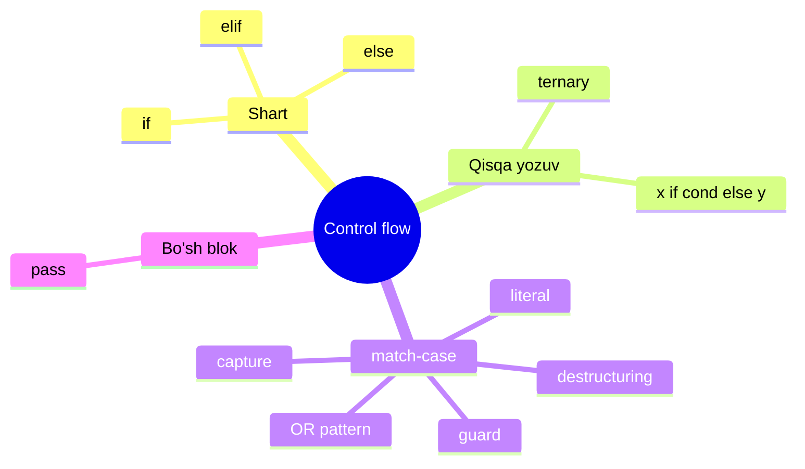
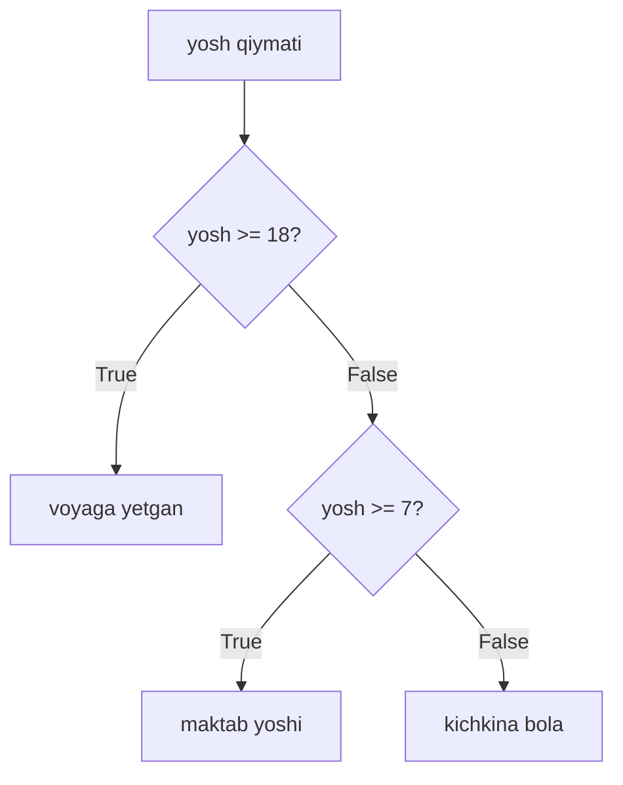
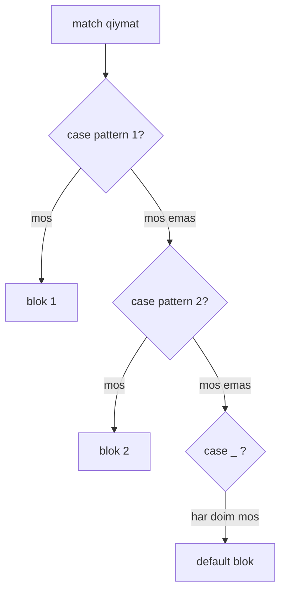

# 05. Control flow — if, elif, else, match

> Bu dars Go dasturchisi uchun. Sen `if`, `switch` ni Go'da yozgansan.
> Bu yerda Python'ning shu vositalari, ular orasidagi farqlar va Python 3.10+ ning
> kuchli yangiligi — `match` (structural pattern matching) haqida gaplashamiz.



---

## 1. if / elif / else — qaror qabul qilish

### Muammo / Hook

Dastur har doim bir xil yo'ldan yurmaydi. Foydalanuvchi kiritgan yoshga
qarab "voyaga yetgan" yoki "bola" deb javob berish kerak. Bu tarmoqlanish
(branching) bo'lmasa, dastur aqlsiz kalkulyator bo'lib qoladi.

### Analogiya

`if/elif/else` — bu **svetofor**. Yashil bo'lsa yur, sariq bo'lsa sekinlash,
qizil bo'lsa to'xta. Har bir holatga bitta yo'l.

Analogiya chegarasi: svetofor faqat 3 holatli, `if/elif/else` esa istagancha
`elif` shoxlarini qo'sha oladi — bu yerda cheklov yo'q.

### Sodda ta'rif

**if statement** — sharti `True` bo'lgan birinchi blokni bajaradi, qolganlarini
o'tkazib yuboradi.

### Diagramma



### Worked example — subgoal izohlar bilan

```python
# --- 1-qadam: tekshiriladigan qiymatni olamiz ---
yosh = 12

# --- 2-qadam: birinchi shart — eng "kuchli" holat yuqorida ---
if yosh >= 18:
    print("voyaga yetgan")
# --- 3-qadam: birinchisi False bo'lsa, keyingi shartga o'tamiz ---
elif yosh >= 7:
    print("maktab yoshi")
# --- 4-qadam: hech biri mos kelmasa, else ishlaydi ---
else:
    print("kichkina bola")
```

Output:

```
maktab yoshi
```

> Muhim: Python'da blok **qavs `{}` bilan emas, indentatsiya (bo'sh joy) bilan**
> belgilanadi. Odatda 4 ta probel. Go'da `{ }`, bu yerda esa chekinish o'zi bloc.

### Go bilan solishtirish

Go'da qavslar va aniq turlar bor, Python'da esa yo'q — shart faqat "rost/yolg'on"
ga aylantiriladi:

```go
// Go
yosh := 12
if yosh >= 18 {
    fmt.Println("voyaga yetgan")
} else if yosh >= 7 {
    fmt.Println("maktab yoshi")
} else {
    fmt.Println("kichkina bola")
}
```

| Xususiyat | Go | Python |
|---|---|---|
| Blok chegarasi | `{ }` | indentatsiya |
| `else if` | `else if` | `elif` |
| Shart qavsi | shart yalang'och | shart yalang'och |
| Shartda o'zgaruvchi e'lon | `if x := f(); x > 0` | walrus: `if (x := f()) > 0` |

### 🤔 O'ylab ko'r

Yuqoridagi kodda `yosh = 20` bo'lsa, va shartlarni **teskari tartibda**
(`if yosh >= 7` birinchi) yozsak, natija nima bo'ladi?

<details>
<summary>💡 Javobni ko'rish</summary>

Natija `maktab yoshi` bo'lib qoladi — bu **xato**! Chunki `20 >= 7` ham `True`,
va Python birinchi mos kelgan blokda to'xtaydi, `>= 18` ni umuman ko'rmaydi.

Xulosa: `elif` zanjirida **eng tor (eng katta) shartni yuqoriga** qo'yish kerak.
</details>

---

## 2. Ternary expression — bir qatorli shart

### Muammo / Hook

Ba'zan shunchaki bitta o'zgaruvchiga shartga qarab qiymat berish kerak.
4 qatorli `if/else` yozish ortiqcha ko'rinadi.

### Analogiya

Ternary — bu **tez javob**. "Yomg'ir yog'yaptimi? Ha bo'lsa soyabon, yo'q bo'lsa
ko'zoynak." Bitta jumlada savol ham, ikki javob ham bor.

### Sodda ta'rif

**Ternary expression** — `qiymat1 if shart else qiymat2` ko'rinishidagi ifoda;
u qiymat qaytaradi, statement emas.

### Worked example

```python
# --- 1-qadam: shartga qarab bitta qiymat tanlaymiz ---
yosh = 20
holat = "kattalar" if yosh >= 18 else "bolalar"

# --- 2-qadam: natijani ishlatamiz ---
print(holat)
```

Output:

```
kattalar
```

O'qilishi: "`kattalar` — agar `yosh >= 18`, aks holda `bolalar`". Python'da
shart **o'rtada** turadi — bu ko'p tillardan farq qiladi.

### Go bilan solishtirish

Go'da ternary operator **umuman yo'q** — bu ataylab shunday qilingan. Go'da
har doim to'liq `if/else` yozasan:

```go
// Go — ternary yo'q, to'liq if kerak
holat := "bolalar"
if yosh >= 18 {
    holat = "kattalar"
}
```

Python bu yerda ixchamroq, lekin **ichma-ich ternary** yozmaslik kerak —
o'qilishi qiyinlashadi.

### ⚠️ Keng tarqalgan xatolar

⚠️ **Xato:** C tilidagi `cond ? a : b` sintaksisini kutib `yosh >= 18 ? "a" : "b"`
yozish.
- Nega noto'g'ri: Python'da `?:` yo'q, `SyntaxError` beradi.
- To'g'risi: `"a" if yosh >= 18 else "b"`.

⚠️ **Xato:** Ternary'ni murakkab mantiq uchun ishlatish (3-4 ta ichma-ich).
- Nega noto'g'ri: o'qib bo'lmaydi, xatoni topish qiyin.
- To'g'risi: 2 dan ortiq shoxda oddiy `if/elif/else` yoz.

---

## 3. match-case — structural pattern matching

### Muammo / Hook

Bir o'zgaruvchini ko'p qiymatlarga solishtirish kerak bo'lganda, uzun
`if/elif/elif/elif` zanjiri hosil bo'ladi. U ko'zga og'ir ko'rinadi va
o'zgaruvchi nomini har qatorda takrorlaydi.

Bundan ham murakkabroq: kelgan ma'lumot **strukturasiga** qarab
(masalan, ro'yxatda nechta element bor, ichida nima bor) qaror qilish kerak.

### Analogiya

`match` — bu **pochta saralash mashinasi**. Har bir xat "shakl"iga qarab
(katta quti? xat? banderol?) alohida tokchaga tushadi. Faqat qiymatni emas,
**shaklni** ham taniydi.

Analogiya chegarasi: Go'ning `switch` i faqat qiymatga qaraydi (quti ustidagi
yozuvni o'qiydi). Python'ning `match` i qutini **ochib**, ichidagini ko'ra oladi —
bu "structural" (strukturaviy) degani.

### Sodda ta'rif

**match-case** (Python 3.10+) — qiymatni bir nechta **pattern** (namuna) ga
solishtirib, mos kelgan birinchi `case` blokini bajaradi.

### Diagramma



### Worked example 1 — oddiy literal (Go switch kabi)

```python
# --- 1-qadam: statusga qarab xabar tanlaymiz ---
status = 404

match status:
    case 200:
        print("OK")
    case 404:
        print("Topilmadi")
    # --- 2-qadam: 500 va 503 ni birlashtiramiz (OR pattern) ---
    case 500 | 503:
        print("Server xatosi")
    # --- 3-qadam: _ wildcard — hech biri mos kelmasa ---
    case _:
        print("Noma'lum status")
```

Output:

```
Topilmadi
```

Bu yerda `_` — **wildcard** (har narsaga mos keluvchi), Go'dagi `default` ga
o'xshaydi. `|` esa OR pattern — bir nechta qiymatni bitta case'da.

> Muhim farq Go'dan: Python `match` da **fall-through yo'q**. Go'da ham
> `break` avtomatik, shu jihatdan ikkalasi bir xil — mos blok tugagach chiqadi.

### 🤔 O'ylab ko'r

`match` ni oddiy `if/elif` bilan solishtirsak, yuqoridagi `case 500 | 503`
ni `if` bilan qanday yozgan bo'lardik?

<details>
<summary>💡 Javobni ko'rish</summary>

```python
if status == 500 or status == 503:
    print("Server xatosi")
```

`match` da `500 | 503` yozuvi qisqaroq va o'zgaruvchi nomini takrorlamaydi.
`in` bilan ham: `if status in (500, 503):`.
</details>

### Worked example 2 — destructuring (Go'da yo'q!)

Mana `match` ning `switch` dan kuchli joyi — ro'yxatni **qismlarga ajratib**
(destructuring) taniydi:

```python
# --- 1-qadam: buyruqni so'zlarga ajratamiz ---
buyruq = "go north"
parts = buyruq.split()   # ['go', 'north']

# --- 2-qadam: ro'yxat shakliga qarab pattern tanlaymiz ---
match parts:
    # --- 3-qadam: aynan 2 element, birinchisi "go" ---
    case ["go", direction]:
        print(f"Yuramiz: {direction}")
    # --- 4-qadam: "drop" + qolgan hamma element (*rest) ---
    case ["drop", *rest]:
        print(f"Tashlaymiz: {rest}")
    case _:
        print("Tushunarsiz buyruq")
```

Output:

```
Yuramiz: north
```

Bu yerda `direction` o'zgaruvchisiga `"north"` **avtomatik biriktirildi** —
bu **capture pattern**. `*rest` esa qolgan barcha elementlarni yig'ib oladi.

### Worked example 3 — guard (qo'shimcha shart)

Pattern mos kelgach, ustiga `if` shart ham qo'yish mumkin — bu **guard**:

```python
# --- 1-qadam: koordinatani (x, y) tuple sifatida olamiz ---
nuqta = (3, 3)

match nuqta:
    # --- 2-qadam: (x, y) ga ajrat, KEYIN x == y bo'lsa ---
    case (x, y) if x == y:
        print(f"Diagonalda: {x}")
    # --- 3-qadam: guardsiz umumiy holat ---
    case (x, y):
        print(f"Oddiy nuqta: {x}, {y}")
```

Output:

```
Diagonalda: 3
```

Guard — bu "pattern + qo'shimcha mantiq". Faqat shakl emas, qiymatlar orasidagi
munosabatni ham tekshiradi. Go'ning `switch` ida bunga eng yaqin narsa
`switch { case x==y: }` — lekin destructuring bilan birlashtira olmaydi.

### match vs Go switch — jadval

| Xususiyat | Go `switch` | Python `match` |
|---|---|---|
| Qiymatga solishtirish | bor | bor |
| OR (`a` yoki `b`) | `case a, b:` | `case a | b:` |
| Default | `default:` | `case _:` |
| Fall-through | `fallthrough` bilan | yo'q |
| Destructuring | yo'q | bor (`[a, b]`, `(a, b)`) |
| Capture (o'zgaruvchiga olish) | yo'q | bor |
| Guard (qo'shimcha shart) | `case x > 0:` (shartli switch) | `case p if p > 0:` |
| Turga qarab | `switch v.(type)` | `case Point():` |

### ⚠️ Keng tarqalgan xatolar

⚠️ **Xato:** `case` da oddiy o'zgaruvchi nomini "solishtirish uchun" ishlatish:
```python
kutilgan = 404
match status:
    case kutilgan:   # XATO mantiq!
        print("mos")
```
- Nega noto'g'ri: `case kutilgan:` bu **capture** — u har qanday qiymatni
  `kutilgan` ga oladi, solishtirish emas! Har doim mos keladi.
- To'g'risi: konstantani nuqta bilan yoz — `case HTTPStatus.NOT_FOUND:` yoki
  literal ishlat — `case 404:`.

⚠️ **Xato:** `match` ni Python 3.9 va undan eski versiyada ishlatish.
- Nega noto'g'ri: `match` faqat **3.10+** da bor, eskisi `SyntaxError` beradi.
- To'g'risi: `python --version` ni tekshir, ML uchun 3.11/3.12 ishlat.

---

## 4. pass — "hech narsa qilma" statement

### Muammo / Hook

Python'da blok bo'sh bo'la olmaydi — indentatsiyalangan qator **shart**.
Lekin ba'zan blok kerak, ichi esa hozircha bo'sh (masalan, keyin yozaman).

### Analogiya

`pass` — bu **bo'sh joy belgisi (placeholder)**. Anketada "keyin to'ldiraman"
deb qo'yilgan chiziqcha kabi — o'rin band, lekin hozir hech narsa yo'q.

### Sodda ta'rif

**pass** — hech qanday amal bajarmaydigan statement; faqat sintaktik jihatdan
"bu yerda blok bor" deb bildiradi.

### Worked example

```python
# --- 1-qadam: hozircha ishlamaydigan, lekin sintaksis to'g'ri funksiya ---
def keyin_yozaman():
    pass   # TODO: mantiqni keyin qo'shaman

# --- 2-qadam: shart ichida ham bo'sh blok kerak bo'lsa ---
x = 5
if x > 0:
    pass   # musbat bo'lsa hozircha hech narsa
else:
    print("musbat emas")

print("dastur davom etadi")
```

Output:

```
dastur davom etadi
```

### Go bilan solishtirish

Go'da bo'sh blok `{ }` mumkin — hech narsa yozmasang ham xato bermaydi:
```go
func keyinYozaman() {}   // Go — bo'sh blok OK
```
Python'da esa `pass` **majburiy**, chunki qavs yo'q — bo'sh indentatsiya
`IndentationError` beradi.

---

## Xulosa

- **if/elif/else** — sharti `True` bo'lgan birinchi blokni bajaradi, blok
  indentatsiya bilan belgilanadi.
- Shartlarni **eng tordan keng tomonga** tartiblab yoz, aks holda umumiy shart
  aniqrog'ini "yeb qo'yadi".
- **Ternary** (`a if cond else b`) — bir qatorli shart, faqat oddiy holatlar uchun;
  Go'da bunday operator yo'q.
- **match-case** (3.10+) — qiymat **va strukturaga** qarab tarmoqlanadi;
  destructuring, capture, guard bilan Go `switch` dan kuchliroq.
- `case _:` — wildcard (default), `a | b` — OR pattern.
- `case oddiy_nom:` — bu solishtirish emas, **capture**! Konstantani `.` bilan yoz.
- **pass** — bo'sh blok uchun majburiy placeholder.

## 🧠 Eslab qol

- Python'da blokni **indentatsiya** belgilaydi, `{}` emas.
- `elif` zanjirida eng tor shart yuqorida turadi.
- Ternary o'qilishi: "qiymat AGAR shart AKS HOLDA qiymat".
- `match` faqat qiymatni emas, **shaklni** ham taniydi (destructuring).
- Bir so'zli `case nom:` — capture, doim mos keladi; ehtiyot bo'l.

## ✅ O'z-o'zini tekshir (retrieval practice)

**1.** `yosh = 20` va shartlar `if yosh >= 7 ... elif yosh >= 18` tartibida bo'lsa,
nega natija "voyaga yetgan" chiqmaydi?

<details>
<summary>Javob</summary>

Chunki `20 >= 7` ham `True`, va Python birinchi mos kelgan blokda to'xtaydi.
`>= 18` shartiga umuman yetib bormaydi. Tor shart yuqorida turishi kerak.
</details>

**2.** Go'da `x := 5; y := x > 0 ? "a" : "b"` ishlaydimi? Python'da qanday yoziladi?

<details>
<summary>Javob</summary>

Go'da ishlamaydi — Go'da ternary operator yo'q. Python'da:
`y = "a" if x > 0 else "b"`.
</details>

**3.** `case ["go", direction]:` da `direction` qayerdan qiymat oladi?

<details>
<summary>Javob</summary>

Bu **capture pattern**. Agar ro'yxat aynan 2 elementli bo'lib, birinchisi
`"go"` bo'lsa, ikkinchi element avtomatik `direction` o'zgaruvchisiga
biriktiriladi (masalan `"north"`).
</details>

**4.** Quyidagi kod nima chop etadi va nega bu tuzoq?
```python
maqbul = 200
match 404:
    case maqbul:
        print("mos keldi")
```

<details>
<summary>Javob</summary>

`mos keldi` chop etadi! Chunki `case maqbul:` solishtirish emas — u
`404` ni `maqbul` o'zgaruvchisiga qayta yozadi va **har doim** mos keladi.
Solishtirish uchun `case 200:` yoki `case Const.MAQBUL:` (nuqtali) kerak.
</details>

**5.** Nega bo'sh funksiya ichiga `pass` yozamiz, Go'da esa yozmaymiz?

<details>
<summary>Javob</summary>

Python bloklarni indentatsiya bilan belgilaydi; bo'sh indentatsiya
`IndentationError` beradi, shuning uchun `pass` majburiy. Go bloklarni `{}`
bilan belgilaydi, bo'sh `{}` o'zi yetarli.
</details>

## 🛠 Amaliyot

**1. Oson (Modify).** Yuqoridagi `status` misolini kengaytir: `301` va `302`
uchun `"Boshqa manzilga yo'naltirish"` chiqaradigan `case` qo'sh.

<details>
<summary>Hint</summary>

OR pattern ishlat: `case 301 | 302:`. Uni `case 404:` dan keyin qo'y.
</details>

**2. O'rta (faded example).** Skeletni to'ldir — buyruqni tahlil qiluvchi:
```python
buyruq = "buy apple 3"
parts = buyruq.split()
match parts:
    case ["buy", mahsulot, soni]:
        # TODO: "3 dona apple sotib olindi" chiqarish (soni birinchi, mahsulot keyin)
        pass
    case ["sell", *__]:
        # TODO: "Sotish buyrug'i" chiqarish
        pass
    case _:
        # TODO: "Noto'g'ri buyruq" chiqarish
        pass
```

<details>
<summary>Hint</summary>

`print(f"{soni} dona {mahsulot} sotib olindi")`. Diqqat: `soni` bu yerda
string ("3"), son emas — kerak bo'lsa `int(soni)` bilan aylantir.
</details>

**3. Qiyin (Make).** Noldan yoz: `baho_harf(ball)` funksiyasi. `ball` (0-100)
ga qarab harf qaytarsin: `>=90` A, `>=80` B, `>=70` C, `>=60` D, aks holda F.
`match` va guard bilan yoz (`case n if n >= 90:` ko'rinishida).

<details>
<summary>Hint</summary>

```python
def baho_harf(ball):
    match ball:
        case n if n >= 90:
            return "A"
        # ... qolganini davom ettir
        case _:
            return "F"
```
Guard shartlari yuqoridan pastga tekshiriladi, shuning uchun `>=90` yuqorida.
</details>

## 🔁 Takrorlash

- **Bog'liq oldingi mavzular:** 04 — Boolean va operatorlar (shartlar `True/False`
  ga aylanishi, `and/or/not`, truthiness). 02 — turlar (`int`, taqqoslash).
- **Takrorlash jadvali:**
  - Ertaga → "O'z-o'zini tekshir" 1 va 4-savolga qayt (elif tartibi, capture tuzog'i).
  - 3 kundan keyin → `match` destructuring misolini yoddan yozib ko'r.
  - 1 haftadan keyin → butun darsning barcha savollariga qayta javob ber.
- **Feynman testi:** Bir do'stingga `match` ni Go `switch` dan nima bilan
  farq qilishini kod ishlatmasdan, 3 jumlada tushuntirib ber. ("switch faqat
  qiymatga qaraydi, match esa...").
