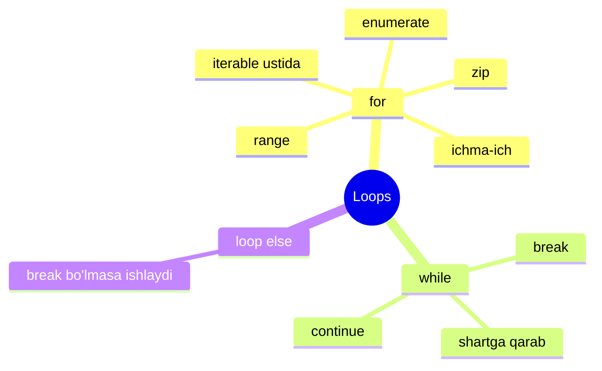
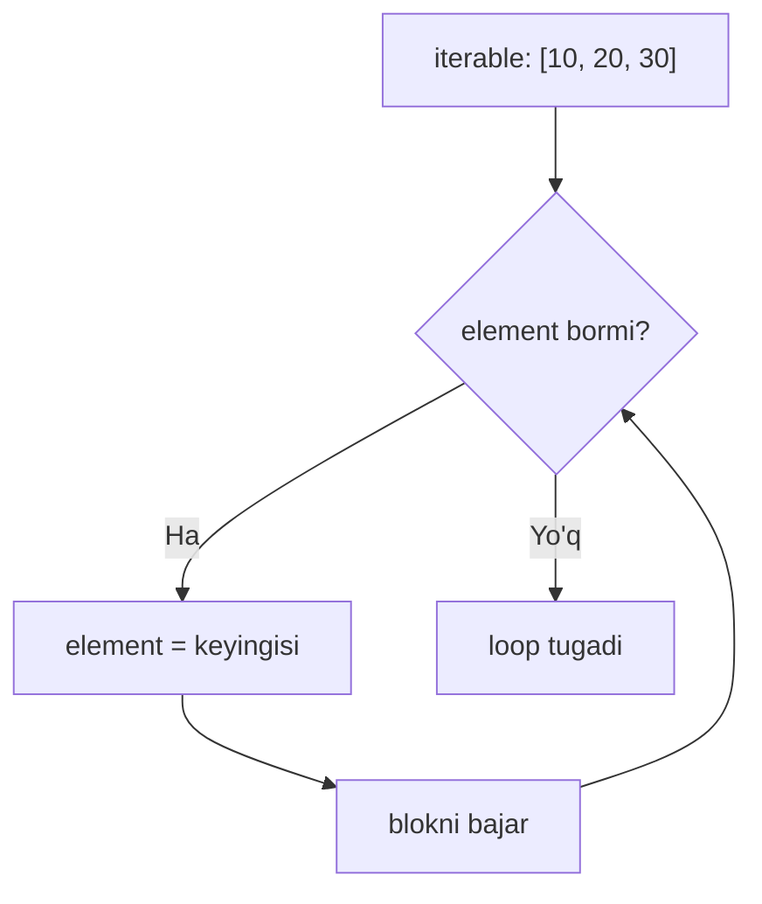
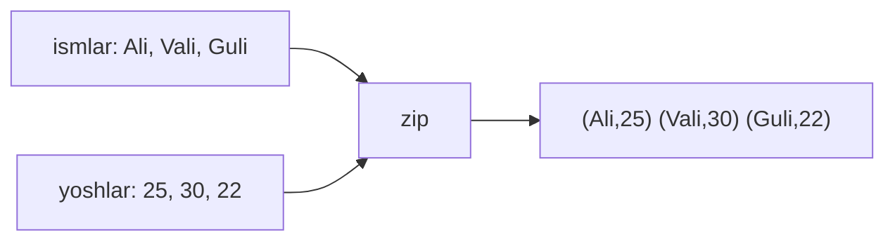
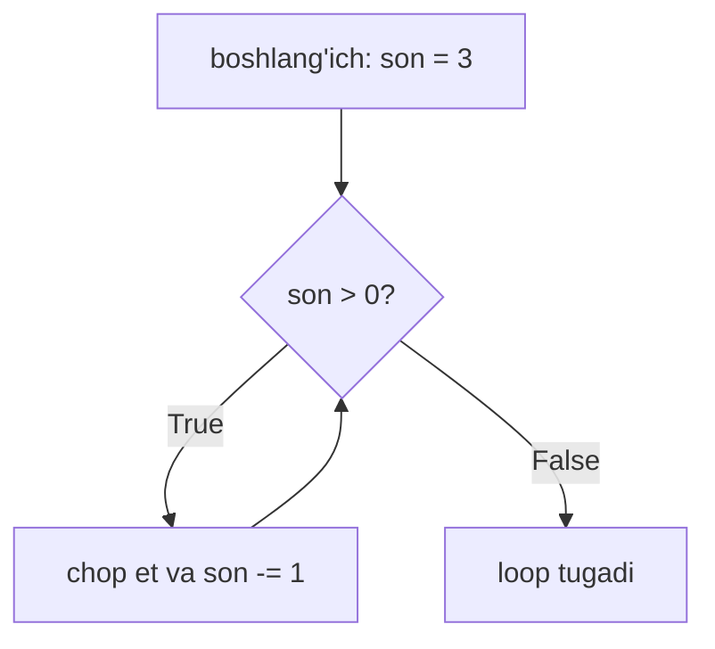
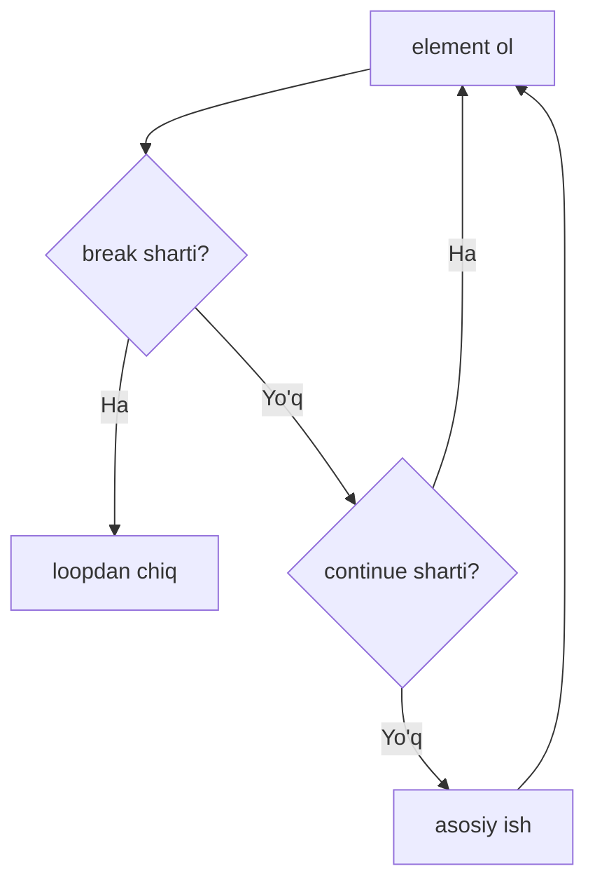
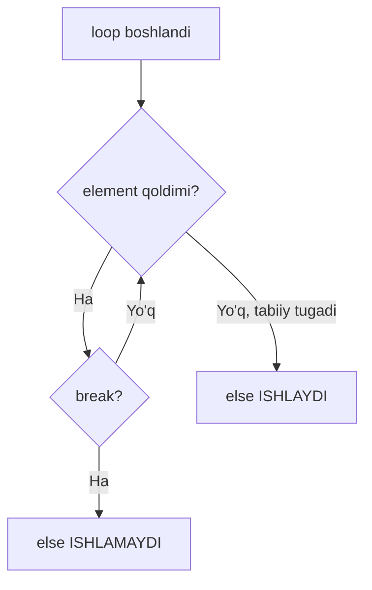

# 06. Loops — for va while

> Bu dars Go dasturchisi uchun. Go'da `for` bitta kalit so'z bilan hamma narsani
> qiladi. Python'da esa `for` va `while` ikki xil vazifa uchun ajratilgan.
> Eng katta hayrat: Python'da **C-style `for (i=0; i<n; i++)` YO'Q**.



---

## 1. for — iterable ustida yurish

### Muammo / Hook

Ro'yxatdagi har bir ismni ekranga chiqarish kerak. Qo'lda `print(ismlar[0])`,
`print(ismlar[1])`... yozish 1000 element uchun aqldan ozdiradi. Takrorlanuvchi
ishni mashina bajarishi kerak — bu loop.

### Analogiya

Python'ning `for` i — **konveyer lentasi**. Lenta ustidan detallar (elementlar)
birma-bir o'tadi, sen har biri bilan bir xil ishni qilasan. Sen indeks bilan
band emassan — lenta o'zi keyingisini olib keladi.

Analogiya chegarasi: Go'ning klassik `for i := 0; i < n; i++` i esa **sanoq
mashinasi** — sen o'zing indeksni sanaysan. Python'da lenta shu ishni o'zi
qiladi, sen faqat elementni olasan.

### Sodda ta'rif

**for loop** — iterable (ustidan yurish mumkin bo'lgan obyekt: list, string,
range...) ning har bir elementini birma-bir olib, blokni takrorlaydi.

### Diagramma



### Worked example — subgoal izohlar bilan

```python
# --- 1-qadam: ustidan yuriladigan iterable ---
ismlar = ["Ali", "Vali", "Guli"]

# --- 2-qadam: har bir elementni "ism" ga olib, blokni takrorlaymiz ---
for ism in ismlar:
    print(f"Salom, {ism}!")
```

Output:

```
Salom, Ali!
Salom, Vali!
Salom, Guli!
```

Diqqat: `ism` — biz o'ylab topgan o'zgaruvchi nomi. Python har aylanishda
unga navbatdagi elementni **avtomatik** solib beradi. Indeks yo'q!

### Notional machine — ichkarida nima bo'ladi?

Python `ismlar` dan **iterator** oladi (ichki "kursor"). Har aylanishda
`next()` chaqiriladi, kursor bir qadam suriladi va element `ism` ga
biriktiriladi. Element tugaganda maxsus signal keladi va loop to'xtaydi.

### Go bilan solishtirish

```go
// Go — range bilan (Python for ga eng yaqin)
ismlar := []string{"Ali", "Vali", "Guli"}
for _, ism := range ismlar {   // index kerak emas, shuning uchun _
    fmt.Printf("Salom, %s!\n", ism)
}
```

| Xususiyat | Go | Python |
|---|---|---|
| Element ustida yurish | `for _, v := range s` | `for v in s` |
| C-style sanoq | `for i:=0; i<n; i++` | **yo'q** (`range(n)` ishlat) |
| Indeks kerak | `for i, v := range s` | `for i, v in enumerate(s)` |
| Cheksiz loop | `for { }` | `while True:` |

---

## 2. range — sonlar ketma-ketligini yasash

### Muammo / Hook

C-style `for` yo'q bo'lsa, "0 dan 9 gacha" sanashni qanday qilamiz? Bunga
`range` javob beradi — u kerakli sonlarni yasab beradi.

### Sodda ta'rif

**range(start, stop, step)** — `start` dan boshlab, `stop` gacha (uni **o'z ichiga
olmaydi**), `step` qadam bilan sonlar hosil qiladi.

### Worked example

```python
# --- 1-qadam: faqat stop — 0 dan boshlaydi, 5 kirmaydi ---
for i in range(5):
    print(i, end=" ")
print()

# --- 2-qadam: start va stop — 2 dan 6 gacha (6 kirmaydi) ---
for i in range(2, 6):
    print(i, end=" ")
print()

# --- 3-qadam: step — 0 dan 10 gacha 2 qadam bilan ---
for i in range(0, 10, 2):
    print(i, end=" ")
print()
```

Output:

```
0 1 2 3 4 
2 3 4 5 
0 2 4 6 8 
```

> Eng muhim qoida: `range(stop)` **stop ni o'z ichiga olmaydi** (yarim ochiq
> oraliq). `range(5)` → 0,1,2,3,4. Bu Go'ning slice `a[i:j]` mantiqi bilan bir xil.

### 🤔 O'ylab ko'r

`range(5, 0, -1)` nima hosil qiladi?

<details>
<summary>💡 Javobni ko'rish</summary>

`5 4 3 2 1`. `step = -1` teskari sanaydi: 5 dan boshlab, 0 gacha (0 kirmaydi),
har qadamda 1 kamayadi. Teskari yurish uchun manfiy step ishlatiladi.
</details>

---

## 3. enumerate — indeks kerak bo'lganda

### Muammo / Hook

Ba'zan elementning o'zi ham, **tartib raqami** ham kerak: "1. Ali, 2. Vali".
Yangi boshlovchilar buni `range(len(...))` bilan qilishga urinadi — bu Python'da
xunuk (unpythonic).

### Analogiya

`enumerate` — **navbat raqamini beruvchi mashina**. Sen navbatga turasan, mashina
har kishiga "sen 1-chi, sen 2-chi" deb raqam beradi. Sen sanashni o'ylamaysan.

### Sodda ta'rif

**enumerate(iterable)** — har element uchun `(indeks, element)` juftligini qaytaradi.

### Worked example

```python
# --- 1-qadam: enumerate har elementga indeks qo'shadi ---
ismlar = ["Ali", "Vali", "Guli"]

# --- 2-qadam: (indeks, element) ni ikki o'zgaruvchiga ochamiz ---
for i, ism in enumerate(ismlar):
    print(f"{i}. {ism}")

# --- 3-qadam: sanashni 1 dan boshlash — start argumenti ---
for i, ism in enumerate(ismlar, start=1):
    print(f"{i}. {ism}")
```

Output:

```
0. Ali
1. Vali
2. Guli
1. Ali
2. Vali
3. Guli
```

### ⚠️ Keng tarqalgan xatolar

⚠️ **Xato:** `for i in range(len(ismlar)): print(ismlar[i])`.
- Nega noto'g'ri: ishlaydi, lekin ortiqcha indeks, xunuk va xatoga moyil.
- To'g'risi: `for ism in ismlar:` yoki indeks kerak bo'lsa `enumerate`.

---

## 4. zip — bir nechta iterable ni parallel yurish

### Muammo / Hook

Ikki alohida ro'yxat bor: ismlar va yoshlar. Ularni juftlab chiqarish kerak:
"Ali — 25". Ikki loop chalkash, `range(len)` bilan xunuk.

### Analogiya

`zip` — **shimning tishlari**. Ikki tomonni juftlab, birma-bir ulaydi. Bir
tomon kaltaroq bo'lsa, ulanish o'sha yerda **to'xtaydi**.

### Sodda ta'rif

**zip(a, b, ...)** — bir nechta iterable dan bir vaqtda element olib,
tuple lar hosil qiladi; eng qisqa iterable tugaganda to'xtaydi.

### Diagramma



### Worked example

```python
# --- 1-qadam: parallel yuriladigan ikki ro'yxat ---
ismlar = ["Ali", "Vali", "Guli"]
yoshlar = [25, 30, 22]

# --- 2-qadam: zip juftlaydi, har juftni ochamiz ---
for ism, yosh in zip(ismlar, yoshlar):
    print(f"{ism} — {yosh} yoshda")
```

Output:

```
Ali — 25 yoshda
Vali — 30 yoshda
Guli — 22 yoshda
```

### 🤔 O'ylab ko'r

`yoshlar = [25, 30]` (faqat 2 ta) bo'lsa, `zip` nechta juft hosil qiladi?

<details>
<summary>💡 Javobni ko'rish</summary>

Faqat **2 ta**: `(Ali, 25)` va `(Vali, 30)`. `zip` eng qisqa iterable tugaganda
to'xtaydi, `Guli` juftsiz qolgani uchun tushib qoladi. Ma'lumot yo'qolishidan
ehtiyot bo'l — uzunliklar teng ekaniga ishonch hosil qil.
</details>

---

## 5. while — shart bajarilguncha takrorlash

### Muammo / Hook

Ba'zan necha marta aylanishni **oldindan bilmaysan**: "parol to'g'ri bo'lmaguncha
so'rayver". Bu yerda ro'yxat yo'q — faqat shart bor. Bu `while` ishi.

### Analogiya

`while` — **choynak qaynatish**. "Qaynamaguncha kutaman" — necha daqiqa
ketishini bilmaysan, faqat shartni (qaynadimi?) kuzatasan.

### Sodda ta'rif

**while loop** — sharti `True` bo'lgani sari blokni qayta-qayta bajaradi.

### Diagramma



### Worked example

```python
# --- 1-qadam: hisoblagichni tayyorlaymiz ---
son = 3

# --- 2-qadam: shart True bo'lgani sari takrorlaymiz ---
while son > 0:
    print(f"Sanoq: {son}")
    son -= 1   # MUHIM: shartni o'zgartiramiz, aks holda cheksiz loop

print("Uchdi!")
```

Output:

```
Sanoq: 3
Sanoq: 2
Sanoq: 1
Uchdi!
```

### Go bilan solishtirish

Go'da alohida `while` yo'q — shartli `for` ishlatiladi:
```go
// Go — while o'rniga shartli for
son := 3
for son > 0 {
    fmt.Println("Sanoq:", son)
    son--
}
```
Python'da `while True:` — bu Go'ning `for { }` cheksiz loopi.

### ⚠️ Keng tarqalgan xatolar

⚠️ **Xato:** `while` ichida shartni o'zgartirishni unutish (`son -= 1` yo'q).
- Nega noto'g'ri: shart doim `True` qoladi — **cheksiz loop**, dastur qotadi.
- To'g'risi: har aylanishda shartga ta'sir qiladigan narsani o'zgartir.

---

## 6. break va continue — loop oqimini boshqarish

### Sodda ta'rif

- **break** — loopni **butunlay** to'xtatib chiqadi.
- **continue** — joriy aylanishni tashlab, **keyingisiga** o'tadi.

### Diagramma



### Worked example

```python
# --- 1-qadam: 0 dan 9 gacha yuramiz ---
for i in range(10):
    # --- 2-qadam: 3 ni tashlab ket (continue) ---
    if i == 3:
        continue
    # --- 3-qadam: 6 ga yetganda butunlay to'xta (break) ---
    if i == 6:
        break
    print(i, end=" ")
```

Output:

```
0 1 2 4 5 
```

Izoh: `3` chop etilmadi (`continue` tashlab ketdi), `6` va undan keyingilar
umuman ko'rilmadi (`break` chiqib ketdi).

---

## 7. loop else — kam ma'lum, lekin foydali

### Muammo / Hook

"Ro'yxatda qidirilgan element bor edimi?" degan savolga javob berish uchun odatda
qo'shimcha `topildi = False` bayrog'i yoziladi. Python'da buning **maxsus** vositasi bor.

### Analogiya

Loop `else` — **poyga tugagach beriladigan medal**. Poyga (loop) hech qayerda
uzilmasdan (break bo'lmasdan) **to'liq** tugasa — medal beriladi (`else` ishlaydi).
Yo'lda to'xtab qolsang (break) — medal yo'q.

### Sodda ta'rif

**loop else** — loop `break` bilan **uzilmasdan** to'liq tugasa ishlaydigan blok.

### Diagramma



### Worked example

```python
# --- 1-qadam: ro'yxatda 7 sonini qidiramiz ---
sonlar = [2, 4, 6, 8]

for son in sonlar:
    # --- 2-qadam: topsak, chiqamiz (break) ---
    if son == 7:
        print("Topildi!")
        break
# --- 3-qadam: break BO'LMASA — else ishlaydi ---
else:
    print("Topilmadi")
```

Output:

```
Topilmadi
```

Agar ro'yxatda `7` bo'lganida `break` ishga tushib, `else` **o'tkazib
yuborilardi**. Bu "hech narsa topilmadi" holatini bayroqsiz ushlashning
toza usuli.

### Go bilan solishtirish

Go'da loop `else` **yo'q**. Go'da odatda bayroq (flag) yoki `goto`/label
ishlatiladi:
```go
// Go — loop else yo'q, bayroq kerak
topildi := false
for _, son := range sonlar {
    if son == 7 { topildi = true; break }
}
if !topildi { fmt.Println("Topilmadi") }
```

---

## 8. Ichma-ich loop'lar

### Sodda ta'rif

Loop ichida yana loop — **nested loop**. Tashqi loop bir qadam yurganda,
ichki loop **to'liq** aylanib chiqadi.

### Worked example — ko'paytirish jadvali

```python
# --- 1-qadam: tashqi loop — qatorlar (1..3) ---
for i in range(1, 4):
    # --- 2-qadam: ichki loop — ustunlar (1..3) ---
    for j in range(1, 4):
        print(f"{i}x{j}={i*j}", end="  ")
    # --- 3-qadam: har qatordan keyin yangi satr ---
    print()
```

Output:

```
1x1=1  1x2=2  1x3=3  
2x1=2  2x2=4  2x3=6  
3x1=3  3x2=6  3x3=9  
```

> Diqqat: `break` faqat **o'zi turgan** (ichki) loopni to'xtatadi, tashqisini
> emas. Ikkalasini birdan to'xtatish uchun bayroq yoki funksiyadan `return` kerak.

---

## Xulosa

- **for** — iterable ustidan yuradi; indeks bilan band bo'lmaysan.
- Python'da **C-style `for` yo'q** — o'rniga `range` ishlatiladi.
- **range(start, stop, step)** — stop **kirmaydi** (yarim ochiq oraliq).
- **enumerate** — indeks kerak bo'lsa; `range(len(...))` xunuk.
- **zip** — bir nechta iterable ni parallel yuradi, eng qisqasida to'xtaydi.
- **while** — necha marta ekani noma'lum, faqat shart bor; shartni o'zgartirishni unutma.
- **break** chiqadi, **continue** keyingisiga o'tadi.
- **loop else** — break bo'lmasa ishlaydi; "topilmadi" uchun toza usul.

## 🧠 Eslab qol

- `for x in iterable` — Python'ning asosiy loopi, indeks kerak emas.
- `range(n)` → 0..n-1; oxirgi son doim tashqarida.
- Indeks kerak bo'lsa `enumerate`, parallel yurish uchun `zip`.
- `while` da shartni o'zgartirmasang — cheksiz loop.
- `loop else` faqat `break` bo'lmaganda ishlaydi.

## ✅ O'z-o'zini tekshir (retrieval practice)

**1.** `range(1, 10, 3)` qanday sonlar beradi va nega 10 yo'q?

<details>
<summary>Javob</summary>

`1 4 7`. 1 dan boshlab 3 qadam bilan: 1, 4, 7. Keyingisi 10 bo'lardi, lekin
`stop` (10) **hech qachon kirmaydi** — yarim ochiq oraliq.
</details>

**2.** Nima farqi bor: `break` va `continue`?

<details>
<summary>Javob</summary>

`break` loopni **butunlay** to'xtatadi va chiqadi. `continue` faqat **joriy
aylanishni** tashlab, loopni keyingi elementdan davom ettiradi.
</details>

**3.** Quyidagi kod nima chop etadi va nega?
```python
for i in range(5):
    if i == 2:
        break
else:
    print("tugadi")
```

<details>
<summary>Javob</summary>

**Hech narsa** chop etmaydi. `i == 2` da `break` ishga tushadi, loop uziladi,
shuning uchun `else` **o'tkazib yuboriladi**. `else` faqat break bo'lmaganda ishlaydi.
</details>

**4.** `zip([1,2,3], ['a','b'])` nechta juft hosil qiladi?

<details>
<summary>Javob</summary>

**2 ta**: `(1,'a')` va `(2,'b')`. `zip` eng qisqa iterable (2 elementli)
tugaganda to'xtaydi, `3` juftsiz qoladi.
</details>

**5.** Go'da `while` bo'lmasa, Python'ning `while cond:` ni Go'da qanday yozasan?

<details>
<summary>Javob</summary>

Go'da alohida `while` yo'q — shartli `for` ishlatiladi: `for cond { ... }`.
Cheksiz loop esa `for { }`, bu Python'dagi `while True:` ga teng.
</details>

## 🛠 Amaliyot

**1. Oson (Modify).** Yuqoridagi ko'paytirish jadvali misolini o'zgartir:
faqat `1x1` dan `5x5` gacha bo'lgan jadval chiqarsin.

<details>
<summary>Hint</summary>

Ikkala `range(1, 4)` ni `range(1, 6)` ga o'zgartir — 6 kirmaydi, ya'ni 1..5.
</details>

**2. O'rta (faded example).** Skeletni to'ldir — parol tekshiruvi (3 urinish):
```python
togri_parol = "python123"
urinishlar = 0
while urinishlar < 3:
    kiritilgan = "xato_parol"   # sinov uchun qat'iy qiymat
    if kiritilgan == togri_parol:
        # TODO: "Kirish muvaffaqiyatli" chop et va break
        pass
    # TODO: urinishlar sonini oshir
    print(f"Xato, qolgan urinishlar: {3 - urinishlar}")
else:
    # TODO: while break BO'LMASA — "Bloklandingiz" chop et
    pass
```

<details>
<summary>Hint</summary>

`urinishlar += 1` ni `if` dan keyin qo'y. `while ... else:` bloki faqat
`break` bo'lmaganda, ya'ni 3 urinish ham xato bo'lganda ishlaydi — bu loop else
ning ajoyib qo'llanishi.
</details>

**3. Qiyin (Make).** Noldan yoz: `tub_sonlar(n)` funksiyasi — 2 dan `n` gacha
bo'lgan barcha tub sonlarni (prime) chop etsin. Ichma-ich loop va `loop else`
ishlat: ichki loop bo'luvchi topsa `break`, topmasa `else` da "tub" deb chop et.

<details>
<summary>Hint</summary>

```python
def tub_sonlar(n):
    for son in range(2, n + 1):
        for b in range(2, son):
            if son % b == 0:
                break
        else:
            print(son, end=" ")
```
Ichki loop hech bo'luvchi topmasa (break bo'lmasa), `else` ishlaydi — demak
son tub. Bu loop else ning klassik namunasi.
</details>

## 🔁 Takrorlash

- **Bog'liq oldingi mavzular:** 05 — Control flow (`if`, `break/continue` shartlari,
  `match`). 04 — Boolean (`while` sharti `True/False` ga aylanadi). 03 — String
  (string ham iterable, ustidan `for` bilan yurish mumkin).
- **Takrorlash jadvali:**
  - Ertaga → "O'z-o'zini tekshir" 1 va 3-savolga qayt (range oralig'i, loop else).
  - 3 kundan keyin → `zip` va `enumerate` misollarini yoddan yozib ko'r.
  - 1 haftadan keyin → `tub_sonlar` topshirig'ini qaytadan, hintga qaramasdan yoz.
- **Feynman testi:** Bir do'stingga nega Python'da C-style `for (i=0; i<n; i++)`
  yo'qligini va uning o'rniga nima ishlatilishini kod yozmasdan 3 jumlada
  tushuntirib ber.
