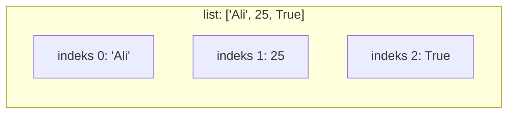
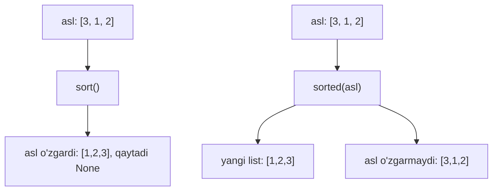
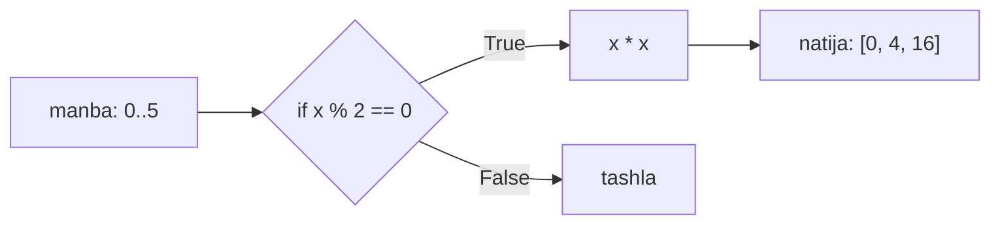
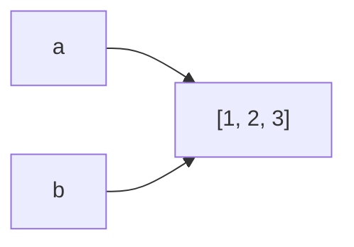

# 07. List

> Bu dars Go dasturchisi uchun. Go'da `[]int` slice bor. Python'ning `list` i
> unga o'xshaydi, lekin **bitta list ichida turli turlar** bo'la oladi va uni
> boshqaruvchi juda ko'p metod bor. Eng muhim tuzoq — `b = a` nusxa emas, alias.

```mermaid
mindmap
  root((list))
    Yaratish
      literal
      list()
    Kirish
      index
      slice
    Metodlar
      append
      extend
      insert
      remove
      pop
      sort
    Comprehension
      filter
      transform
      nested
    Tuzoq
      b = a alias
      copy kerak
```

---

## 1. list nima va nega kerak?

### Muammo / Hook

10 ta talabaning bahosini saqlash uchun `baho1`, `baho2`, ... `baho10` degan
10 ta o'zgaruvchi yozish mumkinmi? Mumkin, lekin dahshat. Ular ustidan loop
yurita olmaysan, sonini o'zgartira olmaysan. Kerak bo'lgani — **bitta idishda
tartibli to'plam**.

### Analogiya

`list` — **raqamlangan tokchali javon**. Har tokchada bitta narsa turadi,
tokchalar 0 dan boshlab raqamlangan. Xohlagan raqamli tokchaga to'g'ridan-to'g'ri
qo'l uzatasan, oxiriga yangi tokcha qo'shasan.

Analogiya chegarasi: oddiy javonda har tokchaga bir xil narsa qo'yasan.
Python `list` ida esa bir tokchada son, keyingisida string bo'lishi mumkin —
u **aralash** tur saqlaydi. Go slice esa faqat bitta tur saqlaydi.

### Sodda ta'rif

**list** — tartiblangan, o'zgartirib bo'ladigan (mutable), indeks orqali
kiriladigan elementlar to'plami.

### Diagramma



### Worked example — yaratish va kirish

```python
# --- 1-qadam: literal bilan yaratamiz (kvadrat qavs) ---
baholar = [90, 75, 60, 85]

# --- 2-qadam: indeks bilan element olamiz (0 dan boshlanadi) ---
print(baholar[0])     # birinchi
print(baholar[-1])    # oxirgi (manfiy indeks!)

# --- 3-qadam: elementni o'zgartiramiz (mutable) ---
baholar[1] = 80
print(baholar)
```

Output:

```
90
85
[90, 80, 60, 85]
```

> Muhim: **manfiy indeks** oxiridan sanaydi. `-1` — oxirgi, `-2` — oxiridan
> ikkinchi. Go'da bunday yo'q — Go'da `s[len(s)-1]` yozasan.

---

## 2. Slice — bo'lakni kesib olish

### Muammo / Hook

Ro'yxatning faqat 2-chidan 4-chigacha bo'lgan qismi kerak. Har birini qo'lda
olib, yangi ro'yxat yasash uzun. Bir amalda bo'lak kesib olish kerak.

### Analogiya

Slice — **non kesish**. Butun nondan (list) kerakli bo'lakni [boshidan oxirigacha]
kesib olasan. Asl non joyida qoladi — kesib olingani yangi bo'lak.

### Sodda ta'rif

**slice** — `list[start:stop:step]` ko'rinishida list ning bir qismidan
**yangi** list yasaydi; `stop` kirmaydi.

### Worked example

```python
# --- 1-qadam: manba list ---
sonlar = [0, 1, 2, 3, 4, 5, 6, 7]

# --- 2-qadam: start:stop — 2 dan 5 gacha (5 kirmaydi) ---
print(sonlar[2:5])

# --- 3-qadam: start bo'sh — boshidan; stop bo'sh — oxirigacha ---
print(sonlar[:3])
print(sonlar[5:])

# --- 4-qadam: step bilan — har ikkinchisi; teskari ---
print(sonlar[::2])
print(sonlar[::-1])
```

Output:

```
[2, 3, 4]
[0, 1, 2]
[5, 6, 7]
[0, 2, 4, 6]
[7, 6, 5, 4, 3, 2, 1, 0]
```

### Go bilan solishtirish

Go'da ham `s[2:5]` bor va `stop` kirmaydi — bir xil mantiq. Lekin muhim farq:

| Amal | Go slice | Python list slice |
|---|---|---|
| `s[2:5]` xotira | asl massiv bilan **bo'lishadi** | **yangi** list (nusxa) |
| Manfiy indeks | yo'q | bor (`s[-1]`) |
| `step` | yo'q | bor (`s[::2]`) |
| Teskari | qo'lda loop | `s[::-1]` |

> Katta farq: Go'da `b := a[2:5]` — `b` va `a` **bir xil xotirani** ko'rsatadi,
> birini o'zgartirsa ikkinchisi ham o'zgaradi. Python'da `b = a[2:5]` — `b`
> **yangi** list, mustaqil.

---

## 3. Asosiy metodlar

### Sodda ta'rif

Metodlar list ni **joyida** (in-place) o'zgartiradi. Mana eng ko'p ishlatiladiganlar:

| Metod | Nima qiladi | Misol |
|---|---|---|
| `append(x)` | oxiriga **bitta** element qo'shadi | `[1,2].append(3)` → `[1,2,3]` |
| `extend(it)` | boshqa iterable elementlarini qo'shadi | `[1].extend([2,3])` → `[1,2,3]` |
| `insert(i, x)` | `i` indeksga qo'yadi | `[1,3].insert(1,2)` → `[1,2,3]` |
| `remove(x)` | **birinchi** `x` ni o'chiradi | `[1,2,2].remove(2)` → `[1,2]` |
| `pop(i)` | `i` dagi elementni **olib qaytaradi** | `pop()` — oxirgisi |
| `index(x)` | `x` ning indeksini topadi | `[7,8].index(8)` → `1` |
| `count(x)` | `x` necha marta uchraganini | `[2,2,3].count(2)` → `2` |

### Worked example

```python
# --- 1-qadam: bo'sh list dan boshlab, oxiriga qo'shamiz ---
stack = []
stack.append(10)
stack.append(20)
print(stack)          # [10, 20]

# --- 2-qadam: bir nechta elementni birdan qo'shamiz (extend) ---
stack.extend([30, 40])
print(stack)          # [10, 20, 30, 40]

# --- 3-qadam: oxirgisini olib qaytaramiz (pop, stack kabi) ---
oxirgi = stack.pop()
print(oxirgi, stack)  # 40 [10, 20, 30]

# --- 4-qadam: qiymat bo'yicha o'chiramiz (remove) ---
stack.remove(20)
print(stack)          # [10, 30]
```

Output:

```
[10, 20]
[10, 20, 30, 40]
40 [10, 20, 30]
[10, 30]
```

### 🤔 O'ylab ko'r

`append([1, 2])` va `extend([1, 2])` — natijalari qanday farq qiladi?
Boshlang'ich `x = [0]` bo'lsin.

<details>
<summary>💡 Javobni ko'rish</summary>

```python
a = [0]; a.append([1, 2]); print(a)   # [0, [1, 2]]  — list ICHIGA list
b = [0]; b.extend([1, 2]); print(b)   # [0, 1, 2]    — elementlarni yoyadi
```

`append` argumentni **bitta element** sifatida qo'shadi (ichma-ich list hosil
bo'ladi). `extend` esa argument **ichidagi** elementlarni birma-bir qo'shadi.
</details>

### ⚠️ Keng tarqalgan xatolar

⚠️ **Xato:** `yangi = eski.append(5)` deb yozish.
- Nega noto'g'ri: `append` **hech narsa qaytarmaydi** (`None`), u faqat joyida
  o'zgartiradi. `yangi` `None` bo'lib qoladi.
- To'g'risi: `eski.append(5)` yoz, keyin `eski` ni ishlat.

---

## 4. sort() vs sorted() — tartiblash

### Muammo / Hook

Baholarni o'sish tartibida chiqarish kerak. Lekin ba'zan asl ro'yxatni
**buzmasdan** tartiblangan nusxa kerak. Python ikki xil vosita beradi — ularni
adashtirmaslik muhim.

### Analogiya

- `sort()` — **stoldagi kartalarni qayta terish**. Asl to'plam o'zgaradi.
- `sorted()` — **fotokopiya olib, keyin tartiblash**. Asl to'plam tegilmaydi,
  yangi nusxa qaytadi.

### Sodda ta'rif

- **list.sort()** — list ni **joyida** tartiblaydi, `None` qaytaradi.
- **sorted(iterable)** — **yangi** tartiblangan list qaytaradi, aslini o'zgartirmaydi.

### Diagramma



### Worked example — key parametri bilan

```python
# --- 1-qadam: sorted — asl tegilmaydi, yangi qaytadi ---
asl = [3, 1, 2]
yangi = sorted(asl)
print(asl, yangi)          # [3, 1, 2] [1, 2, 3]

# --- 2-qadam: sort — joyida, None qaytadi ---
asl.sort(reverse=True)
print(asl)                 # [3, 2, 1]

# --- 3-qadam: key — nima bo'yicha tartiblash (uzunlik bo'yicha) ---
sozlar = ["banan", "ol", "uzum"]
print(sorted(sozlar, key=len))   # ['ol', 'uzum', 'banan']
```

Output:

```
[3, 1, 2] [1, 2, 3]
[3, 2, 1]
['ol', 'uzum', 'banan']
```

`key=len` — har element uchun `len()` ni hisoblab, **shu qiymat bo'yicha**
tartiblaydi. `key` ga istagan funksiya berish mumkin (masalan `key=str.lower`).

### Go bilan solishtirish

Go'da `sort.Slice(s, func(i,j) bool { return s[i] < s[j] })` — har doim
joyida (`sort()` kabi). "Nusxa qaytaradigan" `sorted()` ekvivalenti yo'q,
avval nusxa olib, keyin `slices.Sort` chaqirasan.

---

## 5. list comprehension — ixcham yaratish

### Muammo / Hook

Har sonning kvadratini yangi ro'yxatga yig'ish kerak. Klassik yo'l — bo'sh list
yasab, loopda `append` qilish. 3 qator. Python buni **bitta qatorda**, o'qishga
oson qiladi.

### Analogiya

Comprehension — **konveyer + filtr**. Manba lentadan har element o'tadi, kerakli
shak1ga o'zgaradi (transform) va kerak bo'lsa keraksizlari chetga chiqariladi
(filter) — natijada tayyor mahsulotlar yangi qutiga tushadi.

### Sodda ta'rif

**list comprehension** — `[ifoda for element in iterable if shart]` ko'rinishida,
bitta ifodada yangi list yasaydi.

### Diagramma



### Worked example — bosqichma-bosqich

```python
# --- 1-qadam: eng oddiy — har elementni o'zgartirish (transform) ---
kvadratlar = [x * x for x in range(5)]
print(kvadratlar)          # [0, 1, 4, 9, 16]

# --- 2-qadam: filter qo'shamiz — faqat juftlar ---
juft_kvadrat = [x * x for x in range(6) if x % 2 == 0]
print(juft_kvadrat)        # [0, 4, 16]

# --- 3-qadam: nested — matritsani tekislash (flatten) ---
matritsa = [[1, 2], [3, 4], [5, 6]]
tekis = [son for qator in matritsa for son in qator]
print(tekis)               # [1, 2, 3, 4, 5, 6]
```

Output:

```
[0, 1, 4, 9, 16]
[0, 4, 16]
[1, 2, 3, 4, 5, 6]
```

Nested comprehension o'qish tartibi: `for qator in matritsa` (tashqi),
keyin `for son in qator` (ichki) — xuddi ichma-ich loop yozgandek, chapdan
o'ngga.

### 🤔 O'ylab ko'r

Quyidagi ikki kod bir xil natija beradimi?
```python
a = [x for x in range(10) if x % 2 == 0]
b = list(range(0, 10, 2))
```

<details>
<summary>💡 Javobni ko'rish</summary>

Ha, ikkalasi ham `[0, 2, 4, 6, 8]` beradi. Lekin `b` (range bilan) tezroq va
o'qishga aniqroq — oddiy arifmetik ketma-ketlik uchun `range` afzal.
Comprehension esa murakkab transform yoki filter kerak bo'lganda kuchli.
</details>

### ⚠️ Keng tarqalgan xatolar

⚠️ **Xato:** juda murakkab comprehension yozish (3-4 `for`, ichma-ich `if`).
- Nega noto'g'ri: o'qib bo'lmaydi, xatoni topish qiyin.
- To'g'risi: 2 dan ortiq bosqich bo'lsa, oddiy `for` loop yoz.

---

## 6. Copy tuzog'i — b = a nusxa EMAS!

### Muammo / Hook

Bu Python'da **eng ko'p adashtiradigan** narsalardan biri. `b = a` yozib,
"endi `b` alohida nusxa" deb o'ylaysan, keyin `b` ni o'zgartirsang — `a` ham
o'zgarib qolganini ko'rib hayron bo'lasan.

### Analogiya

`b = a` — bu **bir uyga ikkinchi eshik osish** kabi. Ikkala eshik ham **bir**
uyga (bir list ga) olib boradi. Qaysi eshikdan kirib mebelni surtsang, ikkinchi
eshikdan kirganda ham surilgan mebelni ko'rasan — uy bitta.

Analogiya chegarasi: haqiqiy nusxa uchun **yangi uy qurish** kerak — bu
`a.copy()` yoki `a[:]`.

### Sodda ta'rif

**Alias** — ikki o'zgaruvchi **bir xil** list obyektiga ishora qiladi; birini
o'zgartirsang ikkinchisida ham ko'rinadi.

### Notional machine — xotirada nima bor?



`b = a` faqat **ishorani** (reference) nusxalaydi, listni emas. Ikkala nom ham
xotiradagi **bir** obyektni ko'rsatadi. Go'da bu slice header (ptr, len, cap)
ni nusxalashga o'xshaydi — ikkalasi bir array'ni ko'rsatadi.

### Worked example

```python
# --- 1-qadam: b = a — alias, yangi list EMAS ---
a = [1, 2, 3]
b = a
b.append(99)
print("a:", a)            # a: [1, 2, 3, 99]  ← a ham o'zgardi!
print("a is b:", a is b)  # True — bir obyekt

# --- 2-qadam: haqiqiy nusxa — copy() yoki [:] ---
c = a.copy()              # yoki c = a[:]
c.append(1000)
print("a:", a)            # a: [1, 2, 3, 99]  ← a tegilmadi
print("a is c:", a is c)  # False — boshqa obyekt
```

Output:

```
a: [1, 2, 3, 99]
a is b: True
a: [1, 2, 3, 99]
a is c: False
```

> Oltin qoida: nusxa kerak bo'lsa **hech qachon `b = a` deb o'ylama** —
> `a.copy()`, `a[:]` yoki `list(a)` ishlat. `is` operatori "bir obyektmi?"
> ni tekshiradi, `==` esa "qiymatlari tengmi?" ni.

### ⚠️ Keng tarqalgan xatolar

⚠️ **Xato:** ichma-ich list ni `copy()` bilan nusxalash — **shallow copy**.
- Nega noto'g'ri: `a.copy()` faqat tashqi listni nusxalaydi, ichki listlar
  hali ham **bo'lishiladi**.
- To'g'risi: chuqur nusxa uchun `import copy; copy.deepcopy(a)`.

---

## 7. in operator — a'zolikni tekshirish

### Sodda ta'rif

**in** — element list ichida bor-yo'qligini `True/False` bilan qaytaradi.

### Worked example

```python
# --- 1-qadam: element bormi? ---
mevalar = ["olma", "banan", "uzum"]
print("banan" in mevalar)      # True
print("shaftoli" in mevalar)   # False

# --- 2-qadam: yo'qligini tekshirish — not in ---
if "shaftoli" not in mevalar:
    print("Ro'yxatda yo'q")
```

Output:

```
True
False
Ro'yxatda yo'q
```

> Diqqat: list da `in` **chapdan o'ngga qidiradi** — O(n). Katta to'plamda tez
> qidiruv kerak bo'lsa `set` ishlat (keyingi dars). Go'da esa `in` yo'q,
> loop yozasan yoki `map`/`slices.Contains` ishlatasan.

---

## list vs Go slice — umumiy jadval

| Xususiyat | Go slice | Python list |
|---|---|---|
| E'lon | `s := []int{1, 2}` | `s = [1, 2]` |
| Turlar | faqat bitta tur | aralash mumkin |
| Oxiriga qo'shish | `append(s, x)` (qayta biriktir) | `s.append(x)` (joyida) |
| Uzunlik | `len(s)` | `len(s)` |
| Slice `s[1:3]` | xotira **bo'lishadi** | **yangi** list |
| Manfiy indeks | yo'q | bor (`s[-1]`) |
| `b = a` | header nusxa, array bir | ishorani nusxa, list bir |
| Nusxa | `copy(dst, src)` | `a.copy()`, `a[:]` |
| Element bormi | `slices.Contains` | `x in s` |
| Tartiblash | `slices.Sort(s)` | `s.sort()` / `sorted(s)` |

---

## Xulosa

- **list** — tartibli, mutable, aralash turli to'plam; `[...]` bilan yaratiladi.
- **Indeks** 0 dan; **manfiy indeks** oxiridan sanaydi (`-1` — oxirgi).
- **Slice** `[start:stop:step]` — yangi list qaytaradi, `stop` kirmaydi.
- `append` bitta element, `extend` iterable elementlarini qo'shadi.
- `sort()` joyida (None qaytaradi), `sorted()` yangi list qaytaradi; `key` bilan.
- **list comprehension** — `[ifoda for x in it if shart]`, transform + filter.
- **`b = a` — alias**, nusxa emas! Nusxa uchun `copy()` / `[:]` / `list(a)`.
- `in` — a'zolik, list da O(n) qidiradi.

## 🧠 Eslab qol

- `list[-1]` — oxirgi element (manfiy indeks).
- Slice **doim yangi** list qaytaradi (Go'dan farqli).
- `append` `None` qaytaradi — `x = a.append(y)` yozma.
- `sort()` joyida, `sorted()` nusxa.
- `b = a` nusxa emas; birini o'zgartirsang ikkinchisi ham o'zgaradi.

## ✅ O'z-o'zini tekshir (retrieval practice)

**1.** `a = [1,2,3]; b = a; b.append(4)` dan keyin `a` nimaga teng va nega?

<details>
<summary>Javob</summary>

`a` `[1, 2, 3, 4]` ga teng. Chunki `b = a` alias — `a` va `b` **bir xil**
listni ko'rsatadi. `b` ga qo'shish `a` da ham ko'rinadi. Nusxa uchun
`b = a.copy()` kerak edi.
</details>

**2.** `sort()` va `sorted()` orasidagi ikkita asosiy farq nima?

<details>
<summary>Javob</summary>

1) `sort()` list metodi, joyida o'zgartiradi va `None` qaytaradi;
`sorted()` funksiya, **yangi** list qaytaradi, aslini tegmaydi.
2) `sorted()` istalgan iterable ni qabul qiladi, `sort()` faqat list da.
</details>

**3.** `[x*2 for x in range(5) if x > 2]` natijasi nima?

<details>
<summary>Javob</summary>

`[6, 8]`. `range(5)` → 0,1,2,3,4. Filter `x > 2` faqat 3 va 4 ni qoldiradi.
Transform `x*2`: 3→6, 4→8. Natija `[6, 8]`.
</details>

**4.** `a = [0]; a.append([1, 2])` dan keyin `len(a)` nimaga teng?

<details>
<summary>Javob</summary>

`2`. `append` argumentni **bitta** element sifatida qo'shadi, shuning uchun
`a = [0, [1, 2]]` — ichma-ich list, uzunligi 2. `extend` bo'lganda `[0, 1, 2]`,
uzunligi 3 bo'lardi.
</details>

**5.** Python slice `a[1:3]` va Go `a[1:3]` xotira jihatidan qanday farq qiladi?

<details>
<summary>Javob</summary>

Python: `a[1:3]` **yangi, mustaqil** list yasaydi — o'zgartirish aslga ta'sir
qilmaydi. Go: `a[1:3]` asl array bilan **xotirani bo'lishadi** — o'zgartirish
aslda ham ko'rinadi.
</details>

## 🛠 Amaliyot

**1. Oson (Modify).** `baholar = [90, 75, 60, 85]` ni oling. `sorted` bilan
kamayish tartibida chiqaring (asl ro'yxat o'zgarmasin), keyin asl ro'yxatni
ham chop eting — o'zgarmaganini ko'rsating.

<details>
<summary>Hint</summary>

`print(sorted(baholar, reverse=True))` keyin `print(baholar)`. `sorted`
aslini tegmaydi, shuning uchun ikkinchisi asl tartibda chiqadi.
</details>

**2. O'rta (faded example).** Skeletni to'ldir — ro'yxatdan takrorlarni olib
tashla (tartibni saqlab):
```python
manba = [3, 1, 3, 2, 1, 4]
korilgan = []
natija = []
for x in manba:
    if x not in korilgan:
        # TODO: x ni ikkala listga ham qo'sh
        pass
print(natija)   # [3, 1, 2, 4]
```

<details>
<summary>Hint</summary>

`korilgan.append(x)` va `natija.append(x)`. `x not in korilgan` allaqachon
ko'rilganini o'tkazib yuboradi. (Tezroq usul `set` bilan — keyingi dars.)
</details>

**3. Qiyin (Make).** Noldan yoz: `matn = "salom dunyo salom python dunyo salom"`.
Har so'z necha marta uchraganini hisobla va **eng ko'p** uchragan so'zni chop et.
`split()`, list comprehension va `count()` ishlat.

<details>
<summary>Hint</summary>

`sozlar = matn.split()`. Har xil so'z uchun `sozlar.count(soz)` ni hisobla.
`max(sozlar, key=sozlar.count)` — `count` ni key qilib eng ko'p uchraganini
topadi.
</details>

## 🔁 Takrorlash

- **Bog'liq oldingi mavzular:** 06 — Loops (`for x in list`, comprehension loop
  asosida). 03 — String (string ham slice qo'llaydi, lekin immutable). 02 —
  turlar (`is` va `==` farqi, obyekt identifikatsiyasi).
- **Takrorlash jadvali:**
  - Ertaga → "O'z-o'zini tekshir" 1 va 5-savolga qayt (alias tuzog'i, slice xotirasi).
  - 3 kundan keyin → list comprehension misollarini yoddan yozib ko'r.
  - 1 haftadan keyin → 3-topshiriqni hintga qaramasdan qayta yoz.
- **Feynman testi:** Bir do'stingga nega `b = a` list ni nusxalamasligini va
  Go slice header bilan qanday o'xshashligini kod yozmasdan 3 jumlada tushuntir.
