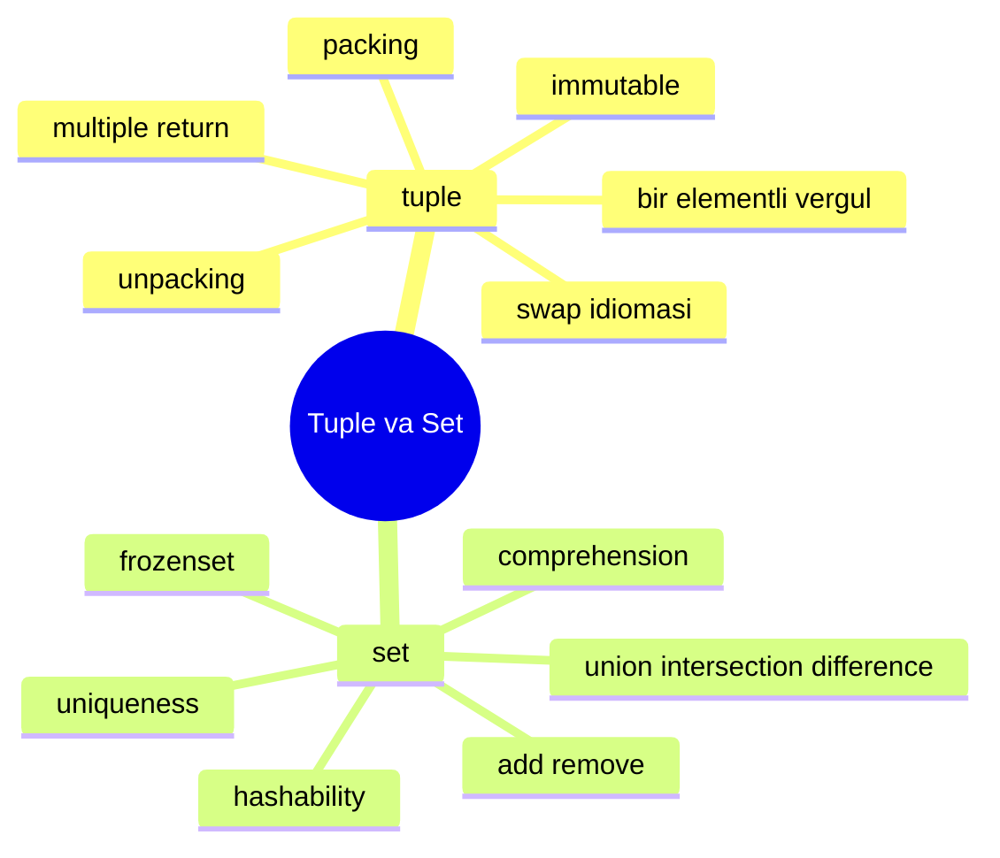
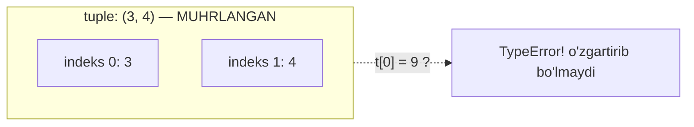
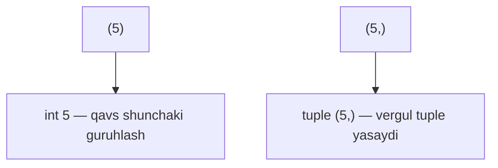
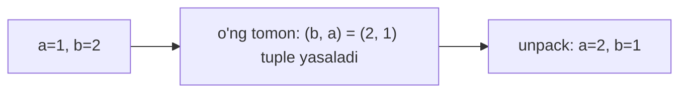
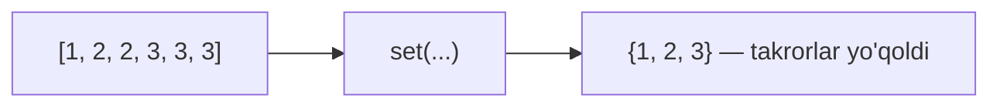
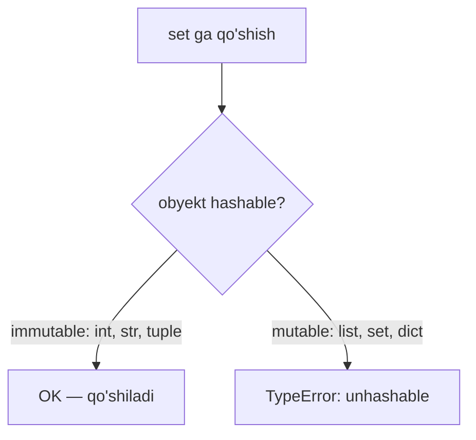

# 08. Tuple va Set

> Bu dars Go dasturchisi uchun. Go'da bir funksiyadan `return a, b` qilding —
> Python'da buni **tuple** ta'minlaydi. Go'da "unique elementlar" uchun
> `map[T]struct{}` yozding — Python'da bu tabiiy tur: **set**.



---

# QISM 1 — Tuple

## 1. Tuple nima va nega kerak?

### Muammo / Hook

Koordinatani `(x, y)` saqlamoqchisan. `list` ishlatsang, kimdir tasodifan
`nuqta.append(5)` qilib uni buzishi mumkin — koordinata 3 elementli bo'lib
qolsa mantiq buziladi. Kerak bo'lgani — **o'zgarmaydigan**, ishonchli to'plam.

### Analogiya

`tuple` — **muhrlangan konvert**. Ichiga narsa solib, muhrlab qo'yasan. Endi
uni **o'zgartirib bo'lmaydi** — faqat o'qiysan. `list` esa qopqog'i ochiq quti,
xohlaganingcha qo'shib-olib turasan.

Analogiya chegarasi: konvertni yirtib yangisini yozish mumkin — ya'ni yangi
tuple yasay olasan, lekin **mavjudini** o'zgartira olmaysan.

### Sodda ta'rif

**tuple** — tartiblangan, **o'zgarmas (immutable)** elementlar to'plami;
odatda `( )` bilan yoziladi.

### Diagramma



### Worked example

```python
# --- 1-qadam: tuple yaratamiz (yumaloq qavs) ---
nuqta = (3, 4)

# --- 2-qadam: o'qish list kabi — indeks bilan ---
print(nuqta[0], nuqta[1])   # 3 4

# --- 3-qadam: o'zgartirishga urinsak — XATO ---
try:
    nuqta[0] = 9
except TypeError as e:
    print("Xato:", e)
```

Output:

```
3 4
Xato: 'tuple' object does not support item assignment
```

### Go bilan solishtirish

Go'da bevosita "tuple" turi yo'q, lekin `struct` yoki funksiyaning ko'p qiymatli
qaytishi shu rolni bajaradi:
```go
// Go — struct immutable emas, lekin funksiyaning multiple return tuple kabi
func minmax(a []int) (int, int) { return a[0], a[len(a)-1] }
lo, hi := minmax(nums)   // Python: lo, hi = minmax(nums)
```

---

## 2. Packing va Unpacking

### Muammo / Hook

Funksiya bir vaqtda `min` va `max` ni qaytarishi kerak. Ularni bitta narsaga
"o'rab" (pack) qaytarasan, chaqirgan tomon esa ikki o'zgaruvchiga "yozib"
(unpack) oladi. Bu Python'ning eng nafis idiomalaridan biri.

### Analogiya

Packing/unpacking — **chamadon yig'ish va ochish**. Narsalarni bitta chamadonga
joylaysan (pack), boradigan joyingda ochib, har birini o'z joyiga qo'yasan (unpack).

### Sodda ta'rif

- **Packing** — bir nechta qiymatni bitta tuple ga o'rash: `t = 1, 2, 3`.
- **Unpacking** — tuple ni bir nechta o'zgaruvchiga ochish: `a, b, c = t`.

### Worked example

```python
# --- 1-qadam: packing — qavssiz ham tuple bo'ladi! ---
nuqta = 3, 4
print(type(nuqta))          # <class 'tuple'>

# --- 2-qadam: unpacking — o'zgaruvchilar soni mos kelishi kerak ---
x, y = nuqta
print(x, y)                 # 3 4

# --- 3-qadam: * bilan "qolganini yig'ish" (star unpacking) ---
birinchi, *qolgan = [10, 20, 30, 40]
print(birinchi, qolgan)     # 10 [20, 30, 40]
```

Output:

```
<class 'tuple'>
3 4
10 [20, 30, 40]
```

> Diqqat: tuple ni **qavs emas, vergul yasaydi**. `3, 4` — bu allaqachon tuple.
> Qavs faqat o'qishni osonlashtiradi va ba'zi joylarda ajratish uchun kerak.

### 🤔 O'ylab ko'r

`a, b = [1, 2, 3]` yozsak nima bo'ladi?

<details>
<summary>💡 Javobni ko'rish</summary>

`ValueError: too many values to unpack (expected 2)`. Unpacking'da chap va o'ng
tomon **elementlar soni teng** bo'lishi shart. 3 element 2 o'zgaruvchiga sig'maydi.
Yechim: `a, b, c = [1, 2, 3]` yoki `a, *b = [1, 2, 3]` (b → `[2, 3]`).
</details>

---

## 3. Bir elementli tuple — vergul tuzog'i

### Muammo / Hook

Bitta elementli tuple yasamoqchisan: `t = (5)`. Ammo bu **tuple emas** — bu
oddiy `int`! Bu Python'ning mashhur tuzoqlaridan biri.

### Sodda ta'rif

Bir elementli tuple uchun **vergul majburiy**: `t = (5,)` yoki `t = 5,`.

### Diagramma



### Worked example

```python
# --- 1-qadam: qavs bor, lekin vergul yo'q — bu tuple EMAS ---
soxta = (5)
print(type(soxta))    # <class 'int'>

# --- 2-qadam: vergul qo'shsak — endi tuple ---
haqiqiy = (5,)
print(type(haqiqiy))  # <class 'tuple'>

# --- 3-qadam: qavssiz vergul ham ishlaydi ---
yana = 5,
print(type(yana))     # <class 'tuple'>
```

Output:

```
<class 'int'>
<class 'tuple'>
<class 'tuple'>
```

### ⚠️ Keng tarqalgan xatolar

⚠️ **Xato:** `return (natija)` deb bitta qiymatni "tuple qilib" qaytarganga ishonch.
- Nega noto'g'ri: vergulsiz qavs tuple yasamaydi — oddiy qiymat qaytadi.
- To'g'risi: bir elementli tuple kerak bo'lsa `return (natija,)`.

---

## 4. Swap idiomasi va multiple return

### Muammo / Hook

Ikki o'zgaruvchining qiymatini almashtirish kerak. Ko'p tillarda uchinchi
vaqtinchalik o'zgaruvchi kerak: `tmp = a; a = b; b = tmp`. Python bitta qatorda
qiladi.

### Analogiya

Swap — **ikki qo'ldagi narsani bir zumda almashtirish**. Python ikkalasini
avval "havoga otadi" (o'ng tomonni tuple ga o'raydi), keyin joyiga tushiradi.

### Sodda ta'rif

`a, b = b, a` — o'ng tomon avval tuple `(b, a)` ga o'raladi, keyin unpack qilinib
chap tomonga joylanadi.

### Notional machine — nima bo'ladi?



Muhim: o'ng tomon **butunlay** hisoblanib, tuple ga o'raladi, **keyin** chapga
tarqatiladi. Shu sabab vaqtinchalik o'zgaruvchi kerak emas.

### Worked example — swap va multiple return

```python
# --- 1-qadam: swap — bir qatorda, tmp kerak emas ---
a, b = 1, 2
a, b = b, a
print(a, b)                 # 2 1

# --- 2-qadam: funksiyadan bir nechta qiymat qaytarish ---
def minmax(sonlar):
    return min(sonlar), max(sonlar)   # tuple qaytadi

# --- 3-qadam: qaytgan tuple ni ikki o'zgaruvchiga unpack qilamiz ---
kichik, katta = minmax([4, 1, 7, 3])
print(kichik, katta)        # 1 7
```

Output:

```
2 1
1 7
```

### Go bilan solishtirish

Go'da multiple return tilda o'rnatilgan, lekin **swap** uchun ham Python idiomasi
bor:
```go
// Go — multiple return
func minmax(s []int) (int, int) { return slices.Min(s), slices.Max(s) }
lo, hi := minmax(nums)
a, b = b, a   // Go'da ham swap bir qatorda ishlaydi!
```
Farq: Python'da bu **tuple** mexanizmi orqali ishlaydi, Go'da til darajasidagi
maxsus sintaksis.

---

# QISM 2 — Set

## 5. Set nima va nega kerak?

### Muammo / Hook

Bir necha ming foydalanuvchi ID ichida **noyob** (takrorlanmagan) larni topish
kerak. `list` bilan har yangi element uchun "bu avval bor edimi?" deb butun
listni qidirasan — sekin (O(n)). Kerak bo'lgani — takrorni **o'zi rad qiladigan**,
tez tekshiradigan to'plam.

### Analogiya

`set` — **mehmonlar ro'yxatidagi ismlar**. Bir ismni ikki marta yozib bo'lmaydi —
ro'yxat o'zi rad qiladi. Va "Ali bormi?" degan savolga bir zumda javob beradi,
butun ro'yxatni o'qib chiqmaydi.

Analogiya chegarasi: mehmonlar ro'yxati tartibli bo'lishi mumkin. `set` esa
**tartibsiz** — elementlar qanday saqlanishi kafolatlanmagan.

### Sodda ta'rif

**set** — takrorlanmaydigan (unique), tartibsiz elementlar to'plami; tez
a'zolik tekshiruvi (O(1)) beradi.

### Diagramma



### Worked example

```python
# --- 1-qadam: list dan takrorlarni olib tashlash uchun set ---
idlar = [1, 2, 2, 3, 3, 3]
noyob = set(idlar)
print(noyob)                # {1, 2, 3}

# --- 2-qadam: a'zolikni tez tekshirish (O(1)) ---
print(2 in noyob)           # True
print(9 in noyob)           # False

# --- 3-qadam: bo'sh set — set(), {} EMAS (u dict) ---
bosh = set()
print(type(bosh))           # <class 'set'>
```

Output:

```
{1, 2, 3}
True
False
<class 'set'>
```

> Muhim tuzoq: bo'sh set uchun `set()` yoz. `{}` — bu **bo'sh dict**, set emas!

### Go bilan solishtirish

Go'da alohida set turi yo'q — odatda `map[T]struct{}` ishlatiladi:
```go
// Go — set o'rniga map
noyob := map[int]struct{}{}
noyob[2] = struct{}{}
_, bor := noyob[2]   // Python: 2 in noyob
```
Python'da set — tilning bir qismi, sintaksisi ancha toza.

---

## 6. add, remove va asosiy amallar

### Sodda ta'rif

Set mutable — element qo'shish/olib tashlash mumkin:

| Metod | Nima qiladi |
|---|---|
| `add(x)` | element qo'shadi (bor bo'lsa hech narsa) |
| `remove(x)` | o'chiradi; yo'q bo'lsa **KeyError** |
| `discard(x)` | o'chiradi; yo'q bo'lsa **xato bermaydi** |
| `pop()` | tasodifiy element olib qaytaradi |

### Worked example

```python
# --- 1-qadam: bo'sh set ga qo'shamiz ---
s = set()
s.add("olma")
s.add("banan")
s.add("olma")           # takror — e'tiborsiz qoldiriladi
print(s)                # {'olma', 'banan'}

# --- 2-qadam: xavfsiz o'chirish — discard xato bermaydi ---
s.discard("uzum")       # yo'q, lekin xato yo'q
s.remove("olma")
print(s)                # {'banan'}
```

Output:

```
{'olma', 'banan'}
{'banan'}
```

Tartib kafolatlanmagani uchun `{'olma', 'banan'}` boshqa tartibda ham chiqishi
mumkin — bu normal.

### ⚠️ Keng tarqalgan xatolar

⚠️ **Xato:** yo'q elementni `remove` bilan o'chirish.
- Nega noto'g'ri: `remove` yo'q elementda `KeyError` beradi, dastur to'xtaydi.
- To'g'risi: mavjudligiga ishonch bo'lmasa `discard` ishlat.

---

## 7. union, intersection, difference — to'plam amallari

### Muammo / Hook

Ikki kursda qatnashadigan talabalar bor. "Ikkalasida ham bor kimlar?",
"Faqat birinchisida kimlar?", "Umuman qatnashganlar?" — bu savollarga set
amallari bir amalda javob beradi.

### Analogiya

Bu amallar — **Venn diagrammasi**. Ikki aylananing kesishuvi, birlashmasi,
ayirmasi — matematikadagi to'plam nazariyasining aynan o'zi.

### Sodda ta'rif

- **union** (`|`) — ikkala to'plamdagi **barcha** elementlar.
- **intersection** (`&`) — **ikkalasida ham** bor elementlar.
- **difference** (`-`) — birinchida bor, ikkinchida **yo'q**.

### Diagramma

```mermaid
flowchart TD
    subgraph A["A = {1,2,3}"] end
    subgraph B["B = {3,4,5}"] end
    A --> U["A | B = {1,2,3,4,5}"]
    B --> U
    A --> I["A & B = {3}"]
    B --> I
    A --> D["A - B = {1,2}"]
    B --> D
```

### Worked example

```python
# --- 1-qadam: ikki to'plam ---
a = {1, 2, 3}
b = {3, 4, 5}

# --- 2-qadam: union — hammasi (operator yoki metod) ---
print(a | b)            # {1, 2, 3, 4, 5}
print(a.union(b))       # bir xil natija

# --- 3-qadam: intersection — umumiy ---
print(a & b)            # {3}

# --- 4-qadam: difference — faqat a da bor ---
print(a - b)            # {1, 2}

# --- 5-qadam: symmetric difference — faqat bittasida (ikkalasida emas) ---
print(a ^ b)            # {1, 2, 4, 5}
```

Output:

```
{1, 2, 3, 4, 5}
{1, 2, 3, 4, 5}
{3}
{1, 2}
{1, 2, 4, 5}
```

### 🤔 O'ylab ko'r

`a = {1, 2, 3}` va `b = {1, 2, 3, 4}`. `a - b` va `b - a` bir xil natija beradimi?

<details>
<summary>💡 Javobni ko'rish</summary>

Yo'q! `a - b` = `set()` (bo'sh, chunki `a` ning hammasi `b` da bor).
`b - a` = `{4}` (`b` da bor, `a` da yo'q). Difference **yo'nalishga bog'liq** —
`a - b` va `b - a` har xil. (Union va intersection esa simmetrik.)
</details>

---

## 8. set comprehension va frozenset

### Sodda ta'rif

- **set comprehension** — `{ifoda for x in it}`, list comprehension kabi, lekin
  natija set (takrorsiz).
- **frozenset** — **o'zgarmas** (immutable) set; qo'shib/olib bo'lmaydi.

### Worked example

```python
# --- 1-qadam: set comprehension — takror avtomatik yo'qoladi ---
sonlar = [1, -1, 2, -2, 3]
kvadratlar = {x * x for x in sonlar}
print(kvadratlar)           # {1, 4, 9}  — 1 va 4 bir marta

# --- 2-qadam: frozenset — o'zgarmas set ---
muzlagan = frozenset([1, 2, 3])
print(muzlagan)             # frozenset({1, 2, 3})

# --- 3-qadam: frozenset ni o'zgartirib bo'lmaydi ---
try:
    muzlagan.add(4)
except AttributeError as e:
    print("Xato:", e)
```

Output:

```
{1, 4, 9}
frozenset({1, 2, 3})
Xato: 'frozenset' object has no attribute 'add'
```

Diqqat: `1` va `-1` ning kvadrati bir xil (`1`), shuning uchun set da bir marta
turadi — bu set comprehension'ning takrorni yo'qotish xususiyati.

---

## 9. Hashability — nega list set ga kirmaydi?

### Muammo / Hook

`{[1, 2], [3, 4]}` yozsang, `TypeError: unhashable type: 'list'` xatosi
chiqadi. Nega tuple set ga kiradi-yu, list kirmaydi? Buni tushunish set va
dict ichki ishlashini ochib beradi.

### Analogiya

Hash — **buyumning barmoq izi**. Set har elementni barmoq izidan tanib, kerakli
"tokcha" ga qo'yadi va tez topadi. Ammo barmoq izi **o'zgarmas** bo'lishi kerak —
list o'zgaruvchan, shuning uchun uning izi ishonchsiz.

### Sodda ta'rif

**Hashable** — o'zgarmas va hash qiymati bor obyekt; faqat hashable obyektlar
set elementi yoki dict kaliti bo'la oladi.

### Diagramma



### Worked example

```python
# --- 1-qadam: tuple hashable — set ga kiradi ---
nuqtalar = {(0, 0), (1, 2), (1, 2)}   # takror tuple yo'qoladi
print(nuqtalar)             # {(0, 0), (1, 2)}

# --- 2-qadam: list unhashable — set ga kirmaydi ---
try:
    yomon = {[1, 2], [3, 4]}
except TypeError as e:
    print("Xato:", e)
```

Output:

```
{(0, 0), (1, 2)}
Xato: unhashable type: 'list'
```

> Oltin qoida: **o'zgarmas** (int, str, tuple, frozenset) — hashable, set/dict
> kaliti bo'la oladi. **O'zgaruvchan** (list, set, dict) — unhashable.
> Shuning uchun `frozenset` bor: uni boshqa set ichiga solish mumkin.

### Go bilan solishtirish

Go'da ham xuddi shu tamoyil: `map` kaliti **comparable** bo'lishi kerak.
Slice (`[]int`) map kaliti bo'la olmaydi (compile xatosi), array (`[2]int`) esa
bo'la oladi — Python'dagi list va tuple farqiga to'la mos keladi.

---

## Tuple vs List vs Set — umumiy jadval

| Xususiyat | tuple | list | set |
|---|---|---|---|
| Sintaksis | `(1, 2)` | `[1, 2]` | `{1, 2}` |
| Tartibli | ha | ha | yo'q |
| O'zgaruvchan (mutable) | yo'q | ha | ha |
| Takror mumkin | ha | ha | yo'q |
| Indeks bilan kirish | ha | ha | yo'q |
| Hashable (kalit bo'la oladi) | ha (agar ichi ham) | yo'q | yo'q (`frozenset` ha) |
| `in` tezligi | O(n) | O(n) | O(1) |

---

## Xulosa

- **tuple** — o'zgarmas (immutable), tartibli to'plam; `( )` yoki shunchaki vergul.
- Tuple ni **vergul yasaydi**, qavs emas: bir elementli tuple `(5,)`.
- **Packing/unpacking** — `a, b = b, a` swap, `lo, hi = minmax(x)` multiple return.
- Unpacking'da chap va o'ng tomon element soni teng bo'lishi kerak (`*` bilan yig'ish mumkin).
- **set** — noyob, tartibsiz to'plam; `in` tez (O(1)), takrorni o'zi rad qiladi.
- Bo'sh set — `set()`, `{}` emas (u dict).
- Set amallari: `|` union, `&` intersection, `-` difference, `^` symmetric.
- **Hashable** (o'zgarmas) obyektlargina set/dict ga kiradi; list unhashable, `frozenset` esa hashable.

## 🧠 Eslab qol

- Tuple immutable, list mutable; tuple xavfsizroq va hashable.
- Bir elementli tuple: vergul majburiy — `(5,)`.
- `a, b = b, a` — vaqtinchalik o'zgaruvchisiz swap.
- set — takror yo'q, `in` O(1); bo'sh set `set()`.
- list set ga kirmaydi (unhashable); tuple va frozenset kiradi.

## ✅ O'z-o'zini tekshir (retrieval practice)

**1.** `t = (5)` va `t = (5,)` orasidagi farq nima?

<details>
<summary>Javob</summary>

`(5)` — oddiy `int` 5, qavs faqat guruhlash. `(5,)` — bitta elementli **tuple**.
Tuple ni vergul yasaydi, qavs emas. `type((5))` → int, `type((5,))` → tuple.
</details>

**2.** `a = {1, 2, 3}`, `b = {2, 3, 4}`. `a - b` va `a & b` natijalari nima?

<details>
<summary>Javob</summary>

`a - b` = `{1}` (a da bor, b da yo'q). `a & b` = `{2, 3}` (ikkalasida ham bor).
Difference yo'nalishga bog'liq, intersection esa simmetrik.
</details>

**3.** Nega `{[1, 2]}` xato beradi, `{(1, 2)}` esa ishlaydi?

<details>
<summary>Javob</summary>

`list` o'zgaruvchan (mutable), shuning uchun **unhashable** — set/dict ga
kira olmaydi. `tuple` o'zgarmas (immutable), **hashable** — kira oladi.
Set elementlarini hash orqali saqlaydi, hash esa o'zgarmaslikni talab qiladi.
</details>

**4.** `a, b, c = [1, 2]` yozsak nima bo'ladi?

<details>
<summary>Javob</summary>

`ValueError: not enough values to unpack (expected 3, got 2)`. Unpacking'da
o'zgaruvchilar soni (3) va qiymatlar soni (2) teng bo'lishi kerak.
</details>

**5.** Bo'sh set qanday yaratiladi va nega `{}` ishlamaydi?

<details>
<summary>Javob</summary>

`set()` bilan. `{}` — bo'sh **dict** yasaydi, set emas (tarixiy sabab: dict
oldinroq shu sintaksisni egallagan). Elementli set esa `{1, 2}` bilan bo'ladi.
</details>

## 🛠 Amaliyot

**1. Oson (Modify).** `harflar = "salom dunyo"` dan **noyob** harflarni (probelsiz)
toping va sonini chop eting.

<details>
<summary>Hint</summary>

`noyob = set(harflar) - {" "}` yoki `set(harflar.replace(" ", ""))`. Keyin
`len(noyob)`. Set string ustidan ham ishlaydi — string iterable.
</details>

**2. O'rta (faded example).** Skeletni to'ldir — ikki ro'yxatdagi umumiy va faqat
birinchisidagi elementlarni top:
```python
kurs_a = ["Ali", "Vali", "Guli", "Hasan"]
kurs_b = ["Vali", "Hasan", "Nodir"]
sa = set(kurs_a)
sb = set(kurs_b)
# TODO: ikkalasida ham bor talabalar (intersection)
umumiy = None
# TODO: faqat kurs_a dagi talabalar (difference)
faqat_a = None
print(umumiy, faqat_a)
```

<details>
<summary>Hint</summary>

`umumiy = sa & sb` → `{'Vali', 'Hasan'}`. `faqat_a = sa - sb` → `{'Ali', 'Guli'}`.
`|` union, `&` intersection, `-` difference, `^` symmetric difference.
</details>

**3. Qiyin (Make).** Noldan yoz: `parse_koordinatalar(matn)` funksiyasi.
`matn = "1,2 3,4 1,2 5,6"` (probel bilan ajratilgan "x,y" juftliklar). Har juftni
tuple ga aylantirib, **noyob** nuqtalar set ini qaytarsin. Tuple hashable
ekanidan foydalanib takrorni yo'qot.

<details>
<summary>Hint</summary>

```python
def parse_koordinatalar(matn):
    natija = set()
    for juft in matn.split():
        x, y = juft.split(",")
        natija.add((int(x), int(y)))   # tuple — hashable, set ga kiradi
    return natija
```
`"1,2"` ikki marta bo'lsa ham set da bir marta turadi.
</details>

## 🔁 Takrorlash

- **Bog'liq oldingi mavzular:** 07 — List (tuple va list farqi, mutability,
  slice va indeks tuple da ham ishlaydi). 06 — Loops (set va tuple ustidan
  `for` bilan yurish). 02 — turlar va `is` operatori.
- **Takrorlash jadvali:**
  - Ertaga → "O'z-o'zini tekshir" 1 va 3-savolga qayt (bir elementli tuple, hashability).
  - 3 kundan keyin → set amallari (`| & - ^`) ni Venn diagrammasi bilan yodda tikla.
  - 1 haftadan keyin → `parse_koordinatalar` topshirig'ini hintga qaramasdan yoz.
- **Feynman testi:** Bir do'stingga nega tuple set ga kiradi-yu list kirmasligini
  ("hashability") kod yozmasdan 3 jumlada tushuntir. Barmoq izi analogiyasidan foydalan.
