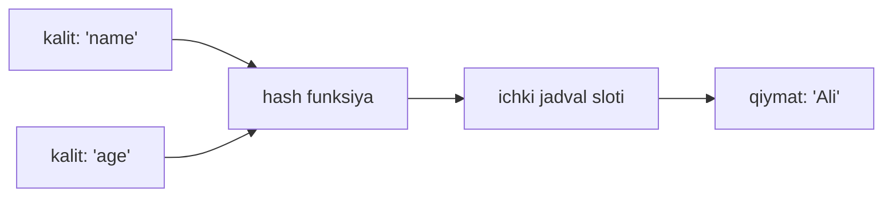
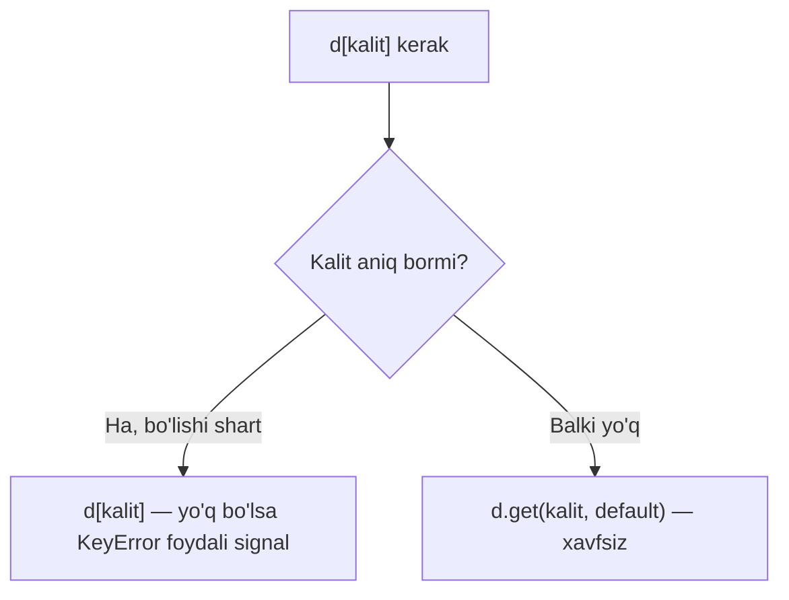

# 09. Dict

## Muammo: nomsiz indeks bilan azoblanish

Tasavvur qil: 10 000 foydalanuvchi bor va sen ularni `user_id` bo'yicha topishing kerak. Agar `list` ishlatsang, har safar boshidan oxirigacha aylanib chiqasan — bu **O(n)**.

Yana yomoni: list'da element tartibi o'zgarsa, indeks ham buziladi. Sen `users[42]` deb yozgan eding, endi u boshqa odamga ishora qilyapti.

Kerak bo'lgan narsa oddiy: **kalit ber — qiymatni bir zumda ol**. Aynan shuni **dict** hal qiladi.

## Analogiya: haqiqiy lug'at

Ingliz-o'zbek lug'atini och: "apple" so'zini (kalit) topib, "olma" tarjimasini (qiymat) o'qiysan. Butun kitobni varaqlamaysan — to'g'ri joyga sakrab, bir zumda topasan.

Dict ham shunday: kalit bo'yicha qiymatga o'rtacha **O(1)** da yetasan, hajmi qancha katta bo'lsa ham.

> **Analogiya chegarasi:** haqiqiy lug'at alifbo tartibida turadi. Dict esa alifbo bo'yicha EMAS, **qo'shilish tartibida** (insertion order) saqlanadi. Va bitta kalit faqat bir marta bo'ladi — takror "apple" yozib bo'lmaydi, ikkinchisi birinchisini bosib o'tadi.

## Sodda ta'rif

**Dict** (dictionary, lug'at) — bu `kalit: qiymat` juftliklari to'plami, unda har bir **kalit noyob (unique)** va u qiymatga tez olib boradigan manzil vazifasini bajaradi.

Agar 04-darsdagi `hash table` tushunchasini eslasang — dict aynan o'sha ma'lumot strukturasining tayyor ko'rinishi. Go'dagi `map` bilan bir xil oila.

## Dict ichida nima bo'ladi (notional machine)



Python kalitni **hash funksiya** orqali songa aylantiradi, o'sha son bilan ichki jadvalda qaysi katakka qarashni hisoblaydi va qiymatni o'sha yerdan oladi. Shuning uchun butun dict'ni aylanib chiqish shart emas.

Ana shuning uchun ham kalit **hashable** (o'zgarmaydigan, hash qilinadigan) bo'lishi shart — bu haqda quyida.

## Dict yaratish

```python
# --- 1-qadam: literal sintaksis (eng keng tarqalgan) ---
person = {"name": "Ali", "age": 30}

# --- 2-qadam: bo'sh dict ---
empty = {}            # DIQQAT: bu dict, set EMAS
also_empty = dict()   # bir xil natija

# --- 3-qadam: juftliklardan qurish ---
from_pairs = dict([("a", 1), ("b", 2)])

print(person)
print(from_pairs)
```

Output:

```
{'name': 'Ali', 'age': 30}
{'a': 1, 'b': 2}
```

> Diqqat: `{}` bo'sh **dict** yaratadi, bo'sh **set** emas. Bo'sh set uchun `set()` yoziladi (08-darsdan eslab qol).

## CRUD — to'rt asosiy amal

```python
person = {"name": "Ali", "age": 30}

# --- Create: yangi kalit qo'shish ---
person["city"] = "Tashkent"

# --- Read: kalit bo'yicha o'qish ---
print(person["name"])      # Ali

# --- Update: mavjud kalitni yangilash ---
person["age"] = 31

# --- Delete: kalitni o'chirish ---
del person["city"]

print(person)
```

Output:

```
Ali
{'name': 'Ali', 'age': 31}
```

Diqqat qil: qo'shish va yangilash **bir xil** sintaksis — `person[kalit] = qiymat`. Kalit yo'q bo'lsa yaratiladi, bor bo'lsa ustiga yoziladi.

## KeyError muammosi va get()

Mavjud bo'lmagan kalitni `[]` bilan o'qishga urinsang — dastur qulaydi:

```python
person = {"name": "Ali"}
print(person["age"])   # KeyError: 'age'
```

Output:

```
Traceback (most recent call last):
  ...
KeyError: 'age'
```

Yechim — **`get()`** metodi. U kalit yo'q bo'lsa qulamaydi, `None` (yoki sen bergan default) qaytaradi:

```python
person = {"name": "Ali"}

print(person.get("age"))        # None — xato yo'q
print(person.get("age", 0))     # 0 — o'zing bergan default
print(person.get("name", "?"))  # Ali — kalit bor, default e'tiborsiz
```

Output:

```
None
0
Ali
```

> **Oltin qoida:** kalit bor-yo'qligiga ishonching komil bo'lmasa, `[]` emas, `get()` ishlat.

## get() vs [] — qaror oqimi



Ba'zan KeyError'ning o'zi foydali: agar kalit BO'LISHI shart bo'lsa, uning yo'qligi bug degani — dastur qulagani ma'qul, xatoni yashirmagan.

## setdefault() — "yo'q bo'lsa yarat, keyin ishlat"

Ko'p uchraydigan vaziyat: dict ichida list to'plamoqchisan, lekin birinchi marta kalit hali yo'q.

```python
groups = {}

# --- setdefault: kalit yo'q bo'lsa [] qo'yadi, keyin qiymatni qaytaradi ---
groups.setdefault("meva", []).append("olma")
groups.setdefault("meva", []).append("anor")
groups.setdefault("sabzavot", []).append("sabzi")

print(groups)
```

Output:

```
{'meva': ['olma', 'anor'], 'sabzavot': ['sabzi']}
```

`setdefault("meva", [])` ikkinchi chaqiruvda yangi `[]` yaratmaydi — mavjud list'ni qaytaradi, shuning uchun `append` to'g'ri ishlaydi.

## keys, values, items

Uch metod dict ustidan aylanish uchun:

```python
person = {"name": "Ali", "age": 30}

print(list(person.keys()))     # ['name', 'age']
print(list(person.values()))   # ['Ali', 30]
print(list(person.items()))    # [('name', 'Ali'), ('age', 30)]

# --- eng ko'p ishlatiladigan shakl: items() bilan aylanish ---
for key, value in person.items():
    print(f"{key} -> {value}")
```

Output:

```
['name', 'age']
['Ali', 30]
[('name', 'Ali'), ('age', 30)]
name -> Ali
age -> 30
```

Bu metodlar **view** (ko'rinish) qaytaradi — ular dict bilan "jonli" bog'langan: dict o'zgarsa, view ham o'zgaradi. Chiroyli chop etish uchun ko'pincha `list()` ga o'raymiz.

## in operator — faqat KALITLAR bo'yicha

```python
person = {"name": "Ali", "age": 30}

print("name" in person)   # True  — kalit bor
print("Ali" in person)    # False — bu QIYMAT, kalit emas
print("age" not in person)  # False
```

Output:

```
True
False
False
```

> Eng ko'p yangi boshlovchi xatosi: `in` dict'da **kalitlarni** tekshiradi, qiymatlarni emas. Qiymat ichida qidirish uchun `"Ali" in person.values()` yozasan.

## Worked example: so'z chastotasi (ML'da bag-of-words)

Bu misol ML'da hujjatni raqamga aylantirishning eng asosiy usuli — har so'z necha marta uchraganini sanash.

```python
# --- 1-qadam: matnni so'zlarga ajratamiz ---
text = "olma anor olma uzum anor olma"
words = text.split()

# --- 2-qadam: bo'sh dict — chastota hisoblagichi ---
counts = {}

# --- 3-qadam: har so'z uchun sanoqni oshiramiz ---
for word in words:
    counts[word] = counts.get(word, 0) + 1

print(counts)
```

Output:

```
{'olma': 3, 'anor': 2, 'uzum': 1}
```

`counts.get(word, 0)` bu yerda qahramon: birinchi marta uchragan so'z uchun `0` qaytaradi, keyin `+1` qilamiz. `get` bo'lmasa, birinchi so'zdayoq `KeyError` olardik.

## dict comprehension

07-darsdagi list comprehension'ni eslaysanmi? Dict uchun ham xuddi shunday, faqat `kalit: qiymat` sintaksisi bilan:

```python
# --- 1 dan 5 gacha sonlar va ularning kvadratlari ---
squares = {n: n**2 for n in range(1, 6)}
print(squares)

# --- filtr bilan: faqat juft sonlar ---
even_squares = {n: n**2 for n in range(1, 6) if n % 2 == 0}
print(even_squares)

# --- ikki list'dan dict qurish (zip bilan) ---
names = ["Ali", "Vali", "Guli"]
ages = [30, 25, 28]
people = {name: age for name, age in zip(names, ages)}
print(people)
```

Output:

```
{1: 1, 2: 4, 3: 9, 4: 16, 5: 25}
{2: 4, 4: 16}
{'Ali': 30, 'Vali': 25, 'Guli': 28}
```

## Nested dict — dict ichida dict

ML'da config fayllar va JSON javoblar deyarli har doim ichma-ich (nested) tuzilgan:

```python
users = {
    "u1": {"name": "Ali", "roles": ["admin", "user"]},
    "u2": {"name": "Vali", "roles": ["user"]},
}

# --- chuqur o'qish: kalitni ketma-ket beramiz ---
print(users["u1"]["name"])       # Ali
print(users["u1"]["roles"][0])   # admin

# --- xavfsiz chuqur o'qish ---
print(users.get("u3", {}).get("name", "topilmadi"))
```

Output:

```
Ali
admin
topilmadi
```

Oxirgi qatorda `get("u3", {})` yo'q foydalanuvchi uchun bo'sh dict qaytardi, shuning uchun keyingi `.get("name", ...)` qulamadi.

## Insertion order kafolati (Python 3.7+)

Ilgari (Python 3.6 gacha) dict tartibsiz edi — bugun A, ertaga B chiqishi mumkin edi. Python 3.7 dan boshlab dict **qo'shilish tartibini kafolatlaydi**:

```python
d = {}
d["z"] = 1
d["a"] = 2
d["m"] = 3

print(list(d))   # kalitlar qo'shilgan tartibda
```

Output:

```
['z', 'a', 'm']
```

Alifbo bo'yicha emas — sen qo'shgan tartibda: `z`, `a`, `m`. Bu kafolat sababli endi natijalar takrorlanadigan (reproducible) bo'ladi, bu ML tajribalari uchun muhim.

## Hashable kalit talabi

Kalit **hashable** bo'lishi shart — ya'ni o'zgarmaydigan (immutable) va hash qilinadigan. String, son, bool, tuple — yaraydi. List va dict — yaramaydi.

```python
ok = {("lat", "lon"): "manzil", 42: "javob", "name": "Ali"}
print(ok[("lat", "lon")])   # manzil

bad = {[1, 2]: "x"}   # TypeError: unhashable type: 'list'
```

Output:

```
manzil
Traceback (most recent call last):
  ...
TypeError: unhashable type: 'list'
```

Sabab notional machine darajasida: dict kalitni hash qiladi. List o'zgaruvchan bo'lgani uchun uning hash'i ham o'zgarardi — u holda qiymat "yo'qolib" qolardi. Shuning uchun Python list'ni kalit qilishga umuman ruxsat bermaydi.

## Dict vs Go map — solishtirish

Go'da `map` bilan tanishsan. Ko'p narsa o'xshash, lekin muhim farqlar bor:

| Xususiyat | Python dict | Go map |
|---|---|---|
| Yaratish | `{"a": 1}` | `map[string]int{"a": 1}` |
| Yo'q kalitni o'qish | `KeyError` (qulaydi) | **zero value** qaytaradi (0, "", nil) |
| Xavfsiz o'qish | `d.get("a", 0)` | `v, ok := m["a"]` (comma-ok) |
| Mavjudlik tekshirish | `"a" in d` | `_, ok := m["a"]` |
| Tartib | qo'shilish tartibi kafolatlangan (3.7+) | **tartib yo'q** (har safar random) |
| Kalit turi | bitta dict'da aralash bo'lishi mumkin | qat'iy bitta tur |
| Qiymat turi | aralash | qat'iy bitta tur |
| O'chirish | `del d["a"]` | `delete(m, "a")` |

Eng katta tuzoq Go'chi uchun: Go'da yo'q kalit **zero value** beradi (masalan `m["yoq"]` → `0`). Python'da esa **KeyError** — dastur qulaydi. Python'da `get` bu farqni yopadi:

```python
# Go: v := m["yoq"]  ->  0 (jimgina)
# Python ekvivalenti:
d = {"a": 1}
v = d.get("yoq", 0)   # 0 — o'zing default berding
```

Go'ning `comma-ok` idiomasi (`v, ok := m["a"]`) Python'da ikki xil ifodalanadi: mavjudlikni bilish uchun `in`, qiymatni default bilan olish uchun `get`.

## Dict ML'da qayerda uchraydi

- **Config** — model parametrlari `{"lr": 0.01, "epochs": 10}` ko'rinishida
- **JSON** — API javoblari to'g'ridan-to'g'ri dict'ga aylanadi (13-darsda ko'ramiz)
- **Feature mapping** — `{"olma": 0, "anor": 1, ...}` so'zni raqamga o'giradi
- **Chastota / statistika** — yuqoridagi bag-of-words misoli
- **Nomlangan natijalar** — `{"accuracy": 0.92, "loss": 0.08}`

## 🤔 O'ylab ko'r

Quyidagi kodda `get` o'rniga to'g'ridan-to'g'ri `+= 1` yozsak nima bo'ladi?

```python
counts = {}
for word in ["olma", "anor", "olma"]:
    counts[word] += 1   # get emas!
```

<details>
<summary>💡 Javobni ko'rish</summary>

**`KeyError: 'olma'`** — dastur birinchi so'zdayoq qulaydi.

Sabab: `counts[word] += 1` aslida `counts[word] = counts[word] + 1` degani. O'ng tomonda `counts["olma"]` o'qilmoqda, lekin bu kalit hali dict'da YO'Q — demak `KeyError`.

To'g'ri yechimlar:
- `counts[word] = counts.get(word, 0) + 1`
- yoki `collections.defaultdict(int)` ishlatish (keyingi darslarda)
- yoki `collections.Counter(words)` — eng qisqasi

Go'chi tuzog'i: Go'da `m[word]++` ishlardi, chunki yo'q kalit `0` beradi. Python'da esa yo'q — shuning uchun `get` kerak.
</details>

## ⚠️ Ko'p uchraydigan xatolar

**1. `in` qiymatni tekshiradi deb o'ylash**

Noto'g'ri: `if "Ali" in person` — bu kalit `"Ali"` bormi deb qaraydi.
To'g'risi: qiymat ichida qidirish uchun `if "Ali" in person.values()`.

**2. Yo'q kalitni `[]` bilan o'qish**

Noto'g'ri: `person["age"]` — kalit yo'q bo'lsa `KeyError`, dastur qulaydi.
To'g'risi: ishonching bo'lmasa `person.get("age", default)`.

**3. Go'dagidek "zero value" kutish**

Noto'g'ri: Go'chi `d["yoq"]` `0` yoki `""` beradi deb o'ylaydi.
To'g'risi: Python `KeyError` beradi. Default kerak bo'lsa — `get`.

**4. List'ni kalit qilish**

Noto'g'ri: `{[1, 2]: "x"}` — `TypeError: unhashable type`.
To'g'risi: o'zgarmaydigan kalit kerak — `tuple` ishlat: `{(1, 2): "x"}`.

**5. Aylanish paytida dict'ni o'zgartirish**

```python
d = {"a": 1, "b": 2}
for k in d:
    del d[k]   # RuntimeError: dictionary changed size during iteration
```
To'g'risi: nusxa ustidan ayl — `for k in list(d):`.

## Xulosa

- **Dict** — `kalit: qiymat` juftliklari, o'rtacha **O(1)** da qidirish, `hash table` asosida
- CRUD: qo'shish/yangilash `d[k] = v`, o'qish `d[k]`, o'chirish `del d[k]`
- Yo'q kalitni `[]` bilan o'qish **KeyError** beradi — `get(k, default)` xavfsiz
- `setdefault` — "yo'q bo'lsa yarat, keyin qaytar" idiomasi, ayniqsa list to'plashda
- `keys/values/items` — aylanish uchun view; `items()` bilan `for k, v` eng qulay
- `in` faqat **kalitlarni** tekshiradi
- Dict **qo'shilish tartibini** kafolatlaydi (3.7+), kalitlar **hashable** bo'lishi shart
- Go'dan farq: Python yo'q kalitda **qulaydi** (zero value bermaydi), tartibni **kafolatlaydi**

## 🧠 Eslab qol

- Yo'q kalitni xavfsiz o'qish = `d.get(k, default)`.
- `in` kalitni tekshiradi, qiymatni emas.
- Kalit hashable bo'lsin — list emas, tuple.
- Dict qo'shilish tartibini saqlaydi (3.7+).
- Go: yo'q kalit → zero value; Python: yo'q kalit → KeyError.

## ✅ O'z-o'zini tekshir

**1.** `d = {"a": 1}` bo'lsa, `d["b"]` va `d.get("b")` orasidagi farq nima?

<details>
<summary>Javob</summary>

`d["b"]` — `KeyError` chiqaradi, dastur qulaydi. `d.get("b")` — jimgina `None` qaytaradi (default bermaganing uchun). `d.get("b", 0)` desang `0` qaytaradi.
</details>

**2.** Nega `{[1, 2]: "x"}` xato beradi, `{(1, 2): "x"}` esa ishlaydi?

<details>
<summary>Javob</summary>

List o'zgaruvchan (mutable), shuning uchun **hashable emas** — hash'i vaqt bilan o'zgarishi mumkin, dict kalitni topa olmay qolardi. Tuple o'zgarmas (immutable), demak hashable — kalit bo'la oladi. Xato: `TypeError: unhashable type: 'list'`.
</details>

**3.** `"age" in person` `True` qaytardi. Bu nimani anglatadi — dict'da `"age"` degan kalit bormi yoki qiymatmi?

<details>
<summary>Javob</summary>

**Kalit** bor. `in` dict ustida faqat kalitlarni tekshiradi. Agar `"age"` qiymat bo'lsa ham `in` uni ko'rmaydi — buning uchun `"age" in person.values()` kerak.
</details>

**4.** Go'da `m["yoq"]` int map'da `0` beradi. Python'da xuddi shu xatti-harakatni qanday olasan?

<details>
<summary>Javob</summary>

`d.get("yoq", 0)` — kalit yo'q bo'lsa `0` qaytaradi. To'g'ridan-to'g'ri `d["yoq"]` esa `KeyError` bo'ladi, chunki Python zero value tushunchasiga ega emas.
</details>

**5.** `for k in d: del d[k]` nega xato beradi? Qanday tuzatasan?

<details>
<summary>Javob</summary>

`RuntimeError: dictionary changed size during iteration` — aylanish davomida dict o'lchamini o'zgartirib bo'lmaydi. Yechim: nusxa ustidan ayl — `for k in list(d): del d[k]`.
</details>

## 🛠 Amaliyot

**1. Oson (Modify)** — Yuqoridagi so'z chastotasi misolini o'zgartir: faqat 2 martadan ko'p uchragan so'zlarni chiqaradigan yangi dict qur (dict comprehension bilan).

<details>
<summary>Hint</summary>

Avval `counts` ni oldingidek qur, keyin: `{w: c for w, c in counts.items() if c > 2}`.
</details>

**2. O'rta (faded example)** — Telefon kitobchasi. Skeletonni to'ldir:

```python
book = {}

def add(name, phone):
    # TODO: name kalitiga phone qiymatini yoz
    ...

def find(name):
    # TODO: name bo'lsa raqamni, bo'lmasa "topilmadi" qaytar
    ...

add("Ali", "901112233")
print(find("Ali"))     # 901112233
print(find("Vali"))    # topilmadi
```

<details>
<summary>Hint</summary>

`add` ichida: `book[name] = phone`. `find` ichida: `return book.get(name, "topilmadi")`.
</details>

**3. Qiyin (Make)** — Ikki foydalanuvchi dict'ini birlashtiruvchi funksiya yoz: bir xil kalit ikkalasida bo'lsa, qiymatlari list ichida to'plansin. Masalan `{"a": 1}` va `{"a": 2, "b": 3}` dan `{"a": [1, 2], "b": [3]}` chiqsin.

<details>
<summary>Hint</summary>

Natija dict yarat. Ikkala dict'ning `items()` ustidan ayl. Har kalit uchun `result.setdefault(k, []).append(v)` ishlat — bu yo'q kalitga bo'sh list qo'yib, keyin qiymat qo'shadi.
</details>

## 🔁 Takrorlash

**Bog'liq oldingi mavzular:**
- 04 — Hash Table (dict shu strukturaga asoslangan)
- 07 — List (comprehension sintaksisi shu yerdan)
- 08 — Tuple va Set (tuple = hashable kalit; set = kalitlarsiz dict)

**Takrorlash jadvali:**
- **Ertaga** — "O'z-o'zini tekshir" 1 va 3 savollariga qayt (KeyError va `in`).
- **3 kundan keyin** — so'z chastotasi misolini yoddan yozib ko'r.
- **1 haftadan keyin** — Go map bilan solishtirish jadvalini xotiradan tikla.

**Feynman testi:** dict nima ekanligini kod so'zlaridan foydalanmasdan, bir do'stingga 3 jumlada tushuntirib ber. Ipucha: "lug'at", "kalit orqali tez topish", "har kalit noyob".
