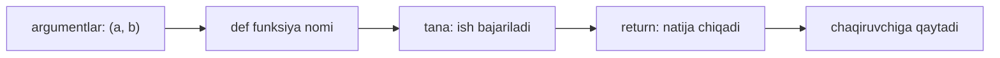
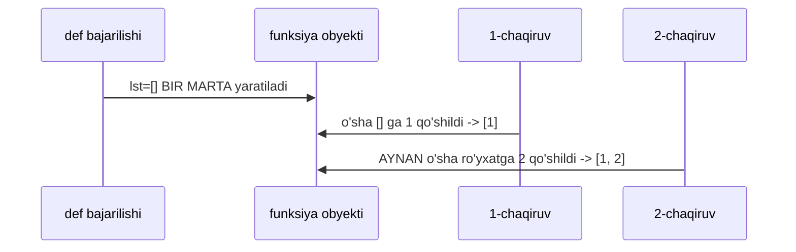
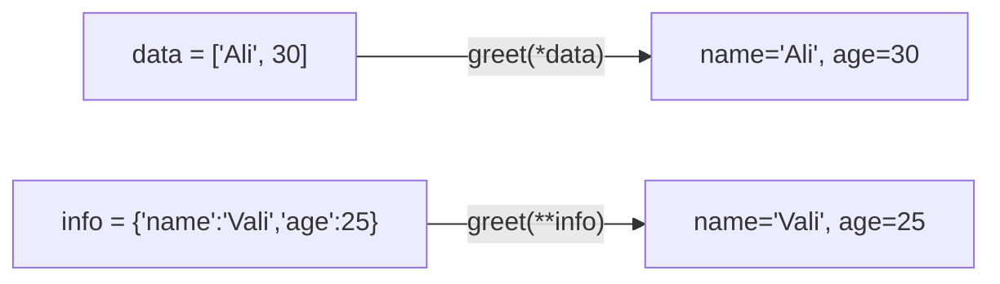

# 10. Funksiyalar

## Muammo: bir xil kodni qayta-qayta yozish

Tasavvur qil: dasturingda 20 joyda haroratni Selsiydan Farengeytga o'girish kerak. Har joyda `t * 9 / 5 + 32` yozasan. Bir kun formula noto'g'ri ekan — 20 joyni qidirib tuzatasan.

Bu — nusxa-ko'chir (copy-paste) do'zaxi. Kerak bo'lgani: formulani **bir marta** yozib, unga nom berib, kerak joyda chaqirish.

Aynan shu — **funksiya**. U kodni qadoqlaydi (encapsulate), nom beradi va qayta ishlatishga imkon beradi.

## Analogiya: oshxonadagi retsept

Funksiya — bu retsept. Unda **kirish mahsulotlari** (parametrlar), **tayyorlash bosqichlari** (tana) va **tayyor taom** (return qiymati) bor.

Retseptni bir marta yozasan, keyin istagancha ishlatasan — har safar mahsulotlarni (argumentlarni) berib.

> **Analogiya chegarasi:** retsept faqat oshxonada ishlaydi. Funksiya esa Python'da **birinchi darajali obyekt** (first-class object) — uni o'zgaruvchiga berib, boshqa funksiyaga uzatib, list ichida saqlash mumkin. Retseptni "o'zgaruvchiga berib bo'lmaydi", funksiyani esa mumkin.

## Sodda ta'rif

**Funksiya** — nom berilgan, qayta ishlatiladigan kod bloki; u kirish (argument) oladi, ish bajaradi va natija (return) qaytaradi.

## Funksiya anatomiyasi



```python
# --- 1-qadam: def bilan e'lon qilamiz ---
def to_fahrenheit(celsius):
    # --- 2-qadam: tana — hisoblash ---
    result = celsius * 9 / 5 + 32
    # --- 3-qadam: return — natijani qaytaramiz ---
    return result

# --- 4-qadam: chaqiramiz ---
print(to_fahrenheit(100))
print(to_fahrenheit(0))
```

Output:

```
212.0
32.0
```

## return bo'lmasa — None qaytadi

Bu Go'chi uchun muhim tuzoq. Python'da `return` yozmasang ham funksiya **jimgina `None` qaytaradi**:

```python
def greet(name):
    print(f"Salom, {name}!")   # print — bu return EMAS

result = greet("Ali")
print(result)       # None
print(type(result)) # <class 'NoneType'>
```

Output:

```
Salom, Ali!
None
<class 'NoneType'>
```

> **Diqqat:** `print(...)` ekranga chiqaradi, lekin qiymat QAYTARMAYDI. Chiqarish va qaytarish — ikki xil narsa. Faqat `return` qiymatni chaqiruvchiga uzatadi.

## Positional vs keyword argumentlar

Argumentlarni ikki xil uzatish mumkin: **tartib bo'yicha** (positional) yoki **nom bo'yicha** (keyword).

```python
def make_row(name, age, city):
    return f"{name}, {age}, {city}"

# --- positional: tartib muhim ---
print(make_row("Ali", 30, "Tashkent"))

# --- keyword: nom muhim, tartib emas ---
print(make_row(city="Samarkand", name="Vali", age=25))

# --- aralash: avval positional, keyin keyword ---
print(make_row("Guli", city="Bukhara", age=28))
```

Output:

```
Ali, 30, Tashkent
Vali, 25, Samarkand
Guli, 28, Bukhara
```

Keyword argument kod o'qilishini yaxshilaydi: `make_row(city="Samarkand", ...)` `make_row("Ali", 30, "Tashkent")` dan aniqroq. Go'da keyword argument YO'Q — bu Python'ning kuchli tomoni.

## Default qiymatlar

Parametrga standart qiymat berish mumkin — chaqirilganda berilmasa, o'sha ishlatiladi:

```python
def greet(name, greeting="Salom"):
    return f"{greeting}, {name}!"

print(greet("Ali"))                    # default ishlatiladi
print(greet("Vali", "Assalomu alaykum"))  # ustidan yoziladi
```

Output:

```
Salom, Ali!
Assalomu alaykum, Vali!
```

Qoida: default'li parametrlar default'siz parametrlardan **keyin** kelishi shart. `def f(a=1, b)` — SyntaxError.

## MUTABLE DEFAULT TUZOG'I — klassik xato

Bu Python'dagi eng mashhur tuzoqlardan biri. O'zgaruvchan (mutable) obyektni — list, dict — default qilib bermang:

```python
def add_item(item, lst=[]):     # DIQQAT: xavfli!
    lst.append(item)
    return lst

print(add_item(1))
print(add_item(2))
print(add_item(3))
```

Output:

```
[1]
[1, 2]
[1, 2, 3]
```

Kutgan narsang har safar `[1]`, `[2]`, `[3]` edi. Nega list to'planib ketyapti?

### Nega bunday bo'ladi (notional machine)

Kalit fikr: **default qiymat funksiya E'LON qilinganda BIR MARTA yaratiladi**, har chaqiruvda emas. U funksiya obyektining ichida saqlanadi.



Buni ko'z bilan ko'rsak bo'ladi — Python default'ni funksiya ichida saqlaydi:

```python
def add_item(item, lst=[]):
    lst.append(item)
    return lst

print(add_item.__defaults__)   # ([],)
add_item(1)
print(add_item.__defaults__)   # ([1],) — default O'ZI o'zgardi!
```

Output:

```
([],)
([1],)
```

### To'g'ri yechim: None sentinel

```python
def add_item(item, lst=None):
    # --- 1-qadam: default None — har chaqiruvda tekshiramiz ---
    if lst is None:
        lst = []          # --- 2-qadam: YANGI list har safar ---
    lst.append(item)
    return lst

print(add_item(1))
print(add_item(2))
```

Output:

```
[1]
[2]
```

> **Oltin qoida:** default qiymat sifatida hech qachon mutable obyekt (`[]`, `{}`, `set()`) bermang. `None` bering, funksiya ichida tekshirib yangi obyekt yarating.

## *args — noma'lum sonli positional argumentlar

Nechta argument kelishini oldindan bilmasang, `*args` ishlatasan — u ularni **tuple** ichiga yig'adi:

```python
def total(*args):
    print(args)          # tuple
    return sum(args)

print(total(1, 2, 3))
print(total(10, 20))
print(total())
```

Output:

```
(1, 2, 3)
6
(10, 20)
30
()
0
```

`args` — shunchaki kelishuv nomi (convention). Muhimi `*` belgisi. Go'dagi variadic `func total(nums ...int)` ga o'xshaydi.

## **kwargs — noma'lum sonli keyword argumentlar

`**kwargs` esa nomli argumentlarni **dict** ichiga yig'adi:

```python
def make_config(**kwargs):
    print(kwargs)        # dict
    return kwargs

cfg = make_config(lr=0.01, epochs=10, model="cnn")
print(cfg["lr"])
```

Output:

```
{'lr': 0.01, 'epochs': 10, 'model': 'cnn'}
0.01
```

Bu ML kutubxonalarida hamma joyda: `model.fit(x, y, batch_size=32, verbose=1, ...)` — o'sha keyword'lar ko'pincha `**kwargs` orqali qabul qilinadi.

## Chaqiruvda unpacking — * va **

Yuqoridagi `*` va `**` **e'lon**da yig'ish uchun edi. **Chaqiruv**da esa aksincha — yoyish (unpacking):

```python
def greet(name, age):
    return f"{name}, {age}"

# --- * bilan list/tuple ni positional ga yoyamiz ---
data = ["Ali", 30]
print(greet(*data))          # greet("Ali", 30) ga teng

# --- ** bilan dict ni keyword ga yoyamiz ---
info = {"name": "Vali", "age": 25}
print(greet(**info))         # greet(name="Vali", age=25) ga teng
```

Output:

```
Ali, 30
Vali, 25
```



## lambda — bir qatorlik anonim funksiya

`lambda` — nomsiz, bir ifodalik kichik funksiya. `def` yozishga arzimaydigan joyda ishlatiladi:

```python
# --- oddiy def ---
def square(x):
    return x ** 2

# --- xuddi shu, lambda bilan ---
square2 = lambda x: x ** 2

print(square(5), square2(5))
```

Output:

```
25 25
```

Lambda'ning eng foydali joyi — `sorted`, `map`, `filter` ga `key` sifatida uzatish:

```python
people = [("Ali", 30), ("Vali", 25), ("Guli", 28)]

# --- yosh (indeks 1) bo'yicha tartiblash ---
by_age = sorted(people, key=lambda p: p[1])
print(by_age)
```

Output:

```
[('Vali', 25), ('Guli', 28), ('Ali', 30)]
```

### Qachon lambda ishlatmaslik kerak

- Funksiyaga nom kerak bo'lsa — `def` yoz (o'qish oson, xatoda nom ko'rinadi)
- Bir necha satr mantiq bo'lsa — lambda faqat bitta ifoda ko'taradi
- `square = lambda x: x**2` kabi o'zgaruvchiga berish — anti-pattern; `def square` yoz

> **Qoida:** lambda faqat "bir marta, joyida" ishlatiladigan mayda funksiya uchun. Nom berayotgan bo'lsang — `def`.

## Funksiya = birinchi darajali obyekt

Python'da funksiya ham oddiy qiymat — uni o'zgaruvchiga berish, argument qilib uzatish, list'da saqlash mumkin:

```python
def shout(s):
    return s.upper()

# --- 1: o'zgaruvchiga berish ---
f = shout
print(f("salom"))            # SALOM

# --- 2: argument qilib uzatish (map) ---
words = ["ali", "vali"]
print(list(map(shout, words)))

# --- 3: list ichida saqlash ---
ops = [str.upper, str.lower]
print(ops[0]("Hi"), ops[1]("Hi"))
```

Output:

```
SALOM
['ALI', 'VALI']
HI hi
```

Diqqat: `f = shout` — qavssiz! Qavs qo'ysang (`shout("...")`) chaqirasan; qavssiz — funksiyaning o'ziga ishora olasan. Bu Go bilan bir xil (Go'da ham funksiya first-class).

## Docstring — funksiya hujjati

Funksiya tanasi boshidagi string — bu **docstring**, funksiya nima qilishini tushuntiradi:

```python
def area(width, height):
    """To'rtburchak yuzasini hisoblaydi (width * height)."""
    return width * height

print(area(3, 4))
print(area.__doc__)
```

Output:

```
12
To'rtburchak yuzasini hisoblaydi (width * height).
```

Wait, output text mismatch. Let me fix — output must match docstring exactly.

`help(area)` ham shu docstring'ni ko'rsatadi. IDE ham funksiya ustiga kelganda uni chiqaradi. Yaxshi docstring — jamoaviy loyihada shart.

## Funksiya: Python vs Go

| Xususiyat | Python | Go |
|---|---|---|
| E'lon | `def f(a, b):` | `func f(a, b int) int` |
| Tip belgisi | ixtiyoriy (type hint) | majburiy |
| return yo'q bo'lsa | `None` qaytadi | hech narsa (void) |
| Ko'p qiymat qaytarish | tuple orqali `return a, b` | tabiiy `return a, b` |
| Default argument | bor: `def f(a=1)` | YO'Q |
| Keyword argument | bor: `f(a=1)` | YO'Q |
| Variadic | `*args`, `**kwargs` | `...int` (faqat bitta, oxirida) |
| First-class | ha | ha |
| Anonim funksiya | `lambda` (1 ifoda) | `func(){}` (to'liq tana) |

Python funksiyalari ancha moslashuvchan: default, keyword, `**kwargs`. Go esa qat'iy va oddiy. ML kodda Python'ning bu moslashuvchanligi juda ko'p ishlatiladi.

## 🤔 O'ylab ko'r

Quyidagi kod nima chiqaradi?

```python
def append_zero(data=[]):
    data.append(0)
    return data

a = append_zero()
b = append_zero()
print(a)
print(b)
print(a is b)
```

<details>
<summary>💡 Javobni ko'rish</summary>

```
[0, 0]
[0, 0]
True
```

`a` va `b` — bir xil, chunki ikkalasi ham **AYNAN o'sha** default list'ga ishora qiladi. Default `[]` funksiya e'lon qilinganda bir marta yaratildi va har chaqiruvda qayta ishlatildi. Birinchi chaqiruv `[0]`, ikkinchisi o'sha ro'yxatga yana `0` qo'shdi → `[0, 0]`.

`a is b` `True` — chunki ular bitta obyekt (07-darsdagi `is` vs `==` ni eslaysanmi).

To'g'risi: `def append_zero(data=None):` va ichida `if data is None: data = []`.
</details>

## ⚠️ Ko'p uchraydigan xatolar

**1. Mutable default**

Noto'g'ri: `def f(x, lst=[]):` — list chaqiruvlar orasida saqlanib qoladi.
To'g'risi: `def f(x, lst=None):` + ichida `if lst is None: lst = []`.

**2. print ni return deb o'ylash**

Noto'g'ri: `def add(a, b): print(a + b)` keyin `x = add(2, 3)` — `x` `None` bo'ladi.
To'g'risi: qiymat kerak bo'lsa `return a + b`.

**3. Funksiyani chaqirib qo'yish (qavs bilan) uzatmoqchi bo'lganda**

Noto'g'ri: `map(shout(), words)` — `shout()` darhol chaqiriladi.
To'g'risi: `map(shout, words)` — qavssiz, funksiyaning o'zi uzatiladi.

**4. Default argumentni default'siz oldiga qo'yish**

Noto'g'ri: `def f(a=1, b):` — SyntaxError.
To'g'risi: default'lilar oxirida — `def f(b, a=1):`.

**5. Lambda'ga nom berish**

Noto'g'ri: `f = lambda x: x + 1` — linterlar ogohlantiradi, xatoda nom ko'rinmaydi.
To'g'risi: nom kerak bo'lsa `def f(x): return x + 1`.

## Xulosa

- **Funksiya** kodni qadoqlaydi, nom beradi, qayta ishlatishga imkon beradi
- `return` yo'q bo'lsa funksiya **`None`** qaytaradi (`print` return emas)
- Argumentlar **positional** (tartib) yoki **keyword** (nom) bo'lishi mumkin
- **Default** qiymat mumkin; lekin **mutable default** (`[]`, `{}`) — klassik tuzoq, `None` ishlat
- `*args` positional'larni **tuple**, `**kwargs` keyword'larni **dict** ga yig'adi
- Chaqiruvda `*list` va `**dict` argumentlarni **yoyadi** (unpacking)
- `lambda` — bir ifodalik anonim funksiya; nom kerak bo'lsa `def`
- Funksiya **first-class obyekt** — o'zgaruvchi, argument, list elementi bo'la oladi

## 🧠 Eslab qol

- return yo'q = None qaytadi.
- Mutable default (`[]`) tuzoq — `None` ishlat.
- default funksiya e'lonida BIR MARTA yaratiladi.
- `*args` = tuple, `**kwargs` = dict.
- `f` (qavssiz) = funksiyaga ishora; `f()` = chaqiruv.

## ✅ O'z-o'zini tekshir

**1.** `def f(): print("hi")` bo'lsa, `x = f()` dan keyin `x` nima bo'ladi va nega?

<details>
<summary>Javob</summary>

`x` `None` bo'ladi. Funksiyada `return` yo'q, `print` esa faqat ekranga chiqaradi — qiymat qaytarmaydi. `return` bo'lmagan funksiya har doim `None` qaytaradi.
</details>

**2.** Nega `def add(x, lst=[])` xavfli, `def add(x, lst=None)` esa xavfsiz?

<details>
<summary>Javob</summary>

`lst=[]` default'i funksiya e'lon qilinganda BIR MARTA yaratiladi va chaqiruvlar orasida saqlanib qoladi — natija to'planib ketadi. `lst=None` bilan esa har chaqiruvda `if lst is None: lst = []` yangi list yaratadi, shuning uchun xavfsiz.
</details>

**3.** `*args` va `**kwargs` funksiya ichida qaysi turlarga aylanadi?

<details>
<summary>Javob</summary>

`*args` — **tuple** (positional argumentlar), `**kwargs` — **dict** (keyword argumentlar). Nomlar shunchaki kelishuv; muhimi `*` va `**` belgilar.
</details>

**4.** `greet(*["Ali", 30])` va `greet(**{"name": "Ali", "age": 30})` orasidagi farq nima?

<details>
<summary>Javob</summary>

Birinchisi `*` bilan list'ni **positional** argumentlarga yoyadi: `greet("Ali", 30)`. Ikkinchisi `**` bilan dict'ni **keyword** argumentlarga yoyadi: `greet(name="Ali", age=30)`. Natija bir xil bo'lishi mumkin, lekin uzatish usuli boshqa.
</details>

**5.** `sorted(data, key=lambda x: x[1])` nima qiladi? Nega bu yerda lambda o'rinli?

<details>
<summary>Javob</summary>

Har elementning indeks 1 dagi qiymati bo'yicha tartiblaydi. Lambda o'rinli, chunki bu mayda, bir marta ishlatiladigan, nomga muhtoj bo'lmagan funksiya — aynan lambda uchun tug'ilgan holat.
</details>

## 🛠 Amaliyot

**1. Oson (Modify)** — `to_fahrenheit` funksiyasiga teskari — `to_celsius(fahrenheit)` funksiya yoz. Formula: `(f - 32) * 5 / 9`. `to_celsius(212)` `100.0` qaytarsin.

<details>
<summary>Hint</summary>

`def to_celsius(fahrenheit): return (fahrenheit - 32) * 5 / 9`.
</details>

**2. O'rta (faded example)** — Xavfsiz "logger" yig'uvchi. Skeletonni to'ldir:

```python
def add_log(message, logs=None):
    # TODO: logs None bo'lsa yangi list yarat
    ...
    logs.append(message)
    return logs

first = add_log("boshlandi")
second = add_log("tugadi")
print(first)    # ['boshlandi']
print(second)   # ['tugadi']  -- to'planmasligi kerak!
```

<details>
<summary>Hint</summary>

`if logs is None: logs = []` — funksiya boshida. Bu mutable default tuzog'ining to'g'ri yechimi.
</details>

**3. Qiyin (Make)** — `apply_all(value, *funcs)` funksiya yoz: berilgan `value` ni har bir funksiyadan ketma-ket o'tkazadi (birinchisining natijasini ikkinchisiga, hokazo) va oxirgi natijani qaytaradi. Masalan `apply_all(3, lambda x: x+1, lambda x: x*2)` `8` qaytarsin (`(3+1)*2`).

<details>
<summary>Hint</summary>

`*funcs` funksiyalarni tuple qilib oladi. `for f in funcs: value = f(value)` — har birini navbatma-navbat qo'lla. Oxirida `return value`.
</details>

## 🔁 Takrorlash

**Bog'liq oldingi mavzular:**
- 07 — List (mutable default tuzog'i list mutability'ga bog'liq)
- 08 — Tuple (`*args` tuple qaytaradi)
- 09 — Dict (`**kwargs` dict qaytaradi; unpacking `**dict`)

**Takrorlash jadvali:**
- **Ertaga** — mutable default tuzog'ini yoddan tushuntirib ber (nega, qanday tuzatiladi).
- **3 kundan keyin** — `*args`/`**kwargs` va unpacking farqini misolda yoz.
- **1 haftadan keyin** — "O'z-o'zini tekshir" 2 va 3 savollariga qayt.

**Feynman testi:** funksiya nima uchun kerakligini kod so'zlaridan foydalanmasdan 3 jumlada tushuntir. Ipucha: "retsept", "bir marta yoz — ko'p marta ishlat", "kirish beraman — natija olaman".
