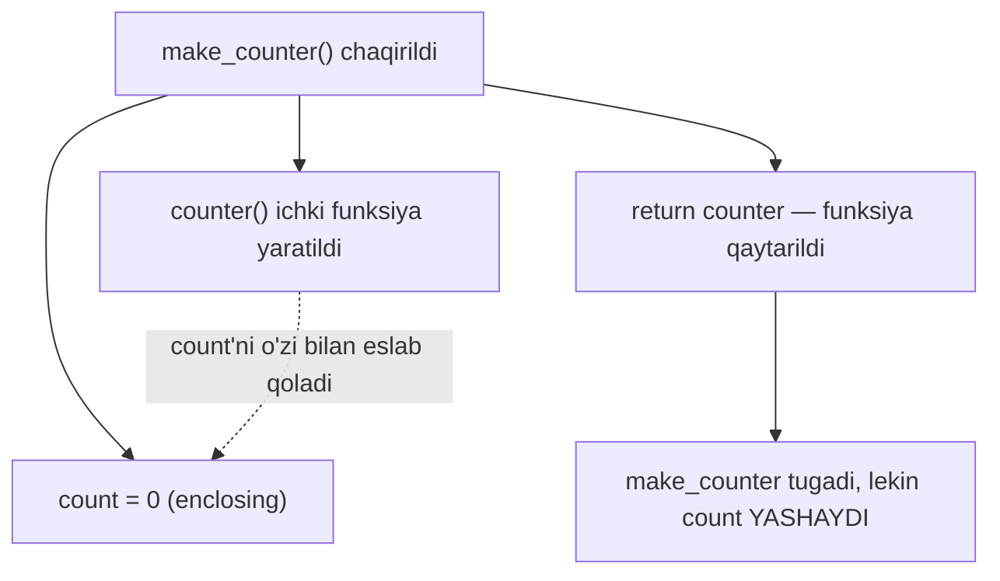
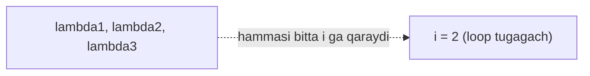

# 11. Scope va closure

## Muammo: qaysi "x" haqida gapiryapmiz?

Tasavvur qil: dasturingda uchta joyda `x` degan o'zgaruvchi bor — biri global, biri funksiya ichida, biri ichki funksiyada. Funksiya `print(x)` deganda, qaysi biri chiqadi?

Agar Python qaysi `x` ni tanlashni bilmasa, tartibsizlik boshlanadi. Kerak bo'lgan narsa: **aniq qoida** — nom qidirilganda qayerdan boshlab, qayerga qarab qidiriladi.

Bu qoida — **scope** (ko'rinish sohasi) va uni boshqaradigan **LEGB** qoidasi.

## Analogiya: idoradagi hujjat qidiruvi

Xodim hujjat qidiryapti. Avval **o'z stolida** qaraydi (Local). Topmasa **bo'lim shkafiga** (Enclosing). Topmasa **kompaniya arxiviga** (Global). Topmasa **davlat kutubxonasiga** (Built-in).

Birinchi topilgan joyda to'xtaydi — qolganlariga qaramaydi.

> **Analogiya chegarasi:** idorada xodim ixtiyoriy shkafga qarashi mumkin. Python esa qat'iy **bir yo'nalishda** — ichkaridan tashqariga qarab qidiradi, teskarisiga emas. Global o'zgaruvchi funksiya ichini "ko'ra olmaydi".

## Sodda ta'rif

**Scope** — o'zgaruvchi "ko'rinadigan" va murojaat qilinadigan kod sohasi. **LEGB** — Python nomni qidirish tartibi: **L**ocal → **E**nclosing → **G**lobal → **B**uilt-in.

## LEGB qidiruv tartibi


Python nomni ko'rganda shu tartibda qidiradi va **birinchi topilgan** joyda to'xtaydi. Ko'raylik:

```python
x = "global"

def outer():
    x = "enclosing"
    def inner():
        x = "local"
        print(x)      # eng yaqin: local
    inner()
    print(x)          # local yo'q, enclosing topildi

outer()
print(x)              # faqat global ko'rinadi
```

Output:

```
local
enclosing
global
```

Har `print(x)` o'ziga eng yaqin `x` ni tanladi. `inner` ichida `local`, `outer` ichida `enclosing`, tashqarida `global`.

## Built-in scope — Python'ning tayyor nomlari

`len`, `print`, `range`, `sum`, `sorted` — bular Built-in scope'da. Shuning uchun ularni hech qayerda e'lon qilmay ishlatasan.

```python
print(len("salom"))    # len — Built-in scope'dan topildi
```

Output:

```
5
```

> **Ogohlantirish:** Built-in nomni o'zgaruvchi qilib bosib o'tma. `list = [1, 2]` yozsang, `list()` funksiyasini yo'qotasan. `len = 5` yozsang, `len(...)` ishlamay qoladi.

## Global o'zgaruvchini o'zgartirish — global kalit so'z

Funksiya global o'zgaruvchini **o'qiy** oladi. Lekin unga **qiymat berishga** urinsang, Python uni local deb hisoblaydi:

```python
counter = 0

def increment():
    counter += 1    # XATO: UnboundLocalError

increment()
```

Output:

```
Traceback (most recent call last):
  ...
UnboundLocalError: cannot access local variable 'counter' ...
```

Nega? `counter += 1` funksiya ichida `counter` ga qiymat beryapti — Python butun funksiya bo'yicha `counter` ni **local** deb belgilaydi. O'ng tomondagi `counter` esa hali yaratilmagan → xato.

Yechim — `global` kalit so'zi:

```python
counter = 0

def increment():
    global counter     # --- "counter tashqi global" deb aytamiz ---
    counter += 1

increment()
increment()
print(counter)
```

Output:

```
2
```

> **Maslahat:** `global` kamdan-kam kerak bo'ladi. Ko'p ishlatilsa — dizayn xatosi belgisi. Odatda qiymatni `return` bilan qaytargan afzal.

## nonlocal — enclosing o'zgaruvchini o'zgartirish

`global` global'ga tegadi. Ichki funksiyadan **tashqi funksiya** (enclosing) o'zgaruvchisini o'zgartirish uchun esa `nonlocal` kerak:

```python
def outer():
    count = 0
    def inner():
        nonlocal count      # --- outer'dagi count'ni o'zgartiramiz ---
        count += 1
        return count
    print(inner())
    print(inner())

outer()
```

Output:

```
1
2
```

`nonlocal` bo'lmasa, `inner` yangi local `count` yaratardi va `outer`'niki o'zgarmasdan qolardi.

## Closure — o'zgaruvchini "eslab qoladigan" funksiya

Endi eng qiziq qismi. **Closure** — ichki funksiya tashqi funksiya tugagandan keyin ham uning o'zgaruvchisini **eslab qoladigan** mexanizm.



```python
def make_counter():
    # --- 1-qadam: enclosing o'zgaruvchi ---
    count = 0
    # --- 2-qadam: ichki funksiya count'ni "yopib oladi" (close over) ---
    def counter():
        nonlocal count
        count += 1
        return count
    # --- 3-qadam: funksiyaning O'ZINI qaytaramiz (chaqirmaymiz!) ---
    return counter

c = make_counter()
print(c())
print(c())
print(c())
```

Output:

```
1
2
3
```

`make_counter()` allaqachon tugadi, lekin `count` yashab qolyapti — chunki `counter` uni o'zi bilan "olib ketdi". Har chaqiruvda o'sha yashirin `count` oshadi. Bu — closure.

### Ikki mustaqil counter

```python
a = make_counter()
b = make_counter()
print(a(), a(), b())    # a va b alohida count saqlaydi
```

Output:

```
1 2 1
```

Har `make_counter()` chaqiruvi **yangi, alohida** `count` yaratadi. `a` va `b` bir-biriga xalaqit bermaydi.

## Kech bog'lanish tuzog'i (late binding)

Bu closure'ning eng mashhur tuzog'i. Loop ichida lambda yaratsang, kutilmagan natija chiqadi:

```python
funcs = []
for i in range(3):
    funcs.append(lambda: i)

print([f() for f in funcs])
```

Output:

```
[2, 2, 2]
```

Kutgan narsang `[0, 1, 2]` edi. Nega hammasi `2`?

### Nega bunday bo'ladi (notional machine)

Lambda `i` ning **qiymatini** emas, `i` **o'zgaruvchisini** eslab qoladi. Funksiyalar aslida chaqirilganda `i` ga qaraydi — o'sha paytda loop tugagan, `i` allaqachon `2`.



Ya'ni uch lambda uch xil qiymatni emas, **bitta va o'sha** `i` o'zgaruvchisini ulashadi. Chaqirilganda `i` ning eng oxirgi holati — `2`.

### Yechim: default argument bilan "muzlatish"

```python
funcs = []
for i in range(3):
    funcs.append(lambda i=i: i)   # i ning JORIY qiymati muzlatiladi

print([f() for f in funcs])
```

Output:

```
[0, 1, 2]
```

`lambda i=i: i` — bu yerdagi `i=i` default argument har iteratsiyada `i` ning **o'sha ondagi qiymatini** ko'chirib oladi (10-darsdagi default'lar e'lon paytida hisoblanishini eslaysanmi). Shuning uchun har lambda o'z qiymatini saqlaydi.

## Python vs Go: blok scope FARQI

Bu Go'chi uchun eng muhim va eng ko'p adashtiradigan farq. **Go'da `if`/`for` bloki yangi scope yaratadi. Python'da — YO'Q.**

Python'da `if`, `for`, `while` bloklari scope yaratmaydi — ularda e'lon qilingan o'zgaruvchi blokdan **tashqariga chiqib ketadi** (leak):

```python
if True:
    y = 10

print(y)          # 10 — blok tashqarisida ham ko'rinadi!

for i in range(3):
    pass

print(i)          # 2 — loop o'zgaruvchisi ham "sizib chiqadi"
```

Output:

```
10
2
```

Go'da bu ikki `print` ham **kompilyatsiya xatosi** berardi — `y` va `i` blokdan tashqarida mavjud emas. Python'da faqat **funksiya**, **modul** va **class** yangi scope yaratadi; `if`/`for`/`while` — yo'q.

| Xususiyat | Python | Go |
|---|---|---|
| Funksiya scope yaratadi | ha | ha |
| `if` bloki scope yaratadi | **YO'Q** | ha |
| `for` bloki scope yaratadi | **YO'Q** | ha |
| Loop o'zgaruvchisi tashqarida | ko'rinadi (leak) | ko'rinmaydi |
| Tashqi o'zgaruvchini o'zgartirish | `global`/`nonlocal` kerak | to'g'ridan-to'g'ri | 
| Nom qidirish qoidasi | LEGB | leksik (blok ichma-ich) |

> **Go'chiga eslatma:** Python'da `for i in ...` tugagach `i` yo'qolmaydi. Bunga tayanma — bir blokda yaratilgan o'zgaruvchi kutilmaganda keyingi kodga ta'sir qilishi mumkin.

## 🤔 O'ylab ko'r

Quyidagi kod nima chiqaradi?

```python
x = 10

def f():
    print(x)
    x = 20

f()
```

<details>
<summary>💡 Javobni ko'rish</summary>

**`UnboundLocalError: cannot access local variable 'x'`** — dastur qulaydi, hech narsa chiqmaydi.

Sabab: funksiya ichida biror joyda `x = 20` (qiymat berish) borligi uchun Python `x` ni **butun funksiya bo'yicha local** deb belgilaydi. `print(x)` ishlaganda esa bu local `x` hali yaratilmagan → xato.

Diqqat: `x` global bo'lsa ham, funksiya ichida unga qiymat berilganligi uni local qiladi. Global'ni o'qib, keyin o'zgartirmoqchi bo'lsang — `global x` deb boshla.
</details>

## ⚠️ Ko'p uchraydigan xatolar

**1. Global'ga qiymat berish (global'siz)**

Noto'g'ri: funksiya ichida `counter += 1` — `UnboundLocalError`.
To'g'risi: `global counter` deb boshla (yoki umuman qaytar: `return`).

**2. Enclosing o'zgaruvchini nonlocal'siz o'zgartirish**

Noto'g'ri: ichki funksiyada `count += 1` — yangi local yaratadi, tashqarisi o'zgarmaydi.
To'g'risi: `nonlocal count`.

**3. Late binding — loop ichida lambda**

Noto'g'ri: `for i in ...: funcs.append(lambda: i)` — hammasi oxirgi `i` ni ko'radi.
To'g'risi: `lambda i=i: i` — joriy qiymatni default bilan muzlat.

**4. Blok scope kutish (Go odati)**

Noto'g'ri: `if` yoki `for` ichida yaratilgan o'zgaruvchi tashqarida yo'q deb o'ylash.
To'g'risi: Python'da u tashqariga sizib chiqadi — faqat funksiya scope yaratadi.

**5. Built-in nomni bosib o'tish**

Noto'g'ri: `list = [1, 2]`, `sum = 0` — keyin `list(...)`, `sum(...)` ishlamaydi.
To'g'risi: boshqa nom tanla — `items`, `total`.

## Xulosa

- **Scope** — o'zgaruvchi ko'rinadigan soha; Python **LEGB** tartibida qidiradi
- LEGB = **L**ocal → **E**nclosing → **G**lobal → **B**uilt-in, birinchi topilganda to'xtaydi
- Funksiya ichida global'ga qiymat berish uchun `global`, enclosing'ga uchun `nonlocal`
- **Closure** — ichki funksiya tashqi funksiya o'zgaruvchisini eslab qoladi (counter misoli)
- **Late binding** tuzog'i: loop ichidagi lambda o'zgaruvchining qiymatini emas, o'zini eslaydi — `lambda i=i` bilan muzlat
- Go'dan katta farq: Python'da `if`/`for` **scope yaratmaydi**, faqat funksiya/modul/class yaratadi

## 🧠 Eslab qol

- LEGB: Local, Enclosing, Global, Built-in — shu tartibda.
- Funksiyada global'ni o'zgartirish = `global`; enclosing = `nonlocal`.
- Closure = funksiya tashqi o'zgaruvchini o'zi bilan olib ketadi.
- Loop ichida lambda = late binding tuzog'i → `lambda i=i`.
- Python: `if`/`for` scope YARATMAYDI (Go'dan farqli).

## ✅ O'z-o'zini tekshir

**1.** Uchta joyda `x` bor: global, `outer` ichida, `inner` ichida. `inner` dagi `print(x)` qaysini oladi va nega?

<details>
<summary>Javob</summary>

`inner`dagi local `x` ni oladi. LEGB tartibida Python avval Local'ga qaraydi va topganda to'xtaydi — Enclosing yoki Global'gacha bormaydi.
</details>

**2.** Nega funksiya ichidagi `counter += 1` `global` bo'lmasa `UnboundLocalError` beradi?

<details>
<summary>Javob</summary>

Funksiya ichida `counter` ga qiymat berilgani uchun Python uni butun funksiya bo'yicha **local** deb belgilaydi. `+= 1` o'ng tomonda hali yaratilmagan local `counter` ni o'qishga urinadi → xato. `global counter` bu o'zgaruvchi tashqi global ekanini aytadi.
</details>

**3.** `for i in range(3): funcs.append(lambda: i)` nega `[2, 2, 2]` beradi, `[0, 1, 2]` emas?

<details>
<summary>Javob</summary>

Late binding: har lambda `i` ning qiymatini emas, `i` **o'zgaruvchisining o'zini** ushlab qoladi. Chaqirilganda loop allaqachon tugagan, `i` `2` bo'lib qolgan — shuning uchun hammasi `2`. Yechim: `lambda i=i: i` bilan joriy qiymatni muzlatish.
</details>

**4.** Python'da `if True: y = 10` dan keyin `print(y)` ishlaydimi? Go'da-chi?

<details>
<summary>Javob</summary>

Python'da ishlaydi — `10` chiqadi, chunki `if` bloki scope yaratmaydi, `y` tashqariga sizib chiqadi. Go'da esa `y` faqat blok ichida yashaydi, tashqarida murojaat qilish kompilyatsiya xatosi.
</details>

**5.** `make_counter()` ni ikki marta chaqirib `a` va `b` olsak, ular bir xil sanoqni ulashadimi?

<details>
<summary>Javob</summary>

Yo'q. Har `make_counter()` chaqiruvi **yangi, alohida** `count` yaratadi. `a` va `b` mustaqil closure — biri oshsa, ikkinchisiga ta'sir qilmaydi.
</details>

## 🛠 Amaliyot

**1. Oson (Modify)** — `make_counter` ni o'zgartir: har chaqiruvda 1 emas, 2 ga oshsin (`2, 4, 6, ...`).

<details>
<summary>Hint</summary>

`count += 1` ni `count += 2` ga o'zgartir. Boshlang'ich `count = 0` qoladi.
</details>

**2. O'rta (faded example)** — `make_multiplier(n)` yoz: berilgan songa ko'paytiruvchi funksiya qaytarsin. Skeletonni to'ldir:

```python
def make_multiplier(n):
    def multiply(x):
        # TODO: x ni n ga ko'paytirib qaytar
        ...
    return multiply

double = make_multiplier(2)
triple = make_multiplier(3)
print(double(5))   # 10
print(triple(5))   # 15
```

<details>
<summary>Hint</summary>

`multiply` ichida `return x * n`. Bu yerda `n` enclosing scope'dan closure orqali eslab qolinadi — `nonlocal` shart emas, chunki faqat o'qiyapmiz.
</details>

**3. Qiyin (Make)** — `make_accumulator()` yoz: har chaqiruvda berilgan sonni oldingi yig'indiga qo'shib, joriy yig'indini qaytaradigan funksiya bersin. Masalan `acc = make_accumulator(); acc(10) -> 10; acc(5) -> 15; acc(3) -> 18`.

<details>
<summary>Hint</summary>

Enclosing'da `total = 0`. Ichki funksiyada `nonlocal total; total += value; return total`. Yig'indini o'zgartirayotganing uchun `nonlocal` shart.
</details>

## 🔁 Takrorlash

**Bog'liq oldingi mavzular:**
- 06 — Loops (late binding aynan loop ichida yuzaga keladi)
- 10 — Funksiyalar (closure ichki funksiya; `lambda i=i` default argumentga tayanadi)

**Takrorlash jadvali:**
- **Ertaga** — LEGB to'rt harfini ochib, har biriga misol ayt.
- **3 kundan keyin** — `make_counter` closure'ni yoddan yozib, nega `count` yashab qolishini tushuntir.
- **1 haftadan keyin** — late binding tuzog'i va Python vs Go blok scope farqini takrorla.

**Feynman testi:** closure nima ekanligini kod so'zlaridan foydalanmasdan 3 jumlada tushuntir. Ipucha: "funksiya ketyotganda o'zi bilan bir o'zgaruvchini olib ketadi", "u o'sha o'zgaruvchini eslab qoladi", "har yangisi alohida nusxa".
