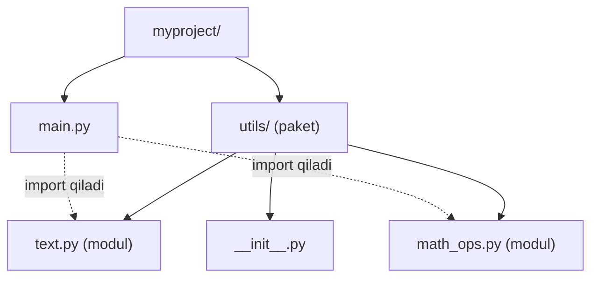
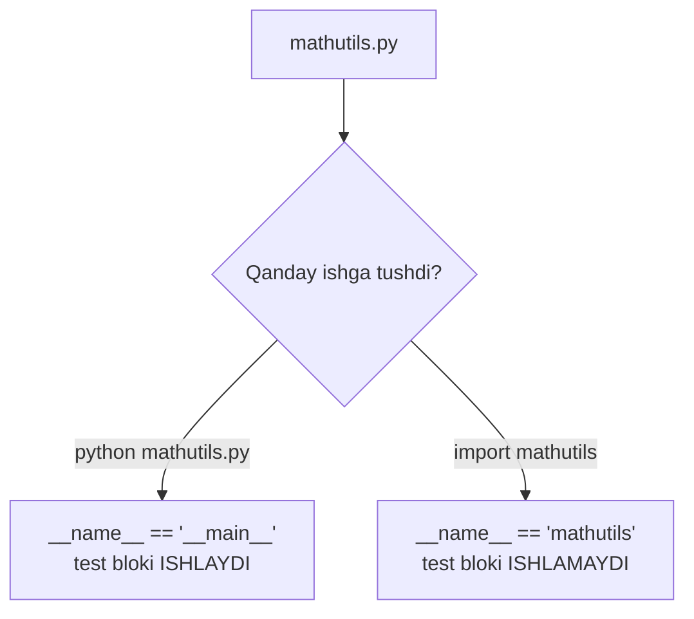
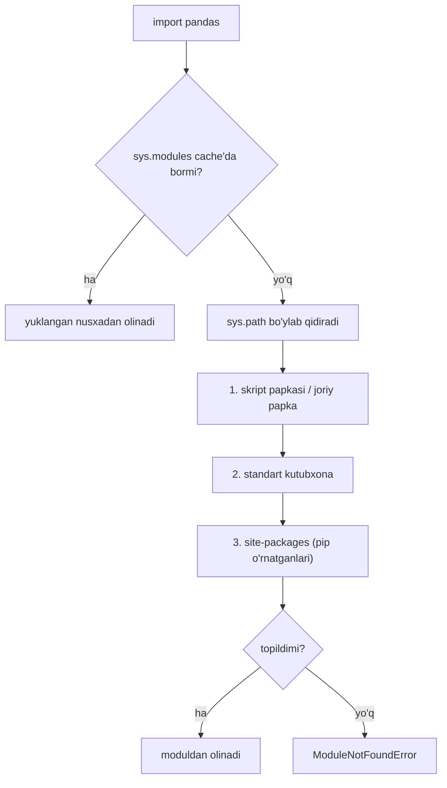
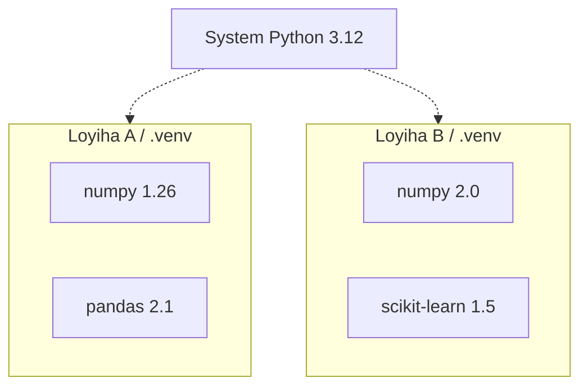

# 12. Modullar va paketlar

## Muammo: hamma kod bitta faylda

Tasavvur qil: ML loyihang o'sib, `main.py` fayling 3000 qatorga yetdi. Ma'lumot tozalash, model, grafik chizish — hammasi bir joyda. Bir funksiyani topish uchun uzoq varaqlaysan.

Yana yomoni: boshqa loyihada shu tozalash kodini yana ishlatmoqchisan — nusxa ko'chirasan. Nusxa buzildi, ikki joyda tuzatasan.

Kerak bo'lgani: kodni **mantiqiy fayllarga bo'lish** va kerak joyda **chaqirib olish**. Aynan shu — **modul** va **import**.

## Analogiya: kutubxona javonlari

Modul — kutubxonadagi bitta kitob. Paket (package) — o'sha kitoblar turgan javon. Kerakli kitobni (modulni) javondan olib, kerakli bobini (funksiyani) o'qiysan.

Butun kutubxonani uyingga tashib kelmaysan — faqat kerakligini **import** qilasan.

> **Analogiya chegarasi:** kitobni javondan olsang, javonda u qolmaydi. `import` esa nusxa olmaydi — modul **bir marta** xotiraga yuklanadi, keyingi importlar o'sha yuklangan nusxaga ishora qiladi (cache). Bu tezlik uchun muhim.

## Sodda ta'rif

**Modul** — bitta `.py` fayl (ichida funksiya, class, o'zgaruvchilar). **Paket** — ichida modullar joylashgan papka. **import** — boshqa moduldagi kodni joriy faylga olib kirish.

## Loyiha tuzilishi



`myproject/` — loyiha. `utils/` — paket (papka + `__init__.py`). `text.py`, `math_ops.py` — modullar. `main.py` ulardan foydalanadi.

## Import turlari

Uch xil asosiy import shakli bor. Standart `math` moduli misolida:

```python
# --- 1: butun modulni import ---
import math
print(math.sqrt(16))        # math. prefiksi bilan

# --- 2: aniq nomni import ---
from math import sqrt, pi
print(sqrt(25))             # prefiksisiz to'g'ridan-to'g'ri
print(pi)

# --- 3: nom o'zgartirish (as) ---
import math as m
print(m.sqrt(9))
```

Output:

```
4.0
5.0
3.141592653589793
3.0
```

Qaysi birini tanlash?

| Shakl | Qachon | Misol |
|---|---|---|
| `import x` | modul aniq ko'rinsin | `math.sqrt` |
| `from x import y` | bir-ikkita nom kerak | `from math import sqrt` |
| `import x as y` | uzun nom / kelishuv | `import numpy as np` |

> ML dunyosida kelishuvlar bor: `import numpy as np`, `import pandas as pd`, `import matplotlib.pyplot as plt`. Bularni doim shu ko'rinishda ishlat.

## `from x import *` dan qoching

```python
from math import *      # HAMMA nomni olib keladi — tavsiya etilmaydi
```

Bu barcha nomlarni joriy scope'ga to'kadi. Qaysi nom qayerdan kelganini bilib bo'lmaydi, o'z o'zgaruvchilaringni bosib o'tishi mumkin. Aniq import qil.

## Worked example: o'z modulingni yaratish

Ikki fayl yaratamiz. Birinchisi — `mathutils.py`:

```python
# --- fayl: mathutils.py ---
def add(a, b):
    return a + b

def sub(a, b):
    return a - b

print("mathutils yuklandi, __name__ =", __name__)
```

Ikkinchisi — `main.py`, u modulni import qiladi:

```python
# --- fayl: main.py ---
import mathutils

print(mathutils.add(10, 5))
print(mathutils.sub(10, 5))
```

`python main.py` ishga tushirilganda:

```
mathutils yuklandi, __name__ = mathutils
15
5
```

Diqqat: `mathutils.py` dagi `print(...)` ham ishladi. Chunki **import modulni to'liq bir marta bajaradi** — tepadagi barcha kod (funksiya e'lonlari, print) ijro etiladi.

## `__name__ == "__main__"` idiomasi

Yuqoridagi misolda muammo bor: `mathutils` import qilinganda uning `print`i ham ishladi. Ba'zan biz kodni faqat fayl **to'g'ridan-to'g'ri ishga tushganda** ishlashini xohlaymiz, import qilinganda emas.

Har modulda `__name__` degan maxsus o'zgaruvchi bor:
- Fayl **to'g'ridan-to'g'ri** ishga tushsa → `__name__ == "__main__"`
- Fayl **import qilinsa** → `__name__ == "modul nomi"` (masalan `"mathutils"`)



`mathutils.py` ni yangilaymiz:

```python
# --- fayl: mathutils.py ---
def add(a, b):
    return a + b

# --- bu blok FAQAT to'g'ridan-to'g'ri ishga tushganda ijro etiladi ---
if __name__ == "__main__":
    print("Test rejimi:")
    print(add(2, 3))
```

`python mathutils.py` ishga tushirilsa:

```
Test rejimi:
5
```

`import mathutils` qilinsa — `if` bloki **umuman ishlamaydi**, faqat `add` funksiyasi mavjud bo'ladi. Bu idioma modulni ham kutubxona, ham mustaqil skript qilib ishlatishga imkon beradi.

> **Go bilan taqqoslash:** Go'da bu vazifani `func main()` bajaradi — u faqat `package main` da ishlaydi. Python'da alohida `main` funksiyasi majburiy emas; `if __name__ == "__main__"` bloki o'sha rolni o'ynaydi.

## Paket — modullar papkasi

**Paket** — ichida modullar bo'lgan papka. Tarixan papkani paket qiladigan belgi — `__init__.py` fayli (bo'sh bo'lsa ham bo'ladi).

```
utils/
    __init__.py       <- bu papkani paket qiladi
    text.py
    math_ops.py
```

Paketdan import:

```python
# --- to'liq yo'l bilan ---
from utils.text import clean_text

# --- modulni butun olish ---
from utils import math_ops
math_ops.multiply(2, 3)

# --- to'liq nom bilan ---
import utils.text
utils.text.clean_text("...")
```

`__init__.py` paket birinchi import qilinganda ishlaydi. Uni bo'sh qoldirish yoki paketning asosiy nomlarini shu yerdan ochiq qilish mumkin.

## Import qidiruv yo'li — sys.path

Python `import pandas` deganda modulni qayerdan qidiradi? Javob — **sys.path** ro'yxatidagi papkalar bo'ylab, tartib bilan:



`sys.path` ni ko'rish mumkin:

```python
import sys
for p in sys.path[:3]:
    print(p)
```

Namuna output (mashinaga qarab o'zgaradi):

```
/Users/dev/myproject
/usr/lib/python3.12
/Users/dev/myproject/.venv/lib/python3.12/site-packages
```

Modul topilmasa `ModuleNotFoundError: No module named 'pandas'` — demak u `sys.path` dagi hech bir papkada yo'q (ko'pincha `pip install` qilinmagan yoki noto'g'ri venv).

## pip — paket o'rnatuvchi

**PyPI** (Python Package Index) — ochiq paketlar ombori (pypi.org). **pip** — undan paket yuklab, o'rnatadigan asbob.

```
$ pip install requests
Collecting requests
  ...
Successfully installed requests-2.32.3

$ pip list
Package    Version
---------- -------
pip        24.0
requests   2.32.3

$ pip uninstall requests
```

O'rnatgach, kodda oddiy import qilasan:

```python
import requests   # endi ishlaydi, chunki site-packages'da bor
```

## venv — nega HAR loyihaga alohida

Endi eng muhim tushuncha. Faraz qil: A loyihang `numpy 1.26` talab qiladi, B loyihang `numpy 2.0`. Ikkalasini bitta tizim Python'iga o'rnatsang — ular urishadi. Bittasi ishlaydi, ikkinchisi sinadi.

**venv** (virtual environment) — har loyiha uchun alohida, izolyatsiya qilingan Python muhiti. Har birining o'z `site-packages` papkasi bor.



Ishlatish:

```
$ cd myproject
$ python -m venv .venv          # .venv papkasini yaratadi
$ source .venv/bin/activate     # muhitni yoqadi (mac/Linux)
(.venv) $ pip install numpy     # faqat SHU loyihaga o'rnatiladi
(.venv) $ deactivate            # muhitdan chiqish
```

`(.venv)` prefiksi terminalda muhit yoqilganini ko'rsatadi. Endi `pip install` faqat shu loyihaga tegadi, tizimni ifloslantirmaydi.

> **Oltin qoida:** har yangi loyihada birinchi ish — `python -m venv .venv` va uni yoqish. Tizim Python'iga to'g'ridan-to'g'ri paket o'rnatma.

## requirements.txt — bog'liqliklar ro'yxati

Loyihang qaysi paketlarga, qaysi versiyada bog'liqligini bir faylda qayd etasan. Bu boshqa dasturchi (yoki server) aynan shu muhitni tiklashi uchun:

```
$ pip freeze > requirements.txt      # joriy paketlarni faylga yozadi
```

Fayl ichi:

```
numpy==2.0.1
pandas==2.2.2
requests==2.32.3
```

Boshqa joyda tiklash:

```
$ python -m venv .venv
$ source .venv/bin/activate
(.venv) $ pip install -r requirements.txt
```

`==` aniq versiyani qotiradi — bu **reproducibility** (takrorlanuvchanlik) uchun, ML tajribalarida ayniqsa muhim.

## Go bilan solishtirish — nega Go'da venv yo'q

Go'chi uchun venv g'alati tuyulishi mumkin: "nega har loyihaga alohida muhit kerak?" Sabab — dizayn farqi.

| Tushuncha | Python | Go |
|---|---|---|
| Kod birligi | modul (`.py` fayl) | paket (papka) |
| Bog'liqlik fayli | `requirements.txt` | `go.mod` |
| Ombor | PyPI | Go module proxy / VCS |
| O'rnatuvchi | `pip install` | `go get` |
| Versiya izolyatsiyasi | **venv** (majburiy amalda) | modul o'zi hal qiladi |
| Kirish nuqtasi | `if __name__ == "__main__"` | `func main()` |
| Nom o'zgartirish | `import x as y` | `import y "path/x"` |

Go'da har modulning `go.mod` fayli aniq versiyalarni qayd qiladi va build o'sha versiyalarni **global cache**dan oladi — loyihalar bir-biriga xalaqit bermaydi. Shuning uchun venv kabi alohida muhit shart emas.

Python'da esa paketlar sukut bo'yicha **umumiy** `site-packages` ga tushadi — bir loyiha o'rnatgani boshqasini buzishi mumkin. **venv** aynan shu muammoni to'g'irlaydi: har loyihaga o'z `site-packages`.

## 🤔 O'ylab ko'r

`mathutils.py` ichida quyidagi kod bor:

```python
def add(a, b):
    return a + b

print("Salom!")

if __name__ == "__main__":
    print("Test:", add(2, 3))
```

`main.py` da `import mathutils` qilib ishga tushirsak, ekranga nima chiqadi?

<details>
<summary>💡 Javobni ko'rish</summary>

Faqat:

```
Salom!
```

Sabab: `import mathutils` modulni yuklaydi va uning tepasidagi barcha kodni bajaradi — `def add` (e'lon) va `print("Salom!")` ishlaydi. Lekin `if __name__ == "__main__"` bloki ishlamaydi, chunki import qilinganda `__name__` `"mathutils"` bo'ladi, `"__main__"` emas. Shuning uchun `Test: 5` chiqmaydi.

Agar `python mathutils.py` deb to'g'ridan-to'g'ri ishga tushirsak — `Salom!` va `Test: 5` ikkalasi ham chiqardi.
</details>

## ⚠️ Ko'p uchraydigan xatolar

**1. venv'siz tizim Python'iga o'rnatish**

Noto'g'ri: har loyihada `pip install` ni to'g'ridan-to'g'ri qilish — versiyalar urishadi.
To'g'risi: har loyihada `python -m venv .venv` yaratib, yoqib ishlash.

**2. `if __name__ == "__main__"` ni unutish**

Noto'g'ri: skript kodini modul tepasiga to'g'ridan yozish — import qilinganda beixtiyor ishlaydi.
To'g'risi: ishga tushirish kodini `if __name__ == "__main__":` blokiga o'rash.

**3. `from x import *`**

Noto'g'ri: barcha nomlarni to'kadi, kelib chiqishini yashiradi.
To'g'risi: aniq import — `from x import needed_name`.

**4. Modul nomini standart kutubxona bilan bir xil qo'yish**

Noto'g'ri: faylni `math.py` yoki `random.py` deb nomlash — o'z fayling standart modulni bosib o'tadi, g'alati xatolar chiqadi.
To'g'risi: o'ziga xos nom tanla — `my_math.py`.

**5. ModuleNotFoundError'ni noto'g'ri talqin qilish**

Noto'g'ri: paket o'rnatilgan deb o'ylab, boshqa venv'da ishlash.
To'g'risi: `(.venv)` yoqilganini va `pip list` da paket borligini tekshir.

## Xulosa

- **Modul** — `.py` fayl; **paket** — modullar papkasi (`__init__.py` bilan)
- Uch import shakli: `import x`, `from x import y`, `import x as y`
- `from x import *` dan qoch — aniq import qil
- Import modulni **bir marta to'liq bajaradi** va cache'laydi
- `if __name__ == "__main__"` — kod faqat to'g'ridan-to'g'ri ishga tushganda ishlasin uchun
- `sys.path` — Python modullarni qidiradigan papkalar ro'yxati
- **pip** PyPI'dan paket o'rnatadi; **venv** har loyihaga alohida izolyatsiya beradi
- `requirements.txt` bog'liqliklarni qotiradi (reproducibility)
- Go'dan farq: Python paketlari umumiy `site-packages` ga tushadi — shuning uchun venv kerak

## 🧠 Eslab qol

- Modul = `.py` fayl; paket = papka + `__init__.py`.
- `import` modulni bir marta to'liq bajaradi va cache'laydi.
- `if __name__ == "__main__"` = "faqat to'g'ridan-to'g'ri ishga tushganda".
- Har loyihaga alohida `venv` — versiya urishmasin.
- `requirements.txt` = qotirilgan bog'liqliklar ro'yxati.

## ✅ O'z-o'zini tekshir

**1.** `import x` va `from x import y` orasidagi farq nima? Qachon qaysi biri afzal?

<details>
<summary>Javob</summary>

`import x` butun modulni oladi, nomlarga `x.` prefiksi bilan murojaat qilasan (`math.sqrt`) — kelib chiqishi ko'rinadi. `from x import y` faqat `y` nomni oladi, prefiksisiz ishlatasan (`sqrt`) — bir-ikki nom kerak bo'lganda qulay. Ko'p nom kerak bo'lsa yoki aniqlik muhim bo'lsa `import x` afzal.
</details>

**2.** Modul import qilinganda `if __name__ == "__main__"` bloki nega ishlamaydi?

<details>
<summary>Javob</summary>

Import qilinganda `__name__` moduls nomiga (masalan `"mathutils"`) teng bo'ladi, `"__main__"` ga emas. Shart yolg'on, shuning uchun blok o'tkazib yuboriladi. `"__main__"` faqat fayl to'g'ridan-to'g'ri (`python mathutils.py`) ishga tushirilganda beriladi.
</details>

**3.** Nega har loyihaga alohida venv kerak, Go'da esa bunday muammo yo'q?

<details>
<summary>Javob</summary>

Python paketlari sukut bo'yicha umumiy `site-packages` ga o'rnatiladi — A loyiha `numpy 1.26`, B loyiha `numpy 2.0` talab qilsa, ular urishadi. venv har loyihaga alohida `site-packages` beradi. Go'da esa har modulning `go.mod` fayli aniq versiyalarni qayd qiladi va global cache'dan oladi — izolyatsiya modul tizimining o'zida bor.
</details>

**4.** `ModuleNotFoundError: No module named 'pandas'` xatosining eng ehtimoliy sabablari nima?

<details>
<summary>Javob</summary>

Paket `pip install` qilinmagan, yoki noto'g'ri venv yoqilgan (paket boshqa muhitda o'rnatilgan), yoki modul nomi noto'g'ri yozilgan. Tekshirish: `(.venv)` yoqilganmi va `pip list` da `pandas` bormi.
</details>

**5.** `requirements.txt` nima uchun kerak va uni qanday yaratasan/ishlatasan?

<details>
<summary>Javob</summary>

Loyihaning aniq bog'liqliklarini (paket + versiya) qayd qiladi, shunda boshqa joyda bir xil muhit tiklanadi (reproducibility). Yaratish: `pip freeze > requirements.txt`. Tiklash: `pip install -r requirements.txt`.
</details>

## 🛠 Amaliyot

**1. Oson (Modify)** — `mathutils.py` ga `multiply(a, b)` funksiya qo'sh va `if __name__ == "__main__"` blokida uni test qil (`multiply(4, 5)` -> 20). Import qilinganda test ishlamasligiga ishonch hosil qil.

<details>
<summary>Hint</summary>

`def multiply(a, b): return a * b`. Test blokiga `print(multiply(4, 5))` qo'sh — bu faqat `python mathutils.py` da ishlaydi.
</details>

**2. O'rta (faded example)** — Kichik paket qur. Skeletonni to'ldir:

```
shapes/
    __init__.py
    circle.py       # TODO: area(r) -> 3.14159 * r * r
main.py             # TODO: shapes.circle dan area'ni import qilib chaqir
```

`main.py` ichi:

```python
# TODO: circle modulidan area'ni import qil
...
print(area(2))      # 12.56636
```

<details>
<summary>Hint</summary>

`circle.py` da: `def area(r): return 3.14159 * r * r`. `__init__.py` bo'sh bo'lishi mumkin. `main.py` da: `from shapes.circle import area`. Ikkovi ham `main.py` bilan bir papkada bo'lsin.
</details>

**3. Qiyin (Make)** — Yangi loyiha yarat: venv o'rnat, unga `requests` paketini o'rnat, `requirements.txt` yarat, so'ng `requests` orqali biror ochiq API'dan (masalan `https://api.github.com`) status kodini chop etuvchi `main.py` yoz.

<details>
<summary>Hint</summary>

`python -m venv .venv` → `source .venv/bin/activate` → `pip install requests` → `pip freeze > requirements.txt`. `main.py`: `import requests; r = requests.get("https://api.github.com"); print(r.status_code)` — `200` chiqishi kerak.
</details>

## 🔁 Takrorlash

**Bog'liq oldingi mavzular:**
- 10 — Funksiyalar (modul ichida funksiyalar joylashadi)
- 11 — Scope va closure (modul o'z scope'ini yaratadi; `sys.path` global qidiruv)

**Takrorlash jadvali:**
- **Ertaga** — `import x` vs `from x import y` farqini misolda yoz.
- **3 kundan keyin** — `__name__ == "__main__"` idiomasini yoddan tushuntir.
- **1 haftadan keyin** — nega venv kerakligini va Go modul tizimidan farqini takrorla.

**Feynman testi:** modul, paket va venv nima uchun kerakligini kod so'zlaridan foydalanmasdan 3 jumlada tushuntir. Ipucha: "kodni fayllarga bo'lish", "kutubxona javonlari", "har loyihaga o'z muhiti".
