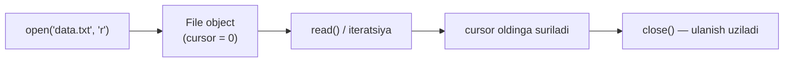
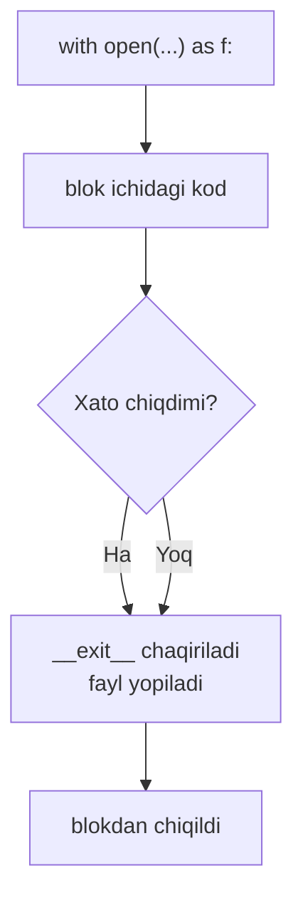
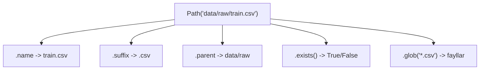

# 13. Fayllar bilan ishlash

## Nima uchun kerak? (Hook)

ML Engineer bo'lishning birinchi kuni sizni fayl kutib turadi: `train.csv`, `config.json`, `model.bin`. Dataset — bu deyarli har doim diskdagi fayl. Uni o'qimasangiz, model o'rgata olmaysiz.

Go'da siz buni bilasiz: `os.Open`, `defer f.Close()`, `bufio.Scanner`. Python'da ham xuddi shu ish bor, lekin sintaksis ancha qisqa va bitta muhim konstruksiya — `with` — sizni Go'dagi eng ko'p unutiladigan xatodan avtomatik himoya qiladi.

Bu darsda faylni ochish, o'qish, yozish, `with` nega majburiy ekani, `pathlib` (zamonaviy yo'l boshqaruvi) va `json`/`csv` modullarini o'rganamiz.

---

## Analogiya: fayl — bu daftar, cursor — barmog'ingiz

Faylni ochish — daftarni ochish kabi. `open()` sizga **file object** (ochiq daftar) beradi. Ichida bitta **cursor** (barmoq) bor — hozir qaysi joyni o'qiyotganingizni ko'rsatadi. O'qigan sari barmoq oldinga suriladi.

**Analogiya chegarasi:** oddiy daftardan farqli, `open(..., "w")` rejimida ochsangiz, daftar butunlay **o'chib** ketadi va bo'sh varaqdan boshlaysiz. Shuning uchun rejimni (`mode`) tanlash — eng muhim qaror.

> Fayl obyekti — bu diskdagi baytlar ustidagi "oqim" (stream); siz uni boshidan oxirigacha bir marta o'qib chiqasiz, xuddi magnitofon lentasi kabi.

---

## Sodda ta'rif

**`open(path, mode, encoding)`** — bu diskdagi faylga ulanish (file object) yaratadi; `mode` nima qilishingizni (o'qish/yozish), `encoding` esa baytlarni harflarga qanday aylantirishni belgilaydi.



---

## Rejimlar (mode)

Rejim — bu faylni **qanday maqsadda** ochayotganingiz. Ikki qism: asosiy harf (nima qilish) + qo'shimcha (`b` = binary, `+` = ikkalasi).

| Mode | Ma'nosi | Fayl yo'q bo'lsa | Mavjud fayl bilan |
| --- | --- | --- | --- |
| `"r"` | read (o'qish) | xato (`FileNotFoundError`) | boshdan o'qiydi |
| `"w"` | write (yozish) | yangi yaratadi | **hammasini o'chiradi** |
| `"a"` | append (qo'shish) | yangi yaratadi | oxiriga qo'shadi |
| `"x"` | exclusive create | yangi yaratadi | xato (`FileExistsError`) |
| `"b"` | binary rejim | — | `bytes` qaytaradi |
| `"t"` | text rejim (default) | — | `str` qaytaradi |

> `"w"` — eng xavfli rejim. U hech nima so'ramasdan eski ma'lumotni o'chiradi. Datasetni tasodifan `"w"` bilan ochsangiz, u yo'qoladi.

---

## `with` statement — nega MAJBURIY

### Muammo: Go'dagi tanish og'riq

Go'da har ochilgan faylni yopish sizning zimmangizda:

```go
// --- Go: qo'lda yopish kerak ---
f, err := os.Open("data.txt")
if err != nil {
    log.Fatal(err)
}
defer f.Close()        // buni unutsangiz — resurs sizib ketadi (leak)
data, _ := io.ReadAll(f)
```

`defer f.Close()` ni yozishni unutsangiz, fayl ochiq qoladi. Ko'p fayl ochsangiz — OS'ning file descriptor limiti tugaydi.

### Yechim: Python'ning `with` bloki

```python
# --- Python: with avtomatik yopadi ---
with open("data.txt", "r", encoding="utf-8") as f:
    data = f.read()
# shu yerda fayl AVTOMATIK yopiladi — hatto xato chiqsa ham
print(data)
```

`with` bloki tugashi bilan (yoki ichida xato chiqsa ham) fayl kafolatlangan holda yopiladi. Bu Go'dagi `defer f.Close()` ning aynan o'zi, lekin **yozishni unutib bo'lmaydi** — chunki `with` ning o'zi yopishni bajaradi.



| Jihat | Go | Python |
| --- | --- | --- |
| Yopish mexanizmi | `defer f.Close()` | `with ... as f:` |
| Yozishni unutish mumkinmi? | Ha (leak xavfi) | Yo'q, `with` majbur qiladi |
| Xatoda ham yopiladimi? | Ha (defer) | Ha (`__exit__`) |

---

## O'qish usullari

Bitta faylni o'qishning bir necha yo'li bor. Har biri boshqa vaziyat uchun.

```python
# --- 1-qadam: butun faylni bitta str'ga o'qish ---
with open("notes.txt", "r", encoding="utf-8") as f:
    hammasi = f.read()          # butun fayl -> bitta katta str

# --- 2-qadam: bitta qatorni o'qish ---
with open("notes.txt", "r", encoding="utf-8") as f:
    birinchi = f.readline()     # faqat 1-qator (\n bilan)

# --- 3-qadam: barcha qatorlarni ro'yxatga ---
with open("notes.txt", "r", encoding="utf-8") as f:
    qatorlar = f.readlines()    # list[str], har element = bir qator
```

### Eng yaxshi usul: fayl ustida iteratsiya

Katta dataset (masalan, 10 GB log) `read()` bilan xotiraga sig'maydi. Fayl obyektining o'zi ustida `for` yuritish — **bir vaqtda faqat bitta qatorni** xotiraga oladi:

```python
# --- Fayl ustida iteratsiya: xotira-tejamkor (streaming) ---
with open("big_dataset.txt", "r", encoding="utf-8") as f:
    for qator in f:                     # bitta-bitta qator
        qator = qator.rstrip("\n")      # oxiridagi \n ni olib tashlash
        print(qator)
```

Bu Go'dagi `bufio.Scanner` bilan `for scanner.Scan()` ning to'liq muqobili — ikkalasi ham faylni oqim (stream) sifatida o'qiydi.

| Usul | Nima qaytaradi | Qachon |
| --- | --- | --- |
| `read()` | butun fayl (`str`) | kichik fayl |
| `readline()` | bitta qator | qatorma-qator, qo'lda |
| `readlines()` | `list[str]` | kichik fayl, indeks kerak |
| `for line in f` | qatorma-qator, lazy | **katta fayl, tavsiya etiladi** |

---

## Yozish

```python
# --- 1-qadam: 'w' rejimida yozish (eski matn o'chadi) ---
with open("out.txt", "w", encoding="utf-8") as f:
    f.write("Salom\n")          # write \n ni O'ZI qo'shmaydi!
    f.write("Dunyo\n")

# --- 2-qadam: bir nechta qatorni birdan ---
qatorlar = ["a\n", "b\n", "c\n"]
with open("out.txt", "w", encoding="utf-8") as f:
    f.writelines(qatorlar)      # ro'yxatni yozadi, \n avtomatik EMAS

# --- 3-qadam: 'a' rejimida oxiriga qo'shish ---
with open("out.txt", "a", encoding="utf-8") as f:
    f.write("qo'shildi\n")
```

**Output** (`out.txt` mazmuni):

```
a
b
c
qo'shildi
```

> `print()` avtomatik `\n` qo'shadi, lekin `f.write()` qo'shmaydi. Har qatorni yangi qatorga tushirmoqchi bo'lsangiz, `\n` ni o'zingiz yozasiz.

---

## Text vs Binary rejim

Bu ML uchun juda muhim: rasm, audio, `.npy`, model checkpoint — hammasi **binary**.

| Jihat | Text (`"r"`, `"w"`) | Binary (`"rb"`, `"wb"`) |
| --- | --- | --- |
| Qaytaradi/qabul qiladi | `str` | `bytes` |
| `encoding` kerakmi | Ha (harflarni dekodlaydi) | Yo'q (xom baytlar) |
| Ishlatiladi | matn, `.txt`, `.csv`, `.json` | rasm, model, `.npy`, audio |

```python
# --- Text: harflar (str) ---
with open("hello.txt", "w", encoding="utf-8") as f:
    f.write("salom")

# --- Binary: xom baytlar (bytes) ---
with open("hello.txt", "rb") as f:
    xom = f.read()
print(xom)          # b'salom' -> bytes, harf emas
print(type(xom))    # <class 'bytes'>
```

**Output:**

```
b'salom'
<class 'bytes'>
```

---

## Encoding — nega har doim `encoding="utf-8"`

Fayl diskda **baytlar** ko'rinishida yotadi. `encoding` — bu baytlarni harflarga aylantirish qoidasi. `"salom"` UTF-8'da bir xil, lekin `"salom"` ichidagi maxsus harflar boshqa encoding'da buziladi.

**Muammo:** `encoding` bermasangiz, Python OS'ning "locale" encoding'ini oladi. Linux/Mac'da bu odatda UTF-8, lekin **Windows'da yo'q** — u yerda `cp1252`. Natijada kod bir kompyuterda ishlaydi, boshqasida buziladi.

> Oltin qoida: matn faylini ochganda **doim** `encoding="utf-8"` yozing. Bu kodingizni har platformada bir xil ishlashini kafolatlaydi (rasman PEP 597 tavsiyasi).

Go'da bu muammo yo'q, chunki Go string'lari doim UTF-8 baytlar. Python'da esa `str` — bu Unicode kod nuqtalari, shuning uchun dekodlash qadami bor.

---

## `pathlib` — yo'llar bilan zamonaviy ishlash

### Muammo: eski `os.path` uslubi

Eski kodda yo'llar `str` sifatida qo'lda yasaladi:

```python
# --- ESKI usul: os.path (xatoga moyil) ---
import os
path = os.path.join("data", "raw", "train.csv")
if os.path.exists(path):
    print(os.path.basename(path))
```

Bu ishlaydi, lekin har amal alohida funksiya, o'qish qiyin.

### Yechim: `Path` obyekti

`pathlib.Path` — yo'lni obyekt qiladi. `/` operatori yo'llarni ulaydi (platformaga mos slash bilan):

```python
# --- ZAMONAVIY usul: pathlib ---
from pathlib import Path

# --- 1-qadam: yo'lni / bilan qurish ---
path = Path("data") / "raw" / "train.csv"
print(path)                 # data/raw/train.csv

# --- 2-qadam: tekshirish va qismlarga ajratish ---
print(path.name)            # train.csv
print(path.suffix)          # .csv
print(path.parent)          # data/raw
print(path.exists())        # False (fayl haqiqatan yo'q bo'lsa)
```

**Output:**

```
data/raw/train.csv
train.csv
.csv
data/raw
False
```

### `glob` — pattern bo'yicha fayllarni topish

ML'da tez-tez kerak: "papkadagi barcha `.csv` fayllarni ol".

```python
from pathlib import Path

# --- Papkadagi barcha .csv fayllar ---
for csv_file in Path("data").glob("*.csv"):
    print(csv_file)

# --- Rekursiv (ichki papkalar ham): ** ---
all_images = list(Path("dataset").glob("**/*.png"))
print(len(all_images), "ta rasm topildi")
```

`Path` yana qulay qisqa yo'llar beradi: `path.read_text(encoding="utf-8")` va `path.write_text("matn", encoding="utf-8")` — `open` yozmasdan darrov o'qish/yozish.



---

## `json` moduli — konfig va ma'lumot almashinuv

JSON — ML'da hamma joyda: `config.json`, API javoblari, model metadata. `json` moduli 4 ta asosiy funksiya beradi.

| Funksiya | `s` (string) yoki fayl | Yo'nalish |
| --- | --- | --- |
| `json.loads(s)` | **s**tring'dan | JSON matn -> Python obyekt |
| `json.load(f)` | fayldan | JSON fayl -> Python obyekt |
| `json.dumps(obj)` | **s**tring'ga | Python obyekt -> JSON matn |
| `json.dump(obj, f)` | faylga | Python obyekt -> JSON fayl |

Eslab qolish oson: oxiridagi **`s`** = **s**tring bilan ishlaydi; `s`siz = **fayl** bilan.

```python
import json

# --- 1-qadam: Python dict -> JSON fayl ---
config = {"model": "bert", "layers": 12, "lr": 0.001, "til": "o'zbek"}
with open("config.json", "w", encoding="utf-8") as f:
    json.dump(config, f, ensure_ascii=False, indent=2)

# --- 2-qadam: JSON fayl -> Python dict ---
with open("config.json", "r", encoding="utf-8") as f:
    loaded = json.load(f)
print(loaded["model"], loaded["layers"])
```

**Output:**

```
bert 12
```

**`config.json` fayl mazmuni:**

```json
{
  "model": "bert",
  "layers": 12,
  "lr": 0.001,
  "til": "o'zbek"
}
```

### `ensure_ascii` — nega muhim

Default holatda `json.dumps` barcha ASCII bo'lmagan harflarni `\uXXXX` ga aylantiradi:

```python
import json
data = {"soz": "o'zbekcha"}

print(json.dumps(data))                       # ensure_ascii=True (default)
print(json.dumps(data, ensure_ascii=False))   # o'qiladigan holat
```

**Output:**

```
{"soz": "o'zbekcha"}
{"soz": "o'zbekcha"}
```

> `ensure_ascii=False` bermasangiz, maxsus harflar `॑` kabi buzilgan ko'rinishda saqlanadi. O'zbekcha/boshqa tildagi matn bilan ishlaganda **doim** `ensure_ascii=False` yozing.

---

## `csv` moduli — jadval ko'rinishidagi dataset

CSV (comma-separated values) — eng keng tarqalgan dataset formati. `csv` moduli qatorlarni to'g'ri bo'lib beradi (vergul ichidagi qo'shtirnoqlarni ham hisobga oladi).

```python
import csv

# --- 1-qadam: CSV yozish ---
with open("students.csv", "w", encoding="utf-8", newline="") as f:
    writer = csv.writer(f)
    writer.writerow(["ism", "yosh"])     # sarlavha
    writer.writerow(["Ali", 20])
    writer.writerow(["Vali", 22])

# --- 2-qadam: DictReader bilan o'qish (har qator = dict) ---
with open("students.csv", "r", encoding="utf-8", newline="") as f:
    reader = csv.DictReader(f)
    for row in reader:
        print(row["ism"], "->", row["yosh"])
```

**Output:**

```
Ali -> 20
Vali -> 22
```

> CSV bilan ishlaganda `newline=""` argumentini bering. Bu Windows'da qatorlar orasida bo'sh qator paydo bo'lishini oldini oladi (rasmiy tavsiya).

Amalda ML'da CSV'ni ko'pincha `pandas.read_csv()` bilan o'qiysiz, lekin `csv` moduli — kutubxonalarsiz, sof standart yechim va uning ostida nima borligini bilish muhim.

---

## 🤔 O'ylab ko'r

Quyidagi kod fayl mazmunini o'zgartirmoqchi. Ishga tushirsak, `data.txt` da nima qoladi?

```python
with open("data.txt", "w", encoding="utf-8") as f:
    f.write("yangi satr")
# oldin data.txt da 500 qator ma'lumot bor edi
```

<details>
<summary>💡 Javobni ko'rish</summary>

`data.txt` da faqat `yangi satr` qoladi — eski 500 qator **butunlay o'chib ketadi**.

Sabab: `"w"` rejimi faylni ochishning o'zida uni bo'shatadi (truncate). Eski ma'lumotni saqlab, oxiriga qo'shmoqchi bo'lsangiz `"a"` (append) rejimini ishlatish kerak edi. Bu Python fayl ishlashidagi eng ko'p uchraydigan ma'lumot yo'qotish xatosi.

</details>

---

## ⚠️ Ko'p uchraydigan xatolar

**1. `with`siz ochish va yopishni unutish**

- Noto'g'ri tasavvur: "fayl o'zi yopiladi-ku".
- Nega noto'g'ri: `f = open(...)` faylni ochib qoldiradi; xato chiqsa `f.close()` hech qachon bajarilmaydi -> file descriptor leak.
- To'g'risi: doim `with open(...) as f:` ishlating.

**2. `"w"` ni `"a"` o'rniga ishlatish**

- Noto'g'ri tasavvur: "yozish rejimi ma'lumotga qo'shadi".
- Nega noto'g'ri: `"w"` avval faylni bo'shatadi.
- To'g'risi: qo'shish uchun `"a"`, yangi fayl uchun `"w"` yoki xavfsizlik uchun `"x"`.

**3. `encoding` ni tushirib qoldirish**

- Noto'g'ri tasavvur: "UTF-8 har doim default".
- Nega noto'g'ri: Windows'da default `cp1252`; maxsus harflar buziladi.
- To'g'risi: `encoding="utf-8"` ni doim yozing.

**4. `f.write()` dan keyin `\n` kutish**

- Noto'g'ri tasavvur: `write` `print` kabi yangi qatorga o'tadi.
- Nega noto'g'ri: `write` faqat berilgan matnni yozadi, `\n` qo'shmaydi.
- To'g'risi: yangi qator kerak bo'lsa `\n` ni o'zingiz qo'shing.

**5. `ensure_ascii=False` ni unutish**

- Natija: o'zbekcha matn `\uXXXX` ko'rinishida buziladi.
- To'g'risi: mahalliy til matnida `json.dump(..., ensure_ascii=False)`.

---

## Xulosa

- `open(path, mode, encoding)` faylga ulanadi; `mode` (`r`/`w`/`a`/`b`) niyatingizni belgilaydi.
- `with open(...) as f:` — faylni avtomatik yopadi; Go'dagi `defer f.Close()` ning "unutib bo'lmaydigan" versiyasi.
- Katta fayllarni `for line in f` bilan oqim (stream) sifatida o'qing — xotira tejaladi.
- `"w"` faylni bo'shatadi; qo'shish uchun `"a"`.
- Matn uchun doim `encoding="utf-8"`; rasm/model uchun binary (`"rb"`/`"wb"`).
- `pathlib.Path` — yo'llar bilan ishlashning zamonaviy, xavfsiz usuli (`/`, `.exists()`, `.glob()`).
- `json`: `load/loads` o'qish, `dump/dumps` yozish; mahalliy til uchun `ensure_ascii=False`.
- `csv.DictReader` har qatorni `dict` qilib beradi; `newline=""` ni unutmang.

---

## 🧠 Eslab qol

- `with` = avtomatik `close`, hatto xatoda ham.
- `"w"` = o'chirish; `"a"` = qo'shish.
- Matn = `str` + `encoding`; binary = `bytes`, encoding yo'q.
- `s` bilan tugagan `json` funksiyasi (`loads`/`dumps`) = **s**tring bilan ishlaydi.
- Yo'l qurishda `Path` va `/` operatoridan foydalan.

---

## ✅ O'z-o'zini tekshir

**1.** `"w"` va `"a"` rejimlari mavjud faylni ochganda nima farq qiladi?

<details>
<summary>Javob</summary>

`"w"` faylni ochishning o'zida butunlay bo'shatadi (eski ma'lumot yo'qoladi), keyin boshdan yozadi. `"a"` esa eski ma'lumotni saqlab, cursor'ni oxiriga qo'yadi va yangi yozganingiz oxiriga qo'shiladi.

</details>

**2.** Nega 10 GB'lik faylni `f.read()` bilan emas, `for line in f` bilan o'qish kerak?

<details>
<summary>Javob</summary>

`f.read()` butun faylni bir vaqtda xotiraga (RAM) yuklaydi — 10 GB RAM kerak bo'ladi va ehtimol `MemoryError` chiqadi. `for line in f` esa bir vaqtda faqat bitta qatorni xotiraga oladi (lazy/streaming), shuning uchun fayl hajmi qanchalik katta bo'lsa ham ishlaydi.

</details>

**3.** `json.dump` va `json.dumps` orasidagi farq nima?

<details>
<summary>Javob</summary>

`json.dump(obj, f)` obyektni to'g'ridan-to'g'ri **faylga** yozadi. `json.dumps(obj)` obyektni **string** (str) qilib qaytaradi (fayl kerak emas). Oxiridagi `s` = **s**tring deb eslab qolish oson.

</details>

**4.** `with` bloki Go'dagi qaysi konstruksiyaga o'xshaydi va asosiy afzalligi nima?

<details>
<summary>Javob</summary>

`with` — Go'dagi `defer f.Close()` ga o'xshaydi: ikkalasi ham blok/funksiya tugaganda (yoki xato chiqqanda) resursni yopadi. Afzalligi: `with` da yopishni **yozish shart emas**, u avtomatik bajariladi, shuning uchun Go'dagi kabi `Close()` ni unutib resurs leak qilish mumkin emas.

</details>

**5.** `encoding="utf-8"` ni yozmaslik qanday yashirin xatoga olib keladi?

<details>
<summary>Javob</summary>

`encoding` berilmasa Python OS locale encoding'ini oladi. Linux/Mac'da bu odatda UTF-8, lekin Windows'da `cp1252`. Natijada kod sizning kompyuteringizda ishlaydi, lekin boshqa platformada maxsus harflarni buzadi yoki `UnicodeDecodeError` beradi. Shuning uchun doim `encoding="utf-8"` yoziladi.

</details>

---

## 🛠 Amaliyot

### Oson (Modify)

Quyidagi kod faylni yaratib yozadi. Uni `"w"` dan `"a"` ga o'zgartiring va kodni ikki marta ishga tushiring. Fayl ichida nechta qator paydo bo'lishini kuzating.

```python
with open("log.txt", "w", encoding="utf-8") as f:
    f.write("bir marta ishga tushdi\n")
```

<details>
<summary>💡 Hint</summary>

`"w"` ni `"a"` ga almashtiring. Endi har ishga tushirganda yangi qator qo'shiladi (o'chirilmaydi). Ikki marta ishga tushirsangiz — 2 qator bo'ladi.

</details>

### O'rta (faded example — to'ldiring)

`numbers.txt` faylida har qatorda bitta son bor. Ularning yig'indisini hisoblang. Katta fayl bo'lishi mumkin, shuning uchun oqim (stream) usulida o'qing.

```python
total = 0
# TODO: faylni with va encoding bilan oching
with ______ as f:
    for line in f:
        # TODO: qatorni int'ga aylantirib total'ga qo'shing
        # (rstrip bilan \n ni tozalang)
        total += ______
print("Yig'indi:", total)
```

<details>
<summary>💡 Hint</summary>

```python
total = 0
with open("numbers.txt", "r", encoding="utf-8") as f:
    for line in f:
        total += int(line.rstrip("\n"))
print("Yig'indi:", total)
```

Bo'sh qatorlar bo'lishi mumkinligini hisobga oling — kerak bo'lsa `if line.strip():` bilan tekshiring.

</details>

### Qiyin (Make)

Noldan yozing: `students.csv` (ustunlar: `ism`, `yosh`, `guruh`) faylini o'qib, har guruhda nechta talaba borligini `dict` ga yig'ing, natijani `group_counts.json` fayliga (o'zbekcha to'g'ri ko'rinsin) saqlang.

<details>
<summary>💡 Hint</summary>

Qadamlar:
1. `csv.DictReader` bilan CSV'ni o'qing.
2. `counts = {}` yasab, `counts[row["guruh"]] = counts.get(row["guruh"], 0) + 1` bilan sanang.
3. `json.dump(counts, f, ensure_ascii=False, indent=2)` bilan saqlang.

`dict.get(key, 0)` — kalit bo'lmasa 0 qaytaradi, KeyError chiqmaydi.

</details>

---

## 🔁 Takrorlash

**Bog'liq oldingi mavzular:**
- 03. String — `rstrip`, `split`, `encode`/`decode`, f-string.
- 09. Dict — `json` obyektlari dict/list'ga aylanadi; `dict.get()`.
- 12. Modullar va paketlar — `import json`, `from pathlib import Path`.

**Takrorlash jadvali (O'z-o'zini tekshir savollariga qayting):**
- Ertaga: `with` nega `defer f.Close()` dan xavfsizroq — og'zaki ayting.
- 3 kundan keyin: `json.load` vs `json.loads`, `dump` vs `dumps` farqini yozmasdan ayting.
- 1 haftadan keyin: `pathlib.Path` bilan papkadagi barcha `.csv` fayllarni topadigan kodni xotiradan yozing.

**Feynman testi:** Bir do'stingizga kod so'zlarisiz tushuntiring: "Fayl ochish daftar ochishga o'xshaydi; `with` — ishing tugashi bilan daftarni o'zi yopib qo'yadigan yordamchi; `"w"` esa daftardagi hamma yozuvni o'chirib bo'sh varaqdan boshlaydi." Uch jumlada ayta olsangiz — o'zlashtirdingiz.

---

> 📚 Manbalar sintezi: Python official tutorial (Input and Output), Fluent Python (bytes/str), Effective Python ("Item: Prefer pathlib"), Real Python (Working With Files, JSON, CSV), PEP 597 (encoding).
