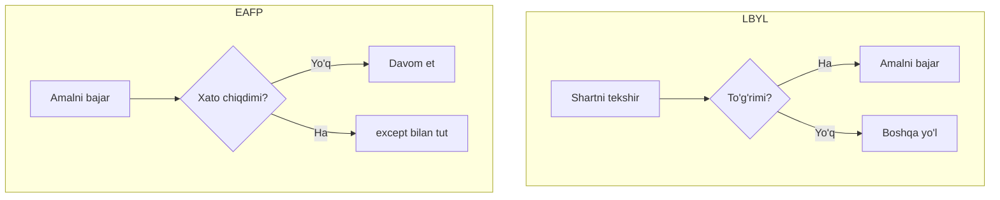
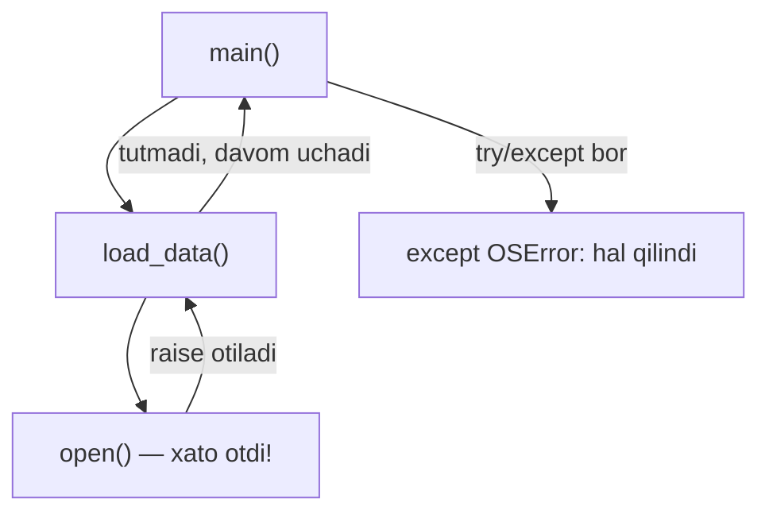
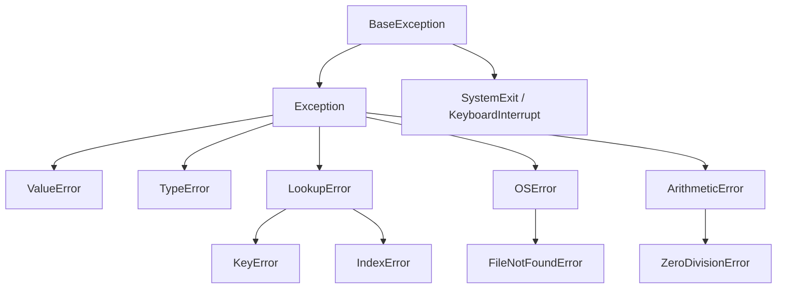

# 14. Exceptions

## Nima uchun kerak? (Hook)

Dataset faylini ochasiz — u yo'q. JSON'ni o'qiysiz — format buzuq. Songa aylantirasiz — matn kelgan. Real dunyoda kod doim "toza" ma'lumot bilan ishlamaydi. Xatolarni boshqarmasangiz, dasturingiz birinchi buzuq qatordan qulaydi.

Go dasturchisi uchun bu dars — Python'dagi **eng katta mental o'zgarish**. Go'da xato — bu oddiy qaytariladigan qiymat (`if err != nil`). Python'da esa xato — bu **istisno** (exception): u kodning normal oqimini "portlatib", yuqoriga otiladi.

Bu darsda ikki falsafa (EAFP va LBYL), `try/except/else/finally`, exception ierarxiyasi, `raise`/`raise from`, custom exception va traceback o'qishni o'rganamiz.

---

## Analogiya: exception — bong'ora signali

Zavodda ishchi normal ish qiladi. Muammo chiqsa (masalan, mashina qizib ketsa) — u ishni to'xtatib, **bong'orani bosadi**. Signal tepaga — ustaga, keyin direktorga — ko'tariladi, kimdir uni "tutib" hal qilguncha. Hech kim tutmasa — butun zavod to'xtaydi.

Exception ham shunday: xato joyda "signal" ko'tariladi (`raise`), stack bo'ylab tepaga uchadi va biror `except` uni tutguncha davom etadi. Hech kim tutmasa — dastur qulaydi (traceback bilan).

**Analogiya chegarasi:** bong'ora har doim yomon xabar, lekin Python'da exception ba'zan **normal boshqaruv** uchun ham ishlatiladi (masalan, iteratsiya tugaganini bildirish uchun `StopIteration`). Ya'ni exception har doim "falokat" degani emas.

> Exception — kodning normal oqimini uzib, uni tutadigan `except` bloki topilguncha stack bo'ylab tepaga ko'tariladigan signal.

---

## Ikki falsafa: EAFP vs LBYL

Bu dunyoda xato bilan ishlashning ikki yo'li bor.

**LBYL** — "Look Before You Leap" (sakrashdan oldin qara). Amalni bajarishdan **oldin** shart to'g'ri ekanini tekshirasiz.

**EAFP** — "Easier to Ask Forgiveness than Permission" (ruxsat so'ragandan ko'ra kechirim so'rash oson). Avval amalni **bajarasiz**, xato chiqsa — tutasiz. Bu — Python'ning rasmiy, tavsiya etilgan uslubi.

```python
d = {"ism": "Ali"}

# --- LBYL: avval tekshir, keyin ol ---
if "yosh" in d:
    yosh = d["yosh"]
else:
    yosh = 0

# --- EAFP: avval ol, xato bo'lsa tut (Python uslubi) ---
try:
    yosh = d["yosh"]
except KeyError:
    yosh = 0

print(yosh)   # 0
```

**Output:**

```
0
```

> Python'da EAFP afzal ko'riladi: kod tozaroq, va tekshiruv bilan amal orasida holat o'zgarib ketish (race condition) muammosi bo'lmaydi.



---

## Go bilan chuqur solishtirish (eng muhim qism)

Bu — Go dasturchisi uchun fikrlash tarzini butunlay o'zgartiradigan joy.

Go'da xato — bu **oddiy qiymat**. Har funksiya `error` qaytaradi, siz uni **darhol, qo'lda** tekshirasiz:

```go
// --- Go: xato = qaytariladigan qiymat, qo'lda tekshiriladi ---
f, err := os.Open("data.txt")
if err != nil {
    return err          // xatoni yuqoriga qo'lda uzatasiz
}
data, err := io.ReadAll(f)
if err != nil {
    return err
}
```

Python'da xato — bu **avtomatik otiluvchi signal**. Siz uni tekshirmaysiz; u o'zi tepaga uchadi, siz faqat **kerakli joyda** tutasiz:

```python
# --- Python: xato o'zi otiladi, faqat kerakli joyda tutiladi ---
try:
    with open("data.txt", "r", encoding="utf-8") as f:
        data = f.read()
except OSError as e:
    print("Ochib bo'lmadi:", e)
```

| Jihat | Go | Python |
| --- | --- | --- |
| Xato nima | qaytariladigan qiymat (`error`) | otiluvchi obyekt (`Exception`) |
| Tekshirish | har chaqiruvdan keyin qo'lda | faqat `try/except` da, kerakli joyda |
| Tarqalishi | qo'lda `return err` bilan | avtomatik, stack bo'ylab yuqoriga |
| Unutsangiz | xato "yutiladi", davom etadi | dastur qulaydi (traceback) |
| Falsafa | eksplitsit, har qadamda | EAFP, markazlashtirilgan tutish |

> Go'da: "har chaqiruvni tekshiraman". Python'da: "kodni normal yozaman, xatoni bitta joyda tutaman". Bu — kodni tepadan pastga o'qishni osonlashtiradi, lekin qaysi funksiya qanday xato otishini bilishni talab qiladi.



---

## `try/except/else/finally` — har blokning roli

To'liq konstruksiya 4 blokdan iborat. Har birining aniq vazifasi bor.

```python
def songa(matn):
    # --- try: xato chiqishi mumkin bo'lgan "xavfli" kod ---
    try:
        son = int(matn)
    # --- except: aynan shu xatoni tutish ---
    except ValueError:
        print("Bu son emas:", matn)
        return None
    # --- else: xato CHIQMAGANDA bajariladi ---
    else:
        print("Muvaffaqiyat")
        return son
    # --- finally: xato bor-yo'qligidan qat'i nazar DOIM bajariladi ---
    finally:
        print("Tekshiruv tugadi")

print(songa("42"))
print("---")
print(songa("salom"))
```

**Output:**

```
Muvaffaqiyat
Tekshiruv tugadi
42
---
Bu son emas: salom
Tekshiruv tugadi
None
```

| Blok | Qachon ishlaydi | Vazifasi |
| --- | --- | --- |
| `try` | doim (birinchi) | xavfli kod shu yerda |
| `except` | xato chiqsa | xatoni tutib hal qilish |
| `else` | xato **chiqmasa** | muvaffaqiyatli yo'l |
| `finally` | **har doim** | tozalash (fayl yopish, ulanish uzish) |

> `finally` Go'dagi `defer` ga o'xshaydi: xato bo'ldimi yo'qmi, u **doim** bajariladi. Resurs tozalash uchun ishlatiladi.

---

## Exception ierarxiyasi

Barcha exception'lar bitta oiladan. Ular daraxt (class hierarchy) bo'lib tuzilgan. `BaseException` — ildiz; kunlik xatolar `Exception` dan meros oladi.



| Exception | Qachon chiqadi |
| --- | --- |
| `ValueError` | tur to'g'ri, lekin qiymat noto'g'ri (`int("salom")`) |
| `TypeError` | tur mos emas (`"a" + 1`) |
| `KeyError` | dict'da yo'q kalit (`d["yoq"]`) |
| `IndexError` | ro'yxatda yo'q indeks (`lst[100]`) |
| `FileNotFoundError` | fayl topilmadi |
| `ZeroDivisionError` | nolga bo'lish |

**Muhim:** `except` ota-klassni tutsa, uning barcha bolalarini ham tutadi. `except LookupError` — ham `KeyError`, ham `IndexError` ni tutadi. `except Exception` — deyarli hammasini.

---

## Bir nechta `except`

Har xil xatoni har xil hal qilish mumkin. Tartib **muhim**: aniqroq (spetsifik) xatolar yuqorida turishi kerak.

```python
def hisobla(a, b):
    try:
        return int(a) / int(b)
    # --- aniqroq xatolar yuqorida ---
    except ValueError:
        return "Son emas"
    except ZeroDivisionError:
        return "Nolga bo'lib bo'lmaydi"
    # --- bir necha xatoni birga tutish (tuple) ---
    except (TypeError, OverflowError):
        return "Boshqa muammo"

print(hisobla("10", "2"))    # 5.0
print(hisobla("x", "2"))     # Son emas
print(hisobla("10", "0"))    # Nolga bo'lib bo'lmaydi
```

**Output:**

```
5.0
Son emas
Nolga bo'lib bo'lmaydi
```

> Agar `except Exception` ni birinchi qo'ysangiz, u hammasini "yutib" oladi va pastdagi aniq bloklar hech qachon ishlamaydi. Doim aniqdan umumiy tomon yozing.

---

## `raise` — xatoni o'zingiz otish

Ba'zan xatoni siz aniqlaysiz. `raise` bilan yangi exception otasiz. Bu — Go'dagi `return errors.New(...)` ning muqobili, lekin u avtomatik tepaga uchadi.

```python
def yosh_tekshir(yosh):
    # --- Noto'g'ri qiymatda o'zimiz signal ko'taramiz ---
    if yosh < 0:
        raise ValueError(f"Yosh manfiy bo'lolmaydi: {yosh}")
    return yosh

try:
    yosh_tekshir(-5)
except ValueError as e:
    print("Ushlandi:", e)
```

**Output:**

```
Ushlandi: Yosh manfiy bo'lolmaydi: -5
```

### `raise from` — xatolar zanjiri

Bitta xatoni tutib, boshqasini otganda, asl sababni saqlab qolish uchun `raise ... from` ishlatiladi. Bu traceback'da "bu xato ana u xato sababli chiqdi" deb ko'rsatadi.

```python
def config_yukla(matn):
    try:
        return int(matn)
    except ValueError as e:
        # --- asl xatoni sabab qilib yangi, ma'noliroq xato otamiz ---
        raise RuntimeError("Config buzuq") from e

try:
    config_yukla("salom")
except RuntimeError as e:
    print("Xato:", e)
    print("Sababi:", e.__cause__)
```

**Output:**

```
Xato: Config buzuq
Sababi: invalid literal for int() with base 10: 'salom'
```

> `raise from` — Go'dagi `fmt.Errorf("...: %w", err)` (error wrapping) ning aynan muqobili. Ikkalasi ham asl xatoni yuqori darajadagi ma'noli xatoga "o'raydi".

---

## Custom exception class

O'z domeningizga xos xatolarni yasash — professional kodning belgisi. Odatda `Exception` dan meros olinadi.

```python
# --- 1-qadam: o'z exception oilamizni yaratamiz ---
class DatasetError(Exception):
    """Dataset bilan bog'liq barcha xatolar uchun asos."""

class BoshQatorYoq(DatasetError):
    """CSV'da sarlavha (header) qatori yo'q."""

# --- 2-qadam: kerakli joyda otamiz ---
def yukla(qatorlar):
    if not qatorlar:
        raise BoshQatorYoq("Dataset bo'sh")
    return qatorlar

# --- 3-qadam: umumiy ota-klass bilan tutamiz ---
try:
    yukla([])
except DatasetError as e:
    print("Dataset xatosi:", e)
```

**Output:**

```
Dataset xatosi: Dataset bo'sh
```

> Umumiy `DatasetError` bilan tutish barcha bola xatolarni (`BoshQatorYoq` va boshqa) bir joyda ushlash imkonini beradi — bu ierarxiyaning kuchi.

---

## Traceback o'qishni o'rganish

Xato tutilmasa, Python **traceback** chop etadi. Uni **pastdan yuqoriga** emas — aslida yuqoridan pastga o'qing, lekin **eng pastki qator eng muhim**.

```python
def a():
    return b()

def b():
    return 10 / 0

a()
```

**Output:**

```
Traceback (most recent call last):
  File "main.py", line 7, in <module>
    a()
  File "main.py", line 2, in a
    return b()
  File "main.py", line 5, in b
    return 10 / 0
           ~~~^~~
ZeroDivisionError: division by zero
```

O'qish tartibi:
1. **Eng pastki qator** — xato turi va xabari: `ZeroDivisionError: division by zero`. Bu — asosiy javob.
2. **Undan yuqori** — xato aynan qaysi qatorda chiqqani: `line 5, in b`.
3. **Tepaga qarab** — chaqiruvlar zanjiri: `a()` -> `b()`. "Most recent call last" — ya'ni xato joyi eng pastda.

> Go'dagi stack trace pastdan tepaga o'qiladi (eng yangi tepada). Python'da esa **eng yangi (xato joyi) pastda** — buni chalkashtirmang.

---

## `except Exception:` ni qachon ISHLATMASLIK

Keng (bo'sh) `except` — eng ko'p uchraydigan yomon odat. U hamma xatoni yutib, muammoni yashiradi.

```python
# --- YOMON: hamma narsani yutadi, xatoni yashiradi ---
try:
    natija = muhim_hisob()
except Exception:      # yoki bundan ham yomoni: except:
    natija = None      # qanday xato? bilib bo'lmaydi
```

Muammolar:
- Xato **sababi yo'qoladi** — debug qilib bo'lmaydi.
- `KeyboardInterrupt` (Ctrl+C) va boshqa muhim signallarni ham yutishi mumkin (garchi `except Exception` `KeyboardInterrupt` ni tutmasa ham, `except:` bo'sh holida tutadi).
- Kutilmagan bug'lar (masalan, `TypeError` — kod xatosi) yashirinib qoladi.

```python
# --- YAXSHI: aniq xatolarni tut, qolganini uchsin ---
try:
    natija = muhim_hisob()
except (ValueError, KeyError) as e:
    log.warning("Kutilgan xato: %s", e)
    natija = None
```

> Qoida: faqat **siz kutgan va hal qila oladigan** aniq xatolarni tuting. Qolganlari uchib chiqsin — ular sizga bug borligini aytadi. Keng `except Exception` faqat eng yuqori darajada (masalan, veb-server so'rov handleri) va logging bilan birga o'rinli.

---

## 🤔 O'ylab ko'r

Quyidagi kod nima chop etadi va nega?

```python
def test():
    try:
        return "try"
    finally:
        print("finally ishladi")

print(test())
```

<details>
<summary>💡 Javobni ko'rish</summary>

Output:
```
finally ishladi
try
```

`try` bloki `return "try"` ga yetadi, lekin funksiya **haqiqatan qaytishdan oldin** `finally` bloki **doim** bajariladi — shuning uchun avval `finally ishladi` chop etiladi. Keyin `return` amalga oshadi va `print(test())` `try` ni chop etadi.

Bu `finally` ning kuchini ko'rsatadi: hatto `return`, `break` yoki exception bo'lsa ham, u ishlaydi. Aynan shuning uchun resurs tozalash `finally` da yoziladi.

</details>

---

## ⚠️ Ko'p uchraydigan xatolar

**1. Keng `except:` yoki `except Exception:` bilan hammani yutish**

- Nega noto'g'ri: xato sababi yo'qoladi, bug'lar yashirinadi.
- To'g'risi: aniq xato turlarini tuting (`except ValueError`).

**2. `except` tartibini teskari qo'yish**

- Noto'g'ri: `except Exception` ni birinchi qo'yish — pastdagi aniq bloklar ishlamaydi.
- To'g'risi: aniqdan (`KeyError`) umumiy (`Exception`) tomon.

**3. Go'dagidek har chaqiruvni `try/except` ga o'rash**

- Noto'g'ri tasavvur: "Go'dagi `if err != nil` kabi har qatorni tekshiraman".
- Nega noto'g'ri: kod juda shovqinli bo'ladi; exception'ning butun mohiyati — markazlashtirilgan tutish.
- To'g'risi: bir necha xavfli amalni bitta `try` ga o'rab, kerakli darajada tuting.

**4. Xatoni tutib, jim yutish (`except: pass`)**

- Nega noto'g'ri: muammo bo'lganini hech kim bilmaydi.
- To'g'risi: hech bo'lmasa `log` qiling yoki qayta `raise` qiling.

**5. `raise` o'rniga xato xabarini `return` qilish**

- Noto'g'ri: `return "xato: ..."` — chaqiruvchi buni tekshirishni unutadi.
- To'g'risi: `raise ValueError(...)` — bu signal, e'tibor bermay bo'lmaydi.

---

## Xulosa

- Python'da xato — otiluvchi **exception** obyekti; Go'dagi qaytariladigan `error` qiymatidan farqli, u stack bo'ylab avtomatik tepaga uchadi.
- Python EAFP falsafasini afzal ko'radi: avval bajar, xato bo'lsa tut.
- `try` (xavfli kod), `except` (tutish), `else` (xato bo'lmasa), `finally` (doim) — har birining aniq roli bor.
- Exception'lar ierarxiya (daraxt): ota-klass bolalarini ham tutadi.
- Bir nechta `except` da aniqdan umumiy tomon yozing.
- `raise` bilan o'zingiz xato otasiz; `raise ... from` asl sababni saqlaydi (Go'dagi `%w` kabi).
- Custom exception `Exception` dan meros oladi — o'z domeningiz xatolari uchun.
- Traceback'da eng pastki qator eng muhim; keng `except Exception` dan qoching.

---

## 🧠 Eslab qol

- Exception = tutilguncha tepaga uchuvchi signal (`raise` -> stack -> `except`).
- Python = EAFP; Go = eksplitsit `if err != nil`.
- `finally` = Go'dagi `defer`, doim ishlaydi.
- Aniq xatoni tut, umumiy `except Exception` ni yutuvchi sifatida ishlatma.
- `raise from` = asl xatoni o'raydi (error wrapping).

---

## ✅ O'z-o'zini tekshir

**1.** Python'ning exception modeli Go'ning `if err != nil` modelidan qaysi asosiy jihatda farq qiladi?

<details>
<summary>Javob</summary>

Go'da xato — bu funksiya qaytaradigan oddiy qiymat; uni har chaqiruvda qo'lda tekshirasiz, unutsangiz xato jimgina yutiladi. Python'da xato — bu otiluvchi obyekt; u avtomatik ravishda stack bo'ylab tepaga uchadi va uni faqat kerakli joyda bitta `try/except` bilan tutasiz. Unutsangiz — dastur qulaydi (traceback bilan), ya'ni xato yashirin qolmaydi.

</details>

**2.** `else` va `finally` bloklari orasidagi farq nima?

<details>
<summary>Javob</summary>

`else` faqat `try` da **xato chiqmagan** holatda bajariladi (muvaffaqiyatli yo'l). `finally` esa xato chiqdimi-chiqmadimi — **doim** bajariladi (Go'dagi `defer` kabi), shuning uchun resurs tozalash uchun ishlatiladi.

</details>

**3.** Nima uchun `except` bloklarida aniq xatolar umumiy `Exception` dan yuqorida turishi kerak?

<details>
<summary>Javob</summary>

Python `except` bloklarini yuqoridan pastga tekshiradi va birinchi mos kelganida to'xtaydi. `except Exception` deyarli hamma xatoga mos keladi, shuning uchun uni yuqoriga qo'ysangiz, pastdagi aniq bloklar (`ValueError`, `KeyError`) hech qachon ishlamaydi. Aniqdan umumiy tomon yozish har xatoni to'g'ri hal qilish imkonini beradi.

</details>

**4.** `raise ValueError("...")` va `raise ValueError("...") from e` orasidagi farq nima?

<details>
<summary>Javob</summary>

`from e` yangi xatoning **sababini** (asl xato `e` ni) saqlaydi va traceback'da "bu xato ana u xato sababli chiqdi" deb ko'rsatadi (`__cause__`). Bu Go'dagi `fmt.Errorf("...: %w", err)` error wrapping'ga o'xshaydi. `from` bo'lmasa, asl sabab yo'qoladi va debug qiyinlashadi.

</details>

**5.** `except Exception: pass` nima uchun xavfli?

<details>
<summary>Javob</summary>

U barcha xatolarni (kutilgan va kutilmagan bug'larni ham) jimgina yutadi. Muammo bo'lganini hech kim bilmaydi, sabab yo'qoladi va debug qilib bo'lmaydi. Faqat siz kutgan va hal qila oladigan aniq xatolarni tutish kerak; qolganlari uchib chiqib, bug borligini ko'rsatishi lozim.

</details>

---

## 🛠 Amaliyot

### Oson (Modify)

Quyidagi kod `KeyError` ni tutadi. Uni LBYL uslubidan EAFP uslubiga o'zgartiring (ya'ni `if "yosh" in d` o'rniga `try/except KeyError`).

```python
d = {"ism": "Ali"}
if "yosh" in d:
    print(d["yosh"])
else:
    print("yosh yo'q")
```

<details>
<summary>💡 Hint</summary>

```python
d = {"ism": "Ali"}
try:
    print(d["yosh"])
except KeyError:
    print("yosh yo'q")
```

Yoki yanada Python-cha: `print(d.get("yosh", "yosh yo'q"))`.

</details>

### O'rta (faded example — to'ldiring)

Funksiya matnlar ro'yxatini olib, ularni butun songa aylantiradi. Aylantirib bo'lmaydiganlarni tashlab ketadi (skip). `try/except` bilan to'ldiring.

```python
def sonlarni_ajrat(matnlar):
    natija = []
    for m in matnlar:
        # TODO: int(m) ni try ichida bajaring
        try:
            natija.append(______)
        # TODO: faqat noto'g'ri qiymat xatosini tuting
        except ______:
            continue
    return natija

print(sonlarni_ajrat(["1", "x", "3", "salom", "5"]))
# Kutilgan: [1, 3, 5]
```

<details>
<summary>💡 Hint</summary>

```python
def sonlarni_ajrat(matnlar):
    natija = []
    for m in matnlar:
        try:
            natija.append(int(m))
        except ValueError:
            continue
    return natija
```

`int("x")` `ValueError` otadi. `continue` shu elementni tashlab, keyingisiga o'tadi.

</details>

### Qiyin (Make)

Noldan yozing: `BalansYetarliEmas` degan custom exception yarating (`Exception` dan meros). `pul_yech(balans, miqdor)` funksiyasi yozing: agar `miqdor > balans` bo'lsa, bu exception'ni ma'noli xabar bilan oting; aks holda yangi balansni qaytaring. Funksiyani `try/except` bilan chaqirib, xatoni ushlab, foydalanuvchiga tushunarli xabar chop eting.

<details>
<summary>💡 Hint</summary>

Qadamlar:
1. `class BalansYetarliEmas(Exception): pass`.
2. `pul_yech` ichida: `if miqdor > balans: raise BalansYetarliEmas(f"Balans {balans}, so'ralgan {miqdor}")`.
3. `return balans - miqdor`.
4. Chaqiruvda: `try: pul_yech(100, 150) except BalansYetarliEmas as e: print("Xato:", e)`.

Qo'shimcha: `raise ... from` bilan asl xatoni zanjirlashni ham sinab ko'ring (masalan, `miqdor` ni `int()` qilishda `ValueError` chiqsa).

</details>

---

## 🔁 Takrorlash

**Bog'liq oldingi mavzular:**
- 09. Dict — `KeyError`, `dict.get()` (LBYL alternativasi).
- 10. Funksiyalar — `raise` funksiyadan xato otadi; qaytish qiymati o'rniga.
- 13. Fayllar — `FileNotFoundError`, `OSError`; `with` + `try` birga.

**Takrorlash jadvali (O'z-o'zini tekshir savollariga qayting):**
- Ertaga: EAFP va LBYL farqini o'z so'zingiz bilan ayting.
- 3 kundan keyin: `try/except/else/finally` — har blok qachon ishlashini yozmasdan ayting.
- 1 haftadan keyin: custom exception yasab, `raise from` bilan zanjirlaydigan kodni xotiradan yozing.

**Feynman testi:** Do'stingizga kod so'zlarisiz tushuntiring: "Xato — bu zavoddagi bong'ora signali; joyda ko'tariladi, tepaga uchadi va kimdir uni tutguncha davom etadi. Go'da har ishchi signalni qo'lda uzatadi; Python'da signal o'zi uchadi, sen faqat kerakli joyda tutasan." Uch jumlada ayta olsangiz — o'zlashtirdingiz.

---

> 📚 Manbalar sintezi: Python official tutorial (Errors and Exceptions), Fluent Python (exception handling), Effective Python ("Item: Prefer Exceptions to Returning None", "Understand how to handle exceptions"), Real Python (Python Exceptions), Python Crash Course (ch. 10).
