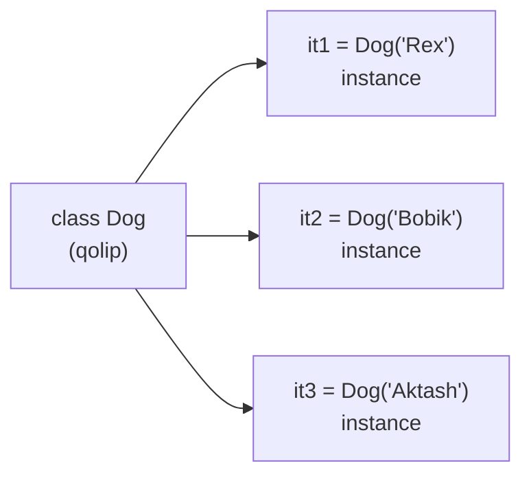
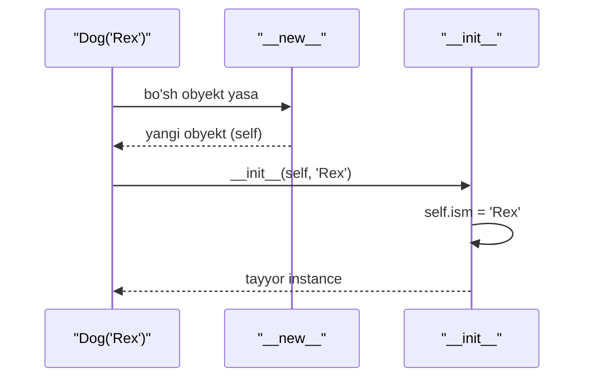
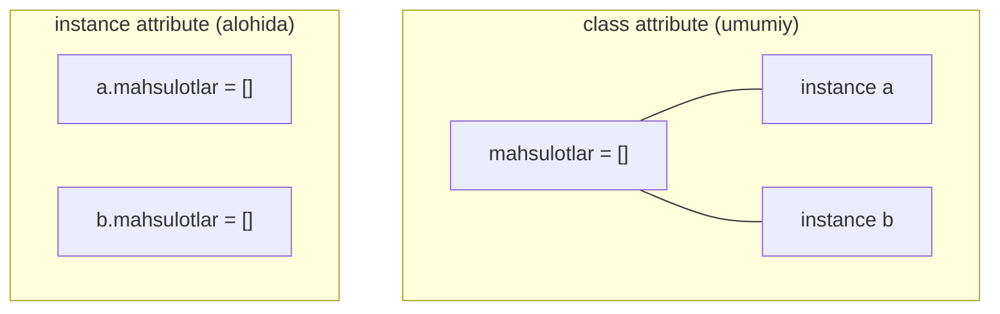
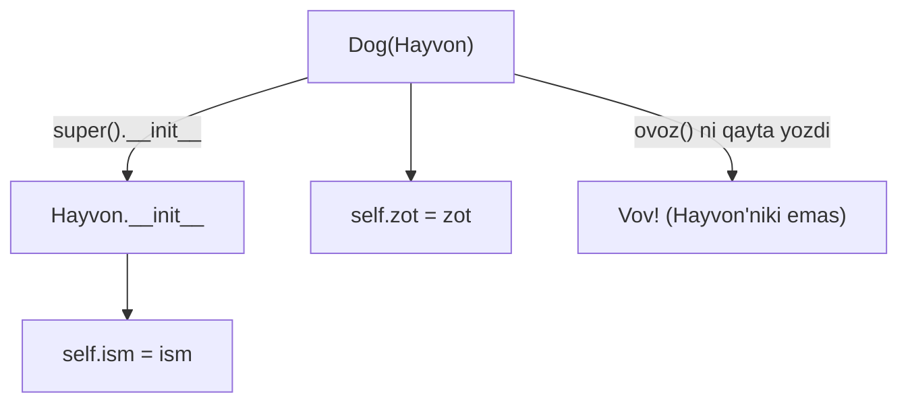

# 15. OOP asoslari

## Nima uchun kerak? (Hook)

ML kutubxonalarining deyarli hammasi — obyektlar ustiga qurilgan: `model = LinearRegression()`, keyin `model.fit(X, y)`, `model.predict(X)`. Bu yerdagi `model` — bu **obyekt**, `fit`/`predict` — uning **metodlari**. OOP'ni tushunmasangiz, PyTorch yoki scikit-learn kodini o'qiy olmaysiz.

Go dasturchisi uchun bu tanish, lekin boshqa qadoqda: Go'da `struct` + alohida `func (r Receiver) Method()` bor. Python'da bularning hammasi bitta `class` ichida joylashadi va `self` — bu Go'dagi receiver'ning yaqin qarindoshi.

Bu darsda `class`, `__init__`, `self` aslida nima ekani, instance vs class attribute (va uning tuzog'i), inheritance va `super()` ni o'rganamiz.

---

## Analogiya: class — qolip, instance — quyilgan mahsulot

`class` — bu **qolip** (masalan, koinka quyma qolipi). Undan istagancha ko'p **instance** (aniq koinka) yasash mumkin. Qolip bitta, mahsulotlar ko'p — va har biri o'z rangiga (holatiga) ega bo'lishi mumkin.

**Analogiya chegarasi:** oddiy qolipdan farqli, Python class'ning o'zi ham obyekt va o'zgarishi mumkin (dinamik). Bundan tashqari, qolip faqat shakl beradi, class esa ham shakl (attribute'lar), ham xatti-harakat (metodlar) beradi.

> Class — ma'lumot (attribute) va xatti-harakatni (metod) birlashtirgan qolip; instance — shu qolipdan yasalgan, o'z holatiga ega aniq nusxa.



---

## Sodda ta'rif va birinchi class

**Class** — bu obyektlarni yasash uchun qolip; **instance** — shu qolipdan yaratilgan aniq obyekt; **attribute** — obyektga tegishli ma'lumot; **method** — obyektga tegishli funksiya.

```python
# --- 1-qadam: class e'lon qilamiz ---
class Dog:
    # --- 2-qadam: __init__ — instance yaratilganda ishga tushadi ---
    def __init__(self, ism):
        self.ism = ism          # instance attribute'ni o'rnatamiz

    # --- 3-qadam: metod — self orqali o'z ma'lumotiga kiradi ---
    def vov(self):
        return f"{self.ism}: Vov!"

# --- 4-qadam: instance yaratamiz (qolipdan quyamiz) ---
it = Dog("Rex")
print(it.ism)       # Rex
print(it.vov())     # Rex: Vov!
```

**Output:**

```
Rex
Rex: Vov!
```

---

## `__init__` — bu constructor EMAS, initializer

Go dasturchisi buni chalkashtiradi. Boshqa tillarda (Java, C++) "constructor" obyektni **yaratadi**. Python'da esa obyektni allaqachon Python o'zi yaratib bo'ladi (`__new__`), `__init__` faqat uni **to'ldiradi** (initialize qiladi).

Ya'ni `Dog("Rex")` chaqirilganda:
1. Python bo'sh obyekt yasaydi (`__new__`).
2. `__init__(self, "Rex")` chaqiriladi — `self` = shu yangi bo'sh obyekt.
3. `__init__` unga `self.ism = "Rex"` deb ma'lumot qo'yadi.

> `__init__` obyektni yaratmaydi — u yaratilgan obyektni **sozlaydi**. Shuning uchun u hech qachon qiymat qaytarmaydi (`return None`).



---

## `self` ASLIDA nima

Bu — darsning yuragi. `self` — sehr emas. U shunchaki **metodning birinchi argumenti** bo'lib, unga **joriy instance** uzatiladi.

`it.vov()` yozganingizda, Python buni ichki tomondan `Dog.vov(it)` ga aylantiradi. Ya'ni `it` avtomatik ravishda `self` ga o'tadi. Siz `self` ni yozmaysiz — Python uni o'zi beradi.

```python
class Dog:
    def __init__(self, ism):
        self.ism = ism
    def vov(self):
        return f"{self.ism}: Vov!"

it = Dog("Rex")

# --- Bu ikki chaqiruv AYNAN bir xil ---
print(it.vov())          # oddiy usul
print(Dog.vov(it))       # "yalang'och" usul — self=it ekani ko'rinadi
```

**Output:**

```
Rex: Vov!
Rex: Vov!
```

### Go'dagi receiver bilan solishtirish

Bu — Go dasturchisi uchun eng tanish ko'prik. Go'da:

```go
// --- Go: receiver eksplitsit e'lon qilinadi ---
type Dog struct {
    Ism string
}
func (d Dog) Vov() string {     // d — receiver, self'ning ekvivalenti
    return d.Ism + ": Vov!"
}
```

Go'da `d` (receiver) — funksiya nomidan **oldin** e'lon qilinadi. Python'da `self` — metodning **birinchi parametri**. Ikkalasi ham "qaysi obyekt ustida ishlayapmiz" ni bildiradi.

| Jihat | Go receiver | Python `self` |
| --- | --- | --- |
| Qayerda | `func (d Dog)` — nomdan oldin | `def vov(self)` — birinchi parametr |
| Nomi | ixtiyoriy (`d`, `dog`) | konvensiya bo'yicha `self` |
| Chaqirishda beriladimi | avtomatik (`d.Vov()`) | avtomatik (`it.vov()`) |
| Yaqqol yozilishi | `Dog.Vov` uchun `d Dog` | `Dog.vov(it)` |

> `self` — Go'dagi receiver'ning aynan o'zi, faqat u metodning birinchi parametri sifatida yoziladi. Python "eksplitsit yashirin narsadan yaxshi" tamoyili bo'yicha uni ko'rsatib turadi.

---

## Instance attribute vs class attribute (va TUZOG'i)

Bu — Python OOP'dagi eng mashhur tuzoq. Ikki xil attribute bor:

- **Instance attribute** — har obyektga xos, `self.x = ...` bilan o'rnatiladi. Har instance'da alohida.
- **Class attribute** — class tanasida e'lon qilinadi, **barcha instance'lar uchun umumiy** (bitta nusxa).

```python
class Dog:
    tur = "it"                  # class attribute — HAMMA uchun umumiy

    def __init__(self, ism):
        self.ism = ism          # instance attribute — har birga xos

a = Dog("Rex")
b = Dog("Bobik")
print(a.tur, b.tur)             # it it — umumiy
print(a.ism, b.ism)             # Rex Bobik — alohida
```

**Output:**

```
it it
Rex Bobik
```

### Tuzoq: o'zgaruvchan (mutable) class attribute

Eng xavfli xato — class attribute sifatida `list` yoki `dict` ishlatish. U **barcha instance'lar orasida bo'lishiladi**:

```python
# --- YOMON: mutable class attribute ---
class Savat:
    mahsulotlar = []            # BARCHA instance uchun BITTA ro'yxat!

    def qosh(self, x):
        self.mahsulotlar.append(x)

a = Savat()
b = Savat()
a.qosh("olma")
print(b.mahsulotlar)           # ['olma'] — b ga ham "yuqdi"!
```

**Output:**

```
['olma']
```

`a` ga qo'shgan narsa `b` da ham paydo bo'ldi — chunki ro'yxat bitta, umumiy. To'g'ri yechim: har instance'ga alohida ro'yxat berish, ya'ni `__init__` ichida:

```python
# --- YAXSHI: har instance'ga alohida ---
class Savat:
    def __init__(self):
        self.mahsulotlar = []   # har instance'ga yangi ro'yxat

    def qosh(self, x):
        self.mahsulotlar.append(x)

a = Savat()
b = Savat()
a.qosh("olma")
print(b.mahsulotlar)           # [] — b toza!
```

**Output:**

```
[]
```

> Qoida: o'zgaruvchan holat (`list`, `dict`, hisoblagich) doim `__init__` ichida `self.x = ...` bilan o'rnatiladi. Class attribute'ni faqat barcha instance'lar uchun umumiy, o'zgarmas konstantalar uchun ishlating (`tur = "it"`).



---

## Inheritance (meros) va `super()`

Inheritance — mavjud class'ni kengaytirish. Bola class (subclass) ota class'ning (superclass) barcha attribute va metodlarini oladi, ustiga o'ziniki qo'shadi.

```python
# --- 1-qadam: ota class ---
class Hayvon:
    def __init__(self, ism):
        self.ism = ism
    def ovoz(self):
        return "..."

# --- 2-qadam: bola class Hayvon'dan meros oladi ---
class Dog(Hayvon):
    def __init__(self, ism, zot):
        super().__init__(ism)   # ota'ning __init__ ini chaqiramiz
        self.zot = zot          # o'z attribute'ni qo'shamiz
    def ovoz(self):             # method overriding (qayta yozish)
        return "Vov!"

it = Dog("Rex", "labrador")
print(it.ism, it.zot)          # Rex labrador
print(it.ovoz())               # Vov!
```

**Output:**

```
Rex labrador
Vov!
```

### `super()` nima qiladi

`super()` — ota class'ga murojaat. `super().__init__(ism)` — ota'ning `__init__` ini chaqirib, `ism` ni o'rnatish ishini unga topshiradi. Bu takrorlanishning oldini oladi (DRY).

> `super().__init__(...)` ni chaqirmasangiz, ota'ning `__init__` i ishlamaydi va ota o'rnatadigan attribute'lar (`self.ism`) yo'q bo'lib qoladi. Meros olganda ota'ni init qilishni deyarli doim yozish kerak.



---

## Method overriding

Bola class ota'ning metodini o'z nomi bilan qayta yozsa — bu **overriding**. Instance'da chaqirilganda bolaning versiyasi ishlaydi. Yuqoridagi `Dog.ovoz()` — `Hayvon.ovoz()` ni override qildi.

Ota'ning versiyasini ham ishlatib, ustiga qo'shmoqchi bo'lsangiz — `super()` orqali chaqiring:

```python
class Hayvon:
    def tavsif(self):
        return "Men hayvonman"

class Dog(Hayvon):
    def tavsif(self):
        # --- ota'ning natijasini olib, ustiga qo'shamiz ---
        return super().tavsif() + ", aniqrog'i itman"

print(Dog().tavsif())
```

**Output:**

```
Men hayvonman, aniqrog'i itman
```

---

## `isinstance` va `issubclass`

Bu ikki funksiya obyekt/class munosabatlarini tekshiradi (14-darsdagi `except` tutish mantig'iga o'xshaydi — ierarxiya bo'yicha).

- `isinstance(obj, Class)` — `obj` shu class (yoki uning avlodi) ekanmi? -> `bool`.
- `issubclass(A, B)` — `A` class `B` ning bola (avlodi) ekanmi? -> `bool`.

```python
class Hayvon: pass
class Dog(Hayvon): pass

it = Dog()
print(isinstance(it, Dog))        # True
print(isinstance(it, Hayvon))     # True — Dog Hayvon'ning avlodi
print(isinstance(it, str))        # False
print(issubclass(Dog, Hayvon))    # True
```

**Output:**

```
True
True
False
True
```

> `isinstance` `type(x) == Dog` dan afzal, chunki u merosni ham hisobga oladi: bola obyekt ota tekshiruvidan ham o'tadi. Bu Go'dagi type assertion / interface tekshiruviga o'xshaydi.

---

## Go struct + method + embedding bilan solishtirish

| Tushuncha | Go | Python |
| --- | --- | --- |
| Ma'lumot qolipi | `type Dog struct { ... }` | `class Dog:` |
| Metod | `func (d Dog) Vov()` (tashqarida) | `def vov(self):` (class ichida) |
| Receiver / self | `d` (nomdan oldin) | `self` (birinchi parametr) |
| Init | `Dog{Ism: "Rex"}` yoki funksiya | `__init__` metod |
| Qayta ishlatish | **embedding** (`struct` ichiga qo'yish) | **inheritance** (`class Dog(Hayvon)`) |
| Ota'ni chaqirish | `d.Hayvon.Method()` | `super().method()` |
| Polimorfizm | interface orqali | inheritance + duck typing |

> Katta farq: Go embedding'ni afzal ko'radi ("composition over inheritance") va meros zanjirini qo'llab-quvvatlamaydi; Python esa to'liq class inheritance beradi. Lekin Python'da ham amaliyotda ko'pincha composition tavsiya etiladi (buni 16-darsda ko'ramiz).

---

## 🤔 O'ylab ko'r

Quyidagi kod nima chop etadi?

```python
class Hisoblagich:
    soni = 0
    def qosh(self):
        self.soni += 1

a = Hisoblagich()
b = Hisoblagich()
a.qosh()
a.qosh()
print(a.soni, b.soni)
```

<details>
<summary>💡 Javobni ko'rish</summary>

Output: `2 0`

Bu chalg'ituvchi holat. `soni = 0` class attribute bo'lsa-da, `self.soni += 1` aslida `self.soni = self.soni + 1` demakdir. O'ng tomon class attribute'ni (`0`) o'qiydi, lekin natijani `self.soni` ga — ya'ni **instance attribute** sifatida yozadi. Shu tariqa `a` uchun alohida `soni` yaratiladi.

Shuning uchun `a.soni` mustaqil ravishda `2` ga yetadi, `b.soni` esa hali ham class attribute'ni (`0`) o'qiydi. Bu ishlaydi, lekin chalkash — hisoblagichni doim `__init__` da `self.soni = 0` bilan boshlash to'g'riroq.

</details>

---

## ⚠️ Ko'p uchraydigan xatolar

**1. Metod ta'rifida `self` ni unutish**

- Noto'g'ri: `def vov():` -> `it.vov()` chaqirilganda `TypeError: takes 0 positional arguments but 1 was given`.
- Nega: Python `it` ni birinchi argument qilib beradi, lekin uni qabul qiladigan `self` yo'q.
- To'g'risi: har instance metodining birinchi parametri `self`.

**2. Mutable class attribute (`list`/`dict`) ishlatish**

- Nega noto'g'ri: barcha instance'lar orasida bo'lishiladi, "yopishqoq" holat.
- To'g'risi: o'zgaruvchan holatni `__init__` da `self.x = []` bilan bering.

**3. Bola `__init__` da `super().__init__()` ni chaqirmaslik**

- Natija: ota o'rnatadigan attribute'lar (`self.ism`) yo'q bo'ladi -> keyin `AttributeError`.
- To'g'risi: bola `__init__` ichida ota'ni init qiling.

**4. `__init__` ni "constructor" deb tushunish va undan `return` qilish**

- Noto'g'ri: `return self` yoki qiymat qaytarish.
- Nega: `__init__` faqat init qiladi, obyektni Python o'zi qaytaradi; `return` (None'dan boshqa) `TypeError` beradi.

**5. `self` yozishni unutib, class attribute'ni o'zgartirish**

- Noto'g'ri: metod ichida `ism = ...` (self'siz) — bu shunchaki lokal o'zgaruvchi, instance'ga ta'sir qilmaydi.
- To'g'risi: instance holatini o'zgartirishda doim `self.ism = ...`.

---

## Xulosa

- Class — qolip, instance — undan yasalgan aniq obyekt; attribute — ma'lumot, method — xatti-harakat.
- `__init__` — constructor emas, **initializer**: yaratilgan obyektni sozlaydi, qiymat qaytarmaydi.
- `self` — sehr emas: u metodning birinchi argumenti bo'lib, joriy instance uzatiladi (Go'dagi receiver kabi).
- `it.vov()` aslida `Dog.vov(it)` — `self` avtomatik beriladi.
- Instance attribute (`self.x`) har obyektga xos; class attribute (class tanasida) barchaga umumiy.
- Mutable class attribute — tuzoq; o'zgaruvchan holatni `__init__` da bering.
- Inheritance ota class'ni kengaytiradi; `super().__init__()` bilan ota'ni init qiling.
- `isinstance`/`issubclass` merosni hisobga olib tekshiradi.

---

## 🧠 Eslab qol

- `self` = joriy instance, metodning 1-argumenti (Go receiver'ning ekvivalenti).
- `__init__` = initializer, hech narsa qaytarmaydi.
- `it.vov()` == `Dog.vov(it)`.
- Mutable holat -> `__init__` da `self.x`; class attribute'ni faqat umumiy konstanta uchun.
- `super().__init__()` ni chaqirishni unutma.

---

## ✅ O'z-o'zini tekshir

**1.** `self` aslida nima va Python uni qaydan oladi?

<details>
<summary>Javob</summary>

`self` — metodning birinchi parametri bo'lib, unga joriy instance uzatiladi. Python uni o'zi beradi: `it.vov()` chaqirilganda Python buni ichdan `Dog.vov(it)` ga aylantiradi, ya'ni `it` avtomatik ravishda `self` ga o'tadi. Bu Go'dagi receiver'ning ekvivalenti.

</details>

**2.** Nima uchun `__init__` ni "constructor" deb atash noto'g'ri?

<details>
<summary>Javob</summary>

Obyektni `__init__` yaratmaydi — uni Python o'zi yasaydi (`__new__`). `__init__` faqat allaqachon yaratilgan obyektni **sozlaydi** (initialize qiladi), unga attribute'lar qo'yadi. Shuning uchun u "initializer" deb ataladi va hech qachon qiymat qaytarmaydi.

</details>

**3.** Class attribute sifatida `list` ishlatish nega tuzoq?

<details>
<summary>Javob</summary>

Class attribute barcha instance'lar orasida bitta nusxa bo'lib bo'lishiladi. Agar u mutable (`list`/`dict`) bo'lsa, bitta instance'da uni o'zgartirsangiz, barcha boshqa instance'larda ham o'zgarish ko'rinadi ("yopishqoq" holat). To'g'ri yechim: o'zgaruvchan holatni `__init__` ichida `self.x = []` bilan har instance'ga alohida berish.

</details>

**4.** `super().__init__()` ni bola class'ning `__init__` ida chaqirmasangiz nima bo'ladi?

<details>
<summary>Javob</summary>

Ota class'ning `__init__` i ishlamaydi, shuning uchun u o'rnatadigan attribute'lar (masalan `self.ism`) yaratilmaydi. Keyin o'sha attribute'ga murojaat qilganda `AttributeError` chiqadi. Meros olganda ota'ni init qilishni deyarli doim chaqirish kerak.

</details>

**5.** `isinstance(it, Hayvon)` va `type(it) == Hayvon` orasidagi farq nima?

<details>
<summary>Javob</summary>

`type(it) == Hayvon` faqat aynan `Hayvon` class'ini tekshiradi; agar `it` bola class (`Dog`) obyekti bo'lsa, `False` qaytaradi. `isinstance(it, Hayvon)` esa merosni hisobga oladi — `Dog` obyekti ham `Hayvon` avlodi bo'lgani uchun `True` qaytaradi. Shuning uchun polimorfizm bilan ishlaganda `isinstance` afzal.

</details>

---

## 🛠 Amaliyot

### Oson (Modify)

Quyidagi `Dog` class'iga `yosh` attribute'ini qo'shing (`__init__` orqali) va `tavsif()` metodida ism bilan birga yoshni ham qaytaring.

```python
class Dog:
    def __init__(self, ism):
        self.ism = ism
    def tavsif(self):
        return f"Ism: {self.ism}"

it = Dog("Rex")
print(it.tavsif())
```

<details>
<summary>💡 Hint</summary>

```python
class Dog:
    def __init__(self, ism, yosh):
        self.ism = ism
        self.yosh = yosh
    def tavsif(self):
        return f"Ism: {self.ism}, Yosh: {self.yosh}"

it = Dog("Rex", 3)
print(it.tavsif())      # Ism: Rex, Yosh: 3
```

</details>

### O'rta (faded example — to'ldiring)

`Doira` class'ini to'ldiring: radius bilan init qiling, `yuza()` metodi `3.14159 * r * r` qaytarsin.

```python
class Doira:
    def __init__(self, radius):
        # TODO: radiusni saqlang
        self.radius = ______

    def yuza(self):
        # TODO: yuzani hisoblab qaytaring
        return ______

d = Doira(2)
print(round(d.yuza(), 2))   # Kutilgan: 12.57
```

<details>
<summary>💡 Hint</summary>

```python
class Doira:
    def __init__(self, radius):
        self.radius = radius
    def yuza(self):
        return 3.14159 * self.radius * self.radius
```

`self.radius` orqali metod ichida saqlangan qiymatga kirasiz.

</details>

### Qiyin (Make)

Noldan yozing: `Hayvon` ota class (attribute: `ism`, metod: `ovoz()` -> `"..."`). Undan `Dog` va `Cat` bolalarini yasang. Ikkalasi ham `ovoz()` ni override qilsin (`"Vov!"` va `"Miyov!"`). `Dog` qo'shimcha `zot` attribute'iga ega bo'lsin (`super()` ishlating). Bir ro'yxatga har xil hayvonlarni solib, `for` bilan har birining `ovoz()` ini chop eting (polimorfizm).

<details>
<summary>💡 Hint</summary>

Qadamlar:
1. `class Hayvon:` — `__init__(self, ism)` va `ovoz(self)` -> `"..."`.
2. `class Dog(Hayvon):` — `__init__(self, ism, zot)` ichida `super().__init__(ism)` va `self.zot = zot`; `ovoz` -> `"Vov!"`.
3. `class Cat(Hayvon):` — faqat `ovoz` -> `"Miyov!"`.
4. `hayvonlar = [Dog("Rex", "labrador"), Cat("Mosh")]`, keyin `for h in hayvonlar: print(h.ism, h.ovoz())`.

Polimorfizm: bir xil `ovoz()` chaqiruvi har class'da o'zgacha ishlaydi.

</details>

---

## 🔁 Takrorlash

**Bog'liq oldingi mavzular:**
- 10. Funksiyalar — metod = class ichidagi funksiya; `self` birinchi parametr.
- 09. Dict — attribute'lar ichdan `self.__dict__` (dict) da saqlanadi.
- 14. Exceptions — `except` ierarxiya bo'yicha tutadi; `isinstance` ham xuddi shu ierarxiya mantig'i.

**Takrorlash jadvali (O'z-o'zini tekshir savollariga qayting):**
- Ertaga: `self` nima ekanini va `it.vov()` == `Dog.vov(it)` ni og'zaki ayting.
- 3 kundan keyin: mutable class attribute tuzog'ini kod bilan ko'rsating.
- 1 haftadan keyin: `super()` bilan meros oladigan class'ni xotiradan yozing.

**Feynman testi:** Do'stingizga kod so'zlarisiz tushuntiring: "Class — bu qolip, undan istagancha ko'p aniq nusxa (instance) quyasan; `self` — har metod ichida 'men qaysi nusxaman' degan yashirin birinchi mehmon; meros esa yangi qolipni eskisining ustiga qurishdir." Uch jumlada ayta olsangiz — o'zlashtirdingiz.

---

> 📚 Manbalar sintezi: Python official tutorial (Classes), Fluent Python (Object-Oriented Idioms), Effective Python ("Item: Prefer public attributes", "Initialize parent classes with super"), Real Python (OOP in Python), Python Crash Course (ch. 9).
