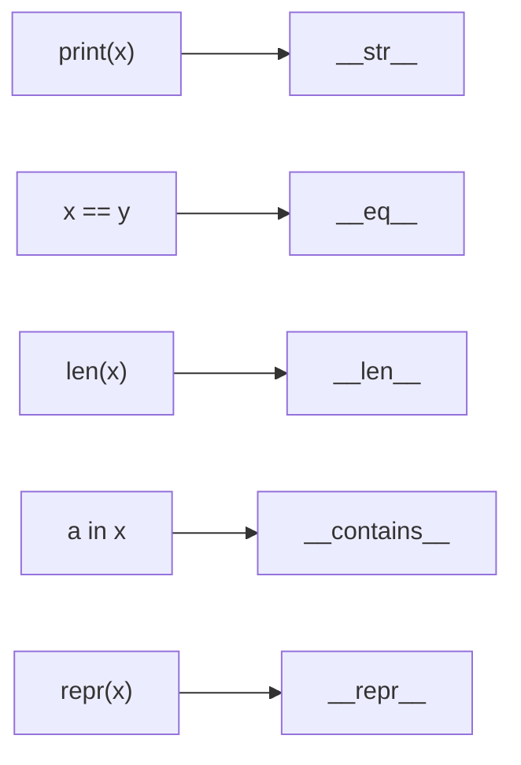
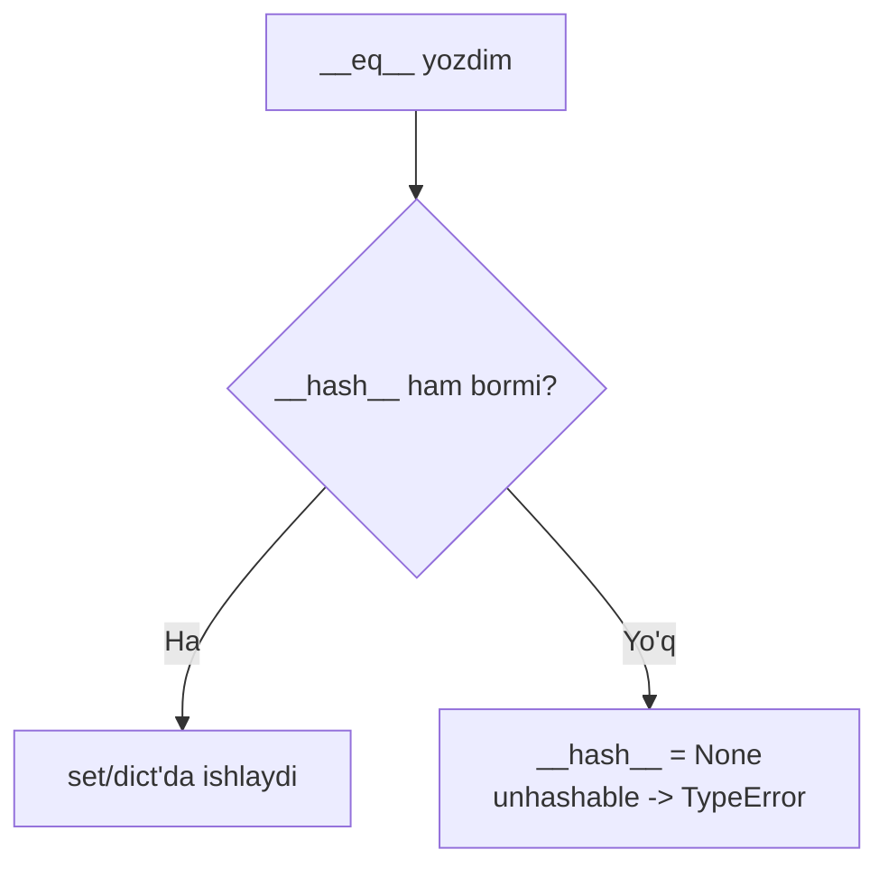
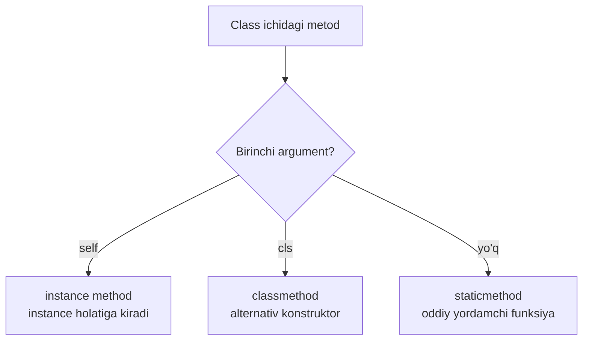

# 16. OOP davomi — dunder, property, dataclass

## Nima uchun kerak? (Hook)

15-darsda class yasadingiz. Endi uni **Python'cha** qilish vaqti. Obyektni `print()` qilganingizda `<__main__.Dog object at 0x104...>` chiqsa — bu foydasiz. Ikki obyektni `==` bilan solishtirganingizda noto'g'ri natija olsangiz — bug. Har attribute uchun `get_x()`/`set_x()` yozsangiz — bu Java, Python emas.

Bu darsda obyektlarni tilning o'ziga "ulaydigan" **dunder metodlar**, Java uslubidagi getter/setter o'rniga `@property`, `@classmethod` vs `@staticmethod`, va boilerplate'ni yo'q qiladigan `@dataclass` ni o'rganamiz. `dataclass` — Go dasturchisi uchun eng yoqimli qism: u Go `struct` ga eng yaqin narsa.

---

## Analogiya: dunder metodlar — universal rozetka

Dunder metod (double underscore, `__ism__`) — bu obyektingizni Python tilining **standart rozetkalariga** ulaydigan simlar. `len(x)` rozetkasiga ulanmoqchimisiz? `__len__` ni yozing. `x == y` rozetkasi? `__eq__`. `x in y`? `__contains__`.

Til operatorlari (`+`, `==`, `len`, `in`, `print`) aslida yashirincha shu dunder metodlarni chaqiradi. Siz ularni yozib, o'z obyektingizni tilning tabiiy qismiga aylantirasiz.

**Analogiya chegarasi:** rozetka simmetrik, lekin dunder metodlar har biri aniq imzoga ega — `__eq__(self, other)` ikki argument oladi, `__len__(self)` esa musbat butun son qaytarishi shart. Xato imzo — xato natija.

> Dunder metod — Python operatorlari va o'rnatilgan funksiyalari (built-in) obyektingiz bilan qanday ishlashini belgilaydigan "ulagich" metod.



---

## `__str__` vs `__repr__` — ikki xil "matn"

Har obyekt matnga aylanishi mumkin, lekin **ikki auditoriya** uchun:

- **`__repr__`** — **dasturchi** uchun: aniq, bir ma'noli, ideal holda kodga o'xshash. Debug va REPL uchun.
- **`__str__`** — **oxirgi foydalanuvchi** uchun: chiroyli, o'qishga qulay. `print()` shuni ishlatadi.

```python
class Vaqt:
    def __init__(self, soat, minut):
        self.soat = soat
        self.minut = minut

    # --- dasturchi uchun: kodga o'xshash, bir ma'noli ---
    def __repr__(self):
        return f"Vaqt({self.soat}, {self.minut})"

    # --- foydalanuvchi uchun: chiroyli ---
    def __str__(self):
        return f"{self.soat:02d}:{self.minut:02d}"

v = Vaqt(9, 5)
print(v)          # __str__ ishlaydi -> 09:05
print(str(v))     # 09:05
print(repr(v))    # Vaqt(9, 5)
v                 # REPL'da __repr__ -> Vaqt(9, 5)
```

**Output:**

```
09:05
09:05
Vaqt(9, 5)
```

### Qaysi birini yozish kerak?

> Agar faqat bittasini yozadigan bo'lsangiz — **`__repr__`** ni yozing. Sabab: `__str__` aniqlanmagan bo'lsa, Python `__repr__` ga qaytadi (fallback); teskarisi ishlamaydi. `__repr__` doim bo'lishi kerak.

| Metod | Kim uchun | Kim chaqiradi | Fallback |
| --- | --- | --- | --- |
| `__repr__` | dasturchi | `repr()`, REPL, debugger, list ichida | yo'q (ildiz) |
| `__str__` | foydalanuvchi | `print()`, `str()`, f-string | `__repr__` ga tushadi |

Go'da bu `String() string` metodi (`fmt.Stringer` interfeysi) ga o'xshaydi — obyektni qanday chop etishni belgilaydi. Python'da esa ikkita daraja bor: texnik (`__repr__`) va chiroyli (`__str__`).

---

## `__eq__` va nega `__hash__` bilan juft

Default holatda `==` obyektlarni **manzil (identity)** bo'yicha solishtiradi — ikki alohida obyekt hech qachon teng emas, hatto ichi bir xil bo'lsa ham. `__eq__` buni **qiymat** bo'yicha solishtirishga o'zgartiradi.

```python
class Nuqta:
    def __init__(self, x, y):
        self.x = x
        self.y = y

    def __eq__(self, other):
        # --- ikki nuqta koordinatalari teng bo'lsa — teng ---
        return self.x == other.x and self.y == other.y

    # --- __eq__ yozsang, __hash__ ni ham ber (set/dict kaliti uchun) ---
    def __hash__(self):
        return hash((self.x, self.y))

a = Nuqta(1, 2)
b = Nuqta(1, 2)
print(a == b)              # True — qiymat bo'yicha teng
print({a, b})              # {Nuqta...} — bitta element (hash bir xil)
```

**Output:**

```
True
{<__main__.Nuqta object at ...>}
```

### Nega juft?

Python'da qoida: **teng obyektlar teng hash'ga ega bo'lishi shart**. `set` va `dict` kalitlarni hash bo'yicha guruhlab, keyin `==` bilan aniqlaydi. Agar `__eq__` yozib `__hash__` yozmasangiz, Python obyektingizni **unhashable** qiladi (`__hash__ = None`) — uni `set` ga yoki `dict` kalitiga qo'yib bo'lmaydi:

```python
class Yomon:
    def __init__(self, x): self.x = x
    def __eq__(self, other): return self.x == other.x
    # __hash__ yozilmagan!

# {Yomon(1)}  ->  TypeError: unhashable type: 'Yomon'
```

> Qoida: `__eq__` yozsangiz, yoki `__hash__` ni ham yozing (obyekt o'zgarmas bo'lsa), yoki uni ataylab `set`/`dict` kaliti qilmang. Keyinroq ko'radigan `@dataclass(frozen=True)` buni siz uchun avtomatik hal qiladi.



---

## `__len__` va `__contains__`

Bu ikki dunder obyektingizni "to'plamga o'xshash" qiladi: `len(x)` va `a in x` ishlaydigan bo'ladi.

```python
class Guruh:
    def __init__(self, talabalar):
        self.talabalar = talabalar

    # --- len(guruh) shuni chaqiradi ---
    def __len__(self):
        return len(self.talabalar)

    # --- "Ali" in guruh shuni chaqiradi ---
    def __contains__(self, ism):
        return ism in self.talabalar

g = Guruh(["Ali", "Vali", "Guli"])
print(len(g))              # 3
print("Ali" in g)          # True
print("Xxx" in g)          # False
```

**Output:**

```
3
True
False
```

---

## `@property` — Java getter/setter'ni unut

### Muammo: Java uslubidagi getter/setter

Boshqa tillardan kelganlar shunday yozadi:

```python
# --- YOMON (Python uchun): get_/set_ metodlar ---
class Harorat:
    def __init__(self, c):
        self._c = c
    def get_selsiy(self):
        return self._c
    def set_selsiy(self, qiymat):
        self._c = qiymat

h = Harorat(25)
print(h.get_selsiy())      # xunuk: h.get_selsiy()
h.set_selsiy(30)
```

Bu ishlaydi, lekin `h.get_selsiy()` — Python emas. Python'da oddiy attribute'ga (`h.selsiy`) o'xshab yozib, lekin ostida mantiq (validatsiya, hisoblash) ishlatish mumkin.

### Yechim: `@property`

`@property` metodni **attribute kabi** o'qish imkonini beradi. Yozish uchun `@ism.setter` qo'shiladi:

```python
class Harorat:
    def __init__(self, selsiy):
        self.selsiy = selsiy       # setter orqali o'tadi

    # --- getter: h.selsiy o'qilganda ishlaydi ---
    @property
    def selsiy(self):
        return self._selsiy

    # --- setter: h.selsiy = X yozilganda ishlaydi + validatsiya ---
    @selsiy.setter
    def selsiy(self, qiymat):
        if qiymat < -273.15:
            raise ValueError("Absolyut noldan past bo'lolmaydi")
        self._selsiy = qiymat

    # --- hisoblanadigan property (faqat o'qish) ---
    @property
    def farengeyt(self):
        return self._selsiy * 9 / 5 + 32

h = Harorat(25)
print(h.selsiy)            # 25 — metod emas, attribute kabi!
print(h.farengeyt)         # 77.0 — avtomatik hisoblandi
h.selsiy = 30              # setter ishlaydi
print(h.farengeyt)         # 86.0
```

**Output:**

```
25
77.0
86.0
```

> `@property` ning kuchi: bugun oddiy attribute (`self.x = x`) bilan boshlab, ertaga validatsiya kerak bo'lsa — uni property'ga aylantirasiz, **API o'zgarmaydi** (`h.selsiy` hamon shunday yoziladi). Java'da esa boshidanoq `getX()` yozishga majbursiz.

`_selsiy` dagi bitta pastki chiziq — "bu ichki (private), tashqaridan tegmang" degan konvensiya. Python buni majburlamaydi, lekin dasturchilar hurmat qiladi.

---

## `@classmethod` vs `@staticmethod`

Class ichida uch xil metod bo'ladi. Farqi — **birinchi argumentda**.

| Metod turi | 1-argument | Nimaga kirish bor | Ishlatilishi |
| --- | --- | --- | --- |
| Instance method | `self` (instance) | instance holatiga | oddiy metodlar |
| `@classmethod` | `cls` (class'ning o'zi) | class'ga (instance emas) | alternativ konstruktor |
| `@staticmethod` | yo'q | hech nimaga (oddiy funksiya) | mantiqan bog'liq yordamchi |

```python
class Sana:
    def __init__(self, kun, oy):
        self.kun = kun
        self.oy = oy

    # --- classmethod: alternativ konstruktor (cls = Sana) ---
    @classmethod
    def matndan(cls, s):
        kun, oy = s.split("-")
        return cls(int(kun), int(oy))     # cls() -> Sana() yasaydi

    # --- staticmethod: class'ga bog'liq, lekin self/cls kerak emas ---
    @staticmethod
    def togri_oymi(oy):
        return 1 <= oy <= 12

    def __repr__(self):
        return f"Sana({self.kun}, {self.oy})"

s = Sana.matndan("15-08")       # instance yasamasdan chaqiriladi
print(s)                        # Sana(15, 8)
print(Sana.togri_oymi(13))      # False
```

**Output:**

```
Sana(15, 8)
False
```

- **`@classmethod`** — eng ko'p **alternativ konstruktor** uchun ishlatiladi (`Sana.matndan(...)`). `cls` — class'ning o'zi, shuning uchun meros bilan ham to'g'ri ishlaydi (bola class'da `cls` = bola).
- **`@staticmethod`** — na `self`, na `cls` kerak; shunchaki class ichiga mantiqan joylashtirilgan oddiy funksiya.



---

## `@dataclass` — boilerplate'ni yo'q qilish

### Muammo: takrorlanuvchi kod

Oddiy "ma'lumot saqlovchi" class yozish uchun `__init__`, `__repr__`, `__eq__` ni qo'lda yozish kerak — hammasi bir xil, zerikarli:

```python
# --- YOMON: qo'lda yozilgan boilerplate ---
class Nuqta:
    def __init__(self, x, y):
        self.x = x
        self.y = y
    def __repr__(self):
        return f"Nuqta(x={self.x}, y={self.y})"
    def __eq__(self, other):
        return (self.x, self.y) == (other.x, other.y)
```

Uch attribute uchun 10+ qator. Xato qilish oson (bir attribute'ni `__eq__` da unutish).

### Yechim: `@dataclass`

`@dataclass` dekoratori `__init__`, `__repr__`, `__eq__` ni siz uchun **avtomatik** yozadi. Siz faqat maydonlarni (fields) type hint bilan e'lon qilasiz:

```python
from dataclasses import dataclass

# --- @dataclass __init__, __repr__, __eq__ ni avtomatik yozadi ---
@dataclass
class Nuqta:
    x: int
    y: int

a = Nuqta(1, 2)
b = Nuqta(1, 2)
print(a)                   # Nuqta(x=1, y=2) — __repr__ tayyor
print(a == b)              # True — __eq__ tayyor
```

**Output:**

```
Nuqta(x=1, y=2)
True
```

Yuqoridagi 10 qator o'rniga — 3 qator. Bu **aynan Go `struct` ga o'xshaydi**:

```go
// --- Go struct: dataclass'ning eng yaqin qarindoshi ---
type Nuqta struct {
    X int
    Y int
}
```

| Jihat | Go struct | Python `@dataclass` |
| --- | --- | --- |
| Maydon e'loni | `X int` | `x: int` |
| Init | `Nuqta{X: 1, Y: 2}` | `Nuqta(1, 2)` |
| Chop etish | `%+v` yoki qo'lda | avtomatik `__repr__` |
| Tenglik | `==` (avtomatik) | avtomatik `__eq__` |
| O'zgarmaslik | qiymat semantikasi | `frozen=True` |

### `field` va default qiymatlar

Mutable default (15-darsdagi tuzoq!) uchun `field(default_factory=...)` ishlatiladi:

```python
from dataclasses import dataclass, field

@dataclass
class Talaba:
    ism: str
    yosh: int = 18                              # oddiy default
    baholar: list = field(default_factory=list) # har instance'ga yangi list

t = Talaba("Ali")
t.baholar.append(5)
print(t)                   # Talaba(ism='Ali', yosh=18, baholar=[5])
print(Talaba("Vali"))      # Talaba(ism='Vali', yosh=18, baholar=[]) — toza!
```

**Output:**

```
Talaba(ism='Ali', yosh=18, baholar=[5])
Talaba(ism='Vali', yosh=18, baholar=[])
```

> Nega `list = []` emas, `field(default_factory=list)`? Chunki `baholar: list = []` bo'lsa, 15-darsdagi mutable-default tuzog'i qaytadi — barcha instance'lar bitta ro'yxatni bo'lishadi. `default_factory=list` har instance'ga yangi bo'sh ro'yxat yasaydi.

### `frozen=True` — o'zgarmas (immutable) dataclass

`frozen=True` obyektni o'zgartirib bo'lmaydigan qiladi va **avtomatik `__hash__` beradi** (`set`/`dict` kaliti bo'la oladi):

```python
from dataclasses import dataclass

@dataclass(frozen=True)
class Koordinata:
    lat: float
    lon: float

k = Koordinata(41.3, 69.2)
print(k in {Koordinata(41.3, 69.2)})   # True — hashable
# k.lat = 42   ->  FrozenInstanceError: cannot assign to field 'lat'
```

**Output:**

```
True
```

Bu `__eq__` + `__hash__` juftligini (yuqorida ko'rgan) siz uchun bir qatorda hal qiladi.

---

## Composition vs Inheritance (qisqacha)

15-darsda inheritance (`class Dog(Hayvon)`) ni ko'rdik: "A **bu** B" (Dog bu Hayvon). **Composition** esa "A **da** B bor": obyekt boshqa obyektlarni ichiga oladi.

```python
# --- Composition: Motor "bu" Mashina emas, Mashina'da Motor "bor" ---
class Motor:
    def ishga_tushir(self):
        return "vrooom"

class Mashina:
    def __init__(self):
        self.motor = Motor()       # Mashina'da Motor bor (composition)
    def yur(self):
        return self.motor.ishga_tushir()

print(Mashina().yur())     # vrooom
```

**Output:**

```
vrooom
```

> Amaliy qoida: "A bu B" bo'lsa — inheritance; "A da B bor" bo'lsa — composition. Zamonaviy tavsiya: shubha bo'lsa, **composition'ni afzal ko'ring** ("composition over inheritance") — u moslashuvchanroq va zich bog'lanishni (tight coupling) kamaytiradi. Aynan shu sabab Go inheritance'ni umuman bermay, embedding/composition'ga tayanadi.

---

## 🤔 O'ylab ko'r

Quyidagi kod nima chop etadi va nega?

```python
from dataclasses import dataclass

@dataclass
class Nuqta:
    x: int
    y: int

s = {Nuqta(1, 2)}      # set'ga qo'yishga urinish
```

<details>
<summary>💡 Javobni ko'rish</summary>

Bu `TypeError: unhashable type: 'Nuqta'` beradi.

Sabab: default `@dataclass` (ya'ni `frozen=False`) `__eq__` ni yozadi, lekin obyekt o'zgaruvchan bo'lgani uchun `__hash__` ni `None` qilib qo'yadi. Xuddi qo'lda `__eq__` yozib `__hash__` yozmaganda bo'lgani kabi (yuqorida ko'rgan qoida) — obyekt unhashable bo'ladi, `set`/`dict` kaliti bo'la olmaydi.

Yechim: `@dataclass(frozen=True)` — u obyektni o'zgarmas qiladi va avtomatik `__hash__` beradi, shunda `set`'ga qo'shsa bo'ladi.

</details>

---

## ⚠️ Ko'p uchraydigan xatolar

**1. Faqat `__str__` yozib, `__repr__` ni unutish**

- Natija: debug/REPL/`list` ichida foydasiz `<object at 0x...>` chiqadi.
- To'g'risi: kamida `__repr__` ni yozing (u `__str__` uchun fallback ham bo'ladi).

**2. `__eq__` yozib `__hash__` ni tashlab ketish**

- Natija: obyekt unhashable, `set`/`dict` kaliti bo'la olmaydi.
- To'g'risi: `__hash__` ni ham yozing yoki `@dataclass(frozen=True)` ishlating.

**3. `@dataclass` da mutable default (`list = []`)**

- Natija: 15-darsdagi tuzoq — barcha instance bitta ro'yxatni bo'lishadi (aslida yangi `dataclass` bunda `ValueError` ham berishi mumkin).
- To'g'risi: `field(default_factory=list)`.

**4. Java uslubidagi `get_x()`/`set_x()` yozish**

- Nega noto'g'ri: Python'da bu ortiqcha; oddiy attribute yoki `@property` yetarli.
- To'g'risi: oddiy `self.x` dan boshlang, mantiq kerak bo'lsa `@property`.

**5. `@classmethod` va `@staticmethod` ni chalkashtirish**

- Noto'g'ri: alternativ konstruktorga `@staticmethod` ishlatish (`cls` yo'qligi merosni buzadi).
- To'g'risi: yangi instance yasaydigan bo'lsa `@classmethod` (`cls`), aks holda `@staticmethod`.

---

## Xulosa

- Dunder metodlar obyektingizni til operatorlariga ulaydi: `__str__`, `__repr__`, `__eq__`, `__len__`, `__contains__`.
- `__repr__` — dasturchi uchun (bir ma'noli), `__str__` — foydalanuvchi uchun; bittasini yozsangiz `__repr__` ni yozing.
- `__eq__` qiymat bo'yicha tenglik beradi; uni yozganda `__hash__` ni ham juft yozing (set/dict uchun).
- `@property` Java getter/setter o'rniga: attribute sintaksisi + ostida mantiq/validatsiya.
- `@classmethod` (`cls`) — alternativ konstruktor; `@staticmethod` — self/cls'siz yordamchi.
- `@dataclass` `__init__`/`__repr__`/`__eq__` ni avtomatik yozadi — Go `struct` ga eng yaqin narsa.
- Mutable default uchun `field(default_factory=list)`; o'zgarmaslik uchun `frozen=True` (u `__hash__` ham beradi).
- "A bu B" -> inheritance; "A da B bor" -> composition (ko'pincha afzalroq).

---

## 🧠 Eslab qol

- `__repr__` = dasturchi uchun, doim yoz; `__str__` = chiroyli, ixtiyoriy.
- `__eq__` yozsang — `__hash__` ni ham (yoki `frozen=True`).
- `@property` = attribute ko'rinishi + metod mantig'i.
- `@classmethod` = `cls` = alternativ konstruktor; `@staticmethod` = self/cls yo'q.
- `@dataclass` = boilerplate yo'q = Python'ning `struct` i.

---

## ✅ O'z-o'zini tekshir

**1.** `__str__` va `__repr__` orasidagi farq nima, va faqat bittasini yozadigan bo'lsangiz qaysi birini yozasiz?

<details>
<summary>Javob</summary>

`__repr__` dasturchi uchun — aniq, bir ma'noli, ideal holda kodga o'xshash (debug, REPL, `list` ichida ko'rinadi). `__str__` foydalanuvchi uchun — chiroyli, `print()`/`str()` ishlatadi. Faqat bittasini yozsangiz — `__repr__` ni yozing, chunki `__str__` aniqlanmaganda Python `__repr__` ga qaytadi (fallback), teskarisi esa ishlamaydi.

</details>

**2.** Nega `__eq__` yozganda `__hash__` ni ham yozish kerak?

<details>
<summary>Javob</summary>

Python qoidasi: teng obyektlar teng hash'ga ega bo'lishi shart, chunki `set`/`dict` avval hash bo'yicha guruhlaydi, keyin `==` bilan tekshiradi. Agar `__eq__` yozib `__hash__` yozmasangiz, Python obyektni unhashable qiladi (`__hash__ = None`) — uni `set` ga yoki `dict` kalitiga qo'yib bo'lmaydi (`TypeError`). Yechim: `__hash__` ni ham yozish yoki `@dataclass(frozen=True)`.

</details>

**3.** `@classmethod` va `@staticmethod` orasidagi asosiy farq nima va qaysi biri alternativ konstruktor uchun?

<details>
<summary>Javob</summary>

`@classmethod` ning birinchi argumenti `cls` — class'ning o'zi, shuning uchun `cls(...)` bilan yangi instance yasay oladi va meros bilan to'g'ri ishlaydi; aynan shu sabab alternativ konstruktor uchun ishlatiladi. `@staticmethod` da esa na `self`, na `cls` bor — bu shunchaki class ichiga mantiqan joylashtirilgan oddiy funksiya (masalan, validatsiya yordamchisi).

</details>

**4.** `@dataclass` sizga qanday boilerplate'ni tejaydi va u Go'dagi nimaga o'xshaydi?

<details>
<summary>Javob</summary>

`@dataclass` `__init__`, `__repr__` va `__eq__` metodlarini avtomatik yozadi — siz faqat maydonlarni type hint bilan e'lon qilasiz. Bu Go `struct` ga o'xshaydi: maydonlarni e'lon qilasiz, tenglik (`==`) va init avtomatik keladi. `frozen=True` esa Go'ning qiymat semantikasi/o'zgarmaslikka yaqin.

</details>

**5.** `@dataclass` ichida `baholar: list = []` yozish nega xato, to'g'risi qanday?

<details>
<summary>Javob</summary>

`= []` mutable default bo'lib, 15-darsdagi tuzoqni qaytaradi — barcha instance'lar bitta umumiy ro'yxatni bo'lishishi mumkin (aslida yangi Python `dataclass` bunday mutable defaultga `ValueError` beradi). To'g'risi: `baholar: list = field(default_factory=list)` — bu har instance yaratilganda yangi bo'sh ro'yxat yasaydi.

</details>

---

## 🛠 Amaliyot

### Oson (Modify)

Quyidagi oddiy class'ni `@dataclass` ga aylantiring (`__init__` va `__repr__` ni o'chirib, dekorator qo'shing).

```python
class Kitob:
    def __init__(self, nom, yil):
        self.nom = nom
        self.yil = yil
    def __repr__(self):
        return f"Kitob(nom={self.nom}, yil={self.yil})"

print(Kitob("SICP", 1985))
```

<details>
<summary>💡 Hint</summary>

```python
from dataclasses import dataclass

@dataclass
class Kitob:
    nom: str
    yil: int

print(Kitob("SICP", 1985))   # Kitob(nom='SICP', yil=1985)
```

`__init__` va `__repr__` avtomatik keladi.

</details>

### O'rta (faded example — to'ldiring)

`Hisob` class'iga `@property` bilan `balans` ni faqat o'qiladigan qiling; `pul_qosh` metodi orqali oshirilsin (manfiy son qo'shib bo'lmaydi).

```python
class Hisob:
    def __init__(self, boshlangich):
        self._balans = boshlangich

    @property
    def balans(self):
        # TODO: _balans ni qaytaring
        return ______

    def pul_qosh(self, miqdor):
        # TODO: manfiy bo'lsa ValueError oting, aks holda qo'shing
        if miqdor < 0:
            raise ______
        self._balans += miqdor

h = Hisob(100)
h.pul_qosh(50)
print(h.balans)      # Kutilgan: 150
```

<details>
<summary>💡 Hint</summary>

```python
    @property
    def balans(self):
        return self._balans

    def pul_qosh(self, miqdor):
        if miqdor < 0:
            raise ValueError("Manfiy bo'lolmaydi")
        self._balans += miqdor
```

`balans` faqat getter bo'lgani uchun `h.balans = 999` yozib bo'lmaydi (`AttributeError`) — bu himoya.

</details>

### Qiyin (Make)

Noldan yozing: `@dataclass(frozen=True)` bilan `Vektor` (maydonlar: `x`, `y`). Unga `__add__` dunder metodini qo'shing, shunda `v1 + v2` yangi `Vektor` qaytarsin. `uzunlik` degan `@property` qo'shing (`(x**2 + y**2) ** 0.5`). `Vektor` obyektlarini `set` ga qo'shsa ishlashini tekshiring.

<details>
<summary>💡 Hint</summary>

Qadamlar:
1. `@dataclass(frozen=True)` -> `x: float`, `y: float`.
2. `def __add__(self, other): return Vektor(self.x + other.x, self.y + other.y)`.
3. `@property` `def uzunlik(self): return (self.x**2 + self.y**2) ** 0.5`.
4. `frozen=True` avtomatik `__hash__` bergani uchun `{Vektor(1,2), Vektor(1,2)}` bitta element bo'ladi.

`__add__` — `+` operatorining dunder ulagichi (rozetka analogiyasi).

</details>

---

## 🔁 Takrorlash

**Bog'liq oldingi mavzular:**
- 15. OOP asoslari — class, `self`, `__init__`; bu dars uni "Python'cha" qiladi.
- 14. Exceptions — `@property` setter'da va `frozen` da `ValueError`/`FrozenInstanceError` otiladi.
- 08. Tuple va Set — `__hash__` nega `set` uchun kerak; immutable obyektlar hashable.

**Takrorlash jadvali (O'z-o'zini tekshir savollariga qayting):**
- Ertaga: `__str__` vs `__repr__` va `__eq__`+`__hash__` juftligini og'zaki ayting.
- 3 kundan keyin: `@classmethod` vs `@staticmethod` farqini kod bilan ko'rsating.
- 1 haftadan keyin: `@dataclass(frozen=True)` bilan hashable ma'lumot class'ini xotiradan yozing.

**Feynman testi:** Do'stingizga kod so'zlarisiz tushuntiring: "Dunder metodlar — obyektimni tilning rozetkalariga ulaydigan simlar (`print`, `==`, `len` shu orqali ishlaydi); `@property` — metodni oddiy attribute'day ko'rsatadigan niqob; `@dataclass` esa zerikarli takror kodni o'zi yozib beradigan yordamchi, xuddi Go `struct` kabi." Uch jumlada ayta olsangiz — o'zlashtirdingiz.

---

> 📚 Manbalar sintezi: Python official tutorial (Data model, dataclasses), Fluent Python (String Representation, Special Methods, dataclasses), Effective Python ("Item: Use @property", "Prefer dataclasses", "Use @classmethod polymorphism"), Real Python (Dunder methods, Data Classes, property).
