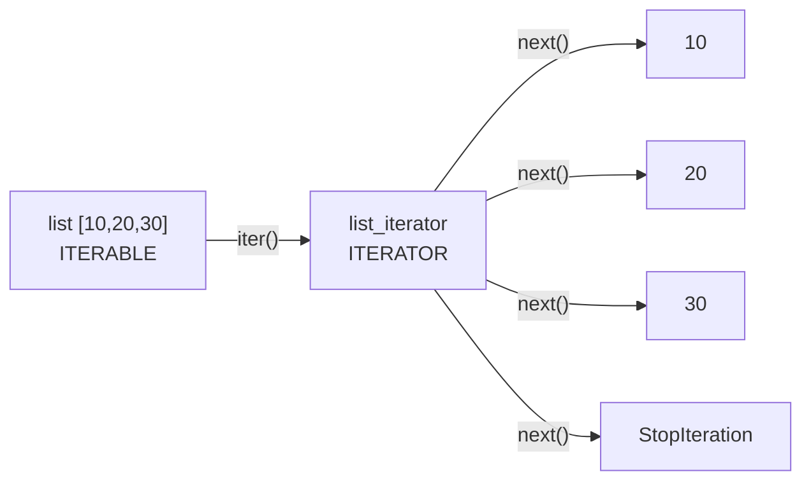
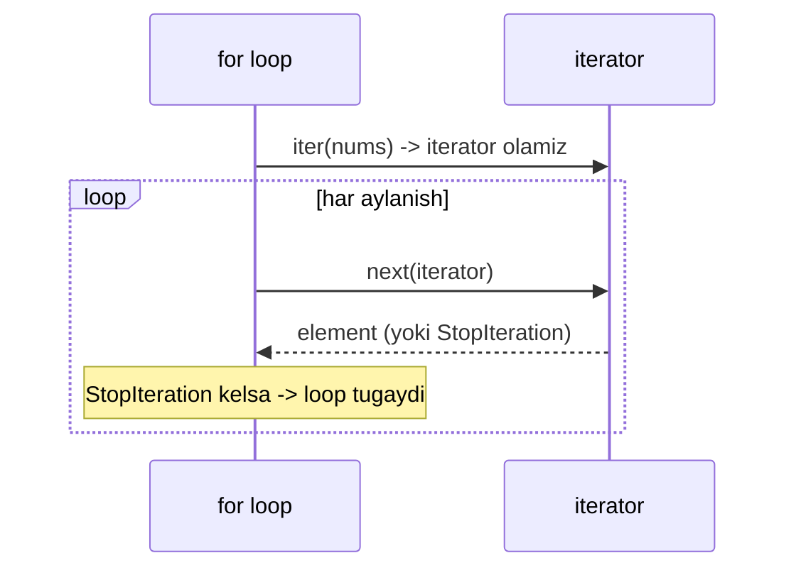
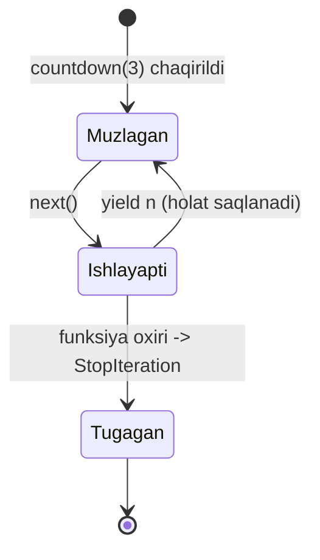

# Iterator va Generator

## Muammo: 10 GB log faylni qanday o'qiysan?

Tasavvur qil: ML pipeline'ing uchun 10 GB CSV faylni qayta ishlamoqchisan. Sodda yechim:

```python
lines = open("huge.csv").readlines()  # BUTUN faylni RAM'ga yuklaydi
for line in lines:
    process(line)
```

Bu kod 10 GB RAM talab qiladi va ehtimol `MemoryError` bilan qulaydi. Muammo shundaki, biz **butun** ma'lumotni bir vaqtda xotiraga oldik — aslida bizga har lahzada faqat **bitta** qator kerak edi.

Yechim — **iterator** va **generator**: ma'lumotni bir zumda emas, **kerak bo'lganda birma-bir** yetkazib beruvchi mexanizmlar. Bu dars — butun ML data pipeline'ing poydevori.

---

## Analogiya: Netflix stream vs DVD

**List** — bu DVD disk: butun film diskda, hammasi qo'lingda, lekin joy egallaydi.

**Iterator** — bu Netflix stream: film serverda turadi, senga faqat hozir ko'rayotgan sekund uzatiladi. Xohlagancha uzun bo'lsin — telefoning xotirasi to'lmaydi.

> Analogiya chegarasi: Netflix'da orqaga qaytarish mumkin, iterator'da esa **YO'Q**. Iterator faqat oldinga yuradi — bir marta ko'rilgan element qayta kelmaydi. Bu muhim tuzoq, pastda ko'ramiz.

---

## Sodda ta'rif

**Iterable** (iteratsiya qilinadigan) — ustidan `for` bilan yura oladigan har qanday obyekt (list, str, dict, fayl).

**Iterator** (iteratsiya qiluvchi) — ma'lumotni birma-bir chiqarib beruvchi, **holatni eslab qoluvchi** obyekt: "keyingi element qaysi" ni biladi.

Bu ikkisi tez-tez chalkashadi — shuning uchun ularni alohida ajratamiz.

---

## Iterable vs Iterator: eng chalkash joy



Farqi bitta jumlada: **iterable** — ma'lumot manbai; **iterator** — o'sha manbadan o'qish uchun "kursor" (o'qish nuqtasi).

| Xususiyat | Iterable | Iterator |
|---|---|---|
| Kerakli metod | `__iter__` | `__iter__` VA `__next__` |
| Holat saqlaydimi? | Yo'q | Ha ("qayerdaman" ni biladi) |
| Misol | `list`, `str`, `dict` | `iter(list)` natijasi |
| `next()` ishlaydimi? | Yo'q | Ha |

Diqqat: har iterator — bu iterable ham (uning `__iter__` metodi `self` ni qaytaradi). Lekin har iterable iterator emas.

```python
# --- 1-qadam: list bir iterable, lekin iterator EMAS ---
nums = [10, 20, 30]
# next(nums)  # TypeError: 'list' object is not an iterator

# --- 2-qadam: iter() bilan undan iterator olamiz ---
it = iter(nums)          # list_iterator obyekti
print(type(it))          # <class 'list_iterator'>

# --- 3-qadam: next() birma-bir element chiqaradi ---
print(next(it))          # 10
print(next(it))          # 20
print(next(it))          # 30
print(next(it))          # StopIteration xatosi!
```

Output:
```
<class 'list_iterator'>
10
20
30
Traceback (most recent call last):
  ...
StopIteration
```

Bu yerdagi `StopIteration` — xato emas, **signal**: "ma'lumot tugadi". `for` loop bu signalni tutib, jimgina to'xtaydi.

---

## `for` loop kaputi ostida: aslida nima bo'ladi?

`for x in nums:` — bu shirin sintaksis (syntactic sugar). Python ichida u aynan quyidagiga aylanadi:



Ya'ni `for` avval `iter()` chaqirib iterator oladi, keyin `StopIteration` kelguncha `next()` ni takror chaqiradi:

```python
# --- Bu ikki kod ABSOLUT bir xil ishlaydi ---

# 1) Odatiy for
for x in [10, 20, 30]:
    print(x)

# 2) for'ning ichki mexanizmi qo'lda yozilgani
it = iter([10, 20, 30])
while True:
    try:
        x = next(it)
    except StopIteration:
        break
    print(x)
```

Output (ikkisi ham):
```
10
20
30
```

> **Oltin qoida:** `for` — bu `iter()` + takroriy `next()` + `StopIteration` ni tutish. Boshqa hech narsa yo'q.

**Go bilan solishtir:** Go'da `for range` faqat aniq tiplar (slice, map, channel, string) uchun ishlaydi. Python'da esa `for` **har qanday** iterator protocol'ni bajaruvchi obyekt bilan ishlaydi — bu ancha universal. Go 1.23 gacha o'z generatoringni yasash uchun `channel` + `goroutine` kerak edi; Python'da esa bitta `yield` yetadi (pastda ko'ramiz).

---

## O'z iterator class'ingni yozish

Endi protocol'ni o'zimiz bajaramiz. Maqsad: `Countdown(3)` -> 3, 2, 1 bersin.

To'g'ri dizaynda **iterable** va **iterator** ajratiladi — shunda bitta obyektni bir necha marta aylanish mumkin:

```python
# --- 1-qadam: Iterable — faqat "yangi iterator ber" deydi ---
class Countdown:
    def __init__(self, start):
        self.start = start
    def __iter__(self):
        return CountdownIterator(self.start)   # HAR SAFAR yangi iterator

# --- 2-qadam: Iterator — holatni saqlaydi va next() beradi ---
class CountdownIterator:
    def __init__(self, current):
        self.current = current
    def __iter__(self):
        return self                            # iterator o'zi ham iterable
    def __next__(self):
        if self.current <= 0:
            raise StopIteration                # tugadi -> signal
        value = self.current
        self.current -= 1
        return value
```

Sinaymiz:

```python
cd = Countdown(3)
print(list(cd))    # [3, 2, 1]
print(list(cd))    # [3, 2, 1]  <- QAYTA ishladi, chunki har list() yangi iterator oldi
```

Output:
```
[3, 2, 1]
[3, 2, 1]
```

**Notional machine:** `CountdownIterator` obyekti heap'da yashaydi va `self.current` maydonida "qayerdaman" ni saqlaydi. Har `next()` bu maydonni o'zgartiradi. `Countdown` esa faqat "zavod" — har `__iter__` da toza holatli yangi iterator ishlab chiqaradi.

---

## Muammo: 40 qator kod juda ko'p

Yuqoridagi Countdown uchun ikkita class, to'rtta metod yozdik. Bu juda ko'p bo'g'iz. Python'da xuddi shu narsani **bitta funksiya** bilan qilsa bo'ladi — bu **generator**.

---

## Generator function: `yield` funksiyani muzlatadi

Generator — ichida `yield` bo'lgan funksiya. `yield` `return` ga o'xshaydi, lekin funksiyani **tugatmaydi** — uni **muzlatib qo'yadi** (pauza), keyingi `next()` da aynan o'sha joydan davom etadi.

```python
# --- Yuqoridagi 15 qator o'rniga — 4 qator ---
def countdown(n):
    while n > 0:
        yield n          # bu yerda MUZLAYDI, qiymatni qaytaradi
        n -= 1           # keyingi next()'da SHU yerdan davom

for x in countdown(3):
    print(x)
```

Output:
```
3
2
1
```

Bu Python o'zi `__iter__`, `__next__` va `StopIteration` ni avtomatik yaratib beradi. Funksiya tugaganda (return yoki oxiriga yetganda) `StopIteration` o'zi ko'tariladi.



**Notional machine — eng muhim joy:** `countdown(3)` ni chaqirganda funksiya **ishga tushmaydi**. U darhol **generator obyekti** qaytaradi. Funksiyaning butun frame'i (lokal o'zgaruvchilar `n`, joriy satr raqami) heap'da saqlanadi. Har `next()` frame'ni "tiriltiradi", `yield` gacha yuguradi, so'ng yana muzlatib qo'yadi. Bu — oddiy funksiya frame'i stack'da tugagach yo'qoladigan odatiy holatdan tubdan farq qiladi.

```python
gen = countdown(3)
print(gen)              # <generator object countdown at 0x...>
print(next(gen))        # 3   <- endi funksiya birinchi marta ishladi
print(next(gen))        # 2
```

Output:
```
<generator object countdown at 0x104f8e...>
3
2
```

🤔 **O'ylab ko'r:** `def f(): return 5; yield 1` — bu funksiyada `return` ham, `yield` ham bor. `f()` chaqirsak nima qaytadi: 5 mi, generator'mi?

<details>
<summary>💡 Javobni ko'rish</summary>

**Generator** qaytadi, `5` emas. Funksiyada **bironta** `yield` bo'lsa, u butunlay generator function'ga aylanadi — `return` endi qiymat qaytarmaydi, balki generatorni to'xtatadi (`StopIteration` ni ko'taradi). Ya'ni:

```python
def f():
    yield 1
    return 5      # qiymat berMAYDI, faqat to'xtatadi
    yield 2       # bu YECHILMAYDI

print(list(f()))  # [1]  <- faqat 1, chunki return'da to'xtadi
```

`return`'dagi qiymat `StopIteration.value` ichiga yashiriladi (`yield from` da ishlatiladi), lekin oddiy `for`/`list` uni ko'rmaydi.
</details>

---

## Generator expression: list comprehension'ning tejamkor ukasi

List comprehension'ni bilasan: `[x*x for x in range(5)]`. Uni **yumaloq qavs** bilan yozsang — generator expression bo'ladi:

```python
# --- List comprehension: HAMMA elementni DARHOL hisoblaydi va saqlaydi ---
squares_list = [x*x for x in range(5)]
print(squares_list)     # [0, 1, 4, 9, 16]

# --- Generator expression: hech narsani oldindan hisoblamaydi (lazy) ---
squares_gen = (x*x for x in range(5))
print(squares_gen)      # <generator object ...>
print(next(squares_gen))  # 0   <- endigina birinchisi hisoblandi
print(list(squares_gen))  # [1, 4, 9, 16]  <- qolganlari (0 allaqachon "yeyilgan")
```

Output:
```
[0, 1, 4, 9, 16]
<generator object <genexpr> at 0x...>
0
[1, 4, 9, 16]
```

---

## Lazy evaluation va xotira: haqiqiy sabab

Generator **lazy** (dangasa) — element faqat so'ralganda hisoblanadi. Buning xotira foydasini o'z ko'zing bilan ko'r:

```python
import sys

# --- 1 million kvadratni ikki usulda ---
as_list = [x*x for x in range(1_000_000)]   # hammasi RAM'da
as_gen  = (x*x for x in range(1_000_000))   # faqat "retsept" saqlanadi

print(sys.getsizeof(as_list))   # ~8_000_000+ bayt (taxminan 8 MB)
print(sys.getsizeof(as_gen))    # ~200 bayt (o'lchamdan MUTLAQO qat'i nazar!)
```

Output (taxminan):
```
8448728
208
```

List xotirasi element soniga proporsional o'sadi; generator esa **doim ~200 bayt** — chunki u ma'lumotni saqlamaydi, faqat uni **qanday yasashni** biladi.

---

## ML pipeline uchun: katta faylni qator-qator o'qish

Endi darsning boshidagi 10 GB muammosiga qaytamiz. Fayl obyekti Python'da **o'zi iterator** — har `next()` da bitta qator beradi:

```python
# --- Generator: faylni qator-qator, xotiraga to'lig'icha yuklamay ---
def read_clean(path):
    with open(path, encoding="utf-8") as f:
        for line in f:                 # fayl -> qatorlar iterator'i
            line = line.rstrip("\n")
            if line:                   # bo'sh qatorlarni tashlab ketamiz
                yield line

# 10 GB bo'lsa ham RAM'da har lahzada faqat BITTA qator turadi
for row in read_clean("huge.csv"):
    process(row)
```

Bu — data engineering va ML'da eng ko'p ishlatiladigan naqsh. `pandas.read_csv(..., chunksize=)`, PyTorch `DataLoader`, TensorFlow `tf.data` — hammasi shu generator g'oyasiga tayanadi.

**Go bilan solishtir:** bu aynan Go'dagi `bufio.Scanner` bilan bir xil g'oya — faylni to'liq o'qimay, `scanner.Scan()` bilan qator-qator olasan. Python'ning fayl-iterator'i shu Scanner'ning tabiiy ekvivalenti.

---

## `yield from`: iterator ichida iterator

Bir generatorda boshqa iterable'ni to'liq "quyib yuborish" kerak bo'lsa, ichma-ich loop o'rniga `yield from` ishlatiladi:

```python
# --- Loop bilan (uzun) ---
def chain_loop(*iterables):
    for it in iterables:
        for x in it:
            yield x

# --- yield from bilan (qisqa, aynan bir xil natija) ---
def chain(*iterables):
    for it in iterables:
        yield from it          # butun it'ni birma-bir uzatadi

print(list(chain([1, 2], (3, 4), "ab")))
```

Output:
```
[1, 2, 3, 4, 'a', 'b']
```

`yield from` shunchaki qulaylik emas — u ichki generatorga qiymat yuborish (`send`) va uning `return` qiymatini uzatishni ham to'g'ri boshqaradi. Hozircha "ichki iterable'ni to'liq uzat" deb tushunsang yetarli.

---

## ⚠️ Keng tarqalgan xatolar

### 1. Generatorni ikki marta ishlatish (eng katta tuzoq)

**Noto'g'ri tasavvur:** "generator list kabi, xohlagancha aylanaman."

```python
gen = (x for x in range(3))
print(list(gen))    # [0, 1, 2]
print(list(gen))    # []   <- BO'SH! Nega?
```

Output:
```
[0, 1, 2]
[]
```

**Nega noto'g'ri:** generator — bir martalik. Birinchi `list()` uni to'liq "yedi", kursor oxirida qoldi. Ikkinchi `list()` bo'shlikni ko'radi.

**To'g'risi:** qayta kerak bo'lsa, generatorni **qayta yarat** yoki natijani list'ga saqla:

```python
data = list(x for x in range(3))   # bir marta ro'yxatga oldik
print(data)   # [0, 1, 2]
print(data)   # [0, 1, 2]  <- endi qayta ishlaydi
```

### 2. Iterable'ni iterator deb o'ylash

**Noto'g'ri:** `next([1, 2, 3])` -> `TypeError`. List — iterable, lekin iterator emas; avval `iter()` kerak: `next(iter([1, 2, 3]))`.

### 3. Generator darhol hisoblaydi deb o'ylash

```python
def gen():
    print("ISHGA TUSHDI")
    yield 1

g = gen()          # hech narsa chop etilmaydi!
print("hali yo'q")
next(g)            # ENDI "ISHGA TUSHDI" chiqadi
```

Output:
```
hali yo'q
ISHGA TUSHDI
```

**To'g'ri model:** generatorni chaqirish faqat obyekt yaratadi; kod birinchi `next()` da yuguradi. Bu "lazy" ning aynan ma'nosi.

### 4. `return` bilan qiymat qaytarishga urinish

Generator ichidagi `return x` qiymatni `for`/`list` ga bermaydi. Qiymat kerak bo'lsa, `yield` ishlat.

---

## Xulosa

- **Iterable** — ustidan yurish mumkin bo'lgan obyekt (`__iter__` bor); **iterator** — holatni saqlab, `next()` bilan birma-bir beruvchi obyekt (`__iter__` + `__next__`).
- `for` loop aslida `iter()` + takroriy `next()` + `StopIteration` ni tutishdan iborat.
- `StopIteration` — xato emas, "tugadi" degan signal.
- **Generator function** (`yield` bor) protocol'ni avtomatik yaratadi; `yield` funksiyani muzlatadi, `next()` uni davom ettiradi.
- **Generator expression** `(...)` — list comprehension'ning lazy, xotira tejaydigan varianti.
- Lazy evaluation tufayli generator element sonidan qat'i nazar ~doimiy xotira ishlatadi — 10 GB fayllar uchun hayotiy.
- Generator **bir martalik**: yedingmi — tugadi.

## 🧠 Eslab qol

- Iterable — manba, iterator — kursor; iterator holatni eslab qoladi.
- `for` = `iter()` + `next()` loop + `StopIteration`.
- `yield` funksiyani muzlatadi va butun frame'ni saqlaydi.
- `(x for x in ...)` — genexpr, xotira tejaydi; `[x for x in ...]` — hammasini saqlaydi.
- Generatorni ikki marta aylanib bo'lmaydi — bir martalik.

## ✅ O'z-o'zini tekshir (retrieval practice)

1. **Nega** `next([1, 2, 3])` `TypeError` beradi, lekin `for x in [1, 2, 3]` ishlaydi?

<details>
<summary>Javob</summary>

List — iterable, iterator emas (unda `__next__` yo'q). `next()` iterator talab qiladi. `for` esa avval o'zi `iter()` chaqirib list'dan iterator oladi, keyin `next()` ishlatadi. Ya'ni `for` bu ishni sen uchun bajaradi.
</details>

2. **Nima bo'ladi**, agar generator'ni `list()` ga ikki marta bersak?

<details>
<summary>Javob</summary>

Birinchi `list()` to'liq elementlarni oladi (masalan `[0,1,2]`), ikkinchisi **bo'sh** `[]` qaytaradi. Generator bir martalik — birinchi o'tishda "yeyilib" bo'ladi va kursor oxirda qoladi.
</details>

3. **Farqi nima:** `[x*x for x in range(10**8)]` va `(x*x for x in range(10**8))`?

<details>
<summary>Javob</summary>

Birinchisi — list comprehension: 100 million kvadratni **darhol** hisoblab RAM'ga yig'adi (bir necha GB, ehtimol `MemoryError`). Ikkinchisi — generator expression: hech narsa hisoblanmaydi, ~200 baytlik "retsept" saqlanadi; qiymatlar faqat iteratsiyada birma-bir yaraladi.
</details>

4. **Nega** `g = gen()` qatorida generator ichidagi `print` chop etilmaydi?

<details>
<summary>Javob</summary>

Generatorni chaqirish faqat generator obyektini yaratadi, kodni **ishga tushirmaydi**. Funksiya tanasi faqat birinchi `next(g)` (yoki `for`) da yuguradi. Bu lazy evaluation.
</details>

5. **Nima farqi bor** iterator'ning `__iter__` metodi bilan iterable'ning `__iter__` metodi orasida?

<details>
<summary>Javob</summary>

Iterable'ning `__iter__` **yangi** iterator qaytaradi (zavod kabi). Iterator'ning `__iter__` esa `self` ni qaytaradi (u o'zi tayyor kursor). Shu sabab iterator'ni ham `for`'ga berish mumkin.
</details>

## 🛠 Amaliyot

### Oson (Modify)

Yuqoridagi `countdown(n)` generatorini `countdown(n, step)` ga o'zgartir: har safar `step` qadam kamaysin. `countdown(10, 3)` -> `10, 7, 4, 1`.

<details>
<summary>Hint</summary>

`while n > 0:` shartini qoldirib, `n -= 1` o'rniga `n -= step` yoz. Manfiy o'tib ketmasligi uchun `while n > 0` yetarli, oxirgi qiymat 1 bo'ladi.
</details>

### O'rta (faded example — to'ldir)

Fibonacci sonlarini **cheksiz** ishlab chiqaruvchi generator yoz — u hech qachon tugamaydi, `next()` har safar keyingi Fibonacci sonini beradi:

```python
def fibonacci():
    a, b = 0, 1
    while True:
        # TODO: joriy qiymatni yield qil
        # TODO: a va b ni keyingi juftlikka o'tkaz (a, b = b, a + b)
        ...

fib = fibonacci()
print([next(fib) for _ in range(8)])   # [0, 1, 1, 2, 3, 5, 8, 13] bo'lsin
```

<details>
<summary>Hint</summary>

```python
def fibonacci():
    a, b = 0, 1
    while True:
        yield a
        a, b = b, a + b
```

`while True` cheksiz, lekin generator lazy bo'lgani uchun bu xavfsiz — faqat so'ralgan sonlar hisoblanadi.
</details>

### Qiyin (Make)

`take(n, iterable)` generatorini noldan yoz: har qanday iterable'dan (shu jumladan cheksiz generator'dan) faqat **birinchi n** elementni beradi. Keyin uni yuqoridagi `fibonacci()` bilan sinab ko'r: `list(take(5, fibonacci()))` -> `[0, 1, 1, 2, 3]`.

<details>
<summary>Hint</summary>

```python
def take(n, iterable):
    it = iter(iterable)
    for _ in range(n):
        yield next(it)
```

`iter(iterable)` bilan universal ishlaydi (list ham, generator ham). Cheksiz generatorda ham xavfsiz, chunki faqat `n` marta `next()` chaqiriladi. Ilg'or variant: `itertools.islice(iterable, n)` xuddi shuni beradi.
</details>

## 🔁 Takrorlash

**Bog'liq oldingi mavzular:**
- Python Basics 06 — Loops (`for`, `range`, `enumerate`): `for` endi sen uchun sirli emas.
- Python Basics 07 — List comprehension: genexpr uning lazy ukasi.
- Python Basics 13 — Fayllar (`with open`): fayl-iterator shu darsda ishlatildi.

**Keyingi mavzuga ko'prik:**
- 02 Decorator — funksiya obyekt ekani; generator ham funksiya, u ham obyekt.
- 07 Functional Python — `itertools` (islice, chain, count) generatorlarning tayyor to'plami.

**Takrorlash jadvali** ("O'z-o'zini tekshir" savollariga qayt):
- Ertaga: 1, 2-savol (iterable vs iterator, bir martalik tuzoq).
- 3 kundan keyin: 3, 4-savol (genexpr xotirasi, lazy).
- 1 haftadan keyin: hammasi + Fibonacci generatorni yoddan qayta yoz.

**Feynman testi:** Kod so'zlarini ishlatmasdan, do'stingga 3 jumlada tushuntir: "Iterator — kitobxonaga bir vaqtda butun kitobni bermay, faqat joriy sahifani beradigan usul. Generator — o'sha kitobni yozib turadigan yozuvchi: har sahifa so'ralganda to'xtagan joyidan davom etadi. Shu sabab million sahifalik kitob ham xotiraga sig'adi."
