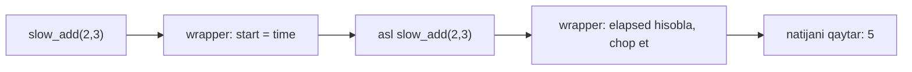
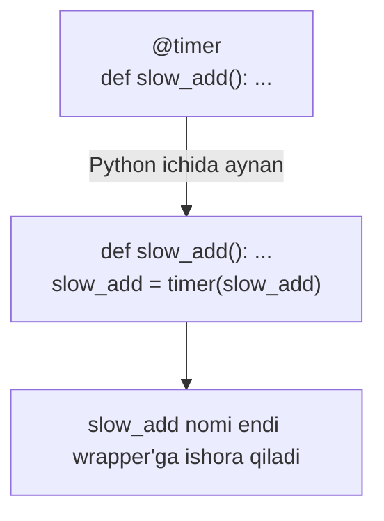
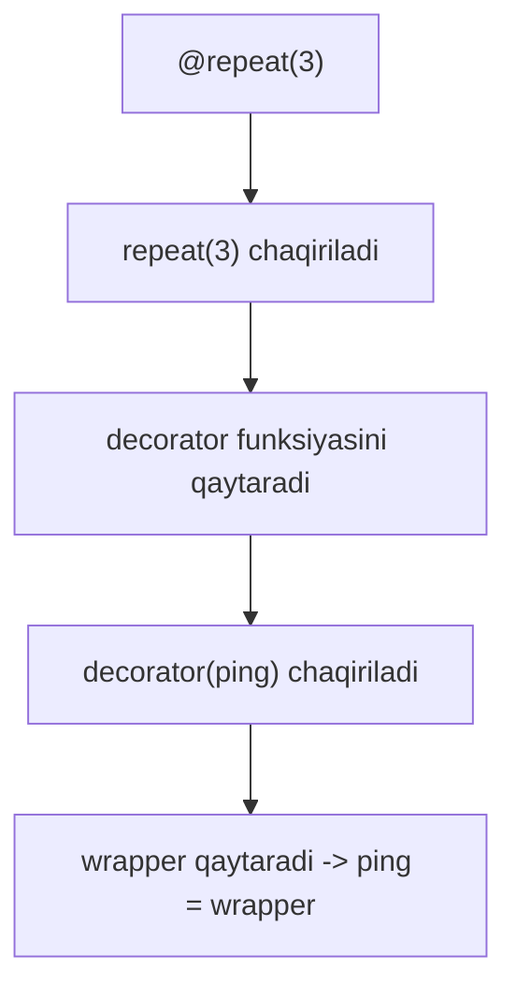

# Decorator

## Muammo: 20 ta funksiyaga bir xil kodni yopishtirding

Tasavvur qil: ML servisingdagi har bir funksiya qancha vaqt ishlashini o'lchamoqchisan. Sodda yechim — har funksiyaga vaqt o'lchash kodini qo'lda yozish:

```python
def train_model():
    start = time.perf_counter()
    # ... asosiy ish ...
    print(f"vaqt: {time.perf_counter() - start:.3f}s")

def load_data():
    start = time.perf_counter()
    # ... asosiy ish ...
    print(f"vaqt: {time.perf_counter() - start:.3f}s")
```

20 ta funksiya bo'lsa — 20 marta bir xil kod (copy-paste). Vaqt o'lchash formatini o'zgartirsang — 20 joyni tahrirlaysan. Bu DRY prinsipini buzadi.

Yechim — **decorator**: funksiyani "o'rab olib", uning atrofiga qo'shimcha xatti-harakat qo'shadigan mexanizm. Bitta joyda yozasan, `@` bilan istagan funksiyaga yopishtirasan.

---

## Analogiya: sovg'a qutisi

Funksiya — sovg'a. **Decorator** — o'rov qog'ozi va lentacha. Sovg'aning o'zi (funksiya mantig'i) o'zgarmaydi, lekin uning ustiga qo'shimcha qatlam qo'shiladi — chiroy, yorliq, himoya.

> Analogiya chegarasi: o'rov qog'ozini yechib sovg'ani olasan. Decorator esa doimiy — o'ralgan funksiya endi **shu** o'ralgan holida ishlaydi, ichini "yechib" olmaysan. To'g'rirog'i, decorator sovg'ani boshqa, kattaroq quti bilan **almashtiradi**.

---

## Sodda ta'rif

**Decorator** — funksiyani argument sifatida olib, uni o'rab, **yangi funksiya** qaytaruvchi funksiya.

Buni tushunish uchun avval bir haqiqatni yodga olamiz: **Python'da funksiya ham oddiy obyekt** (first-class object). Uni o'zgaruvchiga berish, argument qilib uzatish, qaytarish mumkin.

---

## Poydevor 1: funksiya = obyekt

```python
def shout(text):
    return text.upper()

# --- 1-qadam: funksiyani o'zgaruvchiga beramiz (chaqirmaymiz!) ---
yell = shout                 # qavs yo'q -> funksiyaning O'ZINI oldik
print(yell("salom"))         # SALOM

# --- 2-qadam: funksiya ham xususiyatlarga ega obyekt ---
print(shout.__name__)        # shout
print(type(shout))           # <class 'function'>

# --- 3-qadam: funksiyani boshqa funksiyaga argument qilib beramiz ---
def apply_twice(func, value):
    return func(func(value))

print(apply_twice(shout, "hi"))   # HI (ikki marta upper, farqsiz)
```

Output:
```
SALOM
shout
<class 'function'>
HI
```

**Notional machine:** `def shout(...)` bajarilganda heap'da bitta function obyekti yaraladi, `shout` nomi unga ko'rsatadi (pointer). `yell = shout` xuddi shu obyektga ikkinchi nom beradi — nusxa emas, **bir** obyekt, ikki yorliq. Bu Go'da `f := shout` bilan funksiya qiymatini o'zgaruvchiga olishga to'la mos.

---

## Poydevor 2: closure (yodga olish)

**Closure** — ichki funksiya, tashqi funksiyaning o'zgaruvchisini "eslab qoladi", hatto tashqi funksiya tugagach ham:

```python
def make_multiplier(factor):
    def multiply(x):
        return x * factor        # factor tashqaridan "eslab qolinadi"
    return multiply              # ichki funksiyani qaytaramiz

double = make_multiplier(2)
triple = make_multiplier(3)
print(double(5))                 # 10
print(triple(5))                 # 15
```

Output:
```
10
15
```

**Notional machine:** `make_multiplier(2)` tugagach ham `factor=2` yo'qolmaydi — u `multiply` obyektining `__closure__` cell'ida saqlanadi. `double` va `triple` — ikki alohida closure, har biri o'z `factor` nusxasi bilan. Bu mexanizm decorator'ning butun sirini ochadi.

---

## Decorator'ni QOLDA yozamiz (@ ishlatmasdan)

Endi ikki poydevorni birlashtiramiz. Vaqt o'lchaydigan "o'ram" yozamiz:

```python
import time

# --- 1-qadam: decorator — funksiya oladi, o'ralgan funksiya qaytaradi ---
def timer(func):
    # --- 2-qadam: wrapper — asl funksiya atrofiga qo'shimcha mantiq ---
    def wrapper(*args, **kwargs):
        start = time.perf_counter()
        result = func(*args, **kwargs)          # asl funksiyani chaqiramiz
        elapsed = time.perf_counter() - start
        print(f"{func.__name__} -> {elapsed:.4f}s")
        return result                           # asl natijani qaytaramiz
    return wrapper                              # o'ralgan funksiyani qaytaramiz

# --- 3-qadam: oddiy funksiya ---
def slow_add(a, b):
    time.sleep(0.1)
    return a + b

# --- 4-qadam: QOLDA decorate: funksiyani o'zgartirib qaytaramiz ---
slow_add = timer(slow_add)      # endi slow_add aslida wrapper!

print(slow_add(2, 3))
```

Output:
```
slow_add -> 0.1001s
5
```

Diqqat: `slow_add = timer(slow_add)` qatoridan keyin `slow_add` nomi endi **wrapper**'ga ko'rsatadi. Chaqirganingda avval vaqt o'lchanadi, keyin asl funksiya ishlaydi.



**Go bilan solishtir:** bu aynan Go'dagi middleware naqshi. Go'da HTTP handler'ni o'rash:

```go
func Timer(next http.Handler) http.Handler {
    return http.HandlerFunc(func(w http.ResponseWriter, r *http.Request) {
        start := time.Now()
        next.ServeHTTP(w, r)               // asl handler
        log.Printf("%v", time.Since(start))
    })
}
```

Ko'ryapsanmi — bir xil g'oya: funksiya oladi, o'ralgan funksiya qaytaradi. Farq shundaki, Python'da buni **qo'lda** yozish o'rniga bitta `@` belgisi bor.

---

## `@` — bu shunchaki shakar (syntactic sugar)

```python
@timer
def slow_add(a, b):
    time.sleep(0.1)
    return a + b
```

Bu kod **aynan** quyidagiga teng:

```python
def slow_add(a, b):
    time.sleep(0.1)
    return a + b
slow_add = timer(slow_add)      # @timer shuning qisqartmasi
```

> **Oltin qoida:** `@decorator` funksiya ta'rifidan yuqorida — bu faqat `funksiya = decorator(funksiya)` ning chiroyli yozuvi. Boshqa hech qanday sehr yo'q.



---

## Muammo: decorate qilingan funksiya o'z "shaxsini" yo'qotadi

Decorate qilingan funksiyaning nomi va docstring'iga qara:

```python
@timer
def greet(name):
    """Foydalanuvchiga salom beradi."""
    return f"Salom, {name}"

print(greet.__name__)    # 'wrapper'  <- YO'QOLDI! greet emas
print(greet.__doc__)     # None       <- docstring ham yo'q
```

Output:
```
wrapper
None
```

**Nega:** `greet` endi `wrapper` obyektiga ishora qiladi, shuning uchun `wrapper`'ning nomi va docstring'i ko'rinadi. Asl `greet`'ning metadata'si "ko'milib" ketdi. Bu debugging, logging va IDE avtokomplitini buzadi.

**Yechim — `functools.wraps`:** u asl funksiyaning metadata'sini wrapper'ga ko'chiradi:

```python
from functools import wraps

def timer(func):
    @wraps(func)                     # <- asl funksiya "shaxsini" ko'chiradi
    def wrapper(*args, **kwargs):
        start = time.perf_counter()
        result = func(*args, **kwargs)
        print(f"{func.__name__} -> {time.perf_counter() - start:.4f}s")
        return result
    return wrapper

@timer
def greet(name):
    """Foydalanuvchiga salom beradi."""
    return f"Salom, {name}"

print(greet.__name__)    # 'greet'  <- tiklandi
print(greet.__doc__)     # Foydalanuvchiga salom beradi.
```

Output:
```
greet
Foydalanuvchiga salom beradi.
```

> **Qoida:** har doim wrapper'ga `@wraps(func)` qo'y. Bu bir qatorlik odat keyinchalik soatlab debugging'dan qutqaradi.

---

## Argument qabul qiladigan decorator: uch qavat!

Ba'zan decorator'ning o'ziga parametr kerak: masalan `@repeat(3)` — funksiyani 3 marta chaqir. Buning uchun **yana bitta qavat** qo'shiladi:

```python
from functools import wraps

# --- Qavat 1: parametrni oladi (times), decorator qaytaradi ---
def repeat(times):
    # --- Qavat 2: funksiyani oladi (odatiy decorator) ---
    def decorator(func):
        # --- Qavat 3: haqiqiy ish (wrapper) ---
        @wraps(func)
        def wrapper(*args, **kwargs):
            for _ in range(times):
                result = func(*args, **kwargs)
            return result
        return wrapper
    return decorator

@repeat(3)
def ping():
    print("ping")

ping()
```

Output:
```
ping
ping
ping
```

Nega uch qavat kerak? Chunki `@repeat(3)` avval **chaqiriladi** (`repeat(3)`), va uning natijasi decorator bo'lishi kerak:



Ya'ni `@repeat(3)` = `ping = repeat(3)(ping)`. Ikki marta chaqiruv — shuning uchun ikki emas, uch qavat. Argumentsiz decorator'da faqat ikki qavat yetadi.

🤔 **O'ylab ko'r:** `@repeat` ni qavs va argumentsiz yozsak — `@repeat` (3 siz) — nima bo'ladi?

<details>
<summary>💡 Javobni ko'rish</summary>

Xato bo'ladi. `@repeat` = `ping = repeat(ping)` degani. Bu holda `repeat` funksiyasi `times=ping` (funksiya obyekti!) qabul qiladi va `decorator` funksiyasini qaytaradi. Endi `ping` nomi `decorator`'ga ishora qiladi — u funksiya kutadi, chaqirsang `ping()` xato beradi (`decorator()` argumentsiz chaqirilib, `func` yetishmaydi yoki `range(ping)` da `TypeError`).

Xulosa: argument oladigan decorator'da qavs **shart** — hatto `@repeat()` kabi bo'sh bo'lsa ham (agar default'lar bo'lsa). Bu keng tarqalgan tuzoq.
</details>

---

## Real misol: `retry` decorator

Tarmoq so'rovi ba'zan uzuiladi. Muvaffaqiyatsizlikda avtomatik qayta urinadigan decorator — ML'da API'lardan data yig'ishda hayotiy:

```python
from functools import wraps

def retry(attempts):
    def decorator(func):
        @wraps(func)
        def wrapper(*args, **kwargs):
            for i in range(1, attempts + 1):
                try:
                    return func(*args, **kwargs)      # muvaffaqiyat -> chiqamiz
                except Exception as e:
                    print(f"urinish {i}/{attempts} muvaffaqiyatsiz: {e}")
            raise RuntimeError(f"{attempts} urinish ham foydasiz")
        return wrapper
    return decorator

_calls = {"n": 0}

@retry(attempts=3)
def flaky():
    _calls["n"] += 1
    if _calls["n"] < 3:
        raise ConnectionError("tarmoq uzildi")
    return "muvaffaqiyat!"

print(flaky())
```

Output:
```
urinish 1/3 muvaffaqiyatsiz: tarmoq uzildi
urinish 2/3 muvaffaqiyatsiz: tarmoq uzildi
muvaffaqiyat!
```

---

## Real misol: `functools.lru_cache` (tayyor decorator)

`lru_cache` — standart kutubxonadagi tayyor decorator. U funksiya natijalarini **eslab qoladi** (memoization): bir xil argument bilan qayta chaqirsang, hisoblamay tayyor javobni beradi.

```python
from functools import lru_cache

@lru_cache(maxsize=None)
def fib(n):
    if n < 2:
        return n
    return fib(n - 1) + fib(n - 2)

print(fib(40))            # 102334155  <- bir zumda (cache'siz sekundlar)
print(fib.cache_info())   # cache statistikasi
```

Output:
```
102334155
CacheInfo(hits=38, misses=41, maxsize=None, currsize=41)
```

`lru_cache`'siz `fib(40)` millionlab takroriy chaqiruv qiladi (eksponensial). Cache bilan har `n` faqat **bir marta** hisoblanadi (chiziqli) — bu decorator'ning kuchi: funksiya kodiga tegmay, uning xatti-harakatini tubdan yaxshiladik.

**LRU** = Least Recently Used: `maxsize` cheklangan bo'lsa, cache to'lganda eng kam ishlatilgan natija chiqarib tashlanadi.

---

## ⚠️ Keng tarqalgan xatolar

### 1. `@wraps` ni unutish

**Noto'g'ri tasavvur:** "metadata muhim emas". Aslida `@wraps(func)` siz `help(greet)`, IDE hint'lari, logging'da funksiya nomi buziladi. **To'g'risi:** har wrapper'ga `@wraps(func)` qo'y.

### 2. Argument oladigan decorator'da qavsni unutish

```python
@retry          # XATO: qavs va argument yo'q
def f(): ...
```
`@retry(attempts=3)` yozish shart. `@retry` esa `retry(f)` deb chaqirib buziladi (yuqoridagi predict savolga qara).

### 3. Wrapper ichida `return` ni unutish

```python
def timer(func):
    @wraps(func)
    def wrapper(*args, **kwargs):
        func(*args, **kwargs)     # natija OLINDI, lekin qaytarilMADI
    return wrapper
```
Bu holda decorate qilingan funksiya doim `None` qaytaradi. Har doim `return func(...)` yoki natijani saqlab `return result`.

### 4. Argumentlarni to'g'ri uzatmaslik

Wrapper doim `*args, **kwargs` qabul qilib, ularni `func`'ga uzatishi kerak. Aks holda decorator faqat argumentsiz funksiyalar bilan ishlaydi va boshqalarni buzadi.

### 5. Decorator "asl funksiyani o'zgartiradi" deb o'ylash

Decorator asl funksiyani **almashtiradi** (nomni wrapper'ga bog'laydi), asl obyektni tahrirlamaydi. Asl funksiyaning o'zi hali ham `wrapper.__wrapped__` orqali qo'lda ochiladi (`@wraps` tufayli).

---

## Xulosa

- Python'da funksiya — birinchi darajali obyekt: o'zgaruvchiga berish, uzatish, qaytarish mumkin.
- **Closure** ichki funksiyaga tashqi o'zgaruvchini "eslab qolish" imkonini beradi — decorator'ning yuragi.
- **Decorator** funksiya oladi, wrapper qaytaradi; `@decorator` = `f = decorator(f)`.
- `@` — faqat sintaktik shakar, sehr emas.
- `functools.wraps` asl funksiyaning nomi/docstring'ini saqlaydi — har doim ishlat.
- Argument oladigan decorator uch qavatli: parametr -> decorator -> wrapper; qavs shart.
- `retry`, `timer`, `logging`, `lru_cache` — kunlik ML/backend ishida tez-tez uchraydi.

## 🧠 Eslab qol

- Funksiya ham obyekt; uni uzatish va qaytarish mumkin.
- `@dec` = `f = dec(f)`, boshqa hech narsa emas.
- Wrapper'ga doim `@wraps(func)` qo'y.
- Argumentli decorator = uch qavat, qavs majburiy.
- `lru_cache` — funksiya kodiga tegmay uni tezlashtiradigan tayyor decorator.

## ✅ O'z-o'zini tekshir (retrieval practice)

1. **Nima farqi bor** `f = timer` va `f = timer(func)` orasida?

<details>
<summary>Javob</summary>

`f = timer` — `timer` funksiyasining o'ziga ikkinchi nom beradi (chaqirmaydi). `f = timer(func)` esa `timer`'ni `func` bilan **chaqiradi** va natijasini (wrapper funksiyani) `f`'ga beradi. Decorator ikkinchisini ishlatadi.
</details>

2. **Nega** decorate qilingan funksiyaning `__name__` `'wrapper'` bo'lib qoladi va buni qanday tuzatasan?

<details>
<summary>Javob</summary>

Chunki nom endi wrapper obyektiga ishora qiladi, uning `__name__` esa `'wrapper'`. Tuzatish: wrapper ustiga `@wraps(func)` qo'yish — u asl funksiyaning `__name__`, `__doc__`, `__module__` va boshqa metadata'sini ko'chiradi.
</details>

3. **Nega** `@repeat(3)` da uch qavat funksiya kerak, `@timer` da esa ikki?

<details>
<summary>Javob</summary>

`@repeat(3)` avval `repeat(3)` deb **chaqiriladi** va u decorator qaytarishi kerak; keyin o'sha decorator funksiyaga qo'llaniladi. Ikki chaqiruv = uch qavat (parametr -> decorator -> wrapper). `@timer` esa to'g'ridan-to'g'ri `timer(func)` — bir chaqiruv, ikki qavat yetadi.
</details>

4. **Nima bo'ladi**, agar wrapper ichida `return func(...)` o'rniga shunchaki `func(...)` yozsak?

<details>
<summary>Javob</summary>

Decorate qilingan funksiya doim `None` qaytaradi, chunki wrapper asl natijani qaytarmaydi. Asl funksiya ishlaydi (side-effect'lar bo'ladi), lekin qiymati yo'qoladi.
</details>

5. **Go'dagi qaysi naqsh** Python decorator'iga eng yaqin va asosiy farq nima?

<details>
<summary>Javob</summary>

Middleware / handler-wrapping naqshi (`func(next Handler) Handler`). G'oya bir xil: funksiya olib, o'ralgan funksiya qaytarish. Asosiy farq — Go'da o'rashni **qo'lda** (`h = Timer(Logging(h))`) yozasan, Python'da esa `@` sintaksisi va `functools` yordamchilari (wraps, lru_cache) bor.
</details>

## 🛠 Amaliyot

### Oson (Modify)

Yuqoridagi `timer` decorator'ini o'zgartir: vaqtni faqat chop etmasin, balki `func.__name__` bilan birga millisekundlarda ko'rsatsin (`s` emas `ms`). Masalan: `slow_add -> 100.1 ms`.

<details>
<summary>Hint</summary>

`elapsed = (time.perf_counter() - start) * 1000` va format'ni `f"{func.__name__} -> {elapsed:.1f} ms"` qil.
</details>

### O'rta (faded example — to'ldir)

Chaqiruvni logga yozadigan decorator yoz: funksiya nomi, argumentlari va natijasini chop etsin.

```python
from functools import wraps

def log_calls(func):
    # TODO: @wraps(func) qo'y
    def wrapper(*args, **kwargs):
        # TODO: "CHAQIRUV: {nom}({args}, {kwargs})" ni chop et
        result = func(*args, **kwargs)
        # TODO: "NATIJA: {result}" ni chop et
        return result
    return wrapper

@log_calls
def add(a, b):
    return a + b

add(2, 3)
# CHAQIRUV: add((2, 3), {})
# NATIJA: 5
```

<details>
<summary>Hint</summary>

```python
from functools import wraps

def log_calls(func):
    @wraps(func)
    def wrapper(*args, **kwargs):
        print(f"CHAQIRUV: {func.__name__}({args}, {kwargs})")
        result = func(*args, **kwargs)
        print(f"NATIJA: {result}")
        return result
    return wrapper
```
</details>

### Qiyin (Make)

`@debounce_count(n)` decorator'ini noldan yoz: funksiya faqat **har n-chi** chaqiruvda haqiqiy ishlasin, oraliqdagilarni e'tiborsiz qoldirsin (`None` qaytarsin). Masalan `@debounce_count(3)` bilan 1-, 2-chaqiruv `None`, 3-chaqiruv haqiqiy natija.

<details>
<summary>Hint</summary>

Uch qavatli decorator kerak. Hisoblagichni closure ichida saqla (`nonlocal` yoki o'zgaruvchan obyekt):

```python
from functools import wraps

def debounce_count(n):
    def decorator(func):
        count = 0
        @wraps(func)
        def wrapper(*args, **kwargs):
            nonlocal count
            count += 1
            if count % n == 0:
                return func(*args, **kwargs)
            return None
        return wrapper
    return decorator
```

`nonlocal count` closure o'zgaruvchisini o'zgartirishga ruxsat beradi (aks holda `count += 1` yangi lokal yaratadi).
</details>

## 🔁 Takrorlash

**Bog'liq oldingi mavzular:**
- Python Basics 10 — Funksiyalar (`*args`/`**kwargs`): wrapper aynan shularni ishlatadi.
- Python Basics 11 — Scope va closure (`nonlocal`): decorator'ning yuragi.
- 01 Iterator va Generator — generator ham funksiya, u ham obyekt sifatida uzatiladi.

**Keyingi mavzuga ko'prik:**
- 03 Context manager — `@contextmanager` decorator generatorni context manager'ga aylantiradi.
- 07 Functional Python — `functools` (partial, reduce, lru_cache) chuqurroq.
- 05 OOP chuqur — `@property`, `@staticmethod`, `@classmethod` ham decorator'lar.

**Takrorlash jadvali** ("O'z-o'zini tekshir" savollariga qayt):
- Ertaga: 1, 3-savol (`@` shakar ekani, uch qavat mantig'i).
- 3 kundan keyin: `timer` decorator'ini yoddan qayta yoz.
- 1 haftadan keyin: hammasi + argumentli `retry` ni yoddan yoz.

**Feynman testi:** Kod so'zlarisiz do'stingga 3 jumlada tushuntir: "Decorator — funksiyani sovg'a qutisiga o'raydigan usul: ichidagi mantiq o'zgarmaydi, lekin atrofiga vaqt o'lchash yoki qayta urinish kabi qo'shimcha qatlam qo'shiladi. `@` belgisi shunchaki 'shu funksiyani mana bu quti bilan o'ra' degan qisqartma. Shu tufayli bitta joyda yozgan mantiqni yuzta funksiyaga bir belgi bilan yopishtirasan."
