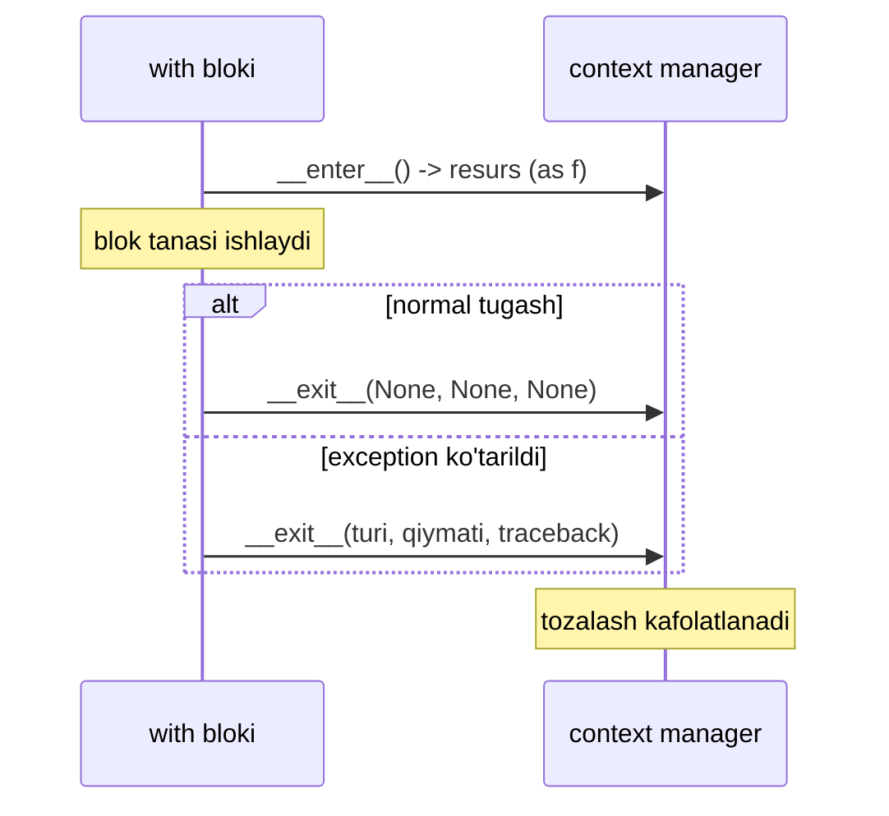
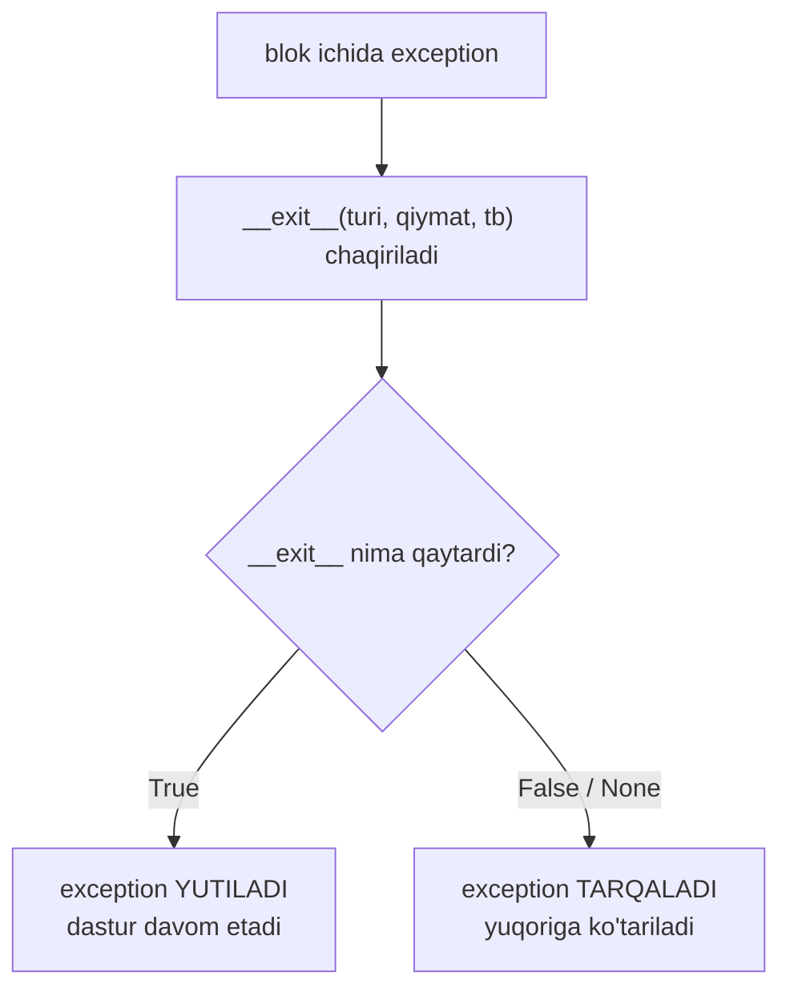

# Context manager

## Muammo: ochilgan fayl yopilmay qoldi

Fayl o'qishning "sodda" yo'li — va undagi yashirin bomba:

```python
f = open("data.txt")
data = process(f.read())   # <- agar bu yerda xato ko'tarilsa...
f.close()                  # ...bu qator HECH QACHON ishlamaydi
```

Agar `process()` exception ko'tarsa, `f.close()` gacha yetib bormaydi — fayl **ochiq qoladi** (resource leak). Yuzlab so'rov bo'lsa, operatsion tizimning fayl deskriptorlari tugaydi va servis qulaydi.

`try/finally` bilan tuzatsa bo'ladi, lekin har resursda buni takrorlash — charchatadi:

```python
f = open("data.txt")
try:
    data = process(f.read())
finally:
    f.close()              # endi HAR holatda ishlaydi
```

Yechim — **context manager** va `with`: resursni ochish va **kafolatli yopishni** bitta konstruksiyaga jamlaydi.

---

## Analogiya: mehmonxona xonasi

`with` — mehmonxonaga kirish. Kirganda **kalit olasan** (`__enter__`), chiqqanda **avtomatik hisob-kitob va tozalash** bo'ladi (`__exit__`) — yong'in chiqsa ham, sen shoshib chiqsang ham, xona **doim** tozalanadi.

> Analogiya chegarasi: mehmonxonada tozalash sen ketganingdan **keyin** bo'ladi. `with`'da `__exit__` blok tugashi bilan **darhol** ishlaydi — hatto keyingi qatorlar ko'p bo'lsa ham. Muhimi: chiqish sababidan qat'i nazar (normal tugash yoki exception) tozalash kafolatlanadi.

---

## Sodda ta'rif

**Context manager** — `with` bloki bilan ishlaydigan, blok **boshida** biror ish qiladigan (resurs ochish) va blok **oxirida** kafolatli tozalash qiladigan obyekt.

U ikki metod bilan aniqlanadi: `__enter__` (kirishda) va `__exit__` (chiqishda).

---

## `with` kaputi ostida

```python
with open("data.txt") as f:
    data = f.read()
# bu yerga kelganda fayl ALLAQACHON yopilgan
```

Python bu kodni ichida quyidagiga aylantiradi:



Ya'ni `with` = `__enter__` + blok + **kafolatli** `__exit__`. Muhim: `__exit__` blok qanday tugashidan qat'i nazar (normal, `return`, `break`, exception) **doim** chaqiriladi.

**Go bilan solishtir:** bu Go'dagi `defer` ning tabiiy analogi:

```go
func read() {
    f, _ := os.Open("data.txt")
    defer f.Close()     // funksiya tugaganda ishlaydi
    data, _ := io.ReadAll(f)
    // ...
}
```

Ikkovi ham "tozalashni oldindan e'lon qil, keyin unut" g'oyasi. Asosiy farqni pastda chuqurroq ko'ramiz.

---

## O'z context manager'ingni class bilan yozish

Vaqt o'lchagich yasaymiz — `with` bloki necha soniya ishlaganini ko'rsatadi:

```python
import time

class Timer:
    # --- 1-qadam: __enter__ — blok boshida ishlaydi, resurs qaytaradi ---
    def __enter__(self):
        self.start = time.perf_counter()
        return self                      # `as t` -> t = shu obyekt

    # --- 2-qadam: __exit__ — blok oxirida DOIM ishlaydi ---
    def __exit__(self, exc_type, exc_val, exc_tb):
        self.elapsed = time.perf_counter() - self.start
        print(f"vaqt: {self.elapsed:.4f}s")

# --- 3-qadam: ishlatamiz ---
with Timer() as t:
    time.sleep(0.1)
    total = sum(range(1000))

print(f"saqlangan: {t.elapsed:.4f}s")
```

Output:
```
vaqt: 0.1001s
saqlangan: 0.1001s
```

**Notional machine:** `with Timer() as t` bajarilganda: (1) `Timer()` obyekt yaraladi, (2) uning `__enter__()` chaqiriladi va qaytargan qiymati `t`'ga bog'lanadi, (3) blok ishlaydi, (4) blok tugashi bilan `__exit__()` chaqiriladi. `return self` bo'lmasa, `t` `None` bo'lib qoladi — bu keng tarqalgan tuzoq.

---

## `__exit__` va exception: eng nozik qism

`__exit__` uchta argument oladi — bular blok ichida sodir bo'lgan exception haqida ma'lumot:

| Argument | Normal tugashda | Exception bo'lganda |
|---|---|---|
| `exc_type` | `None` | exception klassi (masalan `ValueError`) |
| `exc_val` | `None` | exception obyekti |
| `exc_tb` | `None` | traceback obyekti |

Va eng muhim qoida: **`__exit__` `True` qaytarsa, exception "yutiladi"** (bostiriladi, tashqariga chiqmaydi). `False`/`None` qaytarsa — exception odatdagidek tarqaladi.



Buni ishlatib, ma'lum exception'larni yutadigan context manager yozamiz:

```python
class Suppress:
    def __init__(self, *exceptions):
        self.exceptions = exceptions
    def __enter__(self):
        return self
    def __exit__(self, exc_type, exc_val, exc_tb):
        # --- exception bor VA bizni qiziqtirgan turdan bo'lsa -> yutamiz ---
        if exc_type is not None and issubclass(exc_type, self.exceptions):
            print(f"yutildi: {exc_val}")
            return True                  # <- exception'ni bostiradi
        return False                     # boshqa xatolar tarqaladi

with Suppress(ValueError):
    print("boshlandi")
    int("xato")                          # ValueError ko'tariladi
    print("bu chop etilmaydi")           # bu yergacha yetmaydi
print("dastur davom etyapti")
```

Output:
```
boshlandi
yutildi: invalid literal for int() with base 10: 'xato'
dastur davom etyapti
```

Diqqat: `int("xato")` xato berdi, blok darhol to'xtadi, lekin dastur **qulamadi** — `__exit__` `True` qaytargani uchun exception yutildi. Standart kutubxonada bu tayyor: `contextlib.suppress(ValueError)`.

> **Ogohlantirish:** `__exit__`'dan **beixtiyor** `True` qaytarish — yashirin bug manbai. Agar hech qachon `return` yozmasang, funksiya `None` (ya'ni "yutma") qaytaradi — bu odatda to'g'ri xatti-harakat.

---

## `contextlib.contextmanager`: generator bilan qisqartma

Class yozish uzun. `contextlib.contextmanager` decorator'i **generator**'ni context manager'ga aylantiradi. Formula oddiy: `try` / `yield` / `finally`.

```python
from contextlib import contextmanager
import time

@contextmanager
def timer():
    start = time.perf_counter()          # __enter__ qismi (yield'gacha)
    try:
        yield                            # <- with bloki SHU yerda ishlaydi
    finally:
        elapsed = time.perf_counter() - start
        print(f"vaqt: {elapsed:.4f}s")   # __exit__ qismi (yield'dan keyin)

with timer():
    time.sleep(0.1)
```

Output:
```
vaqt: 0.1001s
```

**Notional machine — chiroyli hiyla:** `@contextmanager` generatordan foydalanadi. `yield`'gacha bo'lgan kod — `__enter__` (blok kirishida bir marta yuguradi). `yield` funksiyani muzlatadi va boshqaruvni `with` blokiga beradi. Blok tugagach generator qayta "tiriladi" va `yield`'dan keyingi kod (`finally`) ishlaydi — bu `__exit__`. 01-darsdagi "yield funksiyani muzlatadi" bilimi shu yerda ishga tushdi.

`yield` qiymat ham bera oladi (u `as` orqali olinadi):

```python
from contextlib import contextmanager

@contextmanager
def tag(name):
    print(f"<{name}>")
    try:
        yield name                       # `as t` -> t = name
    finally:
        print(f"</{name}>")

with tag("div") as t:
    print(f"  ichida: {t}")
```

Output:
```
<div>
  ichida: div
</div>
```

> **Nega `try/finally` shart:** blok ichida exception bo'lsa ham tozalash ishlashi kerak. `finally` buni kafolatlaydi. `try` siz yozsang, exception'da `yield`'dan keyingi kod ishlamay qoladi — resurs oqadi.

🤔 **O'ylab ko'r:** `@contextmanager` funksiyasida `yield` ni **ikki marta** yozsak nima bo'ladi?

<details>
<summary>💡 Javobni ko'rish</summary>

`RuntimeError: generator didn't stop` xatosi ko'tariladi. Context manager generatori **aynan bitta** marta `yield` qilishi kerak: bir marta boshqaruvni blokka berish uchun. Blok tugagach generator davom etib **tugashi** kerak (ikkinchi `yield`'ga bormasligi). Ikkinchi `yield` bo'lsa, `__exit__` bosqichida generator to'xtamaydi va Python xato beradi.

Ya'ni: `yield`'dan oldin — sozlash, `yield`'dan keyin — tozalash. Bitta `yield`, ikki bosqichni ajratadi.
</details>

---

## Real misollar

### 1. Lock (thread xavfsizligi)

`threading.Lock` — context manager. `with` avtomatik `acquire()` va `release()` qiladi:

```python
import threading

lock = threading.Lock()
counter = 0

def increment():
    global counter
    with lock:                           # acquire()
        counter += 1                     # critical section
    # bu yerda avtomatik release() — hatto xato bo'lsa ham

increment()
print(counter)                           # 1
```

Output:
```
1
```

`lock.acquire()` / `lock.release()` ni qo'lda yozsang, oradagi exception lock'ni ochiq qoldiradi va **deadlock** yuzaga keladi. `with` buni yo'qotadi.

### 2. Vaqtinchalik papka (avtomatik o'chadi)

```python
import tempfile, os

with tempfile.TemporaryDirectory() as tmp:
    print(f"papka bor: {os.path.isdir(tmp)}")     # True
    # bu yerda vaqtinchalik fayllar bilan ishlaymiz

print(f"papka bor: {os.path.isdir(tmp)}")         # False — o'chirildi
```

Output:
```
papka bor: True
papka bor: False
```

ML'da model checkpoint'lari, oraliq datasetlar uchun juda qulay — blokdan chiqishing bilan disk tozalanadi.

### 3. DB transaction (commit/rollback)

Eng kuchli naqsh: xato bo'lsa `rollback`, muvaffaqiyatda `commit`:

```python
from contextlib import contextmanager

@contextmanager
def transaction(conn):
    try:
        yield conn
        conn.commit()                    # xato bo'lmasa -> saqla
    except Exception:
        conn.rollback()                  # xato bo'lsa -> bekor qil
        raise                            # exception'ni tashqariga chiqar

# Ishlatilishi:
# with transaction(conn) as c:
#     c.execute("UPDATE accounts SET balance = balance - 100 WHERE id = 1")
#     c.execute("UPDATE accounts SET balance = balance + 100 WHERE id = 2")
# ikkisi ham muvaffaqiyatli -> commit; birortasi xato -> rollback
```

Bu yerda `raise` muhim: rollback qildik, lekin xatoni **yashirmaymiz** — chaqiruvchi bilishi kerak.

---

## Go `defer` bilan chuqur solishtirish

Ikkovi ham resurs tozalashni kafolatlaydi, lekin **qamrov (scope)** turlicha:

| Xususiyat | Python `with` | Go `defer` |
|---|---|---|
| Qachon ishlaydi | **blok** oxirida | **funksiya** oxirida |
| Qamrov | aniq `with` bloki | butun funksiya |
| Bir necha resurs | ichma-ich yoki vergul | bir necha `defer` (LIFO) |
| Resursni erta yopish | ha (blokni tugat) | yo'q (funksiya tugashini kutadi) |
| Xatoni yutish | `__exit__ -> True` | mumkin emas (faqat `recover`) |

Muhim farq — **donadorlik (granularity)**:

```python
def process():
    with open("a.txt") as fa:
        a = fa.read()
    # fa BU YERDA yopildi — funksiya davom etsa ham
    with open("b.txt") as fb:
        b = fb.read()
    return a + b
```

Go'da ikkala fayl funksiya oxirigacha ochiq turadi:

```go
func process() string {
    fa, _ := os.Open("a.txt")
    defer fa.Close()          // funksiya oxirigacha ochiq
    a, _ := io.ReadAll(fa)
    fb, _ := os.Open("b.txt")
    defer fb.Close()          // bu ham funksiya oxirigacha
    b, _ := io.ReadAll(fb)
    return string(a) + string(b)
}
```

> **Xulosa:** `with` — blok darajasida, aniqroq nazorat; `defer` — funksiya darajasida, qulayroq lekin resursni erta ozod qilib bo'lmaydi. `with` "shu bloklik", `defer` "shu funksiyalik".

---

## ⚠️ Keng tarqalgan xatolar

### 1. `__enter__`'da `return self` ni unutish

```python
class Timer:
    def __enter__(self):
        self.start = time.perf_counter()
        # return YO'Q!
    def __exit__(self, *a):
        ...

with Timer() as t:
    ...
print(t)      # None — chunki __enter__ hech narsa qaytarmadi
```
`as t` ishlatsang, `__enter__` biror qiymat qaytarishi shart. Aks holda `t = None`.

### 2. `with` ni `try/except` deb o'ylash

**Noto'g'ri tasavvur:** "`with` xatoni tutadi." Aslida oddiy `with` xatoni **tutmaydi** — u `try/finally` kabi, faqat tozalashni kafolatlaydi. Xato baribir tarqaladi (agar `__exit__` maxsus `True` qaytarmasa).

### 3. `@contextmanager`'da `try/finally` ni tushirib qoldirish

```python
@contextmanager
def bad():
    resource = acquire()
    yield resource
    release(resource)      # exception bo'lsa BU ISHLAMAYDI
```
`yield` da exception ko'tarilsa `release` bajarilmaydi. Doim `try: yield ... finally: cleanup`.

### 4. `__exit__`'dan tasodifan `True` qaytarish

Agar `__exit__` oxirida `return True` yoki `True`ga teng qiymat qaytarsang, **barcha** exception'lar jimgina yutiladi — bug'lar ko'rinmay qoladi. Yutish kerak bo'lmasa, hech narsa qaytarma (`None`) yoki `False`.

### 5. `__exit__`'ni noto'g'ri imzo bilan yozish

`__exit__(self, exc_type, exc_val, exc_tb)` — aynan uch parametr shart (self'dan tashqari). Kamroq yozsang, exception paytida `TypeError` olasan.

---

## Xulosa

- `with` resurs ochish va **kafolatli tozalashni** bitta konstruksiyaga jamlaydi — leak muammosini yo'qotadi.
- Context manager `__enter__` (kirishda, resurs qaytaradi) va `__exit__` (chiqishda, doim ishlaydi) metodlaridan iborat.
- `__exit__` uch argument oladi: exception turi/qiymati/traceback (yoki normal tugashda `None, None, None`).
- `__exit__` `True` qaytarsa exception yutiladi; `False`/`None` qaytarsa tarqaladi.
- `@contextlib.contextmanager` + generator (`try/yield/finally`) — class'siz qisqa yozuv.
- Real qo'llanish: fayl, lock, timer, temp papka, DB transaction.
- Go `defer` funksiya oxirigacha, `with` blok oxirigacha — `with` donaroq.

## 🧠 Eslab qol

- `with` = `__enter__` + blok + kafolatli `__exit__`.
- `__enter__` qaytargan qiymat `as` ga boradi; `return self` ni unutma.
- `__exit__` `True` = exception yut; `None` = tarqat.
- `@contextmanager` = `try / yield / finally`.
- `with` blok oxirigacha, Go `defer` funksiya oxirigacha.

## ✅ O'z-o'zini tekshir (retrieval practice)

1. **Nima bo'ladi**, agar `with` bloki ichida exception ko'tarilsa — `__exit__` chaqiriladimi?

<details>
<summary>Javob</summary>

Ha, `__exit__` **doim** chaqiriladi — normal tugash, `return`, `break` yoki exception, farqi yo'q. Exception bo'lganda unga `exc_type, exc_val, exc_tb` uzatiladi. Agar `__exit__` `True` qaytarsa exception yutiladi, aks holda tarqaladi.
</details>

2. **Farqi nima:** `__exit__` `True` qaytarishi va `False`/`None` qaytarishi?

<details>
<summary>Javob</summary>

`True` — blok ichidagi exception **yutiladi**, dastur `with`'dan keyin xotirjam davom etadi. `False`/`None` — exception odatdagidek yuqoriga tarqaladi (bostirilmaydi). Odatiy holat `None` (yutmaslik).
</details>

3. **Nega** `@contextmanager` da `try/finally` shart, oddiy `yield` yetmaydi?

<details>
<summary>Javob</summary>

`try/finally` bo'lmasa, blok ichida exception ko'tarilganda `yield`'dan keyingi tozalash kodi ishlamay qoladi — resurs oqadi. `finally` tozalashni har qanday holatda (xato ham) kafolatlaydi. `yield`'gacha = sozlash, `finally` ichi = tozalash.
</details>

4. **Farqi nima** Python `with` va Go `defer` orasida qamrov jihatidan?

<details>
<summary>Javob</summary>

`with` — **blok** oxirida tozalaydi, shuning uchun funksiya davom etsa ham resursni erta ozod qilish mumkin. `defer` — **funksiya** oxirida ishlaydi, resurs funksiya tugaguncha ochiq turadi. `with` donaroq (granular) nazorat beradi.
</details>

5. **Nima bo'ladi**, agar `__enter__` `return` yozmasa, lekin `as t` ishlatilsa?

<details>
<summary>Javob</summary>

`t` `None` bo'ladi, chunki `__enter__` hech narsa qaytarmasa Python `None` qaytaradi va aynan shu `as` ga boradi. Keyin `t` bilan ishlashda `AttributeError` yoki mantiqiy xatolar chiqadi. `as` kerak bo'lsa `__enter__` biror qiymat (ko'pincha `self`) qaytarishi shart.
</details>

## 🛠 Amaliyot

### Oson (Modify)

Yuqoridagi class'li `Timer`'ni o'zgartir: `with Timer("data loading") as t` deb yorliq berish mumkin bo'lsin va chiqishda `data loading: 0.1001s` ko'rinishida chop etsin.

<details>
<summary>Hint</summary>

`__init__(self, label)` qo'sh, `self.label = label` saqla, `__exit__` da `print(f"{self.label}: {self.elapsed:.4f}s")` yoz.
</details>

### O'rta (faded example — to'ldir)

`@contextmanager` bilan fayl ochib, avtomatik yopadigan (`open`'ning soddalashtirilgan varianti) context manager yoz:

```python
from contextlib import contextmanager

@contextmanager
def open_file(path, mode="r"):
    f = open(path, mode)
    try:
        # TODO: f ni yield qil (as bilan olinsin)
        ...
    finally:
        # TODO: faylni yop
        ...

with open_file("test.txt", "w") as f:
    f.write("salom")
# fayl avtomatik yopildi
```

<details>
<summary>Hint</summary>

```python
@contextmanager
def open_file(path, mode="r"):
    f = open(path, mode)
    try:
        yield f
    finally:
        f.close()
```

`yield f` faylni `as f` ga beradi; `finally: f.close()` xato bo'lsa ham yopishni kafolatlaydi.
</details>

### Qiyin (Make)

`ignore_errors(*exceptions)` context manager'ini class bilan noldan yoz: berilgan turdagi exception'larni yutsin, boshqalarini o'tkazsin. Standart kutubxonadagi `contextlib.suppress` ga o'xshash. Sinov:

```python
with ignore_errors(KeyError, IndexError):
    d = {}
    print(d["yoq"])          # KeyError — yutiladi
print("davom etamiz")        # bu chop etilishi kerak
```

<details>
<summary>Hint</summary>

```python
class ignore_errors:
    def __init__(self, *exceptions):
        self.exceptions = exceptions
    def __enter__(self):
        return self
    def __exit__(self, exc_type, exc_val, exc_tb):
        return exc_type is not None and issubclass(exc_type, self.exceptions)
```

`__exit__` mos exception bo'lsa `True` (yut), aks holda `False`/`None` (tarqat) qaytaradi. `exc_type is None` bo'lsa `False` qaytadi — normal tugashda hech narsa yutilmaydi.
</details>

## 🔁 Takrorlash

**Bog'liq oldingi mavzular:**
- Python Basics 13 — Fayllar (`with open`): endi `with` ning ichki mexanizmini bilasan.
- Python Basics 14 — Exceptions (`try/finally`): `with` aynan shuni avtomatlashtiradi.
- 01 Iterator va Generator (`yield` muzlatadi): `@contextmanager` shu bilimga tayanadi.
- 02 Decorator (`@`): `@contextmanager` — oddiy decorator.

**Keyingi mavzuga ko'prik:**
- 09 Threading va GIL — `with lock` bu yerda hayotiy.
- 11 Asyncio — `async with` (asinxron context manager).

**Takrorlash jadvali** ("O'z-o'zini tekshir" savollariga qayt):
- Ertaga: 1, 2-savol (`__exit__` chaqiriladimi, `True`/`None` farqi).
- 3 kundan keyin: `@contextmanager` timer'ni yoddan qayta yoz.
- 1 haftadan keyin: hammasi + `with` vs `defer` jadvalini yoddan tikla.

**Feynman testi:** Kod so'zlarisiz do'stingga 3 jumlada tushuntir: "Context manager — mehmonxona xonasi kabi: kirganingda kalit olasan, chiqqaningda xona doim tozalanadi — yong'in chiqsa ham. Shu tufayli fayl yoki lock'ni ochib, uni yopishni unutish mumkin emas: blok tugashi bilan avtomatik yopiladi. Go'dagi `defer` ham shunga o'xshaydi, faqat u funksiya tugaganda, `with` esa aniq blok tugaganda ishlaydi."
