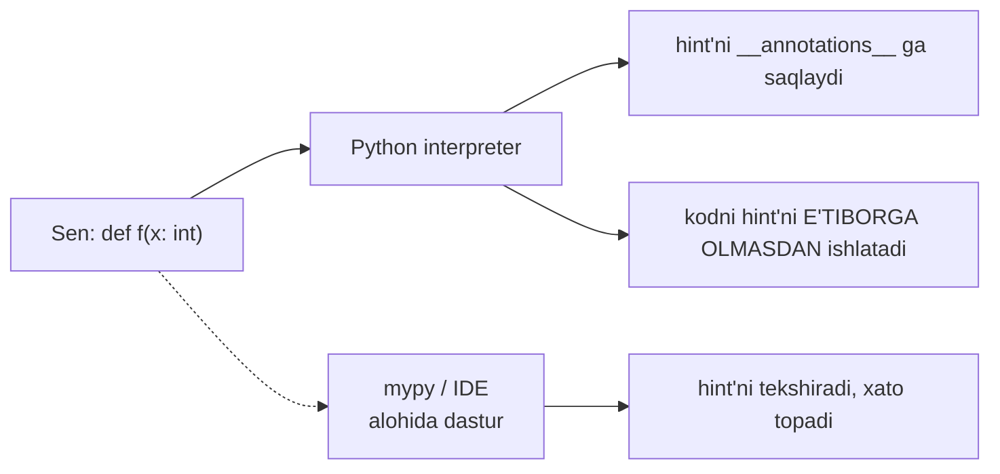
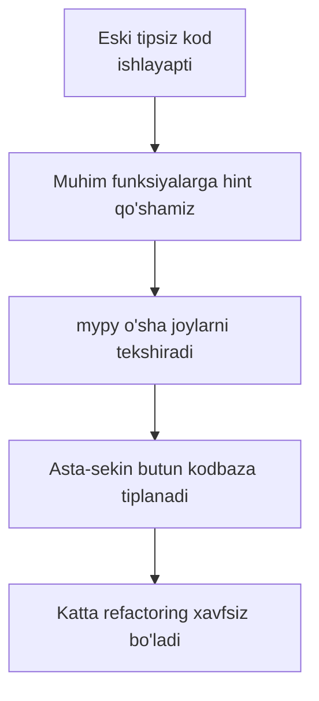

# Type hints

## Muammo: bu funksiya nima qabul qiladi?

Go'dan kelgan odamga bu og'riq tanish. 50 000 qatorlik Python kodbazadagi funksiyaga duch kelasan:

```python
def process(data, config, callback):
    ...
```

`data` — list'mi, dict'mi, DataFrame'mi? `config` nima kutadi? `callback` qanday imzoli funksiya? Kodni **o'qib** yoki **ishga tushirib** aniqlaysan. IDE avtokomplit bermaydi, refactoring xavfli, bug'lar faqat runtime'da chiqadi.

Go'da bunday muammo yo'q — imzo hamma narsani aytadi: `func Process(data []Record, config Config, cb func(int) error)`. Python'da esa tiplar tanani "ovqatlantirmaydi".

Yechim — **type hints**: kodga tip ma'lumotini yozib qo'yasan. IDE tushunadi, statik tekshiruvchi bug topadi, kod o'z-o'zini hujjatlaydi. Go'dan tanish qadriyatlar — lekin muhim bir tuzoq bilan.

---

## Analogiya: oziq-ovqat yorlig'i

Type hint — mahsulot ustidagi **tarkib yorlig'i**: "shakar 12g, glyuten bor". Yorliq mahsulotni **o'zgartirmaydi** — u faqat ma'lumot. Xohlasang o'qiysan, sog'ligingga foydali; xohlamasang — mahsulot baribir ishlaydi.

> Analogiya chegarasi: haqiqiy dunyoda yorliq yolg'on bo'lsa jarima bor. Python'da esa type hint yolg'on bo'lsa (`x: int` deb string berilsa) — **hech kim** ushlamaydi, dastur baribir ishlayveradi. Yorliqni tekshiradigan "inspektor" — bu alohida dastur (`mypy`), uni o'zing chaqirishing kerak.

---

## Sodda ta'rif

**Type hint** — o'zgaruvchi, funksiya parametri yoki qaytaruvchi qiymatning tipini bildiruvchi izoh. U kodni **ishga tushirmasdan** (statik) tekshirish uchun ishlatiladi.

Eng muhim haqiqat: **Python type hint'larni runtime'da TEKSHIRMAYDI**. Bu — Go'dan eng katta farq. Buni butun dars davomida yodda tut.

---

## Asosiy sintaksis

```python
# --- 1-qadam: o'zgaruvchi tipi — nom : tip ---
name: str = "Ali"
age: int = 25
pi: float = 3.14
active: bool = True

# --- 2-qadam: funksiya — parametr : tip, qaytaruvchi -> tip ---
def greet(name: str, times: int) -> str:
    return f"Salom, {name}! " * times

print(greet("Ali", 2))
```

Output:
```
Salom, Ali! Salom, Ali! 
```

`->` funksiya **nima qaytarishini** bildiradi. Hech narsa qaytarmasa — `-> None`:

```python
def log(message: str) -> None:
    print(f"[LOG] {message}")

log("boshlandi")
```

Output:
```
[LOG] boshlandi
```

---

## ENG MUHIM: runtime'da tekshirilmaydi

Bu darsning yuragi. Type hint yolg'on bo'lsa nima bo'ladi?

```python
def double(x: int) -> int:
    return x * 2

# --- x: int deb yozganmiz, lekin STRING beramiz ---
print(double("ab"))         # xato KUTILADI... lekin?
```

Output:
```
abab
```

**Xato YO'Q!** `"ab" * 2` = `"abab"`. Python type hint'ga **umuman e'tibor bermadi** — u faqat izoh, mashinaga ta'sir qilmaydi. Type hint'lar `__annotations__` da saqlanadi, lekin bajarilmaydi:

```python
print(double.__annotations__)     # {'x': <class 'int'>, 'return': <class 'int'>}
```

Output:
```
{'x': <class 'int'>, 'return': <class 'int'>}
```



> **Oltin qoida:** Python'da tiplar — **hujjat + statik tekshiruvchi uchun**, interpreter uchun emas. Xatolarni topish uchun `mypy` kabi tashqi vositani ishga tushirishing kerak.

**Go bilan solishtir — tub farq:**

| | Go | Python type hints |
|---|---|---|
| Tekshiriladimi? | **Kompilyatsiyada, majburiy** | Faqat tashqi vosita (mypy) bilan, ixtiyoriy |
| Xato tip | Kompilyatsiya **bo'lmaydi** | Dastur baribir ishlaydi |
| Tildan ajralmasmi? | Til semantikasi | Shunchaki annotatsiya |
| Ishlatmaslik mumkinmi? | Yo'q | Ha (hech qachon yozmasang ham bo'ladi) |

Go'da tip — qonun. Python'da tip — maslahat. Bu farqni singdirish — Go'dan kelgan odam uchun eng muhim moslashuv.

---

## `mypy`: yolg'on tiplarni ushlaydigan inspektor

Type hint foydali bo'lishi uchun tekshiruvchi kerak. Eng mashhuri — **mypy**:

```bash
pip install mypy
```

Fayl `app.py`:

```python
def double(x: int) -> int:
    return x * 2

result = double("ab")     # yolg'on: str berdik
```

Endi tekshiramiz:

```bash
mypy app.py
```

Chiqish:
```
app.py:4: error: Argument 1 to "double" has incompatible type "str"; expected "int"  [arg-type]
Found 1 error in 1 file (checked 1 source file)
```

Kodni **ishga tushirmasdan** bug topildi. IDE (VS Code + Pylance, PyCharm) buni yozayotganingda real vaqtda ko'rsatadi — Go'dagi kompilyator xatosidek his qilinadi.

---

## Optional va Union: "yo'q" bo'lishi mumkin bo'lgan qiymat

Ko'p funksiya "topsa qiymat, topmasa `None`" qaytaradi. Buni `Optional` bildiradi:

```python
from typing import Optional

def find_user(user_id: int) -> Optional[str]:
    users = {1: "Ali", 2: "Vali"}
    return users.get(user_id)         # topilmasa None

print(find_user(1))       # Ali
print(find_user(99))      # None
```

Output:
```
Ali
None
```

`Optional[str]` = "yoki `str`, yoki `None`". Python 3.10+ da qisqaroq `|` sintaksisi bor (Go'dagidek toza):

```python
# --- Bu ikkisi AYNAN bir xil ---
def find_user(user_id: int) -> str | None:       # 3.10+ zamonaviy uslub
    ...

def find_user(user_id: int) -> Optional[str]:    # eski uslub, hali ishlaydi
    ...
```

**Union** — bir nechta mumkin tip. Masalan "int yoki float qaytaradi":

```python
def parse_number(text: str) -> int | float:
    if "." in text:
        return float(text)
    return int(text)

print(parse_number("42"))     # 42
print(parse_number("3.14"))   # 3.14
```

Output:
```
42
3.14
```

Diqqat: `Optional[str]` — bu "str **yoki None**", "ixtiyoriy argument" degani EMAS. Bu chalkash nom.

---

## Built-in generics: konteynerlar ichini aytish

`list` — lekin nimalar list'i? `list[int]` aytadi:

```python
# --- 3.9+ da to'g'ridan-to'g'ri built-in tiplar ---
def total(numbers: list[int]) -> int:
    return sum(numbers)

scores: dict[str, float] = {"Ali": 4.5, "Vali": 3.8}
coords: tuple[float, float] = (41.3, 69.2)
tags: set[str] = {"ml", "python"}

print(total([1, 2, 3]))       # 6
print(scores["Ali"])          # 4.5
```

Output:
```
6
4.5
```

`dict[str, float]` = "kalitlar str, qiymatlar float". Bu Go'dagi `map[string]float64` va `[]int` ga to'g'ridan-to'g'ri mos.

> **Eslatma:** eski kodda `from typing import List, Dict` va `List[int]` ko'rasan. Python 3.9+ da bu **eskirgan** — to'g'ridan-to'g'ri `list[int]` yoz. Yangi kodda `typing.List` ishlatma.

---

## `Callable`: funksiyani parametr qilish

02-darsdan bilasan: funksiya ham obyekt. Uni parametr sifatida olsang, tipini `Callable` bildiradi:

```python
from typing import Callable

# --- Callable[[argument_tiplari], qaytaruvchi_tip] ---
def apply(func: Callable[[int, int], int], a: int, b: int) -> int:
    return func(a, b)

def add(x: int, y: int) -> int:
    return x + y

print(apply(add, 3, 4))       # 7
```

Output:
```
7
```

`Callable[[int, int], int]` = "ikkita int oladigan, int qaytaradigan funksiya". Go'dagi `func(int, int) int` tip imzosining aynan o'zi.

---

## TypedDict: JSON'ning shakli

ML'da API'lardan JSON kelib turadi. Oddiy `dict` uning strukturasini yashiradi. **TypedDict** dict'ning aniq shaklini belgilaydi:

```python
from typing import TypedDict

# --- 1-qadam: JSON obyektining "shakli" ---
class User(TypedDict):
    name: str
    age: int
    active: bool

# --- 2-qadam: oddiy dict, lekin mypy shaklini tekshiradi ---
user: User = {"name": "Ali", "age": 25, "active": True}

print(user["name"])           # Ali
print(type(user))             # <class 'dict'>  — oddiy dict!
```

Output:
```
Ali
<class 'dict'>
```

Runtime'da `user` — **oddiy dict**. Lekin `mypy` `user["naem"]` (xato kalit) yoki `user["age"] = "yigirma"` (xato tip) ni ushlaydi. JSON bilan ishlaganda bu bebaho.

---

## TypeVar va Generic: umumiy tiplar

Ba'zan funksiya har qanday tip bilan ishlaydi, lekin **kirish va chiqish tipini bog'laydi**. Masalan `first(items)` — list nimadan bo'lsa, o'shani qaytaradi:

```python
from typing import TypeVar

T = TypeVar("T")                         # "biror tip" o'zgaruvchisi

def first(items: list[T]) -> T:          # list[T] kirsa, T chiqadi
    return items[0]

x = first([1, 2, 3])         # mypy biladi: x — int
y = first(["a", "b"])        # mypy biladi: y — str
print(x, y)
```

Output:
```
1 a
```

Python 3.12 (PEP 695) da yanada toza sintaksis — `TypeVar` import qilmasdan:

```python
# --- 3.12+ yangi sintaksis (import shart emas) ---
def first[T](items: list[T]) -> T:
    return items[0]

class Stack[T]:                          # generic klass
    def __init__(self) -> None:
        self._items: list[T] = []
    def push(self, item: T) -> None:
        self._items.append(item)
    def pop(self) -> T:
        return self._items.pop()

s: Stack[int] = Stack()
s.push(10)
print(s.pop())               # 10
```

Output:
```
10
```

Bu Go generics'iga (`func First[T any](items []T) T`) juda yaqin — deyarli bir xil g'oya va sintaksis.

🤔 **O'ylab ko'r:** Quyidagi kod `mypy`'siz ishga tushirilsa nima bo'ladi va `mypy` nima deydi?

```python
def first[T](items: list[T]) -> T:
    return items[0]

result = first([])           # bo'sh list
print(result)
```

<details>
<summary>💡 Javobni ko'rish</summary>

**Runtime'da:** `IndexError: list index out of range` — chunki `items[0]` bo'sh list'da mavjud emas. Type hint bu xatoni **oldini olmaydi**: tip to'g'ri (`list[T]`), lekin bo'sh bo'lish mumkinligini tip tizimi bilmaydi.

**mypy:** hech qanday xato bermaydi — tiplar mos. Bu type hint' larning cheki: ular tip xatolarini ushlaydi, lekin **mantiqiy** xatolarni (bo'sh list, nol'ga bo'lish) emas. Go'da ham bu xato kompilyatsiyada ushlanmaydi — bir xil holat.
</details>

---

## Gradual typing: hammasini birdan emas

Python **gradual typing** (bosqichma-bosqich tiplash) falsafasiga amal qiladi: tiplarni **xohlagan joyga**, **xohlagancha** qo'shasan. Tipsiz kod baribir ishlaydi; tipli va tipsiz kod aralashishi mumkin.



Bu Go'dan farqli yondashuv: Go'da tip **kundan bir** majburiy. Python'da esa prototip tez yozib, keyin ishlab chiqarishga tayyorlashda tiplarni qo'shasan. Amaliy strategiya: yangi kodni tipli yoz, eski kodni imkon boricha tiplab bor.

---

## ML kutubxonalarida type hints holati

ML ekotizimida tiplar to'liq emas, chunki tensorlar dinamik shakl (shape) va dtype'ga ega — buni statik tip zaif ifodalaydi:

- **NumPy** — `numpy.typing.NDArray` bor, lekin shape tiplanmaydi (`NDArray[np.float64]` dtype'ni beradi, o'lchamni emas).
- **pandas** — tiplar qisman; `DataFrame` ustunlari statik bilinmaydi (`pandas-stubs` yordam beradi).
- **PyTorch** — stub'lar yaxshilanmoqda; `Tensor` tipi bor, lekin shape yo'q.
- **Pydantic** — type hint'lardan **runtime validatsiya** yasaydi (kamdan-kam holat, tiplar aslida tekshiriladi).

Xulosa: ML kodida type hint'lar hali ham foydali (funksiya imzolari, konfiguratsiya, business logic), lekin tensor operatsiyalarida cheklangan. `mypy`'ni asosiy pipeline mantig'iga qo'lla, tensor matematikasida moslashuvchan bo'l.

---

## ⚠️ Keng tarqalgan xatolar

### 1. "Type hint runtime'da himoya qiladi" deb o'ylash

**Noto'g'ri tasavvur:** `x: int` yozsam, string berilsa xato bo'ladi. **Aslida:** hech qanday xato yo'q, dastur ishlayveradi. Himoya faqat `mypy`/IDE ishlatilsa keladi. Bu Go'dan eng katta farq.

### 2. `mypy` ni umuman ishga tushirmaslik

Faqat hint yozib, hech qachon `mypy` chaqirmaslik — hint' larni shunchaki izohga aylantiradi. Ular xato topmaydi, faqat hujjat bo'lib qoladi. Type hint'ning kuchi tekshiruvchida.

### 3. `Optional[X]` ni "ixtiyoriy argument" deb tushunish

`Optional[str]` = `str | None` (qiymat `None` bo'lishi mumkin), argument **ixtiyoriy** degani emas. Ixtiyoriy argument default qiymat bilan bo'ladi: `def f(x: str = "default")`.

### 4. Eski `typing.List` ni yangi kodda ishlatish

`from typing import List; x: List[int]` — 3.9 gacha kerak edi. Endi to'g'ridan-to'g'ri `x: list[int]`. Yangi kodda `typing.List/Dict/Tuple` ishlatma.

### 5. Mutable default va type hint chalkashligi

```python
def add_item(item: str, items: list[str] = []) -> list[str]:
    items.append(item)
    return items
```
Type hint to'g'ri, lekin `[]` default — klassik bug (barcha chaqiruvlar bitta list'ni bo'lishadi). Hint buni ushlaMAYDI. `items: list[str] | None = None` va ichida `if items is None: items = []` yoz.

---

## Xulosa

- Type hint — o'zgaruvchi/parametr/qaytaruvchi tipini bildiruvchi izoh; kodni statik tekshirish uchun.
- Sintaksis: `x: int`, `def f(a: str) -> bool`.
- **ENG MUHIM:** Python runtime'da tiplarni tekshirmaydi — yolg'on tip xato bermaydi. Go'dan eng katta farq.
- `mypy` (yoki IDE) — hint'larni tekshiradigan tashqi inspektor; usiz hint faqat hujjat.
- `Optional[X]` = `X | None`; `Union` = bir nechta tip; `list[int]`, `dict[str, float]` — konteyner ichini aytadi.
- `Callable`, `TypeVar`/`Generic` (3.12 da `def f[T]`), `TypedDict` — ilg'or vositalar.
- Gradual typing: tiplarni bosqichma-bosqich qo'shasan; ML kutubxonalarida qisman.

## 🧠 Eslab qol

- Type hint runtime'da TEKSHIRILMAYDI — faqat izoh.
- Foyda faqat `mypy`/IDE ishlatilsa keladi.
- `Optional[X]` = `X | None`, "ixtiyoriy" emas.
- Yangi kodda `list[int]`, `typing.List` emas.
- Go: tip = qonun; Python: tip = maslahat.

## ✅ O'z-o'zini tekshir (retrieval practice)

1. **Nima bo'ladi**, agar `def f(x: int)` ga string bersak va dasturni ishga tushirsak?

<details>
<summary>Javob</summary>

Hech qanday tip xatosi bo'lmaydi — dastur ishlayveradi. Python type hint'ni runtime'da e'tiborga olmaydi. Faqat `mypy` yoki IDE bu nomuvofiqlikni **statik** tekshiruvda ko'rsatadi. Bu Go'dan eng katta farq.
</details>

2. **Farqi nima** Go tiplari va Python type hint'lari orasida?

<details>
<summary>Javob</summary>

Go'da tip til semantikasining bir qismi — kompilyatorda majburiy tekshiriladi, xato tip bo'lsa dastur kompilyatsiya bo'lmaydi. Python type hint esa shunchaki annotatsiya: interpreter e'tibor bermaydi, tekshirish uchun alohida vosita (`mypy`) kerak va u ixtiyoriy.
</details>

3. **Nega** `Optional[str]` "ixtiyoriy argument" degani emas?

<details>
<summary>Javob</summary>

`Optional[str]` — bu `str | None`, ya'ni qiymat `str` yoki `None` bo'lishi mumkin degani. Argumentning ixtiyoriyligi esa default qiymat bilan aniqlanadi (`def f(x: str = "...")`). Bu ikki tushuncha alohida — nom chalkash.
</details>

4. **Nima bo'ladi**, agar hint yozib, lekin `mypy` ni hech qachon ishga tushurmasak?

<details>
<summary>Javob</summary>

Hint'lar faqat hujjat va IDE avtokomplit uchun ishlaydi, lekin **hech qanday xato ushlanmaydi**. Type hint'ning asosiy foydasi (bug topish, xavfsiz refactoring) statik tekshiruvchi ishga tushirilganda keladi. Yozib qo'yish yetarli emas — tekshirish kerak.
</details>

5. **Farqi nima:** `list[int]` va `typing.List[int]`?

<details>
<summary>Javob</summary>

Ma'no bir xil. `typing.List[int]` — eski uslub, Python 3.9 gacha zarur edi. 3.9+ da built-in `list[int]` to'g'ridan-to'g'ri ishlaydi va afzal. Yangi kodda `list[int]` yoz, `typing.List` eskirgan.
</details>

## 🛠 Amaliyot

### Oson (Modify)

Quyidagi tipsiz funksiyaga to'liq type hint qo'sh:

```python
def average(numbers):
    return sum(numbers) / len(numbers)
```

<details>
<summary>Hint</summary>

`def average(numbers: list[float]) -> float:`. `int` ham qabul qilsin desang `list[int | float]` yoki umumiyroq. Bo'sh list bo'lsa nolga bo'linish xatosi hint bilan ushlanmasligini yodda tut.
</details>

### O'rta (faded example — to'ldir)

JSON API javobini ifodalaydigan `TypedDict` va uni ishlatadigan tipli funksiya to'ldir:

```python
from typing import TypedDict

class Product(TypedDict):
    # TODO: name: str, price: float, in_stock: bool maydonlari
    ...

def format_price(product: ...) -> str:      # TODO: qaytaruvchi tip
    # TODO: "name: $price" ko'rinishida qaytar
    ...

p: Product = {"name": "Kitob", "price": 19.99, "in_stock": True}
print(format_price(p))       # "Kitob: $19.99"
```

<details>
<summary>Hint</summary>

```python
class Product(TypedDict):
    name: str
    price: float
    in_stock: bool

def format_price(product: Product) -> str:
    return f"{product['name']}: ${product['price']}"
```
</details>

### Qiyin (Make)

Generic `Pair[A, B]` klassini 3.12 sintaksisi bilan noldan yoz: ikki turli tipdagi qiymatni saqlaydi, `first()` va `second()` metodlari mos tipni qaytaradi. Keyin `mypy` bilan tekshir. Sinov:

```python
p = Pair(1, "salom")         # Pair[int, str]
print(p.first())             # 1  (mypy: int)
print(p.second())            # salom  (mypy: str)
```

<details>
<summary>Hint</summary>

```python
class Pair[A, B]:
    def __init__(self, a: A, b: B) -> None:
        self._a = a
        self._b = b
    def first(self) -> A:
        return self._a
    def second(self) -> B:
        return self._b
```

Ikki tip parametri `[A, B]` mustaqil. `mypy pair.py` bilan tekshirsang, `p.first()` int, `p.second()` str deb biladi. Go'dagi `type Pair[A, B any] struct {...}` ga juda yaqin.
</details>

## 🔁 Takrorlash

**Bog'liq oldingi mavzular:**
- Python Basics 02 — O'zgaruvchilar (dynamic typing): type hint dinamik tiplashga statik qatlam qo'shadi.
- Python Basics 10 — Funksiyalar: hint funksiya imzosini boyitadi.
- 02 Decorator (`Callable`): decorator imzolarini tiplashda `Callable` kerak.
- 01 Iterator (`Iterator`, `Iterable` tiplari `typing` da bor).

**Keyingi mavzuga ko'prik:**
- 05 OOP chuqur — `Protocol` (Go interface'ining aniq analogi, type hint asosida).
- 15 Tooling — `ruff`, `mypy` ni `pyproject.toml` va CI'ga ulash.

**Takrorlash jadvali** ("O'z-o'zini tekshir" savollariga qayt):
- Ertaga: 1, 2-savol (runtime tekshirmaydi, Go bilan farq).
- 3 kundan keyin: `TypedDict` va generic misolni yoddan qayta yoz.
- 1 haftadan keyin: hammasi + `mypy` ni haqiqiy faylda ishga tushirib xato ushla.

**Feynman testi:** Kod so'zlarisiz do'stingga 3 jumlada tushuntir: "Type hint — kodga yopishtirilgan oziq-ovqat yorlig'i: 'bu funksiya son oladi, matn qaytaradi' deb yozadi. Lekin Python bu yorliqni o'zi tekshirmaydi — mahsulot yolg'on yorliq bilan ham 'sotiladi'; xatoni faqat `mypy` degan alohida inspektor topadi. Go'da tip qonun, Python'da esa foydali maslahat — shuning uchun uni yozish va tekshiruvchini ishga tushirish sening zimmangda."
