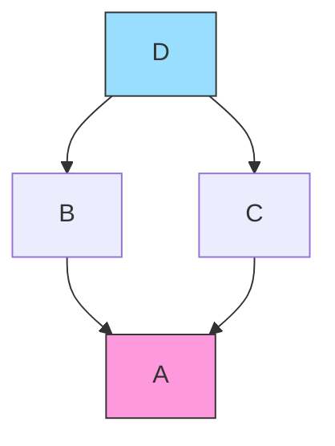
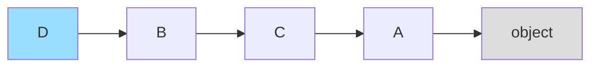
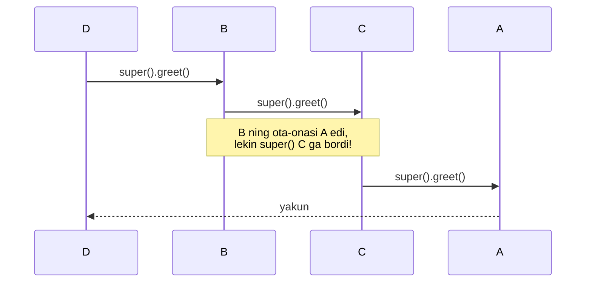
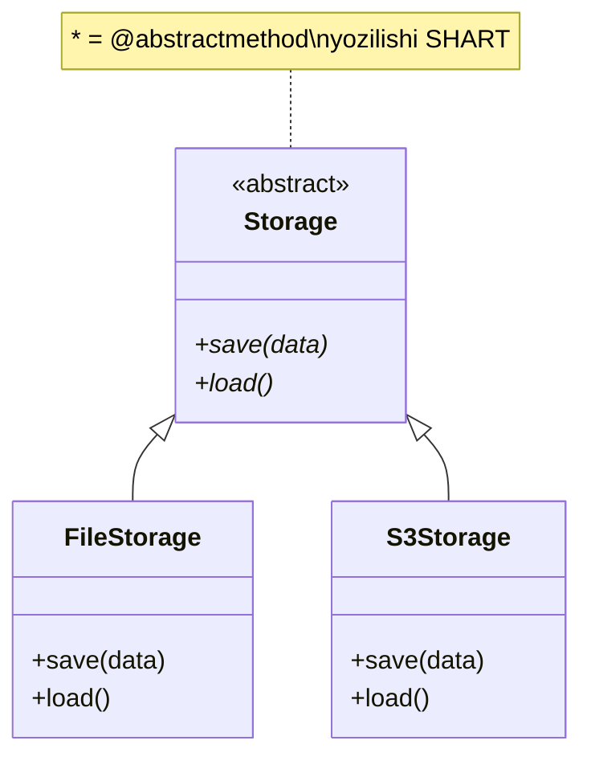
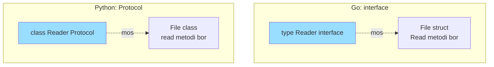

# 05. OOP chuqur — MRO, ABC, Protocol

## Hook — nega bu dars ML Engineer uchun muhim

PyTorch'da `class Net(nn.Module)` yozasan. Scikit-learn'da `BaseEstimator`'dan meros olasan.
Bu framework'lar meros (inheritance) va interface tushunchalari ustiga qurilgan.

Agar `super().__init__()` nega kerakligini, `nn.Module`'ni meros olganingda ichkarida nima
sodir bo'lishini bilmasang — xatolarni ko'r-ko'rona tuzatasan. Bugun shu qora quti ochiladi.

> Bu dars Go'dagi eng sevimli xususiyating — **interface**'ni Python'da qanday topishing haqida.

---

## 1-qism: Multiple inheritance va diamond problem

### Hook

Go'da bitta struct'ga bir nechta struct'ni **embed** qila olasan. Python bundan ham uzoqroqqa boradi:
bitta class bir nechta class'dan **to'g'ridan-to'g'ri meros** oladi. Bu kuch, lekin xavf ham.

### Analogiya

Tasavvur qil: bolaga ikkita ota-onadan xususiyat o'tadi. Ota ham, ona ham bitta bobodan
kelib chiqqan bo'lsa — bobodagi genlar **ikki marta** kelmasligi kerak, faqat bir marta.

Chegarasi: genetikada aralashadi, kodda esa aralashmaydi — Python **aniq tartib** bilan
"qaysi ota-onaning metodi birinchi" degan savolga qat'iy javob beradi. Bu tartib — MRO.

### Sodda ta'rif

**Diamond problem** (romb muammosi) — bitta bola class ikki yo'l orqali bitta bobo class'ga
bog'langanda "bobo metodini qaysi yo'ldan chaqiraman?" degan noaniqlik.

### Diagramma



`A` ikki yo'ldan (`B` orqali va `C` orqali) `D`'ga yetadi — romb hosil bo'ladi.

### Worked example

```python
# --- 1-qadam: umumiy bobo class ---
class A:
    def greet(self):
        return "A"

# --- 2-qadam: ikkita ota-ona, ikkalasi ham A'dan meros ---
class B(A):
    def greet(self):
        return "B"

class C(A):
    def greet(self):
        return "C"

# --- 3-qadam: bola B va C ikkalasidan meros oladi ---
class D(B, C):
    pass

# --- 4-qadam: D().greet() qaysini chaqiradi? ---
print(D().greet())
```

**Output:**
```
B
```

`D` o'zida `greet` yo'q, shuning uchun Python qidiradi. `B` — `C`'dan oldin yozilgan,
shuning uchun `B.greet` yutadi. Lekin Python buni **tasodifan** emas, MRO qoidasi bilan hal qiladi.

---

## 2-qism: MRO — C3 linearization

### Hook

"B birinchi" degan javob oddiy holatda ishlaydi. Lekin murakkab meros daraxtida "kim birinchi"
savoli chalkash bo'ladi. Python bunga **matematik aniq** algoritm — C3 linearization ishlatadi.

### Analogiya

MRO — bu **navbat ro'yxati** (queue). Metod qidirilganda Python shu ro'yxat bo'ylab
yuqoridan pastga yuradi va birinchi mos kelganini oladi. Ro'yxat oldindan hisoblab qo'yiladi.

Chegarasi: oddiy navbatdan farqi — bu ro'yxat "har bir class faqat bir marta,
va bola doim ota-onadan oldin" degan qat'iy qoida bilan tuziladi.

### Sodda ta'rif

**MRO** (Method Resolution Order) — class uchun metod qidiriladigan class'lar tartibi.
**C3 linearization** — bu tartibni hosil qiluvchi algoritm.

### Diagramma



Metod qidiruvi: **D → B → C → A → object**. Chapdan o'ngga, birinchi topilgani yutadi.

### `__mro__` ni o'qish

```python
# --- 1-qadam: MRO ro'yxatini olamiz ---
for cls in D.__mro__:
    print(cls.__name__)
```

**Output:**
```
D
B
C
A
object
```

C3 qoidasining ikkita kafolati:
1. **Bola doim ota-onadan oldin** keladi (D dan B, C dan oldin).
2. **Yozilish tartibi saqlanadi** (B, C — `class D(B, C)` tartibida).

`object` — barcha class'larning ildizi, doim eng oxirida. Go'da bunday umumiy ildiz yo'q,
lekin `any` (bo'sh interface) unga biroz o'xshaydi.

### 🤔 O'ylab ko'r

`class D(B, C)` o'rniga `class D(C, B)` deb yozsak, `D().greet()` nima qaytaradi?

<details>
<summary>💡 Javobni ko'rish</summary>

`"C"` qaytaradi. Endi MRO **D → C → B → A → object** bo'ladi, chunki yozilish tartibi
o'zgardi. `C` birinchi, uning `greet`'i yutadi. Bu MRO'ning yozilish tartibiga bog'liqligini
ko'rsatadi — tasodif emas, aniq qoida.

</details>

---

## 3-qism: super() — aslida "MRO bo'yicha keyingisi"

### Hook

Ko'pchilik `super()` ni "ota-onani chaqirish" deb o'ylaydi. Bu **noto'g'ri** va aynan shu
tushunmovchilik multiple inheritance'da eng qiyin xatolarni keltirib chiqaradi.

### Analogiya

`super()` — bu navbatdagi **keyingi odam**ga vazifani uzatish (estafeta tayog'i). Sen kimga
uzatishingni bilmaysan — navbat (MRO) hal qiladi. Sen faqat "menimdan keyingisiga" deysan.

Chegarasi: oddiy estafetada tartib oldindan ma'lum. Bu yerda tartib **qaysi class'dan boshlanganiga**
bog'liq — `B` obyekt orqali chaqirilsa keyingisi `C`, to'g'ridan-to'g'ri chaqirilsa `A` bo'lishi mumkin.

### Sodda ta'rif

`super()` — joriy class'ni **obyektning MRO'sida** topib, undan **keyingi** class'ning
metodini chaqiradi (ota-onani emas!).

### Diagramma



### Worked example — cooperative inheritance

```python
# --- 1-qadam: har bir class super() bilan estafetani uzatadi ---
class A:
    def greet(self):
        print("A")

class B(A):
    def greet(self):
        print("B")
        super().greet()   # keyingisiga uzat

class C(A):
    def greet(self):
        print("C")
        super().greet()   # keyingisiga uzat

class D(B, C):
    def greet(self):
        print("D")
        super().greet()

# --- 2-qadam: D dan boshlaymiz ---
D().greet()
```

**Output:**
```
D
B
C
A
```

**Notional machine — nima sodir bo'ldi:**
- `D.greet` → `super()` MRO'da D dan keyingisi = **B**.
- `B.greet` ichida `super()` → MRO'da B dan keyingisi = **C** (A emas!).
- `C.greet` ichida `super()` → C dan keyingisi = **A**.
- `A.greet` → oxiri.

Agar `super()` "ota-onani chaqirish" bo'lganida, `B.greet` to'g'ridan-to'g'ri `A`'ga sakrardi
va `C` **tashlab ketilardi**. Cooperative inheritance aynan shu tufayli ishlaydi.

### ⚠️ Keng tarqalgan xatolar

**Xato 1: super() ni ota-ona deb tushunish**
- Noto'g'ri tasavvur: "B'ning super()'i doim A".
- Nega noto'g'ri: super() obyektning MRO'siga qaraydi, class'ning static ota-onasiga emas.
- To'g'risi: `D()` orqali kelsa B'ning super()'i C bo'ladi.

**Xato 2: super().__init__() ni unutish**
- Noto'g'ri: `__init__`'da `super().__init__()` yozmaslik.
- Nega yomon: ota-onaning (yoki MRO'dagi keyingi class'ning) sozlash kodi ishlamaydi.
  PyTorch'da `nn.Module.__init__` ishlamasa — parametr registratsiyasi buziladi.
- To'g'risi: har doim birinchi qatorda `super().__init__(...)` chaqir.

---

## 4-qism: ABC va @abstractmethod — nominal typing

### Hook

Framework yozayapsan. Foydalanuvchilar sening class'ingdan meros olib, `predict()` metodini
yozishi **shart**. Ular unutsa — dastur ishlab ketib, keyin sirli xato bersa yomon.
Xatoni **erta**, obyekt yaratilgan zahoti ushlashni xohlaysan.

### Analogiya

**ABC** (Abstract Base Class) — bu imzolanmagan shartnoma shabloni. Uni to'ldirmasdan
(barcha bo'sh joylarni imzolamasdan) foydalana olmaysan — notarius (Python) ruxsat bermaydi.

Chegarasi: shartnomada bo'sh joy qoldirsang ham hujjatni saqlash mumkin. Bu yerda esa
bitta `@abstractmethod` to'ldirilmasa — obyekt umuman **yaratilmaydi**.

### Sodda ta'rif

**ABC** — undan meros olgan class ba'zi metodlarni **majburan** yozishi kerak bo'lgan class.
Bu **nominal typing** — "shartnomani bajarish uchun ochiq-oydin meros olishing kerak".

### Diagramma



### Worked example

```python
from abc import ABC, abstractmethod

# --- 1-qadam: shartnomani (ABC) e'lon qilamiz ---
class Storage(ABC):
    @abstractmethod
    def save(self, data: str) -> None: ...

# --- 2-qadam: shartnomani to'liq bajaruvchi class ---
class FileStorage(Storage):
    def save(self, data: str) -> None:
        print(f"faylga yozildi: {data}")

# --- 3-qadam: shartnomani BUZUVCHI class ---
class BrokenStorage(Storage):
    pass   # save() yozilmadi!

FileStorage().save("hello")   # ishlaydi
BrokenStorage()               # xato beradi
```

**Output:**
```
faylga yozildi: hello
Traceback (most recent call last):
  ...
TypeError: Can't instantiate abstract class BrokenStorage without an implementation for abstract method 'save'
```

**Notional machine:** `@abstractmethod` metod nomini `__abstractmethods__` degan maxsus
to'plamga qo'shadi. Obyekt yaratilganda Python shu to'plam bo'sh emasligini tekshiradi va
bo'sh bo'lmasa `TypeError` otadi. Xato **runtime'da**, lekin obyekt tug'ilishida — juda erta.

---

## 5-qism: Protocol — structural typing (darsning yuragi)

### Hook

Go'da interface yozganingda, biror struct'ga "men bu interface'ni bajaraman" deb **yozmaysan**.
Struct kerakli metodlarga ega bo'lsa — bo'ldi, interface avtomatik bajariladi.

ABC bunday emas: `implements` yozishing (meros olishing) shart. Python'da Go'dagi
"jim-jit avtomatik" xatti-harakatni xohlasang — **Protocol** kerak. Bu darsning yuragi.

### Analogiya

Go interface = Protocol: **"agar u o'rdakdek qaqillasa, u o'rdak"** (duck typing). Hech kim
"men o'rdakman" deb yozmaydi — xatti-harakati (metodlari) o'zi hal qiladi.

Chegarasi: ABC "shajarangni ko'rsat" (kimdan meros olganing) desa, Protocol "nima qila olishingni
ko'rsat" (qaysi metodlaring bor) deydi. Ikkovi ikki xil savol.

### Sodda ta'rif

**Protocol** (PEP 544) — meros talab qilmaydigan interface. Class kerakli metodlarga ega bo'lsa,
u avtomatik ravishda Protocol'ga **mos** hisoblanadi — **structural typing**.

### Diagramma — Go interface vs Python Protocol



Ikkala tilda ham chiziq **".mos."** — hech kim "implements" yoki "meros" yozmaydi.
Metodlarning mavjudligi yetarli.

### Worked example

```python
from typing import Protocol

# --- 1-qadam: Protocol (interface) e'lon qilamiz ---
class Speaker(Protocol):
    def speak(self) -> str: ...

# --- 2-qadam: Speaker'dan MEROS OLMAYDIGAN class'lar ---
class Dog:
    def speak(self) -> str:
        return "vov"

class Cat:
    def speak(self) -> str:
        return "miyov"

# --- 3-qadam: funksiya faqat "speak qila oladigan" narsani qabul qiladi ---
def announce(s: Speaker) -> None:
    print(s.speak())

announce(Dog())   # meros yo'q, lekin mos keladi
announce(Cat())
```

**Output:**
```
vov
miyov
```

`Dog` va `Cat` `Speaker`'dan meros olmadi — hatto uning nomini ham eslamadi. Lekin ikkalasida
ham `speak()` bor, shuning uchun mypy ularni `Speaker` deb qabul qiladi. Bu **aynan Go interface**.

### 🤔 O'ylab ko'r

`Dog` class'idan `speak` metodini o'chirib, `bark` deb qayta nomlasak, `announce(Dog())`
qatorida mypy nima deydi? Va dastur runtime'da ishlaydimi?

<details>
<summary>💡 Javobni ko'rish</summary>

**mypy** xato beradi: `Dog` endi `Speaker` protokoliga mos emas, chunki `speak` metodi yo'q.

**Runtime'da** esa (mypy'siz to'g'ridan-to'g'ri ishlatilsa) `AttributeError: 'Dog' object has
no attribute 'speak'` bo'ladi, chunki `announce` ichida `s.speak()` chaqiriladi. Protocol
odatda **statik** tekshiruv — runtime tekshiruv uchun keyingi qismga qara.

</details>

---

## 6-qism: runtime_checkable

### Hook

Protocol odatda faqat mypy'da (statik) tekshiriladi. Lekin ba'zan **kod ishlayotganda**
`isinstance(x, Speaker)` deb tekshirmoqchisan. Oddiy Protocol bunga ruxsat bermaydi.

### Sodda ta'rif

`@runtime_checkable` — Protocol'ni `isinstance()` bilan runtime'da tekshirish mumkin qiladi.
Lekin faqat metod **nomlari** borligini tekshiradi, ularning imzosini (signature) emas.

### Worked example

```python
from typing import Protocol, runtime_checkable

# --- 1-qadam: runtime tekshiruvga ruxsat beramiz ---
@runtime_checkable
class Speaker(Protocol):
    def speak(self) -> str: ...

class Dog:
    def speak(self) -> str:
        return "vov"

class Rock:
    pass   # speak yo'q

# --- 2-qadam: runtime'da tekshiramiz ---
print(isinstance(Dog(), Speaker))
print(isinstance(Rock(), Speaker))
```

**Output:**
```
True
False
```

### ⚠️ Keng tarqalgan xatolar

**Xato: runtime_checkable imzoni tekshiradi deb o'ylash**
- Noto'g'ri tasavvur: `isinstance(x, Speaker)` metod turini ham tekshiradi.
- Nega yomon: `speak` metodi **noto'g'ri argument** qabul qilsa ham `isinstance` `True` beradi.
- To'g'risi: u faqat "shu nomli atribut bormi" deb qaraydi. To'liq tekshiruv uchun mypy'ga tayan.

---

## 7-qism: qachon ABC, qachon Protocol

| Savol | ABC | Protocol |
| ----- | --- | -------- |
| Typing turi | **Nominal** (meros shart) | **Structural** (metod yetarli) |
| Go'dagi eng yaqin analog | struct embedding | **interface** |
| `implements` yozish kerakmi | Ha (meros olasan) | Yo'q |
| Umumiy kod (default metod) berish | Ha, oson | Cheklangan |
| Boshqa birovning class'iga moslash | Qiyin (kodini o'zgartirish kerak) | Oson (tegmasang ham mos keladi) |
| isinstance | Har doim ishlaydi | Faqat `@runtime_checkable` bilan |
| Qachon | O'z ierarxiyangni quryapsan | Tashqi/mustaqil class'larni birlashtirasan |

> **Oltin qoida:** o'z class'laring uchun umumiy asos va default kod kerak bo'lsa — **ABC**.
> Faqat "shu metodlar bo'lsa bas" deb interface tasvirlayapsan bo'lsa — **Protocol** (Go interface).

---

## Xulosa

- **Multiple inheritance** — bir nechta class'dan meros; diamond problem noaniqlik tug'diradi.
- **MRO** (C3 linearization) — metod qidirish tartibini aniq belgilaydi; `__mro__` orqali o'qiladi.
- **super()** ota-onani emas, **MRO'da keyingi** class'ni chaqiradi — cooperative inheritance asosi.
- **ABC + @abstractmethod** — nominal typing; meros majburiy, metod yozilmasa obyekt yaratilmaydi.
- **Protocol** (PEP 544) — structural typing; **Go interface**'ning aynan o'zi, meros talab qilmaydi.
- **@runtime_checkable** — Protocol'ni `isinstance` bilan tekshirish (faqat metod nomlari bo'yicha).
- ABC = o'z ierarxiya + default kod; Protocol = tashqi/mustaqil class'larni interface bilan bog'lash.

## 🧠 Eslab qol

- `super()` = "MRO'da keyingisi", ota-ona emas.
- MRO = D → B → C → A → object (chapdan o'ngga, bola oldin).
- ABC = nominal (meros shart), Protocol = structural (metod yetarli).
- Protocol = Go interface; `implements` yozilmaydi.
- Oddiy Protocol'ni `isinstance` qilib bo'lmaydi — `@runtime_checkable` kerak.

## ✅ O'z-o'zini tekshir (retrieval practice)

**1.** `class D(B, C)` da B va C ikkalasi ham A'dan meros olgan. `B.greet` ichidagi `super()`
`D()` obyekt orqali chaqirilganda qaysi class'ga boradi va nega?

<details>
<summary>Javob</summary>

`C`'ga boradi — A'ga emas. Chunki super() obyektning MRO'siga (D → B → **C** → A) qarab,
B'dan keyingisini oladi. B'ning static ota-onasi A bo'lsa ham, MRO C'ni oraga qo'yadi.

</details>

**2.** ABC va Protocol'ning eng katta farqi nima? Qaysi biri Go interface'ga o'xshaydi?

<details>
<summary>Javob</summary>

ABC = **nominal** (mos bo'lish uchun meros olish shart). Protocol = **structural** (kerakli
metodlar bo'lsa bas, meros shart emas). **Protocol** Go interface'ga o'xshaydi — ikkovida ham
`implements`/meros yozilmaydi, metodlarning mavjudligi yetarli.

</details>

**3.** Nima bo'ladi, agar ABC'dan meros olgan class `@abstractmethod`'ni yozmasa va uni
yaratmoqchi (`instantiate`) bo'lsak?

<details>
<summary>Javob</summary>

`TypeError: Can't instantiate abstract class ... without an implementation for abstract method`.
`__abstractmethods__` to'plami bo'sh emasligi uchun Python obyekt yaratishga ruxsat bermaydi.
Xato runtime'da, lekin obyekt tug'ilish paytida — juda erta ushlanadi.

</details>

**4.** `@runtime_checkable` Protocol'da `isinstance(x, P)` `True` qaytardi. Bu `x`'ning
metodlari **to'g'ri imzoga** ega ekanini kafolatlaydimi?

<details>
<summary>Javob</summary>

Yo'q. `@runtime_checkable` faqat metod **nomlari** borligini tekshiradi, argumentlar yoki
qaytish turini emas. To'liq (imzo bilan) tekshiruv uchun statik tekshiruvchi — mypy kerak.

</details>

## 🛠 Amaliyot

**1. Oson (Modify).** Yuqoridagi cooperative `greet` misolida `class D(B, C)`'ni `class D(C, B)`
qilib o'zgartir. `D().greet()` output'ini oldindan bashorat qil, keyin `D.__mro__`'ni chop et.

<details>
<summary>Hint</summary>

MRO endi D → C → B → A → object. Output: `D`, `C`, `B`, `A`. `super()` har safar yangi MRO
bo'yicha keyingisiga boradi.

</details>

**2. O'rta (faded example).** `Comparable` Protocol'ini to'ldir:

```python
from typing import Protocol

class Comparable(Protocol):
    def __lt__(self, other) -> bool: ...

def my_min(items: list[Comparable]):
    # TODO: birinchi elementni "eng kichik" deb ol
    # TODO: qolganlari bilan solishtir, kichikrogini saqla
    # TODO: eng kichkinasini qaytar
    ...

print(my_min([3, 1, 2]))          # 1
print(my_min(["b", "a", "c"]))    # a
```

<details>
<summary>Hint</summary>

`__lt__` bor har qanday tur mos keladi (int, str, ...). Loop bilan `if item < smallest:`
tekshir. int va str ikkovida ham `__lt__` bor — Protocol strukturaviy mosligi shuning uchun ishlaydi.

</details>

**3. Qiyin (Make).** Noldan `Serializer` ABC yoz: abstract `serialize(self, obj) -> str` metodi
bilan. Undan `JSONSerializer` va `CSVSerializer` class'larini meros oldir. Keyin **Protocol**
versiyasini ham yoz (`Serializable` protokoli, `serialize` metodli) va ikkovining farqini izohla.

<details>
<summary>Hint</summary>

ABC versiyasida `class JSONSerializer(Serializer)` — meros bor. Protocol versiyasida class
`Serializable`'dan meros **olmaydi**, faqat `serialize` metodiga ega bo'ladi. Funksiya
`def dump(s: Serializable)` ikkala versiyada ham ishlaydi, lekin Protocol tashqi class'larni ham qabul qiladi.

</details>

## 🔁 Takrorlash

**Bog'liq oldingi darslar:**
- 02. Decorator — `@abstractmethod`, `@runtime_checkable` ham decorator.
- 04. Type hints — Protocol va generics typing'ning davomi; mypy shu yerdan.
- Python basics 15-16 — class, inheritance, dunder metodlar (`__lt__`, `__init__`).

**Takrorlash jadvali:**
- **Ertaga:** "O'z-o'zini tekshir" 1 va 2-savollarga qayta javob ber (MRO va Protocol).
- **3 kundan keyin:** super() cooperative misolini xotiradan qayta yoz, output'ni bashorat qil.
- **1 haftadan keyin:** ABC vs Protocol jadvalini yopiq holda to'ldirib chiq.

**Feynman testi:** Kod so'zlarini ishlatmasdan, do'stingga 3 jumlada tushuntir: (1) super()
nega "ota-ona" emas, (2) ABC va Protocol farqi nima, (3) Protocol nega Go interface'ga o'xshaydi.

---

**Manbalar:** Fluent Python (2nd ed., Ch. 13-14) — Luciano Ramalho; Effective Python (2nd ed.,
Item 40-43) — Brett Slatkin; Python docs — abc, typing.Protocol; PEP 544; Real Python.
