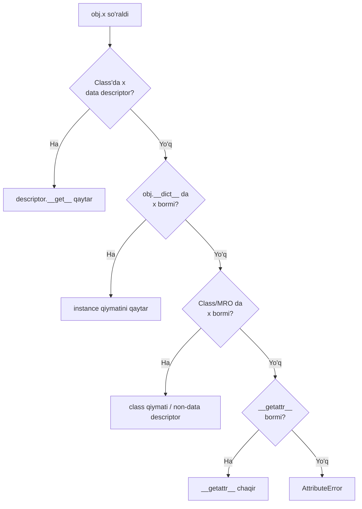
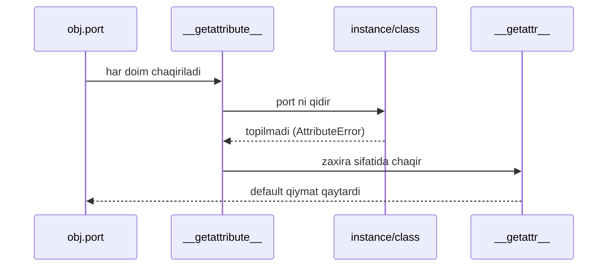
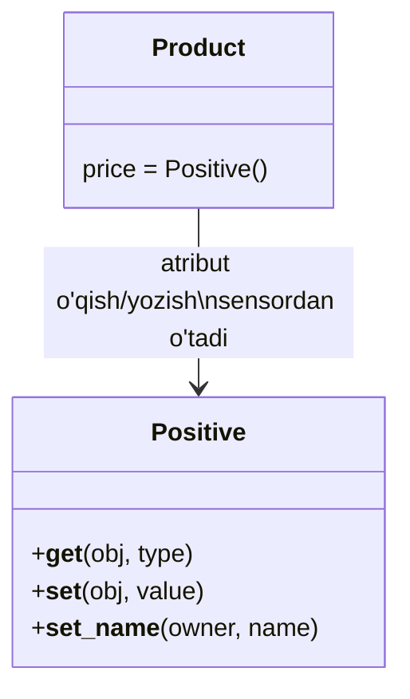
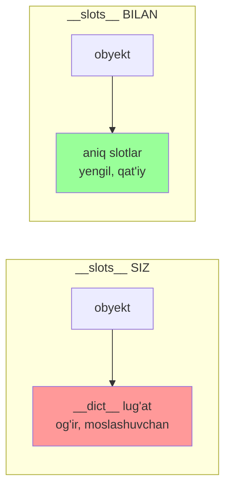
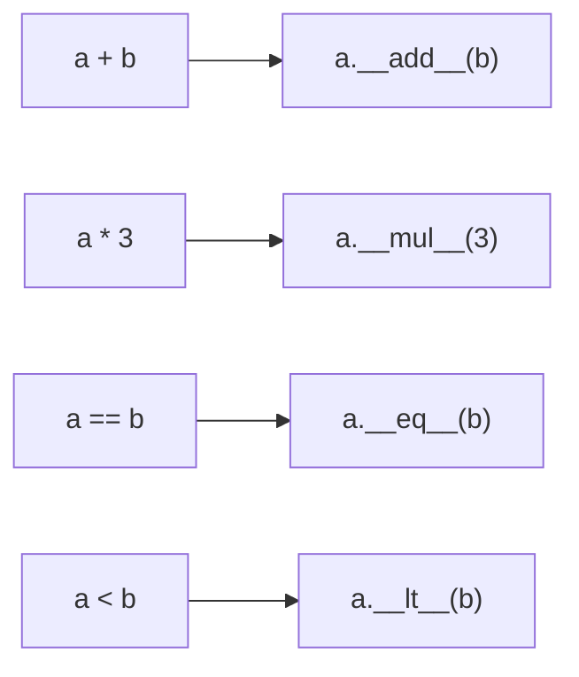

# 06. Data model — descriptor, slots, operator overloading

## Hook — nega bu dars ML Engineer uchun muhim

NumPy'da `a + b` deb yozganingda ikkita massiv qo'shiladi. PyTorch'da `model(x)` deb
yozganingda model ishga tushadi. Bu **sehr emas** — Python'ning data model'i.

`a + b` aslida `a.__add__(b)`'ni, `model(x)` esa `model.__call__(x)`'ni chaqiradi. Bugun shu
"dunder" (double underscore) metodlar orqali Python obyektlari qanday jonlanishini ochamiz.

> Go'da `a + b` faqat son uchun ishlaydi. Python'da sen o'zing yozgan obyekt uchun ham ishlata olasan.

---

## 1-qism: Attribute lookup tartibi

### Hook

`obj.x` deb yozasan. Python `x`'ni qayerdan topadi? Instance'danmi, class'danmi, ota-onadanmi?
Bu tartibni bilmasang — `@property` nega ba'zan ishlamasligini hech qachon tushunmaysan.

### Analogiya

Atribut qidirish — hujjatni qidirish kabi: avval **stolingdagi** qog'ozlarni (instance `__dict__`),
keyin **umumiy shkaf**ni (class), keyin **arxiv**ni (ota-onalar, MRO) qaraysan.

Chegarasi: oddiy qidiruvdan farqi — bitta maxsus tur hujjat (**data descriptor**) hatto stoldagidan
ham **ustun** turadi. Bu qoidani hozir ko'ramiz.

### Sodda ta'rif

`obj.x` — Python `__getattribute__` orqali qat'iy tartibda qidiradi: **data descriptor →
instance `__dict__` → class atribut / non-data descriptor → `__getattr__`**.

### Diagramma



### Worked example

```python
# --- 1-qadam: class atribut va instance atribut bir xil nom ---
class Point:
    dim = "class dagi qiymat"     # class atribut
    def __init__(self):
        self.dim = "instance dagi qiymat"   # instance __dict__ ga yozildi

# --- 2-qadam: instance __dict__ class'dan ustun (data descriptor bo'lmasa) ---
p = Point()
print(p.dim)                    # instance yutadi
print(Point.dim)                # class'dagi
print(p.__dict__)               # instance nimalarni saqlaydi
```

**Output:**
```
instance dagi qiymat
class dagi qiymat
{'dim': 'instance dagi qiymat'}
```

**Notional machine:** `p.dim` so'ralganda `__getattribute__` avval class'da `dim`'ni topadi,
lekin u data descriptor emas (oddiy string). Shuning uchun `instance __dict__`'ga qaraydi va
u yerda `dim` borligi uchun instance qiymatini qaytaradi. Class qiymati "yashirinib" qoladi.

---

## 2-qism: __getattr__ vs __getattribute__

### Hook

Ikkita juda o'xshash nomli metod bor: `__getattr__` va `__getattribute__`. Bittasi xavfsiz,
ikkinchisi — noto'g'ri ishlatilsa dasturingni cheksiz sikldan (infinite recursion) o'ldiradi.

### Analogiya

`__getattribute__` — **har bir** telefon qo'ng'irog'ini ushlaydigan kotib (har atribut so'roviga).
`__getattr__` — faqat **kotib topolmagan**da chaqiriladigan zaxira yordamchi.

Chegarasi: kotibga (`__getattribute__`) "borib menga faylni olib kel" desang, u yana o'zidan
so'raydi — cheksiz aylanadi. Shuning uchun unga tegishda juda ehtiyot bo'lish kerak.

### Sodda ta'rif

`__getattribute__` — **har** atribut so'rovida chaqiriladi. `__getattr__` — faqat oddiy qidiruv
**muvaffaqiyatsiz** bo'lganda (AttributeError) chaqiriladi. Kundalik ishda `__getattr__` xavfsizroq.

### Diagramma



### Worked example

```python
# --- 1-qadam: __getattr__ faqat topilmaganda ishlaydi ---
class Config:
    def __init__(self):
        self.host = "localhost"   # bor atribut
    def __getattr__(self, name):
        return f"<{name} sozlanmagan>"

c = Config()
print(c.host)   # bor -> __getattr__ CHAQIRILMAYDI
print(c.port)   # yo'q -> __getattr__ chaqiriladi
```

**Output:**
```
localhost
<port sozlanmagan>
```

### ⚠️ Keng tarqalgan xatolar

**Xato: __getattribute__ ichida self.x yozish**
- Noto'g'ri kod: `def __getattribute__(self, name): return self.data[name]`.
- Nega yomon: `self.data` yana `__getattribute__`'ni chaqiradi → cheksiz rekursiya → `RecursionError`.
- To'g'risi: ichkarida `super().__getattribute__(name)` ishlat, `self.x` emas.

---

## 3-qism: Descriptor protokoli va @property haqiqati

### Hook

`@property` deb yozganda "sehrli" getter/setter hosil bo'ladi. Lekin `@property`'ning o'zi
nima? Javob: u — **descriptor**. Descriptor'ni tushunsang, `@property`, `@classmethod`,
hatto oddiy metodlar ham qanday ishlashini bir tushunchada anglaysan.

### Analogiya

Descriptor — atributga **ulangan aqlli sensor**. `obj.x` o'qilganda sensor `__get__`'ni,
yozilganda `__set__`'ni ishga tushiradi. Atribut "jonli" bo'ladi — har teginishda kod ishlaydi.

Chegarasi: oddiy atribut passiv qiymat. Descriptor esa har o'qish/yozishda **oraga tushadi** —
validatsiya, hisoblash yoki loglash qila oladi.

### Sodda ta'rif

**Descriptor** — `__get__` va/yoki `__set__` metodli class. **Data descriptor** (`__set__` ham bor)
instance `__dict__`'dan ustun turadi. `@property` — aynan data descriptor.

### Diagramma



### Worked example — validatsiya qiluvchi descriptor

```python
# --- 1-qadam: manfiy qiymatni rad etuvchi data descriptor ---
class Positive:
    def __set_name__(self, owner, name):
        self.storage = "_" + name          # qayerda saqlashni eslab qol
    def __get__(self, obj, objtype=None):
        return getattr(obj, self.storage)
    def __set__(self, obj, value):
        if value < 0:
            raise ValueError("manfiy bo'lmasin")
        setattr(obj, self.storage, value)

# --- 2-qadam: descriptor'ni class atribut sifatida ulaymiz ---
class Product:
    price = Positive()
    def __init__(self, price):
        self.price = price                 # __set__ chaqiriladi

p = Product(100)
print(p.price)      # __get__ chaqiriladi
p.price = -5        # __set__ xato otadi
```

**Output:**
```
100
Traceback (most recent call last):
  ...
ValueError: manfiy bo'lmasin
```

### @property aslida descriptor ekani

```python
class Circle:
    def __init__(self, r):
        self._r = r
    @property
    def area(self):
        return 3.14 * self._r ** 2

# --- property class atributi aslida descriptor obyekti ---
print(type(Circle.__dict__["area"]))
```

**Output:**
```
<class 'property'>
```

`area` — instance atributi emas, **class'dagi `property` obyekti** (data descriptor).
`c.area` o'qilganda uning `__get__`'i ishlab, funksiyani chaqiradi. Sehr yo'q — descriptor bor.

### 🤔 O'ylab ko'r

`Positive`'da `__set__` metodini o'chirsak (faqat `__get__` qoldirsak), u **non-data
descriptor** bo'ladi. Endi `p.price = -5` validatsiyadan o'tadimi?

<details>
<summary>💡 Javobni ko'rish</summary>

Yo'q, o'tmaydi — validatsiya **umuman ishlamaydi**. `__set__`'siz descriptor non-data bo'lib
qoladi, va endi `p.price = -5` to'g'ridan-to'g'ri instance `__dict__`'ga yoziladi (non-data
descriptor instance dict'dan pastda). Validatsiya uchun `__set__` **shart** — data descriptor kerak.

</details>

---

## 4-qism: __slots__ — million obyekt uchun xotira tejash

### Hook

ML'da bir necha million obyekt yaratishing mumkin (masalan har bir sample uchun). Har oddiy
Python obyekti ichida `__dict__` degan lug'at bor — u qulay, lekin xotira **yeydi**. Millionga
ko'paytir — gigabaytlar isrof bo'ladi.

### Analogiya

Oddiy obyekt — istagan narsani solaverasan cho'ntagi cheksiz kurtka (`__dict__`, moslashuvchan,
lekin og'ir). `__slots__` — aniq o'lchamli qutichalar to'plami: faqat oldindan aytilgan
atributlar sig'adi, lekin ancha yengil.

Chegarasi: `__slots__` bilan **yangi atribut qo'sha olmaysan** (`__dict__` yo'q). Moslashuvchanlikni
xotiraga almashtirasan — ML'dagi ko'p sonli, o'zgarmas shaklli obyektlar uchun ayni muddao.

### Sodda ta'rif

`__slots__` — instance'da `__dict__` yaratilishini to'xtatib, atributlarni ixcham, aniq
joyda saqlaydigan e'lon. Natija: kamroq xotira va biroz tezroq atribut o'qish.

### Diagramma



### Worked example

```python
import sys

# --- 1-qadam: oddiy class (__dict__ bilan) ---
class PointDict:
    def __init__(self, x, y):
        self.x, self.y = x, y

# --- 2-qadam: __slots__ li class (__dict__ siz) ---
class PointSlots:
    __slots__ = ("x", "y")
    def __init__(self, x, y):
        self.x, self.y = x, y

a = PointDict(1, 2)
b = PointSlots(1, 2)

print(hasattr(a, "__dict__"))   # True — lug'at bor
print(hasattr(b, "__dict__"))   # False — lug'at yo'q
b.z = 3                          # yangi atribut -> xato
```

**Output:**
```
True
False
Traceback (most recent call last):
  ...
AttributeError: 'PointSlots' object has no attribute 'z'
```

**Notional machine:** `PointDict` obyektida atributlar hash-jadval (`__dict__`)da saqlanadi —
har biri qo'shimcha xotira. `PointSlots` esa atributlarni C darajasidagi belgilangan
o'lchamli struktura'da saqlaydi — lug'at umuman yaratilmaydi. Bu **aynan Go struct** kabi:
maydonlar oldindan aniq, dinamik qo'shib bo'lmaydi.

> **Go paralleli:** Go struct maydonlari compile paytida qat'iy — dinamik qo'shib bo'lmaydi.
> `__slots__` Python'ga xuddi shu qat'iylik va tejamkorlikni beradi.

---

## 5-qism: Operator overloading — NumPy'ga ko'prik

### Hook

`np.array([1,2]) + np.array([3,4])` `array([4, 6])` beradi. Qanday qilib `+` massiv uchun
ishlaydi? Chunki NumPy `__add__`'ni yozgan. Bugun sen ham o'z turing uchun `+`'ni ishlata olasan.

### Analogiya

Operator overloading — `+`, `*`, `==` belgilariga **yangi ma'no o'rgatish**. Xuddi bir so'z
kontekstga qarab boshqa ma'no berishi kabi: sonlar uchun `+` qo'shish, vektorlar uchun ham
qo'shish, lekin senning qoidang bo'yicha.

Chegarasi: belgining **ko'rinishi** o'zgarmaydi (`+` baribir `+`), faqat **ma'nosi** turga
bog'liq. Buni suiiste'mol qilma — `+` mantiqan "qo'shish"ga o'xshamasa, o'quvchini chalg'itasan.

### Sodda ta'rif

**Operator overloading** — `+`, `*`, `==`, `<` kabi operatorlarni dunder metodlar (`__add__`,
`__mul__`, `__eq__`, `__lt__`) orqali o'z turing uchun aniqlash.

### Diagramma



### Worked example — Vector

```python
# --- 1-qadam: 2D vektor, operatorlarni aniqlaymiz ---
class Vec:
    def __init__(self, x, y):
        self.x, self.y = x, y
    def __add__(self, other):            # a + b
        return Vec(self.x + other.x, self.y + other.y)
    def __mul__(self, k):                # a * skalyar
        return Vec(self.x * k, self.y * k)
    def __eq__(self, other):             # a == b
        return (self.x, self.y) == (other.x, other.y)
    def __repr__(self):
        return f"Vec({self.x}, {self.y})"

# --- 2-qadam: operatorlarni ishlatamiz ---
a, b = Vec(1, 2), Vec(3, 4)
print(a + b)             # __add__
print(a * 3)             # __mul__
print(a == Vec(1, 2))    # __eq__
```

**Output:**
```
Vec(4, 6)
Vec(3, 6)
True
```

Bu aynan NumPy'ning ishlash mexanizmi: `array + array` ichida `ndarray.__add__` chaqiriladi,
u element-wise qo'shishni C darajasida bajaradi. Sen bugun uning "soddalashtirilgan" versiyasini yozding.

### ⚠️ Keng tarqalgan xatolar

**Xato: __eq__ yozib, __hash__ ni unutish**
- Muammo: `__eq__` yozgan class'ning `__hash__`'i avtomatik `None` bo'ladi — obyekt `set`/`dict`
  kalitida ishlatib bo'lmaydi (`TypeError: unhashable type`).
- Nega: Python "teng obyektlarning hash'i teng bo'lishi kerak" qoidasini buzmaslik uchun
  hash'ni o'chiradi.
- To'g'risi: obyekt immutable bo'lsa, `__hash__ = lambda self: hash((self.x, self.y))` qo'sh
  yoki `@dataclass(frozen=True)` ishlat.

---

## 6-qism: __call__ — obyektni funksiyadek chaqirish (PyTorch'ga ko'prik)

### Hook

PyTorch'da `output = model(x)` yozasan — `model` obyekt bo'la turib, funksiyadek chaqirilyapti!
Bu `__call__` tufayli. Buni bilsang, `nn.Module` ichida nima bo'layotganini tushunasan.

### Analogiya

`__call__` — obyektga **tugma** qo'yish. Obyekt holatni (state) saqlaydi (masalan model
og'irliklari), lekin uni oddiy funksiyadek "bosib" (chaqirib) ishlatasan.

Chegarasi: oddiy funksiya holatni eslamaydi (yoki closure orqali qisman eslaydi). `__call__`li
obyekt esa holat + chaqiriluvchanlikni birlashtiradi — sozlanadigan funksiya.

### Sodda ta'rif

`__call__(self, ...)` — obyektni `obj(...)` ko'rinishida chaqirish imkonini beruvchi dunder metod.
Obyekt shu bilan `callable` bo'ladi.

### Worked example

```python
# --- 1-qadam: holatli, chaqiriluvchi obyekt ---
class Multiplier:
    def __init__(self, factor):
        self.factor = factor          # holat saqlanadi
    def __call__(self, x):
        return x * self.factor        # obj(x) shu yerga tushadi

# --- 2-qadam: obyektni funksiyadek ishlatamiz ---
double = Multiplier(2)
triple = Multiplier(3)
print(double(10))          # __call__(10)
print(triple(10))
print(callable(double))    # chaqiriluvchimi?
```

**Output:**
```
20
30
True
```

**Notional machine:** `double(10)` Python uchun `type(double).__call__(double, 10)`ga aylanadi.
PyTorch'da `model(x)` ham shunday: `nn.Module.__call__` ichida hook'lar bajariladi, so'ng sen
yozgan `forward(x)` chaqiriladi. Shu tufayli hech qachon `model.forward(x)`'ni to'g'ridan chaqirmaysan.

### 🤔 O'ylab ko'r

`Multiplier` obyektida `factor`'ni har chaqiruvda o'zgartirmoqchimiz. `double(10)` chaqirganda
`self.factor += 1` qilsak, `double(10)` ni ketma-ket 3 marta chaqirsak natijalar qanday bo'ladi?

<details>
<summary>💡 Javobni ko'rish</summary>

`factor` boshida 2. Har chaqiruvda 1 ga oshadi:
- 1-chaqiruv: `10 * 2 = 20`, keyin factor=3.
- 2-chaqiruv: `10 * 3 = 30`, keyin factor=4.
- 3-chaqiruv: `10 * 4 = 40`.

Ya'ni `20, 30, 40`. Bu `__call__`ning oddiy funksiyadan farqini ko'rsatadi: obyekt **holatni
chaqiruvlar orasida saqlaydi** (aynan model og'irliklari kabi).

</details>

---

## Xulosa

- `obj.x` tartibi: **data descriptor → instance `__dict__` → class → `__getattr__`**.
- `__getattribute__` har atributda, `__getattr__` faqat topilmaganda ishlaydi.
- `__getattribute__` ichida `self.x` yozish cheksiz rekursiya — `super().__getattribute__` ishlat.
- **Descriptor** (`__get__`/`__set__`) atributni jonlantiradi; `@property` — data descriptor.
- `__slots__` `__dict__`'ni o'chirib xotira tejaydi — million obyektli ML uchun muhim (Go struct kabi).
- Operator overloading (`__add__`, `__mul__`, `__eq__`) — NumPy `array + array` shundan ishlaydi.
- `__call__` obyektni funksiyadek chaqiradi — PyTorch `model(x)` shu mexanizm.

## 🧠 Eslab qol

- Data descriptor instance `__dict__`'dan ustun.
- `@property` = data descriptor, sehr emas.
- `__slots__` = `__dict__`'siz, yengil, dinamik atribut yo'q (= Go struct).
- `a + b` = `a.__add__(b)`; `model(x)` = `model.__call__(x)`.
- `__eq__` yozsang `__hash__`'ni ham o'yla.

## ✅ O'z-o'zini tekshir (retrieval practice)

**1.** Class atributi va instance atributi bir xil nomli. `data descriptor` bo'lmasa, `obj.x`
qaysini qaytaradi va nega?

<details>
<summary>Javob</summary>

Instance qiymatini. Data descriptor bo'lmaganda `__getattribute__` avval class'ni ko'radi-yu,
u data descriptor emasligi uchun instance `__dict__`'ga o'tadi va u yerda topilganini qaytaradi.
Class qiymati "yashirinib" qoladi.

</details>

**2.** `Positive` descriptor'idan `__set__`'ni olib tashlasak, validatsiya nima uchun ishlamay qoladi?

<details>
<summary>Javob</summary>

`__set__`'siz u **non-data descriptor**ga aylanadi, u instance `__dict__`'dan pastda turadi.
Endi `obj.price = -5` to'g'ridan-to'g'ri instance dict'ga yoziladi, descriptor'ning
validatsiyasini chetlab o'tadi. Data descriptor bo'lishi (ya'ni `__set__` borligi) shart.

</details>

**3.** `__slots__` li class'ga yangi atribut (`obj.z = 1`) qo'shsak nima bo'ladi? Bu xususiyat
qaysi Go tushunchasiga o'xshaydi?

<details>
<summary>Javob</summary>

`AttributeError` — `__dict__` yo'qligi uchun yangi atribut saqlanadigan joy yo'q. Bu **Go
struct**'ga o'xshaydi: maydonlar oldindan qat'iy belgilangan, runtime'da yangisini qo'shib bo'lmaydi.

</details>

**4.** `__eq__` yozgan class'ni `set`'ga qo'shmoqchi bo'lsak `TypeError: unhashable` chiqdi.
Nega va qanday tuzatiladi?

<details>
<summary>Javob</summary>

`__eq__` yozilganda Python `__hash__`'ni avtomatik `None` qiladi (teng obyektlar teng hash
qoidasini himoya qilib). Tuzatish: immutable bo'lsa `__hash__` metodini o'zing yoz yoki
`@dataclass(frozen=True)` ishlat.

</details>

## 🛠 Amaliyot

**1. Oson (Modify).** `Vec` class'iga `__sub__` (ayirish) va `__abs__` (uzunlik, ya'ni
`(x**2 + y**2) ** 0.5`) qo'sh. `Vec(3, 4)` uchun `abs()` `5.0` berishini tekshir.

<details>
<summary>Hint</summary>

`__sub__(self, other)` — `__add__`'ga o'xshaydi, faqat minus. `__abs__(self)` argumentsiz,
`(self.x**2 + self.y**2) ** 0.5` qaytaradi. `abs(Vec(3,4))` ichki `__abs__`'ni chaqiradi.

</details>

**2. O'rta (faded example).** `LoggedAttr` descriptor'ini to'ldir — har o'qish/yozishni chop etsin:

```python
class LoggedAttr:
    def __set_name__(self, owner, name):
        self.storage = "_" + name
    def __get__(self, obj, objtype=None):
        # TODO: "OQILDI: <nom>" chop et
        # TODO: saqlangan qiymatni qaytar
        ...
    def __set__(self, obj, value):
        # TODO: "YOZILDI: <nom> = <value>" chop et
        # TODO: qiymatni self.storage ga saqla
        ...

class User:
    name = LoggedAttr()

u = User()
u.name = "Ali"      # YOZILDI: _name = Ali
print(u.name)       # OQILDI: _name  /  Ali
```

<details>
<summary>Hint</summary>

`__get__`'da `getattr(obj, self.storage)` bilan o'qi. `__set__`'da `setattr(obj, self.storage,
value)`. Chop etishni `getattr`/`setattr`'dan oldin qo'y. `self.storage` = `"_name"`.

</details>

**3. Qiyin (Make).** Noldan `Money` class yoz: `__init__(amount, currency)`, `__add__` (faqat
bir xil valyuta qo'shilsin, aks holda `ValueError`), `__eq__`, `__hash__`, `__repr__`. Keyin
`__slots__` qo'shib xotira tejamkor qil va `set`'da ishlashini tekshir.

<details>
<summary>Hint</summary>

`__add__`'da `if self.currency != other.currency: raise ValueError(...)`. `__hash__` uchun
`hash((self.amount, self.currency))`. `__slots__ = ("amount", "currency")`. `{Money(10,"USD"),
Money(10,"USD")}` bitta element bo'lishi kerak (teng + hash teng).

</details>

## 🔁 Takrorlash

**Bog'liq oldingi darslar:**
- 05. OOP chuqur — MRO, ABC, Protocol — descriptor MRO bo'ylab qidiriladi.
- 02. Decorator — `@property` ham descriptor'ga o'ralgan decorator.
- Python basics 16 — dunder metodlar, `@property`, dataclass shu yerdan boshlangan.

**Takrorlash jadvali:**
- **Ertaga:** attribute lookup tartibini xotiradan chiz (flowchart), 1-savolga javob ber.
- **3 kundan keyin:** `Vec` operator overloading misolini xotiradan qayta yoz.
- **1 haftadan keyin:** descriptor va `__slots__`ni bir do'stingga tushuntirib ko'r.

**Feynman testi:** Kod so'zlarisiz 3 jumlada tushuntir: (1) `@property` aslida nima, (2)
`__slots__` nega xotira tejaydi, (3) `model(x)` nega ishlaydi (`__call__`).

---

**Manbalar:** Fluent Python (2nd ed., Ch. 11, 16, 23) — Luciano Ramalho; Effective Python
(2nd ed., Item 44-48) — Brett Slatkin; Python docs — Data model, Descriptor HowTo Guide; Real Python.
