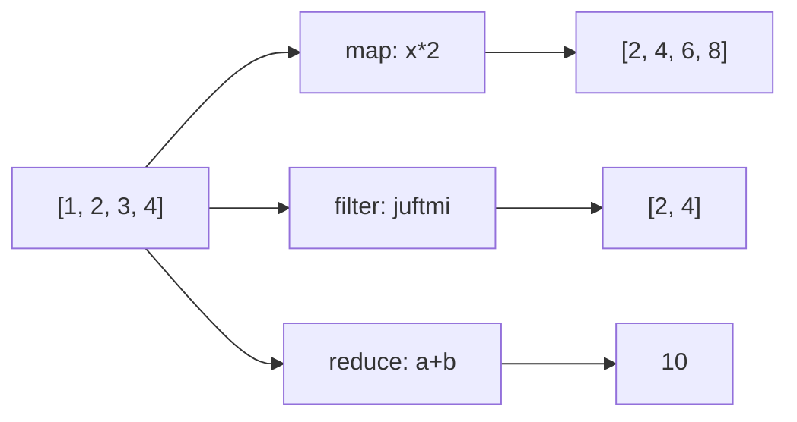
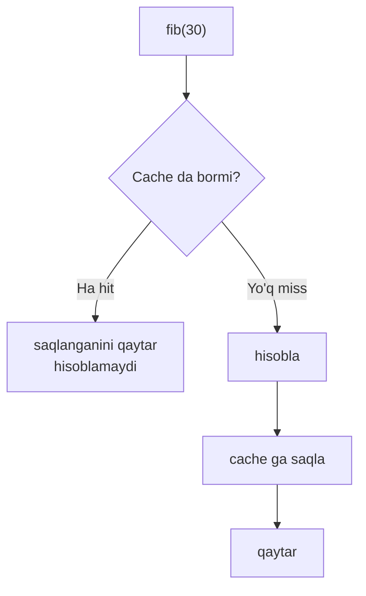
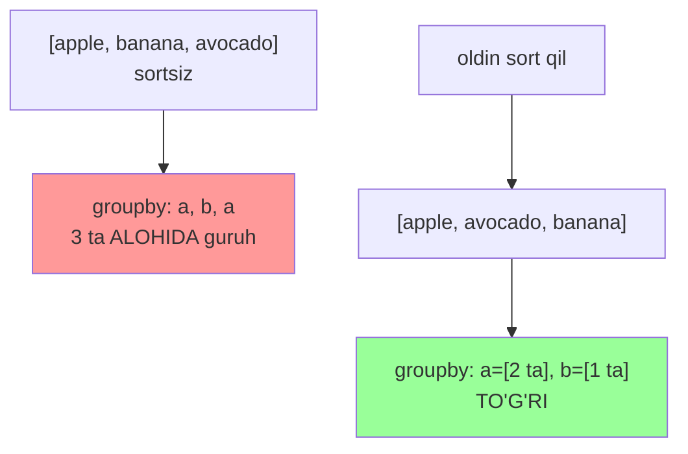
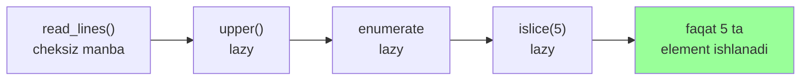

# 07. Functional Python — functools, itertools

## Hook — nega bu dars ML Engineer uchun muhim

ML'da 10 gigabaytli fayldan ma'lumot o'qiysan. Hammasini xotiraga solsang — dastur o'ladi.
Yechim: **lazy pipeline** — ma'lumotni oqim (stream) sifatida, bo'lak-bo'lak qayta ishlash.

`itertools` va generatorlar aynan shuni beradi: cheksiz manbadan ham faqat **kerakli qismini**
xotiraga olib ishlaysan. Bu — Pandas/PyTorch data loader'lari ortidagi asosiy g'oya.

> Go'da lazy oqimni channel + goroutine bilan quyasan. Python'da — generator + itertools bilan.

---

## 1-qism: map / filter / reduce va nega comprehension pythonic'roq

### Hook

Go'da ro'yxatni o'zgartirish uchun `for` loop yozasan. Python'da uch usul bor: `map`/`filter`,
comprehension, va oddiy loop. Qaysi biri to'g'ri? Javob deyarli har doim — **comprehension**.

### Analogiya

`map` — konveyerdagi har detalga bir amal qo'llaydigan robot. `filter` — faqat yaroqli
detallarni o'tkazadigan saralagich. `reduce` — hammasini bitta natijaga **yig'ib** beradigan press.

Chegarasi: comprehension bir o'qishda map+filter'ni birlashtiradi va ko'zga tabiiyroq ko'rinadi.
`map`/`filter` ko'pincha `lambda` talab qiladi — bu esa o'qishni sekinlashtiradi.

### Sodda ta'rif

`map(f, it)` har elementga `f` qo'llaydi; `filter(p, it)` shartga mos elementlarni qoldiradi;
`reduce(f, it)` ketma-ket yig'ib bitta qiymat qaytaradi. Ko'p holatda **comprehension** o'qilishliroq.

### Diagramma



### Worked example

```python
from functools import reduce

nums = [1, 2, 3, 4]

# --- 1-qadam: map — har elementni ikkilantirish ---
print(list(map(lambda x: x * 2, nums)))

# --- 2-qadam: comprehension — xuddi shu, lekin o'qilishliroq ---
print([x * 2 for x in nums])

# --- 3-qadam: filter — faqat juftlar ---
print([x for x in nums if x % 2 == 0])

# --- 4-qadam: reduce — hammasini yig'ish ---
print(reduce(lambda a, b: a + b, nums))
```

**Output:**
```
[2, 4, 6, 8]
[2, 4, 6, 8]
[2, 4]
10
```

> **Oltin qoida:** oddiy transform/filter uchun **comprehension** yoz. `reduce` uchun ko'pincha
> tayyor funksiya (`sum`, `math.prod`, `max`) yoki oddiy loop aniqroq bo'ladi.

---

## 2-qism: functools — partial, lru_cache, cached_property, singledispatch

### 2.1 partial — argumentni oldindan "muzlatish"

### Analogiya

`partial` — funksiyaga ba'zi argumentlarni **oldindan to'ldirib** qo'yish. Xuddi formaning
ba'zi qatorlarini oldindan to'ldirib, qolganini keyin so'raladigan qilib berish kabi.

### Worked example

```python
from functools import partial

# --- 1-qadam: ikki argumentli asosiy funksiya ---
def power(base, exp):
    return base ** exp

# --- 2-qadam: exp=2 ni muzlatib, yangi funksiya yasaymiz ---
square = partial(power, exp=2)
cube = partial(power, exp=3)

print(square(5))   # 5 ** 2
print(cube(2))     # 2 ** 3
```

**Output:**
```
25
8
```

Go'da bunga eng yaqin narsa — closure qaytaruvchi funksiya (`func square(b int) int { return b*b }`).
`partial` shu ishni bitta qatorda bajaradi.

### 2.2 lru_cache — natijani eslab qolish (memoization)

### Hook

Bir xil argument bilan qimmat funksiyani qayta-qayta chaqirsang — bekorga hisoblaysan.
`lru_cache` natijani eslab qoladi va keyingi safar tayyorini qaytaradi.

### Diagramma



### Worked example

```python
from functools import lru_cache

# --- 1-qadam: memoizatsiyasiz fib eksponensial sekin ---
@lru_cache(maxsize=None)
def fib(n):
    if n < 2:
        return n
    return fib(n - 1) + fib(n - 2)

# --- 2-qadam: chaqiramiz va cache statistikasini ko'ramiz ---
print(fib(30))
print(fib.cache_info())
```

**Output:**
```
832040
CacheInfo(hits=28, misses=31, maxsize=None, currsize=31)
```

**Notional machine:** `lru_cache` argumentlarni kalit qilib, natijani ichki lug'atda saqlaydi.
`fib(28)` ikkinchi marta so'ralganda hisoblanmaydi — bu **hit**. `maxsize=None` cheksiz cache
(= `@cache`). Chekli `maxsize` bo'lsa, eng kam ishlatilgan (Least Recently Used) natija tashlanadi.

> **Ogohlantirish:** faqat **hashable** argumentlar bilan ishlaydi (list emas, tuple mumkin).
> Va funksiya **toza** (pure) bo'lishi kerak — bir xil kirishga doim bir xil chiqish.

### 2.3 cached_property — obyekt hisobini bir marta qilish

### Worked example

```python
from functools import cached_property

# --- 1-qadam: og'ir hisob faqat birinchi murojaatda ---
class Dataset:
    def __init__(self, data):
        self.data = data
    @cached_property
    def mean(self):
        print("hisoblanmoqda...")
        return sum(self.data) / len(self.data)

d = Dataset([1, 2, 3, 4])
print(d.mean)   # birinchi marta: hisoblaydi
print(d.mean)   # ikkinchi marta: cache
```

**Output:**
```
hisoblanmoqda...
2.5
2.5
```

`cached_property` natijani **instance `__dict__`**'ga yozadi, keyingi murojaatlar shuni o'qiydi.
Shu sababli `__slots__` (`__dict__` yo'q) bilan to'g'ridan-to'g'ri ishlamaydi — 06-darsdagi bog'lanish.

### 2.4 singledispatch — turga qarab funksiya tanlash

### Analogiya

`singledispatch` — Go'dagi type switch (`switch v := x.(type)`)ning funksional ko'rinishi.
Birinchi argument **turiga** qarab qaysi implementatsiya ishlashini tanlaydi.

### Worked example

```python
from functools import singledispatch

# --- 1-qadam: default (noma'lum tur) ---
@singledispatch
def describe(x):
    return f"noma'lum: {x}"

# --- 2-qadam: int uchun maxsus versiya ---
@describe.register
def _(x: int):
    return f"butun son: {x}"

# --- 3-qadam: list uchun maxsus versiya ---
@describe.register
def _(x: list):
    return f"ro'yxat, {len(x)} ta element"

print(describe(42))
print(describe([1, 2, 3]))
print(describe("hi"))
```

**Output:**
```
butun son: 42
ro'yxat, 3 ta element
noma'lum: hi
```

### ⚠️ Keng tarqalgan xatolar

**Xato: lru_cache ni list argument bilan ishlatish**
- Noto'g'ri: `@lru_cache` li funksiyaga `func([1,2,3])` uzatish.
- Nega yomon: list `unhashable`, cache kaliti bo'la olmaydi — `TypeError`.
- To'g'risi: argumentni `tuple`'ga o'zgartir (`func((1,2,3))`) yoki cache'ni boshqa yo'l bilan qur.

---

## 3-qism: itertools — lazy qurilish g'ishtlari

### Hook

`itertools` funksiyalari natijani **birdan** yasab bermaydi — ular **lazy iterator** qaytaradi.
Ya'ni element **so'ralganda** hisoblanadi. Shuning uchun cheksiz oqimlar bilan ham ishlay olasan.

### Sodda ta'rif

`itertools` — iteratorlarni ulash, kesish va guruhlash uchun tayyor lazy funksiyalar to'plami.
Har biri xotirada butun natijani emas, faqat **joriy element**ni saqlaydi.

### 3.1 chain, islice

```python
from itertools import chain, islice, count

# --- 1-qadam: bir nechta ketma-ketlikni bittaga ulash ---
print(list(chain([1, 2], [3, 4], [5])))

# --- 2-qadam: cheksiz count'dan faqat 5 tasini olish (lazy) ---
print(list(islice(count(0), 5)))

# --- 3-qadam: islice(start, stop, step) ---
print(list(islice(range(100), 2, 8, 2)))
```

**Output:**
```
[1, 2, 3, 4, 5]
[0, 1, 2, 3, 4]
[2, 4, 6]
```

### 3.2 count, cycle, repeat — cheksiz generatorlar

```python
from itertools import count, cycle, repeat, islice

print(list(islice(count(10, 2), 3)))   # 10 dan, 2 qadam
print(list(islice(cycle([1, 2]), 5)))  # [1,2] ni aylantiradi
print(list(repeat("x", 3)))            # 3 marta takror
```

**Output:**
```
[10, 12, 14]
[1, 2, 1, 2, 1]
['x', 'x', 'x']
```

### 3.3 product, combinations, permutations

```python
from itertools import product, combinations, permutations

# --- 1-qadam: dekart ko'paytma (nested loop o'rniga) ---
print(list(product([1, 2], ["a", "b"])))

# --- 2-qadam: tartibsiz tanlash (2 tadan) ---
print(list(combinations([1, 2, 3], 2)))

# --- 3-qadam: tartibli joylashtirish (2 tadan) ---
print(list(permutations([1, 2, 3], 2)))
```

**Output:**
```
[(1, 'a'), (1, 'b'), (2, 'a'), (2, 'b')]
[(1, 2), (1, 3), (2, 3)]
[(1, 2), (1, 3), (2, 1), (2, 3), (3, 1), (3, 2)]
```

`product` — hyperparametr grid search uchun ideal: `product(learning_rates, batch_sizes)`
barcha kombinatsiyalarni beradi (ML'da tez-tez kerak bo'ladi).

### 3.4 groupby — eng ko'p tuzoqli funksiya

### Hook

`groupby` bir xil kalitli elementlarni guruhlaydi. Lekin u faqat **ketma-ket** (qo'shni)
elementlarni guruhlaydi — SQL `GROUP BY` kabi hamma joyni ko'rmaydi. Oldin **sort** kerak!

### Diagramma



### Worked example — tuzoq va yechim

```python
from itertools import groupby

# --- 1-qadam: SORTSIZ groupby — TUZOQ ---
data = [1, 1, 2, 2, 1]
print("sortsiz:")
for k, g in groupby(data):
    print(" ", k, list(g))

# --- 2-qadam: kalit bo'yicha guruhlash uchun avval SORT ---
words = ["apple", "banana", "avocado", "cherry", "blueberry"]
words.sort(key=lambda w: w[0])          # MAJBURIY qadam
print("sortlangan:")
for k, g in groupby(words, key=lambda w: w[0]):
    print(" ", k, list(g))
```

**Output:**
```
sortsiz:
  1 [1, 1]
  2 [2, 2]
  1 [1]
```
```
sortlangan:
  a ['apple', 'avocado']
  b ['banana', 'blueberry']
  c ['cherry']
```

**Notional machine:** `groupby` faqat oldingi element bilan solishtiradi. `[1,1,2,2,1]`'da
oxirgi `1` avvalgi `2`'dan farq qilgani uchun **yangi guruh** ochadi — 1-lar ikkiga bo'linadi.
Sort qilinmasa, bir xil kalitlar tarqoq bo'lib, guruhlar bo'linib ketadi.

### 🤔 O'ylab ko'r

`data = [3, 1, 3, 1]` ni `groupby(data)` bilan (sortsiz) guruhlansak nechta guruh chiqadi?
Sort qilib guruhlansak-chi?

<details>
<summary>💡 Javobni ko'rish</summary>

**Sortsiz:** 4 ta guruh — `3:[3]`, `1:[1]`, `3:[3]`, `1:[1]`. Hech qanday qo'shni juftlik yo'q,
har biri alohida.

**Sort qilingach** (`[1, 1, 3, 3]`): 2 ta guruh — `1:[1,1]`, `3:[3,3]`. Bir xil kalitlar
yonma-yon kelib, to'g'ri guruhlanadi. Bu `groupby`ning oltin qoidasi: **oldin sort**.

</details>

---

## 4-qism: Lazy pipeline qurish (ML data pipeline preview)

### Hook

10 GB fayl. Hammasini `list()` qilsang — RAM tugaydi. Yechim: generatorlar zanjiri — har
element **oqim orqali** o'tadi, faqat bittasi xotirada bo'ladi. Bu — ML data loader'ning yuragi.

### Analogiya

Lazy pipeline — suv quvuri. Suv (ma'lumot) bosqichma-bosqich filtr, isitgich, nasosdan o'tadi,
lekin **butun daryo** bir joyda to'planmaydi — faqat quvurdagi joriy tomchi harakatlanadi.

Chegarasi: bir marta oqib o'tgan suvni qaytarib bo'lmaydi — generator **bir martalik**.
Qayta kerak bo'lsa, oqimni qaytadan boshlaysan.

### Diagramma



### Worked example

```python
from itertools import islice

# --- 1-qadam: cheksiz "manba" (fayl qatorlari o'rniga simulyatsiya) ---
def read_lines():
    n = 0
    while True:
        yield f"line-{n}"
        n += 1

# --- 2-qadam: lazy transform bosqichlari (hech narsa hali ishlamaydi) ---
lines = read_lines()
cleaned = (line.upper() for line in lines)
numbered = ((i, line) for i, line in enumerate(cleaned))
first5 = islice(numbered, 5)

# --- 3-qadam: faqat SO'RALGANDA ishga tushadi ---
for item in first5:
    print(item)
```

**Output:**
```
(0, 'LINE-0')
(1, 'LINE-1')
(2, 'LINE-2')
(3, 'LINE-3')
(4, 'LINE-4')
```

**Notional machine:** `read_lines` cheksiz, lekin dastur muzlab qolmaydi. `for` loop har
aylanishida **bitta** element so'raydi, u butun zanjir bo'ylab teskari tortiladi: `islice`
`numbered`'dan, u `cleaned`'dan, u `lines`'dan bittadan so'raydi. 5-tadan keyin `islice` to'xtaydi.

> **Go paralleli:** bu Go'dagi channel pipeline'ning aynan o'zi — har bosqich alohida bo'lak,
> ma'lumot bittadan oqadi. Python'da channel o'rniga generator, goroutine o'rniga lazy iterator.

### ⚠️ Keng tarqalgan xatolar

**Xato: generatorni ikki marta ishlatish**
- Muammo: `list(gen)` qilgach, yana `list(gen)` bo'sh `[]` qaytaradi.
- Nega: generator **bir martalik** — oxiriga yetgach "quriydi" (exhausted).
- To'g'risi: qayta kerak bo'lsa generatorni qaytadan yarat yoki natijani `list`'ga saqla.

---

## Xulosa

- Oddiy transform/filter uchun **comprehension** — map/filter'dan o'qilishliroq va pythonic.
- `partial` argumentni oldindan muzlatadi (Go closure kabi); `reduce` ketma-ket yig'adi.
- `lru_cache` toza, hashable-argumentli funksiyalarni memoizatsiya qiladi — `cache_info` bilan kuzat.
- `cached_property` obyekt hisobini bir marta qiladi (instance `__dict__`'ga yozadi).
- `singledispatch` = turga qarab funksiya tanlash (Go type switch analogi).
- `itertools` (chain, islice, groupby, product, count/cycle/repeat) — lazy qurilish g'ishtlari.
- `groupby` faqat **ketma-ket** guruhlaydi — oldin **sort** shart.
- Generator + itertools = memory-efficient lazy pipeline — ML data loader'ning asosi.

## 🧠 Eslab qol

- Comprehension odatda map/filter'dan yaxshiroq.
- `lru_cache` faqat hashable argument + toza funksiya bilan.
- `groupby` = oldin sort qil, keyin guruhla.
- Generator bir martalik — qurigach bo'sh qaytaradi.
- Lazy pipeline = bir vaqtda xotirada bitta element.

## ✅ O'z-o'zini tekshir (retrieval practice)

**1.** `[1, 1, 2, 2, 1]` ni sort qilmasdan `groupby` qilsak nechta guruh chiqadi va nega?

<details>
<summary>Javob</summary>

3 ta: `1:[1,1]`, `2:[2,2]`, `1:[1]`. `groupby` faqat qo'shni elementlarni birlashtiradi;
oxirdagi `1` avvalgi `2`'dan farqli bo'lgani uchun yangi guruh ochadi. Bir xil kalitni to'liq
yig'ish uchun oldin sort kerak.

</details>

**2.** `lru_cache` li funksiyaga `list` argument uzatsak nima bo'ladi? Nega?

<details>
<summary>Javob</summary>

`TypeError: unhashable type: 'list'`. Cache argumentlarni kalit qilib saqlaydi, kalit esa
hashable bo'lishi shart. `list` mutable va unhashable. Yechim: `tuple`'ga o'zgartirish.

</details>

**3.** Lazy pipeline'da cheksiz manba (`while True: yield ...`) bo'lsa ham dastur nega muzlab
qolmaydi?

<details>
<summary>Javob</summary>

Chunki har bosqich lazy — element faqat **so'ralganda** hisoblanadi. `islice(..., 5)` 5-tadan
keyin to'xtaydi va manbadan boshqa element so'ramaydi. Butun cheksiz oqim emas, faqat kerakli
5 element ishlanadi.

</details>

**4.** `cached_property` `__slots__` li class'da nega ishlamasligi mumkin?

<details>
<summary>Javob</summary>

`cached_property` natijani **instance `__dict__`**'ga yozadi. `__slots__` `__dict__`'ni
o'chiradi, shuning uchun yozadigan joy qolmaydi. Yechim: `__slots__`'ga `"__dict__"` qo'shish
yoki `cached_property`'dan voz kechish.

</details>

## 🛠 Amaliyot

**1. Oson (Modify).** Yuqoridagi lazy pipeline'ni o'zgartir: `islice(numbered, 5)` o'rniga
faqat `line-` raqami **juft** bo'lganlarini olib, birinchi 3 tasini chop et.

<details>
<summary>Hint</summary>

`numbered` va `islice` orasiga generator qo'sh: `evens = (x for x in numbered if x[0] % 2 == 0)`,
keyin `islice(evens, 3)`. Barchasi lazy qoladi.

</details>

**2. O'rta (faded example).** `word_lengths` funksiyasini to'ldir — so'zlarni **uzunligi bo'yicha**
guruhla:

```python
from itertools import groupby

def group_by_length(words):
    # TODO: words ni uzunligi bo'yicha SORT qil
    # TODO: groupby bilan uzunlik -> so'zlar ro'yxati dict qaytar
    ...

print(group_by_length(["it", "go", "python", "cat", "ai"]))
# {2: ['it', 'go', 'ai'], 3: ['cat'], 6: ['python']}
```

<details>
<summary>Hint</summary>

`key = len`. `words = sorted(words, key=len)`. Keyin `{k: list(g) for k, g in
groupby(words, key=len)}`. Sortsiz natija noto'g'ri bo'ladi — 2 lar bo'linib ketadi.

</details>

**3. Qiyin (Make).** `lru_cache`'siz, o'zing `memoize` decorator yoz: funksiya natijalarini
lug'atda saqlasin, `cache_info()` o'xshash statistikani (hits/misses) qaytara olsin. Uni
`fib`'ga qo'llab tekshir.

<details>
<summary>Hint</summary>

Decorator ichida `cache = {}`, `hits = misses = 0` (nonlocal). Kalit sifatida `args`
(tuple). `if args in cache: hits += 1` else hisobla, saqla, `misses += 1`. Statistikani
`wrapper.stats = lambda: (hits, misses)` orqali och.

</details>

## 🔁 Takrorlash

**Bog'liq oldingi darslar:**
- 01. Iterator va Generator — itertools generatorlar ustiga qurilgan, `yield` shu yerdan.
- 02. Decorator — `lru_cache`, `singledispatch`, `cached_property` — hammasi decorator.
- 06. Data model — `cached_property` instance `__dict__`'ga yozadi (`__slots__` bilan bog'liq).
- Algorithm — Big O: `lru_cache` fib'ni O(2^n) dan O(n) ga tushiradi (memoization).

**Takrorlash jadvali:**
- **Ertaga:** `groupby` tuzog'ini xotiradan tushuntir, 1-savolga javob ber.
- **3 kundan keyin:** lazy pipeline misolini xotiradan qayta yoz, output'ni bashorat qil.
- **1 haftadan keyin:** functools'dagi 4 vositani (partial, lru_cache, cached_property,
  singledispatch) bir jumladan izohlab chiq.

**Feynman testi:** Kod so'zlarisiz 3 jumlada tushuntir: (1) lazy pipeline nega 10 GB faylni
xotirani portlatmasdan o'qiy oladi, (2) `lru_cache` nega fib'ni tezlashtiradi, (3) `groupby`
oldidan nega sort kerak.

---

**Manbalar:** Fluent Python (2nd ed., Ch. 7, 17) — Luciano Ramalho; Effective Python (2nd ed.,
Item 30-36) — Brett Slatkin; Python Cookbook (Ch. 1, 4) — Beazley & Jones; Python docs —
functools, itertools; Real Python.
