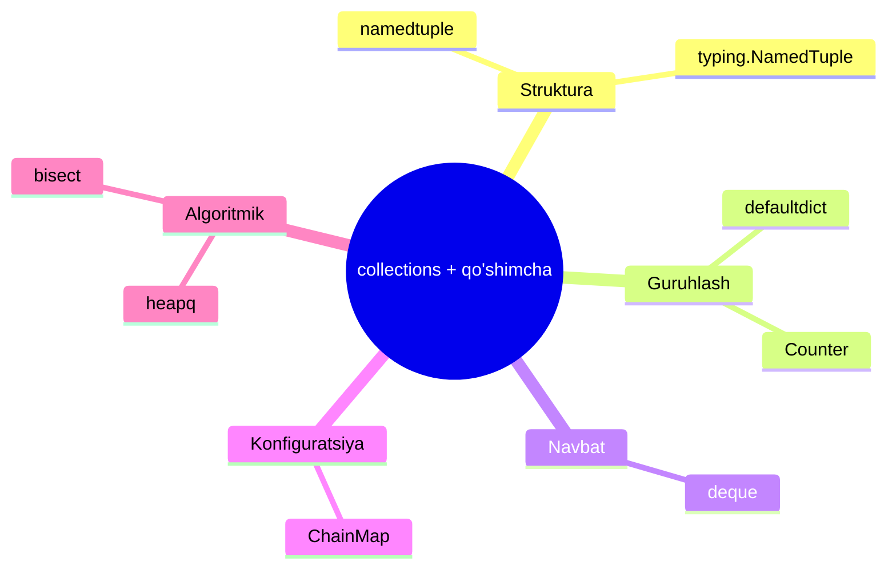
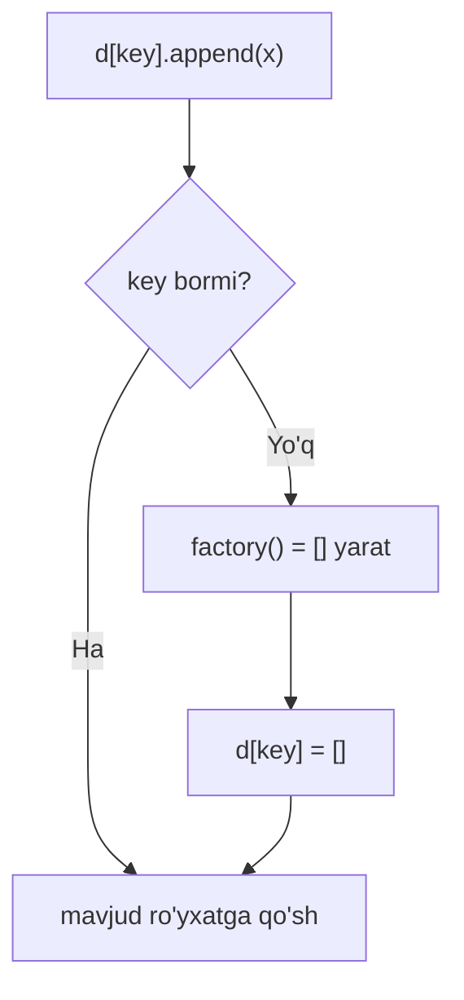
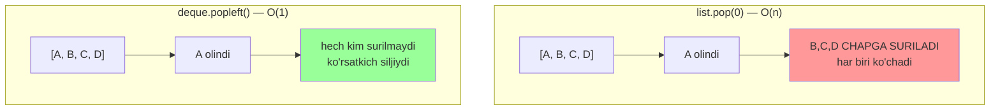
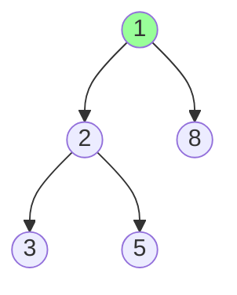

# 08. Collections — namedtuple, defaultdict, Counter, deque

## Hook — nega bu dars ML Engineer uchun muhim

Algorithm kursida BFS'ni o'rgangansan. Lekin Python'da BFS'ni **oddiy `list` bilan** yozsang —
u sekin ishlaydi. Sababi: `list.pop(0)` har chaqiruvda **O(n)**. To'g'ri vosita `deque` — **O(1)**.

Bugun `collections` va `heapq`/`bisect`'dagi to'g'ri tuzilmalarni o'rganamiz. Bilgan algoritming
(Big O, BFS, heap, binary search) shu tayyor vositalarga **to'g'ridan-to'g'ri** bog'lanadi.

> Go'da `container/heap` va `container/list` bor. Python'da tayyor: `heapq`, `deque`, `bisect`.

---

## Mavzu xaritasi



---

## 1-qism: namedtuple — nomli maydonli tuple

### Hook

`point[0]`, `point[1]` deb yozganingda 3 oydan keyin `[0]` nima ekanini unutasan. Nomsiz
indekslar — xato manbai. Yechim: tuple'ga **nom** berish.

### Analogiya

`namedtuple` — Go'dagi struct'ning yengil, o'zgarmas (immutable) ko'rinishi. Maydonlarga nom
bilan murojaat qilasan (`p.x`), lekin ichida u baribir oddiy tuple — yengil va tez.

Chegarasi: struct'dan farqi — `namedtuple` **immutable** (`p.x = 5` xato). O'zgaruvchan maydon
kerak bo'lsa `@dataclass` ishlat.

### Sodda ta'rif

`namedtuple` — maydonlariga nom bilan murojaat qilinadigan tuple. Xotira jihatdan oddiy tuple
kabi yengil, lekin o'qilishi struct kabi aniq.

### Worked example

```python
from collections import namedtuple

# --- 1-qadam: "tur"ni e'lon qilamiz (maydon nomlari bilan) ---
Point = namedtuple("Point", ["x", "y"])

# --- 2-qadam: obyekt yaratamiz va nom bilan o'qiymiz ---
p = Point(1, 2)
print(p.x, p.y)       # nom bilan
print(p[0])           # indeks ham ishlaydi
print(p)              # chiroyli repr
x, y = p              # unpacking ham mumkin
print(x + y)
```

**Output:**
```
1 2
1
Point(x=1, y=2)
3
```

### typing.NamedTuple — metod va type hint bilan

```python
from typing import NamedTuple

# --- 1-qadam: class sintaksisi + type hint + metod ---
class Vec(NamedTuple):
    x: int
    y: int
    def length(self) -> float:
        return (self.x ** 2 + self.y ** 2) ** 0.5

v = Vec(3, 4)
print(v.length())
print(v)
```

**Output:**
```
5.0
Vec(x=3, y=4)
```

`typing.NamedTuple` — zamonaviy, o'qilishli usul: type hint qo'shasan va hatto **metod**
yozasan. ML kodida sozlamalar/koordinatalar uchun ideal — yengil va o'zgarmas.

---

## 2-qism: defaultdict — KeyError'siz guruhlash

### Hook

Ma'lumotni guruhlaganingda `dict[key].append(x)` yozasan, lekin `key` hali yo'q bo'lsa —
`KeyError`. Har safar `if key not in d: d[key] = []` yozish zerikarli. `defaultdict` buni yo'qotadi.

### Analogiya

`defaultdict` — "yo'q kalit so'ralsa, avtomatik bo'sh idish qo'yib beradigan" lug'at. Xuddi Go
map'i: yo'q kalitga murojaat qilsang, **zero value** (bo'sh) qaytaradi, panic bermaydi.

Chegarasi: Go map yo'q kalit o'qilganda zero value qaytaradi, lekin **saqlamaydi**.
`defaultdict` esa yo'q kalit **o'qilganda** default qiymatni yaratib, lug'atga **qo'shib** qo'yadi.

### Sodda ta'rif

`defaultdict(factory)` — yo'q kalit so'ralganda `factory()` (masalan `list`, `int`) chaqirib,
default qiymat yaratadigan lug'at. `KeyError` chiqmaydi.

### Diagramma



### Worked example

```python
from collections import defaultdict

# --- 1-qadam: har kalit uchun default bo'sh ro'yxat ---
words = ["apple", "banana", "avocado", "cherry"]
groups = defaultdict(list)

# --- 2-qadam: birinchi harf bo'yicha guruhlash (KeyError yo'q) ---
for w in words:
    groups[w[0]].append(w)      # w[0] yo'q bo'lsa ham ishlaydi

print(dict(groups))

# --- 3-qadam: sanoq uchun defaultdict(int) ---
counts = defaultdict(int)
for ch in "mississippi":
    counts[ch] += 1             # yo'q kalit uchun 0 dan boshlaydi
print(dict(counts))
```

**Output:**
```
{'a': ['apple', 'avocado'], 'b': ['banana'], 'c': ['cherry']}
{'m': 1, 'i': 4, 's': 4, 'p': 2}
```

**Notional machine:** `groups["a"]` birinchi marta so'ralganda kalit yo'q. `defaultdict`
`__missing__` metodini chaqiradi, u `list()` bilan bo'sh ro'yxat yaratadi, kalitga bog'laydi
va **shu ro'yxatni** qaytaradi — `.append` unga ishlaydi. Oddiy `dict` bunda `KeyError` otardi.

### ⚠️ Keng tarqalgan xatolar

**Xato: factory'ni chaqirib yuborish**
- Noto'g'ri: `defaultdict(list())` — bu `list()` **natijasini** (bo'sh ro'yxat) uzatadi.
- Nega yomon: `defaultdict` **chaqiriladigan** narsa (funksiya) kutadi, obyekt emas — `TypeError`.
- To'g'risi: `defaultdict(list)` — qavssiz, funksiyaning o'zini uzat.

---

## 3-qism: Counter — sanash uchun tayyor vosita

### Hook

Oldingi qismda `defaultdict(int)` bilan harflarni sanadik. Lekin sanash shunchalik keng
tarqalganki, Python maxsus vosita bergan — `Counter`. U sanaydi **va** qo'shimcha kuch beradi.

### Analogiya

`Counter` — ovoz sanoq mashinasi: har elementni tashlaysan, u avtomatik hisoblaydi va
"eng ko'p ovoz olganlar"ni (`most_common`) tartib bilan chiqarib beradi.

### Sodda ta'rif

`Counter` — element chastotalarini sanaydigan maxsus `dict`. `most_common(n)` eng ko'plarini
beradi; `+`, `-` bilan sanoqlarni birlashtirish/ayirish mumkin.

### Worked example

```python
from collections import Counter

# --- 1-qadam: bir qatordan chastota hisoblash ---
c = Counter("mississippi")
print(c)

# --- 2-qadam: eng ko'p uchraydigan 2 tasi (algoritmik: top-K!) ---
print(c.most_common(2))

# --- 3-qadam: Counter arifmetikasi ---
a = Counter(a=3, b=1)
b = Counter(a=1, b=2, c=5)
print(a + b)     # sanoqlar qo'shiladi
print(a - b)     # manfiy/nol sanoqlar tashlanadi
```

**Output:**
```
Counter({'i': 4, 's': 4, 'p': 2, 'm': 1})
[('i', 4), ('s', 4)]
Counter({'c': 5, 'a': 4, 'b': 3})
Counter({'a': 2})
```

**Algoritmik bog'lanish:** "Top K Frequent Elements" masalasini `Counter(nums).most_common(k)`
bir qatorda yechadi. Ichkarida `most_common` heap ishlatadi — 12-dars (Heap) bilan bog'lanadi.

### 🤔 O'ylab ko'r

`a - b` da `b`'ning `b=2` va `c=5` sanoqlari `a`'nikidan katta. Natijada `b` va `c` nega
yo'qoldi?

<details>
<summary>💡 Javobni ko'rish</summary>

`Counter`ning `-` operatori faqat **musbat** sanoqlarni saqlaydi. `a - b` da: `a=3-1=2` (musbat,
qoladi), `b=1-2=-1` (manfiy, tashlanadi), `c=0-5=-5` (manfiy, tashlanadi). Shuning uchun natija
faqat `Counter({'a': 2})`. Manfiy sanoq mantiqan "chastota" bo'la olmaydi, shuning uchun olib tashlanadi.

</details>

---

## 4-qism: deque — nega list.pop(0) sekin (BFS'ning to'g'ri quroli)

### Hook

BFS uchun navbat (queue) kerak. `list` bilan `queue.pop(0)` yozsang, kod ishlaydi — lekin
katta grafda **sekin**. Sababi Big O'da: `list.pop(0)` = **O(n)**, `deque.popleft()` = **O(1)**.

### Analogiya

`list` — bir tomoni devorga tiralgan qator odamlar. Oldindan birini olsang, qolgan hamma
**bir qadam surilishi** kerak (O(n)). `deque` — ikki tomoni ochiq turnaket: chetdan olish
hech kimni surmaydi (O(1)).

Chegarasi: `deque` o'rtadan indeks bilan o'qishda `list`'dan sekin. `deque` **ikki chetda**
tez, `list` esa **tasodifiy indeks**da tez. Har biriga o'z o'rni.

### Sodda ta'rif

`deque` (double-ended queue) — ikkala chetiga ham **O(1)** da qo'shish/olish mumkin bo'lgan
tuzilma. Navbat (queue) va stack uchun ideal; BFS'ning standart quroli.

### Diagramma — nega list.pop(0) O(n)



### Worked example — deque asoslari

```python
from collections import deque

# --- 1-qadam: ikkala chetdan qo'shish ---
d = deque([1, 2, 3])
d.append(4)          # o'ngga  -> [1, 2, 3, 4]
d.appendleft(0)      # chapga  -> [0, 1, 2, 3, 4]
print(d)

# --- 2-qadam: ikkala chetdan olish (ikkalasi ham O(1)) ---
print(d.popleft())   # chapdan
print(d.pop())       # o'ngdan
print(d)
```

**Output:**
```
deque([0, 1, 2, 3, 4])
0
4
deque([1, 2, 3])
```

### Worked example — BFS deque bilan

```python
from collections import deque

# --- 1-qadam: graf (qo'shnilar ro'yxati) ---
graph = {"A": ["B", "C"], "B": ["D"], "C": ["D"], "D": []}

# --- 2-qadam: BFS — navbat sifatida deque ---
def bfs(start):
    visited, seen = [], {start}
    queue = deque([start])
    while queue:
        node = queue.popleft()          # O(1) — list bo'lsa O(n) edi
        visited.append(node)
        for nxt in graph[node]:
            if nxt not in seen:
                seen.add(nxt)
                queue.append(nxt)
    return visited

print(bfs("A"))
```

**Output:**
```
['A', 'B', 'C', 'D']
```

**Notional machine:** `list.pop(0)` birinchi elementni olib, qolgan barcha elementlarni bitta
chapga **ko'chiradi** — n ta ko'chirish, O(n). `deque` ichida ikki tomonlama bog'langan bloklar
bor; chetdan olish faqat **ko'rsatkich**ni siljitadi, hech nima ko'chmaydi — O(1). Katta grafda
farq ulkan.

> **Oltin qoida:** navbat (FIFO) yoki ikki chetli ish kerak bo'lsa — **`deque`**, `list` emas.

---

## 5-qism: ChainMap — bir nechta lug'atni bittaday ko'rish

### Hook

Sozlamalar bir necha manbadan keladi: default'lar, config fayl, foydalanuvchi kiritgan.
Har birini alohida tekshirmasdan, "avval qayerda topilsa" mantig'i bilan **bittaday** ko'rmoqchisan.

### Sodda ta'rif

`ChainMap` — bir nechta lug'atni **birlashtirib** ko'rsatadi. Kalit qidirilganda birinchi
lug'atdan boshlab, topilgunicha ketma-ket qaraydi — nusxa ko'chirmaydi.

### Worked example

```python
from collections import ChainMap

# --- 1-qadam: ustuvorlik tartibida lug'atlar ---
defaults = {"color": "red", "size": "M"}
user = {"color": "blue"}
config = ChainMap(user, defaults)          # user birinchi ustuvor

# --- 2-qadam: qidiruv birinchi lug'atdan boshlanadi ---
print(config["color"])   # user'da bor
print(config["size"])    # user'da yo'q -> defaults'dan
```

**Output:**
```
blue
M
```

`ChainMap` MRO (05-dars) mantig'iga o'xshaydi: qidiruv aniq tartibda, birinchi topilgan yutadi.
Nusxa qilmagani uchun tez va xotira tejamkor.

---

## 6-qism: heapq — priority queue (algoritm kursiga ko'prik)

### Hook

Dijkstra, Prim, "Top K", "stream'dan doim min/max" — hammasida **priority queue** kerak.
Algorithm kursida heap'ni o'rgangansan; Python'da uni yozishing shart emas — `heapq` tayyor.

### Analogiya

`heapq` — shifoxona navbati: kelish tartibida emas, **ustuvorlik** (holat og'irligi) bo'yicha.
Har safar eng ustuvor (eng kichik) element birinchi chiqadi.

Chegarasi: `heapq` — faqat **min-heap**. Max-heap kerak bo'lsa, qiymatlarni **manfiy** qilib
qo'yasan (`-x`). Go'dagi `container/heap`'dan farqi — bu funksiyalar to'plami, interface emas.

### Sodda ta'rif

`heapq` — oddiy `list`'ni min-heap sifatida boshqaradigan funksiyalar: `heapify`, `heappush`,
`heappop`. Push/pop — **O(log n)**, eng kichigini ko'rish — O(1).

### Diagramma



Min-heap: ildiz (root) doim eng kichik. Array ko'rinishi: `[1, 2, 8, 3, 5]`.

### Worked example

```python
import heapq

# --- 1-qadam: oddiy list'ni heap'ga aylantirish (O(n)) ---
nums = [5, 1, 8, 3, 2]
heapq.heapify(nums)
print(nums)                    # heap tartibi (to'liq sort EMAS)

# --- 2-qadam: eng kichigini olish va yangi qo'shish (O(log n)) ---
print(heapq.heappop(nums))     # eng kichik
heapq.heappush(nums, 0)
print(heapq.heappop(nums))     # yangi eng kichik

# --- 3-qadam: tayyor top-K funksiyalar ---
print(heapq.nlargest(3, [5, 1, 8, 3, 2]))
print(heapq.nsmallest(2, [5, 1, 8, 3, 2]))
```

**Output:**
```
[1, 2, 8, 3, 5]
1
0
[8, 5, 3]
[1, 2, 8, 3, 5]
```

Diqqat: `heapify`dan keyin array **to'liq sortlangan emas** — faqat heap invarianti (ildiz eng
kichik) bajariladi. `[1, 2, 8, 3, 5]`'da 8, 3'dan katta, lekin bu normal — heap tartibi shunday.

### ⚠️ Keng tarqalgan xatolar

**Xato: heap'ni sortlangan deb o'ylash**
- Noto'g'ri tasavvur: `heapify` dan keyin `nums[1]` ikkinchi eng kichik.
- Nega noto'g'ri: heap faqat ildiz eng kichikligini kafolatlaydi, qolgani sort emas.
- To'g'risi: tartiblangan chiqish uchun `heappop`'ni ketma-ket chaqir (yoki `sorted` ishlat).

---

## 7-qism: bisect — sortlangan ro'yxatda binary search

### Hook

Algorithm kursida binary search'ni qo'lda yozgansan (chap/o'ng chegara, `mid`...). Kundalik
kodda uni qayta yozish shart emas — `bisect` tayyor va xatosiz **O(log n)** beradi.

### Analogiya

`bisect` — lug'atdan so'z qidirish: kitobni o'rtasidan ochib, "oldinmi-keyinmi" deb yarmini
tashlab tashlaysan. Har qadamda variantlar ikki baravar kamayadi.

### Sodda ta'rif

`bisect` — **sortlangan** ro'yxatda elementning o'rnini binary search bilan topadi.
`insort` esa tartibni buzmasdan yangi element qo'yadi.

### Worked example

```python
import bisect

# --- 1-qadam: SORTLANGAN ro'yxat (shart!) ---
arr = [1, 3, 5, 7, 9]

# --- 2-qadam: 5 qayerga tushadi? left vs right ---
print(bisect.bisect_left(arr, 5))    # 5 ning chap chegarasi
print(bisect.bisect_right(arr, 5))   # 5 ning o'ng chegarasi

# --- 3-qadam: tartibni buzmasdan qo'shish ---
bisect.insort(arr, 4)
print(arr)
```

**Output:**
```
2
3
[1, 3, 4, 5, 7, 9]
```

**Algoritmik bog'lanish:** "Search Insert Position" masalasi = `bisect_left`. "sortlangan
massivda X bormi" = `bisect_left` natijasini tekshirish. Go'da bunga `sort.Search` mos keladi.

### ⚠️ Keng tarqalgan xatolar

**Xato: sortlanmagan ro'yxatda bisect ishlatish**
- Muammo: `bisect` faqat **oldindan sortlangan** ro'yxatda to'g'ri ishlaydi.
- Nega yomon: sortsiz bo'lsa, natija **jimgina noto'g'ri** bo'ladi (xato bermaydi, adashtiradi).
- To'g'risi: ro'yxat sortlangligiga ishonch hosil qil; `insort`'ni doim sortlangan ro'yxatda ishlat.

---

## Xulosa

- `namedtuple` / `typing.NamedTuple` — nomli maydonli, immutable, yengil (Go struct kabi).
- `defaultdict(factory)` — yo'q kalitni avtomatik yaratadi; `KeyError`'siz guruhlash/sanash.
- `Counter` — chastota sanash + `most_common` (top-K) + arifmetika (`+`, `-`).
- `deque` — ikki chetda O(1); `list.pop(0)` O(n) bo'lgani uchun BFS uchun to'g'ri qurol.
- `ChainMap` — bir nechta lug'atni tartib bilan bittaday ko'rish (nusxasiz).
- `heapq` — min-heap; push/pop O(log n); Dijkstra, top-K uchun; max uchun `-x`.
- `bisect` — sortlangan ro'yxatda O(log n) binary search va `insort`.

## 🧠 Eslab qol

- `list.pop(0)` = O(n), `deque.popleft()` = O(1) -> BFS uchun deque.
- `defaultdict` = yo'q kalitga default (Go map zero value kabi).
- `Counter(nums).most_common(k)` = top-K bir qatorda.
- `heapq` faqat min-heap; max uchun manfiy qiymat.
- `bisect` faqat sortlangan ro'yxatda ishlaydi.

## ✅ O'z-o'zini tekshir (retrieval practice)

**1.** Nega BFS'da `list.pop(0)` sekin, `deque.popleft()` tez? Big O bilan tushuntir.

<details>
<summary>Javob</summary>

`list.pop(0)` birinchi elementni olib, qolgan barchasini bitta chapga ko'chiradi — **O(n)**.
Katta grafda har qadamda n ta ko'chirish jamlanib, umumiy ishni sekinlashtiradi. `deque` esa
ikki tomonlama bog'langan tuzilma; chetdan olish faqat ko'rsatkichni siljitadi — **O(1)**.

</details>

**2.** `defaultdict(list)` va `defaultdict(list())` orasidagi farq nima? Qaysi biri xato?

<details>
<summary>Javob</summary>

`defaultdict(list)` — to'g'ri: `list` **funksiya**si (factory) uzatiladi, har yo'q kalitda
chaqiriladi. `defaultdict(list())` — xato: `list()` darhol chaqirilib, uning **natijasi** (bo'sh
ro'yxat) uzatiladi, `defaultdict` esa chaqiriladigan narsa kutadi — `TypeError`.

</details>

**3.** `heapq.heapify(nums)` dan keyin `nums` to'liq sortlanganmi? Ikkinchi eng kichik element
`nums[1]`dami?

<details>
<summary>Javob</summary>

Yo'q, to'liq sortlangan emas. Heap faqat **ildiz** (`nums[0]`) eng kichik ekanini kafolatlaydi.
`nums[1]` ikkinchi eng kichik bo'lishi **shart emas**. Tartiblangan natija uchun `heappop`'ni
ketma-ket chaqirish kerak.

</details>

**4.** `heapq` faqat min-heap. Eng kattani tez olib turadigan max-heap kerak bo'lsa nima qilasan?

<details>
<summary>Javob</summary>

Qiymatlarni **manfiy** qilib saqlaysan (`heappush(h, -x)`), olganda esa `-heappop(h)`. Manfiy
belgi tartibni ag'daradi: eng katta musbat = eng kichik manfiy, shuning uchun min-heap uni
birinchi chiqaradi. Yoki `heapq.nlargest`'dan foydalanasan.

</details>

## 🛠 Amaliyot

**1. Oson (Modify).** BFS misolini o'zgartir: `deque` o'rniga oddiy `list` + `pop(0)` ishlat.
Natija bir xil chiqishini, lekin katta grafda nega sekin bo'lishini izohla.

<details>
<summary>Hint</summary>

`queue = [start]`, `node = queue.pop(0)`. Natija (`['A','B','C','D']`) o'zgarmaydi. Farq —
tezlikda: `pop(0)` har chaqiruvda O(n), 10000 tugunli grafda sezilarli sekinlik beradi.

</details>

**2. O'rta (faded example).** `word_frequency` funksiyasini `Counter` bilan to'ldir — matndagi
eng ko'p uchraydigan `n` so'zni qaytarsin:

```python
from collections import Counter

def top_words(text: str, n: int):
    words = text.lower().split()
    # TODO: Counter bilan chastota hisobla
    # TODO: eng ko'p uchraydigan n tasini qaytar
    ...

print(top_words("the cat the dog the cat", 2))
# [('the', 3), ('cat', 2)]
```

<details>
<summary>Hint</summary>

`Counter(words).most_common(n)`. `most_common` allaqachon tuple ro'yxatini
`(so'z, sanoq)` ko'rinishida, kamayish tartibida qaytaradi.

</details>

**3. Qiyin (Make).** Noldan "K-chi eng katta element" funksiyasini `heapq` bilan yoz: o'lchami
`k`dan oshmaydigan **min-heap** saqla (algorithm kursidagi shablon). `[3,2,1,5,6,4], k=2` uchun
`5` qaytarsin.

<details>
<summary>Hint</summary>

`h = []`. Har `x` uchun `heapq.heappush(h, x)`; agar `len(h) > k` bo'lsa `heapq.heappop(h)`
(eng kichigini chiqar). Oxirda `h[0]` — heap ichidagi eng kichik, ya'ni k-chi eng katta.
Time: O(n log k).

</details>

## 🔁 Takrorlash

**Bog'liq oldingi darslar:**
- 07. Functional Python — `Counter`/`defaultdict` guruhlashda `groupby`'ga alternativa.
- 06. Data model — `namedtuple` immutable, `typing.NamedTuple` metod qo'sha oladi.
- Algorithm — Big O (deque O(1) vs list O(n)), BFS (deque queue), Heap (heapq), Binary Search (bisect).

**Takrorlash jadvali:**
- **Ertaga:** `list.pop(0)` vs `deque.popleft()` Big O farqini xotiradan tushuntir.
- **3 kundan keyin:** BFS'ni `deque` bilan xotiradan qayta yoz.
- **1 haftadan keyin:** mavzu xaritasidagi 7 vositani (namedtuple...bisect) bir jumladan izohla.

**Feynman testi:** Kod so'zlarisiz 3 jumlada tushuntir: (1) nega BFS'da deque list'dan yaxshi,
(2) `defaultdict` qanday `KeyError`'ni yo'qotadi, (3) `heapq` bilan top-K qanday ishlaydi.

---

**Manbalar:** Fluent Python (2nd ed., Ch. 3, 5) — Luciano Ramalho; Effective Python (2nd ed.,
Item 70-72) — Brett Slatkin; Python Cookbook (Ch. 1) — Beazley & Jones; Python docs —
collections, heapq, bisect; Real Python.
