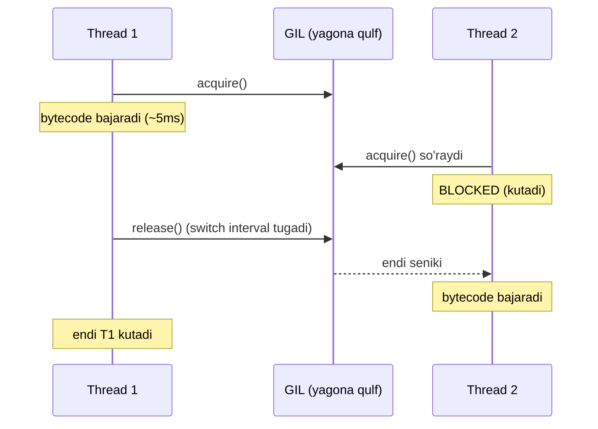
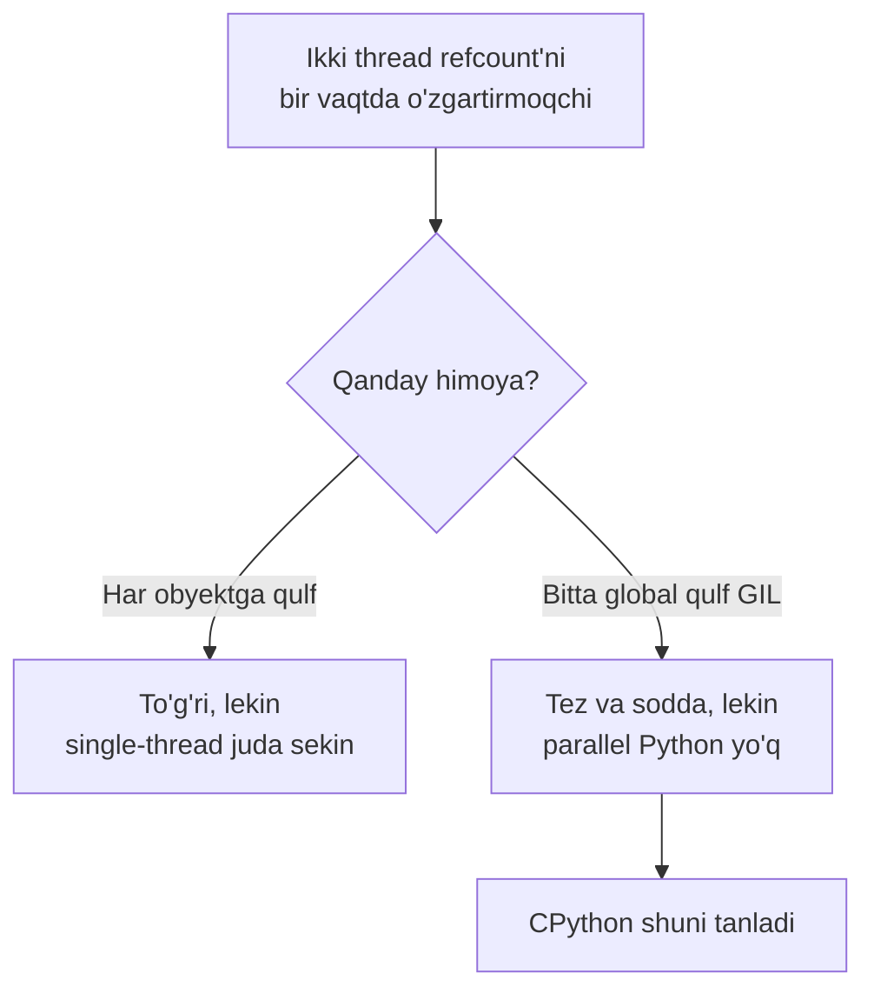
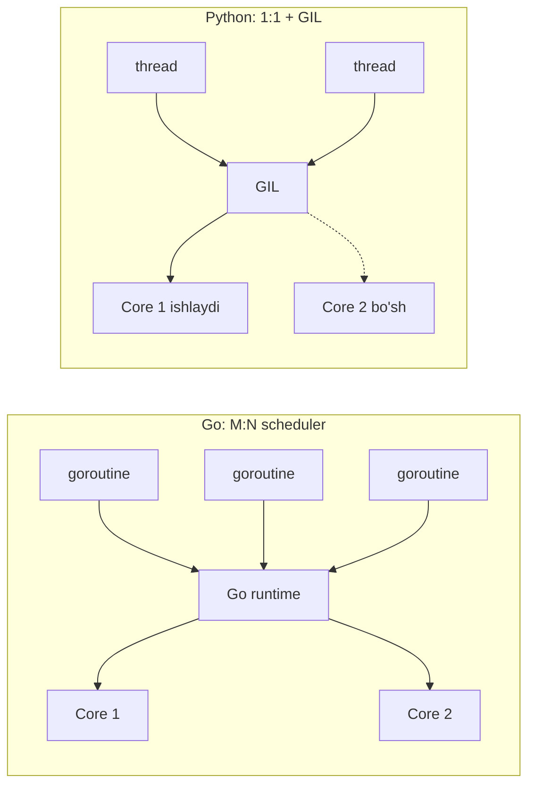

# 09. Threading va GIL

## Hook — nega bu dars sen uchun aynan qiziq?

Go'da sen `runtime.GOMAXPROCS(8)` qo'yasan, 8 ta goroutine ochasan va CPU-bound ish
**8 baravar** tez tugaydi. Bu senga tabiiy tuyuladi.

Endi Python'da xuddi shu narsani qilasan: 8 ta `threading.Thread`, har biri og'ir
hisob-kitob qiladi. Kutasan: 8x tezlik. Olasan: **1x** (hatto biroz sekinroq).

Sabab — **GIL** (Global Interpreter Lock). Bu dars aynan shu sirni ochadi: nega
Python thread'lari CPU'da parallel EMAS, lekin IO'da baribir foydali, va bu Go'ning
scheduler'idan qanchalik tubdan farq qiladi.

---

## Analogiya — bitta mikrofonli konferensiya

Tasavvur qil: katta zalda 8 kishi (thread'lar) bahslashmoqchi. Lekin butun zalda
faqat **bitta mikrofon** (GIL) bor. Qoida: gapirish uchun mikrofonni qo'lingda ushlab
turishing shart.

8 kishi bo'lsa ham, istalgan lahzada **faqat bittasi** gapiradi. Qolganlari navbat
kutadi. Mikrofon juda tez qo'ldan qo'lga o'tadi (har ~5 millisekundda), shuning uchun
"hamma gapiryapti" degan illyuziya paydo bo'ladi — aslida esa navbatma-navbat.

> **Analogiya chegarasi:** agar bir kishi mikrofonni ushlab turib, uzoq telefon
> qo'ng'irog'ini **kutsa** (IO — masalan javob kutish), u odobli bo'lib mikrofonni
> vaqtincha qo'yib yuboradi. Shu payt boshqasi gapiradi. Mana shuning uchun IO-bound
> ishda thread'lar foyda beradi, CPU-bound'da esa yo'q.

Go'da esa "mikrofon" umuman yo'q — har goroutine o'z yadrosida bemalol gapiraveradi.

---

## Sodda ta'rif

> **GIL (Global Interpreter Lock)** — CPython interpreter'ida bir vaqtning o'zida
> faqat bitta thread Python bytecode bajarishiga ruxsat beruvchi global mutex.

Ya'ni 100 ta thread ochsang ham, Python-darajadagi kod bir lahzada faqat bitta
thread'da ishlaydi. **thread'lar mavjud, lekin parallel Python kodi mavjud emas.**

---

## Diagramma — GIL qanday navbat qo'yadi (CPU-bound)



Diqqat qil: T1 va T2 hech qachon **bir vaqtda** ishlamayapti. Ular navbatlashyapti.
Ikkinchi yadro bo'sh turibdi — GIL uni band qilishga yo'l qo'ymayapti.

---

## Worked example 1 — threading asoslari (IO-bound, foyda bor)

```python
import threading
import time

# --- 1-qadam: har thread bajaradigan funksiya ---
def worker(name, delay):
    print(f"{name} boshladi")
    time.sleep(delay)          # IO/kutish simulatsiyasi -> GIL qo'yib yuboriladi
    print(f"{name} tugadi")

# --- 2-qadam: ikkita thread yaratamiz ---
t1 = threading.Thread(target=worker, args=("A", 2))
t2 = threading.Thread(target=worker, args=("B", 1))

# --- 3-qadam: ishga tushiramiz (start) va tugashini kutamiz (join) ---
t1.start()
t2.start()
t1.join()      # t1 tugaguncha main to'xtab turadi
t2.join()
print("Hammasi tugadi")
```

Taxminiy output:

```
A boshladi
B boshladi
B tugadi
A tugadi
Hammasi tugadi
```

**Notional machine:** `time.sleep()` — bu blocking IO. CPython bunday paytda GIL'ni
darhol qo'yib yuboradi. Shuning uchun A uxlab yotganda B ishlaydi. Umumiy vaqt ~2
sekund (3 emas). IO-bound'da thread'lar **haqiqiy foyda** beradi.

`start()` — Go'dagi `go worker()` ga o'xshaydi (yangi ishchini yo'lga soladi),
`join()` — `sync.WaitGroup.Wait()` yoki `<-done` ga o'xshaydi (tugashini kutadi).

> 🤔 **O'ylab ko'r:** agar `t1.start()` o'rniga to'g'ridan-to'g'ri `worker("A", 2)`
> deb chaqirsak nima o'zgaradi?

<details>
<summary>💡 Javobni ko'rish</summary>

`worker("A", 2)` — bu oddiy funksiya chaqiruvi, yangi thread ochmaydi. U **main
thread'da** to'liq ishlab tugaydi, keyingina keyingi qatorga o'tadi. Ya'ni A butunlay
tugamaguncha B boshlanmaydi — concurrency yo'qoladi, umumiy vaqt 3 sekund bo'ladi.
`start()` yangi thread ochadi, oddiy chaqiruv esa yo'q.

</details>

---

## Nega GIL umuman mavjud? — reference counting himoyasi

Bu Go dasturchisi uchun eng qiziq qismi. GIL "yomon dizayn" emas — u **aniq bir
muammoni** hal qiladi.

CPython'da har bir obyekt ichida `ob_refcnt` degan hisoblagich bor — bu obyektga
nechta reference borligini sanaydi (bu haqda 12-darsda chuqur gaplashamiz).

```python
import sys
a = []
print(sys.getrefcount(a))   # 2 (bittasi 'a', bittasi getrefcount argumenti)
```

Har `b = a` da refcount +1, har `del`/scope tugashi'da -1 bo'ladi. **Nol** bo'lganda
obyekt xotiradan ozod qilinadi.

Endi tasavvur qil: ikki thread bir vaqtda `refcount++` va `refcount--` qilyapti,
qulfsiz. Bu `counter += 1` kabi **atomik emas** (o'qi -> qo'sh -> yoz). Natija:

- refcount noto'g'ri hisoblanadi;
- obyekt hali kerak bo'lsa ham ozod qilinadi -> **crash / use-after-free**;
- yoki hech qachon ozod qilinmaydi -> **memory leak**.

Yechim ikkita bo'lishi mumkin edi:

| Yondashuv | Ma'nosi | Kamchiligi |
| --- | --- | --- |
| Har obyektga alohida qulf | Fine-grained locking | Millionlab atomik amal -> single-thread juda sekin |
| **Bitta global qulf (GIL)** | Butun interpreter uchun 1 mutex | Parallel Python kodi yo'q |

CPython ikkinchisini tanladi: **soddalik va single-thread tezligi** uchun. GIL —
reference counting'ni himoya qiluvchi eng arzon (o'sha davr uchun) yechim edi.



---

## Worked example 2 — CPU-bound: thread FOYDA BERMAYDI

```python
import time
from concurrent.futures import ThreadPoolExecutor

# --- 1-qadam: sof CPU ishi (hech qanday IO yo'q) ---
def cpu_task(n):
    total = 0
    for i in range(n):
        total += i * i
    return total

N = 20_000_000

# --- 2-qadam: ketma-ket (sequential) o'lchash ---
start = time.perf_counter()
cpu_task(N); cpu_task(N)
print(f"ketma-ket: {time.perf_counter() - start:.2f}s")

# --- 3-qadam: 2 thread bilan o'lchash ---
start = time.perf_counter()
with ThreadPoolExecutor(max_workers=2) as pool:
    list(pool.map(cpu_task, [N, N]))
print(f"2 thread:  {time.perf_counter() - start:.2f}s")
```

Taxminiy output:

```
ketma-ket: 1.80s
2 thread:  1.85s
```

**Xulosa aniq:** 2 thread ketma-ketdan tezroq EMAS. GIL ikkala thread'ni
navbatlashtirdi, ikkinchi yadro ishlatilmadi. Hatto GIL'ni qo'ldan qo'lga o'tkazish
xarajati tufayli biroz sekinroq. CPU-bound uchun thread — bekorchilik. (Yechim —
keyingi dars: `multiprocessing`.)

---

## GIL race condition'dan himoya QILMAYDI — isbot

Bu eng ko'p uchraydigan noto'g'ri tasavvur. "GIL bor, demak Python thread'lari
xavfsiz" — **NOTO'G'RI**.

GIL faqat interpreter'ning ichki ishini (refcount) himoya qiladi. Sening **mantiqiy**
kodingni emas.

```python
import threading

counter = 0

# --- 1-qadam: umumiy o'zgaruvchini oshiradigan worker ---
def worker():
    global counter
    for _ in range(1_000_000):
        counter += 1          # atomik EMAS: o'qi -> qo'sh -> yoz

# --- 2-qadam: 4 thread bir xil counter ustida ishlaydi ---
threads = [threading.Thread(target=worker) for _ in range(4)]
for t in threads:
    t.start()
for t in threads:
    t.join()

print(counter)   # kutilgan: 4_000_000
```

Taxminiy output (har safar boshqacha):

```
3_215_492
```

**Nega 4 000 000 emas?** `counter += 1` uchta bytecode'ga bo'linadi:

```python
import dis
dis.dis("counter += 1")
#   LOAD_NAME counter      <- eski qiymatni o'qidi
#   LOAD_CONST 1
#   BINARY_OP +=           <- qo'shdi
#   STORE_NAME counter     <- yozdi
```

GIL istalgan ikki bytecode **orasida** boshqa thread'ga o'tishi mumkin (switch
interval, ~5ms). Thread A `LOAD` qildi (masalan 100 o'qidi), keyin GIL B'ga o'tdi, B
ham 100 o'qidi, ikkalasi 101 yozdi — bitta oshirish **yo'qoldi**.

> **Oltin qoida:** GIL atomiklikni KAFOLATLAMAYDI. Umumiy holatni o'zgartirsang,
> Go'dagidek `Lock` (mutex) yoki `queue.Queue` (channel o'rnini bosuvchi) ishlatishing
> SHART.

Bu Go'dagi race detector aytadigan aynan o'sha muammo — faqat Python bu haqda seni
ogohlantirmaydi.

---

## Yechim — Lock va RLock

```python
import threading

counter = 0
lock = threading.Lock()          # Go'dagi sync.Mutex

def worker():
    global counter
    for _ in range(1_000_000):
        with lock:               # kritik bo'lim (Go: mu.Lock()/defer mu.Unlock())
            counter += 1

threads = [threading.Thread(target=worker) for _ in range(4)]
for t in threads: t.start()
for t in threads: t.join()
print(counter)   # 4_000_000 — endi to'g'ri
```

Output:

```
4000000
```

`with lock:` — bloomka kirganda qulflaydi, chiqqanda ochadi (Go'dagi `mu.Lock()` +
`defer mu.Unlock()` bilan bir xil g'oya). Endi `counter += 1` bo'linmas bo'ldi.

**Lock vs RLock:**

| | `Lock` | `RLock` (reentrant) |
| --- | --- | --- |
| Bir thread ikki marta acquire | **Deadlock** | Ruxsat (hisoblaydi) |
| Qachon kerak | Oddiy holat | Rekursiv yoki bir metod boshqa qulflangan metodni chaqirsa |

Go'da `sync.Mutex` reentrant EMAS — bu jihatdan Python'ning `RLock`'i Go'da
ekvivalentsiz (Go'da qayta-kirishni o'zing dizayn bilan hal qilasan).

---

## ThreadPoolExecutor — thread'larni qo'lda boshqarmaslik

Har thread'ni qo'lda `start()/join()` qilish zerikarli. `concurrent.futures` pool
beradi — Go'dagi worker pool pattern'iga o'xshaydi.

```python
from concurrent.futures import ThreadPoolExecutor
import time

# --- 1-qadam: IO simulatsiyasi bo'lgan vazifa ---
def fetch(n):
    time.sleep(1)              # HTTP so'rov kabi -> GIL bo'shaydi
    return n * n

# --- 2-qadam: 5 worker bilan pool, 5 vazifani parallel kutamiz ---
start = time.perf_counter()
with ThreadPoolExecutor(max_workers=5) as pool:
    results = list(pool.map(fetch, range(5)))
print(results, f"{time.perf_counter() - start:.1f}s")
```

Output:

```
[0, 1, 4, 9, 16] 1.0s
```

5 ta vazifa har biri 1 sekund, lekin umumiy **~1 sekund** — chunki `sleep` paytida GIL
bo'shaydi va 5 tasi kutishni overlap qiladi. Bu IO-bound uchun ideal.
`with ... as pool:` bloki tugaganda pool avtomatik `shutdown` qiladi (barcha vazifa
tugashini kutadi).

---

## Go bilan chuqur solishtirish — bu darsning yuragi

| Jihat | Go goroutine | Python thread (CPython) |
| --- | --- | --- |
| Model | M:N — runtime scheduler ko'p goroutine'ni oz OS thread'ga joylaydi | 1:1 — har thread = bitta OS thread |
| Scheduler | Go runtime (user-space) | OS kernel |
| CPU parallelizm | **Ha** (GOMAXPROCS yadro) | **Yo'q** (GIL serializatsiya qiladi) |
| Boshlang'ich xarajat | ~2 KB stack, juda arzon | OS thread, ~1 MB+ stack, qimmatroq |
| Preemption | Runtime preemptive (Go 1.14+) | OS preemptive, ammo GIL baribir serializatsiya |
| Race himoyasi | Yo'q (mutex/channel kerak) | Yo'q (GIL mantiqni himoya qilmaydi) |
| IO-bound | A'lo | Yaxshi (GIL IO'da bo'shaydi) |
| CPU-bound | A'lo | Yomon (bitta yadro) |

**Eng muhim farq:** Go'da 10000 goroutine ochsang, runtime ularni masalan 8 OS
thread ustida jonglyor qiladi va 8 yadroni to'la ishlatadi. Python'da 10000 thread
ochsang, 10000 OS thread ochiladi (qimmat) va GIL tufayli baribir bir vaqtda bittasi
Python kodi bajaradi.



---

## Free-threaded CPython — GIL yo'qolyaptimi?

Qisqa eslatma kelajak uchun. **PEP 703** GIL'ni ixtiyoriy qilishni boshladi:

- **Python 3.13** — eksperimental free-threaded build (GIL'siz). Ijrochi nomi
  `python3.13t` ("t" = threaded).
- **Python 3.14** — endi eksperimental emas, **rasmiy qo'llab-quvvatlanadi** (PEP
  779), lekin hali standart EMAS.
- Standart build hamon GIL bilan keladi; free-threaded — alohida, ixtiyoriy variant.
- Narxi: single-thread kod 3.13'da ~40% sekinroq edi, 3.14'da bu ~5-10% ga tushdi.

Free-threaded build'da CPU-bound thread'lar nihoyat parallel ishlaydi (4 thread'da
~2-3x tezlik). Lekin: 2026-yil holatiga ko'ra bu hali migratsiya davrida, ko'p C
extension'lar moslashmagan. Prod uchun hozircha CPU-bound = `multiprocessing`.

---

## Xulosa

- **GIL** — bir vaqtda faqat bitta thread Python bytecode bajarsin degan global mutex.
- U **reference counting**'ni himoya qilish uchun mavjud (single-thread tezligi va
  soddalik evaziga).
- **CPU-bound**: thread'lar parallel emas -> foyda yo'q. Yechim: multiprocessing.
- **IO-bound**: GIL kutish paytida bo'shaydi -> thread'lar haqiqiy foyda beradi.
- GIL race condition'ni **himoya qilmaydi** — umumiy holat uchun `Lock` shart.
- Go goroutine (M:N, parallel) va Python thread (1:1 + GIL) tubdan farq qiladi.
- `ThreadPoolExecutor` — IO-bound uchun qulay worker pool.
- Free-threaded CPython (3.13+/3.14) GIL'siz kelajakni ochyapti, ammo hali standart emas.

## 🧠 Eslab qol

- GIL bor -> Python thread'lari CPU'da parallel emas, IO'da foydali.
- GIL refcount'ni himoya qiladi, sening mantiqingni EMAS.
- `counter += 1` atomik emas -> umumiy holatga `Lock` kerak.
- Go: parallelizm bepul; Python thread: parallelizm yo'q.
- CPU-bound -> multiprocessing; IO-bound -> threads yoki asyncio.

## ✅ O'z-o'zini tekshir (retrieval practice)

**1.** Nima uchun 8 ta CPU-bound thread Python'da 8x tezlik bermaydi, lekin 8 ta
IO-bound thread beradi (deyarli)?

<details>
<summary>Javob</summary>

CPU-bound thread doim Python bytecode bajaradi, shuning uchun doim GIL kerak ->
navbatlashadi, bitta yadro ishlaydi. IO-bound thread esa `sleep`/`recv` paytida GIL'ni
bo'shatadi -> boshqa thread'lar shu payt ishlaydi, kutishlar overlap bo'ladi.

</details>

**2.** GIL bor bo'lsa, nega `counter += 1` ni ko'p thread ishonchsiz qiladi?

<details>
<summary>Javob</summary>

GIL faqat interpreter ichki holatini (refcount) himoya qiladi, mantiqiy amallarni
emas. `counter += 1` bir necha bytecode'ga (LOAD/ADD/STORE) bo'linadi, GIL ular
orasida boshqa thread'ga o'tishi mumkin -> ikki thread bir xil eski qiymatni o'qib,
bitta oshirishni yo'qotadi.

</details>

**3.** GIL aslida qaysi muammoni hal qilish uchun kiritilgan?

<details>
<summary>Javob</summary>

Reference counting'ni race'dan himoya qilish. Har obyektga alohida qulf o'rniga bitta
global qulf — single-thread kodi uchun tez va sodda, ammo parallel Python kodini
imkonsiz qiladi.

</details>

**4.** `Lock` va `RLock` orasidagi farq nima, va Go'da qaysi biri yo'q?

<details>
<summary>Javob</summary>

`Lock` — bir thread uni ikki marta acquire qilsa deadlock. `RLock` (reentrant) — bir
thread qayta-qayta acquire qila oladi (sanaydi). Go'ning `sync.Mutex`'i reentrant emas,
shuning uchun `RLock`'ning to'g'ridan-to'g'ri ekvivalenti Go'da yo'q.

</details>

## 🛠 Amaliyot

**1. Oson (Modify):** Yuqoridagi `worker(name, delay)` misolini 3 ta thread bilan
ishlat: A=3s, B=2s, C=1s. Umumiy vaqt qancha bo'lishini oldindan ayt, keyin tekshir.

<details>
<summary>Hint</summary>

Umumiy vaqt = eng uzun delay = ~3 sekund (parallel kutish). `time.perf_counter()` bilan
o'lch.

</details>

**2. O'rta (faded example):** Race'ni Lock bilan tuzat. Skeletni to'ldir:

```python
import threading
balance = 100
lock = threading.Lock()

def deposit(amount, times):
    global balance
    for _ in range(times):
        # TODO: qulf oling
        # TODO: balance += amount
        pass  # TODO ni almashtiring

threads = [threading.Thread(target=deposit, args=(1, 100_000)) for _ in range(5)]
# TODO: hammasini start qiling
# TODO: hammasini join qiling
print(balance)   # 500_100 bo'lishi kerak
```

<details>
<summary>Hint</summary>

`with lock:` bloki ichida `balance += amount`. Start/join uchun ikkita alohida
`for t in threads:` sikli.

</details>

**3. Qiyin (Make):** Noldan yoz: `ThreadPoolExecutor` bilan 10 ta "URL"ni (har biri
`time.sleep(random 0.5..1.5)` bilan simulatsiya) parallel "yuklab" ol, har birining
"o'lchamini" (tasodifiy son) qaytar va umumiy vaqtni chop et. Sequential bilan
solishtir.

<details>
<summary>Hint</summary>

`max_workers=10`, `pool.map(fetch, range(10))`. Sequential ~10x sekinroq bo'lishi kerak,
chunki `sleep` GIL'ni bo'shatadi va parallel kutish ishlaydi.

</details>

## 🔁 Takrorlash

- **Bog'liq oldingi mavzular:** 02. Decorator (context manager `with` mantig'i),
  08. Collections (`queue.Queue` thread-safe).
- **Keyingi:** 10. Multiprocessing (CPU-bound yechimi), 11. Asyncio (IO-bound uchun
  thread'siz yo'l).
- **Takrorlash jadvali:** bugun o'qidingmi -> **ertaga** "O'z-o'zini tekshir" 1-2
  savoliga qayt -> **3 kundan keyin** race misolini yoddan qayta yoz -> **1 haftadan
  keyin** GIL vs goroutine jadvalini yoddan tikla.
- **Feynman testi:** kod so'zlarisiz, bir Go dasturchisi do'stingga 3 jumlada tushuntir:
  "Python'da GIL nima, nega CPU-bound thread bermaydi, va Go'dan farqi nimada?"
