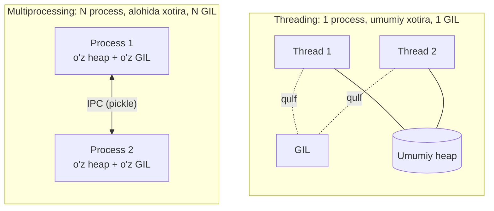
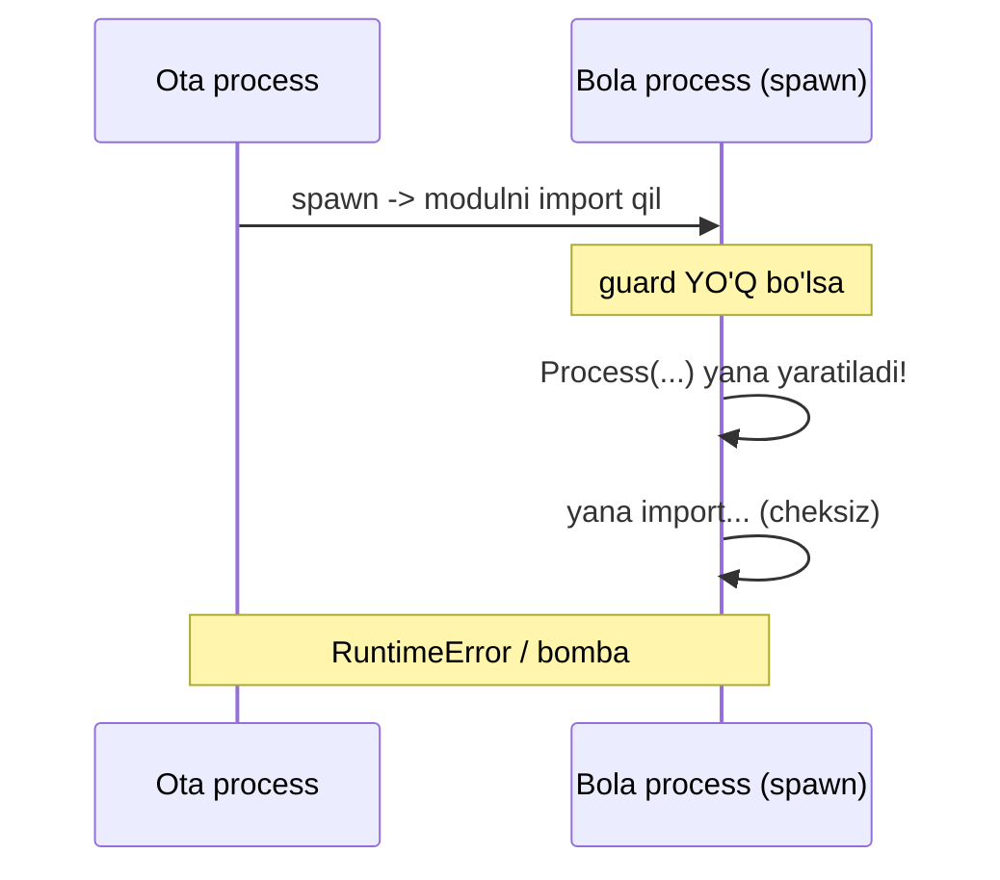

# 10. Multiprocessing

## Hook — GIL devoriga urilding, endi nima?

O'tgan darsda ko'rding: 4 ta CPU-bound thread Python'da **sekinroq** ishladi. GIL
ikkinchi yadroni band qilishga yo'l bermadi. Bu ML uchun jiddiy muammo — sen katta
datasetni preprocessing qilmoqchisan, 8 yadroli mashinang bor, lekin Python bittasini
ishlatyapti.

Go'da bunday muammo yo'q: goroutine'lar 8 yadroga tarqaladi, tamom. Python'da yechim
boshqacha va u seni Go'dan ko'proq "past darajaga" — OS process'lariga olib tushadi.

Bu dars: **agar bir jarayonda faqat bitta thread ishlay olsa, unda ko'p jarayon
ochamiz.** Har process — o'z GIL'i, o'z xotirasi bilan. Va bu aynan PyTorch
DataLoader'ning `num_workers` ortidagi mexanizm.

---

## Analogiya — bitta oshxona vs sakkiz oshxona

**Thread modeli:** bitta oshxonada 8 oshpaz, lekin faqat bitta pichoq (GIL). Kim
kesmoqchi bo'lsa, pichoq navbatini kutadi. 8 oshpaz — bitta pichoq tezligi.

**Process modeli:** 8 ta **alohida oshxona**, har birida o'z pichog'i (o'z GIL'i), o'z
mahsulotlari (o'z xotirasi). Endi 8 oshpaz haqiqatan parallel kesadi. 8x tezlik.

> **Analogiya chegarasi:** alohida oshxonalar orasida mahsulot uzatish qimmat — uni
> qadoqlab (pickle qilib), koridordan (IPC) olib borish kerak. Bitta oshxonada bu
> tekin edi (umumiy stol). Shuning uchun process'lar orasida ma'lumot almashish
> thread'larga qaraganda sekin va cheklangan.

Go'da bunday "alohida oshxona" kerak emas — goroutine'lar bitta oshxonada (bitta
process, umumiy heap) baribir parallel ishlaydi, chunki GIL yo'q.

---

## Sodda ta'rif

> **Process** — o'z mustaqil xotira maydoni, o'z Python interpreter'i va **o'z alohida
> GIL'i** bo'lgan OS jarayoni. Ko'p process = ko'p GIL = haqiqiy CPU parallelizmi.

Thread'lar bitta process ichida xotirani **bo'lishadi**. Process'lar esa xotirani
**bo'lishmaydi** — har biri izolyatsiya qilingan.

---

## Diagramma — thread vs process xotira modeli



Chapda: bir stol, hamma bo'lishadi, lekin bitta qulf hamma ishni serializatsiya qiladi.
O'ngda: har kim o'z stoli va qulfida — parallel, lekin uzatish uchun koridor kerak.

---

## Worked example 1 — birinchi Process

```python
import multiprocessing as mp
import os

# --- 1-qadam: bola process bajaradigan funksiya ---
def worker(name):
    print(f"{name}: PID={os.getpid()}, ota={os.getppid()}")

# --- 2-qadam: guard SHART (pastda tushuntiramiz) ---
if __name__ == "__main__":
    print(f"Asosiy: PID={os.getpid()}")
    p = mp.Process(target=worker, args=("bola",))
    p.start()      # yangi OS process ochadi
    p.join()       # tugashini kutadi
```

Taxminiy output:

```
Asosiy: PID=41200
bola: PID=41201, ota=41200
```

**Notional machine:** `p.start()` OS'dan **yangi jarayon** so'raydi (`fork` yoki
`spawn`). Bu jarayonda alohida Python interpreter ishga tushadi, o'z xotirasi bilan.
`PID` boshqacha ekaniga e'tibor ber — bu haqiqatan boshqa process. Thread'da esa PID
bir xil bo'lardi.

Interfeys `threading.Thread` bilan deyarli bir xil (`Process`, `start`, `join`) —
qasddan shunday qilingan, migratsiya oson bo'lsin uchun.

---

## Worked example 2 — CPU-bound: HAQIQIY tezlik

O'tgan darsdagi ThreadPool bilan yordam bermagan misolni endi ProcessPool bilan
qaytaramiz.

```python
import time
from concurrent.futures import ProcessPoolExecutor

# --- 1-qadam: sof CPU ishi ---
def cpu_task(n):
    total = 0
    for i in range(n):
        total += i * i
    return total

if __name__ == "__main__":
    N = 20_000_000
    # --- 2-qadam: 4 process bilan 4 vazifa ---
    start = time.perf_counter()
    with ProcessPoolExecutor(max_workers=4) as pool:
        list(pool.map(cpu_task, [N] * 4))
    print(f"4 process: {time.perf_counter() - start:.2f}s")
```

Taxminiy output (4 yadroli mashinada):

```
4 process: 1.90s
```

Solishtir: thread bilan 4 ta shunday vazifa ~7.2s bo'lardi (ketma-ket). Process bilan
~1.9s — deyarli 4x. Har process o'z GIL'iga ega, shuning uchun to'rttasi 4 yadroda
haqiqatan parallel ishladi.

> 🤔 **O'ylab ko'r:** `ProcessPoolExecutor(max_workers=100)` qo'ysak, 100 vazifa
> 25x tezroq bo'ladimi (4 yadroda)?

<details>
<summary>💡 Javobni ko'rish</summary>

Yo'q. Yadro soni cheklovchi omil. 4 yadroda bir vaqtda faqat ~4 process haqiqatan
parallel ishlaydi. 100 process ochsang — ular yadro uchun raqobatlashadi, process
yaratish/xotira/kontekst almashish xarajati oshadi va umumiy tezlik **pasayishi**
mumkin. Odatda `max_workers = os.cpu_count()` optimal.

</details>

---

## Pickling chegaralari — nima yuborib bo'lmaydi

Process'lar xotirani bo'lishmaydi, shuning uchun funksiya va argumentlar bola
process'ga **pickle** (seriyalash) orqali yuboriladi. Ba'zi narsalar pickle
bo'lmaydi:

| Pickle bo'ladi | Pickle bo'LMAYDI |
| --- | --- |
| int, str, list, dict, tuple | `lambda` |
| Modul darajasidagi funksiya | Funksiya ichidagi (local/nested) funksiya |
| Modul darajasidagi class instance | Ochiq fayl, socket, DB connection |
| numpy array | Generator, thread, lock |

```python
from concurrent.futures import ProcessPoolExecutor

square = lambda x: x * x        # ⚠️ lambda pickle bo'lmaydi

if __name__ == "__main__":
    with ProcessPoolExecutor() as pool:
        print(list(pool.map(square, [1, 2, 3])))
```

Output:

```
_pickle.PicklingError: Can't pickle <function <lambda> at 0x...>:
attribute lookup <lambda> on __main__ failed
```

**Nega?** Pickle funksiyani baytma-bayt saqlamaydi — u faqat funksiyaning **to'liq
nomini** (modul + nom) saqlaydi, bola process esa uni o'sha nom bilan qayta import
qiladi. `lambda`ning nomi yo'q, local funksiyaning nomi modulda topilmaydi ->
xatolik. Yechim: doim **modul darajasida `def`** bilan e'lon qilingan funksiya ishlat.

Go'da bunday muammo umuman bo'lmaydi — goroutine bitta process ichida ishlaydi, hech
narsa seriyalanmaydi, closure'lar bemalol ishlaydi.

---

## IPC — process'lar qanday gaplashadi (Queue va Pipe)

Process'lar umumiy o'zgaruvchini o'zgartira olmaydi. Ular **Queue** yoki **Pipe**
orqali xabar almashadi. Va bu — Go dasturchisi uchun tanish: **`mp.Queue` = Go
channel'ining process'lararo versiyasi.**

```python
import multiprocessing as mp

# --- 1-qadam: producer navbatga son tashlaydi ---
def producer(q):
    for i in range(3):
        q.put(i)
    q.put(None)          # "tugadi" signali (Go: close(ch) o'rniga)

# --- 2-qadam: consumer navbatdan o'qiydi ---
def consumer(q):
    while (item := q.get()) is not None:
        print(f"olindi: {item}")

if __name__ == "__main__":
    q = mp.Queue()
    p1 = mp.Process(target=producer, args=(q,))
    p2 = mp.Process(target=consumer, args=(q,))
    p1.start(); p2.start()
    p1.join(); p2.join()
```

Output:

```
olindi: 0
olindi: 1
olindi: 2
```

**Notional machine:** `mp.Queue` ichida — pipe + qulf + fon thread. `q.put(i)` obyektni
pickle qiladi, pipe'ga yozadi; `q.get()` o'qiydi va unpickle qiladi. Go channel'da bu
seriyalash yo'q (umumiy xotira), lekin **g'oya bir xil**: "communicate by sharing
messages, not by sharing memory".

**Queue vs Pipe:**

| | `Queue` | `Pipe` |
| --- | --- | --- |
| Yo'nalish | Ko'p producer -> ko'p consumer | 2 uchli (odatda 1<->1) |
| Xavfsizlik | Ichki qulf bilan, ko'p process xavfsiz | Ikki tomon bir vaqtda yozsa ehtiyot bo'l |
| Qulaylik | Yuqori (odatda shuni ishlat) | Past darajali, tezroq |

`None` sentinel — Go'dagi `close(ch)` o'rnini bosadi. Go'da sen `for v := range ch`
yozib, kanal yopilganda to'xtaysan; Python'da `None` (yoki maxsus qiymat) yuborib
"tugadi" deb belgilaysan.

---

## `if __name__ == "__main__"` — nega MAJBURIY

Bu qator ML kodida hamma joyda uchraydi va Go dasturchisini adashtiradi (Go'da `main`
funksiya bor, bunday shart yo'q). Sababi — **spawn semantikasi**.

Bola process yaratishda ikki usul bor:

| Usul | Qanday | Standart platforma |
| --- | --- | --- |
| **fork** | Ota process xotirasi nusxalanadi (copy-on-write) | Linux (3.13 gacha) |
| **spawn** | Toza yangi interpreter, modul qaytadan import qilinadi | macOS, Windows |
| **forkserver** | Toza server process fork qiladi | Linux (Python 3.14+ standart) |

**spawn**'da bola process sening `.py` faylingni **noldan qayta import qiladi**. Agar
`Process(...)` yaratish kodi yuqori darajada (guard'siz) tursa, bola uni import
paytida yana bajaradi -> yana process yaratadi -> **cheksiz rekursiya**.



`if __name__ == "__main__":` guard buni to'xtatadi: bola import qilganda `__name__`
qiymati `"__main__"` EMAS (u modul nomi bo'ladi), shuning uchun guard ichidagi kod
bolada ishga tushmaydi.

> **Oltin qoida:** `multiprocessing` ishlatsang, process yaratuvchi kodni doim
> `if __name__ == "__main__":` ichiga joyla. Bu majburiy odat, ixtiyoriy emas.

---

## Overhead — process arzon emas

Go dasturchisi goroutine'ni deyarli tekin yaratishga o'rgangan (~2 KB, mikrosekundlar).
Process bunday emas:

- Yangi process yaratish millisekundlar oladi (spawn'da yangi interpreter yuklanadi).
- Har process to'liq xotira nusxasiga ega — o'nlab MB.
- Har argument/natija pickle + IPC orqali ko'chadi (seriyalash xarajati).

Shuning uchun: process'ni **mayda, tez-tez** vazifalar uchun ochma. Katta, uzoq,
CPU-og'ir bloklar uchun ishlat. Ko'p mayda vazifa bo'lsa — ularni bo'laklarga
birlashtir (chunking).

---

## ML'ga ko'prik — PyTorch DataLoader `num_workers`

Endi eng amaliy qism. Sen ML'da doim shunday kod ko'rasan:

```python
loader = DataLoader(dataset, batch_size=64, num_workers=8)
```

`num_workers=8` — bu **8 ta alohida process** ochadi (aynan shu darsdagi mexanizm).
Nega process, thread emas?

- Data augmentation (rasm resize, crop, decode) — bu **CPU-bound Python** ishi.
- Thread ishlatsa GIL tufayli parallel bo'lmaydi -> GPU och qoladi (data kutib).
- Process ishlatsa har worker o'z GIL'ida parallel data tayyorlaydi -> GPU to'yadi.

Tayyor batch'lar asosiy process'ga IPC (ko'pincha shared memory) orqali qaytariladi.
`num_workers=0` bo'lsa — data asosiy process'da tayyorlanadi, GPU ko'pincha kutib
qoladi. Mana shuning uchun `num_workers`'ni to'g'ri qo'yish ML training tezligiga
jiddiy ta'sir qiladi.

> 🤔 **O'ylab ko'r:** nega ba'zan `num_workers`'ni oshirish training'ni
> **sekinlashtiradi**?

<details>
<summary>💡 Javobni ko'rish</summary>

Har worker — alohida process (xotira + IPC overhead). Yadro sonidan ko'p worker
ochilsa, ular CPU uchun raqobatlashadi, RAM to'ladi, IPC serializatsiya xarajati oshadi.
Agar data tayyorlash allaqachon GPU'dan tez bo'lsa, qo'shimcha worker faqat overhead
qo'shadi — foyda yo'q, zarar bor.

</details>

---

## Go bilan chuqur solishtirish

| Jihat | Go | Python multiprocessing |
| --- | --- | --- |
| Parallelizm birligi | goroutine (bitta process ichida) | process (alohida) |
| Xotira | Umumiy heap | Alohida heap (izolyatsiya) |
| Yaratish narxi | ~2 KB, mikrosekund | O'nlab MB, millisekund |
| Ma'lumot uzatish | channel (umumiy xotira, tez) | Queue/Pipe (pickle + IPC, sekin) |
| Closure/lambda | Bemalol | Pickle bo'lmaydi (top-level `def` kerak) |
| Parallel CPU uchun kerakmi | Yo'q (goroutine yetadi) | **Ha** (GIL'ni chetlash uchun yagona yo'l) |
| "main guard" | Kerak emas | `if __name__ == "__main__"` shart |

**Asosiy g'oya:** Go bitta process ichida parallelizm beradi (GIL yo'q). Python
haqiqiy CPU parallelizmi uchun seni ko'p process'ga majbur qiladi — bu esa Go'ning
goroutine'idan qimmatroq, cheklangraq va murakkabroq. Buning evaziga process'lar
to'liq izolyatsiya (biri crash bo'lsa, boshqasi tirik) beradi.

---

## Xulosa

- Process = alohida xotira + alohida interpreter + **alohida GIL** -> haqiqiy CPU
  parallelizmi.
- Thread umumiy xotira, process izolyatsiya qilingan xotira.
- CPU-bound ish = `multiprocessing` / `ProcessPoolExecutor` (thread emas).
- Ma'lumot pickle orqali ko'chadi; `lambda` va local funksiya pickle bo'lmaydi.
- IPC: `Queue` (Go channel'ning process versiyasi) va `Pipe`.
- `if __name__ == "__main__"` — spawn cheksiz rekursiyasini to'xtatadi, majburiy.
- Process yaratish qimmat — mayda vazifalar uchun emas, katta bloklar uchun.
- PyTorch DataLoader `num_workers` aynan shu process pool mexanizmi ustiga qurilgan.

## 🧠 Eslab qol

- Ko'p GIL kerak bo'lsa -> ko'p process.
- Process = izolyatsiya + haqiqiy parallelizm, lekin qimmat.
- Argument pickle bo'lishi shart -> `lambda` yo'q, top-level `def` ha.
- `if __name__ == "__main__"` bo'lmasa -> spawn bombasi.
- `num_workers` = DataLoader'dagi process pool.

## ✅ O'z-o'zini tekshir (retrieval practice)

**1.** Nega bir xil CPU-bound vazifa ThreadPool'da sekin, ProcessPool'da tez ishlaydi?

<details>
<summary>Javob</summary>

Thread'lar bitta GIL'ni bo'lishadi -> navbatlashadi, bitta yadro. Process'larning har
biri o'z GIL'iga ega -> bir necha yadroda haqiqatan parallel ishlaydi.

</details>

**2.** `pool.map(lambda x: x*2, data)` nega xatolik beradi va qanday tuzatiladi?

<details>
<summary>Javob</summary>

`lambda` pickle bo'lmaydi (nomi yo'q, bola process uni import orqali topolmaydi).
Yechim: uni modul darajasida `def double(x): return x*2` deb e'lon qilib, `pool.map(double, data)` yozish.

</details>

**3.** `if __name__ == "__main__"` bo'lmasa (spawn platformasida) nima yuz beradi va nega?

<details>
<summary>Javob</summary>

Bola process modulni qayta import qiladi; guard bo'lmasa, import paytida `Process(...)`
yana yaratiladi, u yana import qiladi -> cheksiz rekursiya / RuntimeError. Guard bola
importida `__name__ != "__main__"` bo'lgani uchun bu kodni o'tkazib yuboradi.

</details>

**4.** `mp.Queue` va Go channel qanday o'xshaydi, qanday farq qiladi?

<details>
<summary>Javob</summary>

O'xshashligi: ikkalasi ham "xotirani bo'lishma, xabar yubor" prinsipini amalga oshiradi,
producer/consumer'ni bog'laydi. Farqi: `mp.Queue` obyektlarni pickle qilib IPC orqali
ko'chiradi (sekinroq), Go channel esa umumiy xotirada pointer uzatadi (seriyalashsiz, tez).

</details>

## 🛠 Amaliyot

**1. Oson (Modify):** `worker(name)` misolini o'zgartir: 3 ta process och (nomlari
"A", "B", "C"), har biri o'z PID'ini chop etsin. PID'lar har xil ekanini tasdiqla.

<details>
<summary>Hint</summary>

`for name in ["A","B","C"]:` ichida `Process` yaratib listga yig', keyin alohida
sikllarda `start()` va `join()`. Hammasi guard ichida.

</details>

**2. O'rta (faded example):** ProcessPool bilan parallel yig'indi. To'ldir:

```python
from concurrent.futures import ProcessPoolExecutor

def partial_sum(rng):
    # TODO: rng = (start, end); shu oraliqdagi sonlar yig'indisini qaytar
    pass

if __name__ == "__main__":
    ranges = [(0, 250_000), (250_000, 500_000),
              (500_000, 750_000), (750_000, 1_000_000)]
    with ProcessPoolExecutor(max_workers=4) as pool:
        parts = list(pool.map(partial_sum, ranges))
    # TODO: qismlarni birlashtir (umumiy yig'indi)
    print(total)   # 499999500000 bo'lishi kerak
```

<details>
<summary>Hint</summary>

`partial_sum`: `s, e = rng; return sum(range(s, e))`. Birlashtirish: `total = sum(parts)`.

</details>

**3. Qiyin (Make):** Producer/consumer qur. Bitta producer process `mp.Queue`ga 1..20
sonlarini qo'ysin, uchta consumer process ularni olib kvadratini chop etsin. Har
consumer `None` ko'rganda to'xtasin (3 ta `None` yuborish kerakligini unutma).

<details>
<summary>Hint</summary>

Producer 20 sondan keyin 3 marta `q.put(None)` qiladi (har consumer uchun bittadan).
Har consumer `while (x := q.get()) is not None:` sikli bilan ishlaydi.

</details>

## 🔁 Takrorlash

- **Bog'liq oldingi mavzular:** 09. Threading va GIL (nega process kerak bo'ldi),
  08. Collections (`queue` moduli).
- **Keyingi:** 11. Asyncio (IO-bound uchun process/thread'siz yechim).
- **Takrorlash jadvali:** **ertaga** — Queue misolini yoddan qayta yoz; **3 kundan
  keyin** — thread vs process xotira diagrammasini chiz; **1 haftadan keyin** — spawn
  guard'ini nega kerakligini tushuntir.
- **Feynman testi:** kod so'zlarisiz, 3 jumlada tushuntir: "Nega Python'da CPU-bound
  uchun process kerak, uning narxi qanaqa, va bu Go'da nega kerak emas?"
