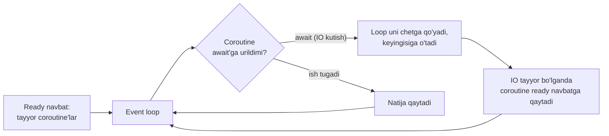
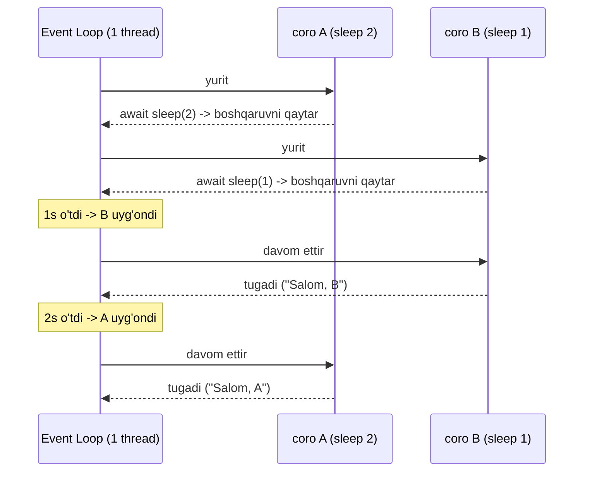
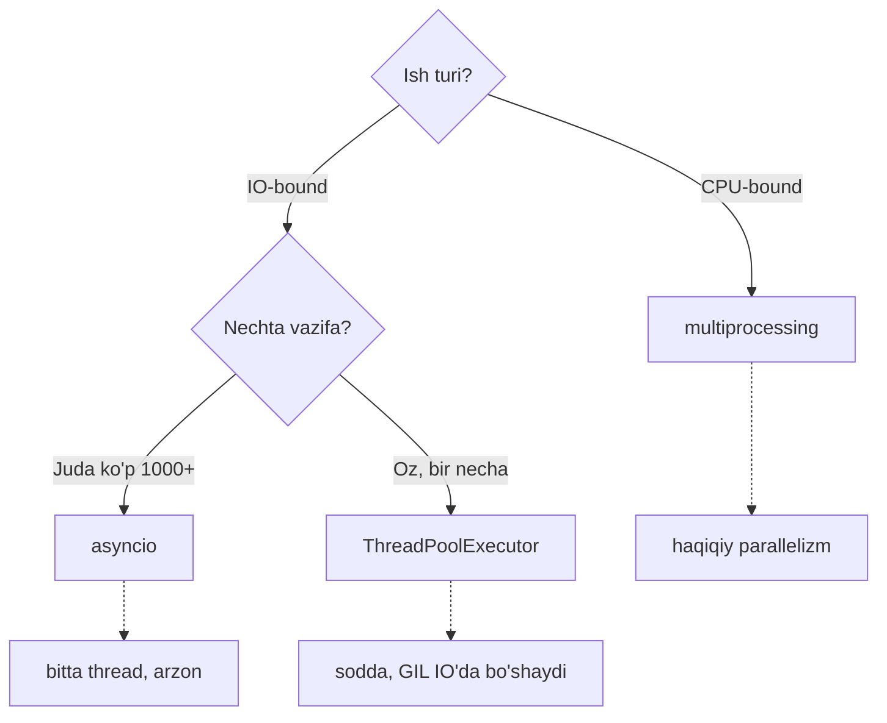

# 11. Asyncio

## Hook — 10 000 ta connection muammosi

Tasavvur qil: web-server yozyapsan, unga bir vaqtda 10 000 mijoz ulanadi. Har biri
sekin tarmoq orqali data kutadi.

Thread yechimi: 10 000 OS thread -> har biri ~1 MB stack -> ~10 GB RAM -> mashina
o'ladi. Process yechimi: bundan ham battar. Ikkalasi ham qulaydi.

Go'da bu muammo yo'q — 10 000 goroutine ochasan, runtime ularni bir necha OS thread
ustida jonglyor qiladi, RAM arzon (~2 KB har goroutine). Python'da esa buning javobi
**asyncio**: bitta thread, bitta process, 10 000 connection. Bu dars aynan shu
sehrni — va uning Go'dan tub farqini ochadi.

---

## Analogiya — bir oshpaz, ko'p taom

Restoran oshxonasida **bitta oshpaz** (bitta thread). U 5 ta taomni "bir vaqtda"
pishirayapti. Sirri: makaron qaynayotganda (IO — kutish), oshpaz qo'l qovushtirib
turmaydi — u boshqa taomni maylab boshlaydi. Makaron tayyor bo'lganda unga qaytadi.

Bitta oshpaz, lekin **kutish paytlarini** ustma-ust qo'yib, ko'p taomni tez chiqaradi.
Bu — **cooperative multitasking**: oshpaz o'zi "hozir kutyapman, boshqasiga o'taman"
deb qaror qiladi.

> **Analogiya chegarasi:** agar bir taom oshpazdan **uzluksiz e'tibor** talab qilsa
> (masalan xamir qorish — CPU ishi, kutish yo'q), oshpaz shunga band bo'lib qoladi va
> qolgan hamma taom **kutib turadi**. Aynan shuning uchun asyncio'da bitta blocking
> yoki CPU-og'ir chaqiruv **butun event loop'ni muzlatadi**.

Go'ning goroutine'i esa boshqacha: u yerda "boshqaruvchi" (runtime) oshpazni istalgan
payt to'xtatib, boshqa ishga o'tkaza oladi (preemptive). Asyncio'da oshpaz o'zi
`await` deganda ixtiyoriy ravishda navbatni bo'shatadi.

---

## Sodda ta'rif

> **Event loop** — bitta thread ichida ko'p **coroutine**'ni navbat bilan yurituvchi
> scheduler. **Coroutine** — `async def` bilan yozilgan, `await` nuqtalarida
> to'xtatib-davom ettirsa bo'ladigan funksiya. **await** — "men kutyapman, boshqaruvni
> loop'ga qaytaraman, boshqasini yurit" degani.

Bitta thread bo'lgani uchun GIL bu yerda muammo emas — baribir hamma narsa bitta
thread'da. Parallelizm yo'q, lekin **concurrency** (kutishlarni overlap qilish) bor.

---

## Diagramma 1 — event loop qanday aylanadi



Diqqat: bu yerda hech qanday thread yoki process yo'q. Bitta ijrochi (loop) doiraviy
tarzda: "kim tayyor? uni yurit. await'ga urildi? chetga qo'y. keyingisi kim?"

---

## Worked example 1 — birinchi coroutine

```python
import asyncio

# --- 1-qadam: coroutine e'lon qilamiz (async def) ---
async def greet(name, delay):
    await asyncio.sleep(delay)     # kutish -> boshqaruv loop'ga qaytadi
    print(f"Salom, {name}")

# --- 2-qadam: KETMA-KET await qilamiz ---
async def main():
    await greet("A", 2)            # A tugaguncha kutamiz
    await greet("B", 1)            # keyin B

# --- 3-qadam: event loop'ni ishga tushiramiz ---
asyncio.run(main())
```

Taxminiy output:

```
Salom, A    (2 sekunddan keyin)
Salom, B    (yana 1 sekunddan keyin — jami 3s)
```

**Notional machine:** `asyncio.run(main())` event loop yaratadi va `main`'ni unga
beradi. `await greet("A", 2)` — "A tugamaguncha davom etma" degani. Shuning uchun bu
kod hali ham **ketma-ket** — jami 3 sekund. `await` o'zi concurrency bermaydi; u faqat
"shu nuqtada kutish mumkin" deb belgilaydi.

Concurrency olish uchun ikki (yoki ko'p) coroutine'ni bir vaqtda "havoga" qo'yish
kerak — buni `gather` qiladi.

---

## Worked example 2 — gather bilan haqiqiy concurrency

```python
import asyncio

async def greet(name, delay):
    await asyncio.sleep(delay)
    print(f"Salom, {name}")

# --- gather: ikkalasini BIR VAQTDA yo'lga soladi ---
async def main():
    await asyncio.gather(
        greet("A", 2),
        greet("B", 1),
    )

asyncio.run(main())
```

Taxminiy output:

```
Salom, B    (1 sekunddan keyin)
Salom, A    (2 sekunddan keyin — jami atigi 2s)
```

Endi jami **2 sekund** (3 emas). `gather` ikkala coroutine'ni loop'ga topshiradi. A
`sleep(2)`da kutayotganda, loop B'ni yuritadi. B'ning `sleep(1)`i avval tugaydi ->
"Salom, B" avval chiqadi.

Bu Go'dagi:

```go
go greet("A", 2)
go greet("B", 1)
// (WaitGroup bilan kutish)
```

ga o'xshaydi — LEKIN muhim farq bor (pastda).

> 🤔 **O'ylab ko'r:** `greet` ichidagi `await asyncio.sleep(delay)`ni oddiy
> `time.sleep(delay)`ga almashtirsak, gather'li versiya necha sekund ishlaydi?

<details>
<summary>💡 Javobni ko'rish</summary>

3 sekund (2 emas)! `time.sleep` — bu **blocking** chaqiruv, u event loop'ni to'liq
muzlatadi. A `time.sleep(2)`da turganda loop B'ni yurita OLMAYDI — chunki boshqaruv
loop'ga qaytmadi. Natijada ketma-ket: 2 + 1 = 3s. Bu keyingi bo'limdagi eng katta
tuzoq.

</details>

---

## create_task — coroutine'ni fon rejimida yo'lga solish

`gather` — bir nechta coroutine'ni birga kutishning qulay yo'li. Lekin ba'zan
coroutine'ni **hoziroq yo'lga solib**, keyinroq kutmoqchisan. Buning uchun
`create_task`:

```python
import asyncio

async def work(name, delay):
    await asyncio.sleep(delay)
    return f"{name} tayyor"

async def main():
    # --- create_task DARHOL loop'ga qo'yadi (Go: go work(...)) ---
    task_a = asyncio.create_task(work("A", 2))
    task_b = asyncio.create_task(work("B", 1))
    print("ikkala task yo'lga solindi")
    # --- endi natijalarni kutamiz ---
    print(await task_b)
    print(await task_a)

asyncio.run(main())
```

Taxminiy output:

```
ikkala task yo'lga solindi
B tayyor    (1s dan keyin)
A tayyor    (2s dan keyin)
```

**Farq:** `create_task` — Go'dagi `go f()`ga eng yaqin narsa. U coroutine'ni fonga
qo'yadi va **darhol** keyingi qatorga o'tadi. `await task_b` esa natijani yig'ib olish
(Go'dagi `<-resultCh` yoki `wg.Wait()`).

`await greet(...)` (task'siz) esa bunday emas — u darhol kutadi, fonga qo'ymaydi.

---

## Diagramma 2 — await boshqaruvni qanday qaytaradi



Butun bu jarayon **bitta** thread'da. Loop faqat kutayotganlarni chetga qo'yib,
tayyorlarini yuritadi. "Parallel" hech narsa yo'q — faqat aqlli navbat.

---

## Eng katta tuzoq — blocking chaqiruv loop'ni muzlatadi

Bu asyncio'dagi eng ko'p uchraydigan va eng og'riqli xato. Go'dan kelgan dasturchi
ayniqsa bunga tushadi, chunki Go'da bu muammo yo'q.

```python
import asyncio
import time

async def bad(name):
    print(f"{name} boshladi")
    time.sleep(2)                  # ⚠️ BLOCKING! butun loop muzlaydi
    print(f"{name} tugadi")

async def main():
    await asyncio.gather(bad("A"), bad("B"))

asyncio.run(main())
```

Taxminiy output (jami ~4 sekund, 2 emas):

```
A boshladi
(2 sekund muzlash — hech narsa bo'lmaydi)
A tugadi
B boshladi
(yana 2 sekund muzlash)
B tugadi
```

**Nega?** Event loop bitta thread. `time.sleep(2)` o'sha yagona thread'ni 2 sekund
band qiladi va boshqaruvni loop'ga **qaytarmaydi**. Loop B'ni yuritmoqchi bo'ladi,
lekin thread band -> hech kim ishlay olmaydi. Natijada concurrency yo'qoladi.

**To'g'risi:**

| Noto'g'ri (blocking) | To'g'ri (async) |
| --- | --- |
| `time.sleep(2)` | `await asyncio.sleep(2)` |
| `requests.get(url)` | `await aiohttp` bilan so'rov |
| `open(f).read()` (katta fayl) | `await aiofiles` bilan o'qish |
| Og'ir CPU sikli | `await loop.run_in_executor(...)` |

> **Oltin qoida:** asyncio'da har bir `async def` ichida faqat **async-aware** yoki
> tez, bloklamaydigan kod bo'lsin. Bitta yashirin `time.sleep` yoki `requests.get`
> butun serveringni muzlatadi.

Go'da esa `time.Sleep` yoki `http.Get` bloklasa — faqat o'sha goroutine bloklanadi,
runtime boshqalarni bemalol yuritaveradi. Mana shuning uchun Go'dan kelganlar bu
tuzoqqa tez-tez tushadi.

---

## Async context manager va async iterator (qisqacha)

`with` va `for`ning async versiyalari bor — ular ichida `await` bo'lgan setup/teardown
uchun.

**Async context manager** (`async with`):

```python
import asyncio

class Timer:
    async def __aenter__(self):                       # await bilan setup
        self.t = asyncio.get_event_loop().time()
        return self
    async def __aexit__(self, *exc):                  # await bilan teardown
        print(f"{asyncio.get_event_loop().time() - self.t:.1f}s")

async def main():
    async with Timer():
        await asyncio.sleep(1)

asyncio.run(main())
```

Output: `1.0s`

**Async iterator** (`async for`) — element olishda `await` kerak bo'lsa (masalan har
element tarmoqdan keladi):

```python
import asyncio

async def stream(n):
    for i in range(n):
        await asyncio.sleep(0.1)     # har element "keladi"
        yield i

async def main():
    async for x in stream(3):
        print(x)

asyncio.run(main())
```

Output:

```
0
1
2
```

Bular ML'da async data streaming, async DB driverlar (masalan `asyncpg`) bilan
ishlaganda uchraydi.

---

## Go bilan tub farq — bu darsning yuragi

Yuqorida ko'p bor eslatdim; endi bir joyga jamlaymiz. Bu Go dasturchisi uchun eng
muhim tushuncha.

| Jihat | Go goroutine | Python asyncio coroutine |
| --- | --- | --- |
| Concurrency modeli | **Preemptive** (runtime qaror qiladi) | **Cooperative** (`await` qaror qiladi) |
| Almashinuv nuqtasi | Runtime istalgan joyda to'xtatadi | Faqat `await`da |
| Blocking chaqiruv ta'siri | Faqat shu goroutine bloklanadi, boshqalar ishlaydi | **Butun loop muzlaydi** |
| Parallelizm | Ha (GOMAXPROCS yadrolar) | Yo'q (bitta thread) |
| Sintaksis | Oddiy funksiya + `go` | `async def` + `await` (function coloring) |
| Aloqa | channel | `asyncio.Queue` |
| Kutubxonalar | Har standart kutubxona ishlaydi | Async-aware kerak (`aiohttp`, `asyncpg`) |

**Ikki eng katta amaliy farq:**

**1. Function coloring.** Go'da funksiya funksiya — istalganini `go` bilan ishga
tushirasan. Python'da funksiyalar "ranglangan": `async def` faqat boshqa `async def`
ichidan `await` bilan chaqiriladi. Oddiy funksiyani `await` qila olmaysan, coroutine'ni
oddiy chaqirsang — u **ishlamaydi**, faqat coroutine obyekt qaytaradi.

```python
async def foo():
    return 42

result = foo()          # ⚠️ ishlamaydi!
print(result)           # <coroutine object foo at 0x...>
# to'g'risi: result = await foo()  (async kontekstda)
```

**2. Blocking'ni runtime yashirmaydi.** Go'da `conn.Read()` bloklaganday ko'rinadi,
lekin runtime uni sirtdan non-blocking qilib, boshqa goroutine'ni yuritadi. Python'da
`await` yozishni **sen** eslashing shart, va blocking kutubxona ishlatsang, hech kim
seni qutqarmaydi — loop muzlaydi.

---

## Yakuniy qaror jadvali — qachon nima?

Uch darsning (09, 10, 11) yakuniy sintezi. Bu jadvalni yodla:

| Vaziyat | To'g'ri tanlov | Nega |
| --- | --- | --- |
| **IO-bound, ko'p connection** (1000+, tarmoq/web) | **asyncio** | Bitta thread, arzon, minglab kutish overlap bo'ladi |
| **IO-bound, oz vazifa** (bir necha fayl/so'rov) | **threads** (`ThreadPoolExecutor`) | Soddaroq, async kutubxona shart emas, GIL IO'da bo'shaydi |
| **CPU-bound** (hisob, preprocessing) | **multiprocessing** | Har process o'z GIL'i -> haqiqiy yadro parallelizmi |
| **Blocking kutubxona + async kerak** | asyncio + `run_in_executor` | Blocking kodni alohida thread/process'ga chiqarib, loop'ni muzlatmaslik |



> **Oltin qoida (uch darsning xulosasi):** CPU-bound -> process. IO-bound, ko'p ->
> asyncio. IO-bound, oz -> thread. Blocking kodni asyncio ichida `run_in_executor`
> bilan izolyatsiya qil.

---

## Xulosa

- **Event loop** — bitta thread'da coroutine'larni navbat bilan yurituvchi scheduler.
- **Coroutine** = `async def`; **await** = "kutyapman, boshqaruvni loop'ga qaytar".
- `await greet(...)` ketma-ket kutadi; concurrency uchun `gather` yoki `create_task`.
- `create_task` — Go'dagi `go f()`ga eng yaqin (fonga qo'yadi).
- Blocking chaqiruv (`time.sleep`, `requests`) **butun loop'ni muzlatadi** — eng katta tuzoq.
- `async with` / `async for` — setup/teardown yoki iteratsiyada `await` kerak bo'lganda.
- Go: preemptive, blocking'ni runtime yashiradi; asyncio: cooperative, `await`ni sen yozasan.
- Qaror: CPU-bound -> process, IO ko'p -> asyncio, IO oz -> thread.

## 🧠 Eslab qol

- asyncio = bitta thread + cooperative multitasking.
- `await` bo'lmasa, boshqa coroutine ishlay olmaydi.
- Bitta blocking chaqiruv butun loop'ni o'ldiradi.
- Go = preemptive (runtime), asyncio = cooperative (await).
- Function coloring: `async def`ni faqat `await` bilan chaqir.

## ✅ O'z-o'zini tekshir (retrieval practice)

**1.** `await greet("A", 2)` va `asyncio.gather(greet("A",2), greet("B",1))` — nega
biri 3s, ikkinchisi 2s?

<details>
<summary>Javob</summary>

Ketma-ket `await` A tugamaguncha B'ni boshlamaydi (2+1=3s). `gather` ikkalasini birga
loop'ga topshiradi; A kutayotganda B ishlaydi, kutishlar overlap bo'ladi -> eng uzuni
= 2s.

</details>

**2.** Nega `time.sleep(2)` asyncio coroutine ichida falokat, `asyncio.sleep(2)` esa
yo'q?

<details>
<summary>Javob</summary>

`time.sleep` yagona thread'ni bloklaydi va boshqaruvni loop'ga qaytarmaydi -> loop
boshqa coroutine'ni yurita olmaydi, hammasi muzlaydi. `asyncio.sleep` esa await'ga
uriladi, boshqaruvni loop'ga qaytaradi -> loop shu payt boshqalarini yuritadi.

</details>

**3.** Go goroutine'da blocking chaqiruv boshqa goroutine'larni to'xtatmaydi, asyncio'da
esa to'xtatadi. Nega?

<details>
<summary>Javob</summary>

Go runtime preemptive va bir necha OS thread ustida ishlaydi — bir goroutine bloklansa,
runtime boshqasini boshqa thread/yadroda yuritadi. asyncio bitta thread'da cooperative
— boshqaruv faqat `await`da o'tadi; blocking chaqiruv await bermaydi, shuning uchun
yagona thread band bo'lib qoladi.

</details>

**4.** `foo()` (async funksiya) ni oddiy chaqirsang nima qaytadi va nega?

<details>
<summary>Javob</summary>

Coroutine obyekt qaytadi, kod ishlamaydi. `async def` chaqirilishi darhol
bajarilmaydi — u faqat coroutine obyekt yaratadi. Ishlashi uchun uni `await` qilish
yoki loop'ga (`asyncio.run`/`create_task`) topshirish kerak.

</details>

## 🛠 Amaliyot

**1. Oson (Modify):** `greet` misolini uch coroutine bilan ishlat (A=3, B=1, C=2) va
`gather` bilan yurit. Qaysi tartibda chop etilishini oldindan ayt, keyin tekshir.

<details>
<summary>Hint</summary>

Chiqish tartibi delay bo'yicha: B (1s), C (2s), A (3s). Jami vaqt = eng uzuni = 3s.

</details>

**2. O'rta (faded example):** Blocking tuzog'ini tuzat. Skeletni to'ldir:

```python
import asyncio

async def download(name, size):
    print(f"{name} yuklanmoqda")
    # TODO: size sekund KUTISH (blocking BO'LMAGAN yo'l bilan)
    print(f"{name} tayyor ({size}s)")

async def main():
    # TODO: 3 ta download'ni BIR VAQTDA yurit: ("A",3), ("B",1), ("C",2)
    pass

asyncio.run(main())
```

<details>
<summary>Hint</summary>

Kutish: `await asyncio.sleep(size)`. Birga yurish: `await asyncio.gather(download("A",3), download("B",1), download("C",2))`.

</details>

**3. Qiyin (Make):** Noldan yoz: `asyncio.Queue` bilan producer/consumer. Bitta
producer coroutine 0..9 sonlarini navbatga qo'ysin (har biri orasida
`await asyncio.sleep(0.1)`), ikkita consumer coroutine ularni olib kvadratini chop
etsin. Producer tugagach consumer'lar to'xtasin. `create_task` va `queue.join()`dan
foydalan.

<details>
<summary>Hint</summary>

Consumer: `while True: item = await q.get(); ...; q.task_done()`. Producer tugagach
`await q.join()`, keyin consumer task'larni `cancel()` qil. `asyncio.Queue.get`
await'ni beradi, shuning uchun loop muzlamaydi.

</details>

## 🔁 Takrorlash

- **Bog'liq oldingi mavzular:** 09. Threading va GIL (IO'da GIL bo'shashi),
  10. Multiprocessing (CPU-bound yechimi), 01. Iterator va Generator (`async for`
  generator ustiga quriladi).
- **Takrorlash jadvali:** **ertaga** — blocking vs `asyncio.sleep` tuzog'ini yoddan
  tushuntir; **3 kundan keyin** — Go goroutine vs asyncio jadvalini tikla; **1 haftadan
  keyin** — "qachon nima?" qaror jadvalini yoddan chiz.
- **Feynman testi:** kod so'zlarisiz, 3 jumlada tushuntir: "Event loop nima, `await`
  nima qiladi, va nega bitta `time.sleep` butun serverni muzlatadi?"
