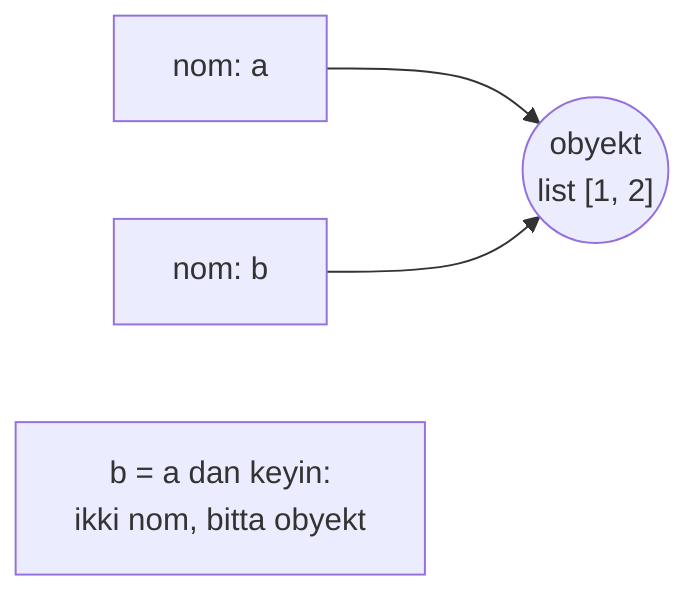
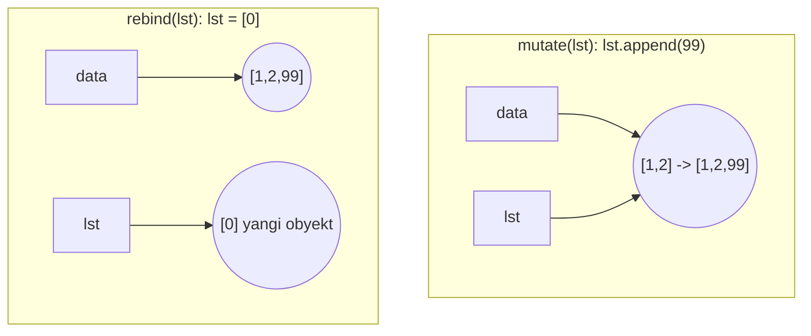
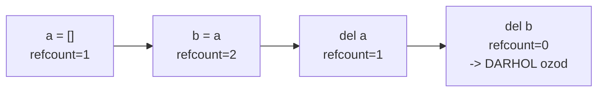

# 12. Memory model va GC

## Hook — bir qatorlik kod, ikki xil natija

Go'da bu senga aniq:

```go
a := []int{1, 2}
b := a
b = append(b, 3)   // a odatda hali [1, 2]
```

Endi Python'da xuddi shunday tuyulgan kod:

```python
a = [1, 2]
b = a
b.append(3)
print(a)           # [1, 2, 3]  <- a HAM o'zgardi!
```

Nega `a` o'zgardi? Sen hech qachon `a`ga tegmading. Sabab — Python'ning **xotira
modeli** Go'nikidan tubdan boshqa. Bu darsda o'zgaruvchi aslida nima, argument qanday
uzatiladi, va Python xotirani qanday tozalaydi (GC) — hammasini Go bilan yonma-yon
ko'ramiz. Bu tuzoqlar ML kodida (tensor, list, config) doim uchraydi.

---

## Analogiya — o'zgaruvchi = yopishtiruvchi yorliq

Go'da o'zgaruvchini **quti** deb tasavvur qil: `a := 5` — "a" degan quti ichida 5
raqami yotibdi. `b := a` — yangi quti, ichiga 5 nusxalanadi. Ikki alohida quti.

Python'da o'zgaruvchi **quti emas, yorliq** (label / sticky note). `a = [1, 2]` —
biror joyda `[1, 2]` obyekti bor, "a" yorlig'i unga yopishtirilgan. `b = a` — **yangi
obyekt yaratmaydi**, faqat "b" yorlig'ini **o'sha obyektga** yopishtiradi. Endi ikki
yorliq bitta obyektni ko'rsatadi.

> **Analogiya chegarasi:** Go'da ham pointer bor (`b := &a`) — u yerda ham "yorliq"
> mavjud. Farqi shundaki, Go'da sen tanlaysan (value yoki pointer), Python'da esa
> **doim** yorliq — tanlov yo'q. Har o'zgaruvchi obyektga reference, hech qachon
> obyektning o'zi emas.

---

## Sodda ta'rif

> Python'da **hamma narsa obyekt** (hatto `int` ham). O'zgaruvchi qiymatni saqlamaydi
> — u obyektga **nom (reference)** beradi. Bir obyektga bir necha nom yopishishi mumkin.

---

## Diagramma 1 — nom va obyekt



`b = a` obyektni **nusxalamadi** — u faqat "b" nomini o'sha bitta list'ga yo'naltirdi.
Shuning uchun birini o'zgartirish (mutation) ikkinchisida ko'rinadi.

---

## Worked example 1 — id() va is bilan isbot

```python
# --- 1-qadam: ikki nom, bitta obyekt ---
a = [1, 2, 3]
b = a
b.append(4)
print(a)              # [1, 2, 3, 4] -> a ham o'zgardi

# --- 2-qadam: bir xil obyektmi? id() va is ---
print(a is b)         # True -> aynan bitta obyekt
print(id(a) == id(b)) # True -> xotira "manzili" bir xil

# --- 3-qadam: yangi obyekt yaratsak ---
c = [1, 2, 3, 4]
print(a == c)         # True  -> qiymatlari teng
print(a is c)         # False -> lekin boshqa obyekt
```

Output:

```
[1, 2, 3, 4]
True
True
True
False
```

**Notional machine:** `id(x)` — obyektning xotiradagi identifikatori (CPython'da —
manzil). `is` — **aynan bitta obyektmi** deb tekshiradi (id'larni solishtiradi). `==`
esa **qiymatlar tengmi** deb tekshiradi. Bu farq juda muhim: `a == c` True (bir xil
tarkib), lekin `a is c` False (boshqa obyekt).

Go analogiyasi: `is` — bu `&a == &b` (pointerlar teng), `==` — bu qiymat tengligi.

---

## Hamma narsa obyekt — int ham

Go'da `int` — primitiv, metodi yo'q. Python'da `int` ham to'laqonli obyekt:

```python
x = 42
print(type(x))            # <class 'int'>
print(x.bit_length())     # 6   -> int'da metod bor!
print(isinstance(x, object))  # True
print((42).__add__(8))    # 50  -> + aslida metod chaqiruvi
```

Output:

```
<class 'int'>
6
True
50
```

Har son, funksiya, class — hammasi heap'dagi obyekt, ichida refcount va type
ma'lumoti bilan. Bu Python'ning sekinligining (va moslashuvchanligining) tub sababi:
`42` ham xotirada to'liq obyekt, Go'dagi 8-baytli qiymat emas.

---

## Mutability — o'zgartirilishi mumkinmi?

Yuqoridagi tuzoq faqat **mutable** (o'zgartiriladigan) obyektlarda yuz beradi. Bu
jadvalni yodla — u keyingi hamma narsaning kaliti:

| Immutable (o'zgarmas) | Mutable (o'zgaruvchan) |
| --- | --- |
| `int`, `float`, `bool`, `complex` | `list` |
| `str` | `dict` |
| `tuple` | `set` |
| `frozenset` | `bytearray` |
| `bytes` | custom class (odatda) |

**Immutable**'ni "o'zgartirsang", aslida **yangi obyekt** yaratasan:

```python
s = "salom"
print(id(s))
s += " dunyo"       # yangi string obyekt yaratadi
print(id(s))        # boshqa id -> eski o'zgarmadi, yangisi yasaldi
```

Output (id'lar har xil):

```
140234...800
140234...960
```

Shuning uchun `a = 5; b = a; b += 1` da `a` o'zgarmaydi — `int` immutable, `b += 1`
yangi `6` obyektiga yorliq qo'yadi. Lekin `list`da mutation eski obyektni o'zgartiradi.

---

## Funksiya argumentlari — "pass by object reference"

Bu Go dasturchisi uchun eng chalkash qism. Python "pass by value" ham, "pass by
reference" ham EMAS. U **"pass by object reference"** (yoki "call by sharing").

Ma'nosi: funksiyaga obyektning o'zi ham, uning nusxasi ham emas — **o'sha obyektga
reference** uzatiladi (parametr nomi o'sha obyektga yopishtiriladi).

```python
def mutate(lst):
    lst.append(99)       # obyektni O'ZGARTIRADI -> tashqarida ko'rinadi

def rebind(lst):
    lst = [0]            # nomni YANGI obyektga bog'laydi -> tashqarida ko'rinmaydi

data = [1, 2]
mutate(data)
print(data)              # [1, 2, 99]  <- o'zgardi

rebind(data)
print(data)              # [1, 2, 99]  <- o'zgarmadi!
```

Output:

```
[1, 2, 99]
[1, 2, 99]
```

**Notional machine:** chaqirilganda `lst` nomi `data` ko'rsatgan **aynan o'sha** list'ga
yopishtiriladi.

- `mutate`: `lst.append(99)` — o'sha obyektni joyida o'zgartiradi -> `data` ko'radi.
- `rebind`: `lst = [0]` — `lst` nomini **yangi** obyektga ko'chiradi; `data` hamon eski
  obyektni ko'rsatib turadi -> o'zgarmaydi.

---

## Diagramma 2 — mutate vs rebind



Chapda ikki nom bitta obyektni ko'rsatadi -> o'zgarish umumiy. O'ngda `lst` yangi
obyektga uzildi -> `data` ta'sirlanmaydi.

**Go bilan aniq solishtirish:**

| Holat | Go | Python |
| --- | --- | --- |
| Value uzatish | `func f(x int)` — nusxa, tashqarida ko'rinmaydi | Immutable (int) da xuddi shunday tuyuladi |
| Pointer uzatish | `func f(x *T)` — `*x = ...` tashqarida ko'rinadi | Mutable obyekt mutation — tashqarida ko'rinadi |
| Pointer'ni qayta bog'lash | `x = &other` — tashqarida ko'rinmaydi | `lst = [0]` — tashqarida ko'rinmaydi |

Ya'ni Python **doim Go'ning pointer uzatishiga o'xshaydi** (reference nusxasi), lekin
sen o'zgaruvchi orqali "pointee"ni butunlay almashtira olmaysan (faqat mutation qila
olasan yoki lokal nomni qayta bog'laysan).

---

## Mutable default argument — klassik tuzoq (chuqur)

Endi eng mashhur Python tuzog'ini xotira modeli bilan **chuqur** tushunamiz.

```python
def add_item(item, bucket=[]):     # ⚠️ tuzoq!
    bucket.append(item)
    return bucket

print(add_item(1))    # [1]
print(add_item(2))    # [1, 2]  <- kutilmagan! avvalgi ro'yxat saqlanib qoldi
print(add_item(3))    # [1, 2, 3]
```

Output:

```
[1]
[1, 2]
[1, 2, 3]
```

**Nega?** Default qiymat funksiya **e'lon qilinganda BIR MARTA** hisoblanadi va
funksiya obyekti ichida saqlanadi — har chaqiruvda qaytadan yaratilmaydi:

```python
print(add_item.__defaults__)     # ([1, 2, 3],) -> o'sha bir list saqlanib turibdi
```

Ya'ni `bucket` har chaqiruvda **aynan o'sha** list'ga yopishadi. Mutable bo'lgani
uchun har `append` o'sha obyektni to'ldiraveradi.

**To'g'ri yechim** — sentinel `None`:

```python
def add_item(item, bucket=None):
    if bucket is None:
        bucket = []              # har chaqiruvda YANGI list
    bucket.append(item)
    return bucket

print(add_item(1))    # [1]
print(add_item(2))    # [2]  <- endi to'g'ri
```

Output:

```
[1]
[2]
```

> 🤔 **O'ylab ko'r:** `def f(x, cache={})` bilan yozilgan funksiya bir chaqiruvda
> `cache`ga kalit qo'shsa, keyingi chaqiruvda o'sha kalit turadimi?

<details>
<summary>💡 Javobni ko'rish</summary>

Ha, turadi. `cache={}` ham default qiymat sifatida bir marta yaratiladi va funksiya
obyektida saqlanadi. Har chaqiruvda o'sha bitta dict ishlatiladi -> qo'shilgan kalitlar
saqlanib qoladi. (Ba'zan buni ataylab "memoization" uchun ishlatishadi, lekin bu
noaniq — ochiq `None` sentinel afzal.)

</details>

---

## Shallow vs deep copy

Obyektni **haqiqatan nusxalash** kerak bo'lsa, `copy` moduli. Lekin ichma-ich
strukturada muhim farq bor.

```python
import copy

original = [[1, 2], [3, 4]]
shallow = copy.copy(original)        # tashqi list yangi, ICHKILAR bo'lishilgan
deep = copy.deepcopy(original)       # hammasi to'liq nusxa

original[0].append(99)               # ichki list'ni o'zgartiramiz

print(original)   # [[1, 2, 99], [3, 4]]
print(shallow)    # [[1, 2, 99], [3, 4]]  <- ichki o'zgarish yetib bordi!
print(deep)       # [[1, 2], [3, 4]]      <- to'liq mustaqil
```

Output:

```
[[1, 2, 99], [3, 4]]
[[1, 2, 99], [3, 4]]
[[1, 2], [3, 4]]
```

**Farqi:**

| | `copy.copy` (shallow) | `copy.deepcopy` (deep) |
| --- | --- | --- |
| Tashqi konteyner | Yangi nusxa | Yangi nusxa |
| Ichki obyektlar | **Bo'lishiladi** (reference) | Rekursiv nusxalanadi |
| Tezlik | Tez | Sekin (chuqur yuradi) |
| Cycle bo'lsa | Muammo yo'q | `deepcopy` cycle'ni kuzatadi, hal qiladi |

ML'da bu muhim: config dict yoki nested list'ni `deepcopy`siz nusxalasang, bir
eksperiment ikkinchisining ichki ma'lumotini buzishi mumkin.

---

## Reference counting + cycle detector (GC)

Python obyektni qachon xotiradan tozalaydi? Ikki mexanizm birga ishlaydi.

**1. Reference counting (asosiy).** Har obyekt ichida `ob_refcnt` hisoblagichi bor.
Reference qo'shilsa +1, o'chsa -1. **Nol** bo'lganda obyekt **darhol** ozod qilinadi.

```python
import sys

a = []
print(sys.getrefcount(a))    # 2  (bittasi 'a', bittasi getrefcount argumenti)

b = a
print(sys.getrefcount(a))    # 3  (a, b, argument)

del b
print(sys.getrefcount(a))    # 2  (yana a va argument)
```

Output:

```
2
3
2
```

**Nega `getrefcount` doim +1 ko'rsatadi?** Chunki obyektni argument qilib uzatganingda
vaqtincha yana bitta reference (funksiya parametri) yaratiladi. Shuning uchun bo'sh
list uchun 1 emas, 2 chiqadi.



**2. Cycle detector (qo'shimcha).** Reference counting bitta holatni hal qila olmaydi:
**reference cycle** (aylana). Ikki obyekt bir-birini ko'rsatsa, refcount hech qachon
nolga tushmaydi:

```python
import gc

class Node:
    def __init__(self):
        self.ref = None

a = Node()
b = Node()
a.ref = b            # a -> b
b.ref = a            # b -> a  (aylana!)

del a, b             # nomlar o'chdi, lekin obyektlar bir-birini ko'rsatadi
                     # refcount hali > 0 -> ozod bo'lmaydi
print(gc.collect())  # cycle detector aylanani topib ozod qiladi
```

Output (taxminan):

```
4
```

`gc.collect()` — generational mark-sweep cycle detector'ni ishga soladi. U
"tashqaridan hech kim ko'rsatmayotgan, faqat bir-birini ushlab turgan" obyektlar
guruhini topib tozalaydi.

---

## Go GC bilan chuqur solishtirish

| Jihat | Go GC | CPython GC |
| --- | --- | --- |
| Asosiy mexanizm | Tricolor concurrent **mark-sweep** | **Reference counting** |
| Aylanalar (cycles) | Mark-sweep o'zi hal qiladi | Alohida **cycle detector** (generational) |
| Qachon ozod bo'ladi | GC sikli kelganda (kechikish bilan) | refcount 0 bo'lganda **darhol** (deterministik) |
| Pauza | Juda past (concurrent, <1ms) | refcount = pauzasiz; cycle collector qisqa pauza |
| Determinizm | Deterministik emas | Ko'p obyekt deterministik ozod bo'ladi; aylanalar emas |
| Dasturchi ta'siri | GC'ni deyarli sezmaysan | `__del__`, `with` ko'pincha aniq vaqtda ishlaydi |

**Eng muhim farq:** Go'da obyekt qachon ozod bo'lishi noaniq — keyingi GC siklini
kutasan. CPython'da **ko'pchilik obyektlar refcount 0 bo'lishi bilan darhol** ozod
bo'ladi. Shuning uchun `with open(...) as f:` blokidan chiqqanda fayl **aniq** yopiladi
(refcount 0). Bu Go'ning `defer`iga o'xshaydi, lekin mexanizmi butunlay boshqa.

Salbiy tomoni: har amalning refcount'ni yangilashi (har `+=`, har uzatish) doimiy
kichik xarajat — bu Go'ning tez heap'iga qaraganda Python'ni sekinlashtiruvchi
omillardan biri (va aynan shu GIL'ni zarur qilgan, 09-darsni esla).

---

## Interning — `==` va `is` kutilmagan natijalari

CPython ba'zi obyektlarni **cache** qiladi (interning) — tezlik uchun. Bu `is` bilan
kutilmagan natijalar beradi.

```python
# --- 1-qadam: kichik int'lar cache'langan (-5 dan 256 gacha) ---
a = 256
b = 256
print(a is b)     # True  -> bir xil cache'langan obyekt

x = 257
y = 257
print(x is y)     # False -> cache tashqarisida, alohida obyekt

# --- 2-qadam: string interning ---
s1 = "salom"
s2 = "salom"
print(s1 is s2)   # True  -> identifikatorga o'xshash literallar intern bo'ladi

s3 = "salom dunyo!"
s4 = "salom dunyo!"
print(s3 is s4)   # ko'pincha False -> probel/belgi bor -> avtomatik intern emas
```

Output (implementatsiyaga bog'liq):

```
True
False
True
False
```

**Nega?** CPython -5..256 oralig'idagi `int`larni oldindan yaratib qo'yadi (juda
tez-tez ishlatiladi). 257 esa har safar yangi obyekt. Stringlarda: identifikator kabi
ko'rinadigan literallar (harf/raqam/`_`) avtomatik intern qilinadi, probelli/belgili
matnlar odatda emas.

> **Oltin qoida:** qiymat tengligini **doim `==`** bilan tekshir. `is` faqat
> **identiklik** uchun (ayniqsa `x is None`). `if x is 257` yozma — bu implementatsiya
> tafsilotiga bog'liq va sindiradi.

Go'da bunday tuzoq yo'q: `==` qiymatni solishtiradi, `is` degan operator umuman yo'q,
pointer tengligini `p1 == p2` bilan aniq va oshkora tekshirasan.

---

## Xulosa

- Python'da **hamma narsa obyekt**, o'zgaruvchi = obyektga **nom (reference)**.
- `is`/`id()` — aynan bitta obyektmi; `==` — qiymatlar tengmi. Aralashtirmang.
- **Mutable** (list, dict, set) mutation umumiy ko'rinadi; **immutable** "o'zgarishi" yangi obyekt.
- Argument uzatish = **pass by object reference**: mutation ko'rinadi, rebind ko'rinmaydi.
- Mutable default argument bir marta yaratiladi -> chaqiruvlar orasida saqlanadi (sentinel `None` ishlat).
- `copy.copy` ichkilarni bo'lishadi; `copy.deepcopy` to'liq mustaqil nusxa.
- GC: **reference counting** (darhol, deterministik) + **cycle detector** (aylanalar uchun).
- Interning tufayli kichik int va oddiy string literallar `is` bilan True chiqishi mumkin — `==` ishlat.

## 🧠 Eslab qol

- O'zgaruvchi = yorliq, quti emas.
- `is` = bir xil obyekt; `==` = bir xil qiymat.
- Mutation tashqarida ko'rinadi, rebind ko'rinmaydi.
- Mutable default = bir marta yaratiladi (tuzoq).
- CPython: refcount 0 -> darhol ozod; aylanalar -> cycle detector.

## ✅ O'z-o'zini tekshir (retrieval practice)

**1.** `a = [1,2]; b = a; b.append(3)` dan keyin `a` nima bo'ladi va nega?

<details>
<summary>Javob</summary>

`a` = `[1, 2, 3]`. `b = a` yangi obyekt yaratmaydi, faqat `b` nomini o'sha list'ga
yopishtiradi. `list` mutable, `b.append(3)` o'sha bitta obyektni o'zgartiradi -> `a`
ham ko'radi (`a is b` True).

</details>

**2.** `def f(x=[])` nega tuzoq, va `def f(x=None)` uni qanday hal qiladi?

<details>
<summary>Javob</summary>

Default `[]` funksiya e'lon qilinganda bir marta yaratilib, funksiya obyektida
saqlanadi; har chaqiruvda o'sha bitta list ishlatiladi -> mutation'lar to'planadi.
`x=None` bilan har chaqiruvda `if x is None: x = []` yangi list yaratadi.

</details>

**3.** `a = 256; b = 256; a is b` -> True, lekin `257`da False. Nega, va bunga
tayanish nega xato?

<details>
<summary>Javob</summary>

CPython -5..256 int'larni oldindan cache qiladi (interning), shuning uchun 256 uchun
`is` True. 257 cache tashqarisida -> alohida obyektlar -> False. Bu implementatsiya
tafsiloti; qiymat tengligini doim `==` bilan tekshirish kerak, `is` emas.

</details>

**4.** CPython obyektni qachon ozod qiladi, va bu Go'ning GC'sidan qanday farq qiladi?

<details>
<summary>Javob</summary>

Reference count 0 bo'lganda **darhol** ozod qiladi (deterministik). Faqat reference
cycle'lar uchun alohida generational cycle detector kerak. Go esa tricolor concurrent
mark-sweep bilan ishlaydi — obyekt keyingi GC siklida (kechikish bilan, deterministik
emas) ozod bo'ladi.

</details>

**5.** `copy.copy` va `copy.deepcopy` orasidagi farq nested list'da qanday namoyon
bo'ladi?

<details>
<summary>Javob</summary>

`copy.copy` faqat tashqi konteynerni nusxalaydi, ichki obyektlar bo'lishiladi ->
ichkidagi mutation ikkala nusxada ko'rinadi. `copy.deepcopy` ichkilarni ham rekursiv
nusxalaydi -> to'liq mustaqil, ichki mutation ta'sir qilmaydi.

</details>

## 🛠 Amaliyot

**1. Oson (Modify):** Quyidagini bashorat qil, keyin ishga tushirib tekshir:

```python
a = [1, 2, 3]
b = a
c = a[:]        # slice bilan nusxa
b.append(4)
c.append(5)
print(a, b, c)  # ??? oldindan ayt
```

<details>
<summary>Hint</summary>

`b = a` -> bir xil obyekt (`b.append` `a`ga ta'sir qiladi). `c = a[:]` -> yangi
(shallow) nusxa (`c.append` `a`ga ta'sir qilmaydi). Natija: `a=[1,2,3,4] b=[1,2,3,4] c=[1,2,3,5]`.

</details>

**2. O'rta (faded example):** Mutable default tuzog'ini tuzat:

```python
def append_log(msg, logs=[]):     # TODO: bu tuzoqni tuzat
    logs.append(msg)
    return logs

# TODO: shunday qilki, har chaqiruv MUSTAQIL ro'yxat qaytarsin
print(append_log("a"))   # ['a'] bo'lishi kerak
print(append_log("b"))   # ['b'] bo'lishi kerak (['a','b'] EMAS)
```

<details>
<summary>Hint</summary>

`logs=None` qil, funksiya boshida `if logs is None: logs = []`.

</details>

**3. Qiyin (Make):** Noldan yoz: `is_shared(x, y)` funksiya — ikki argument **aynan
bitta** obyektni ko'rsatsa True qaytarsin (mutation birida ikkinchisiga ta'sir
qiladimi). Keyin nested dict uchun `safe_copy(d)` yoz — chaqiruvchi orqaga qaytgan
nusxani o'zgartirsa, original **hech qachon** buzilmasin. Uch xil kirish bilan sina:
oddiy dict, nested dict, cycle bo'lgan struktura.

<details>
<summary>Hint</summary>

`is_shared`: `return x is y`. `safe_copy`: `import copy; return copy.deepcopy(d)` —
`deepcopy` cycle'ni ham to'g'ri hal qiladi. Sinovda: `orig = {"k": [1,2]}; c = safe_copy(orig); c["k"].append(9)` -> `orig["k"]` o'zgarmasligini tekshir.

</details>

## 🔁 Takrorlash

- **Bog'liq oldingi mavzular:** 09. Threading va GIL (refcount'ni himoya qilish GIL
  sababi), 06. Data model (`__slots__`, obyekt ichki tuzilishi), 05. OOP chuqur
  (hamma narsa obyekt).
- **Takrorlash jadvali:** **ertaga** — `mutate` vs `rebind` diagrammasini yoddan chiz;
  **3 kundan keyin** — mutable default tuzog'ini yoddan tushuntir; **1 haftadan keyin**
  — Go GC vs CPython GC jadvalini tikla.
- **Feynman testi:** kod so'zlarisiz, 3 jumlada tushuntir: "Python'da o'zgaruvchi nima,
  nega `b = a` dan keyin ikkalasi birga o'zgaradi, va CPython obyektni qachon
  tozalaydi?"
