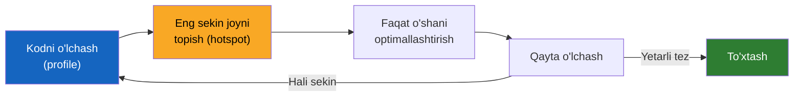
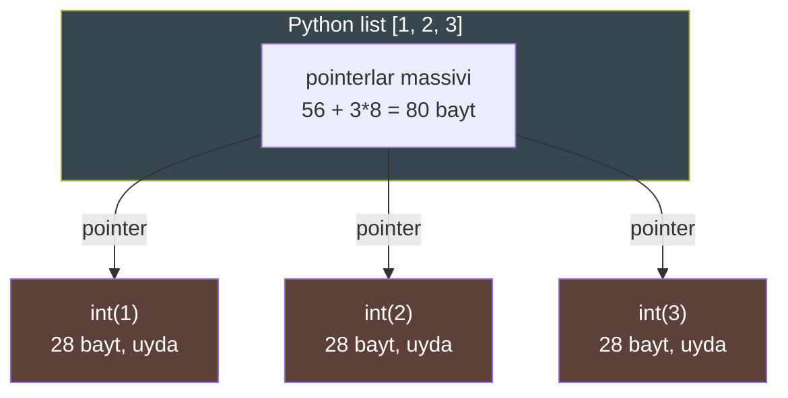
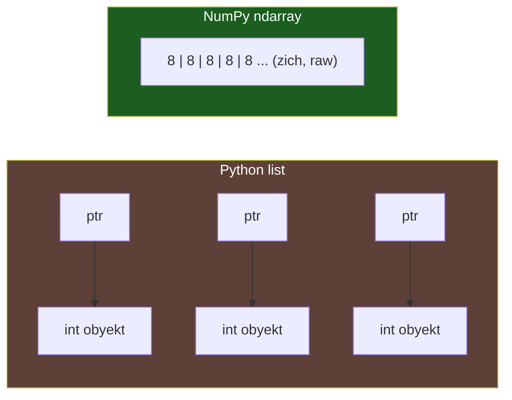

# 13. Performance va profiling

## Muammo — nega bu kerak?

Sen bir funksiyani "tezlashtirish" uchun ikki kun sarflading. Kodni chiroyli
optimallashtirding, murakkab trick'lar qo'llading. Lekin dastur umuman
tezlashmadi. Nega? Chunki o'sha funksiya butun ish vaqtining atigi 0.3% ini
egallar edi. Sen noto'g'ri joyni "davoladingi".

ML muhandisi uchun bu og'riq ikki barobar. Data pipeline millionlab qatorni
qayta ishlaydi; model training soatlab davom etadi. Bitta sekin sikl butun
eksperimentni bloklaydi. Shuning uchun **birinchi qoida** — taxmin qilma,
**o'lcha**.

> **Oltin qoida:** O'lchamasdan optimizatsiya qilma. Donald Knuth aytganidek:
> "Premature optimization is the root of all evil" (vaqtidan oldin
> optimizatsiya — barcha yovuzlikning ildizi).

---

## Analogiya — shifokor va diagnoz

Yaxshi shifokor bemorni ko'rmasdan operatsiya qilmaydi. Avval **diagnoz**:
analiz, rentgen, ko'rik. Keyingina davolash. Profiling — bu sening diagnoz
asboging. Kod qayerda "og'riyapti"ni ko'rsatadi, sen esa aynan o'sha joyni
tuzatasan.

**Analogiya chegarasi:** shifokor uchun diagnoz qimmat va xavfli. Sen uchun esa
o'lchash deyarli bepul — `timeit` yoki `cProfile` bir soniyada javob beradi.
Shuning uchun "gumon qilaman" deb turishning umuman hojati yo'q: o'lcha.

---

## Optimizatsiya sikli



Diqqat: sikl **o'lchash** bilan boshlanadi va **qayta o'lchash** bilan
tugaydi. Optimizatsiya — bu o'rtadagi kichik qadam, asosiysi emas.

---

## 1. `timeit` — mikro-benchmark

`timeit` (bitta kichik kod bo'lagining bajarilish vaqtini o'lchovchi modul) —
alohida ifodani ko'p marta ishlatib, o'rtacha vaqtni beradi. U ataylab kodni
minglab marta takrorlaydi, chunki bitta o'lchov "shovqinli" (noise) bo'ladi.

### Worked example — `in` operatori: list vs set

```python
import timeit

# --- 1-qadam: bir xil 1000 ta element, ikki xil struktura ---
setup_list = "data = list(range(1000))"
setup_set  = "data = set(range(1000))"

# --- 2-qadam: eng yomon holat — oxirgi elementni qidiramiz ---
t_list = timeit.timeit("999 in data", setup=setup_list, number=100_000)
t_set  = timeit.timeit("999 in data", setup=setup_set,  number=100_000)

# --- 3-qadam: natijani solishtiramiz ---
print(f"list: {t_list:.4f}s")
print(f"set:  {t_set:.4f}s")
print(f"list set'dan {t_list / t_set:.0f}x sekin")
```

Natija (raqamlar mashinangda farq qiladi, lekin nisbat barqaror):

```
list: 0.6903s
set:  0.0038s
list set'dan 182x sekin
```

**Nega?** Big-O amalda:

| Struktura | `x in data` | Ichki mexanizm |
| --------- | ----------- | -------------- |
| `list`    | **O(n)**    | Har elementni ketma-ket taqqoslaydi |
| `set`     | **O(1)**    | Hash orqali to'g'ridan-to'g'ri topadi |

Bu Postgres'dagi **sequential scan vs index scan** bilan bir xil g'oya:
list = butun jadvalni skanerlash, set = hash index bilan sakrash.

> ⚠️ `timeit`'da `setup` alohida beriladi — u **o'lchanmaydi**. Agar `list(...)`
> yaratishni o'lchanadigan kodga qo'shsang, natija butunlay noto'g'ri chiqadi.

---

## 2. String'ni loop ichida yig'ish — O(n²) tuzoq

Bu ML'da tez-tez uchraydi: minglab qatorni bitta katta string'ga yig'ish
(masalan log yoki CSV qurish).

### YOMON misol — `+=` loop ichida

```python
# --- YOMON: har +=' da yangi string yaratiladi (O(n^2)) ---
def concat_bad(n):
    s = ""
    for i in range(n):
        s += str(i)   # eski s to'liq ko'chiriladi!
    return s
```

### YAXSHI misol — ro'yxatga yig'ib, `join`

```python
# --- YAXSHI: bo'laklarni yig'amiz, oxirida bir marta birlashtiramiz (O(n)) ---
def concat_good(n):
    parts = []
    for i in range(n):
        parts.append(str(i))
    return "".join(parts)
```

O'lchaymiz:

```python
import timeit
n = 50_000
t_bad  = timeit.timeit(lambda: concat_bad(n),  number=20)
t_good = timeit.timeit(lambda: concat_good(n), number=20)
print(f"bad (+=):   {t_bad:.3f}s")
print(f"good (join):{t_good:.3f}s")
```

Natija:

```
bad (+=):   0.612s
good (join):0.071s
```

**Notional machine — nega `+=` sekin?** Python'da string **immutable**
(o'zgarmas). `s += str(i)` aslida `s = s + str(i)` — bu yangi string obyekt
yaratib, eski `s`ning barcha belgilarini yangisiga **ko'chiradi**. Har iteratsiyada
`s` uzayadi, ko'chirish qimmatlashadi: 1 + 2 + 3 + ... + n = O(n²).

`"".join(parts)` esa umumiy uzunlikni bir marta hisoblab, bitta buferni
to'ldiradi — O(n).

> 🔎 Nozik nuqta: CPython ba'zan `s += ...`ni joyida optimallashtiradi (agar
> `s`ga boshqa reference bo'lmasa). Lekin bunga **tayanma** — u kafolatlanmagan
> va boshqa Python implementatsiyalarida (PyPy, Jython) ishlamaydi.

---

## 3. `cProfile` — butun dasturni profiling

`timeit` bitta ifoda uchun. Butun dastur qayerda vaqt sarflayotganini bilish
uchun `cProfile` (har funksiya chaqiruvini sanab, vaqtini o'lchovchi profiler)
kerak.

### Worked example

```python
import cProfile

# --- 1-qadam: "og'ir" ichki funksiya ---
def sum_squares(m):
    return sum(i * i for i in range(m))

# --- 2-qadam: uni ko'p marta chaqiradigan tashqi funksiya ---
def compute():
    total = 0
    for _ in range(1000):
        total += sum_squares(10_000)
    return total

# --- 3-qadam: profiling ostida ishga tushiramiz ---
cProfile.run("compute()", sort="cumulative")
```

Natija (qisqartirilgan):

```
   1003 function calls in 1.284 seconds

   Ordered by: cumulative time

   ncalls  tottime  percall  cumtime  percall filename:lineno(function)
        1    0.000    0.000    1.284    1.284 {built-in method builtins.exec}
        1    0.012    0.012    1.284    1.284 prof.py:8(compute)
     1000    0.520    0.001    1.272    0.001 prof.py:4(sum_squares)
     1000    0.752    0.001    0.752    0.001 prof.py:5(<genexpr>)
```

### `cumtime` vs `tottime` — eng muhim ustunlar

| Ustun     | Ma'nosi |
| --------- | ------- |
| `tottime` | Faqat **shu funksiyaning o'zida** sarflangan vaqt (ichki chaqiruvlarsiz) |
| `cumtime` | **Kumulyativ** — shu funksiya + u chaqirgan hamma narsa |
| `ncalls`  | Necha marta chaqirilgan |

O'qish qoidasi:
- **Yuqori `cumtime`** — "vaqt qayerdan boshlanib oqib ketyapti" (yuqori
  darajadagi ayblidor). `compute` = 1.284s, chunki ichida hamma narsa bor.
- **Yuqori `tottime`** — "aynan qaysi funksiya o'zi ishlab charchayapti".
  Bu yerda `<genexpr>` (generator) = 0.752s tottime — haqiqiy hotspot shu.

> **Qoida:** optimizatsiya boshlashdan oldin `tottime` bo'yicha sarala — eng
> ko'p **o'z vaqtini** yeydigan funksiyani top. `cumtime` esa qaysi yo'ldan
> kelganini ko'rsatadi.

Go analogisi: `go test -bench` + `pprof`. Go'da `go tool pprof` xuddi shu ish —
flat (tottime) va cumulative (cumtime) ko'rinishlari bor.

---

## 4. `sys.getsizeof` — obyekt xotirada qancha joy egallaydi

```python
import sys

print(sys.getsizeof(0))          # 24  -> nol raqami (digit yo'q)
print(sys.getsizeof(1))          # 28  -> bitta raqamli int
print(sys.getsizeof(()))         # 40  -> bo'sh tuple
print(sys.getsizeof([]))         # 56  -> bo'sh list "karkasi"
print(sys.getsizeof([1, 2, 3]))  # 80  -> 56 + 3*8 (pointerlar)
```

Natija (64-bit CPython 3.12; raqamlar platformaga bog'liq):

```
24
28
40
56
80
```

**Diqqat qiladigan ikki nozik nuqta:**

1. Butun son `1` — bu 8 bayt "raw" ma'lumot emas, balki **28 baytli obyekt**:
   ichida refcount, type pointer va qiymat bor. Bu "boxing" (har qiymatni
   obyektga o'rash) — Python sekinligining ildizi.
2. `getsizeof([1,2,3])` = 80 — bu faqat **konteynerning o'zi** (pointerlar
   massivi). Ichidagi int obyektlar hisobga olinmaydi! Ya'ni "list qancha joy
   oladi" degan savol aldamchi.



int'lar xotirada **tarqoq** joylashgan (scattered). Har biriga alohida
pointer orqali borish kerak — bu keshni buzadi (cache miss).

---

## 5. Nega Python sekin va nega NumPy tez — ML uchun eng muhim ko'prik

Bu bo'lim butun kursning eng muhim intuitsiyasini beradi.

### Nega Python sekin?

Har bitta `a + b` amalida interpreter quyidagilarni bajaradi:

1. `a` va `b` — obyekt (boxing), ularni uydan (heap) topish kerak.
2. `type(a)` va `type(b)`ni tekshiradi — statik tip yo'q, hammasi runtime'da.
3. Mos `__add__`ni topib chaqiradi (type dispatch).
4. Natijani yangi obyektga o'rab qaytaradi.

Bu **har amalda** takrorlanadi. Million elementli loop = million marta type
tekshirish + dispatch + boxing.

### Nega NumPy tez?

NumPy'ning `ndarray`i — bu **contiguous** (ketma-ket, zich) C massivi. Million
`int64` = 8 MB zich xotira, boxing yo'q, pointerlar yo'q.



`arr * arr` — bu bitta Python chaqiruvi bo'lib, ichida **tight C loop**
ishlaydi: tip bir marta tekshiriladi (butun massiv uchun), keyin protsessor
zich xotira ustidan tez yuguradi (SIMD, cache-friendly). Interpreter overhead'i
million marta emas, **bir marta** to'lanadi.

### Worked example — loop vs vector

```python
import numpy as np
import timeit

# --- 1-qadam: bir xil ma'lumot, ikki struktura ---
n = 1_000_000
py_list = list(range(n))
np_arr  = np.arange(n)

# --- 2-qadam: sof Python loop ---
def py_sum_squares():
    return sum(x * x for x in py_list)

# --- 3-qadam: NumPy vectorized amal ---
def np_sum_squares():
    return int((np_arr * np_arr).sum())

# --- 4-qadam: solishtiramiz ---
t_py = timeit.timeit(py_sum_squares, number=10)
t_np = timeit.timeit(np_sum_squares, number=10)
print(f"Python loop:  {t_py:.3f}s")
print(f"NumPy vector: {t_np:.3f}s")
print(f"Tezlik: {t_py / t_np:.0f}x")
```

Natija (nisbat barqaror, aniq raqam mashinaga bog'liq):

```
Python loop:  0.842s
NumPy vector: 0.011s
Tezlik: 77x
```

> **ML intuitsiyasi (yodda saqla):** Python'da son ustidan **loop yozma** —
> vector amal ishlat. Loop = million marta interpreter overhead. Vector = bir
> marta C'ga tushish. Bu butun ML performance falsafasining o'zagi.

---

## 6. Go bilan solishtirish — `go test -bench`

Go'da xuddi shu loop **tabiiyan tez**, chunki Go compiled: `[]int` slice zaten
contiguous (NumPy'dagidek), int 8 bayt, boxing yo'q, dispatch yo'q.

```go
// bench_test.go
package main

import "testing"

func BenchmarkSumSquares(b *testing.B) {
    data := make([]int, 1_000_000)
    for i := range data {
        data[i] = i
    }
    b.ResetTimer()
    for i := 0; i < b.N; i++ {
        total := 0
        for _, x := range data {
            total += x * x
        }
        _ = total
    }
}
```

Ishga tushirish: `go test -bench=. -benchmem`

```
BenchmarkSumSquares-8    1233    958142 ns/op    0 B/op    0 allocs/op
```

`958142 ns/op` = ~0.96 ms bitta iteratsiya. Bu NumPy'ning vector amaliga
yaqin — chunki ikkalasi ham **native, contiguous, dispatch'siz**.

> **Katta xulosa:** Go'ning oddiy `for` loop'i ≈ NumPy vector ≈ native C loop.
> Python'ning `for` loop'i — eng sekin variant. Shuning uchun Python'da native
> tezlikka yetish uchun NumPy kerak; Go'da esa u allaqachon native.

| Xususiyat            | Python loop | NumPy | Go loop |
| -------------------- | ----------- | ----- | ------- |
| Boxing (obyektga o'rash) | Ha (har element) | Yo'q | Yo'q |
| Type dispatch        | Har amalda  | Bir marta | Yo'q (compile'da) |
| Xotira               | Tarqoq pointerlar | Contiguous | Contiguous |
| Nisbiy tezlik        | 1x          | ~70x  | ~70x |

---

## 🤔 O'ylab ko'r

```python
data = list(range(10_000_000))   # 10 million element
result = 9_999_999 in data       # oxirgi elementni qidiramiz
```

Bu `in` tekshiruvi qancha amal bajaradi va agar `data` ni `set`ga
o'zgartirsak nima o'zgaradi?

<details>
<summary>💡 Javobni ko'rish</summary>

`list`da `in` — **O(n)**: eng yomon holatda 10 million taqqoslash, chunki
Python har elementni ketma-ket tekshiradi (`data[0]`, `data[1]`, ...) toki
topguncha. Oxirgi element bo'lgani uchun deyarli hammasini ko'radi.

`set`ga o'zgartirsak — **O(1)**: `9_999_999`ning hash'i hisoblanadi va
to'g'ridan-to'g'ri kerakli "chelak"ka (bucket) boriladi. n qancha katta
bo'lsa, farq shuncha keskin: bu yerda ~million barobar tezroq.

Qoida: agar biror kolleksiyada tez-tez "bor/yo'q" tekshirsang — `set`
(yoki `dict`) ishlat, `list` emas.
</details>

---

## ⚠️ Ko'p uchraydigan xatolar

**1. Profiling'siz optimizatsiya.**
Noto'g'ri tasavvur: "Men bilaman qaysi qism sekin." Nega noto'g'ri: intuitsiya
deyarli har doim aldaydi — sekinlik ko'pincha kutilmagan joyda. To'g'risi: avval
`cProfile` bilan o'lcha, keyin optimallashtir.

**2. `timeit` setup'ini o'lchanadigan kodga qo'shish.**
Noto'g'ri: `timeit("data=list(range(1000)); 999 in data")` — bu list yaratishni
ham o'lchaydi. To'g'risi: yaratishni `setup=`ga chiqar, faqat qidiruvni o'lcha.

**3. `in` list'da O(1) deb o'ylash.**
Noto'g'ri tasavvur: "`x in data` har doim tez." Nega noto'g'ri: `list`da u O(n).
To'g'risi: tez lookup kerak bo'lsa `set`/`dict` ishlat.

**4. Kichik ma'lumotga NumPy ishlatish.**
Noto'g'ri: 5 elementli massivga NumPy — chunki uning o'zining chaqiruv
overhead'i bor. To'g'risi: NumPy katta massivlarda foyda beradi; kichik
ma'lumotda sof Python tezroq bo'lishi mumkin. Yana — o'lcha.

**5. `getsizeof(list)` ichidagilarni sanaydi deb o'ylash.**
Noto'g'ri: "`getsizeof([big, big, big])` katta chiqadi." Nega noto'g'ri: u faqat
pointerlar massivini sanaydi. To'g'risi: chuqur o'lchov uchun har elementni
alohida qo'shib chiqish kerak.

---

## Xulosa

- **O'lchamasdan optimizatsiya qilma** — intuitsiya aldaydi, profiler aldamaydi.
- `timeit` — bitta ifoda uchun mikro-benchmark; `setup`ni alohida ber.
- `cProfile` — butun dastur uchun; `tottime` = o'z vaqti, `cumtime` = kumulyativ.
- Big-O amalda: `list`da `in` = O(n), `set`da = O(1).
- Loop ichida `+=` bilan string yig'ish = O(n²); `join` = O(n).
- Python sekin: boxing + har amalda type dispatch. NumPy tez: contiguous
  xotira + vectorized C loop.
- Go loop ≈ NumPy vector ≈ native; Python loop — eng sekin.

## 🧠 Eslab qol

- Avval o'lch, keyin optimallashtir.
- `tottime` — hotspot'ni topadi; `cumtime` — yo'lni ko'rsatadi.
- Tez lookup kerak bo'lsa `set`/`dict`, `list` emas.
- ML mantrasi: son ustidan loop yozma, vector amal ishlat.
- NumPy tez, chunki boxing va per-element dispatch yo'q.

## ✅ O'z-o'zini tekshir (retrieval practice)

**1.** Nega `cProfile` natijasida `compute` funksiyasi eng katta `cumtime`ga
ega, lekin uni optimallashtirishning ma'nosi kam?

<details>
<summary>Javob</summary>

`compute`ning `cumtime`i katta, chunki u ichidagi hamma narsani o'z ichiga
oladi (kumulyativ). Lekin uning **o'z** vaqti (`tottime`) kichik — u shunchaki
boshqa funksiyalarni chaqiradi. Haqiqiy ish (va optimizatsiya imkoniyati)
yuqori `tottime`ga ega funksiyada, ya'ni `<genexpr>`da.
</details>

**2.** `s += str(i)` loop ichida nega O(n²), `"".join(parts)` esa nega O(n)?

<details>
<summary>Javob</summary>

String immutable. Har `+=` yangi string yaratib, eski belgilarni ko'chiradi:
1+2+...+n = O(n²). `join` umumiy uzunlikni bir marta hisoblab, bitta buferni
to'ldiradi — har belgi bir marta ko'chiriladi, O(n).
</details>

**3.** `sys.getsizeof([obj1, obj2, obj3])` katta obyektlar bo'lsa ham nega kichik
son qaytaradi?

<details>
<summary>Javob</summary>

`getsizeof` faqat list konteynerining o'zini — pointerlar massivini (56 + 3*8)
o'lchaydi. Pointerlar ko'rsatayotgan obyektlar hisobga olinmaydi, chunki ular
xotirada alohida joylashgan.
</details>

**4.** Bir hamkasbing: "NumPy sehrli, hamma joyda ishlataman" deydi. 10 elementli
massivda nega bu foydasiz?

<details>
<summary>Javob</summary>

NumPy'ning tezligi katta massivlarda amortizatsiya bo'ladigan chaqiruv
overhead'iga ega (Python -> C o'tish, massiv tayyorlash). 10 elementda bu
overhead foydadan katta; sof Python tezroq bo'lishi mumkin. Har doim o'lch.
</details>

**5.** Go'ning `for` loop'i nega Python'nikidan tez, lekin NumPy vectorga yaqin?

<details>
<summary>Javob</summary>

Go compiled: `[]int` contiguous, int 8 bayt (boxing yo'q), tiplar compile'da
ma'lum (dispatch yo'q). Shuning uchun Go loop = native = NumPy vector darajasi.
Python loop esa har amalda boxing + dispatch to'laydi.
</details>

## 🛠 Amaliyot

**1. Oson (Modify).** Yuqoridagi `in` benchmark'ini `dict`ni ham qo'shib
kengaytir: `data = dict.fromkeys(range(1000))`. `set` bilan bir xilmi?

<details>
<summary>Hint</summary>

`dict`da `key in data` ham hash orqali O(1) — natija `set`ga juda yaqin
chiqishi kerak. `timeit`ga uchinchi `setup` qo'shsang bo'ldi.
</details>

**2. O'rta (faded example — to'ldir).** `cProfile` bilan qaysi funksiya
hotspot ekanini top:

```python
import cProfile

def slow_part(n):
    total = 0
    for i in range(n):
        total += i ** 2      # og'ir amal
    return total

def fast_part(n):
    return n * (n + 1) * (2 * n + 1) // 6   # yopiq formula

def main():
    a = 0
    for _ in range(500):
        a += slow_part(20_000)
        a += fast_part(20_000)
    return a

# TODO: cProfile bilan main()' ni "tottime" bo'yicha saralab ishga tushir
# TODO: qaysi funksiya eng katta tottime'ga ega? Uni qanday tezlashtirasan?
```

<details>
<summary>Hint</summary>

`cProfile.run("main()", sort="tottime")`. `slow_part` eng katta `tottime`ni
oladi (loop + `**`). Uni `fast_part`dagi yopiq formula bilan almashtirib
O(n)'dan O(1)'ga tushirasan.
</details>

**3. Qiyin (Make).** Noldan yoz: 1 million `float`ning o'rtacha kvadratik
og'ishini (standard deviation) ikki usulda hisobla — (a) sof Python loop,
(b) NumPy. Ikkalasini `timeit` bilan o'lchab, tezlik nisbatini chop et.

<details>
<summary>Hint</summary>

NumPy versiyasi bitta qator: `np_arr.std()`. Python versiyasida o'rtachani
hisobla, keyin `sum((x-mean)**2 for x in data)/n` va `math.sqrt`. Nisbat
50x dan katta chiqishi kerak.
</details>

## 🔁 Takrorlash

**Bog'liq oldingi mavzular:**
- 08-dars (Collections) — `set`, `deque`, `heapq`: to'g'ri struktura = to'g'ri Big-O.
- 12-dars (Memory model) — reference semantics, obyekt xotirada qanday yashaydi.
- Algoritm kursidagi "Big O" darsi — bu yerdagi amaliy o'lchovlar nazariyasi.

**Takrorlash jadvali:**
- **Ertaga** — "O'z-o'zini tekshir" 1 va 2-savollarga qaytib javob ber.
- **3 kundan keyin** — `in` benchmark'ini eslamasdan qayta yoz.
- **1 haftadan keyin** — NumPy vs Python loop nisbatini yodingdan tushuntir.

**Feynman testi:** "Nega Python sekin va NumPy tez"ni kod so'zlaridan
foydalanmasdan bir do'stingga 3 jumlada tushuntira olasanmi? (Ishora: boxing,
type dispatch, contiguous xotira.)

---

## Manbalar

- [cProfile va profilers — Python docs](https://docs.python.org/3/library/profile.html)
- [timeit — Python docs](https://docs.python.org/3/library/timeit.html)
- Fluent Python (Luciano Ramalho) — performance va data model boblari
- Effective Python (Brett Slatkin) — Item 70-92, profiling va optimizatsiya
