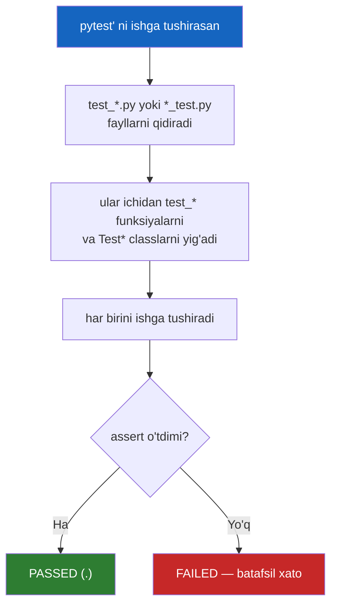
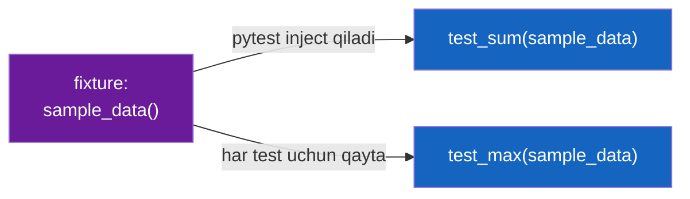
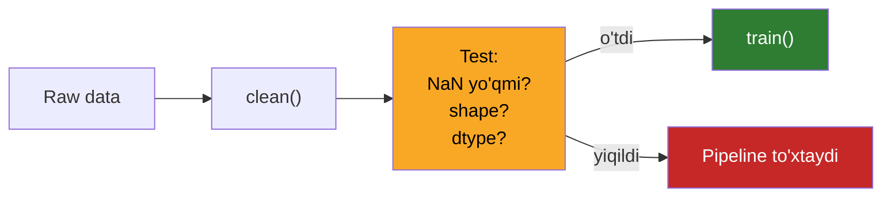

# 14. Testing — pytest

## Muammo — nega bu kerak?

Sen data-cleaning funksiyani refactor qilding. Ko'zdan kechirding — "hammasi
joyida ko'rinadi". Model o'qitildi, metrikalar biroz yomonlashdi, lekin sabab
noaniq. Ikki hafta o'tib bilinadi: refactor paytida bitta ustunning `NaN`
to'ldirilishi buzilgan edi. Model buzuq datada o'rgangan.

Bu **jim xato** (silent bug) — hech qaerda exception yo'q, dastur ishlaydi,
lekin natija noto'g'ri. ML'da bunday xatolar eng qimmat, chunki ular kodda emas,
**ma'lumot oqimida** yashiringan. Test — bularni tutadigan yagona ishonchli
mexanizm.

> **Oltin qoida:** Test yozilmagan kod — bu "ishlaydi deb umid qilingan" kod.
> Har refactor'dan keyin qo'lda tekshirish o'rniga, kompyuter tekshirsin.

---

## Analogiya — tutun datchigi

Test — bu tutun datchigi (smoke detector). Bir marta o'rnatasan, keyin u
tinmay kuzatib turadi: biror narsa "yonsa", darrov signal beradi. Sen har
daqiqada uyni aylanib chiqishing shart emas.

**Analogiya chegarasi:** tutun datchigi faqat **o'zi turgan xonada** yong'inni
sezadi. Test ham faqat sen **assert qilgan** narsani tekshiradi. "Barcha testlar
yashil" degani "xato yo'q" degani emas — "men tekshirgan holatlarda xato yo'q"
degani.

---

## Nega `pytest`, `unittest` emas?

Python'da ikki test frameworki bor: standart kutubxonadagi `unittest` va
uchinchi tomon `pytest`. Deyarli butun ekotizim `pytest`ni tanlaydi.

| Xususiyat        | `unittest`                    | `pytest` |
| ---------------- | ----------------------------- | -------- |
| Uslub            | Class-based (Java/xUnit merosi) | Oddiy funksiya |
| Tekshirish       | `self.assertEqual(a, b)`      | oddiy `assert a == b` |
| Xato xabari      | Umumiy                        | Boy, introspection bilan |
| Setup/teardown   | `setUp`/`tearDown` metodlar   | Moslashuvchan `fixture` |
| Takror data      | Qo'lda loop                   | `@parametrize` (table-driven!) |
| Boshqasini o'qish| —                             | `unittest` testlarini ham ishlatadi |

`pytest`ning asosiy jozibasi — **kam boilerplate**: class kerak emas, oddiy
`assert` yetadi.

---

## Go bilan solishtirish — eng kuchli parallel

Agar Go'ning `testing` package'ini bilsang, `pytest` sen uchun tanish:

| Go `testing`                        | `pytest` |
| ----------------------------------- | -------- |
| `func TestXxx(t *testing.T)`        | `def test_xxx():` |
| `t.Errorf(...)` / `t.Fatal(...)`    | oddiy `assert` |
| Table-driven test (struct slice)    | `@pytest.mark.parametrize` |
| `t.Run("subtest", ...)`             | parametrize case'lari |
| `go test`                           | `pytest` |
| `TestMain` / setup funksiyalar      | `fixture` / `conftest.py` |
| `defer` / `t.Cleanup()`             | `yield` fixture (teardown) |
| `go test -cover`                    | `pytest --cov` |

Eng muhim moslik: **Go'ning table-driven testi ≈ pytest'ning `parametrize`i**.
Ikkalasi ham bitta test mantig'ini ko'p kirish-chiqish jufti ustidan
yugurtiradi.

---

## Test discovery — pytest testlarni qanday topadi



**Nom konvensiyasi (majburiy, aks holda topilmaydi):**
- Fayl: `test_*.py` yoki `*_test.py`
- Funksiya: `test_` bilan boshlanadi
- Class (ixtiyoriy): `Test` bilan boshlanadi, `__init__`siz

---

## Worked example — birinchi test

Faraz qilaylik `mymath.py`:

```python
# mymath.py
def square(x):
    return x * x

def divide(a, b):
    if b == 0:
        raise ValueError("nolga bo'lish mumkin emas")
    return a / b
```

Test fayli `test_mymath.py`:

```python
# --- 1-qadam: test qilinadigan kodni import qilamiz ---
from mymath import square, divide

# --- 2-qadam: oddiy assert bilan tekshiramiz ---
def test_square_positive():
    assert square(4) == 16

def test_square_negative():
    assert square(-3) == 9
```

Ishga tushirish: `pytest -v`

```
test_mymath.py::test_square_positive PASSED           [ 50%]
test_mymath.py::test_square_negative PASSED           [100%]

======================= 2 passed in 0.01s =======================
```

### pytest "sehri" — oddiy assert nega yetarli?

Go'da `if got != want { t.Errorf(...) }` yozasan. Python'da faqat `assert`.
Odatda `assert`ning xato xabari quruq bo'ladi, lekin `pytest` **assertion
rewriting** qiladi — kompilyatsiya paytida `assert`ni ushlab, chap va o'ng
tomonni ajratib ko'rsatadi.

Ataylab buzamiz — `assert square(4) == 15`:

```
    def test_square_positive():
>       assert square(4) == 15
E       assert 16 == 15
E        +  where 16 = square(4)

test_mymath.py:5: AssertionError
```

`assert 16 == 15` va `where 16 = square(4)` — pytest o'zi qiymatlarni chiqarib
beradi. Bu Go'dagi `t.Errorf("square(4) = %d, want %d", got, want)`ni qo'lda
yozishning avtomatik varianti.

---

## `@pytest.mark.parametrize` — Go table-driven testning ekvivalenti

Bir mantiqni ko'p kirish ustidan tekshirish uchun har safar yangi funksiya
yozish — nusxa-ko'chirma. `parametrize` buni hal qiladi.

```python
import pytest
from mymath import square

# --- Bitta test, to'rt xil (kirish, kutilgan) jufti ---
@pytest.mark.parametrize("value, expected", [
    (2, 4),
    (3, 9),
    (0, 0),
    (-2, 4),
])
def test_square(value, expected):
    assert square(value) == expected
```

Ishga tushirish: `pytest -v`

```
test_mymath.py::test_square[2-4]  PASSED
test_mymath.py::test_square[3-9]  PASSED
test_mymath.py::test_square[0-0]  PASSED
test_mymath.py::test_square[-2-4] PASSED

======================= 4 passed in 0.01s =======================
```

Har juft **alohida test** sifatida ko'rinadi — bittasi yiqilsa, qaysi biri
ekani darrov ma'lum.

### Go'dagi bir xil narsa (table-driven)

```go
func TestSquare(t *testing.T) {
    cases := []struct {
        value, expected int
    }{
        {2, 4}, {3, 9}, {0, 0}, {-2, 4},
    }
    for _, c := range cases {
        if got := c.value * c.value; got != c.expected {
            t.Errorf("square(%d) = %d, want %d", c.value, got, c.expected)
        }
    }
}
```

`cases` slice = pytest'ning parametrize ro'yxati. Bitta farq: Go'da loop
o'zing yozasan, pytest'da framework har case'ni alohida test qilib beradi.

---

## `fixture` — testga tayyor ma'lumot/resurs berish

Ko'p test bitta xil "tayyorgarlik"ni talab qiladi: namuna data, DB ulanishi,
vaqtinchalik fayl. `fixture` (test uchun tayyorlangan resurs) — buni bir joyda
yozib, testlarga **nom orqali** uzatadi (dependency injection).

```python
import pytest

# --- 1-qadam: fixture e'lon qilamiz ---
@pytest.fixture
def sample_data():
    return [10, 20, 30, 40, 50]

# --- 2-qadam: test uni parametr sifatida "so'raydi" ---
def test_sum(sample_data):
    assert sum(sample_data) == 150

def test_max(sample_data):
    assert max(sample_data) == 50
```

```
test_x.py::test_sum PASSED
test_x.py::test_max PASSED
```

Diqqat: `sample_data` — bu argument emas, sen uni qo'lda uzatmaysan. pytest
nomga qarab mos fixture'ni topib, avtomatik chaqirib beradi.



### Fixture scope — resurs qancha "yashaydi"?

Ba'zi resurslar qimmat (DB ulanish, katta model yuklash). Ularni har test uchun
qayta yaratish isrof. `scope` buni boshqaradi:

| Scope       | Qachon yaratiladi | Ishlatish |
| ----------- | ----------------- | --------- |
| `function` (default) | Har test uchun qaytadan | Toza, izolyatsiya kerak bo'lsa |
| `module`    | Fayl uchun bir marta | Bir fayldagi testlar baham ko'radi |
| `session`   | Butun run uchun bir marta | Qimmat resurs: DB, model |

### `yield` fixture — setup + teardown

```python
import pytest

@pytest.fixture(scope="session")
def db_connection():
    conn = f"CONNECTED"          # setup: qimmat ulanish
    print("\n[ulanish ochildi]")
    yield conn                   # test shu qiymatni oladi
    print("\n[ulanish yopildi]") # teardown: yield'dan keyin

def test_query(db_connection):
    assert db_connection == "CONNECTED"
```

```
[ulanish ochildi]
test_x.py::test_query PASSED
[ulanish yopildi]

======================= 1 passed in 0.01s =======================
```

`yield`gacha — setup, `yield`dan keyin — teardown. Bu Context manager
(03-dars) va Go'ning `defer conn.Close()` / `t.Cleanup()` bilan aynan bir
g'oya: resursni ochib, ishlatib, kafolatli yopish.

---

## `pytest.raises` — exception'ni test qilish

Xato **kutilgan** bo'lsa-chi? `divide(10, 0)` `ValueError` bermasa, bu bug.

```python
import pytest
from mymath import divide

def test_divide_by_zero():
    # --- kontekst ichida exception KUTILADI ---
    with pytest.raises(ValueError, match="nolga"):
        divide(10, 0)

def test_divide_ok():
    assert divide(10, 2) == 5.0
```

```
test_mymath.py::test_divide_by_zero PASSED
test_mymath.py::test_divide_ok      PASSED
```

`match="nolga"` — xato matni regex bilan tekshiriladi. Agar `divide` **hech
qanday** exception bermasa yoki boshqa tur bersa — test yiqiladi.

---

## `monkeypatch` va `mock` — tashqi dunyoni "yolg'onlash"

Test tashqi API'ga, real fayl tizimiga yoki env-ga bog'liq bo'lmasligi kerak.
`monkeypatch` — vaqtincha biror narsani almashtiradi, test tugagach avtomatik
tiklaydi.

```python
import os

def get_api_key():
    return os.environ["API_KEY"]

def test_api_key(monkeypatch):
    # --- env'ni faqat shu test uchun o'rnatamiz ---
    monkeypatch.setenv("API_KEY", "test-123")
    assert get_api_key() == "test-123"
```

```
test_x.py::test_api_key PASSED
```

`mock` (standart `unittest.mock`) esa funksiya/obyektni soxta versiya bilan
almashtiradi — masalan real HTTP so'rov o'rniga tayyor javob qaytaradi. ML
kontekstida: testda real training API'ga yoki S3'ga tegilmaydi, ular
mock'lanadi.

---

## `conftest.py` va coverage

`conftest.py` — pytest avtomatik topadigan maxsus fayl. Undagi fixture'lar
**import qilmasdan** butun papkadagi testlarga ko'rinadi. Umumiy fixture'lar
uchun uy.

**Coverage** (`pytest-cov`) — kodning necha foizi testlar tomonidan
"yugurib o'tilgan"ini o'lchaydi:

```
pytest --cov=mymath
```

```
Name         Stmts   Miss  Cover
--------------------------------
mymath.py        6      0   100%
--------------------------------
TOTAL            6      0   100%
```

> ⚠️ 100% coverage ≠ xatosiz kod. Coverage faqat "bu qator ishga tushdi"ni
> aytadi, "bu qator to'g'ri ishlaydi"ni emas. Assert'siz test coverage'ni
> ko'taradi, lekin hech narsani isbotlamaydi.

---

## ML konteksti — data pipeline va modelni testlash

ML kodini testlash qiyin, chunki **tasodifiylik** (randomness) bor. Yechim —
aniq qiymatni emas, **xususiyatlarni** (invariant) tekshir:

```python
import numpy as np

def normalize(x):
    return (x - x.mean()) / x.std()

def test_normalize_properties():
    # --- 1-qadam: seed'ni qot, takrorlanuvchi bo'lsin ---
    rng = np.random.default_rng(42)
    data = rng.normal(size=1000)

    # --- 2-qadam: aniq qiymat emas, XUSUSIYATni tekshiramiz ---
    result = normalize(data)
    assert abs(result.mean()) < 1e-9        # o'rtacha ~0
    assert abs(result.std() - 1.0) < 1e-9   # std ~1
    assert result.shape == data.shape       # shakl saqlangan
```

```
test_ml.py::test_normalize_properties PASSED
```

Data pipeline uchun tipik testlar: shakl (shape) to'g'rimi, `NaN` yo'qmi, ustun
turlari kutilgandaymi, oralig'i (range) mantiqlimi.



---

## 🤔 O'ylab ko'r

```python
@pytest.fixture(scope="session")
def shared_list():
    return [1, 2, 3]

def test_a(shared_list):
    shared_list.append(4)
    assert len(shared_list) == 4

def test_b(shared_list):
    assert len(shared_list) == 3
```

`test_a` va `test_b` ikkalasi ham o'tadimi?

<details>
<summary>💡 Javobni ko'rish</summary>

**Yo'q.** `scope="session"` bo'lgani uchun `shared_list` bir marta yaratilib,
ikki testga **bir xil obyekt** sifatida beriladi. `test_a` unga `4` qo'shadi,
ro'yxat `[1,2,3,4]` bo'lib qoladi. `test_b` esa `len == 3` kutadi — yiqiladi
(yoki test tartibiga qarab beqaror).

Saboq: mutable resursni keng scope'da ulashish xavfli. Har test toza holat
kutsa — `function` scope ishlat yoki fixture ichida har safar yangi nusxa
qaytar.
</details>

---

## ⚠️ Ko'p uchraydigan xatolar

**1. Testlar bir-biriga bog'liq.**
Noto'g'ri tasavvur: "test_a avval ishlaydi, keyin test_b." Nega noto'g'ri:
pytest tartibni kafolatlamaydi va testlar mustaqil bo'lishi kerak. To'g'risi:
har test o'z holatini o'zi tayyorlasin (fixture orqali).

**2. Fayl nomi `test_` bilan boshlanmaydi.**
Noto'g'ri: `mymath_tests.py` yozib, "pytest topmayapti" deyish. To'g'risi:
`test_mymath.py` yoki `mymath_test.py`.

**3. Implementatsiyani testlash, xatti-harakatni emas.**
Noto'g'ri: ichki o'zgaruvchi qiymatini tekshirish. Nega noto'g'ri: refactor
har safar testni buzadi. To'g'risi: funksiyaning **natijasini** (behavior)
test qil, ichini emas.

**4. Mutable fixture'ni keng scope'da ulashish.**
Yuqoridagi predict misoli. To'g'risi: default `function` scope izolyatsiya
beradi; keng scope faqat o'zgarmaydigan/qimmat resurslar uchun.

**5. Coverage 100% = xato yo'q deb o'ylash.**
Noto'g'ri: yuqori coverage'ni sifat kafolati deb bilish. To'g'risi: coverage
"qamrov", assert esa "isbot". Ma'noli assert'lar yoz.

---

## Xulosa

- Test — refactor'dan keyingi jim xatolarni tutadigan xavfsizlik to'ri.
- `pytest` `unittest`dan sodda: oddiy `assert`, kam boilerplate.
- Nom konvensiyasi majburiy: `test_*.py`, `test_*` funksiya.
- `parametrize` = Go'ning table-driven testi (bir mantiq, ko'p case).
- `fixture` = tayyor resurs; `scope` uni qancha "yashashini" boshqaradi.
- `yield` fixture = setup + teardown (Context manager / `defer` g'oyasi).
- `pytest.raises` — kutilgan exception'ni tekshiradi.
- Coverage qamrovni o'lchaydi, to'g'rilikni emas.

## 🧠 Eslab qol

- Oddiy `assert` yetadi — pytest qolganini o'zi ko'rsatadi.
- `parametrize` — nusxa-ko'chirma test o'rniga bitta jadval.
- Fixture'ni nom orqali so'raysan, pytest inject qiladi.
- Keng scope + mutable = xavf.
- ML'da aniq qiymatni emas, invariantni test qil (seed'ni qot).

## ✅ O'z-o'zini tekshir (retrieval practice)

**1.** Nega `parametrize` bilan yozilgan test 4 case'dan biri yiqilsa, qaysi biri
ekani darrov ma'lum bo'ladi?

<details>
<summary>Javob</summary>

pytest har case'ni **alohida test** sifatida ro'yxatga oladi, ID'da kirish
qiymatlari ko'rinadi (masalan `test_square[3-9]`). Shuning uchun yiqilgan aniq
case ID'da yoziladi. Qo'lda loop'da esa faqat "test yiqildi" ko'rinadi, qaysi
iteratsiya ekani noaniq (Go'da ham shuning uchun `t.Run` yoki batafsil
`Errorf` ishlatiladi).
</details>

**2.** `yield` fixture'da `yield`dan oldingi va keyingi kod qachon ishlaydi?

<details>
<summary>Javob</summary>

`yield`dan oldingi kod — setup, test boshlanishidan oldin. `yield` beradigan
qiymatni test oladi. `yield`dan keyingi kod — teardown, test tugagach (yiqilsa
ham) ishlaydi. Bu Context manager'ning `__enter__`/`__exit__`iga mos.
</details>

**3.** `scope="session"` fixture qachon foydali, qachon xavfli?

<details>
<summary>Javob</summary>

Foydali: qimmat, o'zgarmaydigan resurs uchun (DB ulanish, katta model) — bir
marta yaratilib qayta ishlatiladi. Xavfli: mutable obyekt bo'lsa, bir test uni
o'zgartirsa, keyingi testlar buzuq holatni ko'radi (testlar bir-biriga
bog'lanib qoladi).
</details>

**4.** ML modelini testlashda nega aniq output qiymatini emas, xususiyatni
tekshirasan?

<details>
<summary>Javob</summary>

Ko'p ML amali tasodifiy (init, shuffle, sampling). Aniq qiymat mashinaga/versiyaga
qarab o'zgarishi mumkin, test beqaror bo'ladi. Shuning uchun seed'ni qotirib,
invariantlarni tekshirasan: shakl, `NaN` yo'qligi, o'rtacha/std oralig'i,
monotonlik kabi xususiyatlar.
</details>

**5.** `pytest.raises` bloki ichidagi kod exception bermasa nima bo'ladi?

<details>
<summary>Javob</summary>

Test **yiqiladi** (`Failed: DID NOT RAISE`). `pytest.raises` "shu blok albatta
shu turdagi xato berishi kerak" degani; xato bo'lmasa kutilgan xatti-harakat
buzilgan hisoblanadi.
</details>

## 🛠 Amaliyot

**1. Oson (Modify).** Yuqoridagi `test_square` parametrize'iga ikkita yangi
case qo'sh: `(10, 100)` va `(-5, 25)`. `pytest -v` bilan 6 ta test
ko'rinishini tasdiqla.

<details>
<summary>Hint</summary>

Ro'yxatga ikki juft qo'shsang bo'ldi. Chiqishda `test_square[10-100]` va
`test_square[-5-25]` paydo bo'lishi kerak.
</details>

**2. O'rta (faded example — to'ldir).** Quyidagi test skeletni to'ldir:

```python
import pytest

def parse_age(s):
    age = int(s)
    if age < 0:
        raise ValueError("yosh manfiy bo'lolmaydi")
    return age

# TODO: to'g'ri kirishlarni parametrize bilan tekshir: "0"->0, "25"->25
# TODO: manfiy kirish ("-1") ValueError berishini pytest.raises bilan tekshir
# TODO: son bo'lmagan kirish ("abc") ValueError berishini tekshir
```

<details>
<summary>Hint</summary>

Birinchisi uchun `@pytest.mark.parametrize("s, expected", [("0",0),("25",25)])`.
Manfiy uchun `with pytest.raises(ValueError, match="manfiy"):`. `"abc"` ham
`int("abc")` ichki `ValueError` beradi — `pytest.raises(ValueError)` yetadi.
</details>

**3. Qiyin (Make).** Noldan yoz: `moving_average(data, window)` funksiyasini
(sirpanuvchi o'rtacha) va uning to'liq test to'plamini yoz. Testlar: to'g'ri
uzunlik, `window=1`da o'zgarishsiz, bo'sh data yoki `window <= 0`da to'g'ri
exception, fixture bilan namuna data.

<details>
<summary>Hint</summary>

`fixture`da namuna `[1,2,3,4,5]` qaytar. `window > len(data)` yoki
`window <= 0` uchun `ValueError` ko'tar va `pytest.raises` bilan tekshir. To'g'ri
natija uzunligi `len(data) - window + 1`.
</details>

## 🔁 Takrorlash

**Bog'liq oldingi mavzular:**
- 03-dars (Context manager) — `yield` fixture aynan shu g'oyaga tayanadi.
- 04-dars (Type hints) — mypy + pytest birga statik va dinamik tekshiruv beradi.
- 13-dars (Performance) — `pytest-benchmark` bilan test va benchmark birlashadi.

**Takrorlash jadvali:**
- **Ertaga** — `parametrize` vs `fixture` farqini yodingdan ayt.
- **3 kundan keyin** — `yield` fixture setup/teardown tartibini qayta yoz.
- **1 haftadan keyin** — ML invariant testlashini eslab, misol yoz.

**Feynman testi:** "Fixture nima va nega u dependency injection"ni kod
so'zlaridan foydalanmasdan bir do'stingga 3 jumlada tushuntira olasanmi?

---

## Manbalar

- [pytest documentation](https://docs.pytest.org/)
- [Go testing package](https://pkg.go.dev/testing) — table-driven test uchun
- Effective Python (Brett Slatkin) — Item 108-114, testlash bo'limi
- [Real Python — pytest guide](https://realpython.com/pytest-python-testing/)
