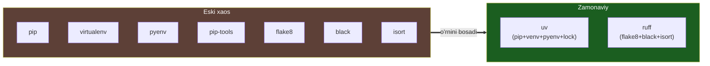
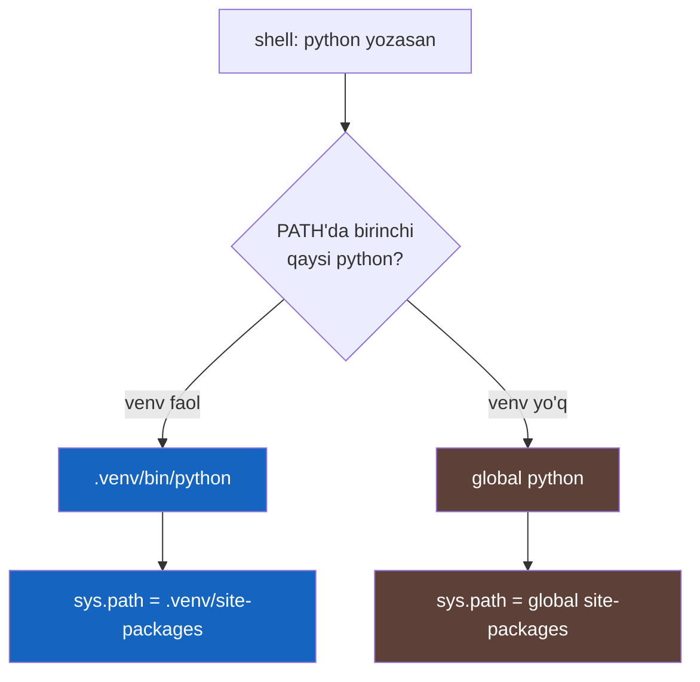
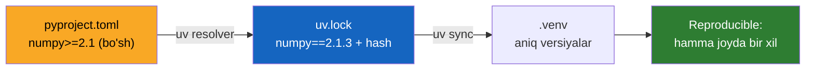

# 15. Tooling — venv, pyproject, ruff

## Muammo — nega bu kerak?

"Mening mashinamda ishlaydi" (works on my machine). Sen loyihani topshirasan,
hamkasbing ishga tushira olmaydi — versiyalar mos kelmaydi. Yoki ikki loyihang
bir kutubxonaning turli versiyasini talab qiladi, `pip install` bittasini
sindiradi.

ML'da bu og'riq keskinroq: training natijasi `numpy`, `torch`, `scikit-learn`
versiyalariga sezgir. Bir versiya farqi — boshqa metrikalar. **Reproducibility**
(qayta ishlab chiqarish) ML ishining o'zagi, va u toza tooling'dan boshlanadi.

> **Oltin qoida:** Har loyiha o'z izolyatsiyalangan muhitiga va aniq qotirilgan
> (locked) bog'liqliklariga ega bo'lsin. Global `pip install` — texnik qarz.

---

## Python tooling xaosi

Go'da bitta yaxlit toolchain bor: `go mod`, `go build`, `go fmt`, `go test`.
Python'da esa tarixan o'nlab asbob paydo bo'lgan:

`pip`, `virtualenv`, `venv`, `pyenv`, `pipenv`, `poetry`, `conda`,
`pip-tools`, `setuptools`, `requirements.txt`, `setup.py`, `setup.cfg`...

Har biri muammoning bir bo'lagini yechadi. Yangi kelgan odam qaysi birini
tanlashni bilmaydi. **Yaxshi xabar:** 2024-2025'da bu xaos sodda ikki asbobga
yig'ilyapti — **uv** (paket + muhit) va **ruff** (linter + formatter).



---

## Analogiya — har loyihaga alohida asbob qutisi

`venv` (virtual environment — izolyatsiyalangan Python muhiti) — bu har loyiha
uchun **alohida asbob qutisi**. Global o'rnatish esa bitta umumiy quti: ikki
loyiha bir asbobning turli versiyasini talab qilsa, urishadi.

**Analogiya chegarasi:** jismoniy asbob qutilaridan farqli, `venv`lar Python
**interpretatorining o'zini** baham ko'radi (symlink orqali) — faqat paketlar
izolyatsiya qilinadi, interpreter nusxalanmaydi.

---

## `venv` — aslida nima qiladi?

Ko'pchilik `venv`ni sehr deb biladi. Aslida u juda oddiy: bir papka yaratadi
va **PATH** bilan **sys.path**ni o'zgartiradi.

```bash
python -m venv .venv        # muhit yaratamiz
source .venv/bin/activate   # faollashtiramiz (Windows: .venv\Scripts\activate)
which python                # -> .../.venv/bin/python
pip install requests        # global emas, shu muhitga o'rnatiladi
deactivate                  # chiqamiz
```

`.venv` ichida nima bor:

```
.venv/
├── bin/                    # activate skripti + python symlink
│   ├── python  -> tizim python'iga symlink
│   ├── pip
│   └── activate
├── lib/python3.12/
│   └── site-packages/      # paketlar SHU YERGA o'rnatiladi
└── pyvenv.cfg              # qaysi bazaviy python'ga ishora qiladi
```

**Notional machine — faollashtirish aslida nima?** `activate` ikki ish qiladi:
1. `.venv/bin`ni **PATH boshiga** qo'shadi — endi `python` yozsang, shell
   avval shu papkani ko'radi.
2. `VIRTUAL_ENV` env-ni o'rnatadi.

Interpreter ishga tushganda o'zining `pyvenv.cfg`ini ko'rib, `sys.path`ga
**global emas, o'zining** `site-packages`ini qo'shadi. Shuning uchun
`import requests` global paketni emas, muhitdagi paketni topadi. Sehr yo'q —
faqat PATH va sys.path.



---

## `uv` — zamonaviy, tez, hammasi bir joyda

`uv` (Rust'da yozilgan Python paket va muhit menejeri) `pip` + `venv` +
`pyenv` + `pip-tools` o'rnini bitta asbob bilan bosadi. `pip`dan **10-100 barobar
tez**.

### Worked example — loyiha noldan

```bash
# --- 1-qadam: loyiha yaratamiz (pyproject.toml + .venv avtomatik) ---
uv init ml-pipeline
cd ml-pipeline

# --- 2-qadam: bog'liqlik qo'shamiz (pyproject + uv.lock yangilanadi) ---
uv add numpy pandas

# --- 3-qadam: faqat development uchun kerakli asboblar ---
uv add --dev pytest ruff

# --- 4-qadam: kodni muhit ichida ishga tushiramiz (activate shart emas!) ---
uv run python train.py

# --- 5-qadam: boshqa mashinada aynan o'sha muhitni tiklaymiz ---
uv sync
```

`uv add numpy` chiqishi (taxminan):

```
Resolved 5 packages in 42ms
Installed 5 packages in 88ms
 + numpy==2.1.3
 + pandas==2.2.3
 ...
```

`uv run` — muhitni `activate` qilmasdan kodni to'g'ri muhitda ishga tushiradi.
Har `uv run`dan oldin `uv.lock` va muhit `pyproject.toml`ga mos ekanini
avtomatik tekshiradi.

---

## `pyproject.toml` — yagona konfiguratsiya fayli

Ilgari loyiha konfiguratsiyasi bir nechta faylga sochilgan edi: `setup.py`,
`setup.cfg`, `requirements.txt`, `tox.ini`, har asbob uchun alohida. Endi hammasi
bitta **`pyproject.toml`**da (PEP 518/621 standarti).

```toml
[project]
name = "ml-pipeline"
version = "0.1.0"
requires-python = ">=3.12"
dependencies = [
    "numpy>=2.1",
    "pandas>=2.2",
]

[dependency-groups]
dev = [
    "pytest>=8.0",
    "ruff>=0.6",
]

[tool.ruff]
line-length = 100

[tool.ruff.lint]
select = ["E", "F", "I"]   # E=style, F=xatolar, I=import tartibi
```

Bir faylda: loyiha metadata'si, ishlab chiqarish bog'liqliklari
(`dependencies`), faqat development uchun bog'liqliklar (`dependency-groups.dev`),
va asboblar sozlamasi (`[tool.ruff]`).

> 🔎 `dependency-groups` — PEP 735'ning zamonaviy standarti. `dev` guruh
> maxsus: `uv sync` uni avtomatik o'rnatadi, lekin ishlab chiqarish (production)
> o'rnatishida tashlab ketish mumkin.

---

## Lock file g'oyasi — reproducibility poydevori

Bu eng muhim tushuncha. Ikki faylning roli **butunlay farq qiladi**:

| Fayl             | Nima yozadi                  | Kim yozadi |
| ---------------- | ---------------------------- | ---------- |
| `pyproject.toml` | **Bo'sh** cheklov: `numpy>=2.1` | Sen (qo'lda) |
| `uv.lock`        | **Aniq** hal: `numpy==2.1.3` + hash | uv (avtomatik) |

`pyproject.toml` "menga 2.1 yoki undan yangi numpy kerak" deydi. `uv.lock` esa
"aynan 2.1.3, mana uning hash'i" deydi — barcha tranzitiv bog'liqliklari bilan,
platformalar uchun. Bir xil `uv.lock` = bir xil muhit = **bir xil natija**.



Go analogisi: `go.mod` = pyproject (talablar), `go.sum` = uv.lock (aniq versiya
+ hash). Ikki ekotizim ham "bo'sh talab + qat'iy lock" modeliga keldi.

> **Qoida:** `uv.lock`ni git'ga **commit qil** — u reproducibility'ni saqlaydi.
> `.venv`ni esa git'ga solma (`.gitignore`ga qo'sh) — u lock'dan qayta
> tiklanadi.

---

## `ruff` — linter + formatter, bitta Rust asbobi

`ruff` — kod sifatini tekshirish (**lint**) va bir xil ko'rinishga keltirish
(**format**) — ikkalasini bitta juda tez asbob bilan bajaradi. `flake8`,
`black`, `isort`, `pyupgrade` — hammasining o'rnini bosadi.

```bash
ruff check .          # lint: xatolar, ishlatilmagan import, style
ruff check --fix .    # avtomatik tuzatiladiganlarini tuzatadi
ruff format .         # kodni formatlaydi (black uslubida)
```

Misol — iflos kod `dirty.py`:

```python
import os,sys
def  add( a,b ):
    x=a+b
    return x
```

`ruff format dirty.py` dan keyin:

```python
import os
import sys


def add(a, b):
    x = a + b
    return x
```

`ruff check dirty.py`:

```
dirty.py:1:8: F401 [*] `os` imported but unused
dirty.py:1:11: F401 [*] `sys` imported but unused
Found 2 errors.
[*] 2 fixable with the `--fix` option.
```

Bu **aynan** Go'ning `gofmt` (format) + `go vet` / `golangci-lint` (lint)
tandemiga mos. Farqi: Go'da ikki alohida asbob, Python'da endi bitta `ruff`.

---

## Go bilan to'liq solishtirish

| Vazifa                | Go                       | Python (zamonaviy) |
| --------------------- | ------------------------ | ------------------ |
| Bog'liqlik manifesti  | `go.mod`                 | `pyproject.toml` (`dependencies`) |
| Lock file             | `go.sum`                 | `uv.lock` |
| Bog'liqlik qo'shish   | `go get pkg`             | `uv add pkg` |
| O'rnatish / sync      | `go mod download`        | `uv sync` |
| Kodni ishga tushirish | `go run .`               | `uv run python ...` |
| Format                | `gofmt` / `go fmt`       | `ruff format` |
| Lint / statik tahlil  | `go vet`, `golangci-lint`| `ruff check` |
| Muhit izolyatsiyasi   | O'rnatilgan (modul asosli)| `venv` / `uv` |
| Versiya menejeri      | Bitta toolchain          | `uv python` / `pyenv` |

**Muhim tarixiy parallel — GOPATH vs global site-packages.** Go bir vaqtlar
butun kodni bitta global `GOPATH` ostiga majburlar edi — og'riqli, xuddi
Python'ning global `site-packages`iga o'xshab. Go modullari (2018) buni yechdi.
Python'da `venv` — aynan "global ish maydonidan qutulish"ning ekvivalenti. Ikki
til ham **global'dan har-loyiha modeliga** ko'chdi.

---

## ML jamoalarida amaliyot

Zamonaviy ML jamoasining standart to'plami: **uv + pyproject + ruff**, ustiga
Docker. Reproducibility uchun:

- `uv.lock`ni git'ga commit qil — har kim va CI aynan bir muhit oladi.
- Docker image'da `uv sync --frozen` — lock'dan chetlashmasdan o'rnatadi.
- `ruff check`ni CI'da majburiy qil — kod sifati avtomatik ushlanadi.

Bu training natijasini takrorlanuvchi qiladi: bir xil kod + bir xil `uv.lock`
= bir xil model.

---

## 🤔 O'ylab ko'r

```bash
# venv'ni faollashtirmasdan:
pip install pandas
```

Bu `pandas` qayerga o'rnatiladi va nima muammo bo'lishi mumkin?

<details>
<summary>💡 Javobni ko'rish</summary>

`venv` faol bo'lmagani uchun PATH'dagi birinchi `pip` — **global** (tizim)
Python'niki. Demak `pandas` global `site-packages`ga o'rnatiladi.

Muammolar: (1) barcha loyihalar shu global versiyani baham ko'radi — bir
loyiha yangi versiya talab qilsa, boshqasi sinadi; (2) tizim Python'ini
ifloslaydi (ba'zi OS'larda buzilishga olib keladi, shuning uchun `sudo pip`
xavfli); (3) loyiha `pyproject`/`lock`da qayd etilmaydi — reproducibility
yo'qoladi.

To'g'ri yo'l: `uv add pandas` (yoki avval `venv` faollashtirib, keyin pip).
</details>

---

## ⚠️ Ko'p uchraydigan xatolar

**1. `.venv`ni git'ga commit qilish.**
Noto'g'ri tasavvur: "muhit ham kod, saqlash kerak." Nega noto'g'ri: `.venv`
og'ir, platformaga bog'liq, va lock'dan qayta tiklanadi. To'g'risi: `.venv`ni
`.gitignore`ga qo'sh, `uv.lock`ni commit qil.

**2. Lock file'ni commit qilmaslik.**
Noto'g'ri: faqat `pyproject.toml`ni saqlash. Nega noto'g'ri: `>=2.1` keyinroq
boshqa versiyaga hal bo'lishi mumkin — reproducibility buziladi. To'g'risi:
`uv.lock`ni ham commit qil.

**3. Global Python'ga `sudo pip install`.**
Noto'g'ri: tizim Python'iga to'g'ridan-to'g'ri o'rnatish. Nega noto'g'ri: OS
paketlarini sindiradi, izolyatsiya yo'q. To'g'risi: doim `venv`/`uv` ishlat.

**4. `requirements.txt`ni pin'siz yozish.**
Noto'g'ri: `numpy` (versiyasiz). Nega noto'g'ri: har o'rnatish boshqa versiya
olishi mumkin. To'g'risi: lock file ishlat yoki hech bo'lmasa aniq versiya pin
qil.

**5. Muhitni faollashtirishni unutish.**
Noto'g'ri: `python script.py` (venv faol emas) — noto'g'ri interpreter. To'g'risi:
`uv run python script.py` (activate umuman shart emas) yoki avval `activate`.

---

## Xulosa

- Python tooling tarixan xaotik; zamonaviy yechim — `uv` + `ruff`.
- `venv` sehr emas: PATH + izolyatsiyalangan `site-packages` + `sys.path`.
- `uv` = pip + venv + pyenv + lock, Rust'da, 10-100x tez.
- `pyproject.toml` — yagona konfig: metadata, dependencies, dev-deps, tool sozlamalari.
- `pyproject` = bo'sh cheklov; `uv.lock` = aniq versiya + hash (reproducibility).
- `ruff` = linter + formatter bitta asbobda (gofmt + golangci-lint analogi).
- `uv.lock`ni commit qil, `.venv`ni yo'q.

## 🧠 Eslab qol

- Har loyihaga alohida muhit — global'ga o'rnatma.
- `venv` = PATH + o'z site-packages'i, boshqa hech narsa.
- Lock file = reproducibility (bir xil lock = bir xil natija).
- `uv add` -> pyproject + lock avtomatik yangilanadi.
- `ruff` = format + lint, `gofmt`+`golangci-lint`ning bittasi.

## ✅ O'z-o'zini tekshir (retrieval practice)

**1.** `activate` skripti aslida qanday mexanizm bilan `python`ni venv'nikiga
o'zgartiradi?

<details>
<summary>Javob</summary>

U `.venv/bin`ni PATH'ning **boshiga** qo'shadi. Shell endi `python`ni izlaganda
avval shu papkani ko'radi, shuning uchun venv'dagi interpreter ishga tushadi.
Interpreter esa `pyvenv.cfg`ga qarab `sys.path`ga o'z `site-packages`ini
qo'shadi. Sehr yo'q — PATH manipulyatsiyasi.
</details>

**2.** Nega `pyproject.toml`ni saqlash yetarli emas, `uv.lock` ham kerak?

<details>
<summary>Javob</summary>

`pyproject.toml` bo'sh cheklov beradi (`numpy>=2.1`), bu vaqt o'tib turli
versiyaga hal bo'lishi mumkin. `uv.lock` aniq versiyani + hash'ni + barcha
tranzitiv bog'liqliklarni qotiradi. Reproducibility uchun aynan lock kerak,
aks holda "bir xil kod, boshqa muhit" bo'ladi.
</details>

**3.** `ruff check` va `ruff format`ning farqi nima, Go'da ularga nima mos
keladi?

<details>
<summary>Javob</summary>

`ruff check` — lint: xatolar, ishlatilmagan import, potensial buglar (Go'da
`go vet`/`golangci-lint`). `ruff format` — kodni bir xil ko'rinishga keltirish
(Go'da `gofmt`). Biri "kod to'g'rimi", ikkinchisi "kod chiroylimi".
</details>

**4.** GOPATH muammosi va Python'ning `venv` yechimi orasidagi parallel nima?

<details>
<summary>Javob</summary>

GOPATH butun Go kodini bitta global maydon ostiga majburlar edi — loyihalar
izolyatsiyalanmagan. Bu Python'ning global `site-packages`iga o'xshaydi.
`venv` (va Go modullari) "global maydondan qutulib, har loyihaga alohida
izolyatsiya" g'oyasini beradi. Ikki til ham global'dan per-loyiha modeliga
o'tdi.
</details>

**5.** `uv run python script.py` `activate`dan nimasi bilan qulay?

<details>
<summary>Javob</summary>

`uv run` muhitni qo'lda faollashtirishni talab qilmaydi — o'zi to'g'ri muhitni
tanlaydi va, agar kerak bo'lsa, `uv.lock` bilan muhitni sinxronlaydi. Unutish
xatosi yo'q, CI/skriptlarda ishonchli.
</details>

## 🛠 Amaliyot

**1. Oson (Modify).** Bo'sh papkada `uv init demo` bilan loyiha yarat, `uv add
requests` qil va `pyproject.toml`da `dependencies` ro'yxatiga `requests`
qo'shilganini ko'r. `uv.lock` paydo bo'lganini tasdiqla.

<details>
<summary>Hint</summary>

`uv init demo && cd demo && uv add requests`. Keyin `cat pyproject.toml` va
`ls` — `uv.lock` faylini ko'rasan. `requests` `[project].dependencies`da
paydo bo'ladi.
</details>

**2. O'rta (faded example — to'ldir).** Quyidagi `pyproject.toml`ni to'ldir:

```toml
[project]
name = "sentiment-model"
version = "0.1.0"
requires-python = ">=3.12"
dependencies = [
    # TODO: numpy 2.1+ va scikit-learn 1.5+ qo'sh
]

[dependency-groups]
dev = [
    # TODO: pytest va ruff qo'sh (faqat development uchun)
]

[tool.ruff]
# TODO: line-length' ni 88 qilib qo'y
```

<details>
<summary>Hint</summary>

`dependencies` ichiga `"numpy>=2.1"`, `"scikit-learn>=1.5"`. `dev` ichiga
`"pytest>=8.0"`, `"ruff>=0.6"`. `[tool.ruff]` ostiga `line-length = 88`.
</details>

**3. Qiyin (Make).** Noldan: kichik loyiha yarat — bitta `add.py` moduli,
`test_add.py` testi. `uv` bilan `pytest` va `ruff`ni dev-dependency qilib
o'rnat. `uv run pytest` va `uv run ruff check .` ikkalasi ham yashil bo'lishiga
erish. `.gitignore`ga `.venv` qo'sh, `uv.lock`ni saqla.

<details>
<summary>Hint</summary>

`uv init proj`, `uv add --dev pytest ruff`, kod va testni yoz, `uv run ruff
format .` bilan formatla, keyin `uv run ruff check .` va `uv run pytest`.
`.gitignore`da `.venv/` bo'lsin.
</details>

## 🔁 Takrorlash

**Bog'liq oldingi mavzular:**
- 14-dars (Testing) — `pytest`ni aynan `uv add --dev` bilan o'rnatasan.
- 04-dars (Type hints) — `mypy` ham `dev-dependency`, `pyproject`da sozlanadi.
- 13-dars (Performance) — reproducible muhit = takrorlanuvchi benchmark.

**Takrorlash jadvali:**
- **Ertaga** — `pyproject.toml` vs `uv.lock` rolini yodingdan ayt.
- **3 kundan keyin** — `venv`ning ichki mexanizmini (PATH/sys.path) qayta tushuntir.
- **1 haftadan keyin** — Go vs Python tooling jadvalini eslab chiz.

**Feynman testi:** "Nega har loyihaga alohida muhit va lock file kerak"ni kod
so'zlaridan foydalanmasdan bir do'stingga 3 jumlada tushuntira olasanmi?

---

## Manbalar

- [uv documentation — Astral](https://docs.astral.sh/uv/)
- [ruff documentation — Astral](https://docs.astral.sh/ruff/)
- [Python packaging user guide](https://packaging.python.org/)
- [PEP 621 — pyproject.toml metadata](https://peps.python.org/pep-0621/)
