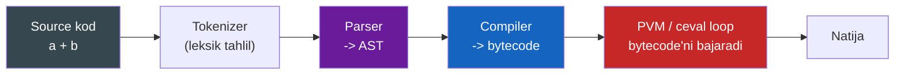
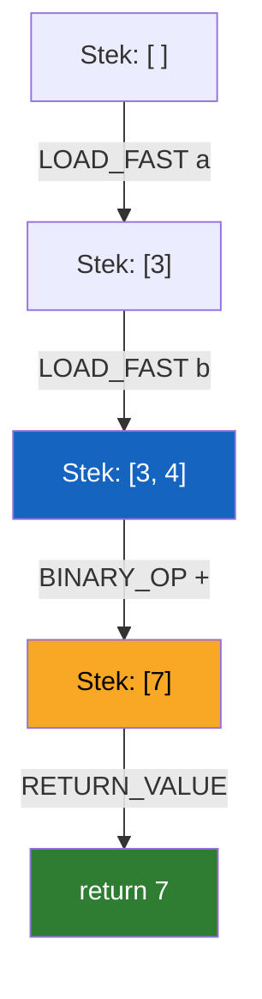
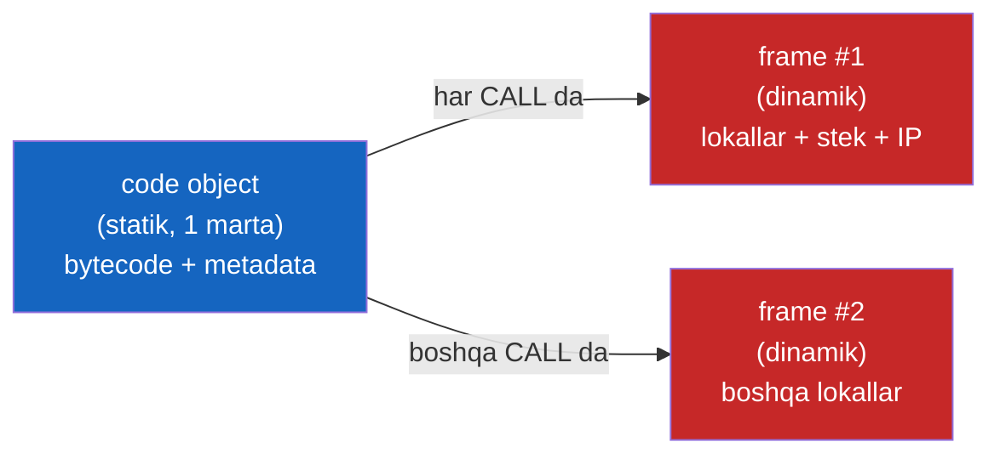
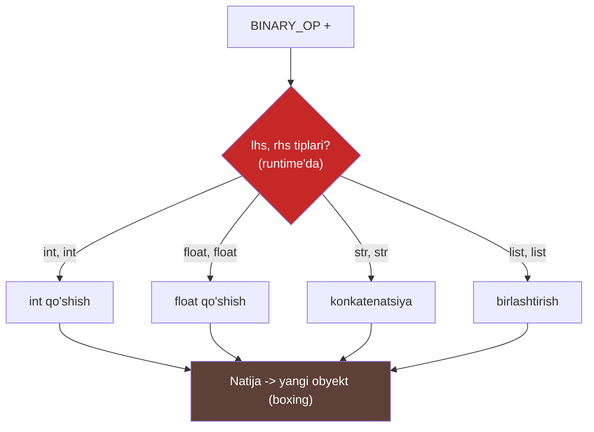
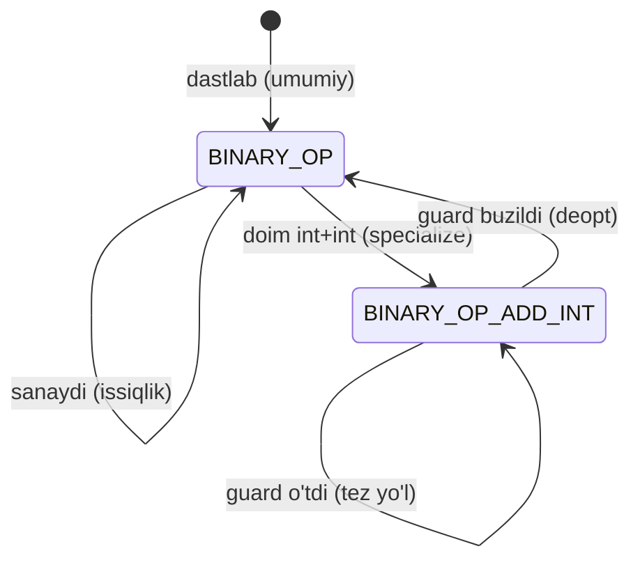
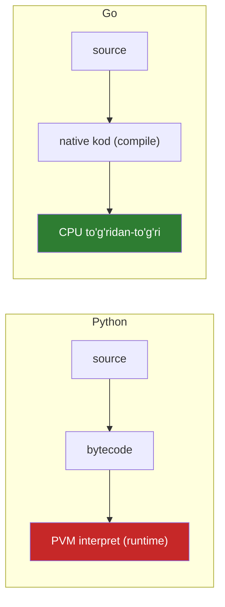

# 16. CPython internals

## Muammo — nega bu kerak?

Sen `a + b` yozding, Enter bosding, natija chiqdi. Oradagi mikrosekundlarda
CPython **juda ko'p ish** qildi: manba matnini tokenlarga bo'ldi, daraxt qurdi,
bytecode'ga kompilyatsiya qildi, virtual mashinada bajardi va har `+` da
tiplarni tekshirdi.

Postgres internals kursida sen "qora quti"ni ochding — endi Python'niki. Bu
darsdan keyin nima uchun Python dinamik va sekin ekanini (13-dars), nima uchun
`.pyc` fayllar paydo bo'lishini va nima uchun 3.11+ "bepulga" tezroq ishlashini
**mexanizm darajasida** tushunasan.

> **Oltin qoida:** Python "interpreted" degani "kompilyatsiya yo'q" degani emas.
> U **bytecode'ga** kompilyatsiya qilinadi, keyin virtual mashina (PVM) uni
> bajaradi. Farq — native mashina kodiga emas, o'z "yasama kodi"ga
> kompilyatsiya.

---

## Analogiya — kichik protsessor emulyatori

CPython — bu C'da yozilgan **kichik protsessor emulyatori** (virtual machine).
U o'ziga xos "mashina kodi"ni — bytecode'ni o'qiydi va bajaradi. Xuddi real CPU
mashina instruksiyalarini o'qigandek, PVM bytecode opcode'larini o'qiydi.

**Analogiya chegarasi:** real CPU **register-based** (registrlar bilan ishlaydi)
va instruksiyalari kremniyda. PVM esa **stack-based** (stek bilan ishlaydi) va
har "instruksiya" — bu bir bo'lak C kodi, kremniy emas. Shuning uchun sekinroq.

---

## To'liq quvur — source'dan natijagacha



1. **Tokenizer** — matnni tokenlarga bo'ladi (`a`, `+`, `b`).
2. **Parser** — tokenlardan **AST** (Abstract Syntax Tree — kodning daraxt
   ko'rinishi) quradi.
3. **Compiler** — AST'ni **bytecode**'ga aylantiradi (`code object` ichiga).
4. **PVM** (Python Virtual Machine) — `ceval` loop bytecode'ni birma-bir
   bajaradi.

Bosqich 1-3 bir marta (import/def paytida) bajariladi va natija `.pyc`ga
keshlanadi. Bosqich 4 — har chaqiruvda.

---

## `dis` moduli — bytecode'ni o'z ko'zing bilan ko'r

`dis` (disassembler — bytecode'ni o'qiladigan ko'rinishga chiqaruvchi modul)
sirni ochadi:

```python
import dis

# --- eng oddiy funksiya ---
def add(a, b):
    return a + b

dis.dis(add)
```

Natija (Python 3.12):

```
  1           0 RESUME                   0

  2           2 LOAD_FAST                0 (a)
              4 LOAD_FAST                1 (b)
              6 BINARY_OP                0 (+)
             10 RETURN_VALUE
```

### Har opcode'ni izohlaymiz

| Opcode        | Ma'nosi |
| ------------- | ------- |
| `RESUME 0`    | Funksiya kirishida bookkeeping (generator/coroutine'ni davom ettirish uchun ham). 3.11+ da paydo bo'lgan |
| `LOAD_FAST 0 (a)` | `a` lokal o'zgaruvchini **stekka push** qiladi. "fast" — dict emas, indeksli massiv orqali (tez) |
| `LOAD_FAST 1 (b)` | `b`ni stekka push qiladi |
| `BINARY_OP 0 (+)` | Stekdan `b` va `a`ni **pop** qiladi, `a+b`ni hisoblab, natijani push qiladi. `0` — bu `+` amali kodi |
| `RETURN_VALUE`| Stek tepasini pop qilib, funksiyadan qaytaradi |

> 🔎 Offset nega 6'dan **10**'ga sakraydi (8 yo'q)? `BINARY_OP` yonida yashirin
> **inline cache** (CACHE) uyasi bor — u offset 8'ni egallaydi, lekin `dis` uni
> default'da ko'rsatmaydi. `dis.dis(add, show_caches=True)` bilan ko'rish
> mumkin. Bu cache 3.11+ specializing interpreter uchun kerak (pastda).

---

## Stack-based VM — `add(3, 4)` qadam-baqadam

PVM — **stek mashinasi**. Har opcode stekka qiymat qo'yadi yoki oladi. Keling,
`add(3, 4)` chaqiruvida stek qanday o'zgarishini kuzatamiz:

| Bosqich | Opcode          | Stek (pastdan tepaga) | Izoh |
| ------- | --------------- | --------------------- | ---- |
| start   | —               | `[]`                  | bo'sh |
| 1       | `LOAD_FAST a`   | `[3]`                 | `a`=3 push |
| 2       | `LOAD_FAST b`   | `[3, 4]`              | `b`=4 push |
| 3       | `BINARY_OP +`   | `[7]`                 | 3,4 pop; 7 push |
| 4       | `RETURN_VALUE`  | `[]` -> `return 7`    | 7 pop, qaytaradi |



Diqqat: hech qanday "register" yo'q. Hamma amal **stek tepasida** bo'ladi. Bu
soddaligi uchun tanlangan — bytecode kompilyatori uchun oson, lekin
register-based CPU'dan sekinroq.

---

## Code object va Frame object — statik va dinamik

Ikki muhim obyekt bir-biridan farq qiladi. Buni chalkashtirish keng tarqalgan.

### Code object — statik, bir marta

**Code object** (`add.__code__`) — kompilyatsiya natijasi. **O'zgarmas**
(immutable), `def` bajarilganda bir marta yaratiladi. Ichida bytecode va u
haqidagi metama'lumot:

```python
def add(a, b):
    return a + b

# --- code object'ning ichiga qaraymiz ---
print(add.__code__.co_varnames)   # lokal o'zgaruvchilar
print(add.__code__.co_consts)     # konstantalar
print(add.__code__.co_argcount)   # argumentlar soni
print(add.__code__.co_stacksize)  # kerakli maksimal stek chuqurligi
```

Natija:

```
('a', 'b')
(None,)
2
2
```

`co_stacksize == 2` — chunki eng ko'p ikkita qiymat (a va b) bir vaqtda stekda
turadi. `co_varnames` — `LOAD_FAST 0`/`1`dagi indekslar shu nomlarga ishora
qiladi.

### Frame object — dinamik, har chaqiruvda

**Frame object** — har **CALL**da yangidan yaratiladi. U bajarilish holatini
ushlab turadi: lokal o'zgaruvchilar qiymati, qiymat steki, instruction pointer
(qaysi opcode'da turibmiz), code object'ga va chaqiruvchi frame'ga (caller)
ishora. Traceback'da ko'radigan narsang — aynan frame'lar zanjiri.



Bir code object'dan ko'p frame yaratilishi mumkin — masalan rekursiyada har
chaqiruv o'z frame'ini oladi, lekin code object bitta.

---

## `ceval` loop — ulkan switch (soddalashtirilgan model)

PVM'ning yuragi — `ceval.c` faylidagi ulkan loop. Uni soddalashtirilgan C
pseudokodda tasavvur qil:

```c
// Soddalashtirilgan model (haqiqiy kod DSL'dan generatsiya qilinadi)
for (;;) {
    opcode = *next_instr++;          // keyingi opcode'ni o'qi
    switch (opcode) {
        case LOAD_FAST:
            value = frame->locals[oparg];
            PUSH(value);
            break;
        case BINARY_OP:
            rhs = POP();
            lhs = POP();
            result = PyNumber_Add(lhs, rhs);  // <-- TYPE DISPATCH shu yerda!
            PUSH(result);
            break;
        case RETURN_VALUE:
            return POP();
    }
}
```

Har iteratsiya: opcode o'qi -> `switch` bilan mos `case`ga sakra -> stek bilan
ishla -> keyingisiga o't. Bu — "bytecode dispatch loop". Millionlab opcode
uchun bu loop millionlab marta aylanadi.

---

## Nega dynamic = sekin — `BINARY_OP` ichida nima bor

Yuqoridagi `PyNumber_Add(lhs, rhs)` — Python sekinligining aniq manzili. U
runtime'da:

1. `lhs` va `rhs` tiplarini tekshiradi (statik tip yo'q).
2. Mos `__add__`ni (C darajasida `tp_as_number->nb_add`) qidiradi.
3. `int+int`, `float+float`, `str+str`, `list+list`... — qaysi biri ekanini
   aniqlaydi.
4. Amalni bajarib, natijani **yangi obyektga o'raydi** (boxing).

Bu **har** `+` da qaytadan bo'ladi. Go'da esa `a + b` (agar `a, b` — `int`)
kompilyatsiya paytida bitta native `ADD` instruksiyasiga aylanadi — runtime'da
hech qanday tip tekshirish yo'q, chunki tiplar oldindan ma'lum.



Bu 13-darsdagi "nega Python sekin"ning aniq mexanizmi: har amaldagi **type
dispatch** va **boxing** — quti (switch) ichida yashiringan narxa.

---

## 3.11+ adaptive / specializing interpreter — nega yangi Python tezroq

Python 3.11 katta g'oyani joriy qildi (PEP 659): **specializing adaptive
interpreter**. Fikr sodda — agar biror `BINARY_OP` doim `int + int` ko'rayotgan
bo'lsa, nega har safar umumiy dispatch qilish kerak?

**Quickening** (opcode'ni tezroq variantiga almashtirish) jarayoni:

1. `BINARY_OP` bir necha marta ishlaydi, har safar `int+int` ko'radi (inline
   cache uning "issiqligini" sanaydi).
2. Yetarli "issiq" bo'lsa, interpreter opcode'ni joyida
   **`BINARY_OP_ADD_INT`**ga almashtiradi (specialization).
3. `BINARY_OP_ADD_INT` umumiy dispatch qilmaydi: faqat "hali ham ikkalasi
   int'mi?" (guard) tekshiradi, ha bo'lsa to'g'ridan-to'g'ri int qo'shadi.
4. Agar guard buzilsa (masalan endi `float` keldi), **deoptimization** —
   umumiy `BINARY_OP`ga qaytadi.



Natija: 3.11 o'rtacha ~25%, ba'zi yuklarda 60%'gacha tezroq — **sen kodni
o'zgartirmasdan**. 3.12 va 3.13 bu ro'yxatni kengaytirdi (ko'proq opcode
specialize qilinadi).

> ⚠️ Muhim ogohlantirish: specialize bo'lgan opcode ham hali **interpreter**
> — har amalda guard tekshiradi. Bu Go'ning kompilyatsiya qilingan native
> kodiga hech qachon yetmaydi. Shuning uchun issiq sonli loop'lar uchun hali
> ham NumPy/native kerak (13-dars bilan bog'lanadi).

---

## Go compiled model bilan yakuniy solishtirish

| Bosqich          | Python (CPython)              | Go |
| ---------------- | ----------------------------- | -- |
| Kompilyatsiya    | source -> bytecode (runtime'da, def/import'da) | source -> native mashina kodi (ahead-of-time) |
| Bajarish         | PVM `ceval` loop interpretatsiya qiladi | CPU to'g'ridan-to'g'ri ishlatadi |
| Tip tekshirish   | Har amalda (runtime dispatch) | Kompilyatsiya paytida (bir marta) |
| `a + b`          | `BINARY_OP` -> `PyNumber_Add` | bitta native `ADD` instruksiya |
| Optimizatsiya    | Runtime specialization (PEP 659) | Compile-time (SSA, inlining) |
| Kelishuv (trade) | Moslashuvchanlik, dinamizm    | Tezlik, statik xavfsizlik |



Python bytecode'ni **runtime'da** interpret qiladi va dinamizm uchun tezlikni
qurbon qiladi. Go native kodni **oldindan** kompilyatsiya qiladi va tezlik
uchun dinamizmni qurbon qiladi. Ikkalasi ham to'g'ri — shunchaki turli
maqsadlar uchun.

---

## 🤔 O'ylab ko'r

Bu funksiyani disassemble qilsang, `dis` nima ko'rsatadi (Python 3.12)?

```python
import dis

def answer():
    return 42

dis.dis(answer)
```

<details>
<summary>💡 Javobni ko'rish</summary>

Python 3.12 chiqishi:

```
  1           0 RESUME                   0

  2           2 RETURN_CONST             1 (42)
```

E'tibor ber: `LOAD_CONST` + `RETURN_VALUE` emas! Python 3.12 **`RETURN_CONST`**
opcode'ini qo'shdi — konstantani qaytarish ikki opcode o'rniga bittada bo'ladi.
Bu ham xuddi specialization ruhida optimizatsiya. `42` esa `answer.__code__.co_consts`
ichida saqlanadi.

(Agar 3.11'da sinasang: `LOAD_CONST 1 (42)` keyin `RETURN_VALUE` — ikki opcode.
Bu bytecode har versiyada o'zgarishining yaqqol misoli.)
</details>

---

## ⚠️ Ko'p uchraydigan xatolar

**1. `.pyc` = mashina kodi deb o'ylash.**
Noto'g'ri tasavvur: "`.pyc` — kompilyatsiya qilingan native fayl, tez ishlaydi."
Nega noto'g'ri: `.pyc` — bu **bytecode**, hali ham PVM interpret qiladi.
To'g'risi: u faqat parse/compile bosqichini keshlaydi, bajarishni tezlashtirmaydi.

**2. Bytecode barqaror deb o'ylash.**
Noto'g'ri: opcode'larga yoki `.pyc` formatiga tayanib kod yozish. Nega noto'g'ri:
bytecode **har minor versiyada** o'zgaradi (3.11 -> 3.12 -> 3.13). To'g'risi:
bytecode'ni o'rganish uchun ishlat, unga bog'lanib qolma.

**3. Python "kompilyatsiya qilinmaydi" deb o'ylash.**
Noto'g'ri: "Python — interpreted, kompilyatsiya yo'q." Nega noto'g'ri: u
**bytecode'ga** kompilyatsiya qilinadi. To'g'risi: farq — native emas, bytecode.

**4. Code object va frame'ni chalkashtirish.**
Noto'g'ri: "har chaqiruvda kod qayta kompilyatsiya qilinadi." Nega noto'g'ri:
code object bir marta yaratiladi (statik), har chaqiruvda faqat **frame** (dinamik)
yaratiladi. To'g'risi: bytecode qayta ishlatiladi, holat esa har frame'da yangi.

**5. Specializing interpreter Python'ni C tezligiga chiqaradi deb o'ylash.**
Noto'g'ri: "3.11 endi C kabi tez." Nega noto'g'ri: specialize bo'lgan opcode ham
guard bilan interpret qilinadi. To'g'risi: u sezilarli tezlashtiradi, lekin
native (Go/C) darajasiga yetmaydi.

---

## Xulosa

- Python: source -> tokenizer -> AST -> compiler -> bytecode -> PVM.
- `dis` moduli bytecode'ni ko'rsatadi; `LOAD_FAST`, `BINARY_OP`, `RETURN_VALUE`.
- PVM — **stack-based** VM: opcode'lar stek tepasida ishlaydi.
- Code object — statik (bir marta), frame object — dinamik (har chaqiruvda).
- `ceval` loop — ulkan `switch`; har opcode uchun bir marta aylanadi.
- Dynamic = sekin: `BINARY_OP`da har safar type dispatch + boxing.
- 3.11+ specializing interpreter: issiq opcode'lar `BINARY_OP_ADD_INT`ga
  aylanadi (quickening) — bepulga tezroq, lekin native emas.
- Go compiled: tiplar compile'da ma'lum, `a+b` = bitta native instruksiya.

## 🧠 Eslab qol

- `.pyc` = bytecode, native emas — PVM baribir interpret qiladi.
- PVM stek mashinasi: push/pop/dispatch.
- Code object bir marta, frame har chaqiruvda.
- Sekinlik manbai: `BINARY_OP` ichidagi runtime type dispatch.
- 3.11+ tezroq, chunki issiq opcode'lar specialize bo'ladi.

## ✅ O'z-o'zini tekshir (retrieval practice)

**1.** `dis.dis(add)`da offset 6'dan nega to'g'ridan 10'ga sakraydi, 8 qayerda?

<details>
<summary>Javob</summary>

Offset 8'da `BINARY_OP`ning yashirin **inline cache** (CACHE) uyasi turibdi.
`dis` uni default'da ko'rsatmaydi (`show_caches=True` bilan ko'rinadi). Bu
cache 3.11+ specializing interpreter uchun — opcode "issiqligi" va specialization
holatini saqlaydi.
</details>

**2.** Rekursiv funksiya `n` marta chaqirilsa, nechta code object va nechta
frame yaratiladi?

<details>
<summary>Javob</summary>

**Bitta** code object (kompilyatsiya bir marta, `def`da) va **`n` ta** frame
(har chaqiruv o'z lokallari, steki, IP'si bilan alohida frame oladi). Traceback'da
shu frame'lar zanjiri ko'rinadi. Code = statik, frame = dinamik.
</details>

**3.** Nega `BINARY_OP` Python'ni sekin qiladi, Go'da esa `a+b` tez?

<details>
<summary>Javob</summary>

`BINARY_OP` runtime'da `PyNumber_Add`ni chaqiradi — u har safar `lhs`/`rhs`
tiplarini tekshirib, mos `__add__`ni topadi (type dispatch) va natijani obyektga
o'raydi (boxing). Go'da tiplar compile'da ma'lum, `a+b` bitta native `ADD`
instruksiyaga aylanadi — runtime tekshirish yo'q.
</details>

**4.** `BINARY_OP_ADD_INT` guard'i buzilsa (masalan endi float keladi) nima
bo'ladi?

<details>
<summary>Javob</summary>

**Deoptimization**: specialize bo'lgan opcode umumiy `BINARY_OP`ga qaytadi,
chunki uning tez yo'li faqat int+int uchun to'g'ri edi. Interpreter moslashuvchan
— tur o'zgarsa, umumiy yo'lga tushadi, keyin yana boshqa specialization sinashi
mumkin.
</details>

**5.** Nima uchun bir hamkasbing bytecode opcode'lariga tayanib skript yozsa,
bu yomon fikr?

<details>
<summary>Javob</summary>

Bytecode CPython'ning ichki tafsiloti — u **har minor versiyada** o'zgaradi
(3.11 -> 3.12 -> 3.13 opcode'larni qo'shdi/o'zgartirdi, masalan `RETURN_CONST`).
Unga tayangan kod keyingi Python'da sinadi. Bytecode'ni tushunish uchun o'rgan,
lekin ishlab chiqarish mantig'ini unga bog'lama.
</details>

## 🛠 Amaliyot

**1. Oson (Modify).** `add(a, b)`ni `dis` bilan disassemble qil, keyin uni
`return a * b`ga o'zgartirib qayta disassemble qil. `BINARY_OP` operand kodi
(`0 (+)` -> `5 (*)`) o'zgarganini kuzat.

<details>
<summary>Hint</summary>

`dis.dis(mul)` chiqishida `BINARY_OP` yonidagi izoh `(*)`ga aylanadi. Opcode
o'zi bir xil (`BINARY_OP`), faqat operand (amal kodi) boshqa — chunki
specialization kelmaguncha, hamma binar amal bitta umumiy opcode bilan boradi.
</details>

**2. O'rta (faded example — to'ldir).** Quyidagi kodni to'ldirib, code
object'ning ichki tuzilishini o'rgan:

```python
import dis

def greet(name):
    msg = "Salom, " + name
    return msg

# TODO: greet' ni disassemble qil (dis.dis)
# TODO: greet.__code__.co_varnames' ni chop et — nechta lokal bor?
# TODO: greet.__code__.co_consts' ni chop et — "Salom, " qayerda?
# TODO: greet.__code__.co_stacksize' ni chop et va nega shu son ekanini tushuntir
```

<details>
<summary>Hint</summary>

`co_varnames` = `('name', 'msg')` (argument + lokal). `co_consts` ichida
`'Salom, '` va `None` bo'ladi. `co_stacksize` — bir vaqtda stekda turadigan
maksimal qiymatlar soni (`"Salom, "` va `name` — 2).
</details>

**3. Qiyin (Make).** Noldan: bir funksiya yoz (masalan `if x > 0: return x
else: return -x` — absolyut qiymat), uni `dis` bilan disassemble qil va har
opcode uchun stek holatini qadam-baqadam qog'ozga chiz (yuqoridagi jadval
uslubida). `POP_JUMP_IF_FALSE` yoki `COMPARE_OP` kabi shart opcode'larini izohla.

<details>
<summary>Hint</summary>

`dis` chiqishida `COMPARE_OP` (`>`), `POP_JUMP_IF_FALSE` (shart yolg'on bo'lsa
sakrash), `UNARY_NEGATIVE` (`-x`) ko'rinadi. Har `LOAD_FAST` stekka push qiladi,
`COMPARE_OP` ikkitasini pop qilib boolean push qiladi, jump esa boolean'ni
pop qilib IP'ni o'zgartiradi.
</details>

## 🔁 Takrorlash

**Bog'liq oldingi mavzular:**
- 13-dars (Performance) — bu darsdagi type dispatch = o'sha darsdagi "nega sekin".
- 12-dars (Memory model) — obyekt, refcount, boxing bu yerda mexanizm darajasida.
- 09-dars (Threading va GIL) — GIL ham `ceval` loop atrofida ishlaydi.
- 02-dars (Decorator) — `__code__`, first-class function bu yerda ochiladi.

**Takrorlash jadvali:**
- **Ertaga** — `add(3,4)` stek evolutsiyasini yodingdan jadval qilib chiz.
- **3 kundan keyin** — code object vs frame object farqini qayta ayt.
- **1 haftadan keyin** — specializing interpreter (quickening/deopt)ni tushuntir.

**Feynman testi:** "Python `a+b`ni qanday bajaradi va nega Go'dan sekin"ni kod
so'zlaridan foydalanmasdan bir do'stingga 3 jumlada tushuntira olasanmi?
(Ishora: bytecode, stek mashinasi, runtime type dispatch.)

## Keyingi o'qish

Bu mavzuni chuqurlashtirmoqchi bo'lsang — **"CPython Internals"** (Anthony
Shaw) kitobi. U CPython manba kodini bosqichma-bosqich ochadi: tokenizer,
parser, compiler, `ceval` loop, obyekt tizimi, memory allocator, GIL —
hammasini haqiqiy C kodi bilan. Postgres/Go internals kurslarini yoqtirgan
bo'lsang, bu kitob aynan shu ruhda.

---

## Manbalar

- [dis — Python bytecode disassembler docs](https://docs.python.org/3/library/dis.html)
- [PEP 659 — Specializing Adaptive Interpreter](https://peps.python.org/pep-0659/)
- CPython Internals (Anthony Shaw) — CPython manba kodi bo'yicha to'liq qo'llanma
- [CPython manba kodi — python/cpython](https://github.com/python/cpython)
